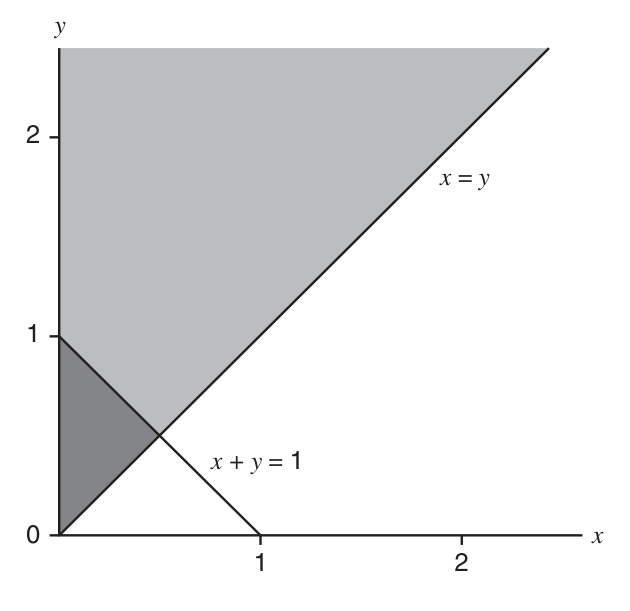
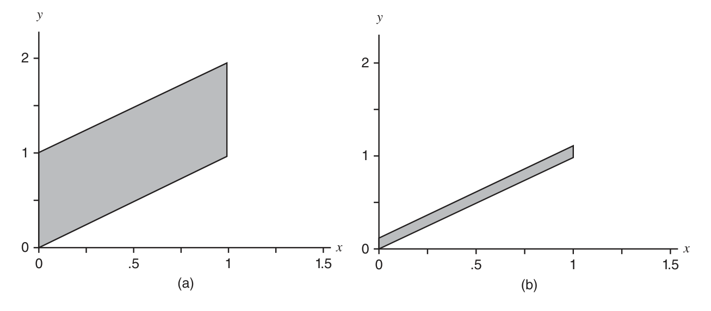
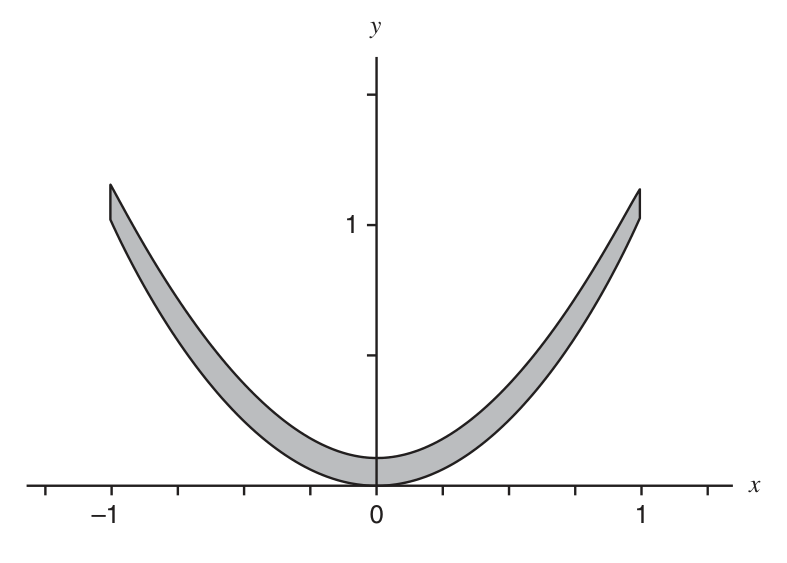
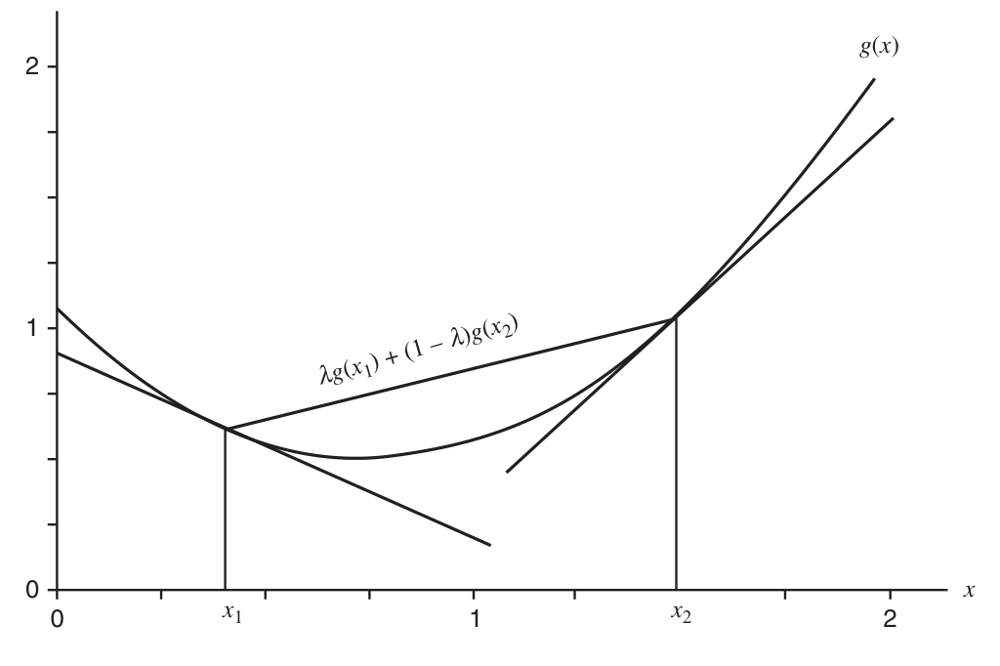
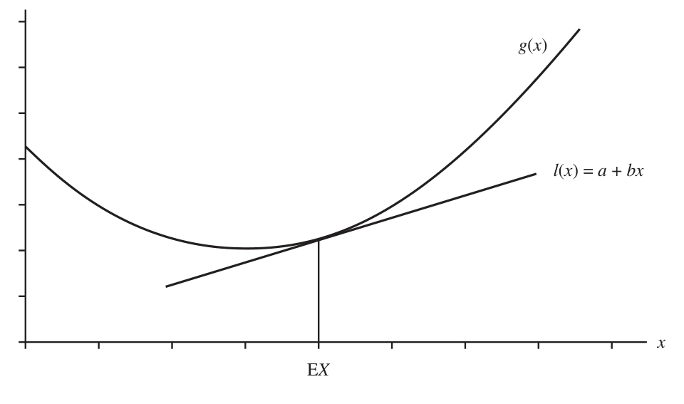

# 第 4 章　多元随机变量（Multiple Random Variables）

> *“I confess that I have been blind as a mole, but it is better to learn wisdom late than never to learn it at all.”*
>
> 我承认自己一直像鼹鼠一样瞎，但迟学到智慧总比永远学不到好。
>
> ——歇洛克·福尔摩斯（《歪唇男人》）

## 4.1 联合分布与边缘分布（Joint and Marginal Distributions）

在前几章中，我们讨论了概率模型以及只涉及一个随机变量的事件的概率计算，这类模型称为一元（univariate）模型。本章讨论涉及多于一个随机变量的概率模型——自然地称为多元（multivariate）模型。

在实验情景中，只观测一个随机变量的取值是非常罕见的：一场实验收集的全部数据只是一个数值，这种实验实在少见。例如，设想一项旨在了解某人群健康特征的实验：如果唯一收集的数据是一个人的体重，那这个实验就太寒酸了。更合理的做法是测量人群中若干人的体重；这些不同的体重是对不同随机变量的观测——每个被测者对应一个。多重观测也可能因为对每个人测量若干身体特征而产生：例如除体重外还测量体温、身高与血压。对这些不同特征的观测同样可以建模为不同随机变量的观测。因此我们需要知道如何描述并使用同时处理多个随机变量的概率模型。前几节我们主要讨论二元（bivariate）模型，即涉及两个随机变量的模型。

回顾定义 1.4.1：（一元）随机变量被定义为从样本空间 $S$ 到实数的函数。由若干随机变量构成的随机向量（random vector）可以类似定义。

> **定义 4.1.1（随机向量）**
>
> ***$n$ 维随机向量***（n-dimensional random vector）是从样本空间 $S$ 到 $\Re^n$（$n$ 维欧氏空间）的函数。

例如，若给样本空间的每一点联系一个有序数对，即平面 $\Re^2$ 中的一个点 $(x, y)$，我们就定义了一个二维（或二元）随机向量 $(X, Y)$。例 4.1.2 说明了这一点。

> **例 4.1.2（掷骰子的样本空间）**
>
> 考虑掷两枚均匀骰子的试验。该试验的样本空间有 36 个等可能点，已在例 1.3.10 中介绍。例如样本点 $(3, 3)$ 表示两枚骰子都显示 3；样本点 $(4, 1)$ 表示第一枚显示 4、第二枚显示 1；等等。现在给这 36 个点各联系两个数 $X$ 与 $Y$，令
>
> $$
> X = \text{两枚骰子点数之和}， \qquad Y = |\text{两枚骰子点数之差}|.
> $$
>
> 对样本点 $(3,3)$：$X = 3 + 3 = 6$，$Y = |3 - 3| = 0$；对 $(4,1)$：$X = 5$，$Y = 3$。这也正是样本点 $(1, 4)$ 的 $X$、$Y$ 值。对 36 个样本点逐个计算 $X$ 与 $Y$ 的值，我们就定义了二元随机向量 $(X, Y)$。
>
> 定义了随机向量 $(X, Y)$ 后，即可讨论由 $(X, Y)$ 表出的事件的概率。由 $X$ 与 $Y$ 表出的事件的概率，由样本空间 $S$ 中相应事件的概率给出。$P(X = 5\ \text{且}\ Y = 3)$ 是多少？可以验证：使 $X = 5$ 且 $Y = 3$ 的样本点只有 $(4, 1)$ 与 $(1, 4)$。故事件“$X = 5$ 且 $Y = 3$”发生当且仅当事件 $\{(4,1), (1,4)\}$ 发生。由于 $S$ 的 36 个样本点等可能，
>
> $$
> P\bigl( \{(4,1), (1,4)\} \bigr) = \frac{2}{36} = \frac{1}{18},
> $$
>
> 故
>
> $$
> P(X = 5\ \text{且}\ Y = 3) = \frac{1}{18}.
> $$
>
> 此后我们写 $P(X = 5, Y = 3)$ 表示 $P(X = 5\ \text{且}\ Y = 3)$，逗号读作“且”。类似地，$P(X = 6, Y = 0) = \tfrac{1}{36}$，因为产生这组值的样本点只有 $(3, 3)$。更复杂的事件技巧相同：例如 $P(X = 7, Y \leq 4) = \tfrac{4}{36} = \tfrac{1}{9}$，因为使 $X = 7$ 且 $Y \leq 4$ 的四个样本点是 $(4,3)$、$(3,4)$、$(5,2)$ 与 $(2,5)$。

上面定义的随机向量 $(X, Y)$ 称为离散随机向量，因为它只有可数个（此例中有限个）可能取值。对离散随机向量，由 $f(x, y) = P(X = x, Y = y)$ 定义的函数 $f(x, y)$ 可用于计算由 $(X, Y)$ 表出的任何事件的概率。

> **定义 4.1.3（联合 pmf）**
>
> 设 $(X, Y)$ 是离散二元随机向量。则从 $\Re^2$ 到 $\Re$ 的函数 $f(x, y) = P(X = x, Y = y)$ 称为 $(X, Y)$ 的***联合概率质量函数***（joint probability mass function，联合 pmf）。若有必要强调 $f$ 是向量 $(X, Y)$ 而非其他向量的联合 pmf，则使用记号 $f_{X,Y}(x, y)$。

$(X, Y)$ 的联合 pmf 完全定义了随机向量 $(X, Y)$ 的概率分布，正如一元离散随机变量的 pmf 完全定义其分布。对例 4.1.2 中由掷一对骰子定义的 $(X, Y)$，共有 21 个可能的 $(X, Y)$ 取值；这些值的 $f(x, y)$ 见表 4.1.1。其中两个值 $f(5,3) = \tfrac{1}{18}$ 与 $f(6,0) = \tfrac{1}{36}$ 已在上面算得，其余由类似推理得出。联合 pmf $f(x, y)$ 对一切 $(x, y) \in \Re^2$ 有定义，而不仅是表 4.1.1 的 21 对；对其余任何 $(x, y)$，$f(x, y) = P(X = x, Y = y) = 0$。

表 4.1.1　 联合 pmf $f(x, y)$ 的取值（原书 Table 4.1.1）

| $y \setminus x$ | 2 | 3 | 4 | 5 | 6 | 7 | 8 | 9 | 10 | 11 | 12 |
|:---:|:---:|:---:|:---:|:---:|:---:|:---:|:---:|:---:|:---:|:---:|:---:|
| 0 | $\frac{1}{36}$ | 0 | $\frac{1}{36}$ | 0 | $\frac{1}{36}$ | 0 | $\frac{1}{36}$ | 0 | $\frac{1}{36}$ | 0 | $\frac{1}{36}$ |
| 1 | 0 | $\frac{1}{18}$ | 0 | $\frac{1}{18}$ | 0 | $\frac{1}{18}$ | 0 | $\frac{1}{18}$ | 0 | $\frac{1}{18}$ | 0 |
| 2 | 0 | 0 | $\frac{1}{18}$ | 0 | $\frac{1}{18}$ | 0 | $\frac{1}{18}$ | 0 | $\frac{1}{18}$ | 0 | 0 |
| 3 | 0 | 0 | 0 | $\frac{1}{18}$ | 0 | $\frac{1}{18}$ | 0 | $\frac{1}{18}$ | 0 | 0 | 0 |
| 4 | 0 | 0 | 0 | 0 | $\frac{1}{18}$ | 0 | $\frac{1}{18}$ | 0 | 0 | 0 | 0 |
| 5 | 0 | 0 | 0 | 0 | 0 | $\frac{1}{18}$ | 0 | 0 | 0 | 0 | 0 |

联合 pmf 可用于计算由 $(X, Y)$ 表出的任何事件的概率。设 $A$ 是 $\Re^2$ 的任意子集，则

$$
P\bigl( (X, Y) \in A \bigr) = \sum_{(x,y) \in A} f(x, y).
$$

由于 $(X, Y)$ 离散，$f(x, y)$ 至多在可数个点 $(x, y)$ 上非零，故即使 $A$ 含不可数多个点，该和仍可解释为可数和。例如取 $A = \{(x, y) : x = 7\ \text{且}\ y \leq 4\}$，这是 $\Re^2$ 中一条半无限直线；但由表 4.1.1 可见，$A$ 中使 $f(x, y)$ 非零的只有 $(x, y) = (7, 1)$ 与 $(x, y) = (7, 3)$，故

$$
P(X = 7, Y \leq 4) = P\bigl( (X, Y) \in A \bigr) = f(7, 1) + f(7, 3) = \frac{1}{18} + \frac{1}{18} = \frac{1}{9},
$$

与例 4.1.2 中按定义通过样本点算出的值一致。通常用联合 pmf 比用基本定义更简便。

随机向量函数的期望与一元随机变量一样计算。设 $g(x, y)$ 是对离散随机向量 $(X, Y)$ 一切可能取值 $(x, y)$ 定义的实值函数，则 $g(X, Y)$ 本身是随机变量，其期望为

$$
\mathrm{E} g(X, Y) = \sum_{(x,y) \in \Re^2} g(x, y)\, f(x, y).
$$

> **例 4.1.4（例 4.1.2 的继续）**
>
> 对表 4.1.1 给出联合 pmf 的 $(X, Y)$，$XY$ 的平均值是多少？取 $g(x, y) = xy$，把表 4.1.1 中 21 个 $(x, y)$ 点的 $xy\, f(x, y)$ 算出并求和，即得 $\mathrm{E} XY = \mathrm{E} g(X, Y)$：
>
> $$
> \mathrm{E} XY = (2)(0)\frac{1}{36} + (4)(0)\frac{1}{36} + \cdots + (8)(4)\frac{1}{18} + (7)(5)\frac{1}{18} = \frac{11}{18}.
> $$

把随机变量 $X$ 换成随机向量 $(X, Y)$ 后，期望算子仍具有定理 2.2.5 所列的性质。例如若 $g_1(x, y)$ 与 $g_2(x, y)$ 是两个函数，$a$、$b$、$c$ 是常数，则

$$
\mathrm{E}\bigl( a g_1(X, Y) + b g_2(X, Y) + c \bigr) = a\, \mathrm{E} g_1(X, Y) + b\, \mathrm{E} g_2(X, Y) + c.
$$

这些性质与一元情形完全一样地由求和性质得出（见习题 4.2）。

任何离散二元随机向量 $(X, Y)$ 的联合 pmf 必具某些性质：对任意 $(x, y)$，$f(x, y) \geq 0$（因为它是概率）；且由于 $(X, Y)$ 必属于 $\Re^2$，

$$
\sum_{(x,y) \in \Re^2} f(x, y) = P\bigl( (X, Y) \in \Re^2 \bigr) = 1.
$$

事实上，任何从 $\Re^2$ 到 $\Re$ 的非负函数，只要至多在可数个 $(x, y)$ 对上非零且求和为 1，就是某个二元离散随机向量 $(X, Y)$ 的联合 pmf。于是通过定义 $f(x, y)$，我们可以不接触基本样本空间 $S$ 就为 $(X, Y)$ 定义概率模型。

> **例 4.1.5（骰子的联合 pmf）**
>
> 定义
>
> $$
> f(0, 0) = f(0, 1) = \frac{1}{6}, \qquad f(1, 0) = f(1, 1) = \frac{1}{3}, \qquad f(x, y) = 0\ \text{（对其他任何}\ (x,y)\text{）}.
> $$
>
> 则 $f(x, y)$ 非负且求和为 1，故是某个二元随机向量 $(X, Y)$ 的联合 pmf。可用 $f(x, y)$ 计算诸如 $P(X = Y) = f(0,0) + f(1,1) = \tfrac{1}{2}$ 的概率。这一切都无需提及样本空间 $S$。事实上，有许多样本空间及其上的函数都给出这一联合 pmf。例如：设 $S$ 是掷两枚均匀骰子的 36 点样本空间，令“第一枚至多显示 2”时 $X = 0$、“第一枚显示多于 2”时 $X = 1$；“第二枚显示奇数”时 $Y = 0$、“第二枚显示偶数”时 $Y = 1$。习题 4.3 将证明这一定义导致上述 $(X, Y)$ 的概率分布。

即使我们为随机向量 $(X, Y)$ 考虑概率模型，感兴趣的仍可能只是向量中单个随机变量的概率或期望。例如也许想知道 $P(X = 2)$。$X$ 本身是第 1 章意义上的随机变量，其概率分布由 pmf $f_X(x) = P(X = x)$ 描述（如前所述，现在用下标把 $f_X(x)$ 与联合 pmf $f_{X,Y}(x, y)$ 区分开）。我们称 $f_X(x)$ 为 $X$ 的***边缘 pmf***（marginal pmf），以强调它是 $X$ 的 pmf、但处于给出向量 $(X, Y)$ 联合分布的概率模型背景之中。定理 4.1.6 表明 $X$ 或 $Y$ 的边缘 pmf 极易由联合 pmf 算出。

> **定理 4.1.6（由联合 pmf 求边缘 pmf）**
>
> 设 $(X, Y)$ 是具有联合 pmf $f_{X,Y}(x, y)$ 的离散二元随机向量。则 $X$ 与 $Y$ 的边缘 pmf $f_X(x) = P(X = x)$ 与 $f_Y(y) = P(Y = y)$ 由
>
> $$
> f_X(x) = \sum_{y \in \Re} f_{X,Y}(x, y) \qquad\text{与}\qquad f_Y(y) = \sum_{x \in \Re} f_{X,Y}(x, y)
> $$
>
> 给出。
>
> **证明**　证 $f_X(x)$ 的结果，$f_Y(y)$ 类似。对任意 $x \in \Re$，令 $A_x = \{(x, y) : -\infty < y < \infty\}$，即平面上第一坐标等于 $x$ 的直线。则对任意 $x \in \Re$，
>
> $$
> \begin{aligned}
> f_X(x) &= P(X = x)\\
> &= P(X = x,\ -\infty < Y < \infty) \qquad （P(-\infty < Y < \infty) = 1）\\
> &= P\bigl( (X, Y) \in A_x \bigr) \qquad （A_x\ \text{的定义}）\\
> &= \sum_{(x,y) \in A_x} f_{X,Y}(x, y) = \sum_{y \in \Re} f_{X,Y}(x, y).
> \end{aligned}
> $$
>
> ∎

> **例 4.1.7（骰子的边缘 pmf）**
>
> 利用定理 4.1.6，可从表 4.1.1 的联合分布算出 $X$ 与 $Y$ 的边缘分布。计算 $Y$ 的边缘 pmf 时，对 $Y$ 的每个可能值在 $X$ 的可能值上求和：
>
> $$
> \begin{aligned}
> f_Y(0) &= f_{X,Y}(2, 0) + f_{X,Y}(4, 0) + f_{X,Y}(6, 0) + f_{X,Y}(8, 0) + f_{X,Y}(10, 0) + f_{X,Y}(12, 0)\\
> &= \frac{1}{6}.
> \end{aligned}
> $$
>
> 类似地，
>
> $$
> f_Y(1) = \frac{5}{18}, \qquad f_Y(2) = \frac{2}{9}, \qquad f_Y(3) = \frac{1}{6}, \qquad f_Y(4) = \frac{1}{9}, \qquad f_Y(5) = \frac{1}{18}.
> $$
>
> 注意 $f_Y(0) + f_Y(1) + \cdots + f_Y(5) = 1$，理应如此，因为这正是 $Y$ 的全部六个可能取值。

$X$ 或 $Y$ 的边缘 pmf 与第 1 章定义的 pmf 相同。边缘 pmf 可用于计算只涉及 $X$ 或只涉及 $Y$ 的概率与期望；但要计算同时涉及 $X$ 与 $Y$ 的概率或期望，必须使用联合 pmf。

> **例 4.1.8（骰子概率）**
>
> 用例 4.1.7 算得的 $Y$ 的边缘 pmf 可以计算
>
> $$
> P(Y < 3) = f_Y(0) + f_Y(1) + f_Y(2) = \frac{1}{6} + \frac{5}{18} + \frac{2}{9} = \frac{2}{3}.
> $$
>
> 又有
>
> $$
> \mathrm{E} Y^3 = 0^3 f_Y(0) + \cdots + 5^3 f_Y(5) = 20\,\frac{11}{18} \qquad （即\ \tfrac{371}{18}）.
> $$

$X$ 与 $Y$ 的边缘分布（由边缘 pmf $f_X(x)$ 与 $f_Y(y)$ 描述）并不能完全刻画 $X$ 与 $Y$ 的联合分布。事实上，有许多不同的联合分布具有相同的边缘分布。因此，企图仅凭边缘 pmf $f_X(x)$ 与 $f_Y(y)$ 的知识确定联合 pmf $f_{X,Y}(x, y)$ 是无望的。下例说明这一点。

> **例 4.1.9（相同边缘，不同联合 pmf）**
>
> 定义联合 pmf：
>
> $$
> f(0, 0) = \frac{1}{12}, \qquad f(1, 0) = \frac{5}{12}, \qquad f(0, 1) = f(1, 1) = \frac{3}{12}, \qquad f(x, y) = 0\ \text{（对其余一切值）}.
> $$
>
> $Y$ 的边缘 pmf 为 $f_Y(0) = f(0,0) + f(1,0) = \tfrac{1}{2}$，$f_Y(1) = f(0,1) + f(1,1) = \tfrac{1}{2}$；$X$ 的边缘 pmf 为 $f_X(0) = \tfrac{1}{3}$，$f_X(1) = \tfrac{2}{3}$。现在验证：例 4.1.5 中那个显然不同的联合 pmf，其 $X$ 与 $Y$ 的边缘 pmf 恰与刚才算出的完全相同。因此，只知道边缘 pmf 无法确定联合 pmf。联合 pmf 含有 $(X, Y)$ 分布的额外信息，这些信息在边缘分布中找不到。

至此我们讨论的是离散二元随机向量。也可以考虑分量为连续随机变量的随机向量。连续随机向量的概率分布通常像一元情形那样用密度函数描述。

> **定义 4.1.10（联合 pdf）**
>
> 从 $\Re^2$ 到 $\Re$ 的函数 $f(x, y)$ 称为连续二元随机向量 $(X, Y)$ 的***联合概率密度函数***（joint probability density function，联合 pdf），如果对每个 $A \subset \Re^2$，
>
> $$
> P\bigl( (X, Y) \in A \bigr) = \int_A \int f(x, y)\, dx\, dy.
> $$

联合 pdf 的用法与一元 pdf 完全一样，只是现在的积分是平面上集合上的二重积分。记号 $\iint_A$ 的意思是：积分限的设置使函数在所有 $(x, y) \in A$ 上积分。连续随机向量函数的期望与离散情形定义相同，只是积分代替求和、pdf 代替 pmf：若 $g(x, y)$ 是实值函数，则 $g(X, Y)$ 的期望定义为

$$
\mathrm{E} g(X, Y) = \int_{-\infty}^{\infty} \int_{-\infty}^{\infty} g(x, y)\, f(x, y)\, dx\, dy. \tag{4.1.1}
$$

重要的是认识到：联合 pdf 对一切 $(x, y) \in \Re^2$ 都有定义。pdf 可以在一个大集合 $A$ 上等于 0（若 $P((X,Y) \in A) = 0$），但 pdf 在 $A$ 的点上仍有定义。

$X$ 与 $Y$ 的边缘概率密度函数也与离散情形一样定义，积分代替求和。边缘 pdf 可用于计算只涉及 $X$ 或 $Y$ 的概率或期望。具体地，$X$ 与 $Y$ 的边缘 pdf 为

$$
f_X(x) = \int_{-\infty}^{\infty} f(x, y)\, dy, \quad -\infty < x < \infty; \qquad
f_Y(y) = \int_{-\infty}^{\infty} f(x, y)\, dx, \quad -\infty < y < \infty. \tag{4.1.2}
$$

任何满足“对一切 $(x, y) \in \Re^2$ 有 $f(x, y) \geq 0$ 且 $\int_{-\infty}^{\infty} \int_{-\infty}^{\infty} f(x, y)\, dx\, dy = 1$”的函数 $f(x, y)$，都是某个连续二元随机向量 $(X, Y)$ 的联合 pdf。下面两个例子演示联合 pdf 的这些概念。

> **例 4.1.11（计算联合概率——I）**
>
> 定义联合 pdf
>
> $$
> f(x, y) = \begin{cases} 6 x y^2 & 0 < x < 1\ \text{且}\ 0 < y < 1,\\ 0 & \text{其他}. \end{cases}
> $$
>
> （此后约定：定义中未明确提及的 $(x, y)$ 值处 $f(x, y) = 0$。）首先验证 $f(x, y)$ 确是联合 pdf。在定义的范围内 $f(x, y) \geq 0$ 相当明显。计算 $f(x, y)$ 在整个平面上的积分时，注意 $f(x, y)$ 在单位方形之外为 0，故平面上的积分等于方形上的积分：
>
> $$
> \int_{-\infty}^{\infty} \int_{-\infty}^{\infty} f(x, y)\, dx\, dy = \int_0^1 \int_0^1 6 x y^2\, dx\, dy = \int_0^1 \Bigl[ 3 x^2 y^2 \Bigr]_0^1 dy = \int_0^1 3 y^2\, dy = \Bigl[ y^3 \Bigr]_0^1 = 1.
> $$
>
> 现在考虑计算 $P(X + Y \geq 1)$ 这样的概率。令 $A = \{(x, y) : x + y \geq 1\}$，把概率写成 $P((X, Y) \in A)$。由定义 4.1.10，须在集合 $A$ 上积分联合 pdf；但联合 pdf 在单位方形之外为 0，故在 $A$ 上积分等价于只在 $A \cap$ 单位方形上积分。集合 $A$ 是平面东北部的半平面，其在单位方形内的部分是由直线 $x = 1$、$y = 1$ 与 $x + y = 1$ 围成的三角形区域。可写
>
> $$
> \begin{aligned}
> A &= \{(x, y) : x + y \geq 1,\ 0 < x < 1,\ 0 < y < 1\}\\
> &= \{(x, y) : x \geq 1 - y,\ 0 < x < 1,\ 0 < y < 1\}\\
> &= \{(x, y) : 1 - y \leq x < 1,\ 0 < y < 1\}.
> \end{aligned}
> $$
>
> 这就给出所需的积分限：
>
> $$
> P(X + Y \geq 1) = \iint_A f(x, y)\, dx\, dy = \int_0^1 \int_{1-y}^{1} 6 x y^2\, dx\, dy = \frac{9}{10}.
> $$
>
> 利用 (4.1.2) 可计算 $X$ 或 $Y$ 的边缘 pdf。例如计算 $f_X(x)$：当 $x \geq 1$ 或 $x \leq 0$ 时 $f(x, y)$ 对一切 $y$ 为 0，故
>
> $$
> f_X(x) = \int_{-\infty}^{\infty} f(x, y)\, dy = 0, \qquad x \geq 1\ \text{或}\ x \leq 0.
> $$
>
> 当 $0 < x < 1$ 时，$f(x, y)$ 仅在 $0 < y < 1$ 时非零，故
>
> $$
> f_X(x) = \int_{-\infty}^{\infty} f(x, y)\, dy = \int_0^1 6 x y^2\, dy = \Bigl. 2 x y^3 \Bigr|_0^1 = 2x.
> $$
>
> 这个 $X$ 的边缘 pdf 现在可用于计算只涉及 $X$ 的概率，例如
>
> $$
> P\Bigl( \frac{1}{2} < X < \frac{3}{4} \Bigr) = \int_{1/2}^{3/4} 2x\, dx = \frac{5}{16}.
> $$

> **例 4.1.12（计算联合概率——II）**
>
> 作为联合 pdf 的另一例，设 $f(x, y) = e^{-y}$，$0 < x < y < \infty$。虽然 $e^{-y}$ 不依赖 $x$，但 $f(x, y)$ 确实是 $x$ 的函数，因为其非零集合依赖于 $x$。用示性函数写更明显：
>
> $$
> f(x, y) = e^{-y}\, I_{\{(u, v) : 0 < u < v < \infty\}}(x, y).
> $$
>
> 要计算 $P(X + Y \geq 1)$，可以在集合 $A = \{(x, y) : x + y \geq 1\}$ 与 $f(x, y)$ 非零集合的交上积分。画出这些集合：该交是一个无界区域（图 4.1.1 中较浅的阴影），三条边为直线 $x = y$、$x + y = 1$ 与 $x = 0$。在此区域上积分须至少把区域拆成两块才能写出合适的积分限。
>
> 在集合 $B = \{(x, y) : x + y < 1\}$ 与 $f(x, y)$ 非零集合的交——由直线 $x = y$、$x + y = 1$ 与 $x = 0$ 围成的三角形区域（图 4.1.1 中较深的阴影）——上积分更容易。于是
>
> $$
> P(X + Y \geq 1) = 1 - P(X + Y < 1) = 1 - \int_0^{1/2} \int_{x}^{1-x} e^{-y}\, dy\, dx
> = 1 - \int_0^{1/2} \bigl( e^{-x} - e^{-(1 - x)} \bigr)\, dx = 2 e^{-1/2} - e^{-1}.
> $$
>
> 这说明：对这类问题，把所涉集合画出来以确定合适的积分限，几乎总是有帮助的。

*图 4.1.1　 例 4.1.12 中的区域（原书 Figure 4.1.1）*

$(X, Y)$ 的联合概率分布也可以完全用联合 cdf（累积分布函数）描述，而非联合 pmf 或联合 pdf。联合 cdf 是函数

$$
F(x, y) = P(X \leq x,\ Y \leq y) \qquad \text{（对一切 } (x, y) \in \Re^2\text{）}.
$$

联合 cdf 对离散随机向量通常不太方便使用。但对连续二元随机向量，与一元情形一样有重要关系：

$$
F(x, y) = \int_{-\infty}^{x} \int_{-\infty}^{y} f(s, t)\, dt\, ds.
$$

由二元微积分基本定理，这意味着在 $f(x, y)$ 的连续点处

$$
\frac{\partial^2 F(x, y)}{\partial x\, \partial y} = f(x, y). \tag{4.1.3}
$$

当能求出 $F(x, y)$ 的表达式时，这一关系很有用：计算混合偏导数即可得联合 pdf。

## 4.2 条件分布与独立性（Conditional Distributions and Independence）

观测两个随机变量 $(X, Y)$ 时，两个变量的取值往往是相关的。例如在从人群抽样时，设 $X$ 表示一个人的身高，$Y$ 表示同一人的体重。若被告知 $X = 73$ 英寸，我们当然比被告知 $X = 41$ 英寸时更愿意相信 $Y > 200$ 磅。关于 $X$ 取值的知识给了我们关于 $Y$ 取值的信息，即使它并不能确切告诉我们 $Y$ 的值。给定 $X$ 值的知识后关于 $Y$ 的条件概率，可以用 $(X, Y)$ 的联合分布计算。但有时关于 $X$ 的知识对 $Y$ 不提供任何信息。本节讨论与条件概率有关的这些课题。

若 $(X, Y)$ 是离散随机向量，则形如 $P(Y = y \mid X = x)$ 的条件概率完全按定义 1.3.2 解释。对可数个（可能有限个）使 $P(X = x) > 0$ 的 $x$ 值，按定义 $P(Y = y \mid X = x)$ 就是 $P(X = x, Y = y) / P(X = x)$：公式中事件 $A$ 取 $\{Y = y\}$、事件 $B$ 取 $\{X = x\}$。对固定的 $x$，可对所有可能的 $y$ 计算 $P(Y = y \mid X = x)$，从而在已知观察到 $X = x$ 的条件下评估 $Y$ 取各种值的概率。用 $X$ 与 $Y$ 的联合 pmf 与边缘 pmf 表出：$P(X = x, Y = y) = f(x, y)$，$P(X = x) = f_X(x)$。由此得如下定义。

> **定义 4.2.1（离散条件 pmf）**
>
> 设 $(X, Y)$ 是具有联合 pmf $f(x, y)$ 与边缘 pmf $f_X(x)$、$f_Y(y)$ 的离散二元随机向量。对任何使 $P(X = x) = f_X(x) > 0$ 的 $x$，***给定 $X = x$ 时 $Y$ 的条件 pmf***（conditional pmf）是记作 $f(y \mid x)$ 的 $y$ 的函数，定义为
>
> $$
> f(y \mid x) = P(Y = y \mid X = x) = \frac{f(x, y)}{f_X(x)}.
> $$
>
> 对任何使 $P(Y = y) = f_Y(y) > 0$ 的 $y$，***给定 $Y = y$ 时 $X$ 的条件 pmf*** 是记作 $f(x \mid y)$ 的 $x$ 的函数，定义为
>
> $$
> f(x \mid y) = P(X = x \mid Y = y) = \frac{f(x, y)}{f_Y(y)}.
> $$

既然我们称 $f(y \mid x)$ 为 pmf，就应验证这个 $y$ 的函数确实定义了一个随机变量的 pmf。首先，由 $f(x, y) \geq 0$ 与 $f_X(x) > 0$ 知对每个 $y$ 有 $f(y \mid x) \geq 0$。其次，

$$
\sum_{y} f(y \mid x) = \frac{\sum_y f(x, y)}{f_X(x)} = \frac{f_X(x)}{f_X(x)} = 1.
$$

故 $f(y \mid x)$ 确是 pmf，可以按通常方式用于计算在已知 $X = x$ 发生的条件下涉及 $Y$ 的概率。

> **例 4.2.2（计算条件概率）**
>
> 定义 $(X, Y)$ 的联合 pmf：
>
> $$
> f(0, 10) = f(0, 20) = \frac{2}{18}, \qquad f(1, 10) = f(1, 30) = \frac{3}{18},
> $$
>
> $$
> f(1, 20) = \frac{4}{18}, \qquad f(2, 30) = \frac{4}{18}.
> $$
>
> 用定义 4.2.1 可对 $X$ 的每个可能值 $x = 0, 1, 2$ 计算 $Y$ 的条件 pmf。首先 $X$ 的边缘 pmf 为
>
> $$
> f_X(0) = f(0, 10) + f(0, 20) = \frac{4}{18}, \qquad
> f_X(1) = f(1, 10) + f(1, 20) + f(1, 30) = \frac{10}{18}, \qquad
> f_X(2) = f(2, 30) = \frac{4}{18}.
> $$
>
> 对 $x = 0$：$f(0, y)$ 仅在 $y = 10$ 与 $y = 20$ 时为正，故 $f(y \mid 0)$ 仅在这两点为正：
>
> $$
> f(10 \mid 0) = \frac{f(0, 10)}{f_X(0)} = \frac{2/18}{4/18} = \frac{1}{2}, \qquad
> f(20 \mid 0) = \frac{f(0, 20)}{f_X(0)} = \frac{1}{2}.
> $$
>
> 即已知 $X = 0$ 时，$Y$ 的条件分布是在两点 $y = 10$ 与 $y = 20$ 上各赋概率 $\tfrac{1}{2}$ 的离散分布。
>
> 对 $x = 1$：$f(y \mid 1)$ 在 $y = 10, 20, 30$ 处为正：
>
> $$
> f(10 \mid 1) = f(30 \mid 1) = \frac{3/18}{10/18} = \frac{3}{10}, \qquad
> f(20 \mid 1) = \frac{4/18}{10/18} = \frac{4}{10};
> $$
>
> 对 $x = 2$：
>
> $$
> f(30 \mid 2) = \frac{4/18}{4/18} = 1.
> $$
>
> 后一结果反映了联合 pmf 中显而易见的事实：若已知 $X = 2$，则必知 $Y = 30$。
>
> 其他条件概率可用这些条件 pmf 计算，例如
>
> $$
> P(Y > 10 \mid X = 1) = f(20 \mid 1) + f(30 \mid 1) = \frac{7}{10},
> \qquad\text{或}\qquad
> P(Y > 10 \mid X = 0) = f(20 \mid 0) = \frac{1}{2}.
> $$

若 $X$ 与 $Y$ 是连续随机变量，则对每个 $x$ 有 $P(X = x) = 0$。要计算 $P(Y > 200 \mid X = 73)$ 这类条件概率，不能用定义 1.3.2，因为分母 $P(X = 73)$ 为零。然而实际上我们确实观测到 $X$ 的值：若在测量精度内看到 $X = 73$，这一知识可能给我们关于 $Y$ 的信息（如本节开头身高体重的例子所示）。事实证明，当 $X$ 与 $Y$ 都连续时，定义“给定 $X = x$ 时 $Y$ 的条件概率分布”的恰当方式与离散情形类似，只是把 pmf 换成 pdf（见杂记 4.9.3）。

> **定义 4.2.3（连续条件 pdf）**
>
> 设 $(X, Y)$ 是具有联合 pdf $f(x, y)$ 与边缘 pdf $f_X(x)$、$f_Y(y)$ 的连续二元随机向量。对任何使 $f_X(x) > 0$ 的 $x$，***给定 $X = x$ 时 $Y$ 的条件 pdf*** 是记作 $f(y \mid x)$ 的 $y$ 的函数，定义为
>
> $$
> f(y \mid x) = \frac{f(x, y)}{f_X(x)}.
> $$
>
> 对任何使 $f_Y(y) > 0$ 的 $y$，***给定 $Y = y$ 时 $X$ 的条件 pdf*** 是记作 $f(x \mid y)$ 的 $x$ 的函数，定义为
>
> $$
> f(x \mid y) = \frac{f(x, y)}{f_Y(y)}.
> $$

验证 $f(x \mid y)$ 与 $f(y \mid x)$ 确为 pdf，可以用与之前验证定义 4.2.1 定义了真 pmf 相同的步骤，只是把求和换成积分。

条件 pdf 或 pmf 除用于计算概率外，还可用于计算期望。只要记住 $f(y \mid x)$ 作为 $y$ 的函数是一个 pdf 或 pmf，按先前使用无条件 pdf 或 pmf 的方式使用它即可。若 $g(Y)$ 是 $Y$ 的函数，则“给定 $X = x$ 时 $g(Y)$ 的条件期望”记作 $\mathrm{E}(g(Y) \mid x)$，在离散与连续情形分别为

$$
\mathrm{E}\bigl( g(Y) \mid x \bigr) = \sum_{y} g(y)\, f(y \mid x) \qquad\text{与}\qquad
\mathrm{E}\bigl( g(Y) \mid x \bigr) = \int_{-\infty}^{\infty} g(y)\, f(y \mid x)\, dy.
$$

条件期望具有定理 2.2.5 所列通常期望的全部性质。而且 $\mathrm{E}(Y \mid X)$ 提供了基于 $X$ 知识对 $Y$ 的最佳猜测，推广了例 2.2.6 的结果（见习题 4.13）。

> **例 4.2.4（计算条件 pdf）**
>
> 如例 4.1.12，设连续随机向量 $(X, Y)$ 具有联合 pdf $f(x, y) = e^{-y}$（$0 < x < y < \infty$）。要计算给定 $X = x$ 时 $Y$ 的条件 pdf。$X$ 的边缘 pdf 计算如下：若 $x \leq 0$，$f(x, y)$ 对一切 $y$ 为 0，故 $f_X(x) = 0$；若 $x > 0$，$f(x, y) > 0$ 仅当 $y > x$。于是
>
> $$
> f_X(x) = \int_{-\infty}^{\infty} f(x, y)\, dy = \int_x^{\infty} e^{-y}\, dy = e^{-x}.
> $$
>
> 即边缘上 $X$ 服从指数分布。用定义 4.2.3，对任意 $x > 0$（即 $f_X(x) > 0$ 的那些值）可计算给定 $X = x$ 时 $Y$ 的条件分布：
>
> $$
> f(y \mid x) = \frac{f(x, y)}{f_X(x)} = \frac{e^{-y}}{e^{-x}} = e^{-(y - x)}, \qquad \text{若}\ y > x;
> $$
>
> $$
> f(y \mid x) = \frac{f(x, y)}{f_X(x)} = \frac{0}{e^{-x}} = 0, \qquad \text{若}\ y \leq x.
> $$
>
> 于是给定 $X = x$ 时，$Y$ 服从一个指数分布，其中 $x$ 是 $Y$ 分布的位置参数，$\beta = 1$ 是尺度参数。$Y$ 的条件分布随 $x$ 的每个值而不同。由此
>
> $$
> \mathrm{E}(Y \mid X = x) = \int_x^{\infty} y\, e^{-(y - x)}\, dy = 1 + x.
> $$
>
> 由 $f(y \mid x)$ 所描述的概率分布的方差称为“给定 $X = x$ 时 $Y$ 的条件方差”，记作 $\mathrm{Var}(Y \mid x)$。按方差的通常定义，
>
> $$
> \mathrm{Var}(Y \mid x) = \mathrm{E}(Y^2 \mid x) - \bigl( \mathrm{E}(Y \mid x) \bigr)^2.
> $$
>
> 应用于本例：
>
> $$
> \mathrm{Var}(Y \mid x) = \int_x^{\infty} y^2 e^{-(y - x)}\, dy - \Bigl( \int_x^{\infty} y\, e^{-(y - x)}\, dy \Bigr)^{2} = 1.
> $$
>
> 此例中给定 $X = x$ 时 $Y$ 的条件方差对一切 $x$ 相同；在其他情形则可能随 $x$ 不同。可以把这一条件方差与 $Y$ 的无条件方差比较：$Y$ 的边缘分布是 $\mathrm{gamma}(2, 1)$，其 $\mathrm{Var} Y = 2$。已知 $X = x$ 后，$Y$ 的变异大大降低。

例 4.2.4 的模型可以这样落实到物理情景：设有两只灯泡，各自的点亮时长是随机变量 $X$ 与 $Z$；$X$ 与 $Z$ 独立且都有 pdf $e^{-x}$（$x > 0$）。第一只灯泡先点亮，它烧坏的瞬间第二只点亮。现在观测 $X$（第一只烧坏的时刻）与 $Y = X + Z$（第二只烧坏的时刻）。已知 $X = x$（第一只烧坏、第二只开始点亮的时刻）时，$Y = Z + x$。这就像例 3.5.3：$x$ 起位置参数的作用，此时 $Y$ 的 pdf（即给定 $X = x$ 时 $Y$ 的条件 pdf）为 $f(y \mid x) = f_Z(y - x) = e^{-(y - x)}$（$y > x$）。

给定 $X = x$ 时 $Y$ 的条件分布对每个 $x$ 值可能是不同的概率分布：我们实际上拥有 $Y$ 的一个分布族，每个 $x$ 对应一个。要描述整个族时，我们使用短语“$Y \mid X$ 的分布”。例如若 $X$ 是取正整数值的随机变量，且给定 $X = x$ 时 $Y$ 的条件分布是 $\mathrm{binomial}(x, p)$，则可以说 $Y \mid X$ 的分布是 $\mathrm{binomial}(X, p)$，或写 $Y \mid X \sim \mathrm{binomial}(X, p)$。凡使用符号 $Y \mid X$ 或把随机变量作为概率分布的参数，我们描述的都是条件概率分布族。

联合 pdf 或 pmf 有时通过给定条件 $f(y \mid x)$ 与边缘 $f_X(x)$ 来定义；此时定义给出 $f(x, y) = f(y \mid x) f_X(x)$。这类模型在 4.4 节进一步讨论。

还要注意 $\mathrm{E}(g(Y) \mid x)$ 是 $x$ 的函数：对每个 $x$ 值，$\mathrm{E}(g(Y) \mid x)$ 是通过计算相应积分或和得到的实数。因此 $\mathrm{E}(g(Y) \mid X)$ 是一个随机变量，其值依赖于 $X$ 的值；若 $X = x$，随机变量 $\mathrm{E}(g(Y) \mid X)$ 的取值为 $\mathrm{E}(g(Y) \mid x)$。于是在例 4.2.4 中可写 $\mathrm{E}(Y \mid X) = 1 + X$。

在上面所有例子中，给定 $X = x$ 时 $Y$ 的条件分布随 $x$ 而不同。有些情形下，“$X = x$”的知识并不比我们已有的关于 $Y$ 的信息更多。$X$ 与 $Y$ 之间的这一重要关系称为独立性。正如第 1 章的独立事件，更方便的做法是对称地定义独立性，然后推导诸如“条件分布等于边缘分布”的性质。

> **定义 4.2.5（独立随机变量）**
>
> 设 $(X, Y)$ 是具有联合 pdf 或 pmf $f(x, y)$ 与边缘 pdf 或 pmf $f_X(x)$、$f_Y(y)$ 的二元随机向量。若对每个 $x \in \Re$ 与 $y \in \Re$ 都有
>
> $$
> f(x, y) = f_X(x)\, f_Y(y), \tag{4.2.1}
> $$
>
> 则称 $X$ 与 $Y$ 为***独立随机变量***（independent random variables）。

若 $X$ 与 $Y$ 独立，则给定 $X = x$ 时 $Y$ 的条件 pdf 为

$$
f(y \mid x) = \frac{f(x, y)}{f_X(x)} = \frac{f_X(x)\, f_Y(y)}{f_X(x)} = f_Y(y),
$$

与 $x$ 的取值无关。于是对任意 $A \subset \Re$ 与 $x \in \Re$，$P(Y \in A \mid x) = \int_A f(y \mid x)\, dy = \int_A f_Y(y)\, dy = P(Y \in A)$：“$X = x$”的知识对 $Y$ 不提供额外信息。

定义 4.2.5 有两种用法。可以从一个联合 pdf 或 pmf 出发，检查 $X$ 与 $Y$ 是否独立：此时须对每一个 $x$ 与 $y$ 值验证 (4.2.1)。或者希望定义一个 $X$ 与 $Y$ 独立的模型：考虑 $X$ 与 $Y$ 代表什么，可能表明“$X = x$”的知识不应提供关于 $Y$ 的信息；此时可先指定 $X$ 与 $Y$ 的边缘分布，再按 (4.2.1) 把联合分布定义为乘积。

> **例 4.2.6（检查独立性——I）**
>
> 考虑离散二元随机向量 $(X, Y)$，其联合 pmf 为
>
> $$
> f(10, 1) = f(20, 1) = f(20, 2) = \frac{1}{10}, \qquad
> f(10, 2) = f(10, 3) = \frac{1}{5}, \qquad
> f(20, 3) = \frac{3}{10}.
> $$
>
> 容易算出边缘 pmf：
>
> $$
> f_X(10) = f_X(20) = \frac{1}{2}, \qquad f_Y(1) = \frac{1}{5}, \quad f_Y(2) = \frac{3}{10}, \quad f_Y(3) = \frac{1}{2}.
> $$
>
> $X$ 与 $Y$ 不独立，因为 (4.2.1) 并非对一切 $x$ 与 $y$ 成立。例如
>
> $$
> f(10, 3) = \frac{1}{5} \neq \frac{1}{2} \cdot \frac{1}{2} = f_X(10)\, f_Y(3).
> $$
>
> 若要 $X$ 与 $Y$ 独立，关系 (4.2.1) 必须对每一组 $x$、$y$ 成立。注意 $f(10, 1) = \tfrac{1}{10} = \tfrac{1}{2} \cdot \tfrac{1}{5} = f_X(10) f_Y(1)$：(4.2.1) 对某些 $x$、$y$ 成立并不能保证独立，必须检查所有取值。

直接用 (4.2.1) 验证独立性需要知道 $f_X(x)$ 与 $f_Y(y)$。下面的引理使验证容易一些。

> **引理 4.2.7（因子化判据）**
>
> 设 $(X, Y)$ 是具有联合 pdf 或 pmf $f(x, y)$ 的二元随机向量。则 $X$ 与 $Y$ 独立当且仅当存在函数 $g(x)$ 与 $h(y)$ 使得对每个 $x \in \Re$ 与 $y \in \Re$ 都有
>
> $$
> f(x, y) = g(x)\, h(y).
> $$
>
> **证明**　“仅当”部分：取 $g(x) = f_X(x)$、$h(y) = f_Y(y)$ 并用 (4.2.1)。连续情形的“若”部分：设 $f(x, y) = g(x) h(y)$，定义
>
> $$
> \int_{-\infty}^{\infty} g(x)\, dx = c \qquad\text{与}\qquad \int_{-\infty}^{\infty} h(y)\, dy = d,
> $$
>
> 其中常数 $c$、$d$ 满足
>
> $$
> cd = \Bigl( \int_{-\infty}^{\infty} g(x)\, dx \Bigr) \Bigl( \int_{-\infty}^{\infty} h(y)\, dy \Bigr) = \int_{-\infty}^{\infty} \int_{-\infty}^{\infty} g(x) h(y)\, dx\, dy = \int_{-\infty}^{\infty} \int_{-\infty}^{\infty} f(x, y)\, dx\, dy = 1, \tag{4.2.2}
> $$
>
> 最后一步因为 $f(x, y)$ 是联合 pdf。进一步，边缘 pdf 为
>
> $$
> f_X(x) = \int_{-\infty}^{\infty} g(x) h(y)\, dy = g(x)\, d, \qquad
> f_Y(y) = \int_{-\infty}^{\infty} g(x) h(y)\, dx = h(y)\, c. \tag{4.2.3}
> $$
>
> 于是用 (4.2.2) 与 (4.2.3) 得
>
> $$
> f(x, y) = g(x) h(y) = g(x) h(y)\, cd = f_X(x)\, f_Y(y),
> $$
>
> 即 $X$ 与 $Y$ 独立。把积分换成求和即证得离散情形的引理。 ∎

> **例 4.2.8（检查独立性——II）**
>
> $f(x, y) = \tfrac{1}{384}\, x\, y^2\, e^{-y - (x/2)}$（$x > 0$，$y > 0$）是一个联合 pdf。若定义
>
> $$
> g(x) = \begin{cases} x^2 e^{-x/2} & x > 0,\\ 0 & x \leq 0, \end{cases} \qquad
> h(y) = \begin{cases} y^4 e^{-y} / 384 & y > 0,\\ 0 & y \leq 0, \end{cases}
> $$
>
> 则对一切 $x \in \Re$ 与 $y \in \Re$ 都有 $f(x, y) = g(x) h(y)$。由引理 4.2.7 得 $X$ 与 $Y$ 独立——我们无需计算边缘 pdf。

若 $X$ 与 $Y$ 独立，则由 (4.2.1) 显然 $f(x, y)$ 在集合 $\{(x, y) : x \in A\ \text{且}\ y \in B\}$ 上为正，其中 $A = \{x : f_X(x) > 0\}$、$B = \{y : f_Y(y) > 0\}$。这种形式的集合称为***叉积***（cross-product），通常记作 $A \times B$；判断一个点是否属于叉积可以分别检查其 $x$ 与 $y$ 坐标。若 $f(x, y)$ 是联合 pdf 或 pmf 而其正性集合不是叉积，则以 $f(x, y)$ 为联合 pdf 或 pmf 的 $X$ 与 $Y$ 不独立。例 4.2.4 中集合 $0 < x < y < \infty$ 就不是叉积：判断归属不仅要检查 $0 < x < \infty$ 与 $0 < y < \infty$，还要检查 $x < y$。故例 4.2.4 中的随机变量不独立。例 4.2.2 给出了一个正性集合不是叉积的联合 pmf 的例子。

> **例 4.2.9（联合概率模型）**
>
> 作为用独立性定义联合概率模型的例子，考虑如下情形：从堪萨斯城某小学随机选一名学生，记录 $X =$  该学生在世的父母数。设 $X$ 的边缘分布为
>
> $$
> f_X(0) = 0.01, \qquad f_X(1) = 0.09, \qquad f_X(2) = 0.90.
> $$
>
> 从太阳城随机选一位退休者，记录 $Y =$  该退休者在世的父母数。设 $Y$ 的边缘分布为
>
> $$
> f_Y(0) = 0.70, \qquad f_Y(1) = 0.25, \qquad f_Y(2) = 0.05.
> $$
>
> 假定这两个随机变量独立是合理的：知道学生的在世父母数，不提供关于退休者在世父母数的任何信息。反映这种独立性的 $X$ 与 $Y$ 的唯一联合分布就是 (4.2.1) 定义的分布。例如
>
> $$
> f(0, 0) = f_X(0) f_Y(0) = 0.0070, \qquad f(0, 1) = f_X(0) f_Y(1) = 0.0025.
> $$
>
> 这一联合分布可用于计算诸如
>
> $$
> P(X = Y) = f(0, 0) + f(1, 1) + f(2, 2) = (0.01)(0.70) + (0.09)(0.25) + (0.90)(0.05) = 0.0745
> $$
>
> 的量。

若 $X$ 与 $Y$ 独立，某些概率与期望的计算非常容易，如下面定理所示。

> **定理 4.2.10（独立性的概率与期望性质）**
>
> 设 $X$ 与 $Y$ 独立。
>
> - a. 对任意 $A \subset \Re$ 与 $B \subset \Re$，$P(X \in A, Y \in B) = P(X \in A)\, P(Y \in B)$，即事件 $\{X \in A\}$ 与 $\{Y \in B\}$ 独立。
>
> - b. 设 $g(x)$ 只是 $x$ 的函数，$h(y)$ 只是 $y$ 的函数，则
>
>   $$
>   \mathrm{E}\bigl( g(X)\, h(Y) \bigr) = \bigl( \mathrm{E} g(X) \bigr)\, \bigl( \mathrm{E} h(Y) \bigr).
>   $$
>
>
> **证明**　对连续随机变量，(b) 的证明在于注意
>
> $$
> \begin{aligned}
> \mathrm{E}\bigl( g(X) h(Y) \bigr) &= \int_{-\infty}^{\infty} \int_{-\infty}^{\infty} g(x) h(y)\, f(x, y)\, dx\, dy\\
> &= \int_{-\infty}^{\infty} \int_{-\infty}^{\infty} g(x) h(y)\, f_X(x) f_Y(y)\, dx\, dy \qquad （\text{由}\ (4.2.1)）\\
> &= \int_{-\infty}^{\infty} h(y) f_Y(y) \Bigl( \int_{-\infty}^{\infty} g(x) f_X(x)\, dx \Bigr)\, dy\\
> &= \Bigl( \int_{-\infty}^{\infty} g(x) f_X(x)\, dx \Bigr) \Bigl( \int_{-\infty}^{\infty} h(y) f_Y(y)\, dy \Bigr)\\
> &= \bigl( \mathrm{E} g(X) \bigr)\, \bigl( \mathrm{E} h(Y) \bigr).
> \end{aligned}
> $$
>
> 离散随机变量的结果把积分换成求和即可。(a) 可以按与上类似的一系列步骤证明，或用如下论证：取 $g(x)$ 为集合 $A$ 的示性函数，$h(y)$ 为集合 $B$ 的示性函数；注意 $g(x) h(y)$ 是集合 $C = \{(x, y) : x \in A,\ y \in B\} \subset \Re^2$ 的示性函数；又对示性函数 $g(x)$ 有 $\mathrm{E} g(X) = P(X \in A)$。于是用刚才证明的期望等式：
>
> $$
> P(X \in A, Y \in B) = P\bigl( (X, Y) \in C \bigr) = \mathrm{E}\bigl( g(X) h(Y) \bigr) = \bigl( \mathrm{E} g(X) \bigr) \bigl( \mathrm{E} h(Y) \bigr) = P(X \in A)\, P(Y \in B).
> $$
>
> ∎

> **例 4.2.11（独立变量的期望）**
>
> 设 $X$ 与 $Y$ 是独立的 $\mathrm{exponential}(1)$ 随机变量。由定理 4.2.10，
>
> $$
> P(X \geq 4,\ Y < 3) = P(X \geq 4)\, P(Y < 3) = e^{-4} \bigl( 1 - e^{-3} \bigr).
> $$
>
> 取 $g(x) = x^2$ 与 $h(y) = y$，可见
>
> $$
> \mathrm{E}\bigl( X^2 Y \bigr) = \bigl( \mathrm{E} X^2 \bigr) \bigl( \mathrm{E} Y \bigr) = \bigl( \mathrm{Var} X + (\mathrm{E} X)^2 \bigr)\, \mathrm{E} Y = \bigl( 1 + 1^2 \bigr) \cdot 1 = 2.
> $$

关于独立随机变量之和的下列结果，是定理 4.2.10 的简单推论。

> **定理 4.2.12（独立和的 mgf）**
>
> 设 $X$ 与 $Y$ 独立，矩母函数分别为 $M_X(t)$ 与 $M_Y(t)$。则随机变量 $Z = X + Y$ 的矩母函数为
>
> $$
> M_Z(t) = M_X(t)\, M_Y(t).
> $$
>
> **证明**　用 mgf 的定义与定理 4.2.10：
>
> $$
> M_Z(t) = \mathrm{E} e^{tZ} = \mathrm{E} e^{t(X + Y)} = \mathrm{E}\bigl( e^{tX}\, e^{tY} \bigr) = \bigl( \mathrm{E} e^{tX} \bigr) \bigl( \mathrm{E} e^{tY} \bigr) = M_X(t)\, M_Y(t).
> $$
>
> ∎

> **例 4.2.13（正态变量之和的 mgf）**
>
> 有时可用定理 4.2.12 由 $X$ 与 $Y$ 的分布轻松导出 $Z$ 的分布。例如设 $X \sim n(\mu, \sigma^2)$ 与 $Y \sim n(\gamma, \tau^2)$ 独立。由习题 2.33，$X$ 与 $Y$ 的 mgf 为
>
> $$
> M_X(t) = \exp(\mu t + \sigma^2 t^2/2) \qquad\text{与}\qquad M_Y(t) = \exp(\gamma t + \tau^2 t^2/2).
> $$
>
> 于是由定理 4.2.12，$Z = X + Y$ 的 mgf 为
>
> $$
> M_Z(t) = M_X(t)\, M_Y(t) = \exp\bigl( (\mu + \gamma)\, t + (\sigma^2 + \tau^2)\, t^2 / 2 \bigr).
> $$
>
> 这是均值为 $\mu + \gamma$、方差为 $\sigma^2 + \tau^2$ 的正态随机变量的 mgf。这一结果足够重要，值得单独立为定理。

> **定理 4.2.14（独立正态和的分布）**
>
> 设 $X \sim n(\mu, \sigma^2)$ 与 $Y \sim n(\gamma, \tau^2)$ 独立。则随机变量 $Z = X + Y$ 服从 $n(\mu + \gamma,\ \sigma^2 + \tau^2)$ 分布。

若 $f(x, y)$ 是连续随机向量 $(X, Y)$ 的联合 pdf，则 (4.2.1) 可能在满足 $\iint_A dx\, dy = 0$ 的 $(x, y)$ 值集合 $A$ 上不成立；此时 $X$ 与 $Y$ 仍称为独立随机变量。这反映了如下事实：仅在一个这样的集合 $A$ 上不同的两个 pdf 定义 $(X, Y)$ 的同一个概率分布。看一个说明：设 $f(x, y)$ 与 $f^{*}(x, y)$ 是除在一个积分面积为零的集合 $A$ 外处处相等的两个 pdf。令 $(X, Y)$ 以 $f(x, y)$ 为 pdf，$(X^{*}, Y^{*})$ 以 $f^{*}(x, y)$ 为 pdf，$B$ 为 $\Re^2$ 的任意子集，则

$$
\begin{aligned}
P\bigl( (X, Y) \in B \bigr) &= \iint_B f(x, y)\, dx\, dy = \iint_{B \cap A^c} f(x, y)\, dx\, dy = \iint_{B \cap A^c} f^{*}(x, y)\, dx\, dy\\
&= \iint_B f^{*}(x, y)\, dx\, dy = P\bigl( (X^{*}, Y^{*}) \in B \bigr).
\end{aligned}
$$

故 $(X, Y)$ 与 $(X^{*}, Y^{*})$ 有相同的概率分布。例如 $f(x, y) = e^{-x - y}$（$x > 0$，$y > 0$）是两个独立指数随机变量的 pdf 且满足 (4.2.1)；而与 $f(x, y)$ 除“当 $x = y$ 时 $f^{*}(x, y) = 0$”外处处相等的 $f^{*}(x, y)$ 同样是两个独立指数随机变量的 pdf，尽管 (4.2.1) 在集合 $A = \{(x, x) : x > 0\}$ 上不成立。

## 4.3 二元变换（Bivariate Transformations）

2.1 节讨论了求随机变量函数分布的方法。本节把这些想法推广到二元随机向量的情形。

设 $(X, Y)$ 是概率分布已知的二元随机向量。考虑由 $U = g_1(X, Y)$ 与 $V = g_2(X, Y)$ 定义的新二元随机向量 $(U, V)$，其中 $g_1(x, y)$ 与 $g_2(x, y)$ 是指定函数。若 $B$ 是 $\Re^2$ 的任意子集，则 $(U, V) \in B$ 当且仅当 $(X, Y) \in A$，其中 $A = \{(x, y) : (g_1(x, y), g_2(x, y)) \in B\}$。于是 $P((U, V) \in B) = P((X, Y) \in A)$：$(U, V)$ 的概率分布完全由 $(X, Y)$ 的概率分布决定。

若 $(X, Y)$ 是离散二元随机向量，则使 $(X, Y)$ 的联合 pmf 为正的值只有可数多个；记该集合为 $\mathcal{A}$。定义集合 $\mathcal{B} = \{(u, v) : u = g_1(x, y)\ \text{且}\ v = g_2(x, y)\ \text{对某个}\ (x, y) \in \mathcal{A}\}$，它就是离散随机向量 $(U, V)$ 的可能值的可数集。若对任意 $(u, v) \in \mathcal{B}$ 定义 $A_{uv} = \{(x, y) \in \mathcal{A} : g_1(x, y) = u\ \text{且}\ g_2(x, y) = v\}$，则 $(U, V)$ 的联合 pmf $f_{U,V}(u, v)$ 可由 $(X, Y)$ 的联合 pmf 算得：

$$
f_{U,V}(u, v) = P(U = u, V = v) = P\bigl( (X, Y) \in A_{uv} \bigr) = \sum_{(x,y) \in A_{uv}} f_{X,Y}(x, y). \tag{4.3.1}
$$

> **例 4.3.1（泊松变量之和的分布）**
>
> 设 $X$ 与 $Y$ 分别是参数为 $\theta$ 与 $\lambda$ 的独立泊松随机变量，则 $(X, Y)$ 的联合 pmf 为
>
> $$
> f_{X,Y}(x, y) = \frac{\theta^{x} e^{-\theta}}{x!} \cdot \frac{\lambda^{y} e^{-\lambda}}{y!}, \qquad x = 0, 1, 2, \ldots, \quad y = 0, 1, 2, \ldots
> $$
>
> 集合 $\mathcal{A} = \{(x, y) : x = 0, 1, 2, \ldots\ \text{且}\ y = 0, 1, 2, \ldots\}$。现定义 $U = X + Y$ 与 $V = Y$，即 $g_1(x, y) = x + y$、$g_2(x, y) = y$。描述可能值集合 $\mathcal{B}$：$v$ 的可能值是非负整数（$v = y$，取值集合相同）；对给定的 $v$，$u = x + y = x + v$ 必须是 $\geq v$ 的整数（因 $x$ 是非负整数）。故全部可能值集合为
>
> $$
> \mathcal{B} = \{(u, v) : v = 0, 1, 2, \ldots\ \text{且}\ u = v, v+1, v+2, \ldots\}.
> $$
>
> 对任意 $(u, v) \in \mathcal{B}$，满足 $x + y = u$ 与 $y = v$ 的 $(x, y)$ 只有 $x = u - v$ 与 $y = v$，故本例中 $A_{uv}$ 总只含单点 $(u - v, v)$。由 (4.3.1) 得 $(U, V)$ 的联合 pmf：
>
> $$
> f_{U,V}(u, v) = f_{X,Y}(u - v, v) = \frac{\theta^{u - v} e^{-\theta}}{(u - v)!} \cdot \frac{\lambda^{v} e^{-\lambda}}{v!}, \qquad \begin{cases} v = 0, 1, 2, \ldots, \\ u = v, v+1, v+2, \ldots. \end{cases}
> $$
>
> 本例中有趣的是计算 $U$ 的边缘 pmf。对固定的非负整数 $u$，$f_{U,V}(u, v) > 0$ 仅当 $v = 0, 1, \ldots, u$；这就是求 $U$ 边缘 pmf 时对 $v$ 求和的范围：
>
> $$
> f_U(u) = \sum_{v=0}^{u} \frac{\theta^{u-v} e^{-\theta}}{(u - v)!} \cdot \frac{\lambda^{v} e^{-\lambda}}{v!} = e^{-(\theta + \lambda)} \sum_{v=0}^{u} \frac{\theta^{u - v}\, \lambda^{v}}{(u - v)!\, v!}, \qquad u = 0, 1, 2, \ldots
> $$
>
> 注意到若对每项乘以并除以 $u!$，就可用二项式定理化简：
>
> $$
> f_U(u) = \frac{e^{-(\theta + \lambda)}}{u!} \sum_{v=0}^{u} \binom{u}{v} \lambda^{v} \theta^{u - v} = \frac{e^{-(\theta + \lambda)}\, (\theta + \lambda)^{u}}{u!}, \qquad u = 0, 1, 2, \ldots
> $$
>
> 这正是参数为 $\theta + \lambda$ 的泊松随机变量的 pmf。这一结果足够重要，值得立为定理。

> **定理 4.3.2（独立泊松之和）**
>
> 若 $X \sim \mathrm{Poisson}(\theta)$，$Y \sim \mathrm{Poisson}(\lambda)$，且 $X$ 与 $Y$ 独立，则 $X + Y \sim \mathrm{Poisson}(\theta + \lambda)$。

若 $(X, Y)$ 是具有联合 pdf $f_{X,Y}(x, y)$ 的连续随机向量，则 $(U, V)$ 的联合 pdf 可以用与 (2.1.8) 类似的方式由 $f_{X,Y}(x, y)$ 表出。同前，$\mathcal{A} = \{(x, y) : f_{X,Y}(x, y) > 0\}$，$\mathcal{B} = \{(u, v) : u = g_1(x, y)\ \text{且}\ v = g_2(x, y)\ \text{对某个}\ (x, y) \in \mathcal{A}\}$；联合 pdf $f_{U,V}(u, v)$ 在集合 $\mathcal{B}$ 上为正。这一结果的最简版本假设变换 $u = g_1(x, y)$、$v = g_2(x, y)$ 定义了从 $\mathcal{A}$ 到 $\mathcal{B}$ 上的一一变换。“映上”由 $\mathcal{B}$ 的定义保证；我们假设的是对每个 $(u, v) \in \mathcal{B}$，恰有一个 $(x, y) \in \mathcal{A}$ 使 $(u, v) = (g_1(x, y), g_2(x, y))$。对这样的一一映上变换，可以把方程 $u = g_1(x, y)$ 与 $v = g_2(x, y)$ 解出 $x$ 与 $y$（用 $u$、$v$ 表示）；记这一逆变换为 $x = h_1(u, v)$ 与 $y = h_2(u, v)$。一元情形中导数扮演的角色，现在由变换的雅可比（Jacobian）承担：这个 $(u, v)$ 的函数记作 $J$，是偏导数矩阵的行列式：

$$
J = \begin{vmatrix} \dfrac{\partial x}{\partial u} & \dfrac{\partial x}{\partial v} \\[8pt] \dfrac{\partial y}{\partial u} & \dfrac{\partial y}{\partial v} \end{vmatrix} = \frac{\partial x}{\partial u}\, \frac{\partial y}{\partial v} - \frac{\partial y}{\partial u}\, \frac{\partial x}{\partial v},
$$

其中 $\frac{\partial x}{\partial u} = \frac{\partial}{\partial u} h_1(u, v)$，$\frac{\partial x}{\partial v} = \frac{\partial}{\partial v} h_1(u, v)$，$\frac{\partial y}{\partial u} = \frac{\partial}{\partial u} h_2(u, v)$，$\frac{\partial y}{\partial v} = \frac{\partial}{\partial v} h_2(u, v)$。

假设 $J$ 在 $\mathcal{B}$ 上不恒为零，则 $(U, V)$ 的联合 pdf 在 $\mathcal{B}$ 之外为 0，在 $\mathcal{B}$ 上由

$$
f_{U,V}(u, v) = f_{X,Y}\bigl( h_1(u, v),\, h_2(u, v) \bigr)\, |J| \tag{4.3.2}
$$

给出，其中 $|J|$ 是 $J$ 的绝对值。使用 (4.3.2) 时，确定集合 $\mathcal{B}$ 并验证变换一一，有时与代入公式 (4.3.2) 本身同样费事；注意以下例子中对这些部分的说明。

> **例 4.3.3（贝塔变量乘积的分布）**
>
> 设 $X \sim \mathrm{beta}(\alpha, \beta)$ 与 $Y \sim \mathrm{beta}(\alpha + \beta, \gamma)$ 独立，$(X, Y)$ 的联合 pdf 为
>
> $$
> f_{X,Y}(x, y) = \frac{\Gamma(\alpha + \beta)}{\Gamma(\alpha)\, \Gamma(\beta)}\, x^{\alpha - 1} (1 - x)^{\beta - 1} \cdot \frac{\Gamma(\alpha + \beta + \gamma)}{\Gamma(\alpha + \beta)\, \Gamma(\gamma)}\, y^{\alpha + \beta - 1} (1 - y)^{\gamma - 1},
> $$
>
> $0 < x < 1$，$0 < y < 1$。考虑变换 $U = XY$ 与 $V = X$。$V$ 的可能值范围是 $0 < v < 1$（因 $V = X$）。对固定的 $V = v$，由于 $X = V = v$ 而 $Y \in (0,1)$，$U$ 必须介于 0 与 $v$ 之间。故该变换把集合 $\mathcal{A}$ 映到集合 $\mathcal{B} = \{(u, v) : 0 < u < v < 1\}$ 上。对任意 $(u, v) \in \mathcal{B}$，方程 $u = xy$ 与 $v = x$ 可唯一解出 $x = h_1(u, v) = v$ 与 $y = h_2(u, v) = u/v$。注意：若视为定义在整个 $\Re^2$ 上的变换，它不是一一的——任何点 $(0, y)$ 都被映到 $(0, 0)$；但作为只定义在 $\mathcal{A}$ 上的函数，它是到 $\mathcal{B}$ 上的一一变换。雅可比为
>
> $$
> J = \begin{vmatrix} \dfrac{\partial x}{\partial u} & \dfrac{\partial x}{\partial v} \\[8pt] \dfrac{\partial y}{\partial u} & \dfrac{\partial y}{\partial v} \end{vmatrix} = \begin{vmatrix} 0 & 1 \\[4pt] \dfrac{1}{v} & -\dfrac{u}{v^2} \end{vmatrix} = -\frac{1}{v}.
> $$
>
> 于是由 (4.3.2) 得联合 pdf
>
> $$
> f_{U,V}(u, v) = \frac{\Gamma(\alpha + \beta + \gamma)}{\Gamma(\alpha)\, \Gamma(\beta)\, \Gamma(\gamma)}\, v^{\alpha - 1}\, (1 - v)^{\beta - 1} \Bigl( \frac{u}{v} \Bigr)^{\alpha + \beta - 1} \Bigl( 1 - \frac{u}{v} \Bigr)^{\gamma - 1} \frac{1}{v},
> \qquad 0 < u < v < 1. \tag{4.3.3}
> $$
>
> $V = X$ 的边缘分布当然是 $\mathrm{beta}(\alpha, \beta)$；而 $U$ 的分布也是贝塔分布：
>
> $$
> \begin{aligned}
> f_U(u) &= \int_u^1 f_{U,V}(u, v)\, dv\\
> &= \frac{\Gamma(\alpha + \beta + \gamma)}{\Gamma(\alpha)\, \Gamma(\beta)\, \Gamma(\gamma)}\, u^{\alpha - 1} \int_u^1 \Bigl( \frac{u}{v} - u \Bigr)^{\beta - 1} \Bigl( 1 - \frac{u}{v} \Bigr)^{\gamma - 1} \frac{u\, dv}{v^2},
> \end{aligned}
> $$
>
> 这里用了 (4.3.3) 但重新整理了各项。现做一元变量代换 $y = \dfrac{(u/v) - u}{1 - u}$，则 $dy = -\dfrac{u}{v^2 (1 - u)}\, dv$，得
>
> $$
> \begin{aligned}
> f_U(u) &= \frac{\Gamma(\alpha + \beta + \gamma)}{\Gamma(\alpha)\, \Gamma(\beta)\, \Gamma(\gamma)}\, u^{\alpha - 1}\, (1 - u)^{\beta + \gamma - 1} \int_0^1 y^{\beta - 1} (1 - y)^{\gamma - 1}\, dy\\
> &= \frac{\Gamma(\alpha + \beta + \gamma)}{\Gamma(\alpha)\, \Gamma(\beta)\, \Gamma(\gamma)}\, u^{\alpha - 1}\, (1 - u)^{\beta + \gamma - 1}\, \frac{\Gamma(\beta)\, \Gamma(\gamma)}{\Gamma(\beta + \gamma)}\\
> &= \frac{\Gamma(\alpha + \beta + \gamma)}{\Gamma(\alpha)\, \Gamma(\beta + \gamma)}\, u^{\alpha - 1}\, (1 - u)^{\beta + \gamma - 1}, \qquad 0 < u < 1.
> \end{aligned}
> $$
>
> 得到第二个等式时，我们把被积函数识别为贝塔 pdf 的核并使用了 (3.3.17)。故 $U$ 的边缘分布是 $\mathrm{beta}(\alpha, \beta + \gamma)$。

> **例 4.3.4（正态变量的和与差）**
>
> 设 $X$ 与 $Y$ 独立、均为标准正态。考虑变换 $U = X + Y$ 与 $V = X - Y$，即 $U = g_1(X, Y)$（$g_1(x, y) = x + y$）、$V = g_2(X, Y)$（$g_2(x, y) = x - y$）。$X$ 与 $Y$ 的联合 pdf 当然是 $f_{X,Y}(x, y) = (2\pi)^{-1} \exp(-x^2/2)\, \exp(-y^2/2)$，$-\infty < x < \infty$，$-\infty < y < \infty$，故 $\mathcal{A} = \Re^2$。为确定 $f_{U,V}(u, v)$ 为正的集合 $\mathcal{B}$，必须确定当 $(x, y)$ 取遍 $\mathcal{A} = \Re^2$ 时
>
> $$
> u = x + y \qquad\text{与}\qquad v = x - y \tag{4.3.4}
> $$
>
> 能取到的一切值。但可以令 $u$ 为任意数、$v$ 为任意数，并唯一地解方程组 (4.3.4)：
>
> $$
> x = h_1(u, v) = \frac{u + v}{2}, \qquad y = h_2(u, v) = \frac{u - v}{2}. \tag{4.3.5}
> $$
>
> 这说明两件事：对任意 $(u, v) \in \Re^2$ 都存在 $(x, y) \in \mathcal{A}$（由 (4.3.5) 定义）使 $u = x + y$、$v = x - y$，故 $\mathcal{B}$（全部可能 $(u, v)$ 值之集）是 $\Re^2$；又由于解 (4.3.5) 唯一，所考虑的变换是一一的——只有 (4.3.5) 给出的 $(x, y)$ 才产生 $u = x + y$、$v = x - y$。由 (4.3.5) 易算偏导数：
>
> $$
> J = \begin{vmatrix} \dfrac{\partial x}{\partial u} & \dfrac{\partial x}{\partial v} \\[6pt] \dfrac{\partial y}{\partial u} & \dfrac{\partial y}{\partial v} \end{vmatrix} = \begin{vmatrix} \dfrac{1}{2} & \dfrac{1}{2} \\[6pt] \dfrac{1}{2} & -\dfrac{1}{2} \end{vmatrix} = -\frac{1}{2}.
> $$
>
> 把 (4.3.5) 的 $x$、$y$ 代入 $f_{X,Y}(x, y)$ 并用 $|J| = \tfrac{1}{2}$，由 (4.3.2) 得 $(U, V)$ 的联合 pdf：
>
> $$
> f_{U,V}(u, v) = f_{X,Y}\bigl( h_1(u, v), h_2(u, v) \bigr)\, |J| = \frac{1}{2\pi}\, e^{-((u+v)/2)^2/2}\, e^{-((u - v)/2)^2/2}\, \frac{1}{2},
> $$
>
> $-\infty < u < \infty$，$-\infty < v < \infty$。展开指数中的平方后，含 $uv$ 的项相互消去；经简化与整理得
>
> $$
> f_{U,V}(u, v) = \Bigl( \frac{1}{\sqrt{2\pi}\, \sqrt{2}}\, e^{-u^2/4} \Bigr) \Bigl( \frac{1}{\sqrt{2\pi}\, \sqrt{2}}\, e^{-v^2/4} \Bigr).
> $$
>
> 联合 pdf 分解成了 $u$ 的函数与 $v$ 的函数之积。由引理 4.2.7，$U$ 与 $V$ 独立。由定理 4.2.14，$U = X + Y$ 的边缘分布是 $n(0, 2)$；类似地可用定理 4.2.12 求得 $V$ 的边缘分布也是 $n(0, 2)$。“独立正态随机变量的和与差是独立的正态随机变量”这一重要事实，只要 $\mathrm{Var} X = \mathrm{Var} Y$，无论 $X$ 与 $Y$ 的均值如何都成立（见习题 4.27）。定理 4.2.12 与 4.2.14 给出 $U$ 与 $V$ 的边缘分布；但要确定 $U$ 与 $V$ 独立，则必须进行这里更深入的分析。

例 4.3.4 中我们发现 $U$ 与 $V$ 独立。有一个更简单却极为重要的情形：由原变量 $X$ 与 $Y$ 定义的新变量 $U$ 与 $V$ 独立。定理 4.3.5 描述了这种情形。

> **定理 4.3.5（独立变量的函数独立）**
>
> 设 $X$ 与 $Y$ 独立。设 $g(x)$ 只是 $x$ 的函数，$h(y)$ 只是 $y$ 的函数。则随机变量 $U = g(X)$ 与 $V = h(Y)$ 独立。
>
> **证明**　设 $U$ 与 $V$ 是连续随机变量来证明。对任意 $u \in \Re$ 与 $v \in \Re$，定义
>
> $$
> A_u = \{x : g(x) \leq u\} \qquad\text{与}\qquad B_v = \{y : h(y) \leq v\}.
> $$
>
> 则 $(U, V)$ 的联合 cdf 为
>
> $$
> \begin{aligned}
> F_{U,V}(u, v) &= P(U \leq u, V \leq v) \qquad （\text{cdf 的定义}）\\
> &= P\bigl( X \in A_u,\ Y \in B_v \bigr) \qquad （U\ \text{与}\ V\ \text{的定义}）\\
> &= P\bigl( X \in A_u \bigr)\, P\bigl( Y \in B_v \bigr). \qquad （\text{定理 4.2.10}）
> \end{aligned}
> $$
>
> $(U, V)$ 的联合 pdf 为
>
> $$
> f_{U,V}(u, v) = \frac{\partial^2}{\partial u\, \partial v}\, F_{U,V}(u, v) = \Bigl( \frac{d}{du}\, P(X \in A_u) \Bigr) \Bigl( \frac{d}{dv}\, P(Y \in B_v) \Bigr),
> $$
>
> 如记号所示，第一个因子只是 $u$ 的函数，第二个因子只是 $v$ 的函数。故由引理 4.2.7，$U$ 与 $V$ 独立。 ∎

也可能只对单一函数（如 $U = g_1(X, Y)$）感兴趣。此时该方法仍可用于求 $U$ 的分布：若能选出另一个便利函数 $V = g_2(X, Y)$ 使从 $(X, Y)$ 到 $(U, V)$ 的变换在 $\mathcal{A}$ 上一一，则可用 (4.3.2) 导出 $(U, V)$ 的联合 pdf，进而由联合 pdf 得 $U$ 的边缘 pdf。在上例中，也许我们只关心 $U = XY$；可以选取 $V = X$（该变换在 $\mathcal{A}$ 上一一），然后按例 4.3.3 的步骤得到 $U$ 的边缘 pdf。其他选择（如 $V = Y$）同样可行（见习题 4.23）。

当然，很多情形下所关心的变换不是一一的。正如定理 2.1.8 把一元方法推广到多对一函数，这里同样可以推广。同前，设 $\mathcal{A} = \{(x, y) : f_{X,Y}(x, y) > 0\}$，且 $A_0, A_1, \ldots, A_k$ 构成 $\mathcal{A}$ 的具有下列性质的分割：集合 $A_0$（可为空）满足 $P((X, Y) \in A_0) = 0$；变换 $U = g_1(X, Y)$、$V = g_2(X, Y)$ 对每个 $i = 1, 2, \ldots, k$ 都是从 $A_i$ 到 $\mathcal{B}$ 上的一一变换。于是对每个 $i$ 可找到从 $\mathcal{B}$ 到 $A_i$ 的逆函数；记第 $i$ 个逆为 $x = h_{1i}(u, v)$ 与 $y = h_{2i}(u, v)$。该逆对 $(u, v) \in \mathcal{B}$ 给出 $A_i$ 中唯一使 $(u, v) = (g_1(x, y), g_2(x, y))$ 的 $(x, y)$。令 $J_i$ 表示由第 $i$ 个逆算得的雅可比。假设这些雅可比在 $\mathcal{B}$ 上不恒为零，则联合 pdf $f_{U,V}(u, v)$ 有如下表示：

$$
f_{U,V}(u, v) = \sum_{i=1}^{k} f_{X,Y}\bigl( h_{1i}(u, v),\, h_{2i}(u, v) \bigr)\, |J_i|. \tag{4.3.6}
$$

> **例 4.3.6（正态变量之比的分布）**
>
> 设 $X$ 与 $Y$ 是独立的 $n(0, 1)$ 随机变量。考虑变换 $U = X/Y$ 与 $V = |Y|$。（若 $Y = 0$，可把 $U$、$V$ 定义为任何值，如 $(1, 1)$，因为 $P(Y = 0) = 0$。）该变换不是一一的：点 $(x, y)$ 与 $(-x, -y)$ 被映到同一个 $(u, v)$。但若把考虑范围限制在 $y$ 为正或 $y$ 为负，变换就是一一的。按上述记号，令
>
> $$
> A_1 = \{(x, y) : y > 0\}, \qquad A_2 = \{(x, y) : y < 0\}, \qquad A_0 = \{(x, y) : y = 0\}.
> $$
>
> $A_0$、$A_1$、$A_2$ 构成 $\mathcal{A} = \Re^2$ 的分割，且 $P((X, Y) \in A_0) = P(Y = 0) = 0$。对 $A_1$ 或 $A_2$：若 $(x, y) \in A_i$，则 $v = |y| > 0$；对固定的 $v = |y|$，$u = x/y$ 可为任意实数（因 $x$ 任意）。故 $\mathcal{B} = \{(u, v) : v > 0\}$ 同时是 $A_1$ 与 $A_2$ 在变换下的像。此外，从 $\mathcal{B}$ 到 $A_1$ 与 $\mathcal{B}$ 到 $A_2$ 的逆变换为
>
> $$
> x = h_{11}(u, v) = uv, \quad y = h_{21}(u, v) = v; \qquad
> x = h_{12}(u, v) = -uv, \quad y = h_{22}(u, v) = -v.
> $$
>
> 第一个逆给出正的 $y$ 值，第二个给出负的 $y$ 值。两个逆的雅可比为 $J_1 = J_2 = v$。用
>
> $$
> f_{X,Y}(x, y) = \frac{1}{2\pi}\, e^{-x^2/2}\, e^{-y^2/2},
> $$
>
> 由 (4.3.6) 得
>
> $$
> \begin{aligned}
> f_{U,V}(u, v) &= \frac{1}{2\pi}\, e^{-(uv)^2/2}\, e^{-v^2/2}\, |v| + \frac{1}{2\pi}\, e^{-(-uv)^2/2}\, e^{-(-v)^2/2}\, |v|\\
> &= \frac{v}{\pi}\, e^{-(u^2 + 1) v^2/2}, \qquad -\infty < u < \infty,\ 0 < v < \infty.
> \end{aligned}
> $$
>
> 由此可算 $U$ 的边缘 pdf：
>
> $$
> \begin{aligned}
> f_U(u) &= \int_0^{\infty} \frac{v}{\pi}\, e^{-(u^2 + 1) v^2/2}\, dv\\
> &= \frac{1}{2\pi} \int_0^{\infty} e^{-(u^2 + 1) z/2}\, dz \qquad （\text{变量代换}\ z = v^2）\\
> &= \frac{1}{2\pi}\, \frac{1}{(u^2 + 1)} \qquad （\text{被积函数是}\ \mathrm{exponential}\ \bigl(\beta = \tfrac{2}{u^2+1}\bigr)\ \text{pdf 的核}）\\
> &= \frac{1}{\pi (u^2 + 1)}, \qquad -\infty < u < \infty.
> \end{aligned}
> $$
>
> 可见两个独立标准正态随机变量之比是一个柯西随机变量。（正态与柯西随机变量之间的更多关系见习题 4.28。）

## 4.4 分层模型与混合分布（Hierarchical Models and Mixture Distributions）

到目前为止所见的情况中，随机变量只有一个分布（可能依赖于参数）。虽然一般而言一个随机变量只能有一个分布，但按分层（hierarchy）的方式思考往往使建模更容易。

> **例 4.4.1（二项—泊松分层）**
>
> 也许最经典的分层模型是：一只昆虫产下大量卵，每只卵以概率 $p$ 存活。平均而言有多少只卵存活？
>
> “大量”产卵数是一个随机变量，常取为 $\mathrm{Poisson}(\lambda)$。再假设每只卵的存活相互独立，则我们拥有伯努利试验。因此，若令 $X =$  存活数，$Y =$  产卵数，则有
>
> $$
> X \mid Y \sim \mathrm{binomial}(Y, p), \qquad Y \sim \mathrm{Poisson}(\lambda),
> $$
>
> 这是一个分层模型。（回顾记号 $X \mid Y \sim \mathrm{binomial}(Y, p)$ 表示：给定 $Y = y$ 时 $X$ 的条件分布是 $\mathrm{binomial}(y, p)$。）

分层的优点在于：复杂过程可以由一串置于层级中的相对简单的模型来建模；而且处理分层并不比处理条件分布与边缘分布更难。

> **例 4.4.2（例 4.4.1 的继续）**
>
> 所关心的随机变量 $X =$  存活数，其分布为
>
> $$
> \begin{aligned}
> P(X = x) &= \sum_{y=0}^{\infty} P(X = x, Y = y)\\
> &= \sum_{y=0}^{\infty} P(X = x \mid Y = y)\, P(Y = y) \qquad （\text{条件概率的定义}）\\
> &= \sum_{y=x}^{\infty} \binom{y}{x}\, p^{x} (1 - p)^{y - x}\, \frac{e^{-\lambda} \lambda^{y}}{y!} \qquad （\text{条件概率在}\ y < x\ \text{时为零}），
> \end{aligned}
> $$
>
> 因为 $X \mid Y = y$ 是 $\mathrm{binomial}(y, p)$ 而 $Y$ 是 $\mathrm{Poisson}(\lambda)$。现在化简最后一个表达式：尽可能约去公因子并乘以 $\lambda^x / \lambda^x$，得
>
> $$
> \begin{aligned}
> P(X = x) &= \frac{(\lambda p)^{x} e^{-\lambda}}{x!} \sum_{y=x}^{\infty} \frac{\bigl( (1 - p)\lambda \bigr)^{y - x}}{(y - x)!}\\
> &= \frac{(\lambda p)^{x} e^{-\lambda}}{x!} \sum_{t=0}^{\infty} \frac{\bigl( (1 - p)\lambda \bigr)^{t}}{t!} \qquad （t = y - x）\\
> &= \frac{(\lambda p)^{x} e^{-\lambda}}{x!}\, e^{(1 - p)\lambda} \qquad （\text{该和是泊松分布的核}）\\
> &= \frac{(\lambda p)^{x} e^{-\lambda p}}{x!},
> \end{aligned}
> $$
>
> 故 $X \sim \mathrm{Poisson}(\lambda p)$。于是对 $X$ 的任何边缘推断都相对于 $\mathrm{Poisson}(\lambda p)$ 分布进行，$Y$ 完全不起作用。在层级中引入 $Y$ 主要是为了帮助理解模型；附带的好处是 $X$ 分布的参数是两个都相对易于理解的参数之积。
>
> 原始问题的答案现在很容易算出：
>
> $$
> \mathrm{E} X = \lambda p,
> $$
>
> 即平均而言有 $\lambda p$ 只卵存活。若只关心这个均值而无需分布，可以利用条件期望的性质。

有时使用下面的定理可以大大简化计算。回顾 4.2 节：$\mathrm{E}(X \mid y)$ 是 $y$ 的函数，而 $\mathrm{E}(X \mid Y)$ 是取值依赖于 $Y$ 取值的随机变量。

> **定理 4.4.3（期望的迭代定律）**
>
> 若 $X$ 与 $Y$ 是任意两个随机变量，则
>
> $$
> \mathrm{E} X = \mathrm{E}\bigl( \mathrm{E}(X \mid Y) \bigr), \tag{4.4.1}
> $$
>
> 前提是各期望存在。
>
> **证明**　设 $f(x, y)$ 表示 $X$ 与 $Y$ 的联合 pdf。由定义，
>
> $$
> \mathrm{E} X = \iint x\, f(x, y)\, dx\, dy = \int \Bigl( \int x\, f(x \mid y)\, dx \Bigr) f_Y(y)\, dy, \tag{4.4.2}
> $$
>
> 其中 $f(x \mid y)$ 与 $f_Y(y)$ 分别是给定 $Y = y$ 时 $X$ 的条件 pdf 与 $Y$ 的边缘 pdf。注意到 (4.4.2) 中的内积分正是条件期望 $\mathrm{E}(X \mid y)$，故
>
> $$
> \mathrm{E} X = \int \mathrm{E}(X \mid y)\, f_Y(y)\, dy = \mathrm{E}\bigl( \mathrm{E}(X \mid Y) \bigr),
> $$
>
> 即为所求。把积分换成求和即可证明离散情形。 ∎

注意等式 (4.4.1) 有记号滥用之嫌：同一个“$\mathrm{E}$”在同一等式中代表不同的期望。(4.4.1) 左端的“$\mathrm{E}$”是关于 $X$ 边缘分布的期望；右端第一个“$\mathrm{E}$”是关于 $Y$ 边缘分布的期望，第二个则表示关于 $X \mid Y$ 条件分布的期望。不过不会真正引起混淆，因为这些解释是符号“$\mathrm{E}$”所能承担的唯一解释！

现在容易计算例 4.4.1 中存活数的期望。由定理 4.4.3，

$$
\mathrm{E} X = \mathrm{E}\bigl( \mathrm{E}(X \mid Y) \bigr) = \mathrm{E}(p Y) \qquad （\text{因为}\ X \mid Y \sim \mathrm{binomial}(Y, p)） = p \lambda \qquad （\text{因为}\ Y \sim \mathrm{Poisson}(\lambda)）.
$$

本节标题中的术语混合分布（mixture distribution）指由分层结构产生的分布。虽然没有标准化的定义，我们采用下面这个似乎流行的定义。

> **定义 4.4.4（混合分布）**
>
> 若随机变量 $X$ 的分布依赖于一个本身也具有分布的量，则称 $X$ 具有***混合分布***（mixture distribution）。

因此在例 4.4.1 中，$\mathrm{Poisson}(\lambda p)$ 分布是混合分布，因为它是把 $\mathrm{binomial}(Y, p)$ 与 $Y \sim \mathrm{Poisson}(\lambda)$ 结合的结果。一般可以说：分层模型导致混合分布。

层级不必止于两段；容易看出，任何更复杂的层级在理论上都可当作两段层级处理。但把现象建为多段层级可能有好处——更易于理解。

> **例 4.4.5（例 4.4.1 的推广）**
>
> 考虑例 4.4.1 的推广：不止一只母虫，而是有大量母虫并随机选择一只。我们仍想知道存活数的平均值，但不再清楚每只母虫的产卵数都服从同一个泊松分布。下面的三段层级可能更合适。设 $X =$  一窝中存活数，则
>
> $$
> X \mid Y \sim \mathrm{binomial}(Y, p), \qquad Y \mid \Lambda \sim \mathrm{Poisson}(\Lambda), \qquad \Lambda \sim \mathrm{exponential}(\beta),
> $$
>
> 其中层级的最后一段考虑了不同母虫之间的变异。
>
> $X$ 的均值容易算出：
>
> $$
> \mathrm{E} X = \mathrm{E}\bigl( \mathrm{E}(X \mid Y) \bigr) = \mathrm{E}(p Y) \qquad （\text{同前}） = \mathrm{E}\bigl( \mathrm{E}(p Y \mid \Lambda) \bigr) = \mathrm{E}(p \Lambda) = p \beta \qquad （\text{指数期望}），
> $$
>
> 计算完成。

本例使用的模型与前略有不同：两个随机变量离散、一个连续。使用这类模型应当不成问题。可以像从前一样定义联合密度 $f(x, y, \lambda)$、条件密度 $f(x \mid y)$、$f(x \mid y, \lambda)$ 等，以及边缘密度 $f(x)$、$f(x, y)$ 等；只需理解：计算概率或期望时，离散变量求和、连续变量积分。

注意这个三段模型也可以把后两段合并而视为两段层级。若 $Y \mid \Lambda \sim \mathrm{Poisson}(\Lambda)$ 且 $\Lambda \sim \mathrm{exponential}(\beta)$，则

$$
\begin{aligned}
P(Y = y) &= P(Y = y,\ 0 < \Lambda < \infty) = \int_0^{\infty} f(y, \lambda)\, d\lambda\\
&= \int_0^{\infty} f(y \mid \lambda)\, f(\lambda)\, d\lambda\\
&= \int_0^{\infty} \frac{e^{-\lambda} \lambda^{y}}{y!}\, \frac{1}{\beta}\, e^{-\lambda/\beta}\, d\lambda\\
&= \frac{1}{\beta\, y!} \int_0^{\infty} \lambda^{y}\, e^{-\lambda \left( 1 + \frac{1}{\beta} \right)}\, d\lambda \qquad （\text{伽马 pdf 的核}）\\
&= \frac{\Gamma(y + 1)}{\beta\, y!}\, \Bigl( \frac{\beta}{1 + \beta} \Bigr)^{y + 1} = \frac{1}{1 + \beta} \Bigl( \frac{\beta}{1 + \beta} \Bigr)^{y}.
\end{aligned}
$$

（末式即形如 (3.2.10) 的负二项 pmf：以 $p = \tfrac{1}{1 + \beta}$、$r = 1$ 写出。）因此例 4.4.5 的三段层级等价于两段层级

$$
X \mid Y \sim \mathrm{binomial}(Y, p), \qquad Y \sim \mathrm{negative\ binomial}\Bigl( p = \frac{1}{1 + \beta},\ r = 1 \Bigr).
$$

然而就理解模型而言，三段模型容易懂得多！

一个有用的推广是泊松—伽马混合，它是上一模型一部分的推广。若有层级

$$
Y \mid \Lambda \sim \mathrm{Poisson}(\Lambda), \qquad \Lambda \sim \mathrm{gamma}(\alpha, \beta),
$$

则 $Y$ 的边缘分布是负二项分布（见习题 4.32）。负二项分布的这一模型表明它可以被视为“更具变异性的”泊松。Solomon (1983) 解释了这些以及其他导致负二项分布的生物学与数学模型（见习题 4.33）。

除有助于理解外，分层模型常使计算更容易。例如统计中经常出现的一个分布是非中心卡方分布：自由度 $p$、非中心参数 $\lambda$ 的 pdf 为

$$
f(x \mid \lambda, p) = \sum_{k=0}^{\infty} \frac{x^{p/2 + k - 1}\, e^{-x/2}\, \lambda^{k}\, e^{-\lambda}}{\Gamma(p/2 + k)\, 2^{p/2 + k}\, k!}, \tag{4.4.3}
$$

表达式极其繁琐，比如计算 $\mathrm{E} X$ 看起来是件苦差事。然而仔细考察 pdf 可以发现这是一个混合分布，由中心卡方密度（如 (3.3.10) 所给）与泊松分布混合而成。也就是说，若建立层级

$$
X \mid K \sim \chi^2_{p + 2K}, \qquad K \sim \mathrm{Poisson}(\lambda),
$$

则 $X$ 的边缘分布由 (4.4.3) 给出。于是

$$
\mathrm{E} X = \mathrm{E}\bigl( \mathrm{E}(X \mid K) \bigr) = \mathrm{E}(p + 2K) = p + 2\lambda,
$$

计算相当简单。$\mathrm{Var} X$ 也可用同样方法算出。

本节以又一个分层模型结束，并再演示一次条件期望的计算。

> **例 4.4.6（贝塔—二项分层）**
>
> 二项分布的一种推广是允许成功概率按某个分布变化。这一情形的标准模型是
>
> $$
> X \mid P \sim \mathrm{binomial}(n, P), \qquad P \sim \mathrm{beta}(\alpha, \beta).
> $$
>
> 通过迭代期望计算 $X$ 的均值：
>
> $$
> \mathrm{E} X = \mathrm{E}\bigl[ \mathrm{E}(X \mid P) \bigr] = \mathrm{E}[nP] = n\, \frac{\alpha}{\alpha + \beta}.
> $$

计算 $X$ 的方差稍微复杂一点。可以利用一个关于条件方差的公式，其精神与定理 4.4.3 的期望恒等式相似。

> **定理 4.4.7（条件方差恒等式）**
>
> 对任意两个随机变量 $X$ 与 $Y$，
>
> $$
> \mathrm{Var} X = \mathrm{E}\bigl( \mathrm{Var}(X \mid Y) \bigr) + \mathrm{Var}\bigl( \mathrm{E}(X \mid Y) \bigr), \tag{4.4.4}
> $$
>
> 前提是各期望存在。
>
> **证明**　由定义，
>
> $$
> \mathrm{Var} X = \mathrm{E}\bigl[ X - \mathrm{E} X \bigr]^2 = \mathrm{E}\bigl[ X - \mathrm{E}(X \mid Y) + \mathrm{E}(X \mid Y) - \mathrm{E} X \bigr]^2,
> $$
>
> 最后一步加减了 $\mathrm{E}(X \mid Y)$。展开平方：
>
> $$
> \mathrm{Var} X = \mathrm{E}\bigl[ X - \mathrm{E}(X \mid Y) \bigr]^2 + \mathrm{E}\bigl[ \mathrm{E}(X \mid Y) - \mathrm{E} X \bigr]^2 + 2\, \mathrm{E}\bigl( \bigl[ X - \mathrm{E}(X \mid Y) \bigr] \bigl[ \mathrm{E}(X \mid Y) - \mathrm{E} X \bigr] \bigr). \tag{4.4.5}
> $$
>
> 最后一项等于 0，通过迭代期望容易看出：
>
> $$
> \mathrm{E}\bigl( \bigl[ X - \mathrm{E}(X \mid Y) \bigr] \bigl[ \mathrm{E}(X \mid Y) - \mathrm{E} X \bigr] \bigr) = \mathrm{E}\Bigl( \mathrm{E}\Bigl\{ \bigl[ X - \mathrm{E}(X \mid Y) \bigr] \bigl[ \mathrm{E}(X \mid Y) - \mathrm{E} X \bigr] \,\Big|\, Y \Bigr\} \Bigr). \tag{4.4.6}
> $$
>
> 在条件分布 $X \mid Y$ 中，随机变量是 $X$；因此在表达式
>
> $$
> \mathrm{E}\Bigl\{ \bigl[ X - \mathrm{E}(X \mid Y) \bigr] \bigl[ \mathrm{E}(X \mid Y) - \mathrm{E} X \bigr] \,\Big|\, Y \Bigr\}
> $$
>
> 中，$\mathrm{E}(X \mid Y)$ 与 $\mathrm{E} X$ 都是常数。于是
>
> $$
> \begin{aligned}
> \mathrm{E}\Bigl\{ \bigl[ X - \mathrm{E}(X \mid Y) \bigr] \bigl[ \mathrm{E}(X \mid Y) - \mathrm{E} X \bigr] \,\Big|\, Y \Bigr\} &= \bigl( \mathrm{E}(X \mid Y) - \mathrm{E} X \bigr) \Bigl( \mathrm{E}\bigl\{ X - \mathrm{E}(X \mid Y) \mid Y \bigr\} \Bigr)\\
> &= \bigl( \mathrm{E}(X \mid Y) - \mathrm{E} X \bigr) \bigl( \mathrm{E}(X \mid Y) - \mathrm{E}(X \mid Y) \bigr)\\
> &= \bigl( \mathrm{E}(X \mid Y) - \mathrm{E} X \bigr) \cdot 0 = 0.
> \end{aligned}
> $$
>
> 故由 (4.4.6)，$\mathrm{E}\bigl( (X - \mathrm{E}(X \mid Y)) (\mathrm{E}(X \mid Y) - \mathrm{E} X) \bigr) = \mathrm{E}(0) = 0$。回到 (4.4.5)：
>
> $$
> \mathrm{E}\bigl[ X - \mathrm{E}(X \mid Y) \bigr]^2 = \mathrm{E}\Bigl( \mathrm{E}\bigl[ X - \mathrm{E}(X \mid Y) \bigr]^2 \,\Big|\, Y \Bigr) = \mathrm{E}\bigl( \mathrm{Var}(X \mid Y) \bigr),
> $$
>
> 且
>
> $$
> \mathrm{E}\bigl[ \mathrm{E}(X \mid Y) - \mathrm{E} X \bigr]^2 = \mathrm{Var}\bigl( \mathrm{E}(X \mid Y) \bigr),
> $$
>
> (4.4.4) 得证。 ∎

> **例 4.4.8（例 4.4.6 的继续）**
>
> 计算 $X$ 的方差：由 (4.4.4)，
>
> $$
> \mathrm{Var} X = \mathrm{Var}\bigl( \mathrm{E}(X \mid P) \bigr) + \mathrm{E}\bigl( \mathrm{Var}(X \mid P) \bigr).
> $$
>
> 现在 $\mathrm{E}(X \mid P) = nP$；由于 $P \sim \mathrm{beta}(\alpha, \beta)$，
>
> $$
> \mathrm{Var}\bigl( \mathrm{E}(X \mid P) \bigr) = \mathrm{Var}(nP) = n^2\, \frac{\alpha \beta}{(\alpha + \beta)^2 (\alpha + \beta + 1)}.
> $$
>
> 又 $X \mid P$ 是 $\mathrm{binomial}(n, P)$，故 $\mathrm{Var}(X \mid P) = n P (1 - P)$。于是
>
> $$
> \mathrm{E}\bigl[ \mathrm{Var}(X \mid P) \bigr] = n\, \mathrm{E}\bigl[ P(1 - P) \bigr] = \frac{\Gamma(\alpha + \beta)}{\Gamma(\alpha)\, \Gamma(\beta)} \int_0^1 p\, (1 - p)\, p^{\alpha - 1} (1 - p)^{\beta - 1}\, dp.
> $$
>
> 注意被积函数是另一个贝塔 pdf（参数 $\alpha + 1$ 与 $\beta + 1$）的核，故
>
> $$
> \mathrm{E}\bigl( \mathrm{Var}(X \mid P) \bigr) = n\, \frac{\Gamma(\alpha + \beta)}{\Gamma(\alpha)\, \Gamma(\beta)}\, \frac{\Gamma(\alpha + 1)\, \Gamma(\beta + 1)}{\Gamma(\alpha + \beta + 2)} = n\, \frac{\alpha \beta}{(\alpha + \beta)(\alpha + \beta + 1)}.
> $$
>
> 把两块相加并化简，得
>
> $$
> \mathrm{Var} X = n\, \frac{\alpha \beta\, (\alpha + \beta + n)}{(\alpha + \beta)^2\, (\alpha + \beta + 1)}.
> $$

## 4.5 协方差与相关（Covariance and Correlation）

前面的章节讨论了两个随机变量之间关系的缺失或存在——独立或不独立。但若存在关系，这种关系可能强也可能弱。本节讨论量化两个随机变量之间关系强度的两个数值度量：协方差（covariance）与相关（correlation）。

为说明“两个随机变量之间关系的强度”的含义，考虑两个实验。第一个实验测量随机变量 $X$ 与 $Y$，其中 $X$ 是一份水样本的重量，$Y$ 是同一份水样本的体积。显然 $X$ 与 $Y$ 之间有强关系：若测量若干样本的 $(X, Y)$ 对并把观测数据对画出来，由于 $X$ 与 $Y$ 之间的物理关系，数据点应落在一条直线上（测量误差、水中杂质等会使之不完全如此，但实验室技术小心时数据点会非常接近一条直线）。再看另一个实验：$X$ 是人的体重，$Y$ 是同一人的身高。显然这里 $X$ 与 $Y$ 之间也有关系，但远没有那么强：我们不会期望测得的不同人的 $(X, Y)$ 对形成一条直线，尽管可以期望图中呈上升趋势。协方差与相关正是量化这种关系强度差异的两个度量。

本节将频繁引用 $X$ 的均值与方差、$Y$ 的均值与方差，记作 $\mathrm{E} X = \mu_X$、$\mathrm{E} Y = \mu_Y$、$\mathrm{Var} X = \sigma_X^2$、$\mathrm{Var} Y = \sigma_Y^2$。全文假设 $0 < \sigma_X^2 < \infty$ 且 $0 < \sigma_Y^2 < \infty$。

> **定义 4.5.1（协方差）**
>
> $X$ 与 $Y$ 的协方差（covariance）定义为数
>
> $$
> \mathrm{Cov}(X, Y) = \mathrm{E}\bigl( (X - \mu_X)(Y - \mu_Y) \bigr).
> $$

> **定义 4.5.2（相关）**
>
> $X$ 与 $Y$ 的相关（correlation）定义为数
>
> $$
> \rho_{XY} = \frac{\mathrm{Cov}(X, Y)}{\sigma_X\, \sigma_Y}.
> $$
>
> $\rho_{XY}$ 也称为相关系数（correlation coefficient）。

若 $X$ 的大值倾向于与 $Y$ 的大值一起被观测到、$X$ 的小值与 $Y$ 的小值一起被观测到，则 $\mathrm{Cov}(X, Y)$ 为正：$X > \mu_X$ 时很可能 $Y > \mu_Y$，乘积 $(X - \mu_X)(Y - \mu_Y)$ 为正；$X < \mu_X$ 时很可能 $Y < \mu_Y$，乘积仍为正。于是 $\mathrm{Cov}(X, Y) = \mathrm{E} (X - \mu_X)(Y - \mu_Y) > 0$。若 $X$ 的大值倾向于伴随 $Y$ 的小值，则 $\mathrm{Cov}(X, Y)$ 为负：$X > \mu_X$ 时 $Y$ 倾向小于 $\mu_Y$，反之亦然，故 $(X - \mu_X)(Y - \mu_Y)$ 倾向为负。因此 $\mathrm{Cov}(X, Y)$ 的符号给出 $X$ 与 $Y$ 关系的信息。

但 $\mathrm{Cov}(X, Y)$ 可以是任何数，一个给定的协方差值（如 $\mathrm{Cov}(X, Y) = 3$）本身并不提供关系强弱的信息。另一方面，相关总介于 $-1$ 与 $1$ 之间，且 $-1$ 与 $1$ 表示 $X$ 与 $Y$ 之间存在完全的线性关系（定理 4.5.7 将证明这一点）。

在考察协方差与相关的这些性质之前，先在一个例子中计算它们。下面的结果使计算得以简化。

> **定理 4.5.3（协方差的计算公式）**
>
> 对任意随机变量 $X$ 与 $Y$，
>
> $$
> \mathrm{Cov}(X, Y) = \mathrm{E} XY - \mu_X \mu_Y.
> $$
>
> **证明**
>
> $$
> \begin{aligned}
> \mathrm{Cov}(X, Y) &= \mathrm{E}\bigl( (X - \mu_X)(Y - \mu_Y) \bigr)\\
> &= \mathrm{E}\bigl( XY - \mu_X Y - \mu_Y X + \mu_X \mu_Y \bigr) \qquad （\text{展开乘积}）\\
> &= \mathrm{E} XY - \mu_X \mathrm{E} Y - \mu_Y \mathrm{E} X + \mu_X \mu_Y \qquad （\mu_X\ \text{与}\ \mu_Y\ \text{是常数}）\\
> &= \mathrm{E} XY - \mu_X \mu_Y - \mu_Y \mu_X + \mu_X \mu_Y\\
> &= \mathrm{E} XY - \mu_X \mu_Y.
> \end{aligned}
> $$
>
> ∎

> **例 4.5.4（相关——I）**
>
> 设 $(X, Y)$ 的联合 pdf 为 $f(x, y) = 1$，$0 < x < 1$，$x < y < x + 1$。$X$ 的边缘分布是 uniform$(0,1)$，故 $\mu_X = \tfrac{1}{2}$，$\sigma_X^2 = \tfrac{1}{12}$。$Y$ 的边缘 pdf 为 $f_Y(y) = y$（$0 < y < 1$）、$f_Y(y) = 2 - y$（$1 \leq y < 2$），且 $\mu_Y = 1$、$\sigma_Y^2 = \tfrac{1}{6}$。还有
>
> $$
> \mathrm{E} XY = \int_0^1 \int_x^{x+1} x\, y\, dy\, dx = \int_0^1 \Bigl[ \frac{1}{2} x\, y^2 \Bigr|_x^{x+1} dx = \int_0^1 \Bigl( \frac{x^2}{2} + \frac{x}{2} \Bigr)\, dx = \frac{7}{12}.
> $$
>
> 用定理 4.5.3：$\mathrm{Cov}(X, Y) = \tfrac{7}{12} - \tfrac{1}{2} \cdot 1 = \tfrac{1}{12}$。相关为
>
> $$
> \rho_{XY} = \frac{\mathrm{Cov}(X, Y)}{\sigma_X\, \sigma_Y} = \frac{1/12}{\tfrac{1}{12}\,\tfrac{1}{6}^{1/2}}\ \text{即}\ \frac{1/12}{\sqrt{\tfrac{1}{12} \cdot \tfrac{1}{6}}} = \frac{1}{\sqrt{2}}.
> $$

下面三个定理描述协方差与相关的一些基本性质。

> **定理 4.5.5（独立蕴含不相关）**
>
> 若 $X$ 与 $Y$ 独立，则 $\mathrm{Cov}(X, Y) = 0$ 且 $\rho_{XY} = 0$。
>
> **证明**　由独立性及定理 4.2.10，$\mathrm{E} XY = (\mathrm{E} X)(\mathrm{E} Y)$。于是
>
> $$
> \mathrm{Cov}(X, Y) = \mathrm{E} XY - (\mathrm{E} X)(\mathrm{E} Y) = (\mathrm{E} X)(\mathrm{E} Y) - (\mathrm{E} X)(\mathrm{E} Y) = 0,
> $$
>
> 且
>
> $$
> \rho_{XY} = \frac{\mathrm{Cov}(X, Y)}{\sigma_X \sigma_Y} = \frac{0}{\sigma_X \sigma_Y} = 0.
> $$
>
> ∎

因此在某种意义上，$\mathrm{Cov}(X, Y) = \rho_{XY} = 0$ 表示 $X$ 与 $Y$ 之间没有关系。但务必注意：定理 4.5.5 的逆并不成立——$\mathrm{Cov}(X, Y) = 0$ 不意味着 $X$ 与 $Y$ 独立。例如，设 $X \sim f(x - \theta)$ 关于零点对称、$\mathrm{E} X = \theta$，而 $Y$ 是示性函数 $Y = I(|X - \theta| < 2)$：显然 $X$ 与 $Y$ 不独立。然而，

$$
\mathrm{E}(XY) = \int_{-\infty}^{\infty} x\, I(|x - \theta| < 2)\, f(x - \theta)\, dx = \int_{-2}^{2} (t + \theta)\, f(t)\, dt = \theta \int_{-2}^{2} f(t)\, dt = \mathrm{E} X\, \mathrm{E} Y,
$$

其中用了对称性 $\int_{-2}^{2} t\, f(t)\, dt = 0$。所以很容易找到不相关却相依的随机变量。

协方差与相关只度量定理 4.5.7 将进一步描述的那一类***线性***关系；例 4.5.9 还讨论了两个关系很强、但因关系非线性而协方差与相关为零的随机变量。

协方差在理解随机变量之和的变异中也扮演重要角色，如下面的定理所示（它是定理 2.3.4 的推广；进一步的推广见习题 4.44）。

> **定理 4.5.6（和的方差）**
>
> 若 $X$ 与 $Y$ 是任意两个随机变量，$a$ 与 $b$ 是任意两个常数，则
>
> $$
> \mathrm{Var}(aX + bY) = a^2 \mathrm{Var} X + b^2 \mathrm{Var} Y + 2ab\, \mathrm{Cov}(X, Y).
> $$
>
> 若 $X$ 与 $Y$ 独立，则
>
> $$
> \mathrm{Var}(aX + bY) = a^2 \mathrm{Var} X + b^2 \mathrm{Var} Y.
> $$
>
> **证明**　$aX + bY$ 的均值为 $\mathrm{E}(aX + bY) = a \mathrm{E} X + b \mathrm{E} Y = a \mu_X + b \mu_Y$。于是
>
> $$
> \begin{aligned}
> \mathrm{Var}(aX + bY) &= \mathrm{E}\Bigl( \bigl( aX + bY \bigr) - \bigl( a \mu_X + b \mu_Y \bigr) \Bigr)^2\\
> &= \mathrm{E}\Bigl( \bigl( a(X - \mu_X) + b(Y - \mu_Y) \bigr)^2 \Bigr)\\
> &= \mathrm{E}\Bigl( a^2 (X - \mu_X)^2 + b^2 (Y - \mu_Y)^2 + 2ab (X - \mu_X)(Y - \mu_Y) \Bigr)\\
> &= a^2 \mathrm{E}(X - \mu_X)^2 + b^2 \mathrm{E}(Y - \mu_Y)^2 + 2ab\, \mathrm{E}\bigl( (X - \mu_X)(Y - \mu_Y) \bigr)\\
> &= a^2 \mathrm{Var} X + b^2 \mathrm{Var} Y + 2ab\, \mathrm{Cov}(X, Y).
> \end{aligned}
> $$
>
> 若 $X$ 与 $Y$ 独立，则由定理 4.5.5 知 $\mathrm{Cov}(X, Y) = 0$，第二个等式立即由第一个得到。 ∎

由定理 4.5.6 可见：若 $X$ 与 $Y$ 正相关（$\mathrm{Cov}(X, Y) > 0$），则 $X + Y$ 的变异大于 $X$ 与 $Y$ 变异之和；若负相关，则 $X + Y$ 的变异小于两者之和。对负相关的随机变量，一个的大值倾向与另一个的小值同时出现，相加时两个极端相互抵消：和 $X + Y$ 倾向于较少出现极端值，故方差更小。取 $a = 1$、$b = -1$ 还可得两个随机变量之差的方差表达式，论证类似。

协方差与相关所度量的线性关系的本质，由下面的定理作出部分解释。

> **定理 4.5.7（相关的界与完全线性关系）**
>
> 对任意随机变量 $X$ 与 $Y$：
>
> - a. $-1 \leq \rho_{XY} \leq 1$；
>
> - b. $|\rho_{XY}| = 1$ 当且仅当存在数 $a \neq 0$ 与 $b$ 使 $P(Y = aX + b) = 1$。若 $\rho_{XY} = 1$ 则 $a > 0$，若 $\rho_{XY} = -1$ 则 $a < 0$。
>
>
> **证明**　考虑函数
>
> $$
> h(t) = \mathrm{E}\bigl( (X - \mu_X)\, t + (Y - \mu_Y) \bigr)^2.
> $$
>
> 展开：
>
> $$
> h(t) = t^2\, \mathrm{E}(X - \mu_X)^2 + 2 t\, \mathrm{E}\bigl( (X - \mu_X)(Y - \mu_Y) \bigr) + \mathrm{E}(Y - \mu_Y)^2 = t^2 \sigma_X^2 + 2 t\, \mathrm{Cov}(X, Y) + \sigma_Y^2.
> $$
>
> 这个 $t$ 的二次函数对一切 $t$ 非负（因为它是非负随机变量的期望），故至多有一个实根，判别式必非正：
>
> $$
> \bigl( 2\, \mathrm{Cov}(X, Y) \bigr)^2 - 4 \sigma_X^2 \sigma_Y^2 \leq 0.
> $$
>
> 等价于
>
> $$
> -\sigma_X \sigma_Y \leq \mathrm{Cov}(X, Y) \leq \sigma_X \sigma_Y.
> $$
>
> 除以 $\sigma_X \sigma_Y$ 得
>
> $$
> -1 \leq \frac{\mathrm{Cov}(X, Y)}{\sigma_X \sigma_Y} = \rho_{XY} \leq 1.
> $$
>
> 另外，$|\rho_{XY}| = 1$ 当且仅当判别式为 0，即 $h(t)$ 有单根。而由 $\bigl( (X - \mu_X) t + (Y - \mu_Y) \bigr)^2 \geq 0$，$h(t) = 0$ 当且仅当
>
> $$
> P\Bigl( \bigl[ (X - \mu_X)\, t + (Y - \mu_Y) \bigr]^2 = 0 \Bigr) = 1,
> $$
>
> 等价于
>
> $$
> P\bigl( (X - \mu_X)\, t + (Y - \mu_Y) = 0 \bigr) = 1,
> $$
>
> 即 $P(Y = aX + b) = 1$，其中 $a = -t$、$b = \mu_X t + \mu_Y$，$t$ 为 $h(t)$ 的根。用求根公式，该根为 $t = -\mathrm{Cov}(X, Y)/\sigma_X^2$。故 $a = -t$ 与 $\rho_{XY}$ 同号，最后的断言得证。 ∎

在 4.7 节我们将证明柯西—施瓦茨不等式（Cauchy–Schwarz Inequality）。该定理的直接推论是 $\rho_{XY}$ 介于 $-1$ 与 $1$ 之间；有了这个不等式，上面的证明可以缩短。

若存在一条直线 $y = a x + b$（$a \neq 0$），使 $(X, Y)$ 的取值有很高概率靠近这条直线，则 $X$ 与 $Y$ 的相关接近 1 或 $-1$；若不存在这样的直线，相关接近零。这就是相关所度量的线性关系的直观概念。下面两个例子进一步说明这一想法。

> **例 4.5.8（相关——II）**
>
> 本例与例 4.5.4 相似，但以不同的方式展开，以演示其他建模与计算技巧。设 $X \sim \mathrm{uniform}(0, 1)$，$Z \sim \mathrm{uniform}\bigl( 0, \tfrac{1}{10} \bigr)$，$X$ 与 $Z$ 独立。令 $Y = X + Z$，考虑随机向量 $(X, Y)$。$(X, Y)$ 的联合分布可以用 4.3 节的技巧从 $(X, Z)$ 的联合分布导出，联合 pdf 为
>
> $$
> f(x, y) = 10, \qquad 0 < x < 1, \quad x < y < x + \frac{1}{10}.
> $$
>
> 不正式使用 4.3 节的技巧，也可以这样论证：给定 $X = x$，$Y = x + Z$；由独立性，给定 $X = x$ 时 $Z$ 的条件分布仍是 uniform$\bigl( 0, \tfrac{1}{10} \bigr)$。于是 $x$ 在给定 $X = x$ 时 $Y$ 的条件分布中充当位置参数，该条件分布就是 uniform$\bigl( x,\ x + \tfrac{1}{10} \bigr)$。把这个条件 pdf 乘以 $X$ 的边缘 pdf（uniform$(0,1)$）即得上面的联合 pdf。
>
> $Y = X + Z$ 这一表示使协方差与相关的计算容易。$\mathrm{E} X = \tfrac{1}{2}$，$\mathrm{E} Y = \mathrm{E}(X + Z) = \mathrm{E} X + \mathrm{E} Z = \tfrac{1}{2} + \tfrac{1}{20} = \tfrac{11}{20}$。于是
>
> $$
> \begin{aligned}
> \mathrm{Cov}(X, Y) &= \mathrm{E} XY - (\mathrm{E} X)(\mathrm{E} Y)\\
> &= \mathrm{E} X(X + Z) - (\mathrm{E} X)\bigl( \mathrm{E}(X + Z) \bigr)\\
> &= \mathrm{E} X^2 + \mathrm{E} XZ - (\mathrm{E} X)^2 - (\mathrm{E} X)(\mathrm{E} Z)\\
> &= \mathrm{E} X^2 - (\mathrm{E} X)^2 + (\mathrm{E} X)(\mathrm{E} Z) - (\mathrm{E} X)(\mathrm{E} Z) \qquad （X\ \text{与}\ Z\ \text{独立}）\\
> &= \sigma_X^2 = \frac{1}{12}.
> \end{aligned}
> $$
>
> 由定理 4.5.6，$Y$ 的方差为 $\sigma_Y^2 = \mathrm{Var}(X + Z) = \mathrm{Var} X + \mathrm{Var} Z = \tfrac{1}{12} + \tfrac{1}{1200}$。故
>
> $$
> \rho_{XY} = \frac{\tfrac{1}{12}}{\sqrt{\tfrac{1}{12}\left( \tfrac{1}{12} + \tfrac{1}{1200} \right)}} = \sqrt{\frac{100}{101}}.
> $$
>
> 这比例 4.5.4 得到的 $\rho_{XY} = 1/\sqrt{2}$ 大得多。例 4.5.4 与本例中 $f(x, y)$ 为正的集合绘于图 4.5.1（回忆：该集合称为分布的支撑）。每种情形下 $(X, Y)$ 都是该集合中的随机点；两种情形都存在线性递增关系，但图 4.5.1(b) 中的关系强得多。另一种看法：本例中给定 $X = x$ 时 $Y$ 的条件分布是 uniform$\bigl( x, x + \tfrac{1}{10} \bigr)$，而例 4.5.4 中是 uniform$(x, x + 1)$。“$X = x$”的知识在本模型中比在例 4.5.4 的模型中提供了关于 $Y$ 值多得多的信息，故本例的相关更接近 1。

图 4.5.1　 (a) 例 4.5.4 中 $f(x, y) > 0$ 的区域；(b) 例 4.5.8 中 $f(x, y) > 0$ 的区域（原书 Figure 4.5.1）

下一个例子说明：$X$ 与 $Y$ 之间可能存在强关系，但若关系不是线性的，相关可能很小。

> **例 4.5.9（相关——III）**
>
> 本例设 $X \sim \mathrm{uniform}(-1, 1)$，$Z \sim \mathrm{uniform}\bigl( 0, \tfrac{1}{10} \bigr)$，$X$ 与 $Z$ 独立。令 $Y = X^2 + Z$，考虑随机向量 $(X, Y)$。如例 4.5.8，给定 $X = x$ 时 $Y = x^2 + Z$，给定 $X = x$ 时 $Y$ 的条件分布为 uniform$\bigl( x^2, x^2 + \tfrac{1}{10} \bigr)$。$X$ 与 $Y$ 的联合 pdf（该条件 pdf 与 $X$ 边缘 pdf 之积）为
>
> $$
> f(x, y) = 5, \qquad -1 < x < 1, \quad x^2 < y < x^2 + \frac{1}{10}.
> $$
>
> $f(x, y) > 0$ 的集合见图 4.5.2。由给定 $X = x$ 时 $Y$ 的条件分布可知 $X$ 与 $Y$ 有强关系；但关系不是线性的：$(X, Y)$ 的可能值聚在一条抛物线附近而非直线附近。相关不能度量这种非线性关系。事实上 $\rho_{XY} = 0$：由于 $X \sim \mathrm{uniform}(-1,1)$，$\mathrm{E} X = \mathrm{E} X^3 = 0$；又因 $X$ 与 $Z$ 独立，$\mathrm{E} XZ = (\mathrm{E} X)(\mathrm{E} Z)$。于是
>
> $$
> \begin{aligned}
> \mathrm{Cov}(X, Y) &= \mathrm{E}\bigl( X(X^2 + Z) \bigr) - (\mathrm{E} X)\bigl( \mathrm{E}(X^2 + Z) \bigr)\\
> &= \mathrm{E} X^3 + \mathrm{E} XZ - 0 \cdot \mathrm{E}(X^2 + Z)\\
> &= 0 + (\mathrm{E} X)(\mathrm{E} Z) = 0 \cdot (\mathrm{E} Z) = 0,
> \end{aligned}
> $$
>
> 且 $\rho_{XY} = \mathrm{Cov}(X, Y) / (\sigma_X \sigma_Y) = 0$。

图 4.5.2　 例 4.5.9 中 $f(x, y) > 0$ 的区域（原书 Figure 4.5.2）

本节最后介绍一个极重要的二元分布，其相关系数天然地作为一个参数出现。

> **定义 4.5.10（二元正态分布）**
>
> 设 $-\infty < \mu_X < \infty$，$-\infty < \mu_Y < \infty$，$0 < \sigma_X$，$0 < \sigma_Y$，$-1 < \rho < 1$ 为五个实数。均值为 $\mu_X$ 与 $\mu_Y$、方差为 $\sigma_X^2$ 与 $\sigma_Y^2$、相关为 $\rho$ 的***二元正态 pdf***（bivariate normal pdf）是对 $-\infty < x < \infty$ 与 $-\infty < y < \infty$ 定义的二元 pdf：
>
> $$
> f(x, y) = \frac{1}{2 \pi \sigma_X \sigma_Y \sqrt{1 - \rho^2}} \exp\Biggl\{ -\frac{1}{2(1 - \rho^2)} \Biggl[ \Bigl( \frac{x - \mu_X}{\sigma_X} \Bigr)^{2} - 2 \rho \Bigl( \frac{x - \mu_X}{\sigma_X} \Bigr) \Bigl( \frac{y - \mu_Y}{\sigma_Y} \Bigr) + \Bigl( \frac{y - \mu_Y}{\sigma_Y} \Bigr)^{2} \Biggr] \Biggr\}.
> $$

二元正态 pdf 的公式虽然看似吓人，这一二元分布却是最常用的分布之一。（事实上，该公式的推导完全可以不吓人，见习题 4.46。）

该分布的众多优美性质包括：

- a. $X$ 的边缘分布是 $n(\mu_X, \sigma_X^2)$；

- b. $Y$ 的边缘分布是 $n(\mu_Y, \sigma_Y^2)$；

- c. $X$ 与 $Y$ 的相关为 $\rho_{XY} = \rho$；

- d. 对任意常数 $a$ 与 $b$，$aX + bY$ 的分布是 $n\bigl( a \mu_X + b \mu_Y,\ a^2 \sigma_X^2 + b^2 \sigma_Y^2 + 2ab\rho\sigma_X \sigma_Y \bigr)$。

性质 (a)、(b)、(d) 的验证留作习题（习题 4.45）。在 (a)、(b) 成立的前提下证明 (c)。按定义

$$
\begin{aligned}
\rho_{XY} &= \frac{\mathrm{Cov}(X, Y)}{\sigma_X \sigma_Y}
= \frac{\mathrm{E} (X - \mu_X)(Y - \mu_Y)}{\sigma_X \sigma_Y}
= \mathrm{E}\Biggl[ \frac{X - \mu_X}{\sigma_X}\, \frac{Y - \mu_Y}{\sigma_Y} \Biggr]\\
&= \int_{-\infty}^{\infty} \int_{-\infty}^{\infty} \frac{x - \mu_X}{\sigma_X}\, \frac{y - \mu_Y}{\sigma_Y}\, f(x, y)\, dx\, dy.
\end{aligned}
$$

做变量代换

$$
s = \Bigl( \frac{x - \mu_X}{\sigma_X} \Bigr) \Biggl/ \Bigl( \frac{y - \mu_Y}{\sigma_Y} \Bigr) \qquad\text{与}\qquad t = \frac{x - \mu_X}{\sigma_X}.
$$

则 $x = \sigma_X t + \mu_X$，$y = (\sigma_Y s / t) + \mu_Y$，变换的雅可比为 $J = \sigma_X \sigma_Y / t$。代换后得

$$
\rho_{XY} = \int_{-\infty}^{\infty} \int_{-\infty}^{\infty} s\, f\Bigl( \sigma_X t + \mu_X,\ \frac{\sigma_Y s}{t} + \mu_Y \Bigr)\, \Bigl| \frac{\sigma_X \sigma_Y}{t} \Bigr|\, ds\, dt
$$

$$
= \int_{-\infty}^{\infty} \int_{-\infty}^{\infty} s\, \frac{1}{2\pi \sigma_X \sigma_Y \sqrt{1 - \rho^2}} \exp\Biggl\{ -\frac{1}{2(1 - \rho^2)} \Biggl[ t^2 - 2\rho s + \Bigl( \frac{s}{t} \Bigr)^2 \Biggr] \Biggr\}\, \frac{\sigma_X \sigma_Y}{|t|}\, ds\, dt.
$$

注意 $\sqrt{t^2} = |t|$ 且 $t^2 - 2\rho s + \bigl( \tfrac{s}{t} \bigr)^2 = \dfrac{(s - \rho t)^2}{t^2} + (1 - \rho^2)\, t^2$，可把上式改写为

$$
\rho_{XY} = \int_{-\infty}^{\infty} \Bigl( \frac{1}{\sqrt{2\pi}}\, e^{-t^2/2} \Bigr) \int_{-\infty}^{\infty} s\, \frac{1}{\sqrt{2\pi (1 - \rho^2)\, t^2}}\, \exp\Biggl( -\frac{(s - \rho t)^2}{2(1 - \rho^2)\, t^2} \Biggr)\, ds\, dt.
$$

内积分是 $\mathrm{E} S$，其中 $S$ 是满足 $\mathrm{E} S = \rho t^2$、$\mathrm{Var} S = (1 - \rho^2) t^2$ 的正态随机变量；故内积分为 $\rho t^2$。于是

$$
\rho_{XY} = \int_{-\infty}^{\infty} \rho t^2\, \Bigl( \frac{1}{\sqrt{2\pi}}\, e^{-t^2/2} \Bigr)\, dt.
$$

但该积分是 $\rho\, \mathrm{E} T^2$，其中 $T$ 是 $n(0,1)$ 随机变量，故 $\mathrm{E} T^2 = 1$，从而 $\rho_{XY} = \rho$。

给定 $X = x$ 时 $Y$ 的以及给定 $Y = y$ 时 $X$ 的一切条件分布也都是正态分布。用上面给出的联合与边缘 pdf，容易验证给定 $X = x$ 时 $Y$ 的条件分布为

$$
n\Bigl( \mu_Y + \rho\, \frac{\sigma_Y}{\sigma_X}\, (x - \mu_X),\ \sigma_Y^2 (1 - \rho^2) \Bigr).
$$

当 $\rho$ 趋于 1 或 $-1$ 时，条件方差 $\sigma_Y^2 (1 - \rho^2)$ 趋于 0。于是给定 $X = x$ 时 $Y$ 的条件分布越来越集中于点 $\mu_Y + \rho (\sigma_Y / \sigma_X)(x - \mu_X)$ 附近，$(X, Y)$ 的联合概率分布也越来越集中于直线 $y = \mu_Y + \rho (\sigma_Y / \sigma_X)(x - \mu_X)$ 附近。这再次说明了前面的观点：相关接近 1 或 $-1$ 意味着存在一条直线 $y = ax + b$，使 $(X, Y)$ 的取值以高概率聚集在它附近。

注意一个重要事实：以上一切正态边缘与条件 pdf 都是从“二元正态”这一出发点***推导***的，推导不能反向进行——边缘正态并不意味着联合正态。习题 4.47 给出示例。

## 4.6 多元分布（Multivariate Distributions）

本章开头讨论了在一个实验中观测多于两个随机变量的情形。此前各节的讨论集中于二元随机向量 $(X, Y)$；本节讨论多元随机向量 $(X_1, \ldots, X_n)$。在本章开头的例子中，对一个人观测了体温、身高、体重与血压：$n = 4$，观测随机向量为 $(X_1, X_2, X_3, X_4)$，其中 $X_1$ 是体温、$X_2$ 是身高等。前面各节的概念——包括边缘分布与条件分布——都可以从二元推广到多元。本节介绍其中一些推广。

> **记号约定**：我们将用黑体字母表示多个变量。以 **X** 表示随机变量 $X_1, \ldots, X_n$，以 **x** 表示样本值 $x_1, \ldots, x_n$。

随机向量 $\textbf{X} = (X_1, \ldots, X_n)$ 的样本空间是 $\Re^n$ 的子集。若 $(X_1, \ldots, X_n)$ 是离散随机向量（样本空间可数），则 $(X_1, \ldots, X_n)$ 的联合 pmf 是由 $f(\textbf{x}) = f(x_1, \ldots, x_n) = P(X_1 = x_1, \ldots, X_n = x_n)$（对每个 $(x_1, \ldots, x_n) \in \Re^n$）定义的函数，且对任意 $A \subset \Re^n$，

$$
P(\textbf{X} \in A) = \sum_{\textbf{x} \in A} f(\textbf{x}). \tag{4.6.1}
$$

若 $(X_1, \ldots, X_n)$ 是连续随机向量，则 $(X_1, \ldots, X_n)$ 的联合 pdf 是满足

$$
P(\textbf{X} \in A) = \int\cdots\int\limits_{A} f(\textbf{x})\, d\textbf{x} = \int\cdots\int\limits_{A} f(x_1, \ldots, x_n)\, dx_1 \cdots dx_n \tag{4.6.2}
$$

的函数 $f(x_1, \ldots, x_n)$。这些是 $n$ 重积分，积分限的设置使积分遍及一切 $\textbf{x} \in A$ 的点。

设 $g(\textbf{x}) = g(x_1, \ldots, x_n)$ 是定义在 $\textbf{X}$ 样本空间上的实值函数，则 $g(\textbf{X})$ 是随机变量，$g(\textbf{X})$ 的期望为

$$
\mathrm{E} g(\textbf{X}) = \int_{-\infty}^{\infty} \cdots \int_{-\infty}^{\infty} g(\textbf{x})\, f(\textbf{x})\, d\textbf{x} \qquad\text{与}\qquad \mathrm{E} g(\textbf{X}) = \sum_{\textbf{x} \in \Re^n} g(\textbf{x})\, f(\textbf{x}), \tag{4.6.3}
$$

分别对应连续与离散情形。这些及其他定义都与二元定义类似，只是积分或求和遍及 $\Re^n$ 而非 $\Re^2$ 的相应子集。

$(X_1, \ldots, X_n)$ 坐标的任何子集的边缘 pdf 或 pmf，可通过对其余坐标的一切可能取值积分或求和而得。例如，$(X_1, \ldots, X_n)$ 的前 $k$ 个坐标 $(X_1, \ldots, X_k)$ 的边缘分布由 pdf 或 pmf

$$
f(x_1, \ldots, x_k) = \int_{-\infty}^{\infty} \cdots \int_{-\infty}^{\infty} f(x_1, \ldots, x_n)\, dx_{k+1} \cdots dx_n \tag{4.6.4}
$$

或

$$
f(x_1, \ldots, x_k) = \sum_{(x_{k+1}, \ldots, x_n) \in \Re^{n-k}} f(x_1, \ldots, x_n) \tag{4.6.5}
$$

给出（对每个 $(x_1, \ldots, x_k) \in \Re^k$）。$(X_1, \ldots, X_n)$ 坐标子集在其余坐标取值给定时的条件 pdf 或 pmf，由联合 pdf 或 pmf 除以其余坐标的边缘 pdf 或 pmf 得到。例如若 $f(x_1, \ldots, x_k) > 0$，给定 $X_1 = x_1, \ldots, X_k = x_k$ 时 $(X_{k+1}, \ldots, X_n)$ 的条件 pdf 或 pmf 是 $(x_{k+1}, \ldots, x_n)$ 的函数：

$$
f(x_{k+1}, \ldots, x_n \mid x_1, \ldots, x_k) = \frac{f(x_1, \ldots, x_n)}{f(x_1, \ldots, x_k)}. \tag{4.6.6}
$$

下面的例子演示这些想法。

> **例 4.6.1（多元 pdf）**
>
> 设 $n = 4$ 且
>
> $$
> f(x_1, x_2, x_3, x_4) = \begin{cases} \dfrac{3}{4}\, \bigl( x_1^2 + x_2^2 + x_3^2 + x_4^2 \bigr) & 0 < x_i < 1,\ i = 1, 2, 3, 4,\\[4pt] 0 & \text{其他}. \end{cases}
> $$
>
> 这个非负函数是随机向量 $(X_1, X_2, X_3, X_4)$ 的联合 pdf，且可验证
>
> $$
> \int_{-\infty}^{\infty} \int_{-\infty}^{\infty} \int_{-\infty}^{\infty} \int_{-\infty}^{\infty} f(x_1, x_2, x_3, x_4)\, dx_1\, dx_2\, dx_3\, dx_4 = \int_0^1 \int_0^1 \int_0^1 \int_0^1 \frac{3}{4} \bigl( x_1^2 + x_2^2 + x_3^2 + x_4^2 \bigr)\, dx_1\, dx_2\, dx_3\, dx_4 = 1.
> $$
>
> 该联合 pdf 可用于计算诸如
>
> $$
> P\Bigl( X_1 < \frac{1}{2},\ X_2 < \frac{3}{4},\ X_4 > \frac{1}{2} \Bigr) = \int_{1/2}^{1} \int_{0}^{3/4} \int_{0}^{1} \int_{0}^{1/2} \frac{3}{4}\, \bigl( x_1^2 + x_2^2 + x_3^2 + x_4^2 \bigr)\, dx_1\, dx_2\, dx_3\, dx_4
> $$
>
> 的概率。注意积分限如何把积分限制在事件所涉且 $f(x_1, x_2, x_3, x_4) > 0$ 的 $(x_1, x_2, x_3, x_4)$ 值上。四项 $\tfrac{3}{4} x_1^2$、$\tfrac{3}{4} x_2^2$ 等可以分别积分再求和。例如
>
> $$
> \int_{1/2}^{1} \int_{0}^{3/4} \int_{0}^{1} \int_{0}^{1/2} \frac{3}{4}\, x_1^2\, dx_1\, dx_2\, dx_3\, dx_4 = \frac{3}{256}.
> $$
>
> 其余三个积分分别为 $\tfrac{7}{1024}$、$\tfrac{3}{64}$ 与 $\tfrac{21}{256}$。于是
>
> $$
> P\Bigl( X_1 < \frac{1}{2},\ X_2 < \frac{3}{4},\ X_4 > \frac{1}{2} \Bigr) = \frac{3}{2} \cdot \frac{1}{2^3}\ \Bigl(\text{即}\ \frac{3}{256} + \frac{7}{1024} + \frac{3}{64} + \frac{21}{256}\Bigr) = \frac{151}{1024}.
> $$
>
> 用 (4.6.4)，对 $x_3$ 与 $x_4$ 积分可得 $(X_1, X_2)$ 的边缘 pdf：
>
> $$
> f(x_1, x_2) = \int_{-\infty}^{\infty} \int_{-\infty}^{\infty} f(x_1, x_2, x_3, x_4)\, dx_3\, dx_4 = \int_0^1 \int_0^1 \frac{3}{4} \bigl( x_1^2 + x_2^2 + x_3^2 + x_4^2 \bigr)\, dx_3\, dx_4 = \frac{3}{4}\, \bigl( x_1^2 + x_2^2 \bigr) + \frac{1}{2},
> $$
>
> 其中 $0 < x_1 < 1$、$0 < x_2 < 1$。任何只涉及 $X_1$ 与 $X_2$ 的概率或期望都可用这一边缘 pdf 计算。例如
>
> $$
> \begin{aligned}
> \mathrm{E} X_1 X_2 &= \int_{-\infty}^{\infty} \int_{-\infty}^{\infty} x_1 x_2\, f(x_1, x_2)\, dx_1\, dx_2 = \int_0^1 \int_0^1 x_1 x_2 \Bigl[ \frac{3}{4} (x_1 + x_2)^2\ \text{即}\ \frac{3}{4}(x_1^2 + x_2^2) + \frac{1}{2} \Bigr]\, dx_1\, dx_2\\
> &= \int_0^1 \int_0^1 \Bigl( \frac{3}{4} x_1^3 x_2 + \frac{3}{4} x_1 x_2^3 + \frac{1}{2} x_1 x_2 \Bigr)\, dx_1\, dx_2 = \int_0^1 \Bigl( \frac{3}{16} x_2 + \frac{3}{8} x_2^3 + \frac{1}{4} x_2 \Bigr)\, dx_2 = \frac{3}{32} + \frac{3}{32} + \frac{1}{8} = \frac{5}{16}.
> \end{aligned}
> $$
>
> 对任何使 $0 < x_1 < 1$、$0 < x_2 < 1$ 的 $(x_1, x_2)$，$f(x_1, x_2) > 0$，故可用 (4.6.6) 求给定 $X_1 = x_1$、$X_2 = x_2$ 时 $(X_3, X_4)$ 的条件 pdf。对这类 $(x_1, x_2)$，若 $0 < x_3 < 1$ 且 $0 < x_4 < 1$ 则 $f(x_1, x_2, x_3, x_4) > 0$；对这些 $(x_3, x_4)$ 值，条件 pdf 为
>
> $$
> f(x_3, x_4 \mid x_1, x_2) = \frac{f(x_1, x_2, x_3, x_4)}{f(x_1, x_2)} = \frac{\frac{3}{4}\, (x_1^2 + x_2^2 + x_3^2 + x_4^2)}{\frac{3}{4}\, (x_1^2 + x_2^2) + \frac{1}{2}} = \frac{x_1^2 + x_2^2 + x_3^2 + x_4^2}{x_1^2 + x_2^2 + \frac{2}{3}}.
> $$
>
> 例如给定 $X_1 = \tfrac{1}{3}$、$X_2 = \tfrac{2}{3}$ 时 $(X_3, X_4)$ 的条件 pdf 为
>
> $$
> f\Bigl( x_3, x_4 \,\Big|\, X_1 = \frac{1}{3},\ X_2 = \frac{2}{3} \Bigr) = \frac{\bigl( \frac{1}{3} \bigr)^2 + \bigl( \frac{2}{3} \bigr)^2 + x_3^2 + x_4^2}{\bigl( \frac{1}{3} \bigr)^2 + \bigl( \frac{2}{3} \bigr)^2 + \frac{2}{3}} = \frac{5}{11} + \frac{9}{11}\, x_3^2 + \frac{9}{11}\, x_4^2.
> $$
>
> 这可用于计算
>
> $$
> \begin{aligned}
> P\Bigl( X_3 > \frac{3}{4},\ X_4 < \frac{1}{2} \,\Big|\, X_1 = \frac{1}{3},\ X_2 = \frac{2}{3} \Bigr) &= \int_0^{1/2} \int_{3/4}^{1} \Bigl( \frac{5}{11} + \frac{9}{11}\, x_3^2 + \frac{9}{11}\, x_4^2 \Bigr)\, dx_3\, dx_4\\
> &= \int_0^{1/2} \Bigl( \frac{5}{44} + \frac{111}{704} + \frac{9}{44}\, x_4^2 \Bigr)\, dx_4\\
> &= \frac{5}{88} + \frac{111}{1408} + \frac{3}{352} = \frac{203}{1408}.
> \end{aligned}
> $$

在给出离散多元随机向量的条件与边缘分布的计算例子之前，先引入一族重要的离散多元分布：该族把二项族推广到每次试验有 $n$ 个（而非两个）不同可能结果的情形。

> **定义 4.6.2（多项分布）**
>
> 设 $n$ 与 $m$ 是正整数，$p_1, \ldots, p_n$ 是满足 $0 \leq p_i \leq 1$（$i = 1, \ldots, n$）与 $\sum_{i=1}^{n} p_i = 1$ 的数。若随机向量 $(X_1, \ldots, X_n)$ 的联合 pmf 为
>
> $$
> f(x_1, \ldots, x_n) = \frac{m!}{x_1! \cdots x_n!}\, p_1^{x_1} \cdots p_n^{x_n} = \frac{m!}{\prod_{i=1}^{n} x_i!} \prod_{i=1}^{n} p_i^{x_i},
> $$
>
> （在使每个 $x_i$ 为非负整数且 $\sum_{i=1}^{n} x_i = m$ 的 $(x_1, \ldots, x_n)$ 集合上），则称 $(X_1, \ldots, X_n)$ 服从 $m$ 次试验、格子概率 $p_1, \ldots, p_n$ 的***多项分布***（multinomial distribution）。

多项分布是如下类型实验的模型：实验由 $m$ 次独立试验组成，每次试验产生 $n$ 个不同可能结果之一，第 $i$ 个结果在每次试验中的概率为 $p_i$，而 $X_i$ 是 $m$ 次试验中第 $i$ 个结果发生的次数计数。$n = 2$ 时这恰是二项实验：每次试验有 $n = 2$ 个可能结果，$X_1$ 计“成功”数，$X_2 = m - X_1$ 计 $m$ 次试验中的“失败”数。一般的多项实验有 $n$ 个不同的可能结果要计数。

> **例 4.6.3（多元 pmf）**
>
> 考虑掷一颗六面骰子十次。设骰子不均匀，观测到 1 的概率为 $\bigl( \tfrac{1}{2} \bigr)^1$，观测到 2 的概率为 $\bigl( \tfrac{1}{2} \bigr)^2$，一般地观测到 $i$ 的概率为 $\bigl( \tfrac{1}{2} \bigr)^i$。考虑随机向量 $(X_1, \ldots, X_6)$，其中 $X_i$ 计十次投掷中 $i$ 出现的次数。则 $(X_1, \ldots, X_6)$ 服从 $m = 10$ 次试验、$n = 6$ 个可能结果、格子概率 $p_1 = \tfrac{1}{2}$，$p_2 = \bigl(\tfrac{1}{2}\bigr)^2, \ldots, p_6 = \bigl(\tfrac{1}{2}\bigr)^6$ 的多项分布。用定义 4.6.2 的公式可算出“掷出四个 6、三个 5、两个 4、一个 3”的概率为
>
> $$
> f(0, 0, 1, 2, 3, 4) = \frac{10!}{0!\, 0!\, 1!\, 2!\, 3!\, 4!} \Bigl( \frac{1}{2} \Bigr)^{0} \Bigl( \frac{1}{2} \Bigr)^{0} \Bigl( \frac{1}{2} \Bigr)^{1} \Bigl( \frac{1}{2} \Bigr)^{2} \Bigl( \frac{1}{2} \Bigr)^{3} \Bigl( \frac{1}{2} \Bigr)^{4} = 0.0059.
> $$

因子 $m! / (x_1! \cdots x_n!)$ 称为多项式系数：它是把 $m$ 个对象分成 $n$ 组（第一组 $x_1$ 个，第二组 $x_2$ 个，……第 $n$ 组 $x_n$ 个）的方式数。二项式定理（定理 3.2.2）的推广是多项式定理。

> **定理 4.6.4（多项式定理，Multinomial Theorem）**
>
> 设 $m$ 与 $n$ 是正整数，$\mathcal{A}$ 是使每个 $x_i$ 为非负整数且 $\sum_{i=1}^{n} x_i = m$ 的向量 $\textbf{x} = (x_1, \ldots, x_n)$ 之集。则对任意实数 $p_1, \ldots, p_n$，
>
> $$
> (p_1 + \cdots + p_n)^{m} = \sum_{\textbf{x} \in \mathcal{A}} \frac{m!}{x_1!\, \cdots\, x_n!}\, p_1^{x_1} \cdots p_n^{x_n}.
> $$

定理 4.6.4 表明多项 pmf 求和为 1：集合 $\mathcal{A}$ 正是定义 4.6.2 中具正概率的点集，pmf 在这些点上的和由定理 4.6.4 为 $(p_1 + \cdots + p_n)^m = 1^m = 1$。

现在考虑多项模型的一些边缘分布与条件分布。考虑单个坐标 $X_i$：若把第 $i$ 个结果的发生标为“成功”、其余标为“失败”，则 $X_i$ 是 $m$ 次独立试验中成功次数的计数，每次试验成功概率为 $p_i$。故 $X_i$ 应有 $\mathrm{binomial}(m, p_i)$ 分布。为验证，应使用 (4.6.5) 计算 $X_i$ 的边缘分布。以 $X_n$ 的边缘 pmf 为例：对固定的 $x_n \in \{0, 1, \ldots, m\}$，为计算边缘 pmf $f(x_n)$，须对所有可能的 $(x_1, \ldots, x_{n-1})$ 求和——即使诸 $x_i$ 均为非负整数且 $\sum_{i=1}^{n-1} x_i = m - x_n$ 的那些点；记该集合为 $\mathcal{B}$。则

$$
\begin{aligned}
f(x_n) &= \sum_{(x_1, \ldots, x_{n-1}) \in \mathcal{B}} \frac{m!}{x_1! \cdots x_n!}\, (p_1)^{x_1} \cdots (p_n)^{x_n}\\
&= \sum_{(x_1, \ldots, x_{n-1}) \in \mathcal{B}} \frac{m!}{x_n!\, (m - x_n)!}\, p_n^{x_n} (1 - p_n)^{m - x_n}\\
&\qquad\times \frac{(m - x_n)!}{x_1! \cdots x_{n-1}!}\, \Bigl( \frac{p_1}{1 - p_n} \Bigr)^{x_1} \cdots \Bigl( \frac{p_{n-1}}{1 - p_n} \Bigr)^{x_{n-1}}\\
&= \frac{m!}{x_n!\, (m - x_n)!}\, p_n^{x_n} (1 - p_n)^{m - x_n} \times 1.
\end{aligned}
$$

用 $x_1 + \cdots + x_{n-1} = m - x_n$、$p_1 + \cdots + p_{n-1} = 1 - p_n$ 及定理 4.6.4，最后的求和为 1。故 $X_n$ 的边缘分布是 $\mathrm{binomial}(m, p_n)$；类似论证表明其他每个坐标的边缘分布也都是二项的。

给定 $X_n = x_n$ 时，必有 $m - x_n$ 次试验产生了前 $n - 1$ 个结果之一，向量 $(X_1, \ldots, X_{n-1})$ 计数这 $m - x_n$ 次试验中各类型的次数。故看来给定 $X_n = x_n$ 时 $(X_1, \ldots, X_{n-1})$ 应有多项分布。确实如此。用 (4.6.6)，给定 $X_n = x_n$ 时 $(X_1, \ldots, X_{n-1})$ 的条件 pmf 为

$$
\begin{aligned}
f(x_1, \ldots, x_{n-1} \mid x_n) &= \frac{f(x_1, \ldots, x_n)}{f(x_n)} = \frac{\dfrac{m!}{x_1! \cdots x_n!}\, (p_1)^{x_1} \cdots (p_n)^{x_n}}{\dfrac{m!}{x_n!\, (m - x_n)!}\, (p_n)^{x_n} (1 - p_n)^{m - x_n}}\\
&= \frac{(m - x_n)!}{x_1! \cdots x_{n-1}!}\, \Bigl( \frac{p_1}{1 - p_n} \Bigr)^{x_1} \cdots \Bigl( \frac{p_{n-1}}{1 - p_n} \Bigr)^{x_{n-1}}.
\end{aligned}
$$

这是 $m - x_n$ 次试验、格子概率 $\tfrac{p_1}{1 - p_n}, \ldots, \tfrac{p_{n-1}}{1 - p_n}$ 的多项分布的 pmf。事实上，$(X_1, \ldots, X_n)$ 的坐标的任何子集在其余坐标取值给定时的条件分布都是多项分布。

从条件分布可见向量 $(X_1, \ldots, X_n)$ 的坐标是相关的。特别地，对固定的 $m$，坐标间必有某种负相关。事实上所有两两协方差都是负的，由（习题 4.39）给出：

$$
\mathrm{Cov}(X_i, X_j) = \mathrm{E}\bigl[ (X_i - p_i)(X_j - p_j) \bigr] = -m\, p_i\, p_j.
$$

成功概率越高的变量之间负相关越强。这很合理：总量被约束在 $m$，一个变大另一个就倾向不变大。

> **定义 4.6.5（相互独立的随机向量）**
>
> 设 $X_1, \ldots, X_n$ 是具有联合 pdf 或 pmf $f(x_1, \ldots, x_n)$ 的随机向量，$f_{X_i}(x_i)$ 表示 $X_i$ 的边缘 pdf 或 pmf。若对每个 $(x_1, \ldots, x_n)$ 都有
>
> $$
> f(x_1, \ldots, x_n) = f_{X_1}(x_1) \cdots f_{X_n}(x_n) = \prod_{i=1}^{n} f_{X_i}(x_i),
> $$
>
> 则称 $X_1, \ldots, X_n$ 为***相互独立的随机向量***（mutually independent random vectors）。若诸 $X_i$ 都是一维的，则称 $X_1, \ldots, X_n$ 为相互独立的随机变量。

若 $X_1, \ldots, X_n$ 相互独立，则关于部分坐标取值的知识不提供其余坐标取值的任何信息。用定义 4.6.5 可以证明：坐标的任何子集在其余坐标取值给定时的条件分布与该子集的边缘分布相同。相互独立蕴含任意一对（如 $X_i$ 与 $X_j$）两两独立，即其二元边缘 pdf 或 pmf $f(x_i, x_j)$ 满足定义 4.2.5。但相互独立强于两两独立：如例 1.3.11，可以为 $(X_1, \ldots, X_n)$ 指定一个分布，使每一对 $(X_i, X_j)$ 两两独立，而 $X_1, \ldots, X_n$ 并非相互独立。

相互独立的随机变量有许多优美性质。下列定理的证明与其在 4.2、4.3 节中对应定理的证明类似。

> **定理 4.6.6（定理 4.2.10 的推广）**
>
> 设 $X_1, \ldots, X_n$ 相互独立，$g_1, \ldots, g_n$ 是使 $g_i(x_i)$ 只是 $x_i$ 的函数（$i = 1, \ldots, n$）的实值函数。则
>
> $$
> \mathrm{E}\bigl( g_1(X_1) \cdots g_n(X_n) \bigr) = \bigl( \mathrm{E} g_1(X_1) \bigr) \cdots \bigl( \mathrm{E} g_n(X_n) \bigr).
> $$

> **定理 4.6.7（定理 4.2.12 的推广）**
>
> 设 $X_1, \ldots, X_n$ 相互独立，mgf 分别为 $M_{X_1}(t), \ldots, M_{X_n}(t)$。令 $Z = X_1 + \cdots + X_n$，则 $Z$ 的 mgf 为
>
> $$
> M_Z(t) = M_{X_1}(t) \cdots M_{X_n}(t).
> $$
>
> 特别地，若 $X_1, \ldots, X_n$ 都具有以 $M_X(t)$ 为 mgf 的同一分布，则
>
> $$
> M_Z(t) = \bigl( M_X(t) \bigr)^{n}.
> $$

> **例 4.6.8（伽马变量之和的 mgf）**
>
> 设 $X_1, \ldots, X_n$ 相互独立，$X_i$ 的分布为 $\mathrm{gamma}(\alpha_i, \beta)$。由例 2.3.8，$\mathrm{gamma}(\alpha, \beta)$ 分布的 mgf 为 $M(t) = (1 - \beta t)^{-\alpha}$。于是若 $Z = X_1 + \cdots + X_n$，则 $Z$ 的 mgf 为
>
> $$
> M_Z(t) = M_{X_1}(t) \cdots M_{X_n}(t) = (1 - \beta t)^{-\alpha_1} \cdots (1 - \beta t)^{-\alpha_n} = (1 - \beta t)^{-(\alpha_1 + \cdots + \alpha_n)}.
> $$
>
> 这是 $\mathrm{gamma}(\alpha_1 + \cdots + \alpha_n, \beta)$ 分布的 mgf。故有共同尺度参数 $\beta$ 的独立伽马随机变量之和也服从伽马分布。

考虑独立随机变量的线性函数之和，可得定理 4.6.7 的推广。

> **推论 4.6.9（独立变量线性组合的 mgf）**
>
> 设 $X_1, \ldots, X_n$ 相互独立，mgf 分别为 $M_{X_1}(t), \ldots, M_{X_n}(t)$；$a_1, \ldots, a_n$ 与 $b_1, \ldots, b_n$ 是固定常数。令 $Z = (a_1 X_1 + b_1) + \cdots + (a_n X_n + b_n)$，则 $Z$ 的 mgf 为
>
> $$
> M_Z(t) = \bigl( e^{t (\sum b_i)} \bigr)\, M_{X_1}(a_1 t) \cdots M_{X_n}(a_n t).
> $$
>
> **证明**　由定义，$Z$ 的 mgf 为
>
> $$
> \begin{aligned}
> M_Z(t) &= \mathrm{E} e^{t Z} = \mathrm{E}\, e^{t \sum (a_i X_i + b_i)}\\
> &= \bigl( e^{t (\sum b_i)} \bigr)\, \mathrm{E}\bigl( e^{t a_1 X_1} \cdots e^{t a_n X_n} \bigr) \qquad （\text{指数运算性质与期望的性质}）\\
> &= \bigl( e^{t (\sum b_i)} \bigr)\, M_{X_1}(a_1 t) \cdots M_{X_n}(a_n t). \qquad （\text{定理 4.6.6}）
> \end{aligned}
> $$
>
> ∎

推论 4.6.9 最重要的应用无疑是正态随机变量：独立正态随机变量的线性组合服从正态分布。

> **推论 4.6.10（独立正态的线性组合）**
>
> 设 $X_1, \ldots, X_n$ 相互独立且 $X_i \sim n(\mu_i, \sigma_i^2)$；$a_1, \ldots, a_n$ 与 $b_1, \ldots, b_n$ 是固定常数。则
>
> $$
> Z = \sum_{i=1}^{n} (a_i X_i + b_i) \sim n\Bigl( \sum_{i=1}^{n} (a_i \mu_i + b_i),\ \sum_{i=1}^{n} a_i^2 \sigma_i^2 \Bigr).
> $$
>
> **证明**　回顾 $n(\mu, \sigma^2)$ 随机变量的 mgf 为 $M(t) = e^{\mu t + \sigma^2 t^2/2}$。代入推论 4.6.9 的表达式：
>
> $$
> M_Z(t) = \bigl( e^{t (\sum b_i)} \bigr)\, e^{\mu_1 a_1 t + \sigma_1^2 a_1^2 t^2/2} \cdots e^{\mu_n a_n t + \sigma_n^2 a_n^2 t^2/2} = e^{\left( \sum (a_i \mu_i + b_i) \right) t + \left( \sum a_i^2 \sigma_i^2 \right) t^2/2},
> $$
>
> 即所示正态分布的 mgf。 ∎

> **定理 4.6.11（引理 4.2.7 的推广）**
>
> 设 $X_1, \ldots, X_n$ 是随机向量。则 $X_1, \ldots, X_n$ 相互独立当且仅当存在函数 $g_i(x_i)$（$i = 1, \ldots, n$）使 $(X_1, \ldots, X_n)$ 的联合 pdf 或 pmf 可写为
>
> $$
> f(x_1, \ldots, x_n) = g_1(x_1) \cdots g_n(x_n).
> $$

> **定理 4.6.12（定理 4.3.5 的推广）**
>
> 设 $X_1, \ldots, X_n$ 是相互独立的随机向量，$g_i(x_i)$ 只是 $x_i$ 的函数（$i = 1, \ldots, n$）。则随机变量 $U_i = g_i(X_i)$（$i = 1, \ldots, n$）相互独立。

本节最后描述求随机向量变换分布之技术的推广。我们将给出公式 (4.3.6) 的推广，它用原随机向量的 pdf 表示新随机向量的 pdf。注意：要完全理解本节余下内容需要一些矩阵代数知识（例如见 Searle (1982)），特别是需要计算矩阵的行列式；这是全书中唯一需要这类知识的地方。

设 $(X_1, \ldots, X_n)$ 是以 $f_{\textbf{X}}(x_1, \ldots, x_n)$ 为 pdf 的随机向量，$\mathcal{A} = \{\textbf{x} : f_{\textbf{X}}(\textbf{x}) > 0\}$。考虑新随机向量 $(U_1, \ldots, U_n)$：$U_1 = g_1(X_1, \ldots, X_n)$，$U_2 = g_2(X_1, \ldots, X_n)$，……，$U_n = g_n(X_1, \ldots, X_n)$。设 $A_0, A_1, \ldots, A_k$ 构成 $\mathcal{A}$ 的具有下列性质的分割：集合 $A_0$（可为空）满足 $P((X_1, \ldots, X_n) \in A_0) = 0$；变换 $(U_1, \ldots, U_n) = (g_1(\textbf{X}), \ldots, g_n(\textbf{X}))$ 对每个 $i = 1, 2, \ldots, k$ 都是从 $A_i$ 到 $\mathcal{B}$ 上的一一变换。于是对每个 $i$ 可找到从 $\mathcal{B}$ 到 $A_i$ 的逆函数，记第 $i$ 个逆为 $x_1 = h_{1i}(u_1, \ldots, u_n)$，……，$x_n = h_{ni}(u_1, \ldots, u_n)$；该逆对 $(u_1, \ldots, u_n) \in \mathcal{B}$ 给出 $A_i$ 中唯一使 $(u_1, \ldots, u_n) = (g_1(\textbf{x}), \ldots, g_n(\textbf{x}))$ 的 $(x_1, \ldots, x_n)$。令 $J_i$ 表示由第 $i$ 个逆算得的雅可比，即

$$
J_i = \begin{vmatrix}
\frac{\partial x_1}{\partial u_1} & \frac{\partial x_1}{\partial u_2} & \cdots & \frac{\partial x_1}{\partial u_n} \\
\frac{\partial x_2}{\partial u_1} & \frac{\partial x_2}{\partial u_2} & \cdots & \frac{\partial x_2}{\partial u_n} \\
\vdots & \vdots & \ddots & \vdots \\
\frac{\partial x_n}{\partial u_1} & \frac{\partial x_n}{\partial u_2} & \cdots & \frac{\partial x_n}{\partial u_n}
\end{vmatrix}
= \begin{vmatrix}
\frac{\partial h_{1i}(\textbf{u})}{\partial u_1} & \frac{\partial h_{1i}(\textbf{u})}{\partial u_2} & \cdots & \frac{\partial h_{1i}(\textbf{u})}{\partial u_n} \\
\frac{\partial h_{2i}(\textbf{u})}{\partial u_1} & \frac{\partial h_{2i}(\textbf{u})}{\partial u_2} & \cdots & \frac{\partial h_{2i}(\textbf{u})}{\partial u_n} \\
\vdots & \vdots & \ddots & \vdots \\
\frac{\partial h_{ni}(\textbf{u})}{\partial u_1} & \frac{\partial h_{ni}(\textbf{u})}{\partial u_2} & \cdots & \frac{\partial h_{ni}(\textbf{u})}{\partial u_n}
\end{vmatrix},
$$

即 $n \times n$ 矩阵的行列式。假设这些雅可比在 $\mathcal{B}$ 上不恒为零，则对 $\textbf{u} \in \mathcal{B}$，联合 pdf $f_{\textbf{U}}(u_1, \ldots, u_n)$ 有如下表示：

$$
f_{\textbf{U}}(u_1, \ldots, u_n) = \sum_{i=1}^{k} f_{\textbf{X}}\bigl( h_{1i}(u_1, \ldots, u_n),\, \ldots,\, h_{ni}(u_1, \ldots, u_n) \bigr)\, |J_i|. \tag{4.6.7}
$$

> **例 4.6.13（多元变量代换）**
>
> 设 $(X_1, X_2, X_3, X_4)$ 的联合 pdf 为
>
> $$
> f_{\textbf{X}}(x_1, x_2, x_3, x_4) = 24\, e^{-x_1 - x_2 - x_3 - x_4}, \qquad 0 < x_1 < x_2 < x_3 < x_4 < \infty.
> $$
>
> 考虑变换
>
> $$
> U_1 = X_1, \qquad U_2 = X_2 - X_1, \qquad U_3 = X_3 - X_2, \qquad U_4 = X_4 - X_3.
> $$
>
> 该变换把 $\mathcal{A}$ 映到集合 $\mathcal{B} = \{\textbf{u} : 0 < u_i < \infty,\ i = 1, 2, 3, 4\}$ 上。变换是一一的，故 $k = 1$，逆变换为
>
> $$
> X_1 = U_1, \qquad X_2 = U_1 + U_2, \qquad X_3 = U_1 + U_2 + U_3, \qquad X_4 = U_1 + U_2 + U_3 + U_4.
> $$
>
> 逆变换的雅可比为
>
> $$
> J = \begin{vmatrix} 1 & 0 & 0 & 0 \\ 1 & 1 & 0 & 0 \\ 1 & 1 & 1 & 0 \\ 1 & 1 & 1 & 1 \end{vmatrix} = 1.
> $$
>
> 由于矩阵是三角形的，行列式等于对角元之积。故由 (4.6.7) 得
>
> $$
> f_{\textbf{U}}(u_1, \ldots, u_4) = 24\, e^{-u_1 - (u_1 + u_2) - (u_1 + u_2 + u_3) - (u_1 + u_2 + u_3 + u_4)} = 24\, e^{-4 u_1 - 3 u_2 - 2 u_3 - u_4} \quad \text{（在}\ \mathcal{B}\ \text{上）}.
> $$
>
> 由此可算 $U_1, U_2, U_3, U_4$ 的边缘 pdf。结果是 $f_U(u_i) = (5 - i)\, e^{-(5 - i)\, u_i}$（$u_i > 0$），即 $U_i \sim \mathrm{exponential}\bigl( 1/(5 - i) \bigr)$。由定理 4.6.11 可见 $U_1, U_2, U_3, U_4$ 是相互独立的随机变量。

例 4.6.13 的模型可以这样产生：设 $Y_1, Y_2, Y_3, Y_4$ 是相互独立的 $\mathrm{exponential}(1)$ 随机变量，定义 $X_1 = \min(Y_1, Y_2, Y_3, Y_4)$，$X_2 = (Y_1, Y_2, Y_3, Y_4)$ 的第二小值，$X_3$ = 第二大值，$X_4 = \max(Y_1, Y_2, Y_3, Y_4)$。这些变量将在 5.5 节称为次序统计量（order statistics）；那里将看到 $(X_1, X_2, X_3, X_4)$ 的联合 pdf 正是例 4.6.13 的 pdf。例中定义的变量 $U_2, U_3, U_4$ 称为次序统计量之间的间距（spacings）。该例表明：对这些指数随机变量 $(Y_1, \ldots, Y_n)$，次序统计量之间的间距相互独立且也服从指数分布。

## 4.7 不等式（Inequalities）

3.6 节见到的是用概率论证导出的不等式；本节见到的不等式适用于概率与期望，但其论证基于函数与数的性质。

### 4.7.1 数值不等式（Numerical Inequalities）

本小节的不等式虽常以期望表述，但主要依赖数的性质。事实上它们都基于下面这个简单的引理。

> **引理 4.7.1（Young 型不等式）**
>
> 设 $a$ 与 $b$ 是任意正数，$p$ 与 $q$ 是满足
>
> $$
> \frac{1}{p} + \frac{1}{q} = 1 \tag{4.7.1}
> $$
>
> 的任意正数（必大于 1）。则
>
> $$
> \frac{1}{p}\, a^{p} + \frac{1}{q}\, b^{q} \geq ab, \tag{4.7.2}
> $$
>
> 等号成立当且仅当 $a^{p} = b^{q}$。
>
> **证明**　固定 $b$，考虑函数
>
> $$
> g(a) = \frac{1}{p}\, a^{p} + \frac{1}{q}\, b^{q} - ab.
> $$
>
> 为最小化 $g(a)$，求导并令其为零：
>
> $$
> \frac{d}{da} g(a) = 0 \Rightarrow a^{p - 1} - b = 0 \Rightarrow b = a^{p - 1}.
> $$
>
> 检查二阶导数可知这确是极小值点。函数在极小值处的值为
>
> $$
> \frac{1}{p}\, a^{p} + \frac{1}{q}\, \bigl( a^{p - 1} \bigr)^{q} - a\, a^{p - 1} = \frac{1}{p}\, a^{p} + \frac{1}{p}\, a^{p} - a^{p} = 0
> $$
>
> （由 (4.7.1) 知 $(p - 1)\, q = p$；再由 (4.7.1) 知 $1/q = 1 - 1/p$）。故极小值为 0，(4.7.2) 得证。由于极小值唯一（为什么？），等号只在 $a^{p - 1} = b$ 时成立，由 (4.7.1) 这等价于 $a^{p} = b^{q}$。 ∎

第一条期望不等式——最有用也最重要的之一——可由该引理轻松得到。

> **定理 4.7.2（赫尔德不等式，Hölder's Inequality）**
>
> 设 $X$ 与 $Y$ 是任意两个随机变量，$p$ 与 $q$ 满足 (4.7.1)。则
>
> $$
> |\mathrm{E} XY| \leq \mathrm{E}|XY| \leq \bigl( \mathrm{E}|X|^{p} \bigr)^{1/p}\, \bigl( \mathrm{E}|Y|^{q} \bigr)^{1/q}. \tag{4.7.3}
> $$
>
> **证明**　第一个不等式由 $-|XY| \leq XY \leq |XY|$ 与定理 2.2.5 得到。为证第二个不等式，定义
>
> $$
> a = \frac{|X|}{\bigl( \mathrm{E}|X|^{p} \bigr)^{1/p}} \qquad\text{与}\qquad b = \frac{|Y|}{\bigl( \mathrm{E}|Y|^{q} \bigr)^{1/q}}.
> $$
>
> 应用引理 4.7.1，得
>
> $$
> \frac{1}{p}\, \frac{|X|^{p}}{\mathrm{E}|X|^{p}} + \frac{1}{q}\, \frac{|Y|^{q}}{\mathrm{E}|Y|^{q}} \geq \frac{|XY|}{\bigl( \mathrm{E}|X|^{p} \bigr)^{1/p}\, \bigl( \mathrm{E}|Y|^{q} \bigr)^{1/q}}.
> $$
>
> 两边取期望：左端期望为 1，整理即得 (4.7.3)。 ∎

赫尔德不等式最著名的特例也许是 $p = q = 2$ 的情形，称为柯西—施瓦茨不等式。

> **定理 4.7.3（柯西—施瓦茨不等式，Cauchy–Schwarz Inequality）**
>
> 对任意两个随机变量 $X$ 与 $Y$，
>
> $$
> |\mathrm{E} XY| \leq \mathrm{E}|XY| \leq \bigl( \mathrm{E}|X|^2 \bigr)^{1/2}\, \bigl( \mathrm{E}|Y|^2 \bigr)^{1/2}. \tag{4.7.4}
> $$

> **例 4.7.4（协方差不等式）**
>
> 若 $X$ 与 $Y$ 的均值分别为 $\mu_X$、$\mu_Y$，方差分别为 $\sigma_X^2$、$\sigma_Y^2$，可对柯西—施瓦茨不等式取
>
> $$
> \mathrm{E}\bigl| (X - \mu_X)(Y - \mu_Y) \bigr| \leq \Bigl( \mathrm{E} (X - \mu_X)^2 \Bigr)^{1/2} \Bigl( \mathrm{E} (Y - \mu_Y)^2 \Bigr)^{1/2}.
> $$
>
> 两边平方并用统计记号：
>
> $$
> \bigl( \mathrm{Cov}(X, Y) \bigr)^2 \leq \sigma_X^2\, \sigma_Y^2.
> $$
>
> 回忆相关系数 $\rho$ 的定义，我们证明了 $0 \leq \rho^2 \leq 1$。此外引理 4.7.1 的取等条件仍然有效：此处等号仅在 $X - \mu_X = c\, (Y - \mu_Y)$（$c$ 为某常数）时取得。也就是说，当且仅当 $X$ 与 $Y$ 线性相关时相关为 $\pm 1$。把这一证明的轻松与定理 4.5.7（在尚无柯西—施瓦茨不等式时）所用证明的繁复比较一下吧。

赫尔德不等式的其他特例也常有用。在 (4.7.3) 中取 $Y \equiv 1$ 得

$$
\mathrm{E}|X| \leq \bigl\{ \mathrm{E}\bigl( |X|^{p} \bigr) \bigr\}^{1/p}, \qquad 1 < p < \infty. \tag{4.7.5}
$$

对 $1 < r < p$，在 (4.7.5) 中把 $|X|$ 换成 $|X|^{r}$ 得

$$
\mathrm{E}|X|^{r} \leq \Bigl\{ \mathrm{E}\bigl( |X|^{p r} \bigr) \Bigr\}^{1/p}.
$$

写 $s = pr$（注意 $s > r$）并整理：

$$
\bigl\{ \mathrm{E}|X|^{r} \bigr\}^{1/r} \leq \Bigl\{ \mathrm{E}\bigl( |X|^{s} \bigr) \Bigr\}^{1/s}, \qquad 1 < r < s < \infty, \tag{4.7.6}
$$

即李亚普诺夫不等式（Liapounov's Inequality）。

下一个有名不等式与赫尔德不等式精神相似，事实上可由它导出。

> **定理 4.7.5（闵可夫斯基不等式，Minkowski's Inequality）**
>
> 设 $X$ 与 $Y$ 是任意两个随机变量，则对 $1 \leq p < \infty$，
>
> $$
> \Bigl[ \mathrm{E}|X + Y|^{p} \Bigr]^{1/p} \leq \Bigl[ \mathrm{E}|X|^{p} \Bigr]^{1/p} + \Bigl[ \mathrm{E}|Y|^{p} \Bigr]^{1/p}. \tag{4.7.7}
> $$
>
> **证明**　写
>
> $$
> \mathrm{E}|X + Y|^{p} = \mathrm{E}\Bigl( |X + Y|\, |X + Y|^{p - 1} \Bigr) \leq \mathrm{E}\Bigl( |X|\, |X + Y|^{p - 1} \Bigr) + \mathrm{E}\Bigl( |Y|\, |X + Y|^{p - 1} \Bigr), \tag{4.7.8}
> $$
>
> 这里用了 $|X + Y| \leq |X| + |Y|$（三角不等式；见习题 4.64）。对 (4.7.8) 右端各期望应用赫尔德不等式：
>
> $$
> \mathrm{E}\bigl( |X + Y|^{p} \bigr) \leq \Bigl( \mathrm{E}\bigl( |X|^{p} \bigr) \Bigr)^{1/p} \Bigl( \mathrm{E}\, |X + Y|^{q(p - 1)} \Bigr)^{1/q} + \Bigl[ \mathrm{E}\bigl( |Y|^{p} \bigr) \Bigr]^{1/p} \Bigl( \mathrm{E}\, |X + Y|^{q(p - 1)} \Bigr)^{1/q},
> $$
>
> 其中 $q$ 满足 $1/p + 1/q = 1$。两边除以 $\Bigl( \mathrm{E}\, |X + Y|^{q(p-1)} \Bigr)^{1/q}$，注意 $q(p - 1) = p$ 且 $1 - 1/q = 1/p$，即得 (4.7.7)。 ∎

前述定理也适用于没有显式期望参照的数值和。例如对数 $a_i$、$b_i$（$i = 1, \ldots, n$），不等式

$$
\sum_{i=1}^{n} |a_i b_i| \leq \Bigl( \sum_{i=1}^{n} a_i^{p} \Bigr)^{1/p} \Bigl( \sum_{i=1}^{n} b_i^{q} \Bigr)^{1/q}, \qquad \frac{1}{p} + \frac{1}{q} = 1, \tag{4.7.9}
$$

是赫尔德不等式的一个版本。为建立 (4.7.9)，可以形式地构造一个关于取值 $a_1, \ldots, a_n$ 与 $b_1, \ldots, b_n$ 的随机变量的期望（见例 4.7.8 的做法）。(4.7.9) 的重要特例是 $b_i \equiv 1$、$p = q = 2$：

$$
\Bigl( \frac{1}{n} \sum_{i=1}^{n} |a_i| \Bigr)^{2} \leq \sum_{i=1}^{n} a_i^2.
$$

图 4.7.1　 凸函数及其在 $x_1$ 与 $x_2$ 处的切线（原书 Figure 4.7.1）

### 4.7.2 函数不等式（Functional Inequalities）

本小节的不等式依赖实值函数的性质而非统计性质，但往往非常有用。其中最有用的之一是适用于凸函数的詹森不等式（Jensen's Inequality）。

> **定义 4.7.6（凸函数与凹函数）**
>
> 若对一切 $x$、$y$ 与一切 $0 < \lambda < 1$ 都有
>
> $$
> g\bigl( \lambda x + (1 - \lambda) y \bigr) \leq \lambda\, g(x) + (1 - \lambda)\, g(y),
> $$
>
> 则称函数 $g(x)$ 是***凸的***（convex）。若 $-g(x)$ 是凸的，则称 $g(x)$ 是***凹的***（concave）。

非正式地，可以把凸函数想成“盛得住水”的函数——碗形（$g(x) = x^2$ 是凸的）；凹函数则“盛不住水”（$g(x) = \log x$ 是凹的）。更正式地，凸函数位于连接任意两点的直线下方（见图 4.7.1）：当 $\lambda$ 从 0 变到 1 时，$\lambda\, g(x_1) + (1 - \lambda)\, g(x_2)$ 定义了连接 $g(x_1)$ 与 $g(x_2)$ 的直线；若 $g(x)$ 凸，这条直线位于 $g(x)$ 上方。此外，凸函数位于其所有切线的上方（图 4.7.1 也画出了这一点），这正是詹森不等式的基础。

> **定理 4.7.7（詹森不等式，Jensen's Inequality）**
>
> 对任意随机变量 $X$，若 $g(x)$ 是凸函数，则
>
> $$
> \mathrm{E} g(X) \geq g(\mathrm{E} X).
> $$
>
> 等号成立当且仅当：对每条在 $x = \mathrm{E} X$ 处与 $g(x)$ 相切的直线 $a + bx$，有 $P\bigl( g(X) = a + bX \bigr) = 1$。
>
> **证明**　为建立不等式，设 $l(x)$ 是 $g(x)$ 在点 $g(\mathrm{E} X)$ 处的切线（回忆 $\mathrm{E} X$ 是常数），写 $l(x) = a + bx$（某 $a$ 与 $b$）。情形如图 4.7.2 所示。由 $g$ 的凸性，$g(x) \geq a + bx$。由于期望保持不等号，
>
> $$
> \mathrm{E} g(X) \geq \mathrm{E}(a + bX) = a + b \mathrm{E} X = l(\mathrm{E} X) = g(\mathrm{E} X),
> $$
>
> （分别用了期望的线性与定理 2.2.5、$l(x)$ 的定义、$l$ 在 $\mathrm{E} X$ 处相切。）即为所求。
>
> 若 $g(x)$ 是线性函数，则等号由期望的性质（定理 2.2.5）得到。“仅当”部分见习题 4.62。 ∎

*图 4.7.2　 詹森不等式的图形说明（原书 Figure 4.7.2）*

詹森不等式的一个直接应用表明 $\mathrm{E} X^2 \geq (\mathrm{E} X)^2$（因为 $g(x) = x^2$ 凸）。又如，若 $x$ 为正则 $1/x$ 凸，故 $\mathrm{E}(1/X) \geq 1/\mathrm{E} X$，又一个有用的应用。

检查二次可微函数的凸性相当容易：若对一切 $x$ 有 $g''(x) \geq 0$，则 $g(x)$ 凸；若对一切 $x$ 有 $g''(x) \leq 0$，则 $g(x)$ 凹。詹森不等式同样适用于凹函数：若 $g$ 凹，则 $\mathrm{E} g(X) \leq g(\mathrm{E} X)$。

> **例 4.7.8（均值之间的不等式）**
>
> 詹森不等式可用于证明三种均值之间的不等式。设 $a_1, \ldots, a_n$ 是正数，定义
>
> $$
> a_A = \frac{1}{n}\, (a_1 + a_2 + \cdots + a_n) \qquad \text{（算术均值）}，
> $$
>
> $$
> a_G = \bigl[ a_1\, a_2 \cdots a_n \bigr]^{1/n} \qquad \text{（几何均值）}，
> $$
>
> $$
> a_H = \Bigl( \frac{1}{n}\, \Bigl[ \frac{1}{a_1} + \frac{1}{a_2} + \cdots + \frac{1}{a_n} \Bigr] \Bigr)^{-1} \qquad \text{（调和均值）}.
> $$
>
> 联系这些均值的不等式是
>
> $$
> a_H \leq a_G \leq a_A.
> $$
>
> 为应用詹森不等式，设 $X$ 是值域为 $a_1, \ldots, a_n$、满足 $P(X = a_i) = 1/n$（$i = 1, \ldots, n$）的随机变量。由于 $\log x$ 是凹函数，詹森不等式给出 $\mathrm{E}(\log X) \leq \log(\mathrm{E} X)$，故
>
> $$
> \log a_G = \frac{1}{n} \sum_{i=1}^{n} \log a_i = \mathrm{E}(\log X) \leq \log(\mathrm{E} X) = \log\Bigl( \frac{1}{n} \sum_{i=1}^{n} a_i \Bigr) = \log a_A,
> $$
>
> 即 $a_G \leq a_A$。再次利用 $\log x$ 凹：
>
> $$
> \log\Bigl( \frac{1}{a_H} \Bigr) = \log\Bigl( \frac{1}{n} \sum_{i=1}^{n} \frac{1}{a_i} \Bigr) = \log\Bigl( \mathrm{E}\Bigl[ \frac{1}{X} \Bigr] \Bigr) \geq \mathrm{E}\Bigl[ \log \frac{1}{X} \Bigr] = -\mathrm{E}(\log X).
> $$
>
> 由于 $\mathrm{E}(\log X) = \log a_G$，得 $\log(1/a_H) \geq \log(1/a_G)$，即 $a_G \geq a_H$。

下一条不等式仅仅利用了协方差的定义，但有时颇为有用。若 $X$ 是均值为 $\mu$（有限）的随机变量，$g(x)$ 是非降函数，则

$$
\mathrm{E}\bigl( g(X)(X - \mu) \bigr) \geq 0,
$$

因为

$$
\begin{aligned}
\mathrm{E}\bigl( g(X)(X - \mu) \bigr) &= \mathrm{E}\Bigl( g(X)(X - \mu)\, I_{(-\infty, 0)}(X - \mu) \Bigr) + \mathrm{E}\Bigl( g(X)(X - \mu)\, I_{[0, \infty)}(X - \mu) \Bigr)\\
&\geq \mathrm{E}\Bigl( g(\mu)(X - \mu)\, I_{(-\infty, 0)}(X - \mu) \Bigr) + \mathrm{E}\Bigl( g(\mu)(X - \mu)\, I_{[0, \infty)}(X - \mu) \Bigr) \qquad （g\ \text{非降}）\\
&= g(\mu)\, \mathrm{E}(X - \mu) = 0.
\end{aligned}
$$

把这一论证推广可以建立下面的不等式（见习题 4.65）。

> **定理 4.7.9（协方差不等式，Covariance Inequality）**
>
> 设 $X$ 是任意随机变量，$g(x)$ 与 $h(x)$ 是使 $\mathrm{E} g(X)$、$\mathrm{E} h(X)$ 与 $\mathrm{E}\bigl( g(X) h(X) \bigr)$ 存在的任意函数。
>
> - a. 若 $g(x)$ 非降而 $h(x)$ 非增，则
>
>   $$
>   \mathrm{E}\bigl( g(X)\, h(X) \bigr) \leq \bigl( \mathrm{E} g(X) \bigr)\, \bigl( \mathrm{E} h(X) \bigr).
>   $$
>
> - b. 若 $g(x)$ 与 $h(x)$ 同为非降或同为非增，则
>
>   $$
>   \mathrm{E}\bigl( g(X)\, h(X) \bigr) \geq \bigl( \mathrm{E} g(X) \bigr)\, \bigl( \mathrm{E} h(X) \bigr).
>   $$

该不等式背后的直觉很简单：情形 (a) 中 $g$ 与 $h$ 负相关，情形 (b) 中正相关；不等式只是反映了这一事实。协方差不等式的用处在于：它使我们无需高阶矩就能界住一个期望。

## 4.8 习题（Exercises）

**4.1** 随机点 $(X, Y)$ 均匀分布于以 $(1,1)$、$(1,-1)$、$(-1,1)$、$(-1,-1)$ 为顶点的正方形上，即在该正方形上联合 pdf 为 $f(x, y) = \tfrac{1}{4}$。求下列事件的概率：(a) $X^2 + Y^2 < 1$；　　 (b) $2X - Y > 0$；　　 (c) $|X + Y| < 2$。

**4.2** 证明二元期望的下列性质（定理 2.2.5 的二元类比）。对随机变量 $X$ 与 $Y$、函数 $g_1(x, y)$ 与 $g_2(x, y)$、常数 $a$、$b$、$c$：(a) $\mathrm{E}\bigl( a g_1(X, Y) + b g_2(X, Y) + c \bigr) = a\, \mathrm{E}\bigl( g_1(X, Y) \bigr) + b\, \mathrm{E}\bigl( g_2(X, Y) \bigr) + c$；(b) 若 $g_1(x, y) \geq 0$，则 $\mathrm{E}\bigl( g_1(X, Y) \bigr) \geq 0$；(c) 若 $g_1(x, y) \geq g_2(x, y)$，则 $\mathrm{E}\bigl( g_1(X, Y) \bigr) \geq \mathrm{E}\bigl( g_2(X, Y) \bigr)$；(d) 若 $a \leq g_1(x, y) \leq b$，则 $a \leq \mathrm{E}\bigl( g_1(X, Y) \bigr) \leq b$。

**4.3** 用定义 4.1.1，证明例 4.1.5 末尾定义的随机向量 $(X, Y)$ 具有该例给出的 pmf。

**4.4** 设 pdf 定义为

$$
f(x, y) = \begin{cases} C\, (x + 2y) & \text{若}\ 0 < y < 1\ \text{且}\ 0 < x < 2,\\ 0 & \text{其他}. \end{cases}
$$

(a) 求 $C$ 的值；(b) 求 $X$ 的边缘分布；(c) 求 $X$ 与 $Y$ 的联合 cdf；(d) 求随机变量 $Z = 9 / (X + 1)^2$ 的 pdf。

**4.5** (a) 若 $X$ 与 $Y$ 的联合 pdf 为 $f(x, y) = x + y$（$0 \leq x \leq 1$，$0 \leq y \leq 1$），求 $P(X > Y)$。(b) 若 $X$ 与 $Y$ 的联合 pdf 为 $f(x, y) = 2x$（$0 \leq x \leq 1$，$0 \leq y \leq 1$），求 $P(X^2 < Y < X)$。

**4.6** 甲乙约定下午 1 点至 2 点之间在某处会面。设两人独立且随机地在该小时内到达。求甲等待乙的时长的分布（若乙先到，定义甲的等待时间为 0）。

**4.7** 某女士在上午 8 点至 8 点半之间离家上班，路上需 40 至 50 分钟。设随机变量 $X$ 表示她的出发时间，随机变量 $Y$ 表示路途时间。设两变量独立且均服从均匀分布，求她在上午 9 点前到达工作地点的概率。

**4.8** 参照杂记 4.9.1：(a) 证明 $P(X = m \mid M = m) = P(X = 2m \mid M = m) = \tfrac{1}{2}$，并验证 $P(M = x \mid X = x)$ 与 $P(M = x/2 \mid X = x)$ 的表达式；(b) 验证只有当 $\pi(x/2) < 2\pi(x)$ 时才应交换；若 $\pi$ 是 $\mathrm{exponential}(\lambda)$ 密度，证明最优策略是当 $x < 2 \log 2 / \lambda$ 时交换；(c) 对经典方法，证明 $P(Y = 2x \mid X = m) = 1$ 与 $P(Y = x/2 \mid X = 2m) = 1$，并证明无论交换还是保留信封，期望赢得都是 $\mathrm{E} Y = 3m/2$。

**4.9** 证明：若 $X$ 与 $Y$ 的联合 cdf 满足 $F_{X,Y}(x, y) = F_X(x)\, F_Y(y)$，则对任意区间对 $(a, b)$ 与 $(c, d)$，

$$
P(a \leq X \leq b,\ c \leq Y \leq d) = P(a \leq X \leq b)\, P(c \leq Y \leq d).
$$

**4.10** 随机对 $(X, Y)$ 具有分布

| $Y \setminus X$ | 1 | 2 | 3 |
|:---:|:---:|:---:|:---:|
| 2 | $\frac{1}{12}$ | $\frac{1}{6}$ | $\frac{1}{12}$ |
| 3 | $\frac{1}{6}$ | $0$ | $\frac{1}{6}$ |
| 4 | $0$ | $\frac{1}{3}$ | $0$ |

(a) 证明 $X$ 与 $Y$ 相依；(b) 给出与 $X$、$Y$ 边缘相同但相互独立的随机变量 $U$ 与 $V$ 的概率表。

**4.11** 设 $U =$  得到首个正面所需的试验次数，$V =$  反复抛掷均匀硬币得到两个正面所需的试验次数。$U$ 与 $V$ 是独立的随机变量吗？

**4.12** 若把一根棍子随机折成三段，这三段能拼成一个三角形的概率是多少？（该问题的完整讨论见 Gardner (1961)。）

**4.13** 设 $X$ 与 $Y$ 是均值有限的随机变量。(a) 证明

$$
\min_{g(x)} \mathrm{E}\bigl( Y - g(X) \bigr)^2 = \mathrm{E}\bigl( Y - \mathrm{E}(Y \mid X) \bigr)^2,
$$

其中 $g(x)$ 取遍一切函数。（$\mathrm{E}(Y \mid X)$ 有时称为 $Y$ 对 $X$ 的回归，即给定 $X$ 时 $Y$ 的“最佳”预测。）(b) 证明等式 (2.2.4) 可作为 (a) 的特例导出。

**4.14** 设 $X$ 与 $Y$ 是独立的 $n(0,1)$ 随机变量。(a) 求 $P(X^2 + Y^2 < 1)$；(b) 先验证 $X^2$ 服从 $\chi_1^2$，再求 $P(X^2 < 1)$。

**4.15** 设 $X \sim \mathrm{Poisson}(\theta)$，$Y \sim \mathrm{Poisson}(\lambda)$，相互独立。定理 4.3.2 已证明 $X + Y$ 服从 $\mathrm{Poisson}(\theta + \lambda)$。证明 $X \mid X + Y$ 服从成功概率为 $\theta / (\theta + \lambda)$ 的二项分布。$Y \mid X + Y$ 的分布是什么？

**4.16** 设 $X$ 与 $Y$ 是独立的同几何分布随机变量。(a) 证明 $U$ 与 $V$ 独立，其中 $U = \min(X, Y)$，$V = X - Y$；(b) 求 $Z = X/(X + Y)$ 的分布（约定 $X + Y = 0$ 时 $Z = 0$）；(c) 求 $X$ 与 $X + Y$ 的联合 pdf。

**4.17** 设 $X$ 是 $\mathrm{exponential}(1)$ 随机变量，定义 $Y$ 为 $X + 1$ 的整数部分，即

$$
Y = i + 1 \iff i \leq X < i + 1, \qquad i = 0, 1, 2, \ldots
$$

(a) 求 $Y$ 的分布。$Y$ 是哪个著名分布？(b) 求 $X - 4$ 在 $Y \geq 5$ 条件下的条件分布。

**4.18** 已知 $g(x) \geq 0$ 满足 $\int_0^{\infty} g(x)\, dx = 1$，证明

$$
f(x, y) = \frac{2\, g\bigl( \sqrt{x^2 + y^2} \bigr)}{\pi\, \sqrt{x^2 + y^2}}, \qquad x, y > 0
$$

是 pdf。

**4.19** (a) 设 $X_1$ 与 $X_2$ 是独立的 $n(0,1)$ 随机变量，求 $(X_1 - X_2)^2/2$ 的 pdf。(b) 若 $X_i$（$i = 1, 2$）是独立的 $\mathrm{gamma}(\alpha_i, 1)$ 随机变量，求 $X_1/(X_1 + X_2)$ 与 $X_2/(X_1 + X_2)$ 的边缘分布。

**4.20** $X_1$ 与 $X_2$ 是独立的 $n(0, \sigma^2)$ 随机变量。(a) 求 $Y_1$ 与 $Y_2$ 的联合分布，其中 $Y_1 = \sqrt{X_1^2 + X_2^2}$，$Y_2 = X_1 / \sqrt{Y_1}$；(b) 证明 $Y_1$ 与 $Y_2$ 独立，并给出该结果的几何解释。

**4.21** 按如下极坐标方案在平面上随机生成一点：选取半径 $R$，其分布为 $R^2$ 服从自由度 2 的 $\chi^2$；独立地选取角度 $\theta \sim \mathrm{uniform}(0, 2\pi)$。求 $X = R \cos\theta$ 与 $Y = R \sin\theta$ 的联合分布。

**4.22** 设 $(X, Y)$ 是以 $f(x, y)$ 为联合 pdf 的二元随机向量。令 $U = aX + b$，$V = cY + d$，其中 $a$、$b$、$c$、$d$ 为固定常数且 $a > 0$、$c > 0$。证明 $(U, V)$ 的联合 pdf 为

$$
f_{U,V}(u, v) = \frac{1}{ac}\, f\Bigl( \frac{u - b}{a},\ \frac{v - d}{c} \Bigr).
$$

**4.23** 对例 4.3.3 中的 $X$ 与 $Y$，用 (a)、(b) 给出的变换并积分掉 $V$，求 $XY$ 的分布：(a) $U = XY$，$V = Y$；　　 (b) $U = XY$，$V = X/Y$。

**4.24** 设 $X$ 与 $Y$ 独立，$X \sim \mathrm{gamma}(r, 1)$，$Y \sim \mathrm{gamma}(s, 1)$。证明 $Z_1 = X + Y$ 与 $Z_2 = X/(X + Y)$ 独立，并求各自分布。（$Z_1$ 是伽马，$Z_2$ 是贝塔。）

**4.25** 用 4.3 节的技巧，从例 4.5.8 与例 4.5.9 中 $(X, Z)$ 的联合分布导出 $(X, Y)$ 的联合分布。

**4.26** $X$ 与 $Y$ 独立，$X \sim \mathrm{exponential}(\lambda)$，$Y \sim \mathrm{exponential}(\mu)$。无法直接观测 $X$ 与 $Y$，转而观测随机变量

$$
Z = \min\{X, Y\} \qquad\text{与}\qquad W = \begin{cases} 1 & \text{若}\ Z = X,\\ 0 & \text{若}\ Z = Y. \end{cases}
$$

（这种情形特别出现在医学实验中：$X$ 与 $Y$ 变量被删失。）(a) 求 $Z$ 与 $W$ 的联合分布；(b) 证明 $Z$ 与 $W$ 独立。（提示：证明对 $i = 0$ 或 1 有 $P(Z \leq z \mid W = i) = P(Z \leq z)$。）

**4.27** 设 $X \sim n(\mu, \sigma^2)$，$Y \sim n(\gamma, \sigma^2)$，$X$ 与 $Y$ 独立。定义 $U = X + Y$，$V = X - Y$。证明 $U$ 与 $V$ 是独立的正态随机变量，并求各自的分布。

**4.28** 设 $X$ 与 $Y$ 是独立的标准正态随机变量。(a) 证明 $X/(X + Y)$ 服从柯西分布；(b) 求 $X/|Y|$ 的分布；(c) (b) 的答案令人惊讶吗？你能表述一个一般定理吗？

**4.29** Jones (1999) 考察了 $X = R\cos\theta$、$Y = R\sin\theta$（$\theta \sim \mathrm{U}(0, 2\pi)$，$R$ 为正随机变量）的函数的分布。以下是他考虑的众多情形中的两个。(a) 证明 $X/Y$ 服从柯西分布；(b) 证明 $\dfrac{\sqrt{2}\, XY}{\sqrt{X^2 + Y^2}}$ 的分布与 $X$ 的分布相同。把这一结果特化到 $n(0, \sigma^2)$ 随机变量的情形。

**4.30** 设给定 $X = x$ 时 $Y$ 的分布为 $n(x, x^2)$，$X$ 的边缘分布为 $\mathrm{uniform}(0, 1)$。(a) 求 $\mathrm{E} Y$、$\mathrm{Var} Y$ 与 $\mathrm{Cov}(X, Y)$；(b) 证明 $Y/X$ 与 $X$ 独立。

**4.31** 设随机变量 $Y$ 在给定成功概率 $X$ 时服从 $n$ 次试验的二项分布，其中 $n$ 是给定常数而 $X$ 是 $\mathrm{uniform}(0,1)$ 随机变量。(a) 求 $\mathrm{E} Y$ 与 $\mathrm{Var} Y$；(b) 求 $X$ 与 $Y$ 的联合分布；(c) 求 $Y$ 的边缘分布。

**4.32** (a) 对分层模型

$$
Y \mid \Lambda \sim \mathrm{Poisson}(\Lambda) \qquad\text{与}\qquad \Lambda \sim \mathrm{gamma}(\alpha, \beta),
$$

求 $Y$ 的边缘分布、均值与方差。证明当 $\alpha$ 是整数时 $Y$ 的边缘分布是负二项分布。(b) 证明三段模型

$$
Y \mid N \sim \mathrm{binomial}(N, p), \qquad N \mid \Lambda \sim \mathrm{Poisson}(\Lambda), \qquad \Lambda \sim \mathrm{gamma}(\alpha, \beta)
$$

导致与 (a) 相同的 $Y$ 的边缘（无条件）分布。

**4.33**（负二项分布的另一推导） Solomon (1983) 详述了如下生物学模型：设数量随机（为 $N$）的一批昆虫中每只产 $X_i$ 枚卵，诸 $X_i$ 独立同分布。产卵总数为 $H = X_1 + \cdots + X_N$。$H$ 的分布是什么？通常假设 $N \sim \mathrm{Poisson}(\lambda)$；再设每个 $X_i$ 服从成功概率为 $p$ 的对数级数分布（见习题 3.14），即分层模型

$$
H \mid N = X_1 + \cdots + X_N, \qquad P(X_i = t) = \frac{-(1 - p)^{t}}{t\, \log(p)}, \qquad N \sim \mathrm{Poisson}(\lambda).
$$

证明 $H$ 的边缘分布是 $\mathrm{negative\ binomial}(r, p)$，其中 $r = -\lambda / \log(p)$。（用定理 4.4.3 与 4.6.7 计算、识别 $H$ 的 mgf 最容易。Stuart and Ord (1987, Section 5.21) 也提到对数级数分布的这一推导；他们把 $H$ 称为随机停止和。）

**4.34** (a) 对例 4.4.6 的层级，证明 $X$ 的边缘分布由贝塔—二项分布

$$
P(X = x) = \binom{n}{x}\, \frac{\Gamma(\alpha + \beta)}{\Gamma(\alpha)\, \Gamma(\beta)}\, \frac{\Gamma(x + \alpha)\, \Gamma(n - x + \beta)}{\Gamma(\alpha + \beta + n)}
$$

给出。(b) (a) 中分层模型的一个变体是

$$
X \mid P \sim \mathrm{negative\ binomial}(r, P) \qquad\text{与}\qquad P \sim \mathrm{beta}(\alpha, \beta).
$$

求 $X$ 的边缘 pmf 及其均值与方差。（该分布是贝塔—帕斯卡分布，beta–Pascal。）

**4.35** (a) 对例 4.4.6 的层级，证明 $X$ 的方差可写为

$$
\mathrm{Var} X = n\, \mathrm{E} P\, (1 - \mathrm{E} P) + n(n - 1)\, \mathrm{Var} P.
$$

（第一项反映成功概率为 $\mathrm{E} P$ 的二项变异；第二项常称为“超二项”变异，说明分层模型的方差大于纯二项的方差。）(b) 对习题 4.32 的层级，证明 $Y$ 的方差可写为

$$
\mathrm{Var} Y = \mathrm{E} \Lambda + \mathrm{Var} \Lambda = \mu + \frac{\mu^2}{\alpha},
$$

其中 $\mu = \mathrm{E} \Lambda$。指出该层级诱导出的“超泊松”变异。

**4.36** 例 4.4.6 中伯努利试验层级的一个推广：允许成功概率逐试验变化而保持各试验独立。该情形的标准模型是

$$
X_i \mid P_i \sim \mathrm{Bernoulli}(P_i), \quad i = 1, \ldots, n; \qquad P_i \sim \mathrm{beta}(\alpha, \beta).
$$

例如，若我们测量某药物对 $n$ 名患者的疗效，且由于患者各不相同而不愿假设成功概率恒定，这一模型可能是恰当的。（这可视为经验贝叶斯模型；见杂记 7.5.6。）关心的随机变量是 $Y = \sum_{i=1}^{n} X_i$（成功总数）。(a) 证明 $\mathrm{E} Y = \dfrac{n\alpha}{\alpha + \beta}$；(b) 证明 $\mathrm{Var} Y = \dfrac{n\alpha\beta}{(\alpha + \beta)^2}$，从而 $Y$ 与 $\mathrm{binomial}\bigl( n, \tfrac{\alpha}{\alpha + \beta} \bigr)$ 随机变量有相同的均值与方差。$Y$ 的分布是什么？(c) 现设模型为

$$
X_i \mid P_i \sim \mathrm{binomial}(n_i, P_i), \quad i = 1, \ldots, k; \qquad P_i \sim \mathrm{beta}(\alpha, \beta).
$$

证明对 $Y = \sum_{i=1}^{k} X_i$，$\mathrm{E} Y = \dfrac{\alpha}{\alpha + \beta} \sum_{i=1}^{k} n_i$ 且 $\mathrm{Var} Y = \sum_{i=1}^{k} \mathrm{Var} X_i$，其中

$$
\mathrm{Var} X_i = n_i\, \frac{\alpha \beta\, (\alpha + \beta + n_i)}{(\alpha + \beta)^2\, (\alpha + \beta + 1)}.
$$

**4.37** D. G. Morrison (1978) 描述了习题 4.34 层级的一个推广，给出强迫二选一的模型。强迫二选一指一个人被迫在两个选项间做选择（如口味测试）。此人可能实际上无法区分两个选项（你能分清可乐与百事吗？），但实验设置要求必须做出选择。因此“正确辨别”与“正确猜对”纠缠在一起。Morrison 通过定义参数来建模：

$$
p = \text{人能真正辨别的概率}， \qquad c = \text{人正确辨别的概率}.
$$

则

$$
c = p + \frac{1}{2}(1 - p) = \frac{1}{2}(1 + p), \qquad \frac{1}{2} < c < 1,
$$

其中 $\tfrac{1}{2}(1 - p)$ 是猜对的概率。现在做实验并观测 $X_1, \ldots, X_n \sim \mathrm{Bernoulli}(c)$，故

$$
P\Bigl( \sum X_i = k \mid c \Bigr) = \binom{n}{k}\, c^{k} (1 - c)^{n - k}.
$$

但 $p$ 很可能因人而异，故允许 $p$ 按贝塔分布变化：$P \sim \mathrm{beta}(a, b)$。(a) 证明 $\sum X_i$ 的分布是贝塔—二项分布；(b) 求 $\sum X_i$ 的均值与方差。

**4.38**（伽马分布作为指数的混合） Gleser (1989) 证明：某些情形下伽马分布可以写成指数分布的尺度混合；这一恒等式源于对同一数据的不同分析。设 $f(x)$ 是 $\mathrm{gamma}(r, \lambda)$ pdf。(a) 证明若 $r \leq 1$，则 $f(x)$ 可写为

$$
f(x) = \int_0^{\lambda} \frac{\lambda}{\nu}\, e^{-x/\nu}\, p_{\lambda}(\nu)\, d\nu,
$$

其中

$$
p_{\lambda}(\nu) = \frac{1}{\Gamma(r)\, \Gamma(1 - r)}\, \frac{\nu^{r - 1}}{(\lambda - \nu)^{r}}, \qquad 0 < \nu < \lambda.
$$

（提示：做变量代换 $\nu \to u$，$u = x/\nu - x/\lambda$。）(b) 证明对 $r \leq 1$，$p_{\lambda}(\nu)$ 是 pdf，即 $\int_0^{\lambda} p_{\lambda}(\nu)\, d\nu = 1$。(c) 证明 (a) 中表示有效必须限制 $r \leq 1$：若 $r > 1$ 则不存在这样的表示。（提示：设 $f(x)$ 可写为 $f(x) = \int_0^{\infty} (e^{-x/\nu}/\nu)\, q_{\lambda}(\nu)\, d\nu$（某 pdf $q_{\lambda}(\nu)$）。证明 $\frac{\partial}{\partial x} \log f(x) > 0$ 但 $\frac{\partial}{\partial x} \log \int_0^{\infty} (e^{-x/\nu}/\nu)\, q_{\lambda}(\nu)\, d\nu < 0$，矛盾。）

**4.39** 设 $(X_1, \ldots, X_n)$ 服从 $m$ 次试验、格子概率 $p_1, \ldots, p_n$ 的多项分布（定义 4.6.2）。证明对每对 $i$ 与 $j$：

$$
X_i \mid X_j = x_j \sim \mathrm{binomial}\Bigl( m - x_j,\ \frac{p_i}{1 - p_j} \Bigr), \qquad X_j \sim \mathrm{binomial}(m, p_j),
$$

且 $\mathrm{Cov}(X_i, X_j) = -m\, p_i\, p_j$。

**4.40** 贝塔分布的一个推广是狄利克雷分布（Dirichlet distribution）。其二元版本中 $(X, Y)$ 的 pdf 为

$$
f(x, y) = C\, x^{a - 1}\, y^{b - 1}\, (1 - x - y)^{c - 1}, \qquad 0 < x < 1,\ 0 < y < 1,\ 0 < y < 1 - x < 1,
$$

其中 $a > 0$、$b > 0$、$c > 0$ 为常数。(a) 证明 $C = \dfrac{\Gamma(a + b + c)}{\Gamma(a)\, \Gamma(b)\, \Gamma(c)}$；(b) 证明边缘上 $X$ 与 $Y$ 都服从贝塔分布；(c) 求 $Y \mid X = x$ 的条件分布，并证明 $Y/(1 - x)$ 服从 $\mathrm{beta}(b, c)$；(d) 证明 $\mathrm{E}(XY) = \dfrac{ab}{(a + b + c + 1)(a + b + c)}$，并求其协方差。

**4.41** 证明任意随机变量与常数不相关。

**4.42** 设 $X$ 与 $Y$ 独立，均值 $\mu_X$、$\mu_Y$，方差 $\sigma_X^2$、$\sigma_Y^2$。用这些均值与方差表示 $XY$ 与 $Y$ 的相关。

**4.43** 设 $X_1$、$X_2$、$X_3$ 是不相关的随机变量，各有均值 $\mu$ 与方差 $\sigma^2$。用 $\mu$ 与 $\sigma^2$ 求 $\mathrm{Cov}(X_1 + X_2,\ X_2 + X_3)$ 与 $\mathrm{Cov}(X_1 + X_2,\ X_1 - X_2)$。

**4.44** 证明定理 4.5.6 的推广：对任意随机向量 $(X_1, \ldots, X_n)$，

$$
\mathrm{Var}\Bigl( \sum_{i=1}^{n} X_i \Bigr) = \sum_{i=1}^{n} \mathrm{Var} X_i + 2 \sum_{1 \leq i < j \leq n} \mathrm{Cov}(X_i, X_j).
$$

**4.45** 证明：若 $(X, Y) \sim \mathrm{bivariate\ normal}(\mu_X, \mu_Y, \sigma_X^2, \sigma_Y^2, \rho)$，则下列结论成立。(a) $X$ 的边缘分布是 $n(\mu_X, \sigma_X^2)$，$Y$ 的边缘分布是 $n(\mu_Y, \sigma_Y^2)$；(b) 给定 $X = x$ 时 $Y$ 的条件分布是 $n\bigl( \mu_Y + \rho (\sigma_Y / \sigma_X)(x - \mu_X),\ \sigma_Y^2 (1 - \rho^2) \bigr)$；(c) 对任意常数 $a$ 与 $b$，$aX + bY$ 的分布是 $n\bigl( a \mu_X + b \mu_Y,\ a^2 \sigma_X^2 + b^2 \sigma_Y^2 + 2ab\rho\sigma_X\sigma_Y \bigr)$。

**4.46**（二元正态分布的一个推导） 设 $Z_1$ 与 $Z_2$ 是独立的 $n(0,1)$ 随机变量，定义新随机变量

$$
X = a_X Z_1 + b_X Z_2 + c_X, \qquad Y = a_Y Z_1 + b_Y Z_2 + c_Y,
$$

其中 $a_X$、$b_X$、$c_X$、$a_Y$、$b_Y$、$c_Y$ 是常数。(a) 证明

$$
\mathrm{E} X = c_X,\quad \mathrm{Var} X = a_X^2 + b_X^2; \qquad \mathrm{E} Y = c_Y,\quad \mathrm{Var} Y = a_Y^2 + b_Y^2; \qquad \mathrm{Cov}(X, Y) = a_X a_Y + b_X b_Y.
$$

(b) 若用下式定义常数

$$
a_X = \sqrt{\frac{1 + \rho}{2}}\, \sigma_X, \quad b_X = \sqrt{\frac{1 - \rho}{2}}\, \sigma_X, \quad c_X = \mu_X;
$$

$$
a_Y = \sqrt{\frac{1 + \rho}{2}}\, \sigma_Y, \quad b_Y = -\sqrt{\frac{1 - \rho}{2}}\, \sigma_Y, \quad c_Y = \mu_Y,
$$

其中 $\mu_X, \mu_Y, \sigma_X^2, \sigma_Y^2, \rho$ 是常数（$-1 \leq \rho \leq 1$），证明

$$
\mathrm{E} X = \mu_X,\quad \mathrm{Var} X = \sigma_X^2; \qquad \mathrm{E} Y = \mu_Y,\quad \mathrm{Var} Y = \sigma_Y^2; \qquad \rho_{XY} = \rho.
$$

(c) 证明 $(X, Y)$ 具有参数 $\mu_X, \mu_Y, \sigma_X^2, \sigma_Y^2, \rho$ 的二元正态 pdf。(d) 若从二元正态参数 $\mu_X, \mu_Y, \sigma_X^2, \sigma_Y^2, \rho$ 出发，可以定义常数 $a_X, b_X, c_X, a_Y, b_Y, c_Y$ 为方程组

$$
\mu_X = c_X,\quad \sigma_X^2 = a_X^2 + b_X^2; \qquad \mu_Y = c_Y,\quad \sigma_Y^2 = a_Y^2 + b_Y^2; \qquad \rho \sigma_X \sigma_Y = a_X a_Y + b_X b_Y
$$

的解。给出该方程组的另一组解以说明 (b) 中的解不唯一。共有多少组解？

**4.47**（边缘正态不蕴含二元正态） 设 $X$ 与 $Y$ 是独立的 $n(0,1)$ 随机变量，定义新随机变量

$$
Z = \begin{cases} X & \text{若}\ XY > 0,\\ -X & \text{若}\ XY < 0. \end{cases}
$$

(a) 证明 $Z$ 服从正态分布；(b) 证明 $Z$ 与 $Y$ 的联合分布不是二元正态。（提示：证明 $Z$ 与 $Y$ 总同号。）

**4.48** Gelman and Meng (1991) 给出了一大类非二元正态但具有正态条件分布的二元分布。定义 $(X, Y)$ 的联合 pdf 为

$$
f(x, y) \propto \exp\Bigl\{ -\frac{1}{2} \Bigl[ A x^2 y^2 + x^2 + y^2 - 2 B x y - 2 C x - 2 D y \Bigr] \Bigr\},
$$

其中 $A, B, C, D$ 是常数。(a) 证明 $X \mid Y = y$ 的分布是均值为 $\dfrac{B y + C}{A y^2 + 1}$、方差为 $\dfrac{1}{A y^2 + 1}$ 的正态分布。对 $Y \mid X = x$ 导出相应结果。(b) 一个非常有趣的配置是 $A = 1$，$B = 0$，$C = D = 8$。证明该联合分布是双峰的。

**4.49** Behboodian (1990) 说明了如何构造不相关却相依的二元随机变量。设 $f_1, f_2, g_1, g_2$ 是均值分别为 $\mu_1, \mu_2, \xi_1, \xi_2$ 的一元密度，二元随机变量 $(X, Y)$ 的密度为

$$
(X, Y) \sim a\, f_1(x)\, g_1(y) + (1 - a)\, f_2(x)\, g_2(y),
$$

其中 $0 < a < 1$ 已知。(a) 证明边缘分布为 $f_X(x) = a f_1(x) + (1 - a) f_2(x)$ 与 $f_Y(y) = a g_1(y) + (1 - a) g_2(y)$；(b) 证明 $X$ 与 $Y$ 独立当且仅当 $\bigl[ f_1(x) - f_2(x) \bigr] \bigl[ g_1(y) - g_2(y) \bigr] = 0$；(c) 证明 $\mathrm{Cov}(X, Y) = a(1 - a)\, (\mu_1 - \mu_2)\, (\xi_1 - \xi_2)$，并由此说明如何构造相依的不相关随机变量；(d) 取 $f_1, f_2, g_1, g_2$ 为二项 pmf，给出导致独立 $(X, Y)$ 对、相关 $(X, Y)$ 对、以及不相关却相依 $(X, Y)$ 对的参数组合例子。

**4.50** 若 $(X, Y)$ 具有二元正态 pdf

$$
f(x, y) = \frac{1}{2\pi\, (1 - \rho^2)^{1/2}}\, \exp\Bigl[ -\frac{1}{2(1 - \rho^2)}\, \bigl( x^2 - 2\rho xy + y^2 \bigr) \Bigr],
$$

证明 $\mathrm{Corr}(X, Y) = \rho$ 且 $\mathrm{Corr}(X^2, Y^2) = \rho^2$。（用条件期望可简化计算。）

**4.51** 设 $X$、$Y$、$Z$ 是独立的 $\mathrm{uniform}(0,1)$ 随机变量。(a) 求 $P(X/Y \leq t)$ 与 $P(XY \leq t)$。（画图有帮助。）(b) 求 $P(XY/Z \leq t)$。

**4.52** 向 $(x, y)$ 坐标系的原点射击，弹着点 $(X, Y)$ 是随机变量；$X$ 与 $Y$ 取为独立的 $n(0,1)$ 随机变量。若独立发射两发子弹，两弹着点之间距离的分布是什么？

**4.53** 设 $A$、$B$、$C$ 是 $(0,1)$ 上均匀分布的独立随机变量。$A x^2 + B x + C$ 有实根的概率是多少？（提示：若 $X \sim \mathrm{uniform}(0,1)$，则 $-\log X \sim \mathrm{exponential}$；两个独立指数变量之和是伽马。）

**4.54** 求 $\prod_{i=1}^{n} X_i$ 的 pdf，其中诸 $X_i$ 是独立的 $\mathrm{uniform}(0,1)$ 随机变量。（提示：设法计算 cdf，并记住均匀分布与指数分布的关系。）

**4.55** 并联系统指只要至少一个部件正常工作系统就正常工作。某并联系统由三个独立部件组成，各部件寿命服从 $\mathrm{exponential}(\lambda)$ 分布。系统寿命是个体寿命的最大值。系统寿命的分布是什么？

**4.56** 大量 $N = mk$ 人要接受血液检测，可用两种方式实施：i. 每人单独检测：需要 $N$ 次检测。ii. 把 $k$ 人的血样混合一起分析：若检测为阴性，这一次检测即可覆盖 $k$ 人；若为阳性，则 $k$ 人须逐个检测，对这 $k$ 人共需 $k + 1$ 次检测。设每个人检测为阳性的概率都是 $p$，且不同人的检测结果统计独立。(a) $k$ 人的混合样本检测为阳性的概率是多少？(b) 设 $X =$  方案 (ii) 所需的血液检测次数。求 $\mathrm{E} X$。(c) 就最小化对 $N$ 人的期望检测次数而言，若已知 $p$ 接近 0，应选哪种方案 [(i) 或 (ii)]？用 (b) 中导出的表达式论证。

**4.57** 参照杂记 4.9.2。(a) 证明 $A_1$ 是算术均值，$A_{-1}$ 是调和均值，而 $A_0 = \lim_{r \to 0} A_r$ 是几何均值。(b) 若能建立 $A_r$ 在 $-\infty < r < \infty$ 上是 $r$ 的非降函数，则算术—几何—调和均值不等式随之成立。(i) 验证：若 $\log A_r$ 关于 $r$ 非降，则 $A_r$ 关于 $r$ 非降。(ii) 证明

$$
\frac{d}{dr} \log A_r = \frac{1}{r^2} \Biggl[ \frac{\sum_i x_i^r \log x_i}{\sum_i x_i^r} - \frac{1}{n} \sum_i \log x_i^r \Biggr].
$$

(iii) 定义 $a_i = x_i^r / \sum_i x_i^r$，把方括号中的量写成 $\log(n) - \sum_i a_i \log(1/a_i)$，其中 $\sum_i a_i = 1$；证明该量非负，从而建立 $A_r$ 的单调性以及作为特例的算术—几何—调和均值不等式。量 $\sum_i a_i \log(1/a_i)$ 称为熵（entropy），有时被视为不确定性的绝对度量（见 Bernardo and Smith, 1994, Section 2.7）。(iii) 的结果表明：最大熵在所有概率相等（随机性）时取得。提示：为证该不等式，注意诸 $a_i$ 构成一个概率分布，可写 $\mathrm{E}\bigl[ \log \tfrac{1}{a} \bigr] = \sum_i a_i \log(1/a_i)$，而詹森不等式给出 $\mathrm{E} \log \tfrac{1}{a} \leq \log \mathrm{E} \tfrac{1}{a}$。

**4.58** 对任意两个方差有限的随机变量 $X$ 与 $Y$，证明：(a) $\mathrm{Cov}(X, Y) = \mathrm{Cov}\bigl( X,\ \mathrm{E}(Y \mid X) \bigr)$；(b) $X$ 与 $Y - \mathrm{E}(Y \mid X)$ 不相关；(c) $\mathrm{Var}\bigl( Y - \mathrm{E}(Y \mid X) \bigr) = \mathrm{E}\bigl( \mathrm{Var}(Y \mid X) \bigr)$。

**4.59** 对任意三个方差有限的随机变量 $X$、$Y$、$Z$，按定理 4.4.7 的精神证明协方差恒等式

$$
\mathrm{Cov}(X, Y) = \mathrm{E}\bigl( \mathrm{Cov}(X, Y \mid Z) \bigr) + \mathrm{Cov}\bigl( \mathrm{E}(X \mid Z),\ \mathrm{E}(Y \mid Z) \bigr),
$$

其中 $\mathrm{Cov}(X, Y \mid Z)$ 是在 pdf $f(x, y \mid z)$ 下 $X$ 与 $Y$ 的协方差。

**4.60** 参照杂记 4.9.3：对“条件 $Y = X$”的三种解释，分别求 $Y$ 在“$Y = X$”给定下的条件分布。

**4.61** DeGroot (1986) 给出玻尔悖论（杂记 4.9.3）的如下例子：设 $X_1$ 与 $X_2$ 是 iid $\mathrm{exponential}(1)$ 随机变量，定义 $Z = (X_2 - 1)/X_1$。概率为零的集合 $\{Z = 0\}$ 与 $\{X_2 = 1\}$ 看似提供同样的信息，却导致不同的条件分布。(a) 求 $X_1 \mid Z = 0$ 的分布，并与 $X_1 \mid X_2 = 1$ 的分布比较；(b) 对小 $\varepsilon > 0$ 与 $x_1 > 0$、$x_2 > 0$，考虑集合

$$
B_1 = \Bigl\{ (x_1, x_2) : -\varepsilon < \frac{x_2 - 1}{x_1} < \varepsilon \Bigr\} \qquad\text{与}\qquad B_2 = \bigl\{ (x_1, x_2) : 1 - \varepsilon < x_2 < 1 + \varepsilon \bigr\}.
$$

画出这些集合，论证 $B_1$ 含有关于 $X_1$ 的信息而 $B_2$ 不含；(c) 计算 $P(X_1 \leq x \mid B_1)$ 与 $P(X_1 \leq x \mid B_2)$，并证明其极限（$\varepsilon \to 0$）与 (a) 一致。（由俄亥俄州立大学 L. Mark Berliner 传达。）

**4.62** 补全詹森不等式（定理 4.7.7）中等式的证明。设 $g(x)$ 是凸函数，$a + bx$ 是在 $x = \mathrm{E} X$ 处与 $g(x)$ 相切的直线，且除 $x = \mathrm{E} X$ 外 $g(x) > a + bx$。证明除非 $P(X = \mathrm{E} X) = 1$，否则 $\mathrm{E} g(X) > g(\mathrm{E} X)$。

**4.63** 随机变量 $X$ 由 $Z = \log X$ 定义，$\mathrm{E} Z = 0$。$\mathrm{E} X$ 大于、小于还是等于 1？

**4.64** 本习题涉及著名的不等式——三角不等式（闵可夫斯基不等式的特例）。(a) 不使用闵可夫斯基不等式，证明对任意数 $a$ 与 $b$ 有 $|a + b| \leq |a| + |b|$；(b) 用 (a) 建立：对期望有限的任意随机变量 $X$ 与 $Y$，$\mathrm{E}|X + Y| \leq \mathrm{E}|X| + \mathrm{E}|Y|$。

**4.65** 通过推广正文在协方差不等式之前给出的论证，证明协方差不等式。

## 4.9 杂记（Miscellanea）

### 4.9.1 交换悖论（The Exchange Paradox）

“交换悖论”（Christensen and Utts 1992）在统计学家中引发了漫长的讨论。问题（或悖论）如下：

一位瑜伽行者把 $m$ 美元放入一个信封，把 $2m$ 美元放入另一个信封。你与对手各随机获得一个信封。你打开自己的信封发现 $x$ 美元，瑜伽行者问你是否想交换。你推理：若交换，将以各 $\tfrac{1}{2}$ 的概率得到 $x/2$ 或 $2x$ 美元；这使得交换的期望值为 $(\tfrac{1}{2})(x/2) + (\tfrac{1}{2})(2x) = \tfrac{5x}{4}$，大于你手中持有的 $x$ 美元。于是你提议交换。

悖论在于：你的对手做了完全相同的计算。交换怎么可能对双方都有利？

**(i)** Christensen and Utts 说：“交换信封总是最优的这一结论，基于“观察信封内容不获得任何信息”的假设”，并提出如下解决。设 $M \sim \pi(m)$ 是放入第一个信封金额的 pdf，$X$ 是你信封中的金额。则 $P(X = m \mid M = m) = P(X = 2m \mid M = m) = \tfrac{1}{2}$，故

$$
P(M = x \mid X = x) = \frac{\pi(x)}{\pi(x) + \pi(x/2)} \qquad\text{与}\qquad P(M = x/2 \mid X = x) = \frac{\pi(x/2)}{\pi(x) + \pi(x/2)}.
$$

由此，交换的期望赢得为

$$
\frac{\pi(x)}{\pi(x) + \pi(x/2)}\, 2x + \frac{\pi(x/2)}{\pi(x) + \pi(x/2)}\, \frac{x}{2},
$$

因此只有当 $\pi(x/2) < 2\pi(x)$ 时才应交换。若 $\pi$ 是 $\mathrm{exponential}(\lambda)$ 密度，则当 $x < 2 \log 2 / \lambda$ 时交换最优。

**(ii)** 更经典的做法不假设放入第一个信封的金额有 pdf。Christensen and Utts 在此也给出解释：悖论源于错误地假设对一切 $X$ 与 $Y$ 值有 $P(Y = y \mid X = x) = \tfrac{1}{2}$，其中 $X$ 是你信封中的金额、$Y$ 是对手信封中的金额。他们论证正确的条件分布是 $P(Y = 2x \mid X = m) = 1$ 与 $P(Y = x/2 \mid X = 2m) = 1$，且若交换，你的期望赢得是 $\mathrm{E} Y = 3m/2$——与保留信封的期望赢得相同。

这一悖论常被附会为支持或反对贝叶斯推断方法论（见第 7 章）的论据，但这些论据与底层的概率计算多少有些无关。相关评论、批评与其他分析见读者来信：Binder (1993)、Ridgeway (1993)（其中含 Marilyn vos Savant 的解答）、Ross (1994)、Blachman (1996) 以及 Christensen 与 Utts 的回应。

### 4.9.2 算术—几何—调和均值不等式的更多内容（More on the Arithmetic–Geometric–Harmonic Mean Inequality）

算术—几何—调和均值不等式是关于幂均值（power means）的一般结果的特例。幂均值定义为（对 $x_i \geq 0$）

$$
A_r = \Bigl( \frac{1}{n} \sum_{i=1}^{n} x_i^{r} \Bigr)^{1/r}.
$$

Shier (1988) 证明 $A_r$ 是 $r$ 的非降函数，即 $r \leq r'$ 时 $A_r \leq A_{r'}$，或

$$
\Bigl( \frac{1}{n} \sum_{i=1}^{n} x_i^{r} \Bigr)^{1/r} \leq \Bigl( \frac{1}{n} \sum_{i=1}^{n} x_i^{r'} \Bigr)^{1/r'} \qquad \text{（对}\ r \leq r'\text{）}.
$$

显然 $A_1$ 是算术均值，$A_{-1}$ 是调和均值。不太明显但确实成立的是：$A_0 = \lim_{r \to 0} A_r$ 是几何均值。于是算术—几何—调和均值不等式作为幂均值不等式的特例而成立（见习题 4.57）。

### 4.9.3 玻尔悖论（The Borel Paradox）

本章自始至终，对连续随机变量 $X$ 与 $Y$，我们一直在写诸如 $\mathrm{E}(Y \mid X = x)$ 与 $P(Y \leq y \mid X = x)$ 的表达式；至今没有出问题。然而我们本可能出问题。

形式上，条件期望中的取条件是关于一个子 sigma 代数（定义 1.2.1）进行的：条件期望 $\mathrm{E}(Y \mid \mathcal{G})$ 定义为一个随机变量，它在子 sigma 代数 $\mathcal{G}$ 的任何集合上的积分与 $Y$ 在该集合上的积分一致。这是概率论中相当高级的概念（见 Billingsley 1995, Section 34）。

由于条件期望只通过其积分定义，即使取条件是良定义的，它也可能不唯一。而当我们在概率为零的集合（如 $\{X = x\}$）上取条件时，取条件可能不是良定义的，从而更容易出现不同的条件期望。看看这会如何影响我们：最简单的是考察条件分布，即计算 $\mathrm{E}\bigl[ I(Y \leq y) \mid X = x \bigr]$。

Proschan and Presnell (1998) 讲述了一次统计考试的故事。考题是：“若 $X$ 与 $Y$ 是独立的标准正态，给定 $Y = X$ 时 $Y$ 的条件分布是什么？”不同学生对条件 $Y = X$ 有如下解释：(1) $Z_1 = 0$，其中 $Z_1 = Y - X$；(2) $Z_2 = 1$，其中 $Z_2 = Y/X$；(3) $Z_3 = 1$，其中 $Z_3 = I(Y = X)$。每一种解释都是对条件 $Y = X$ 的正确解读，而每一种都导致不同的条件分布（习题 4.60）。

这就是玻尔悖论（Borel Paradox）：对概率零取条件集合的不同（正确）解读导致不同的条件期望。如何避免这一悖论？一种办法是避免在概率为零的集合上取条件，即只计算 $\mathrm{E}\bigl( Y \mid X \in B \bigr)$，其中 $B$ 满足 $P(X \in B) > 0$。要计算类似 $\mathrm{E}(Y \mid X = x)$ 的量，可取序列 $B_n \downarrow x$ 并定义 $\mathrm{E}(Y \mid X = x) = \lim_{n \to \infty} \mathrm{E}\bigl( Y \mid X \in B_n \bigr)$。这样就不会有意外：不同的 $\mathrm{E}(Y \mid X = x)$ 答案来自不同的序列（习题 4.61）。

---

[← 上一章](03_Common_Families_of_Distributions.md) ｜ [目录](README.md) ｜ [下一章 →](05_Properties_of_a_Random_Sample.md)
