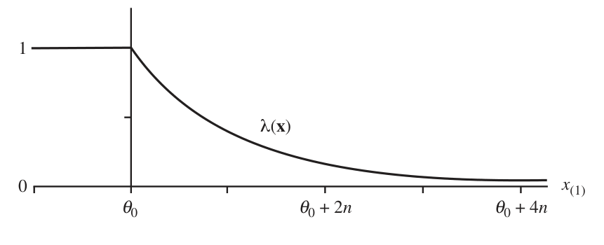
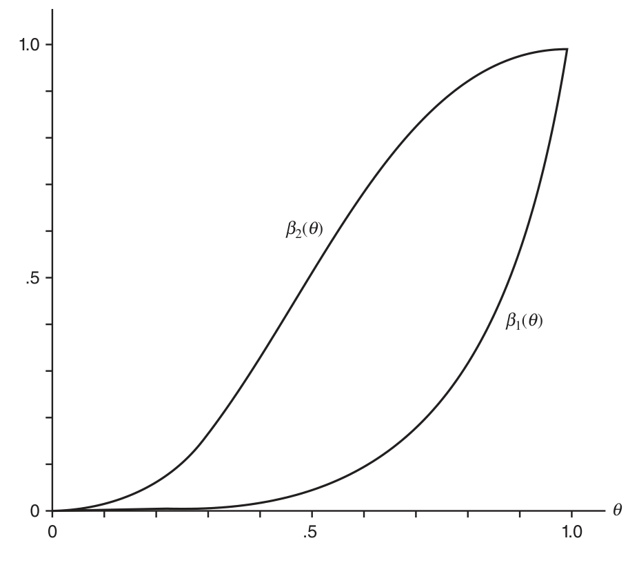
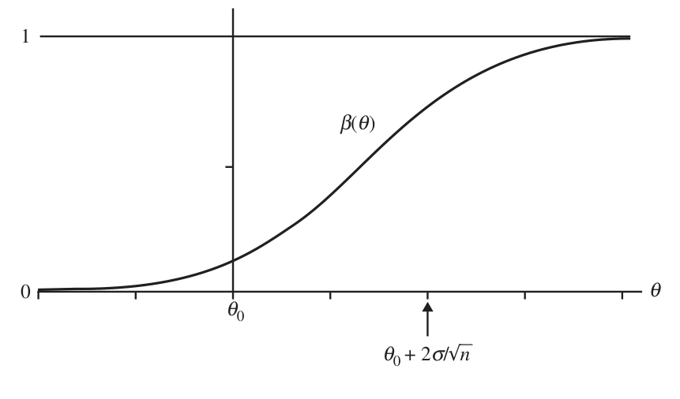
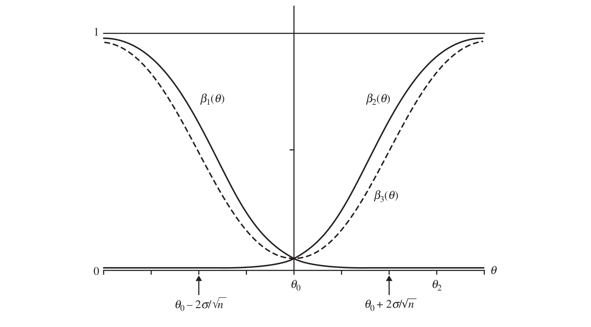
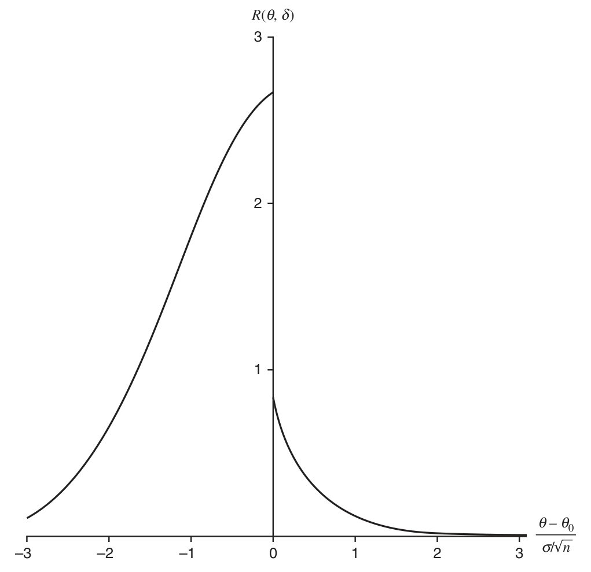

# 第 8 章　假设检验（Hypothesis Testing）

> *“It is a mistake to confound strangeness with mystery.”*
>
> 把离奇与神秘混为一谈是个错误。
>
> ——歇洛克·福尔摩斯（《血字的研究》）

## 8.1 引言（Introduction）

第 7 章研究了一种推断方法——点估计。现在转向另一种推断方法：假设检验。与第 7 章一样，反映寻找与评价检验的双方需要，本章分为两部分。我们从统计假设的定义开始。

> **定义 8.1.1（假设）**
>
> ***假设***（hypothesis）是关于总体参数的陈述。

假设的定义相当宽泛，但要点在于：假设是对总体作出陈述。假设检验的目标是基于来自总体的样本，判定两个互补假设中哪个为真。

> **定义 8.1.2（原假设与备择假设）**
>
> 假设检验问题中的两个互补假设称为***原假设***（null hypothesis）与***备择假设***（alternative hypothesis），分别记作 $H_0$ 与 $H_1$。

若 $\theta$ 表示总体参数，原假设与备择假设的一般格式是 $H_0 : \theta \in \Theta_0$ 与 $H_1 : \theta \in \Theta_0^{c}$，其中 $\Theta_0$ 是参数空间的某个子集，$\Theta_0^{c}$ 是其补集。例如若 $\theta$ 表示患者服药后血压的平均变化，实验者可能关心检验 $H_0 : \theta = 0$ 对 $H_1 : \theta \neq 0$。原假设陈述该药平均而言对血压无影响，备择假设陈述有某种影响。这一常见情形——$H_0$ 陈述处理无效应——正是“原”（null）假设一词的由来。另一例：消费者可能关心供应商生产缺陷品的比例。若 $\theta$ 表示缺陷品比例，消费者可能想检验 $H_0 : \theta \geq \theta_0$ 对 $H_1 : \theta < \theta_0$，其中 $\theta_0$ 是可接受的缺陷品最大比例，而 $H_0$ 陈述缺陷比例高得不可接受。假设涉及产品质量的问题称为验收抽样问题。

在假设检验问题中，观测样本后实验者必须决定：要么接受 $H_0$ 为真，要么拒绝 $H_0$ 判其为假并认定 $H_1$ 为真。

> **定义 8.1.3（检验程序）**
>
> ***假设检验程序***（或假设检验）是这样一条规则，它指明：
>
> - i. 对哪些样本值作出接受 $H_0$ 为真的决策；
>
> - ii. 对哪些样本值拒绝 $H_0$ 并接受 $H_1$ 为真。
>
>
> 样本空间中拒绝 $H_0$ 的子集称为***拒绝区域***（rejection region）或临界区域（critical region）；拒绝区域的补集称为接受区域（acceptance region）。

在哲学层面，有人担心“拒绝 $H_0$”与“接受 $H_1$”的区别：前者并不蕴含实验者接受了什么状态，只表示拒绝 $H_0$ 所定义的状态。类似地，“接受 $H_0$”与“不拒绝 $H_0$”也可区分：前者蕴含实验者愿意断言 $H_0$ 规定的自然状态，后者蕴含实验者其实不信 $H_0$ 但没有拒绝它的证据。多数时候我们不纠结这些问题；我们把假设检验问题视为将采取两种行动之一的问题——行动即断言 $H_0$ 或 $H_1$。

典型地，假设检验用检验统计量 $W(X_1, \ldots, X_n) = W(\textbf{X})$（样本的函数）表述。例如某检验可以规定：若样本均值 $\bar{X}$ 大于 3 则拒绝 $H_0$。此时 $W(\textbf{X}) = \bar{X}$ 是检验统计量，拒绝区域是 $\{ (x_1, \ldots, x_n) : \bar{x} > 3 \}$。8.2 节讨论选择检验统计量与拒绝区域的方法；8.3 节引入评价检验的准则。与点估计量一样，寻找检验的方法不带保证：它们给出的检验在价值确立之前必须加以评价。

## 8.2 寻找检验的方法（Methods of Finding Tests）

我们将详述四种寻找检验程序的方法——它们在不同情形有用，各利用问题不同方面的性质。我们从一个非常一般的方法开始：它几乎总是适用，且在某些情形最优。

### 8.2.1 似然比检验（Likelihood Ratio Tests）

假设检验的似然比方法与 7.2.2 节讨论的最大似然估计量相关，似然比检验的适用面与最大似然估计一样广。回顾若 $X_1, \ldots, X_n$ 是来自具有 pdf 或 pmf $f(x \mid \theta)$（$\theta$ 可以是向量）的总体的随机样本，似然函数定义为

$$
L(\theta \mid x_1, \ldots, x_n) = L(\theta \mid \textbf{x}) = f(\textbf{x} \mid \theta) = \prod_{i=1}^{n} f(x_i \mid \theta).
$$

令 $\Theta$ 表示整个参数空间。似然比检验定义如下。

> **定义 8.2.1（似然比检验统计量）**
>
> 检验 $H_0 : \theta \in \Theta_0$ 对 $H_1 : \theta \in \Theta_0^{c}$ 的***似然比检验统计量***（likelihood ratio test statistic）为
>
> $$
> \lambda(\textbf{x}) = \frac{\sup_{\Theta_0} L(\theta \mid \textbf{x})}{\sup_{\Theta} L(\theta \mid \textbf{x})}.
> $$
>
> ***似然比检验***（likelihood ratio test，LRT）是任何具有形如 $\{ \textbf{x} : \lambda(\textbf{x}) \leq c \}$ 的拒绝区域的检验，其中 $c$ 是满足 $0 \leq c \leq 1$ 的任意数。

LRT 的道理在 $f(\textbf{x} \mid \theta)$ 为离散随机变量 pmf 的情形最容易理解：此时 $\lambda(\textbf{x})$ 的分子是观测样本的最大概率——最大在原假设的参数上计算（见习题 8.4）；分母是观测样本在一切可能参数上的最大概率。若备择假设中存在参数点使观测样本比原假设中任何参数点都更可能出现，这两个最大值之比就小。此时 LRT 准则说应拒绝 $H_0$、接受 $H_1$ 为真。选择数 $c$ 的方法在 8.3 节讨论。

若把对整个参数空间的最大化（无限制最大化）与对参数空间子集的最大化（受限最大化）都考虑，LRT 与 MLE 的对应就更清楚。设 $\theta$ 的 MLE $\hat{\theta}$ 存在——由对 $L(\theta \mid \textbf{x})$ 无限制最大化得到。也可以考虑受限最大化（设 $\Theta_0$ 为参数空间）得到的 MLE，记作 $\hat{\theta}_0$：$\hat{\theta}_0 = \hat{\theta}_0(\textbf{x})$ 是使 $L(\theta \mid \textbf{x})$ 最大的 $\theta \in \Theta_0$ 值。则 LRT 统计量为

$$
\lambda(\textbf{x}) = \frac{L(\hat{\theta}_0 \mid \textbf{x})}{L(\hat{\theta} \mid \textbf{x})}.
$$

> **例 8.2.2（正态 LRT）**
>
> 设 $X_1, \ldots, X_n$ 是来自 $n(\theta, 1)$ 总体的随机样本。考虑检验 $H_0 : \theta = \theta_0$ 对 $H_1 : \theta \neq \theta_0$（$\theta_0$ 是实验者在实验前固定的数）。由于 $H_0$ 只指定一个 $\theta$ 值，$\lambda(\textbf{x})$ 的分子是 $L(\theta_0 \mid \textbf{x})$；例 7.2.5 中 $\theta$ 的（无限制）MLE 是样本均值 $\bar{X}$，故分母是 $L(\bar{x} \mid \textbf{x})$。于是 LRT 统计量为
>
> $$
> \lambda(\textbf{x}) = \frac{(2\pi)^{-n/2}\, \exp\bigl( -\sum_{i=1}^{n} (x_i - \theta_0)^2 / 2 \bigr)}{(2\pi)^{-n/2}\, \exp\bigl[ -\sum_{i=1}^{n} (x_i - \bar{x})^2 / 2 \bigr]} = \exp\Biggl[ \frac{-\sum_{i=1}^{n} (x_i - \theta_0)^2 + \sum_{i=1}^{n} (x_i - \bar{x})^2}{2} \Biggr]. \tag{8.2.1}
> $$
>
> 利用
>
> $$
> \sum_{i=1}^{n} (x_i - \theta_0)^2 = \sum_{i=1}^{n} (x_i - \bar{x})^2 + n (\bar{x} - \theta_0)^2
> $$
>
> 化简，LRT 统计量为
>
> $$
> \lambda(\textbf{x}) = \exp\bigl( -n (\bar{x} - \theta_0)^2 / 2 \bigr). \tag{8.2.2}
> $$
>
> LRT 是对小 $\lambda(\textbf{x})$ 值拒绝 $H_0$ 的检验。用 (8.2.2)，拒绝区域 $\{ \textbf{x} : \lambda(\textbf{x}) \leq c \}$ 可写为
>
> $$
> \Biggl\{ \textbf{x} : |\bar{x} - \theta_0| \geq \sqrt{-2 (\log c) / n} \Biggr\}.
> $$
>
> 当 $c$ 在 0 与 1 之间变动时，$\sqrt{-2 (\log c)/n}$ 在 0 与 $\infty$ 之间变动。故 LRT 恰是“若样本均值与假设值 $\theta_0$ 之差超过指定量就拒绝 $H_0 : \theta = \theta_0$”的那些检验。

例 8.2.2 的分析是典型的：先按定义 8.2.1 求出 $\lambda(\textbf{X})$ 的表达式（如 (8.2.1)）；然后尽可能把拒绝区域的描述简化为涉及更简单统计量的表达式——本例是 $|\bar{X} - \theta_0|$。

> **例 8.2.3（指数 LRT）**
>
> 设 $X_1, \ldots, X_n$ 是来自指数总体的随机样本，pdf 为
>
> $$
> f(x \mid \theta) = \begin{cases} e^{-(x - \theta)} & x \geq \theta,\\ 0 & x < \theta, \end{cases} \qquad -\infty < \theta < \infty.
> $$
>
> 似然函数为
>
> $$
> L(\theta \mid \textbf{x}) = \begin{cases} e^{-\sum x_i + n \theta} & \theta \leq x_{(1)},\\ 0 & \theta > x_{(1)}, \end{cases} \qquad （x_{(1)} = \min x_i）.
> $$
>
> 考虑检验 $H_0 : \theta \leq \theta_0$ 对 $H_1 : \theta > \theta_0$（$\theta_0$ 为实验者指定的值）。显然 $L(\theta \mid \textbf{x})$ 在 $-\infty < \theta \leq x_{(1)}$ 上是 $\theta$ 的递增函数，故 $\lambda(\textbf{x})$ 的分母（$L$ 的无限制最大值）是
>
> $$
> L\bigl( x_{(1)} \mid \textbf{x} \bigr) = e^{-\sum x_i + n x_{(1)}}.
> $$
>
> 若 $x_{(1)} \leq \theta_0$，则 $\lambda(\textbf{x})$ 的分子也是 $L\bigl( x_{(1)} \mid \textbf{x} \bigr)$；但因我们在 $\theta \leq \theta_0$ 上最大化 $L(\theta \mid \textbf{x})$，当 $x_{(1)} > \theta_0$ 时分子是 $L(\theta_0 \mid \textbf{x})$。故似然比检验统计量为
>
> $$
> \lambda(\textbf{x}) = \begin{cases} 1 & x_{(1)} \leq \theta_0,\\ e^{-n (x_{(1)} - \theta_0)} & x_{(1)} > \theta_0. \end{cases}
> $$
>
> $\lambda(\textbf{x})$ 的图形见图 8.2.1。LRT（若 $\lambda(\textbf{X}) \leq c$ 则拒绝 $H_0$ 的检验）是具有拒绝区域 $\{ \textbf{x} : x_{(1)} \geq \theta_0 - \frac{\log c}{n} \}$ 的检验。注意拒绝区域只通过充分统计量 $X_{(1)}$ 依赖样本；一般情形也是如此（见定理 8.2.4）。

图 8.2.1　 $\lambda(\textbf{x})$——只依赖 $x_{(1)}$ 的函数（原书 Figure 8.2.1）

例 8.2.3 再次例示 7.2.2 节的观点：求似然函数的导数不是找 MLE 的唯一方法。例 8.2.3 中 $L(\theta \mid \textbf{x})$ 在 $\theta = x_{(1)}$ 处不可微。

若 $T(\textbf{X})$ 是 $\theta$ 的充分统计量，pdf 或 pmf 为 $g(t \mid \theta)$，则我们可以考虑基于 $T$ 及其似然函数 $L^{*}(\theta \mid t) = g(t \mid \theta)$ 构造 LRT，而非基于样本 $\textbf{X}$ 及其似然函数 $L(\theta \mid \textbf{x})$。记 $\lambda^{*}(t)$ 为基于 $T$ 的似然比检验统计量。鉴于“**x** 中关于 $\theta$ 的全部信息都包含在 $T(\textbf{x})$ 中”这一直观，基于 $T$ 的检验应与基于完整样本 $\textbf{X}$ 的检验一样好。事实上两者等价。

> **定理 8.2.4（LRT 基于充分统计量）**
>
> 若 $T(\textbf{X})$ 是 $\theta$ 的充分统计量，$\lambda^{*}(t)$ 与 $\lambda(\textbf{x})$ 分别是基于 $T$ 与 $\textbf{X}$ 的 LRT 统计量，则对样本空间中的每个 **x** 有 $\lambda^{*}\bigl( T(\textbf{x}) \bigr) = \lambda(\textbf{x})$。
>
> **证明**　由因子分解定理（定理 6.2.6），$\textbf{X}$ 的 pdf 或 pmf 可写为 $f(\textbf{x} \mid \theta) = g\bigl( T(\textbf{x}) \mid \theta \bigr)\, h(\textbf{x})$，其中 $g(t \mid \theta)$ 是 $T$ 的 pdf 或 pmf，$h(\textbf{x})$ 不依赖 $\theta$。于是
>
> $$
> \lambda(\textbf{x}) = \frac{\sup_{\Theta_0} L(\theta \mid \textbf{x})}{\sup_{\Theta} L(\theta \mid \textbf{x})} = \frac{\sup_{\Theta_0} f(\textbf{x} \mid \theta)}{\sup_{\Theta} f(\textbf{x} \mid \theta)}
> = \frac{\sup_{\Theta_0} g\bigl( T(\textbf{x}) \mid \theta \bigr)\, h(\textbf{x})}{\sup_{\Theta} g\bigl( T(\textbf{x}) \mid \theta \bigr)\, h(\textbf{x})} \qquad （T\ \text{充分}）
> $$
>
> $$
> = \frac{\sup_{\Theta_0} g\bigl( T(\textbf{x}) \mid \theta \bigr)}{\sup_{\Theta} g\bigl( T(\textbf{x}) \mid \theta \bigr)} \qquad （h\ \text{不依赖}\ \theta）
> = \frac{\sup_{\Theta_0} L^{*}\bigl( \theta \mid T(\textbf{x}) \bigr)}{\sup_{\Theta} L^{*}\bigl( \theta \mid T(\textbf{x}) \bigr)} \qquad （g\ \text{是}\ T\ \text{的 pdf 或 pmf}）
> = \lambda^{*}\bigl( T(\textbf{x}) \bigr).
> $$
>
> ∎

例 8.2.2 后的评论说：求出 $\lambda(\textbf{x})$ 的表达式后要设法化简。按定理 8.2.4，这一评论的一种解读是：若 $T(\textbf{X})$ 是 $\theta$ 的充分统计量，则 $\lambda(\textbf{x})$ 的化简表达式应当只通过 $T(\textbf{x})$ 依赖 **x**。

> **例 8.2.5（LRT 与充分性）**
>
> 例 8.2.2 中可以认出 $\bar{X}$ 是 $\theta$ 的充分统计量：利用与 $\bar{X}$ 相联系的似然函数（$\bar{X} \sim n(\theta, \tfrac{1}{n})$）更容易得出结论——$H_0 : \theta = \theta_0$ 对 $H_1 : \theta \neq \theta_0$ 的似然比检验对大的 $|\bar{X} - \theta_0|$ 值拒绝 $H_0$。
>
> 类似地，例 8.2.3 中 $X_{(1)} = \min X_i$ 是 $\theta$ 的充分统计量；$X_{(1)}$ 的似然函数（即 $X_{(1)}$ 的 pdf）为
>
> $$
> L^{*}\bigl( \theta \mid x_{(1)} \bigr) = \begin{cases} n\, e^{-n (x_{(1)} - \theta)} & \theta \leq x_{(1)},\\ 0 & \theta > x_{(1)}. \end{cases}
> $$
>
> 利用该似然同样可以导出：$H_0 : \theta \leq \theta_0$ 对 $H_1 : \theta > \theta_0$ 的似然比检验对大的 $X_{(1)}$ 值拒绝 $H_0$。

似然比检验在存在多余参数（nuisance parameters）——模型中出现但不直接关系推断的参数——的情形也有用。多余参数的存在不影响 LRT 的构造方法，但可以预期它可能导致不同的检验。

> **例 8.2.6（方差未知的正态 LRT）**
>
> 设 $X_1, \ldots, X_n$ 是来自 $n(\mu, \sigma^2)$ 的随机样本，实验者只关心关于 $\mu$ 的推断，例如检验 $H_0 : \mu \leq \mu_0$ 对 $H_1 : \mu > \mu_0$。此时参数 $\sigma^2$ 是多余参数。LRT 统计量为
>
> $$
> \lambda(\textbf{x}) = \frac{\max_{\{\mu, \sigma^2 : \mu \leq \mu_0,\ \sigma^2 \geq 0\}} L(\mu, \sigma^2 \mid \textbf{x})}{\max_{\{\mu, \sigma^2 : -\infty < \mu < \infty,\ \sigma^2 \geq 0\}} L(\mu, \sigma^2 \mid \textbf{x})} = \frac{\max_{\{\mu, \sigma^2 : \mu \leq \mu_0,\ \sigma^2 \geq 0\}} L(\mu, \sigma^2 \mid \textbf{x})}{L(\hat{\mu}, \hat{\sigma}^2 \mid \textbf{x})},
> $$
>
> 其中 $\hat{\mu}$ 与 $\hat{\sigma}^2$ 是 $\mu$ 与 $\sigma^2$ 的 MLE（例 7.2.11）。进一步：若 $\hat{\mu} \leq \mu_0$，则受限最大与无限制最大相同；若 $\hat{\mu} > \mu_0$，受限最大是 $L(\mu_0, \hat{\sigma}_0^2 \mid \textbf{x})$，其中 $\hat{\sigma}_0^2 = \sum (x_i - \mu_0)^2 / n$。故
>
> $$
> \lambda(\textbf{x}) = \begin{cases} 1 & \text{若}\ \hat{\mu} \leq \mu_0,\\ \dfrac{L(\mu_0, \hat{\sigma}_0^2 \mid \textbf{x})}{L(\hat{\mu}, \hat{\sigma}^2 \mid \textbf{x})} & \text{若}\ \hat{\mu} > \mu_0. \end{cases}
> $$
>
> 作一些代数可以证明基于 $\lambda(\textbf{x})$ 的检验等价于基于 Student 氏 $t$ 统计量的检验；细节留作习题 8.37。（习题 8.38–8.42 也处理多余参数问题。）

### 8.2.2 贝叶斯检验（Bayesian Tests）

假设检验问题也可以在贝叶斯模型中表述。回忆 7.2.3 节：贝叶斯模型不仅包括抽样分布 $f(\textbf{x} \mid \theta)$，还包括先验分布 $\pi(\theta)$——它反映实验者在抽样前对参数 $\theta$ 的看法。

贝叶斯范式规定用贝叶斯定理把样本信息与先验信息结合得到后验分布 $\pi(\theta \mid \textbf{x})$；此后关于 $\theta$ 的一切推断都基于后验分布。

在假设检验问题中，后验分布可用于计算 $H_0$ 与 $H_1$ 为真的概率。记住 $\pi(\theta \mid \textbf{x})$ 是某随机变量的概率分布，故后验概率 $P(\theta \in \Theta_0 \mid \textbf{x}) = P(H_0\ \text{为真} \mid \textbf{x})$ 与 $P(\theta \in \Theta_0^{c} \mid \textbf{x}) = P(H_1\ \text{为真} \mid \textbf{x})$ 可以计算。

概率 $P(H_0\ \text{为真} \mid \textbf{x})$ 与 $P(H_1\ \text{为真} \mid \textbf{x})$ 对经典统计学家没有意义：经典统计学家视 $\theta$ 为固定数，因此假设要么为真要么为假。若 $\theta \in \Theta_0$，则对一切 **x** 有 $P(H_0\ \text{为真} \mid \textbf{x}) = 1$、$P(H_1\ \text{为真} \mid \textbf{x}) = 0$；若 $\theta \in \Theta_0^{c}$ 则反之。由于这些概率未知（$\theta$ 未知）且不依赖样本 **x**，经典统计学家不使用它们。而在假设检验问题的贝叶斯表述中，这些概率依赖样本 **x**，能提供关于 $H_0$ 与 $H_1$ 真伪的有用信息。

贝叶斯检验者可以决定：若 $P(\theta \in \Theta_0 \mid \textbf{X}) \geq P(\theta \in \Theta_0^{c} \mid \textbf{X})$ 则接受 $H_0$ 为真，否则拒绝 $H_0$。用前几节的话说，检验统计量（样本的函数）是 $P(\theta \in \Theta_0^{c} \mid \textbf{X})$，拒绝区域是 $\{ \textbf{x} : P(\theta \in \Theta_0^{c} \mid \textbf{x}) > \tfrac{1}{2} \}$。另一种做法：若贝叶斯检验者想防止错误地拒绝 $H_0$，可以只在 $P(\theta \in \Theta_0^{c} \mid \textbf{X})$ 大于某个大数（例如 0.99）时才拒绝 $H_0$。

> **例 8.2.7（正态贝叶斯检验）**
>
> 设 $X_1, \ldots, X_n$ 是 iid $n(\theta, \sigma^2)$，$\theta$ 的先验分布为 $n(\mu, \tau^2)$（$\sigma^2$、$\mu$、$\tau^2$ 已知）。考虑检验 $H_0 : \theta \leq \theta_0$ 对 $H_1 : \theta > \theta_0$。由例 7.2.16，后验 $\pi(\theta \mid \textbf{x})$ 是正态的，均值 $\frac{n \tau^2 \bar{x} + \sigma^2 \mu}{n \tau^2 + \sigma^2}$，方差 $\frac{\sigma^2 \tau^2}{n \tau^2 + \sigma^2}$。
>
> 若决定当且仅当 $P(\theta \in \Theta_0 \mid \textbf{X}) \geq P(\theta \in \Theta_0^{c} \mid \textbf{X})$ 时接受 $H_0$，则当且仅当
>
> $$
> \frac{1}{2} \leq P(\theta \in \Theta_0 \mid \textbf{X}) = P(\theta \leq \theta_0 \mid \textbf{X})
> $$
>
> 时接受 $H_0$。由于 $\pi(\theta \mid \textbf{x})$ 对称，这成立当且仅当 $\pi(\theta \mid \textbf{x})$ 的均值小于等于 $\theta_0$。故当
>
> $$
> \bar{X} \leq \theta_0 + \frac{\sigma^2 (\theta_0 - \mu)}{n \tau^2}
> $$
>
> 时 $H_0$ 被接受为真，否则接受 $H_1$。特别地若 $\mu = \theta_0$（实验前 $H_0$ 与 $H_1$ 各得概率 $\tfrac{1}{2}$），则当 $\bar{x} \leq \theta_0$ 时接受 $H_0$，否则接受 $H_1$。

用后验分布对假设检验问题作推断的其他方法在 8.3.5 节讨论。

### 8.2.3 并—交与交—并检验（Union–Intersection and Intersection–Union Tests）

有些情形下，复杂原假设的检验可以从简单原假设的检验发展而来。我们讨论两种相关方法。

检验构造的***并—交***（union–intersection）方法在原假设方便地表达为交时可能有用，例如

$$
H_0 : \theta \in \bigcap_{\gamma \in \Gamma} \Theta_{\gamma}. \tag{8.2.3}
$$

这里 $\Gamma$ 是任意指标集，视问题可有限或无限。设对每个问题“检验 $H_{0\gamma} : \theta \in \Theta_{\gamma}$ 对 $H_{1\gamma} : \theta \in \Theta_{\gamma}^{c}$”都有可用的检验，其检验 $H_{0\gamma}$ 的拒绝区域为 $\{ \textbf{x} : T_{\gamma}(\textbf{x}) \in \mathcal{R}_{\gamma} \}$。则并—交检验的拒绝区域为

$$
\bigcup_{\gamma \in \Gamma} \bigl\{ \textbf{x} : T_{\gamma}(\textbf{x}) \in \mathcal{R}_{\gamma} \bigr\}. \tag{8.2.4}
$$

道理简单：若诸 $H_{0\gamma}$ 之一被拒绝，则 $H_0$——按 (8.2.3) 只有当每个 $H_{0\gamma}$ 都真时 $H_0$ 才真——也必须被拒绝；只有当每个 $H_{0\gamma}$ 都被接受为真时，交 $H_0$ 才被接受为真。

某些情形下并—交检验拒绝区域有简单表达式。特别地设每个单独检验的拒绝区域形如 $\{ \textbf{x} : T_{\gamma}(\textbf{x}) > c \}$（$c$ 不依赖 $\gamma$），则 (8.2.4) 给出的并—交检验拒绝区域可表达为

$$
\bigcup_{\gamma \in \Gamma} \{ \textbf{x} : T_{\gamma}(\textbf{x}) > c \} = \Bigl\{ \textbf{x} : \sup_{\gamma \in \Gamma} T_{\gamma}(\textbf{x}) > c \Bigr\}.
$$

故检验 $H_0$ 的检验统计量是 $T(\textbf{x}) = \sup_{\gamma \in \Gamma} T_{\gamma}(\textbf{x})$。$T(\textbf{x})$ 有简单公式的例子见第 11 章。

> **例 8.2.8（正态并—交检验）**
>
> 设 $X_1, \ldots, X_n$ 是来自 $n(\mu, \sigma^2)$ 总体的随机样本。考虑检验 $H_0 : \mu = \mu_0$ 对 $H_1 : \mu \neq \mu_0$（$\mu_0$ 指定）。可以把 $H_0$ 写成两个集合的交：
>
> $$
> H_0 : \{ \mu : \mu \leq \mu_0 \} \cap \{ \mu : \mu \geq \mu_0 \}.
> $$
>
> $H_{0L} : \mu \leq \mu_0$ 对 $H_{1L} : \mu > \mu_0$ 的 LRT 是
>
> $$
> \text{若}\ \frac{\bar{X} - \mu_0}{S / \sqrt{n}} \geq t_L\ \text{则以}\ H_{1L} : \mu > \mu_0\ \text{拒绝}\ H_{0L} : \mu \leq \mu_0
> $$
>
> （见习题 8.37）。类似地，$H_{0U} : \mu \geq \mu_0$ 对 $H_{1U} : \mu < \mu_0$ 的 LRT 是
>
> $$
> \text{若}\ \frac{\bar{X} - \mu_0}{S / \sqrt{n}} \leq t_U\ \text{则以}\ H_{1U} : \mu < \mu_0\ \text{拒绝}\ H_{0U} : \mu \geq \mu_0.
> $$
>
> 于是由这两个 LRT 组成的 $H_0 : \mu = \mu_0$ 对 $H_1 : \mu \neq \mu_0$ 的并—交检验是
>
> $$
> \text{若}\ \frac{\bar{X} - \mu_0}{S/\sqrt{n}} \geq t_L\ \text{或}\ \frac{\bar{X} - \mu_0}{S/\sqrt{n}} \leq t_U\ \text{则拒绝}\ H_0.
> $$
>
> 若 $t_L = -t_U \geq 0$，并—交检验可以更简单地表达为
>
> $$
> \text{若}\ \Biggl| \frac{\bar{X} - \mu_0}{S/\sqrt{n}} \Biggr| \geq t_L\ \text{则拒绝}\ H_0.
> $$
>
> 事实证明该并—交检验也是本问题的 LRT（见习题 8.38），称为双侧 $t$ 检验（two-sided $t$ test）。

若原假设方便地表达为交，并—交检验构造方法有用。另一方法——交—并（intersection–union）方法——在原假设方便地表达为并时可能有用。设要检验原假设

$$
H_0 : \theta \in \bigcup_{\gamma \in \Gamma} \Theta_{\gamma}. \tag{8.2.5}
$$

设对每个 $\gamma \in \Gamma$，$\{ \textbf{x} : T_{\gamma}(\textbf{x}) \in \mathcal{R}_{\gamma} \}$ 是检验 $H_{0\gamma} : \theta \in \Theta_{\gamma}$ 对 $H_{1\gamma} : \theta \in \Theta_{\gamma}^{c}$ 的拒绝区域。则 $H_0$ 对 $H_1$ 的交—并检验的拒绝区域为

$$
\bigcap_{\gamma \in \Gamma} \bigl\{ \textbf{x} : T_{\gamma}(\textbf{x}) \in \mathcal{R}_{\gamma} \bigr\}. \tag{8.2.6}
$$

由 (8.2.5)，$H_0$ 为假当且仅当所有 $H_{0\gamma}$ 都假，故当且仅当每个单独假设 $H_{0\gamma}$ 都能被拒绝时 $H_0$ 才能被拒绝。同样，若单独假设的拒绝区域都形如 $\{ \textbf{x} : T_{\gamma}(\textbf{x}) \geq c \}$（$c$ 与 $\gamma$ 无关），检验可以大大简化：此时 $H_0$ 的拒绝区域为

$$
\bigcap_{\gamma \in \Gamma} \{ \textbf{x} : T_{\gamma}(\textbf{x}) \geq c \} = \Bigl\{ \textbf{x} : \inf_{\gamma \in \Gamma} T_{\gamma}(\textbf{x}) \geq c \Bigr\}.
$$

交—并检验对统计量 $\inf_{\gamma \in \Gamma} T_{\gamma}(\textbf{X})$ 的大值拒绝 $H_0$。

> **例 8.2.9（验收抽样）**
>
> 验收抽样为交—并检验提供了极有用的应用（该问题的更详细处理见 Berger 1982）。
>
> 评估装饰织物质量的两个重要参数是 $\theta_1$（平均断裂强度）与 $\theta_2$（通过可燃性测试的概率）。标准可规定 $\theta_1$ 应超过 50 磅、$\theta_2$ 应超过 0.95，织物只有同时满足两项标准才合格。这可以用假设检验建模：
>
> $$
> H_0 : \{ \theta_1 \leq 50\ \text{或}\ \theta_2 \leq 0.95 \} \qquad\text{对}\qquad H_1 : \{ \theta_1 > 50\ \text{且}\ \theta_2 > 0.95 \},
> $$
>
> 一批材料只有在 $H_1$ 被接受时才合格。
>
> 设 $X_1, \ldots, X_n$ 是 $n$ 个样品断裂强度的测量，假设为 iid $n(\theta_1, \sigma^2)$。$H_{01} : \theta_1 \leq 50$ 的 LRT 将在 $(\bar{X} - 50)/(S/\sqrt{n}) > t$ 时拒绝 $H_{01}$。设还有 $m$ 个可燃性测试结果 $Y_1, \ldots, Y_m$（第 $i$ 个样品通过测试时 $Y_i = 1$，否则为 0）。若 $Y_1, \ldots, Y_m$ 建模为 iid $\mathrm{Bernoulli}(\theta_2)$ 随机变量，LRT 将在 $\sum_{i=1}^{m} Y_i > b$ 时拒绝 $H_{02} : \theta_2 \leq 0.95$（见习题 8.3）。综合起来，交—并检验的拒绝区域为
>
> $$
> \Biggl\{ (\textbf{x}, \textbf{y}) : \frac{\bar{x} - 50}{s / \sqrt{n}} > t \ \text{且}\ \sum_{i=1}^{m} y_i > b \Biggr\}.
> $$
>
> 于是交—并检验判定产品合格（即 $H_1$ 为真），当且仅当它判定每个单独参数都达标（即每个 $H_{1i}$ 为真）。若定义产品质量的参数多于两个，可以用交—并方法把各参数的单独检验组合成产品质量的总体检验。

## 8.3 评价检验的方法（Methods of Evaluating Tests）

在决定接受或拒绝原假设 $H_0$ 时，实验者可能犯错误。通常假设检验通过其犯错误的概率来评价与比较。本节讨论如何控制这些错误概率；某些情形甚至能确定哪些检验的错误概率最小。

### 8.3.1 错误概率与功效函数（Error Probabilities and the Power Function）

$H_0 : \theta \in \Theta_0$ 对 $H_1 : \theta \in \Theta_0^{c}$ 的假设检验可能犯两类错误之一。这两类错误历来被赋予不好记的名字：第一类错误（Type I Error）与第二类错误（Type II Error）。若 $\theta \in \Theta_0$ 但检验错误地决定拒绝 $H_0$，检验犯了第一类错误；若 $\theta \in \Theta_0^{c}$ 但检验决定接受 $H_0$，犯了第二类错误。两种情形见表 8.3.1。

*表 8.3.1　 假设检验中的两类错误（原书 Table 8.3.1）*

|  | 决策 |  |
|:---:|:---:|:---:|
|  | 接受 $H_0$ | 拒绝 $H_0$ |
| $H_0$（真） | 正确决策 | 第一类错误 |
| $H_1$（真） | 第二类错误 | 正确决策 |

设 $\mathcal{R}$ 表示检验的拒绝区域。对 $\theta \in \Theta_0$，若 $\textbf{X} \in \mathcal{R}$ 检验就犯错误，故第一类错误的概率是 $P_{\theta}(\textbf{X} \in \mathcal{R})$；对 $\theta \in \Theta_0^{c}$，第二类错误的概率是 $P_{\theta}(\textbf{X} \in \mathcal{R}^{c})$。从 $\mathcal{R}$ 到 $\mathcal{R}^{c}$ 的切换有点令人困惑，但若意识到 $P_{\theta}(\textbf{X} \in \mathcal{R}^{c}) = 1 - P_{\theta}(\textbf{X} \in \mathcal{R})$，则 $\theta$ 的函数 $P_{\theta}(\textbf{X} \in \mathcal{R})$ 包含拒绝区域为 $\mathcal{R}$ 的检验的全部信息：

$$
P_{\theta}(\textbf{X} \in \mathcal{R}) = \begin{cases} \text{第一类错误的概率} & \text{若}\ \theta \in \Theta_0,\\ \text{1 减去第二类错误的概率} & \text{若}\ \theta \in \Theta_0^{c}. \end{cases}
$$

这些考虑引出如下定义。

> **定义 8.3.1（功效函数）**
>
> 拒绝区域为 $\mathcal{R}$ 的假设检验的***功效函数***（power function）是由 $\beta(\theta) = P_{\theta}(\textbf{X} \in \mathcal{R})$ 定义的 $\theta$ 的函数。

理想的功效函数对所有 $\theta \in \Theta_0$ 为零、对所有 $\theta \in \Theta_0^{c}$ 为一。除平凡情形外这一理想无法达到。定性地说，好的检验的功效函数对大多数 $\theta \in \Theta_0^{c}$ 接近一、对大多数 $\theta \in \Theta_0$ 接近零。

> **例 8.3.2（二项功效函数）**
>
> 设 $X \sim \mathrm{binomial}(5, \theta)$。考虑检验 $H_0 : \theta \leq \tfrac{1}{2}$ 对 $H_1 : \theta > \tfrac{1}{2}$。先考虑“当且仅当观测到全部成功”才拒绝 $H_0$ 的检验。其功效函数为
>
> $$
> \beta_1(\theta) = P_{\theta}(\textbf{X} \in \mathcal{R}) = P_{\theta}(X = 5) = \theta^{5}.
> $$
>
> $\beta_1(\theta)$ 的图形见图 8.3.1。考察该功效函数，我们可能判定：虽然第一类错误的概率可接受地低（对一切 $\theta \leq \tfrac{1}{2}$ 有 $\beta_1(\theta) \leq (\tfrac{1}{2})^5 = 0.0312$），但对大多数 $\theta > \tfrac{1}{2}$，第二类错误的概率太高（$\beta_1(\theta)$ 太小）：只有当 $\theta > (\tfrac{1}{2})^{1/5} = 0.87$ 时第二类错误概率才小于 $\tfrac{1}{2}$。为达到更小的第二类错误概率，可以考虑“若 $X = 3, 4$ 或 5 则拒绝 $H_0$”的检验。其功效函数为
>
> $$
> \beta_2(\theta) = P_{\theta}(X = 3, 4\ \text{或}\ 5) = \binom{5}{3}\, \theta^3 (1 - \theta)^2 + \binom{5}{4}\, \theta^4 (1 - \theta) + \binom{5}{5}\, \theta^5.
> $$
>
> $\beta_2(\theta)$ 的图形也在图 8.3.1 中。可见第二个检验的第二类错误概率更小：对 $\theta > \tfrac{1}{2}$ 有 $\beta_2(\theta)$ 更大。但第二个检验的第一类错误概率更大：对 $\theta \leq \tfrac{1}{2}$ 有 $\beta_2(\theta)$ 更大。若要在这两个检验间抉择，研究者必须判断 $\beta_1(\theta)$ 与 $\beta_2(\theta)$ 所刻画的错误结构哪个更可接受。

*图 8.3.1　 例 8.3.2 的功效函数（原书 Figure 8.3.1）*

> **例 8.3.3（正态功效函数）**
>
> 设 $X_1, \ldots, X_n$ 是来自 $n(\theta, \sigma^2)$ 总体（$\sigma^2$ 已知）的随机样本。$H_0 : \theta \leq \theta_0$ 对 $H_1 : \theta > \theta_0$ 的 LRT 是在 $(\bar{X} - \theta_0) / (\sigma/\sqrt{n}) > c$ 时拒绝 $H_0$ 的检验（习题 8.37），常数 $c$ 可为任意正数。该检验的功效函数为
>
> $$
> \beta(\theta) = P_{\theta}\Biggl( \frac{\bar{X} - \theta_0}{\sigma/\sqrt{n}} > c \Biggr)
> = P_{\theta}\Biggl( \frac{\bar{X} - \theta}{\sigma/\sqrt{n}} > c + \frac{\theta_0 - \theta}{\sigma/\sqrt{n}} \Biggr)
> = P\Biggl( Z > c + \frac{\theta_0 - \theta}{\sigma/\sqrt{n}} \Biggr),
> $$
>
> 其中 $Z$ 是标准正态随机变量（因为 $(\bar{X} - \theta)/(\sigma/\sqrt{n}) \sim n(0, 1)$）。当 $\theta$ 从 $-\infty$ 增到 $\infty$ 时，这一正态概率从零增至一，故 $\beta(\theta)$ 是 $\theta$ 的递增函数，且
>
> $$
> \lim_{\theta \to -\infty} \beta(\theta) = 0, \qquad \lim_{\theta \to \infty} \beta(\theta) = 1, \qquad \beta(\theta_0) = \alpha\ \text{（若}\ P(Z > c) = \alpha\text{）}.
> $$
>
> $c = 1.28$ 时 $\beta(\theta)$ 的图形见图 8.3.2。

通常检验的功效函数依赖样本量 $n$。若实验者可以选 $n$，考虑功效函数可能有助于确定实验中合适的样本量。

*图 8.3.2　 例 8.3.3 的功效函数（原书 Figure 8.3.2）*

> **例 8.3.4（例 8.3.3 的继续）**
>
> 设实验者希望第一类错误概率至多 $0.1$；此外希望当 $\theta \geq \theta_0 + \sigma$ 时第二类错误概率至多 $0.2$。现在演示如何用检验“若 $(\bar{X} - \theta_0)/(\sigma/\sqrt{n}) > c$ 则拒绝 $H_0 : \theta \leq \theta_0$”选取 $c$ 与 $n$ 以达到这些目标。如上所述，该检验的功效函数为
>
> $$
> \beta(\theta) = P\Biggl( Z > c + \frac{\theta_0 - \theta}{\sigma/\sqrt{n}} \Biggr).
> $$
>
> 由于 $\beta(\theta)$ 关于 $\theta$ 递增，只要
>
> $$
> \beta(\theta_0) = 0.1 \qquad\text{与}\qquad \beta(\theta_0 + \sigma) = 0.8
> $$
>
> 要求即被满足。取 $c = 1.28$ 得 $\beta(\theta_0) = P(Z > 1.28) = 0.1$（与 $n$ 无关）。现在选 $n$ 使 $\beta(\theta_0 + \sigma) = P(Z > 1.28 - \sqrt{n}) = 0.8$。由 $P(Z > -0.84) = 0.8$，令 $1.28 - \sqrt{n} = -0.84$ 解得 $n = 4.49$。当然 $n$ 必须是整数，故取 $c = 1.28$、$n = 5$ 得到错误概率按实验者要求受控的检验。

对固定样本量，通常不可能使两类错误概率都任意小。寻找好检验时，常见的做法是限制考虑把第一类错误概率控制在指定水平的检验；在这类检验中再寻找第二类错误概率尽可能小的检验。讨论第一类错误概率受控的检验时，下面两个术语有用。

> **定义 8.3.5（尺寸 $\alpha$ 的检验）**
>
> 对 $0 \leq \alpha \leq 1$，具有功效函数 $\beta(\theta)$ 的检验是尺寸（size）$\alpha$ 的检验，若 $\sup_{\theta \in \Theta_0} \beta(\theta) = \alpha$。

> **定义 8.3.6（水平 $\alpha$ 的检验）**
>
> 对 $0 \leq \alpha \leq 1$，具有功效函数 $\beta(\theta)$ 的检验是水平（level）$\alpha$ 的检验，若 $\sup_{\theta \in \Theta_0} \beta(\theta) \leq \alpha$。

一些作者不区分“尺寸”与“水平”，两词有时混用。但按我们的定义，水平 $\alpha$ 检验的集合包含尺寸 $\alpha$ 检验的集合。而且这一区分在复杂模型与复杂检验情形变得重要——那里常常无法构造尺寸 $\alpha$ 的检验，实验者只能满足于水平 $\alpha$ 的检验并接受某些妥协；我们将在并—交与交—并检验中见到例子。

实验者常指定所用检验的水平，典型选择是 $\alpha = 0.01$、$0.05$ 与 $0.10$。要注意：固定检验的水平只控制第一类错误概率，不控制第二类错误。若采取这一途径，实验者应这样设定原假设与备择假设，使控制第一类错误概率最为重要。例如实验者预期实验将支持某个假设，但除非数据确实给出有说服力的支持否则不愿断言。检验可以这样设定：备择假设就是她预期数据会支持、希望证明的那个假设（在此语境下备择假设有时称为研究假设）。用小 $\alpha$ 的水平 $\alpha$ 检验，实验者防止了“在研究假设为假时宣称数据支持它”。

8.2 节的方法通常给出检验统计量与拒绝区域的一般形式，但一般不给出唯一确定的检验。例如 LRT（定义 8.2.1）是在 $\lambda(\textbf{X}) \leq c$ 时拒绝 $H_0$ 的检验，而 $c$ 未指定——所以定义的不是单个 LRT 而是整类 LRT，每个 $c$ 值对应一个。限制到尺寸 $\alpha$ 检验现在可能促成从该类检验中选出一个。

> **例 8.3.7（LRT 的尺寸）**
>
> 一般地，尺寸 $\alpha$ 的 LRT 通过选择 $c$ 使 $\sup_{\theta \in \Theta_0} P_{\theta}\bigl( \lambda(\textbf{X}) \leq c \bigr) = \alpha$ 构造。$c$ 如何确定取决于具体问题。例如例 8.2.2 中 $\Theta_0$ 只含单点 $\theta = \theta_0$，且 $\theta = \theta_0$ 时 $\sqrt{n} (\bar{X} - \theta_0) \sim n(0, 1)$。故检验
>
> $$
> \text{若}\ |\bar{X} - \theta_0| \geq z_{\alpha/2} / \sqrt{n}\ \text{则拒绝}\ H_0
> $$
>
> （$z_{\alpha/2}$ 满足 $P(Z \geq z_{\alpha/2}) = \alpha/2$，$Z \sim n(0,1)$）就是尺寸 $\alpha$ 的 LRT。具体说这对应取 $c = \exp(-z_{\alpha/2}^2/2)$，但这一点不重要。
>
> 对例 8.2.3 描述的问题，求尺寸 $\alpha$ 的 LRT 因原假设 $H_0 : \theta \leq \theta_0$ 含多于一点而复杂。LRT 在 $X_{(1)} \geq c$ 时拒绝 $H_0$，$c$ 的选取使检验尺寸为 $\alpha$。若 $c = (-\log \alpha)/n + \theta_0$，则
>
> $$
> P_{\theta_0}\bigl( X_{(1)} \geq c \bigr) = e^{-n (c - \theta_0)} = \alpha.
> $$
>
> 由于 $\theta$ 是 $X_{(1)}$ 分布的位置参数，
>
> $$
> P_{\theta}\bigl( X_{(1)} \geq c \bigr) \leq P_{\theta_0}\bigl( X_{(1)} \geq c \bigr) \qquad \text{（对任意}\ \theta \leq \theta_0\text{）}.
> $$
>
> 故
>
> $$
> \sup_{\theta \in \Theta_0} \beta(\theta) = \sup_{\theta \leq \theta_0} P_{\theta}\bigl( X_{(1)} \geq c \bigr) = P_{\theta_0}\bigl( X_{(1)} \geq c \bigr) = \alpha,
> $$
>
> 该 $c$ 给出尺寸 $\alpha$ 的 LRT。

> **记号**：上例用记号 $z_{\alpha/2}$ 表示标准正态 pdf 右侧概率为 $\alpha/2$ 的点。我们将一般地使用这种记号——不仅对正态，也用于其他分布（必要时为清晰起见作定义）。例如：点 $z_{\alpha}$ 满足 $P(Z > z_{\alpha}) = \alpha$（$Z \sim n(0,1)$）；$t_{n-1, \alpha/2}$ 满足 $P(T_{n-1} > t_{n-1, \alpha/2}) = \alpha/2$（$T_{n-1} \sim t_{n-1}$）；$\chi_{p, 1 - \alpha}^2$ 满足 $P(\chi_p^2 > \chi_{p, 1-\alpha}^2) = 1 - \alpha$（$\chi_p^2$ 为自由度 $p$ 的卡方随机变量）。诸如 $z_{\alpha/2}$、$z_{\alpha}$、$t_{n-1, \alpha/2}$、$\chi_{p, 1-\alpha}^2$ 的点称为临界点（cutoff points）。

> **例 8.3.8（并—交检验的尺寸）**
>
> 例 8.2.8 中求尺寸 $\alpha$ 的并—交检验涉及找常数 $t_L$ 与 $t_U$ 使
>
> $$
> \sup_{\theta \in \Theta_0} P_{\theta}\Biggl[ \frac{\bar{X} - \mu_0}{\sqrt{S^2/n}} \geq t_L\ \text{或}\ \frac{\bar{X} - \mu_0}{\sqrt{S^2/n}} \leq t_U \Biggr] = \alpha.
> $$
>
> 但对任意 $\boldsymbol{\theta} = (\mu, \sigma^2) \in \Theta_0$ 有 $\mu = \mu_0$，故 $(\bar{X} - \mu_0) / \sqrt{S^2/n}$ 服从自由度 $n - 1$ 的 Student 氏 $t$ 分布。因此任何满足 $t_U = t_{n-1, 1 - \alpha_1}$ 与 $t_L = t_{n-1, \alpha_2}$（$\alpha_1 + \alpha_2 = \alpha$）的选取都给出对所有 $\theta \in \Theta_0$ 第一类错误概率恰为 $\alpha$ 的检验。通常取 $t_L = -t_U = t_{n-1, \alpha/2}$。

除 $\alpha$ 水平外，检验还有其他可能关心的特征。例如希望检验在 $\theta \in \Theta_0^{c}$ 时比 $\theta \in \Theta_0$ 时更倾向于拒绝 $H_0$。图 8.3.1 与 8.3.2 中的所有功效函数都有这一性质，给出称为无偏的检验。

> **定义 8.3.9（无偏检验）**
>
> 具有功效函数 $\beta(\theta)$ 的检验是无偏的（unbiased），若对每个 $\theta' \in \Theta_0^{c}$ 与 $\theta'' \in \Theta_0$ 都有 $\beta(\theta') \geq \beta(\theta'')$。

> **例 8.3.10（例 8.3.3 的结论）**
>
> $H_0 : \theta \leq \theta_0$ 对 $H_1 : \theta > \theta_0$ 的 LRT 有功效函数
>
> $$
> \beta(\theta) = P\Biggl( Z > c + \frac{\theta_0 - \theta}{\sigma/\sqrt{n}} \Biggr), \qquad Z \sim n(0, 1).
> $$
>
> 由于 $\beta(\theta)$ 是 $\theta$ 的递增函数（固定 $\theta_0$），故有
>
> $$
> \beta(\theta) > \beta(\theta_0) = \max_{t \leq \theta_0}\, \beta(t) \qquad \text{（对一切}\ \theta > \theta_0\text{）},
> $$
>
> 检验无偏。

多数问题中有许多无偏检验（见习题 8.45）；同样有许多尺寸 $\alpha$ 检验、似然比检验等。某些情形我们施加的限制足以把考虑缩窄到一个检验：例 8.3.7 的两个问题各自只有唯一尺寸 $\alpha$ 似然比检验。另一些情形仍有许多检验可供选择——我们只讨论了对大 $T$ 值拒绝 $H_0$ 的那一个。以下各节讨论从一类检验中选出之一的其他准则，它们都与检验的功效函数相关。

### 8.3.2 最大功效检验（Most Powerful Tests）

前面几节描述了假设检验的各类集合。其中一些控制第一类错误的概率：例如水平 $\alpha$ 检验对所有 $\theta \in \Theta_0$ 的第一类错误概率至多 $\alpha$。这类检验中的好检验还应有小的第二类错误概率，即对 $\theta \in \Theta_0^{c}$ 有大的功效函数。若某检验的第二类错误概率小于该类中所有其他检验，它当然是该类最佳检验的有力竞争者；这一概念由下述定义形式化。

> **定义 8.3.11（一致最大功效检验）**
>
> 设 $\mathcal{C}$ 是检验 $H_0 : \theta \in \Theta_0$ 对 $H_1 : \theta \in \Theta_0^{c}$ 的一个检验类。类 $\mathcal{C}$ 中具有功效函数 $\beta(\theta)$ 的检验是一致最大功效（uniformly most powerful，UMP）类 $\mathcal{C}$ 检验，若对每个 $\theta \in \Theta_0^{c}$ 与每个作为类 $\mathcal{C}$ 中检验功效函数的 $\beta'(\theta)$ 都有 $\beta(\theta) \geq \beta'(\theta)$。

本节中类 $\mathcal{C}$ 是全体水平 $\alpha$ 检验的类；定义 8.3.11 所述的检验随即称为 UMP 水平 $\alpha$ 检验。为使该检验有趣，限制到类 $\mathcal{C}$ 必须涉及对第一类错误概率的某种限制：不控制第一类错误概率而最小化第二类错误概率没有多少意思。（例如以概率 1 拒绝 $H_0$ 的检验永远不会犯第二类错误。见习题 8.16。）

定义 8.3.11 的要求如此之强，以致许多现实问题中 UMP 检验不存在。但在有 UMP 检验的问题中，UMP 检验完全可以被视为该类中最好的检验。因此我们希望能在其存在时识别 UMP 检验。下面的著名定理清楚描述了在原假设与备择假设都只含样本的一个概率分布（即 $H_0$ 与 $H_1$ 都是简单假设）的情形下，哪些检验是 UMP 水平 $\alpha$ 检验。

> **定理 8.3.12（Neyman–Pearson 引理）**
>
> 考虑检验 $H_0 : \theta = \theta_0$ 对 $H_1 : \theta = \theta_1$（对应 $\theta_i$ 的 pdf 或 pmf 为 $f(\textbf{x} \mid \theta_i)$，$i = 0, 1$），使用满足
>
> $$
> \textbf{x} \in \mathcal{R}\ \text{若}\ f(\textbf{x} \mid \theta_1) > k\, f(\textbf{x} \mid \theta_0)
> \qquad\text{且}\qquad
> \textbf{x} \in \mathcal{R}^{c}\ \text{若}\ f(\textbf{x} \mid \theta_1) < k\, f(\textbf{x} \mid \theta_0) \tag{8.3.1}
> $$
>
> （某 $k \geq 0$）与
>
> $$
> \alpha = P_{\theta_0}(\textbf{X} \in \mathcal{R}) \tag{8.3.2}
> $$
>
> 的拒绝区域 $\mathcal{R}$ 的检验。则
>
> - a. （充分性）任何满足 (8.3.1) 与 (8.3.2) 的检验是 UMP 水平 $\alpha$ 检验；
>
> - b. （必要性）若存在满足 (8.3.1) 与 (8.3.2) 的检验且 $k > 0$，则每个 UMP 水平 $\alpha$ 检验都是尺寸 $\alpha$ 检验（满足 (8.3.2)），且每个 UMP 水平 $\alpha$ 检验满足 (8.3.1)，或许除了一个满足 $P_{\theta_0}(\textbf{X} \in \mathcal{A}) = P_{\theta_1}(\textbf{X} \in \mathcal{A}) = 0$ 的集合 $\mathcal{A}$。
>
>
> **证明**　只对 $f(\textbf{x} \mid \theta_0)$ 与 $f(\textbf{x} \mid \theta_1)$ 为连续随机变量 pdf 的情形证明。离散随机变量的证明把积分换成求和即可（见习题 8.21）。
>
> 先注意任何满足 (8.3.2) 的检验是尺寸 $\alpha$ 的、从而是水平 $\alpha$ 的检验，因为 $\sup_{\theta \in \Theta_0} P_{\theta}(\textbf{X} \in \mathcal{R}) = P_{\theta_0}(\textbf{X} \in \mathcal{R}) = \alpha$（$\Theta_0$ 只有一点）。
>
> 为便于记号，定义检验函数——样本空间上的函数：$\textbf{x} \in \mathcal{R}$ 时为一、$\textbf{x} \in \mathcal{R}^c$ 时为零，即拒绝区域的示性函数。设 $\phi(\textbf{x})$ 是满足 (8.3.1) 与 (8.3.2) 的检验的检验函数；$\phi'(\textbf{x})$ 是任何其他水平 $\alpha$ 检验的检验函数；$\beta(\theta)$ 与 $\beta'(\theta)$ 分别是与 $\phi$、$\phi'$ 对应的功效函数。由于 $0 \leq \phi'(\textbf{x}) \leq 1$，(8.3.1) 蕴含对每个 **x** 有 $\bigl( \phi(\textbf{x}) - \phi'(\textbf{x}) \bigr) \bigl( f(\textbf{x} \mid \theta_1) - k\, f(\textbf{x} \mid \theta_0) \bigr) \geq 0$（因为 $f(\textbf{x} \mid \theta_1) > k f(\textbf{x} \mid \theta_0)$ 时 $\phi = 1$，$f(\textbf{x} \mid \theta_1) < k f(\textbf{x} \mid \theta_0)$ 时 $\phi = 0$）。于是
>
> $$
> 0 \leq \int \bigl[ \phi(\textbf{x}) - \phi'(\textbf{x}) \bigr] \bigl[ f(\textbf{x} \mid \theta_1) - k\, f(\textbf{x} \mid \theta_0) \bigr]\, dx = \beta(\theta_1) - \beta'(\theta_1) - k \bigl( \beta(\theta_0) - \beta'(\theta_0) \bigr). \tag{8.3.3}
> $$
>
> 证 (a)：注意 $\phi'$ 是水平 $\alpha$ 检验、$\phi$ 是尺寸 $\alpha$ 检验，故 $\beta(\theta_0) - \beta'(\theta_0) = \alpha - \beta'(\theta_0) \geq 0$。于是 (8.3.3) 与 $k \geq 0$ 蕴含
>
> $$
> 0 \leq \beta(\theta_1) - \beta'(\theta_1) - k\bigl( \beta(\theta_0) - \beta'(\theta_0) \bigr) \leq \beta(\theta_1) - \beta'(\theta_1),
> $$
>
> 表明 $\beta(\theta_1) \geq \beta'(\theta_1)$，即 $\phi$ 的功效大于 $\phi'$。$\phi'$ 是任意的水平 $\alpha$ 检验、$\theta_1$ 是 $\Theta_0^c$ 的唯一点，故 $\phi$ 是 UMP 水平 $\alpha$ 检验。
>
> 证 (b)：设 $\phi'$ 现在是任何 UMP 水平 $\alpha$ 检验的检验函数。由 (a)，$\phi$（满足 (8.3.1) 与 (8.3.2) 的检验）也是 UMP 水平 $\alpha$ 检验，故 $\beta(\theta_1) = \beta'(\theta_1)$。这一事实、(8.3.3) 与 $k > 0$ 蕴含
>
> $$
> \alpha - \beta'(\theta_0) = \beta(\theta_0) - \beta'(\theta_0) \leq 0.
> $$
>
> 又 $\phi'$ 是水平 $\alpha$ 检验，$\beta'(\theta_0) \leq \alpha$。故 $\beta'(\theta_0) = \alpha$，即 $\phi'$ 是尺寸 $\alpha$ 检验；这也意味着此时 (8.3.3) 是等式。但非负被积函数 $\bigl( \phi(\textbf{x}) - \phi'(\textbf{x}) \bigr) \bigl( f(\textbf{x} \mid \theta_1) - k f(\textbf{x} \mid \theta_0) \bigr)$ 的积分为零仅当 $\phi'$ 满足 (8.3.1)（或许除一个满足 $\int_{\mathcal{A}} f(\textbf{x} \mid \theta_i)\, dx = 0$ 的集合 $\mathcal{A}$ 外）。这蕴含 (b) 的最后一个断言。 ∎

下面的推论把 Neyman–Pearson 引理与充分性联系起来。

> **推论 8.3.13（基于充分统计量的 UMP 检验）**
>
> 考虑定理 8.3.12 提出的假设问题。设 $T(\textbf{X})$ 是 $\theta$ 的充分统计量，$g(t \mid \theta_i)$ 是 $\theta_i$ 对应的 $T$ 的 pdf 或 pmf（$i = 0, 1$）。则基于 $T$、拒绝区域为 $\mathcal{S}$（$T$ 样本空间的子集）的检验是 UMP 水平 $\alpha$ 检验，若它满足
>
> $$
> t \in \mathcal{S}\ \text{若}\ g(t \mid \theta_1) > k\, g(t \mid \theta_0)
> \qquad\text{且}\qquad
> t \in \mathcal{S}^{c}\ \text{若}\ g(t \mid \theta_1) < k\, g(t \mid \theta_0) \tag{8.3.4}
> $$
>
> （某 $k \geq 0$），其中
>
> $$
> \alpha = P_{\theta_0}(T \in \mathcal{S}). \tag{8.3.5}
> $$
>
> **证明**　用原样本 $\textbf{X}$ 表示，基于 $T$ 的检验有拒绝区域 $\mathcal{R} = \{ \textbf{x} : T(\textbf{x}) \in \mathcal{S} \}$。由因子分解定理，$\textbf{X}$ 的 pdf 或 pmf 可写为 $f(\textbf{x} \mid \theta_i) = g\bigl( T(\textbf{x}) \mid \theta_i \bigr)\, h(\textbf{x})$（$i = 0, 1$，某非负函数 $h(\textbf{x})$）。把 (8.3.4) 中的不等式乘以该非负函数，可见 $\mathcal{R}$ 满足
>
> $$
> \textbf{x} \in \mathcal{R}\ \text{若}\ f(\textbf{x} \mid \theta_1) = g\bigl( T(\textbf{x}) \mid \theta_1 \bigr)\, h(\textbf{x}) > k\, g\bigl( T(\textbf{x}) \mid \theta_0 \bigr)\, h(\textbf{x}) = k\, f(\textbf{x} \mid \theta_0)
> $$
>
> 且
>
> $$
> \textbf{x} \in \mathcal{R}^{c}\ \text{若}\ f(\textbf{x} \mid \theta_1) = g\bigl( T(\textbf{x}) \mid \theta_1 \bigr)\, h(\textbf{x}) < k\, g\bigl( T(\textbf{x}) \mid \theta_0 \bigr)\, h(\textbf{x}) = k\, f(\textbf{x} \mid \theta_0).
> $$
>
> 又由 (8.3.5)，$P_{\theta_0}(\textbf{X} \in \mathcal{R}) = P_{\theta_0}\bigl( T(\textbf{X}) \in \mathcal{S} \bigr) = \alpha$。故由 Neyman–Pearson 引理的充分性部分，基于 $T$ 的检验是 UMP 水平 $\alpha$ 检验。 ∎

推导满足不等式 (8.3.1) 或 (8.3.4)（从而是 UMP 水平 $\alpha$ 检验）的检验时，通常把不等式改写为 $f(\textbf{x} \mid \theta_1)/f(\textbf{x} \mid \theta_0) > k$ 更容易（须小心除以零）。下面的例子使用这一方法。

> **例 8.3.14（UMP 二项检验）**
>
> 设 $X \sim \mathrm{binomial}(2, \theta)$。要检验 $H_0 : \theta = \tfrac{1}{2}$ 对 $H_1 : \theta = \tfrac{3}{4}$。计算 pmf 之比：
>
> $$
> \frac{f(0 \mid \theta = \tfrac{3}{4})}{f(0 \mid \theta = \tfrac{1}{2})} = \frac{1}{4}, \qquad
> \frac{f(1 \mid \theta = \tfrac{3}{4})}{f(1 \mid \theta = \tfrac{1}{2})} = \frac{3}{4}, \qquad
> \frac{f(2 \mid \theta = \tfrac{3}{4})}{f(2 \mid \theta = \tfrac{1}{2})} = \frac{9}{4}.
> $$
>
> 取 $\tfrac{3}{4} < k < \tfrac{9}{4}$，Neyman–Pearson 引理说“若 $X = 2$ 则拒绝 $H_0$”的检验是 UMP 水平 $\alpha = P(X = 2 \mid \theta = \tfrac{1}{2}) = \tfrac{1}{4}$ 检验。取 $\tfrac{1}{4} < k < \tfrac{3}{4}$，该引理说“若 $X = 1$ 或 2 则拒绝 $H_0$”的检验是 UMP 水平 $\alpha = P(X = 1\ \text{或}\ 2 \mid \theta = \tfrac{1}{2}) = \tfrac{3}{4}$ 检验。取 $k < \tfrac{1}{4}$ 或 $k > \tfrac{9}{4}$ 得 UMP 水平 $\alpha = 1$ 或水平 $\alpha = 0$ 检验。
>
> 注意若 $k = \tfrac{3}{4}$，(8.3.1) 说必须对样本点 $x = 2$ 拒绝 $H_0$、对 $x = 0$ 接受 $H_0$，但对 $x = 1$ 的行动未定。若对 $x = 1$ 接受 $H_0$，得到如上的 UMP 水平 $\alpha = \tfrac{1}{4}$ 检验；若对 $x = 1$ 拒绝 $H_0$，得到如上的 UMP 水平 $\alpha = \tfrac{3}{4}$ 检验。

例 8.3.14 还表明：处理离散分布时可实施的 $\alpha$ 水平是所涉特定 pmf 的函数（连续情形没有这种问题：任何 $\alpha$ 水平都可达到）。

> **例 8.3.15（UMP 正态检验）**
>
> 设 $X_1, \ldots, X_n$ 是来自 $n(\theta, \sigma^2)$ 总体（$\sigma^2$ 已知）的随机样本，$\bar{X}$ 是 $\theta$ 的充分统计量。考虑检验 $H_0 : \theta = \theta_0$ 对 $H_1 : \theta = \theta_1$（$\theta_0 > \theta_1$）。不等式 (8.3.4)，即 $g(\textbf{x} \mid \theta_1) > k\, g(\textbf{x} \mid \theta_0)$，等价于
>
> $$
> \bar{x} < \frac{2 \sigma^2 \log k / n - \theta_0^2 + \theta_1^2}{2 (\theta_1 - \theta_0)}
> $$
>
> （用了 $\theta_1 - \theta_0 < 0$）。右端当 $k$ 从 0 增到 $\infty$ 时从 $-\infty$ 增到 $\infty$。故由推论 8.3.13，拒绝区域为 $\bar{x} < c$ 的检验是 UMP 水平 $\alpha$ 检验，其中 $\alpha = P_{\theta_0}(\bar{X} < c)$。若指定了特定的 $\alpha$，则 UMP 检验在 $\bar{X} < c = -\sigma z_{\alpha}/\sqrt{n} + \theta_0$ 时拒绝 $H_0$；这一 $c$ 的选取保证 (8.3.5) 成立。

像 Neyman–Pearson 引理中的 $H_0$ 与 $H_1$ 那样只指定样本 $\textbf{X}$ 的一个可能分布的假设称为简单假设（simple hypotheses）。多数现实问题中关心的假设指定样本的多于一个可能分布，称为复合假设（composite hypotheses）。由于定义 8.3.11 要求 UMP 检验对每个单独的 $\theta \in \Theta_0^{c}$ 都是最大功效的，Neyman–Pearson 引理可用于涉及复合假设的问题求 UMP 检验。

特别地，断言一元参数大的假设（例如 $H : \theta \geq \theta_0$）或小的假设（例如 $H : \theta < \theta_0$）称为单侧假设；断言参数或大或小的假设（例如 $H : \theta \neq \theta_0$）称为双侧假设。一大类允许 UMP 水平 $\alpha$ 检验的问题涉及单侧假设与具有单调似然比性质的 pdf 或 pmf。

> **定义 8.3.16（单调似然比）**
>
> 设 $\{ g(t \mid \theta) : \theta \in \Theta \}$ 是实值参数 $\theta$ 的一元随机变量 $T$ 的 pdf 或 pmf 族。若对每个 $\theta_2 > \theta_1$，$g(t \mid \theta_2)/g(t \mid \theta_1)$ 在 $\{ t : g(t \mid \theta_1) > 0\ \text{或}\ g(t \mid \theta_2) > 0 \}$ 上是 $t$ 的单调（非增或非降）函数，则称该族具有单调似然比（monotone likelihood ratio，MLR）。注意当 $0 < c$ 时 $c/0$ 定义为 $\infty$。

许多常见分布族有 MLR：例如正态族（方差已知、均值未知）、泊松族与二项族都有 MLR。事实上任何正则指数族 $g(t \mid \theta) = h(t)\, c(\theta)\, e^{w(\theta)\, t}$，只要 $w(\theta)$ 是非降函数，就有 MLR（见习题 8.25）。

> **定理 8.3.17（Karlin–Rubin 定理）**
>
> 考虑检验 $H_0 : \theta \leq \theta_0$ 对 $H_1 : \theta > \theta_0$。设 $T$ 是 $\theta$ 的充分统计量，$T$ 的 pdf 或 pmf 族 $\{ g(t \mid \theta) : \theta \in \Theta \}$ 有 MLR。则对任意 $t_0$，“当且仅当 $T > t_0$ 时拒绝 $H_0$”的检验是 UMP 水平 $\alpha$ 检验，其中 $\alpha = P_{\theta_0}(T > t_0)$。
>
> **证明**　设 $\beta(\theta) = P_{\theta}(T > t_0)$ 为检验的功效函数。固定 $\theta' > \theta_0$，考虑检验 $H_0' : \theta = \theta_0$ 对 $H_1' : \theta = \theta'$。由于 $T$ 的 pdf 或 pmf 族有 MLR，$\beta(\theta)$ 非降（习题 8.34），故
>
> - i. $\sup_{\theta \leq \theta_0} \beta(\theta) = \beta(\theta_0) = \alpha$，这是水平 $\alpha$ 检验；
>
> - ii. 定义
>
>   $$
>   k' = \inf_{t \in \mathcal{T}}\, \frac{g(t \mid \theta')}{g(t \mid \theta_0)},
>   $$
>
>   其中 $\mathcal{T} = \{ t : t > t_0\ \text{且}\ g(t \mid \theta') > 0\ \text{或}\ g(t \mid \theta_0) > 0 \}$，可得
>
>   $$
>   T > t_0 \iff \frac{g(t \mid \theta')}{g(t \mid \theta_0)} > k'.
>   $$
>
>
> (i) 与 (ii) 连同推论 8.3.13 蕴含 $\beta(\theta') \geq \beta^{*}(\theta')$，其中 $\beta^{*}(\theta)$ 是 $H_0'$ 的任何其他水平 $\alpha$ 检验（即任何满足 $\beta^{*}(\theta_0) \leq \alpha$ 的检验）的功效函数。但 $H_0$ 的任何水平 $\alpha$ 检验都满足 $\beta^{*}(\theta_0) \leq \sup_{\theta \in \Theta_0} \beta^{*}(\theta) \leq \alpha$。故对 $H_0$ 的任何水平 $\alpha$ 检验都有 $\beta(\theta') \geq \beta^{*}(\theta')$。$\theta'$ 任意，故该检验是 UMP 水平 $\alpha$ 检验。 ∎

由类似论证可证：在定理 8.3.17 的条件下，“当且仅当 $T < t_0$ 时拒绝 $H_0 : \theta \geq \theta_0$ 而支持 $H_1 : \theta < \theta_0$”的检验是 UMP 水平 $\alpha = P_{\theta_0}(T < t_0)$ 检验。

> **例 8.3.18（例 8.3.15 的继续）**
>
> 考虑检验 $H_0' : \theta \geq \theta_0$ 对 $H_1' : \theta < \theta_0$，使用检验“若 $\bar{X} < -\sigma z_{\alpha}/\sqrt{n} + \theta_0$ 则拒绝 $H_0'$”。由于 $\bar{X}$ 充分且其分布有 MLR（习题 8.25），由定理 8.3.17 该检验是本问题的 UMP 水平 $\alpha$ 检验。
>
> 作为该检验的功效函数，
>
> $$
> \beta(\theta) = P_{\theta}\Biggl( \bar{X} < -\frac{\sigma\, z_{\alpha}}{\sqrt{n}} + \theta_0 \Biggr)
> $$
>
> 是 $\theta$ 的递减函数（因为 $\theta$ 是 $\bar{X}$ 分布中的位置参数），故 $\alpha$ 的值为 $\sup_{\theta \geq \theta_0} \beta(\theta) = \beta(\theta_0) = \alpha$。

虽然多数实验者若知道 UMP 水平 $\alpha$ 检验就会使用它，遗憾的是对许多问题不存在 UMP 水平 $\alpha$ 检验：不存在 UMP 检验，因为水平 $\alpha$ 检验类太大，没有哪个检验在功效上支配所有其他检验。此时继续寻找好检验的常用方法是考虑水平 $\alpha$ 检验类的某个子集，尝试在子集中找 UMP 检验。这一策略应使我们想起第 7 章的做法——限制注意力于无偏点估计量以研究最优性。下面说明限制注意力于无偏检验的子集如何带来最佳检验。

先看一个演示 UMP 水平 $\alpha$ 检验不存在的典型情形的例子。

> **例 8.3.19（UMP 检验的不存在性）**
>
> 设 $X_1, \ldots, X_n$ 是 iid $n(\theta, \sigma^2)$（$\sigma^2$ 已知）。考虑检验 $H_0 : \theta = \theta_0$ 对 $H_1 : \theta \neq \theta_0$。对指定的 $\alpha$，本问题的水平 $\alpha$ 检验是任何满足
>
> $$
> P_{\theta_0}(\text{拒绝}\ H_0) \leq \alpha \tag{8.3.6}
> $$
>
> 的检验。考虑备择参数点 $\theta_1 < \theta_0$：例 8.3.18 的分析表明，在满足 (8.3.6) 的所有检验中，“若 $\bar{X} < -\sigma z_{\alpha}/\sqrt{n} + \theta_0$ 则拒绝 $H_0$”的检验在 $\theta_1$ 处有最高可能的功效。称它为检验 1。进一步，由 Neyman–Pearson 引理 (b)（必要性），任何在 $\theta_1$ 处功效与检验 1 一样高的其他水平 $\alpha$ 检验必须与检验 1 有相同的拒绝区域（或许除一个满足 $\int_{\mathcal{A}} f(\textbf{x} \mid \theta_i)\, dx = 0$ 的集合 $\mathcal{A}$ 外）。故若本问题存在 UMP 水平 $\alpha$ 检验，它必是检验 1——因为没有其他检验在 $\theta_1$ 处有检验 1 那样高的功效。
>
> 现在考虑检验 2：“若 $\bar{X} > \sigma z_{\alpha}/\sqrt{n} + \theta_0$ 则拒绝 $H_0$”。检验 2 也是水平 $\alpha$ 检验。设 $\beta_i(\theta)$ 为检验 $i$ 的功效函数。对任意 $\theta_2 > \theta_0$：
>
> $$
> \begin{aligned}
> \beta_2(\theta_2) &= P_{\theta_2}\Biggl( \bar{X} > \frac{\sigma\, z_{\alpha}}{\sqrt{n}} + \theta_0 \Biggr)\\
> &= P_{\theta_2}\Biggl( \frac{\bar{X} - \theta_2}{\sigma/\sqrt{n}} > z_{\alpha} + \frac{\theta_0 - \theta_2}{\sigma/\sqrt{n}} \Biggr) > P\bigl( Z > z_{\alpha} \bigr) \qquad （Z \sim n(0,1)；\ \text{因}\ \theta_0 - \theta_2 < 0）\\
> &= P(Z < -z_{\alpha}) > P_{\theta_2}\Biggl( \frac{\bar{X} - \theta_2}{\sigma/\sqrt{n}} < -z_{\alpha} + \frac{\theta_0 - \theta_2}{\sigma/\sqrt{n}} \Biggr) \qquad （\text{又因}\ \theta_0 - \theta_2 < 0）\\
> &= P_{\theta_2}\Biggl( \bar{X} < -\frac{\sigma\, z_{\alpha}}{\sqrt{n}} + \theta_0 \Biggr) = \beta_1(\theta_2).
> \end{aligned}
> $$
>
> 故检验 1 不是 UMP 水平 $\alpha$ 检验，因为检验 2 在 $\theta_2$ 处功效高于检验 1。前面我们已证明若存在 UMP 水平 $\alpha$ 检验它必是检验 1。因此本问题不存在 UMP 水平 $\alpha$ 检验。

图 8.3.3　 例 8.3.19 中三个检验的功效函数；$\beta_3(\theta)$ 是无偏水平 $\alpha = 0.05$ 检验的功效函数（原书 Figure 8.3.3）

例 8.3.19 再次例示 Neyman–Pearson 引理的有用性：前面用引理的充分性部分构造 UMP 水平 $\alpha$ 检验；而证明 UMP 水平 $\alpha$ 检验不存在时用其必要性部分。

> **例 8.3.20（无偏检验）**
>
> 当全体检验类中不存在 UMP 水平 $\alpha$ 检验时，可以尝试在无偏检验类中找 UMP 水平 $\alpha$ 检验。检验 3 的功效函数 $\beta_3(\theta)$——当且仅当
>
> $$
> \bar{X} > \sigma\, z_{\alpha/2}/\sqrt{n} + \theta_0 \qquad\text{或}\qquad \bar{X} < -\sigma\, z_{\alpha/2}/\sqrt{n} + \theta_0
> $$
>
> 时拒绝 $H_0 : \theta = \theta_0$ 支持 $H_1 : \theta \neq \theta_0$——连同例 8.3.19 的 $\beta_1(\theta)$ 与 $\beta_2(\theta)$ 绘于图 8.3.3。检验 3 实际上是 UMP 无偏水平 $\alpha$ 检验，即它在无偏检验类中是 UMP。
>
> 注意虽然检验 1 与检验 2 在某些参数点处功效略高于检验 3，检验 3 在另一些参数点处的功效远高于检验 1 与检验 2：例如 $\beta_3(\theta_2)$ 接近一而 $\beta_1(\theta_2)$ 接近零。若关心对 $\theta$ 的大值与小值都拒绝 $H_0$，图 8.3.3 表明检验 3 总体上优于检验 1 与检验 2 中的任何一个。

### 8.3.3 并—交与交—并检验的尺寸（Sizes of Union–Intersection and Intersection–Union Tests）

由于并—交（UIT）与交—并（IUT）检验构造方式简单，其尺寸常能被其他检验的尺寸从上方界住。若想要水平 $\alpha$ 检验而 UIT 或 IUT 的尺寸难以求值时，这样的界有用。本节讨论这些界，并给出界是锐的（即检验尺寸等于界）的例子。

先考虑 UIT。回顾此情形检验的原假设形如 $H_0 : \theta \in \Theta_0$，$\Theta_0 = \bigcap_{\gamma \in \Gamma} \Theta_{\gamma}$。具体地，设 $\lambda_{\gamma}(\textbf{x})$ 是检验 $H_{0\gamma} : \theta \in \Theta_{\gamma}$ 对 $H_{1\gamma} : \theta \in \Theta_{\gamma}^{c}$ 的 LRT 统计量，$\lambda(\textbf{x})$ 是检验 $H_0 : \theta \in \Theta_0$ 对 $H_1 : \theta \in \Theta_0^{c}$ 的 LRT 统计量。则总体 LRT 与基于 $\lambda_{\gamma}(\textbf{x})$ 的 UIT 之间有下列关系。

> **定理 8.3.21（UIT 尺寸的界）**
>
> 考虑检验 $H_0 : \theta \in \Theta_0$ 对 $H_1 : \theta \in \Theta_0^{c}$，$\Theta_0 = \bigcap_{\gamma \in \Gamma} \Theta_{\gamma}$，$\lambda_{\gamma}(\textbf{x})$ 如上段所定义。定义 $T(\textbf{x}) = \inf_{\gamma \in \Gamma} \lambda_{\gamma}(\textbf{x})$，构成拒绝区域
>
> $$
> \Bigl\{ \textbf{x} : \lambda_{\gamma}(\textbf{x}) < c\ \text{对某个}\ \gamma \in \Gamma \Bigr\} = \{ \textbf{x} : T(\textbf{x}) < c \}
> $$
>
> 的 UIT；同时考虑拒绝区域为 $\{ \textbf{x} : \lambda(\textbf{x}) < c \}$ 的通常 LRT。则
>
> - a. 对每个 **x**，$T(\textbf{x}) \geq \lambda(\textbf{x})$；
>
> - b. 若 $\beta_T(\theta)$ 与 $\beta_{\lambda}(\theta)$ 分别是基于 $T$ 与 $\lambda$ 的检验的功效函数，则对每个 $\theta \in \Theta$ 有 $\beta_T(\theta) \leq \beta_{\lambda}(\theta)$；
>
> - c. 若 LRT 是水平 $\alpha$ 检验，则 UIT 是水平 $\alpha$ 检验。
>
>
> **证明**　由于 $\Theta_0 = \bigcap_{\gamma \in \Gamma} \Theta_{\gamma} \subset \Theta_{\gamma}$（任意 $\gamma$），由定义 8.2.1 可见对任意 **x** 与每个 $\gamma \in \Gamma$，
>
> $$
> \lambda_{\gamma}(\textbf{x}) \geq \lambda(\textbf{x})
> $$
>
> （单个 $\lambda_{\gamma}$ 的最大化区域更大）。故 $T(\textbf{x}) = \inf_{\gamma \in \Gamma} \lambda_{\gamma}(\textbf{x}) \geq \lambda(\textbf{x})$，(a) 得证。由 (a)，$\{ \textbf{x} : T(\textbf{x}) < c \} \subset \{ \textbf{x} : \lambda(\textbf{x}) < c \}$，故
>
> $$
> \beta_T(\theta) = P_{\theta}\bigl( T(\textbf{X}) < c \bigr) \leq P_{\theta}\bigl( \lambda(\textbf{X}) < c \bigr) = \beta_{\lambda}(\theta),
> $$
>
> (b) 得证。由于 (b) 对每个 $\theta$ 成立，$\sup_{\theta \in \Theta_0} \beta_T(\theta) \leq \sup_{\theta \in \Theta_0} \beta_{\lambda}(\theta) \leq \alpha$，(c) 得证。 ∎

> **例 8.3.22（一个等价）**
>
> 某些情形定理 8.3.21 中 $T(\textbf{x}) = \lambda(\textbf{x})$：由单个 LRT 建立的 UIT 与总体 LRT 相同。例 8.2.8 即是：由两个单侧 $t$ 检验构成的 UIT 等价于双侧 LRT。

既然定理 8.3.21 中 LRT 一致比 UIT 功效更高，也许要问为什么还用 UIT。一个理由是 UIT 对每个 $\theta \in \Theta_0$ 的第一类错误概率更小。此外若拒绝了 $H_0$，我们也许希望查看各个 $H_{0\gamma}$ 的检验以了解原因。我们尚未讨论对单个 $H_{0\gamma}$ 的推断；采用这种推断程序前必须检查其错误概率。但显而易见，与只看总体 LRT 相比，逐个查看 $H_{0\gamma}$ 有可能获得额外信息。

现在考察 IUT 的尺寸。IUT 尺寸的一个简单界与定义 IUT 的各单独检验的尺寸相关。回顾此情形原假设可表达为并：检验

$$
H_0 : \theta \in \Theta_0 \qquad\text{对}\qquad H_1 : \theta \in \Theta_0^{c}, \qquad \Theta_0 = \bigcup_{\gamma \in \Gamma} \Theta_{\gamma}.
$$

IUT 的拒绝区域形如 $\mathcal{R} = \bigcap_{\gamma \in \Gamma} \mathcal{R}_{\gamma}$，$\mathcal{R}_{\gamma}$ 是检验 $H_{0\gamma} : \theta \in \Theta_{\gamma}$ 的拒绝区域。

> **定理 8.3.23（IUT 尺寸的界）**
>
> 设 $\alpha_{\gamma}$ 是拒绝区域为 $\mathcal{R}_{\gamma}$ 的 $H_{0\gamma}$ 检验的尺寸。则拒绝区域为 $\mathcal{R} = \bigcap_{\gamma \in \Gamma} \mathcal{R}_{\gamma}$ 的 IUT 是水平 $\alpha = \sup_{\gamma \in \Gamma} \alpha_{\gamma}$ 检验。
>
> **证明**　设 $\theta \in \Theta_0$。则 $\theta$ 属于某个 $\Theta_{\gamma}$，于是
>
> $$
> P_{\theta}(\textbf{X} \in \mathcal{R}) \leq P_{\theta}(\textbf{X} \in \mathcal{R}_{\gamma}) \leq \alpha_{\gamma} \leq \alpha.
> $$
>
> $\theta \in \Theta_0$ 任意，故 IUT 是水平 $\alpha$ 检验。 ∎

典型地各单独拒绝区域 $\mathcal{R}_{\gamma}$ 被选成使 $\alpha_{\gamma} = \alpha$（对一切 $\gamma$）；此时定理 8.3.23 陈述所得 IUT 是水平 $\alpha$ 检验。

定理 8.3.23（给出 IUT 尺寸的上界）比定理 8.3.21（给出 UIT 尺寸的上界）更有用：定理 8.3.21 只适用于由似然比检验构造的 UIT；相对照，定理 8.3.23 适用于任何 IUT。

定理 8.3.21 中的界是 LRT 的尺寸，复杂问题中可能难以计算；而定理 8.3.23 无须使用 LRT 即可得到上界：任何已知尺寸 $\alpha_{\gamma}$ 的 $H_{0\gamma}$ 检验都可用，IUT 尺寸的上界即由已知的诸 $\alpha_{\gamma}$（$\gamma \in \Gamma$）给出。

定理 8.3.23 的 IUT 是水平 $\alpha$ 检验，但其尺寸可能远小于 $\alpha$；IUT 可能非常保守。下面的定理给出 IUT 尺寸恰为 $\alpha$、IUT 不过分保守的条件。

> **定理 8.3.24（IUT 的尺寸恰为 $\alpha$）**
>
> 考虑检验 $H_0 : \theta \in \bigcup_{j=1}^{k} \Theta_j$（$k$ 为有限正整数）。对每个 $j = 1, \ldots, k$，设 $\mathcal{R}_j$ 是水平 $\alpha$ 的 $H_{0j}$ 检验的拒绝区域。设对某个 $i = 1, \ldots, k$，存在参数点序列 $\theta_l \in \Theta_i$（$l = 1, 2, \ldots$）使
>
> - i. $\lim_{l \to \infty} P_{\theta_l}(\textbf{X} \in \mathcal{R}_i) = \alpha$；
>
> - ii. 对每个 $j = 1, \ldots, k$，$j \neq i$，$\lim_{l \to \infty} P_{\theta_l}(\textbf{X} \in \mathcal{R}_j) = 1$。
>
>
> 则拒绝区域为 $\mathcal{R} = \bigcup_{j=1}^{k} \mathcal{R}_j$ 的 IUT 是尺寸 $\alpha$ 的检验。
>
> **证明**　由定理 8.3.23，$\mathcal{R}$ 是水平 $\alpha$ 检验，即
>
> $$
> \sup_{\theta \in \Theta_0} P_{\theta}(\textbf{X} \in \mathcal{R}) \leq \alpha. \tag{8.3.7}
> $$
>
> 但所有参数点 $\theta_l$ 满足 $\theta_l \in \Theta_i \subset \Theta_0$，故
>
> $$
> \sup_{\theta \in \Theta_0} P_{\theta}(\textbf{X} \in \mathcal{R}) \geq \lim_{l \to \infty} P_{\theta_l}(\textbf{X} \in \mathcal{R})
> = \lim_{l \to \infty} P_{\theta_l}\Biggl( \textbf{X} \in \bigcup_{j=1}^{k} \mathcal{R}_j \Biggr)
> $$
>
> $$
> \geq \lim_{l \to \infty} \sum_{j=1}^{k} P_{\theta_l}(\textbf{X} \in \mathcal{R}_j) - (k - 1) \qquad （\text{邦费罗尼不等式}）
> = (k - 1) + \alpha - (k - 1) \qquad （\text{由 (i) 与 (ii)}） = \alpha.
> $$
>
> 这与 (8.3.7) 结合表明检验尺寸恰为 $\alpha$。 ∎

> **例 8.3.25（交—并检验）**
>
> 例 8.2.9 中取 $n = m = 58$、$t = 1.672$、$b = 57$。则每个单独检验的尺寸（近似）为 $\alpha = 0.05$。故由定理 8.3.23，IUT 是水平 $\alpha = 0.05$ 检验：即当产品实际不合格时判定其合格的概率不超过 0.05。事实上该检验是尺寸 $\alpha = 0.05$ 的检验。为看清这一点，考虑参数点序列 $\theta_l = (\theta_{1l}, \theta_2)$，$\theta_{1l} \to \infty$（当 $l \to \infty$）、$\theta_2 = 0.95$。所有这些参数点都在 $\Theta_0$ 中（因 $\theta_2 \leq 0.95$）。又当 $\theta_{1l} \to \infty$ 时 $P_{\theta_l}(\textbf{X} \in \mathcal{R}_1) \to 1$，而对一切 $l$ 有 $P_{\theta_l}(\textbf{X} \in \mathcal{R}_2) = 0.05$（因 $\theta_2 = 0.95$）。故由定理 8.3.24，IUT 是尺寸 $\alpha$ 的检验。

注意例 8.3.25 中求检验尺寸只用到了 $X_1, \ldots, X_n$ 与 $Y_1, \ldots, Y_m$ 的边缘分布。这一点极其重要，直接关系到 IUT 的实用性：联合分布往往难以知道，即使知道也常难处理。例如 $X_i$ 与 $Y_i$ 若是同一块织物的测量就可能相关，但要用这种关系计算 IUT 在任何特定参数值处的精确功效，必须对它建模并加以利用。

### 8.3.4 $p$ 值（p-Values）

检验完成后，结论必须以某种统计上有意义的方式报告。报告假设检验结果的一种方法是报告所用检验的尺寸 $\alpha$ 与“拒绝 $H_0$”或“接受 $H_0$”的决策。检验的尺寸携带重要信息：$\alpha$ 小时拒绝 $H_0$ 的决策相当有说服力；$\alpha$ 大时拒绝 $H_0$ 的决策不太有说服力，因为检验错误地作出该决策的概率很大。报告假设检验结果的另一种方法是报告某类检验统计量的值，称为 $p$ 值。

> **定义 8.3.26（$p$ 值）**
>
> ***$p$ 值***（p-value）$p(\textbf{X})$ 是对每个样本点 **x** 满足 $0 \leq p(\textbf{x}) \leq 1$ 的检验统计量。$p(\textbf{X})$ 的值小给出 $H_1$ 为真的证据。若对每个 $\theta \in \Theta_0$ 与每个 $0 \leq \alpha \leq 1$ 都有
>
> $$
> P_{\theta}\bigl( p(\textbf{X}) \leq \alpha \bigr) \leq \alpha, \tag{8.3.8}
> $$
>
> 则称该 $p$ 值是有效的（valid）。

若 $p(\textbf{X})$ 是有效 $p$ 值，基于 $p(\textbf{X})$ 构造水平 $\alpha$ 检验很容易：当且仅当 $p(\textbf{X}) \leq \alpha$ 时拒绝 $H_0$ 的检验由 (8.3.8) 是水平 $\alpha$ 检验。用 $p$ 值报告检验结果的优点是：每位读者可以选自己认为合适的 $\alpha$，把报告的 $p(\textbf{x})$ 与 $\alpha$ 比较，从而知道这些数据导致接受还是拒绝 $H_0$。而且 $p$ 值越小，拒绝 $H_0$ 的证据越强。因此 $p$ 值以更连续的尺度报告检验结果，而非只有“接受 $H_0$”或“拒绝 $H_0$”的二分决策。

定理 8.3.27 给出定义有效 $p$ 值的最常见方式。

> **定理 8.3.27（有效 $p$ 值的构造）**
>
> 设 $W(\textbf{X})$ 是这样的检验统计量：$W$ 的大值给出 $H_1$ 为真的证据。对每个样本点 **x**，定义
>
> $$
> p(\textbf{x}) = \sup_{\theta \in \Theta_0}\, P_{\theta}\bigl( W(\textbf{X}) \geq W(\textbf{x}) \bigr). \tag{8.3.9}
> $$
>
> 则 $p(\textbf{X})$ 是有效 $p$ 值。
>
> **证明**　固定 $\theta \in \Theta_0$。设 $F_{\theta}(w)$ 表示 $-W(\textbf{X})$ 的 cdf。定义
>
> $$
> p_{\theta}(\textbf{x}) = P_{\theta}\bigl( W(\textbf{X}) \geq W(\textbf{x}) \bigr) = P_{\theta}\bigl( -W(\textbf{X}) \leq -W(\textbf{x}) \bigr) = F_{\theta}\bigl( -W(\textbf{x}) \bigr).
> $$
>
> 则随机变量 $p_{\theta}(\textbf{X})$ 等于 $F_{\theta}\bigl( -W(\textbf{X}) \bigr)$。由概率积分变换（或习题 2.10），$p_{\theta}(\textbf{X})$ 的分布随机地大于等于 uniform$(0,1)$ 分布，即对每个 $0 \leq \alpha \leq 1$ 有 $P_{\theta}\bigl( p_{\theta}(\textbf{X}) \leq \alpha \bigr) \leq \alpha$。因为对每个 **x** 有 $p(\textbf{x}) = \sup_{\theta' \in \Theta_0} p_{\theta'}(\textbf{x}) \geq p_{\theta}(\textbf{x})$，故
>
> $$
> P_{\theta}\bigl( p(\textbf{X}) \leq \alpha \bigr) \leq P_{\theta}\bigl( p_{\theta}(\textbf{X}) \leq \alpha \bigr) \leq \alpha.
> $$
>
> 这对每个 $\theta \in \Theta_0$ 与每个 $0 \leq \alpha \leq 1$ 成立；$p(\textbf{X})$ 是有效 $p$ 值。 ∎

(8.3.9) 中上确界的计算可能困难。下面两个例子演示不太困难的常见情形：第一个不需要上确界；第二个容易确定上确界在哪个 $\theta$ 值处取得。

> **例 8.3.28（双侧正态 $p$ 值）**
>
> 设 $X_1, \ldots, X_n$ 是来自 $n(\mu, \sigma^2)$ 总体的随机样本。考虑检验 $H_0 : \mu = \mu_0$ 对 $H_1 : \mu \neq \mu_0$。由习题 8.38，LRT 对大值 $W(\textbf{X}) = |\bar{X} - \mu_0| / (S/\sqrt{n})$ 拒绝 $H_0$。若 $\mu = \mu_0$，无论 $\sigma$ 取何值，$(\bar{X} - \mu_0)/(S/\sqrt{n})$ 都服从自由度 $n - 1$ 的 Student 氏 $t$ 分布。故计算 (8.3.9) 时该概率对一切 $\theta$ 值（即一切 $\sigma$ 值）相同。于是这个双侧 $t$ 检验的 (8.3.9) $p$ 值为
>
> $$
> p(\textbf{x}) = 2\, P\Bigl( T_{n-1} \geq |\bar{x} - \mu_0| / (s/\sqrt{n}) \Bigr),
> $$
>
> 其中 $T_{n-1}$ 服从自由度 $n-1$ 的 Student 氏 $t$ 分布。

> **例 8.3.29（单侧正态 $p$ 值）**
>
> 再次考虑例 8.3.28 的正态模型，但检验 $H_0 : \mu \leq \mu_0$ 对 $H_1 : \mu > \mu_0$。由习题 8.37，LRT 对大值 $W(\textbf{X}) = (\bar{X} - \mu_0)/(S/\sqrt{n})$ 拒绝 $H_0$。下面的论证表明对该统计量，(8.3.9) 中的上确界总在参数 $(\mu_0, \sigma)$ 处取得，且 $\sigma$ 的取值无关紧要。考虑任何 $\mu \leq \mu_0$ 与任何 $\sigma$：
>
> $$
> \begin{aligned}
> P_{\mu, \sigma}\bigl( W(\textbf{X}) \geq W(\textbf{x}) \bigr) &= P_{\mu, \sigma}\Biggl( \frac{\bar{X} - \mu_0}{S/\sqrt{n}} \geq W(\textbf{x}) \Biggr)\\
> &= P_{\mu, \sigma}\Biggl( \frac{\bar{X} - \mu}{S/\sqrt{n}} \geq W(\textbf{x}) + \frac{\mu_0 - \mu}{S/\sqrt{n}} \Biggr)\\
> &= P_{\mu, \sigma}\Biggl( T_{n-1} \geq W(\textbf{x}) + \frac{\mu_0 - \mu}{S/\sqrt{n}} \Biggr)\\
> &\leq P\Bigl( T_{n-1} \geq W(\textbf{x}) \Bigr).
> \end{aligned}
> $$
>
> 这里 $T_{n-1}$ 仍是自由度 $n-1$ 的 Student 氏 $t$ 分布。最后一行的成立是因为 $\mu_0 \geq \mu$ 而 $(\mu_0 - \mu)/(S/\sqrt{n})$ 是非负随机变量。这里去掉 $P$ 的下标是因为该概率不依赖 $(\mu, \sigma)$。进一步，
>
> $$
> P\bigl( T_{n-1} \geq W(\textbf{x}) \bigr) = P_{\mu_0, \sigma}\Biggl( \frac{\bar{X} - \mu_0}{S/\sqrt{n}} \geq W(\textbf{x}) \Biggr) = P_{\mu_0, \sigma}\bigl( W(\textbf{X}) \geq W(\textbf{x}) \bigr),
> $$
>
> 而这一概率是 (8.3.9) 上确界计算所考虑的概率之一，因为 $(\mu_0, \sigma) \in \Theta_0$。故这个单侧 $t$ 检验的 (8.3.9) $p$ 值为
>
> $$
> p(\textbf{x}) = P\bigl( T_{n-1} \geq W(\textbf{x}) \bigr) = P\Bigl( T_{n-1} \geq (\bar{x} - \mu_0)/(s/\sqrt{n}) \Bigr).
> $$

定义有效 $p$ 值的另一方法（替代使用 (8.3.9)）涉及对充分统计量取条件。设 $S(\textbf{X})$ 是模型 $\{ f(\textbf{x} \mid \theta) : \theta \in \Theta_0 \}$ 的充分统计量。（为避免低功效的检验，重要的是 $S$ 只对零模型充分，而不是对整个模型 $\{ f(\textbf{x} \mid \theta) : \theta \in \Theta \}$ 充分。）若原假设为真，给定 $S = s$ 时 $\textbf{X}$ 的条件分布不依赖 $\theta$。仍设 $W(\textbf{X})$ 是大值给出 $H_1$ 为真证据的检验统计量。则对每个样本点 **x** 定义

$$
p(\textbf{x}) = P\Bigl( W(\textbf{X}) \geq W(\textbf{x}) \mid S = S(\textbf{x}) \Bigr). \tag{8.3.10}
$$

如定理 8.3.27 那样论证（但只考虑“给定 $S = s$ 时 $X$ 的条件分布”这一个分布），可见对任意 $0 \leq \alpha \leq 1$，

$$
P\bigl( p(\textbf{X}) \leq \alpha \mid S = s \bigr) \leq \alpha.
$$

于是对任意 $\theta \in \Theta_0$，无条件地

$$
P_{\theta}\bigl( p(\textbf{X}) \leq \alpha \bigr) = \sum_{s} P\bigl( p(\textbf{X}) \leq \alpha \mid S = s \bigr)\, P_{\theta}(S = s) \leq \sum_{s} \alpha\, P_{\theta}(S = s) \leq \alpha.
$$

故由 (8.3.10) 定义的 $p(\textbf{X})$ 是有效 $p$ 值。$S$ 连续时求和可换成积分，但该方法通常用于离散 $S$，如下例。

> **例 8.3.30（Fisher 精确检验）**
>
> 设 $S_1$ 与 $S_2$ 是独立观测，$S_1 \sim \mathrm{binomial}(n_1, p_1)$，$S_2 \sim \mathrm{binomial}(n_2, p_2)$。考虑检验 $H_0 : p_1 = p_2$ 对 $H_1 : p_1 > p_2$。在 $H_0$ 下令 $p$ 表示 $p_1 = p_2$ 的公共值，$(S_1, S_2)$ 的联合 pmf 为
>
> $$
> f(s_1, s_2 \mid p) = \binom{n_1}{s_1}\, p^{s_1} (1 - p)^{n_1 - s_1}\, \binom{n_2}{s_2}\, p^{s_2} (1 - p)^{n_2 - s_2} = \binom{n_1}{s_1}\binom{n_2}{s_2}\, p^{s_1 + s_2}\, (1 - p)^{n_1 + n_2 - (s_1 + s_2)}.
> $$
>
> 故 $H_0$ 下 $S = S_1 + S_2$ 是充分统计量。给定 $S = s$ 的值后，用 $S_1$ 作为检验统计量、对大 $S_1$ 值拒绝 $H_0$ 支持 $H_1$ 是合理的，因为 $S_1$ 的大值对应 $S_2 = s - S_1$ 的小值。给定 $S = s$ 时 $S_1$ 的条件分布是 $\mathrm{hypergeometric}(n_1 + n_2,\ n_1,\ s)$（见习题 8.48）。故 (8.3.10) 中的条件 $p$ 值为
>
> $$
> p(s_1, s_2) = \sum_{j = s_1}^{\min\{ n_1,\ s \}} f(j \mid s),
> $$
>
> 超几何概率之和。由该 $p$ 值定义的检验称为 Fisher 精确检验（Fisher's Exact Test）。

### 8.3.5 损失函数最优性（Loss Function Optimality）

决策论分析（如 7.3.4 节）可用于比较假设检验，而不仅通过功效函数比较。进行这类分析必须为假设检验问题规定行动空间与损失函数。

假设检验问题中只允许两个行动：“接受 $H_0$”或“拒绝 $H_0$”，分别记作 $a_0$ 与 $a_1$。假设检验中的行动空间是两点集 $\mathcal{A} = \{ a_0, a_1 \}$。决策法则 $\delta(\textbf{x})$（一个假设检验）是 $\mathcal{X}$ 上只取 $a_0$ 与 $a_1$ 两个值的函数；集合 $\{ \textbf{x} : \delta(\textbf{x}) = a_0 \}$ 是检验的接受区域，$\{ \textbf{x} : \delta(\textbf{x}) = a_1 \}$ 是拒绝区域，正如定义 8.1.3。

假设检验问题中的损失函数应反映：若 $\theta \in \Theta_0$ 而作出决策 $a_1$，或 $\theta \in \Theta_0^{c}$ 而作出决策 $a_0$，则犯了错误；其他两种情形则作出了正确决策。既然只有两个可能行动，假设检验问题的损失函数 $L(\theta, a)$ 只由两部分组成：$L(\theta, a_0)$ 是决定接受 $H_0$ 时对各 $\theta$ 值产生的损失，$L(\theta, a_1)$ 是决定拒绝 $H_0$ 时对各 $\theta$ 值产生的损失。

检验问题中最简单的损失称为 0–1 损失，定义为

$$
L(\theta, a_0) = \begin{cases} 0 & \theta \in \Theta_0,\\ 1 & \theta \in \Theta_0^{c}, \end{cases}
\qquad\text{与}\qquad
L(\theta, a_1) = \begin{cases} 1 & \theta \in \Theta_0,\\ 0 & \theta \in \Theta_0^{c}. \end{cases}
$$

0–1 损失下，决策正确损失为 0，决策错误损失为 1。这是两类错误后果相同的一个特别简单的情形。更现实些的损失——给两类错误不同的代价——是广义 0–1 损失：

$$
L(\theta, a_0) = \begin{cases} 0 & \theta \in \Theta_0,\\ c_{\mathrm{II}} & \theta \in \Theta_0^{c}, \end{cases}
\qquad\text{与}\qquad
L(\theta, a_1) = \begin{cases} c_{\mathrm{I}} & \theta \in \Theta_0,\\ 0 & \theta \in \Theta_0^{c}. \end{cases} \tag{8.3.11}
$$

其中 $c_{\mathrm{I}}$ 是第一类错误（错误拒绝 $H_0$）的代价，$c_{\mathrm{II}}$ 是第二类错误（错误接受 $H_0$）的代价。（其实在比较检验时真正要紧的是比值 $c_{\mathrm{II}}/c_{\mathrm{I}}$，而非两个单独的值；若 $c_{\mathrm{I}} = c_{\mathrm{II}}$ 本质上就是 0–1 损失。）

决策论分析用风险函数（期望损失）评价假设检验程序。检验的风险函数与其功效函数密切相关，如下面的分析所示。

设 $\beta(\theta)$ 为基于决策法则 $\delta$ 的检验的功效函数，即若 $\mathcal{R} = \{ \textbf{x} : \delta(\textbf{x}) = a_1 \}$ 表示检验的拒绝区域，则

$$
\beta(\theta) = P_{\theta}(\textbf{X} \in \mathcal{R}) = P_{\theta}\bigl( \delta(\textbf{X}) = a_1 \bigr).
$$

图 8.3.4　 例 8.3.31 中检验的风险函数，$z = \frac{\sqrt{n}}{\sigma}\, \frac{\theta - \theta_0}{\sqrt{n}}$（即 $z = \sqrt{n}(\theta - \theta_0)/\sigma$）（原书 Figure 8.3.4）

与 (8.3.11)——特别是 0–1 损失——相伴的风险函数非常简单。对任意 $\theta \in \Theta$，$L(\theta, a)$ 只取两个值：$\theta \in \Theta_0$ 时为 0 与 $c_{\mathrm{I}}$，$\theta \in \Theta_0^{c}$ 时为 0 与 $c_{\mathrm{II}}$。故风险为

$$
\begin{aligned}
R(\theta, \delta) &= 0\, P_{\theta}\bigl( \delta(\textbf{X}) = a_0 \bigr) + c_{\mathrm{I}}\, P_{\theta}\bigl( \delta(\textbf{X}) = a_1 \bigr) = c_{\mathrm{I}}\, \beta(\theta) \qquad &&\text{若}\ \theta \in \Theta_0,\\
R(\theta, \delta) &= c_{\mathrm{II}}\, P_{\theta}\bigl( \delta(\textbf{X}) = a_0 \bigr) + 0\, P_{\theta}\bigl( \delta(\textbf{X}) = a_1 \bigr) = c_{\mathrm{II}}\, \bigl( 1 - \beta(\theta) \bigr) \qquad &&\text{若}\ \theta \in \Theta_0^{c}.
\end{aligned} \tag{8.3.12}
$$

决策论途径与较传统的功效途径之间的这种相似，部分源于损失函数的形式。但如下文所见，在一切假设检验问题中，功效函数在风险函数中都扮演重要角色。

> **例 8.3.31（UMP 检验的风险）**
>
> 设 $X_1, \ldots, X_n$ 是来自 $n(\mu, \sigma^2)$ 总体（$\sigma^2$ 已知）的随机样本。$H_0 : \theta \geq \theta_0$ 对 $H_1 : \theta < \theta_0$ 的 UMP 水平 $\alpha$ 检验是“若 $(\bar{X} - \theta_0)/(\sigma/\sqrt{n}) < -z_{\alpha}$ 则拒绝 $H_0$”的检验（例 8.3.15）。该检验的功效函数为
>
> $$
> \beta(\theta) = P_{\theta}\Biggl( Z < -z_{\alpha} - \frac{\theta - \theta_0}{\sigma/\sqrt{n}} \Biggr),
> $$
>
> 其中 $Z$ 服从 $n(0, 1)$。取 $\alpha = 0.10$、$c_{\mathrm{I}} = 8$、$c_{\mathrm{II}} = 3$，风险函数 (8.3.12) 绘于图 8.3.4。注意风险函数在 $\theta = \theta_0$ 处不连续：这源于在 $\theta_0$ 处风险函数中的表达式从 $\beta(\theta)$ 切换到 $1 - \beta(\theta)$，以及 $c_{\mathrm{I}}$ 与 $c_{\mathrm{II}}$ 的差别。

0–1 损失只判断决策的对错。可能某些错误决策比另一些更严重，损失函数应反映这一点。检验 $H_0 : \theta \geq \theta_0$ 对 $H_1 : \theta < \theta_0$ 时，若 $\theta$ 只略大于 $\theta_0$ 而拒绝 $H_0$ 是第一类错误，但也许不是很严重的错误；若 $\theta$ 远大于 $\theta_0$ 时拒绝 $H_0$，其不良后果可能严重得多。反映这一点的损失函数是

$$
L(\theta, a_0) = \begin{cases} 0 & \theta \geq \theta_0,\\ b\, (\theta_0 - \theta) & \theta < \theta_0, \end{cases}
\qquad\text{与}\qquad
L(\theta, a_1) = \begin{cases} c\, (\theta - \theta_0)^2 & \theta \geq \theta_0,\\ 0 & \theta < \theta_0, \end{cases} \tag{8.3.13}
$$

其中 $b$ 与 $c$ 是正常数。例如实验者检验某药物是否降低胆固醇水平时，$H_0$ 与 $H_1$ 可以如此设定（$\theta_0$ = 标准可接受的胆固醇水平）；由于高胆固醇与心脏病相关，当 $\theta$ 很大时拒绝 $H_0$ 的后果相当严重，像 (8.3.13) 这样的损失函数反映这种后果。Vardeman (1987) 也提倡类似类型的损失函数。

即使对像 (8.3.13) 这样一般的损失函数，风险函数与功效函数也密切相关。对固定的 $\theta$，损失要么是 $L(\theta, a_0)$ 要么是 $L(\theta, a_1)$。故期望损失为

$$
\begin{aligned}
R(\theta, \delta) &= L(\theta, a_0)\, P_{\theta}\bigl( \delta(\textbf{X}) = a_0 \bigr) + L(\theta, a_1)\, P_{\theta}\bigl( \delta(\textbf{X}) = a_1 \bigr)\\
&= L(\theta, a_0)\, \bigl( 1 - \beta(\theta) \bigr) + L(\theta, a_1)\, \beta(\theta).
\end{aligned} \tag{8.3.14}
$$

评价假设检验时功效函数总是重要的；但在决策论分析中，损失函数给出的权重同样重要。

## 8.4 习题（Exercises）

**8.1** 抛硬币 1,000 次出现 560 次正面、440 次反面。假设硬币均匀合理吗？论证你的答案。

**8.2** 在某城市，假设给定年份的汽车事故数服从泊松分布。过去几年的年均事故数为 15，今年为 10。声称事故率下降了有根据吗？

**8.3** 这里导出例 8.2.9 所指的 LRT。设观测到 $m$ 个 iid $\mathrm{Bernoulli}(\theta)$ 随机变量 $Y_1, \ldots, Y_m$。证明 $H_0 : \theta \leq \theta_0$ 对 $H_1 : \theta > \theta_0$ 的 LRT 将在 $\sum_{i=1}^{m} Y_i > b$ 时拒绝 $H_0$。

**8.4** 证明定义 8.2.1 之后正文所作的断言：若 $f(\textbf{x} \mid \theta)$ 是离散随机变量的 pmf，则 LRT 统计量 $\lambda(\textbf{x})$ 的分子是观测样本在原假设参数上计算的最大概率；而且 $\lambda(\textbf{x})$ 的分母是观测样本在一切可能参数上的最大概率。

**8.5** 从帕累托总体（pdf 为

$$
f(x \mid \theta, \nu) = \frac{\theta\, \nu^{\theta}}{x^{\theta + 1}}\, I_{[\nu, \infty)}(x), \qquad \theta > 0,\ \nu > 0
$$

）抽取随机样本 $X_1, \ldots, X_n$。(a) 求 $\theta$ 与 $\nu$ 的 MLE；(b) 证明 $H_0 : \theta = 1$（$\nu$ 未知）对 $H_1 : \theta \neq 1$（$\nu$ 未知）的 LRT 具有形如 $\{ \textbf{x} : T(\textbf{x}) \leq c_1\ \text{或}\ T(\textbf{x}) \geq c_2 \}$ 的临界区域（$0 < c_1 < c_2$），其中

$$
T = \log\Biggl[ \frac{\prod_{i=1}^{n} X_i}{(\min_i X_i)^n} \Biggr];
$$

(c) 证明 $H_0$ 下 $2T$ 服从卡方分布，并求自由度。（提示：求给定 $\min_i X_i$ 时 $n - 1$ 个非平凡项 $X_i / (\min_i X_i)$ 的联合分布。把这些 $n-1$ 项拼起来，注意给定 $\min_i X_i$ 时 $T$ 的分布不依赖 $\min_i X_i$，故它就是 $T$ 的无条件分布。）

**8.6** 设有两个独立随机样本：$X_1, \ldots, X_n$ 服从 $\mathrm{exponential}(\theta)$，$Y_1, \ldots, Y_m$ 服从 $\mathrm{exponential}(\mu)$。(a) 求 $H_0 : \theta = \mu$ 对 $H_1 : \theta \neq \mu$ 的 LRT；(b) 证明 (a) 中的检验可以基于统计量 $T = \dfrac{\sum X_i}{\sum X_i + \sum Y_i}$；(c) 求 $H_0$ 为真时 $T$ 的分布。

**8.7** 我们已见 LRT 处理多余参数问题的用处。现在看其他多余参数问题。(a) 基于来自 pdf $f(x \mid \theta, \lambda) = \dfrac{1}{\lambda}\, e^{-(x - \theta)/\lambda}\, I_{(\theta, \infty)}(x)$ 的总体（$\theta$ 与 $\lambda$ 都未知）的样本 $X_1, \ldots, X_n$，求 $H_0 : \theta \leq 0$ 对 $H_1 : \theta > 0$ 的 LRT；(b) 指数 pdf 是伽马 pdf 的特例；另一方向的推广是把指数 pdf 视为 $\mathrm{Weibull}(\gamma, \beta)$ 的特例。威布尔 pdf（$\gamma = 1$ 时约化为指数）在系统可靠性建模中非常重要。设 $X_1, \ldots, X_n$ 是来自 $\gamma$ 与 $\beta$ 都未知的威布尔总体的随机样本，求 $H_0 : \gamma = 1$ 对 $H_1 : \gamma \neq 1$ 的 LRT。

**8.8** 正态族的一个特例是均值与方差相关联的 $n(\theta, a\theta)$ 族。若关心检验这一关系（无论 $\theta$ 值为何），我们再次面对多余参数问题。(a) 基于来自 $n(\theta, a\theta)$ 族（$\theta$ 未知）的样本 $X_1, \ldots, X_n$，求 $H_0 : a = 1$ 对 $H_1 : a \neq 1$ 的 LRT；(b) 对相关族 $n(\theta, a\theta^2)$ 可以问类似问题。设 $X_1, \ldots, X_n$ 是 iid $n(\theta, a\theta^2)$（$\theta$ 未知），求 $H_0 : a = 1$ 对 $H_1 : a \neq 1$ 的 LRT。

**8.9** Stefanski (1996) 用基于似然比检验的证明建立了算术—几何—调和均值不等式（见例 4.7.8 与杂记 4.9.2）。设 $Y_1, Y_2, \ldots, Y_n$ 独立，pdf 为 $\lambda_i\, e^{-\lambda_i\, y_i}$，要检验 $H_0 : \lambda_1 = \lambda_2 = \cdots = \lambda_n$ 对 $H_1 : \lambda_i$ 不全相等。(a) 证明 LRT 统计量为 $(\bar{Y})^{-n} / \bigl( \prod_i Y_i \bigr)^{-1}$，从而导出算术—几何均值不等式；(b) 做变换 $X_i = 1/Y_i$，证明基于 $X_1, X_2, \ldots, X_n$ 的 LRT 统计量为 $\Bigl[ n / \sum_i (1/X_i) \Bigr]^{n} / \prod_i X_i$，从而导出几何—调和均值不等式。

**8.10** 设 $X_1, \ldots, X_n$ 是 iid $\mathrm{Poisson}(\lambda)$，$\lambda$ 服从 $\mathrm{gamma}(\alpha, \beta)$ 分布（泊松的共轭族）。习题 7.24 已求得 $\lambda$ 的后验分布（含后验均值与方差）。现考虑贝叶斯检验 $H_0 : \lambda \leq \lambda_0$ 对 $H_1 : \lambda > \lambda_0$。(a) 计算 $H_0$ 与 $H_1$ 的后验概率表达式；(b) 若 $\alpha = \tfrac{5}{2}$、$\beta = 2$，先验分布是自由度 5 的卡方分布。解释如何用卡方表实施贝叶斯检验。

**8.11** 习题 7.23 中用 $\sigma^2$ 的共轭先验（参数 $\alpha$ 与 $\beta$ 的逆伽马 pdf）求得了给定样本方差 $S^2$ 时正态总体方差 $\sigma^2$ 的后验分布。基于观测 $S^2$，要对假设 $H_0 : \sigma \leq 1$ 对 $H_1 : \sigma > 1$ 作决策。(a) 求 $P(\sigma \leq 1 \mid s^2) > P(\sigma > 1 \mid s^2)$ 的样本空间区域——即贝叶斯检验将判定 $\sigma \leq 1$ 的区域；(b) 把 (a) 的区域与 LRT 的接受区域比较。是否存在使两区域一致的先验参数选择？

**8.12** 对来自均值 $\mu$、已知方差 $\sigma^2$ 的正态总体的样本量 $n = 1, 4, 16, 64, 100$，绘制下列检验的功效函数。取 $\alpha = 0.05$。(a) $H_0 : \mu \leq 0$ 对 $H_1 : \mu > 0$；(b) $H_0 : \mu = 0$ 对 $H_1 : \mu \neq 0$。

**8.13** 设 $X_1, X_2$ 是 iid uniform$(\theta, \theta + 1)$。检验 $H_0 : \theta = 0$ 对 $H_1 : \theta > 0$ 有两个竞争的检验：

$$
\phi_1(X_1) : \text{若}\ X_1 > 0.95\ \text{则拒绝}\ H_0; \qquad
\phi_2(X_1, X_2) : \text{若}\ X_1 + X_2 > C\ \text{则拒绝}\ H_0.
$$

(a) 求 $C$ 使 $\phi_2$ 与 $\phi_1$ 尺寸相同；(b) 计算各检验的功效函数并绘出标注清晰的图形；(c) 证明或否证：$\phi_2$ 是比 $\phi_1$ 更有功效的检验；(d) 说明如何得到与 $\phi_2$ 同尺寸但更有功效的检验。

**8.14** 对 $\mathrm{Bernoulli}(p)$ 变量的随机样本 $X_1, \ldots, X_n$，要检验

$$
H_0 : p = 0.49 \qquad\text{对}\qquad H_1 : p = 0.51.
$$

用中心极限定理近似确定所需的样本量，使两类错误概率都约为 0.01。用“若 $\sum_{i=1}^{n} X_i$ 大则拒绝 $H_0$”的检验函数。

**8.15** 证明：对来自 $n(0, \sigma^2)$ 总体的随机样本 $X_1, \ldots, X_n$，$H_0 : \sigma = \sigma_0$ 对 $H_1 : \sigma = \sigma_1$（$\sigma_0 < \sigma_1$）的最大功效检验由

$$
\phi\Bigl( \sum X_i^2 \Bigr) = \begin{cases} 1 & \text{若}\ \sum X_i^2 > c,\\ 0 & \text{若}\ \sum X_i^2 \leq c \end{cases}
$$

给出。对给定的第一类错误尺寸 $\alpha$，说明 $c$ 的值如何显式确定。

**8.16** 滥用 $\alpha$ 水平的一个突出做法是在看数据之后选 $\alpha$，且选得迫使拒绝（或接受）原假设。为看清这种程序真正的第一类与第二类错误概率，计算下列两个平凡检验的尺寸与功效：(a) 无论数据如何总拒绝 $H_0$（等价于选 $\alpha$ 水平迫使拒绝 $H_0$ 的做法）；(b) 无论数据如何总接受 $H_0$（等价于选 $\alpha$ 水平迫使接受 $H_0$ 的做法）。

**8.17** 设 $X_1, \ldots, X_n$ 是 $\mathrm{beta}(\mu, 1)$ pdf 的 iid 样本，$Y_1, \ldots, Y_m$ 是 $\mathrm{beta}(\theta, 1)$ pdf 的 iid 样本；且设诸 $X$ 与诸 $Y$ 独立。(a) 求 $H_0 : \theta = \mu$ 对 $H_1 : \theta \neq \mu$ 的 LRT；(b) 证明 (a) 的检验可以基于统计量 $T = \dfrac{\sum \log X_i}{\sum \log X_i + \sum \log Y_i}$；(c) 求 $H_0$ 为真时 $T$ 的分布，并说明如何得到尺寸 $\alpha = 0.10$ 的检验。

**8.18** 设 $X_1, \ldots, X_n$ 是来自 $n(\theta, \sigma^2)$ 总体（$\sigma^2$ 已知）的随机样本。$H_0 : \theta = \theta_0$ 对 $H_1 : \theta \neq \theta_0$ 的 LRT 是在 $|\bar{X} - \theta_0| / (\sigma/\sqrt{n}) > c$ 时拒绝 $H_0$ 的检验。(a) 用标准正态概率给出该检验功效函数的表达式；(b) 实验者希望第一类错误概率为 0.05，且在 $\theta = \theta_0 + \sigma$ 处第二类错误概率至多 0.25。求达到要求的 $n$ 与 $c$ 的值。

**8.19** 随机变量 $X$ 的 pdf 为 $f(x) = e^{-x}$（$x > 0$）。对随机变量 $Y = X^{\theta}$ 获得一次观测，需要构造 $H_0 : \theta = 1$ 对 $H_1 : \theta = 2$ 的检验。求 UMP 水平 $\alpha = 0.10$ 检验并计算第二类错误概率。

**8.20** 随机变量 $X$ 在 $H_0$ 与 $H_1$ 下的 pmf 由下表给出：

| $x$ | 1 | 2 | 3 | 4 | 5 | 6 | 7 |
|:---|:---:|:---:|:---:|:---:|:---:|:---:|:---:|
| $f(x \mid H_0)$ | 0.01 | 0.01 | 0.01 | 0.01 | 0.01 | 0.01 | 0.94 |
| $f(x \mid H_1)$ | 0.06 | 0.05 | 0.04 | 0.03 | 0.02 | 0.01 | 0.79 |

用 Neyman–Pearson 引理求 $H_0$ 对 $H_1$ 尺寸 $\alpha = 0.04$ 的最大功效检验，并计算该检验的第二类错误概率。

**8.21** 定理 8.3.12（Neyman–Pearson 引理）的证明中说过：为连续随机变量给出的证明容易改造以覆盖离散随机变量。给出细节：即对离散随机变量证明该引理。设 $\alpha$ 水平可以达到。

**8.22** 设 $X_1, \ldots, X_{10}$ 是 iid $\mathrm{Bernoulli}(p)$。(a) 求假设 $H_0 : p = \tfrac{1}{2}$ 对 $H_1 : p = \tfrac{1}{4}$ 的尺寸 $\alpha = 0.0547$ 的最大功效检验，并求该检验的功效；(b) 检验 $H_0 : p \leq \tfrac{1}{2}$ 对 $H_1 : p > \tfrac{1}{2}$，求“若 $\sum_{i=1}^{10} X_i \geq 6$ 则拒绝 $H_0$”的检验的尺寸并草绘其功效函数；(c) 对哪些 $\alpha$ 水平，(a) 中假设存在 UMP 检验？

**8.23** 设 $X$ 是 $\mathrm{beta}(\theta, 1)$ pdf 总体的一次观测。(a) 检验 $H_0 : \theta \leq 1$ 对 $H_1 : \theta > 1$，求“若 $X > \tfrac{1}{2}$ 则拒绝 $H_0$”的检验的尺寸并草绘其功效函数；(b) 求 $H_0 : \theta = 1$ 对 $H_1 : \theta = 2$ 的最大功效水平 $\alpha$ 检验；(c) $H_0 : \theta \leq 1$ 对 $H_1 : \theta > 1$ 存在 UMP 检验吗？若存在求之；若不存在证明之。

**8.24** 求简单 $H_0$ 对简单 $H_1$ 的 LRT。该检验与由 Neyman–Pearson 引理得到的检验等价吗？（该关系由 Solomon (1975) 相当详细地处理。）

**8.25** 证明下列每族都有 MLR：(a) $\sigma^2$ 已知的 $n(\theta, \sigma^2)$ 族；(b) $\mathrm{Poisson}(\theta)$ 族；(c) $n$ 已知的 $\mathrm{binomial}(n, \theta)$ 族。

**8.26** (a) 证明：若 pdf 族 $\{ f(\textbf{x} \mid \theta) : \theta \in \Theta \}$ 有 MLR，则相应的 cdf 族关于 $\theta$ 随机递增。（另见杂记一节。）(b) 证明 (a) 的逆不成立：给出一个 cdf 族关于 $\theta$ 随机递增但相应 pdf 族没有 MLR 的例子。

**8.27** 设 $g(t \mid \theta) = h(t)\, c(\theta)\, e^{w(\theta)\, t}$ 是随机变量 $T$ 的单参数指数族。证明若 $w(\theta)$ 是 $\theta$ 的递增函数，该族有 MLR。给出三个这样的族的例子。

**8.28** 设 $f(x \mid \theta)$ 是逻辑斯蒂位置 pdf：

$$
f(x \mid \theta) = \frac{e^{(x - \theta)}}{\bigl( 1 + e^{(x - \theta)} \bigr)^2}, \qquad -\infty < x < \infty, \quad -\infty < \theta < \infty.
$$

(a) 证明该族有 MLR；(b) 基于一次观测 $X$，求 $H_0 : \theta = 0$ 对 $H_1 : \theta = 1$ 的最大功效尺寸 $\alpha$ 检验。对 $\alpha = 0.2$，求第二类错误的尺寸；(c) 证明 (b) 中的检验是 $H_0 : \theta \leq 0$ 对 $H_1 : \theta > 0$ 的 UMP 尺寸 $\alpha$ 检验。对逻辑斯蒂位置族的一般 UMP 检验能说些什么？

**8.29** 设 $X$ 是 $\mathrm{Cauchy}(\theta)$ 分布的一次观测。(a) 证明该族没有 MLR；(b) 证明检验

$$
\phi(x) = \begin{cases} 1 & \text{若}\ 1 < x < 3,\\ 0 & \text{其他} \end{cases}
$$

是其尺寸上检验 $H_0 : \theta = 0$ 对 $H_1 : \theta = 1$ 的最大功效检验。计算第一类与第二类错误概率；(c) 证明或否证：(b) 的检验是 $H_0 : \theta \leq 0$ 对 $H_1 : \theta > 0$ 的 UMP 检验。对柯西位置族的一般 UMP 检验能说些什么？

**8.30** 设 $f(x \mid \theta)$ 是柯西尺度 pdf：

$$
f(x \mid \theta) = \frac{\theta}{\pi}\, \frac{1}{\theta^2 + x^2}, \qquad -\infty < x < \infty, \quad \theta > 0.
$$

(a) 证明该族没有 MLR；(b) 若 $X$ 是 $f(x \mid \theta)$ 的一次观测，证明 $|X|$ 关于 $\theta$ 充分，且 $|X|$ 的分布确实有 MLR。

**8.31** 设 $X_1, \ldots, X_n$ 是 iid $\mathrm{Poisson}(\lambda)$。(a) 求 $H_0 : \lambda \leq \lambda_0$ 对 $H_1 : \lambda > \lambda_0$ 的 UMP 检验；(b) 考虑具体情形 $H_0 : \lambda \leq 1$ 对 $H_1 : \lambda > 1$。用中心极限定理确定样本量 $n$，使 UMP 检验满足 $P(\text{拒绝}\ H_0 \mid \lambda = 1) = 0.05$ 且 $P(\text{拒绝}\ H_0 \mid \lambda = 2) = 0.9$。

**8.32** 设 $X_1, \ldots, X_n$ 是 iid $n(\theta, 1)$，$\theta_0$ 为 $\theta$ 的指定值。(a) 求 $H_0 : \theta \geq \theta_0$ 对 $H_1 : \theta < \theta_0$ 的 UMP 尺寸 $\alpha$ 检验；(b) 证明不存在 $H_0 : \theta = \theta_0$ 对 $H_1 : \theta \neq \theta_0$ 的 UMP 尺寸 $\alpha$ 检验。

**8.33** 设 $X_1, \ldots, X_n$ 是来自 uniform$(\theta, \theta + 1)$ 分布的随机样本。检验 $H_0 : \theta = 0$ 对 $H_1 : \theta > 0$ 使用检验

$$
\text{若}\ Y_n \geq 1\ \text{或}\ Y_1 \geq k\ \text{则拒绝}\ H_0,
$$

其中 $k$ 是常数，$Y_1 = \min\{ X_1, \ldots, X_n \}$，$Y_n = \max\{ X_1, \ldots, X_n \}$。(a) 确定 $k$ 使检验尺寸为 $\alpha$；(b) 求 (a) 中检验功效函数的表达式；(c) 证明该检验是 UMP 尺寸 $\alpha$ 的；(d) 求 $n$ 与 $k$ 的值，使 UMP 的 0.10 水平检验在 $\theta > 1$ 时功效至少为 0.8。

**8.34** 在下列两种情形中，证明对任意数 $c$，若 $\theta_1 \leq \theta_2$ 则 $P_{\theta_1}(T > c) \leq P_{\theta_2}(T > c)$：(a) $\theta$ 是随机变量 $T$ 分布中的位置参数；(b) $T$ 的 pdf 族 $\{ g(t \mid \theta) : \theta \in \Theta \}$ 有 MLR。

**8.35** 5.3.2 节导出的通常 $t$ 分布也称为中心 $t$ 分布。它可以视为形如 $T = n(0,1) / \sqrt{\chi_{\nu}^2/\nu}$ 的随机变量的 pdf，其中正态与卡方随机变量独立。$t$ 分布的推广——非中心 $t$——形如 $T' = n(\mu, 1) / \sqrt{\chi_{\nu}^2/\nu}$，其中正态与卡方随机变量独立且可以有 $\mu \neq 0$。（我们已在 (4.4.3) 中见过非中心 pdf——非中心卡方。）形式地，若 $X \sim n(\mu, 1)$，$Y \sim \chi_{\nu}^2$（与 $X$ 独立），则 $T' = X / \sqrt{Y/\nu}$ 服从自由度 $\nu$、非中心参数 $\delta = \mu^2$ 的非中心 $t$ 分布。(a) 计算 $T'$ 的均值与方差；(b) $T'$ 的 pdf 由

$$
f_{T'}(t \mid \delta) = \frac{e^{-\delta/2}}{\Gamma(\tfrac{1}{2})\, \Gamma(\tfrac{\nu}{2})\, \nu^{k}}\, \sqrt{\frac{2}{\nu}}\, \sum_{k=0}^{\infty} \frac{(2/\nu)^{k/2}\, (\delta t)^{k}}{k!}\, \frac{\Gamma\bigl( [\nu + k + 1]/2 \bigr)}{\bigl( 1 + (t^2/\nu) \bigr)^{(\nu + k + 1)/2}}
$$

给出。证明 $\delta = 0$ 时该 pdf 约化为中心 $t$ 的 pdf；(c) 证明 $T'$ 的 pdf 关于其非中心参数有 MLR。

**8.36** 我们有 $\mathrm{beta}(1, \theta)$ 总体的一次观测。(a) 检验 $H_0 : \theta_1 \leq \theta \leq \theta_2$ 对 $H_1 : \theta < \theta_1$ 或 $\theta > \theta_2$（$\theta_1 = 1$，$\theta_2 = 2$），某检验满足 $\mathrm{E}_{\theta_1}\, \phi = 0.5$ 与 $\mathrm{E}_{\theta_2}\, \phi = 0.3$。找一个一样好的检验并解释为什么它一样好；(b) 检验 $H_0 : \theta = \theta_1$ 对 $H_1 : \theta \neq \theta_1$（$\theta_1 = 1$），找一个满足 $\mathrm{E}_{\theta_1}\, \phi = 0.1$ 且 $\left. \dfrac{d}{d\theta}\, \mathrm{E}_{\theta}(\phi) \right|_{\theta = \theta_1} = 0$ 的双侧检验（$\phi \equiv 0.1$ 除外）。

**8.37** 设 $X_1, \ldots, X_n$ 是来自 $n(\theta, \sigma^2)$ 总体的随机样本。考虑检验

$$
H_0 : \theta \leq \theta_0 \qquad\text{对}\qquad H_1 : \theta > \theta_0.
$$

(a) 若 $\sigma^2$ 已知，证明“当 $\bar{X} > \theta_0 + z_{\alpha}\, \sqrt{\sigma^2/n}$ 时拒绝 $H_0$”的检验是尺寸 $\alpha$ 检验，并证明该检验可作为 LRT 导出；(b) 证明 (a) 的检验是 UMP 检验；(c) 若 $\sigma^2$ 未知，证明“当 $\bar{X} > \theta_0 + t_{n-1,\alpha}\, \sqrt{S^2/n}$ 时拒绝 $H_0$”的检验是尺寸 $\alpha$ 检验，并证明该检验可作为 LRT 导出。

**8.38** 设 $X_1, \ldots, X_n$ 是 iid $n(\theta, \sigma^2)$（$\theta_0$ 为指定值，$\sigma^2$ 未知）。关心检验

$$
H_0 : \theta = \theta_0 \qquad\text{对}\qquad H_1 : \theta \neq \theta_0.
$$

(a) 证明“当 $|\bar{X} - \theta_0| > t_{n-1, \alpha/2}\, \sqrt{S^2/n}$ 时拒绝 $H_0$”的检验是尺寸 $\alpha$ 检验；(b) 证明 (a) 的检验可作为 LRT 导出。

**8.39** 设 $(X_1, Y_1), \ldots, (X_n, Y_n)$ 是来自参数 $\mu_X, \mu_Y, \sigma_X^2, \sigma_Y^2, \rho$ 的二元正态分布的随机样本。关心检验

$$
H_0 : \mu_X = \mu_Y \qquad\text{对}\qquad H_1 : \mu_X \neq \mu_Y.
$$

(a) 证明随机变量 $W_i = X_i - Y_i$ 是 iid $n(\mu_W, \sigma_W^2)$；(b) 证明上述假设可用统计量

$$
T_W = \frac{\bar{W}}{\sqrt{\frac{1}{n}\, S_W^2}}
$$

检验，其中 $\bar{W} = \frac{1}{n} \sum_{i=1}^{n} W_i$，$S_W^2 = \frac{1}{n - 1} \sum_{i=1}^{n} (W_i - \bar{W})^2$；进而证明 $H_0$ 下 $T_W \sim$ 自由度 $n - 1$ 的 Student 氏 $t$ 分布。（该检验称为配对样本 $t$ 检验。）

**8.40** 设 $(X_1, Y_1), \ldots, (X_n, Y_n)$ 是来自参数 $\mu_X, \mu_Y, \sigma_X^2, \sigma_Y^2, \rho$ 的二元正态分布的随机样本。(a) 导出 $H_0 : \mu_X = \mu_Y$ 对 $H_1 : \mu_X \neq \mu_Y$ 的 LRT（$\sigma_X^2$、$\sigma_Y^2$、$\rho$ 未指定且未知）；(b) 证明 (a) 导出的检验等价于习题 8.39 的配对 $t$ 检验。（提示：对二元似然直截最大化可行但相当棘手；补足下面论证的空缺得到更优雅的证明。）做变换 $u = x - y$，$v = x + y$。设 $f(x, y)$ 表示二元正态 pdf，写

$$
f(x, y) = g(v \mid u)\, h(u),
$$

其中 $g(v \mid u)$ 是给定 $U$ 时 $V$ 的条件 pdf，$h(u)$ 是 $U$ 的边缘 pdf。论证：(1) 似然可以等价地因子化；(2) 涉及 $g(v \mid u)$ 的那块在均值受限制与否时有相同最大值，因此可以忽略（它会消去），LRT 只基于 $h(u)$。而 $h(u)$ 是均值 $\mu_X - \mu_Y$ 的正态 pdf，LRT 正是习题 8.38 导出的通常单样本 $t$ 检验。

**8.41** 设 $X_1, \ldots, X_n$ 是来自 $n(\mu_X, \sigma_X^2)$ 的随机样本，$Y_1, \ldots, Y_m$ 是来自 $n(\mu_Y, \sigma_Y^2)$ 的独立随机样本。关心检验

$$
H_0 : \mu_X = \mu_Y \qquad\text{对}\qquad H_1 : \mu_X \neq \mu_Y,
$$

假设 $\sigma_X^2 = \sigma_Y^2 = \sigma^2$。(a) 导出这些假设的 LRT，证明 LRT 可以基于统计量

$$
T = \frac{\bar{X} - \bar{Y}}{S_p\, \sqrt{\tfrac{1}{n} + \tfrac{1}{m}}},
\qquad
S_p^2 = \frac{1}{n + m - 2}\, \Biggl[ \sum_{i=1}^{n} (X_i - \bar{X})^2 + \sum_{i=1}^{m} (Y_i - \bar{Y})^2 \Biggr],
$$

（$S_p^2$ 有时称为合并方差估计；这一类估计将在 11.2 节大量使用）；(b) 证明 $H_0$ 下 $T \sim t_{n+m-2}$。（该检验称为两样本 $t$ 检验。）(c) 从某拜占庭教堂的心材与边材取得木材样本，测定木材年代，数据如下：

| 心材 | 边材 |
|:---:|:---:|
| 1294　 1251 | 1284　 1274 |
| 1279　 1248 | 1272　 1264 |
| 1274　 1240 | 1256　 1256 |
| 1264　 1232 | 1254　 1250 |
| 1263　 1220 | 1242 |
| 1254　 1218 |  |
| 1251　 1210 |  |

用两样本 $t$ 检验判断心材的平均年代是否与边材相同。

**8.42** 习题 8.41 所作的等方差假设并不总站得住。此时统计量的分布不再是 $t$；事实上计算合并方差估计是否明智也有疑问。（方差不等时对均值作推断的问题一般相当困难，称为 Behrens–Fisher 问题。）一个可尝试的自然检验是两样本 $t$ 检验的如下修改：检验

$$
H_0 : \mu_X = \mu_Y \qquad\text{对}\qquad H_1 : \mu_X \neq \mu_Y,
$$

不假设 $\sigma_X^2 = \sigma_Y^2$，用统计量

$$
T' = \frac{\bar{X} - \bar{Y}}{\sqrt{\dfrac{S_X^2}{n} + \dfrac{S_Y^2}{m}}},
\qquad
S_X^2 = \frac{1}{n - 1} \sum_{i=1}^{n} (X_i - \bar{X})^2, \quad S_Y^2 = \frac{1}{m - 1} \sum_{i=1}^{m} (Y_i - \bar{Y})^2.
$$

$T'$ 的精确分布并不讨人喜欢，但可以用 Satterthwaite 近似（例 7.2.3）近似其分布。(a) 证明

$$
\frac{\dfrac{S_X^2}{n} + \dfrac{S_Y^2}{m}}{\dfrac{\sigma_X^2}{n} + \dfrac{\sigma_Y^2}{m}} \sim \frac{\chi_{\nu}^2}{\nu} \qquad \text{（近似）},
$$

其中 $\nu$ 可用

$$
\hat{\nu} = \frac{\Biggl( \dfrac{S_X^2}{n} + \dfrac{S_Y^2}{m} \Biggr)^{2}}{\dfrac{S_X^4}{n^2 (n - 1)} + \dfrac{S_Y^4}{m^2 (m - 1)}}
$$

估计；(b) 论证 $T'$ 的分布可用自由度 $\hat{\nu}$ 的 $t$ 分布近似；(c) 用本习题的近似 $t$ 检验重新考察习题 8.41 的数据，即用 $T'$ 统计量检验心材平均年代是否与边材相同；(d) 是否有统计证据表明心材数据的方差可能不同于边材数据的方差？（回忆例 5.4.1。）

**8.43** Sprott and Farewell (1993) 注意到：只要方差比已知，两样本 $t$ 检验中就可以导出有效的 $t$ 统计量。设 $X_1, X_2, \ldots, X_{n_1}$ 是来自 $N(\mu_1, \sigma^2)$ 的样本，$Y_1, Y_2, \ldots, Y_{n_2}$ 是来自 $n(\mu_2, \rho^2 \sigma^2)$ 的样本（$\rho^2$ 已知）。证明

$$
\frac{(\bar{X} - \bar{Y}) - (\mu_1 - \mu_2)}{\sqrt{\dfrac{1}{n_1} + \dfrac{\rho^2}{n_2}}\ \sqrt{\dfrac{n_1 (n_1 - 1)\, s_X^2 + n_2 (n_2 - 1)\, s_Y^2 / \rho^2}{n_1 + n_2 - 2}}}
$$

服从自由度 $n_1 + n_2 - 2$ 的 Student 氏 $t$ 分布，且 $\dfrac{\rho^2\, n_1\, s_X^2}{n_2\, s_Y^2}$ 服从自由度 $n_1 - 1$ 与 $n_2 - 1$ 的 $F$ 分布。

Sprott and Farewell 还注意到 $t$ 统计量在 $\rho^2 = \dfrac{n_1 \sqrt{n_1 - 1}\, s_X^2}{n_2 \sqrt{n_2 - 1}\, s_Y^2}$ 处最大，他们建议对 $\rho^2$ 的可信值（可能取置信区间内的值）绘制该统计量的图。

**8.44** 验证例 8.3.20 中的检验 3 是无偏的水平 $\alpha$ 检验。

**8.45** 设 $X_1, \ldots, X_n$ 是来自 $n(\theta, \sigma^2)$ 总体的随机样本。考虑检验

$$
H_0 : \theta \leq \theta_0 \qquad\text{对}\qquad H_1 : \theta > \theta_0.
$$

设 $\bar{X}_m$ 表示前 $m$ 个观测 $X_1, \ldots, X_m$ 的样本均值（$m = 1, \ldots, n$）。若 $\sigma^2$ 已知，证明对每个 $m = 1, \ldots, n$，“当 $\bar{X}_m > \theta_0 + z_{\alpha}\, \sqrt{\sigma^2/m}$ 时拒绝 $H_0$”的检验是无偏的尺寸 $\alpha$ 检验。对 $n = 4$ 绘出这些检验各自的功效函数。

**8.46** 设 $X_1, \ldots, X_n$ 是来自 $n(\theta, \sigma^2)$ 总体的随机样本。考虑检验

$$
H_0 : \theta_1 \leq \theta \leq \theta_2 \qquad\text{对}\qquad H_1 : \theta < \theta_1\ \text{或}\ \theta > \theta_2.
$$

(a) 证明检验

$$
\text{若}\ \bar{X} > \theta_2 + t_{n-1, \alpha/2}\, \sqrt{S^2/n}\ \text{或}\ \bar{X} < \theta_1 - t_{n-1, \alpha/2}\, \sqrt{S^2/n}\ \text{则拒绝}\ H_0
$$

不是尺寸 $\alpha$ 检验；(b) 证明对恰当选取的常数 $k$，尺寸 $\alpha$ 检验由

$$
\text{若}\ |\bar{X} - \theta| > k\, \sqrt{S^2/n}\ \text{则拒绝}\ H_0
$$

给出，其中 $\theta = (\theta_1 + \theta_2)/2$；(c) 证明 (a) 与 (b) 的检验在其尺寸上无偏。（设非中心 $t$ 分布有 MLR。）

**8.47** 考虑如习题 8.41 的等方差两独立正态样本。考虑检验

$$
H_0 : \mu_X - \mu_Y \leq -\delta\ \text{或}\ \mu_X - \mu_Y \geq \delta \qquad\text{对}\qquad H_1 : -\delta < \mu_X - \mu_Y < \delta
$$

（$\delta$ 为指定正常数）。（这称为等价性检验问题。）(a) 证明尺寸 $\alpha$ 的 $H_0^{-} : \mu_X - \mu_Y \leq -\delta$ 对 $H_1^{-} : \mu_X - \mu_Y > -\delta$ 的 LRT 在

$$
T_- = \frac{\bar{X} - \bar{Y} - (-\delta)}{\sqrt{S_p^2\bigl( \tfrac{1}{n} + \tfrac{1}{m} \bigr)}} \geq t_{n + m - 2, \alpha}
$$

时拒绝 $H_0^{-}$；(b) 求 $H_0^{+} : \mu_X - \mu_Y \geq \delta$ 对 $H_1^{+} : \mu_X - \mu_Y < \delta$ 的尺寸 $\alpha$ LRT；(c) 解释如何把 (a) 与 (b) 的检验组合成 $H_0$ 对 $H_1$ 的水平 $\alpha$ 检验；(d) 证明 (c) 的检验是尺寸 $\alpha$ 检验。（提示：考虑 $\sigma \to 0$。）该程序有时称为双单侧检验程序，由 Schuirmann (1987)（另见 Westlake 1972）为生物等价性检验问题导出。另见 Berger and Hsu (1996) 的综述与习题 9.33 的置信区间对应物。

**8.48** 证明例 8.3.30 中“给定 $S$ 时 $S_1$ 的条件分布是超几何分布”的断言。

**8.49** 在下列每种情形计算观测数据的 $p$ 值：(a) 检验 $H_0 : \theta \leq \tfrac{1}{2}$ 对 $H_1 : \theta > \tfrac{1}{2}$，10 次伯努利试验观测到 7 次成功；(b) 检验 $H_0 : \lambda \leq 1$ 对 $H_1 : \lambda > 1$，观测到 $X = 3$（$X \sim \mathrm{Poisson}(\lambda)$）；(c) 检验 $H_0 : \lambda \leq 1$ 对 $H_1 : \lambda > 1$，观测到 $X_1 = 3$、$X_2 = 5$、$X_3 = 1$（诸 $X_i \sim \mathrm{Poisson}(\lambda)$ 独立）。

**8.50** 设 $X_1, \ldots, X_n$ 是 iid $n(\theta, \sigma^2)$（$\sigma^2$ 已知），$\theta$ 服从双指数分布 $\pi(\theta) = e^{-|\theta|/a}/(2a)$（$a$ 已知）。假设 $H_0 : \theta \leq 0$ 对 $H_1 : \theta > 0$ 的贝叶斯检验将在 $H_1$ 的后验概率大时支持 $H_1$。(a) 对给定常数 $K$，计算 $\theta > K$ 的后验概率，即 $P(\theta > K \mid x_1, \ldots, x_n,\ a)$；(b) 求 $\lim_{a \to \infty} P(\theta > K \mid x_1, \ldots, x_n,\ a)$ 的表达式；(c) 把 (b) 的答案与经典假设检验相应的 $p$ 值比较。

**8.51** 这是 $p$ 值的另一种常见解读。考虑检验 $H_0$ 对 $H_1$ 的问题。设 $W(\textbf{X})$ 是检验统计量，且对每个 $\alpha$（$0 \leq \alpha \leq 1$）可以选临界值 $c_{\alpha}$ 使 $\{ \textbf{x} : W(\textbf{x}) \geq c_{\alpha} \}$ 是 $H_0$ 尺寸 $\alpha$ 检验的拒绝区域。利用这族检验，证明通常的 $p$ 值 $p(\textbf{x})$（由 (8.3.9) 定义）是观测到数据 **x** 后我们能够拒绝 $H_0$ 的最小 $\alpha$ 水平。

**8.52** 考虑检验 $H_0 : \theta \in \bigcup_{j=1}^{k} \Theta_j$。对每个 $j = 1, \ldots, k$，设 $p_j(\textbf{x})$ 表示检验 $H_{0j} : \theta \in \Theta_j$ 的有效 $p$ 值。令 $p(\textbf{x}) = \max_{1 \leq j \leq k} p_j(\textbf{x})$。(a) 证明 $p(\textbf{X})$ 是检验 $H_0$ 的有效 $p$ 值；(b) 证明由 $p(\textbf{X})$ 定义的 $\alpha$ 水平检验与用基于诸 $p_j(\textbf{x})$ 的单独检验表述的 $\alpha$ 水平 IUT 相同。

**8.53** 例 8.2.7 给出了单侧贝叶斯假设检验的例子。现在考虑类似情形但为双侧检验。要检验

$$
H_0 : \theta = 0 \qquad\text{对}\qquad H_1 : \theta \neq 0,
$$

观测 $X_1, \ldots, X_n$ 是来自 $n(\theta, \sigma^2)$ 总体（$\sigma^2$ 已知）的随机样本。此情形常用的一类先验分布是“点 $\theta = 0$ 上的质量点与铺展在 $H_1$ 上的 pdf”的混合。典型选择取 $P(\theta = 0) = \tfrac{1}{2}$，而 $\theta \neq 0$ 时先验分布为 $\tfrac{1}{2}\, n(0, \tau^2)$（$\tau^2$ 已知）。(a) 证明上述先验是真先验，即 $P(-\infty < \theta < \infty) = 1$；(b) 计算 $H_0$ 为真的后验概率 $P(\theta = 0 \mid x_1, \ldots, x_n)$；(c) 求对应于 $\textbf{x}$ 值的 $p$ 值的表达式；(d) 对特例 $\sigma^2 = \tau^2 = 1$，在一系列 $\bar{x}$ 值上比较 $P(\theta = 0 \mid x_1, \ldots, x_n)$ 与 $p$ 值。特别地：i. 对 $n = 9$，把 $p$ 值与后验概率作为 $\bar{x}$ 的函数绘图，并展示中等大的 $\bar{x}$ 值处贝叶斯概率大于 $p$ 值；ii. 现在，对 $\alpha = 0.05$，取 $\bar{x} = z_{\alpha/2}/\sqrt{n}$（对所有 $n$ 把 $p$ 值固定在 $\alpha$）。证明 $\bar{x} = z_{\alpha/2}/\sqrt{n}$ 处的后验概率当 $n \to \infty$ 时趋于 1。这就是 Lindley 悖论。注意 $P(\theta = 0 \mid x_1, \ldots, x_n)$ 的小值是反对 $H_0$ 的证据，因此这一量在精神上类似 $p$ 值。这两个量可以取非常不同的值，由 Lindley (1957) 指出，Berger and Sellke (1987) 也有考察。（见杂记一节。）

**8.54** 如 Casella and Berger (1987) 所讨论（杂记一节也提及），$p$ 值与贝叶斯后验概率的差异在单侧问题中并不那么戏剧化。设 $X_1, \ldots, X_n$ 是来自 $n(\theta, \sigma^2)$ 总体的随机样本，待检假设为

$$
H_0 : \theta \leq 0 \qquad\text{对}\qquad H_1 : \theta > 0.
$$

$\theta$ 上的先验分布为 $n(0, \tau^2)$（$\tau^2$ 已知），它关于假设对称：$P(\theta \leq 0) = P(\theta > 0) = \tfrac{1}{2}$。(a) 计算 $H_0$ 为真的后验概率 $P(\theta \leq 0 \mid x_1, \ldots, x_n)$；(b) 用“对 $\bar{X}$ 大值拒绝”的检验求对应于 **x** 值的 $p$ 值表达式；(c) 对特例 $\sigma^2 = \tau^2 = 1$，在 $x > 0$ 的值上比较 $P(\theta \leq 0 \mid x_1, \ldots, x_n)$ 与 $p$ 值，证明贝叶斯概率总大于 $p$ 值；(d) 用 (a) 与 (b) 导出的表达式证明

$$
\lim_{\tau^2 \to \infty} P(\theta \leq 0 \mid x_1, \ldots, x_n) = p\text{-值},
$$

这一等式在双侧问题中不出现。

**8.55** 设 $X$ 服从 $n(\theta, 1)$，考虑检验 $H_0 : \theta \geq \theta_0$ 对 $H_1 : \theta < \theta_0$。用损失函数 (8.3.13)，考察在 $\bar{X} < -z_{\alpha} + \theta_0$ 时拒绝 $H_0$ 的三个检验（$\alpha = 0.1, 0.3, 0.5$）。(a) 对 $b = c = 1$，绘制并比较其风险函数；(b) 对 $b = 3$、$c = 1$，绘制并比较其风险函数；(c) 把三个检验的功效函数与 (a)(b) 的风险函数绘制在一起并比较。

**8.56** 考虑检验 $H_0 : p \leq \tfrac{1}{3}$ 对 $H_1 : p > \tfrac{1}{3}$（$X \sim \mathrm{binomial}(5, p)$），用 0–1 损失。绘制并比较下列两个检验的风险函数：检验 I 在 $X = 0$ 或 1 时拒绝 $H_0$；检验 II 在 $X = 4$ 或 5 时拒绝 $H_0$。

**8.57** 用 0–1 损失考虑检验 $H_0 : \mu \leq 0$ 对 $H_1 : \mu > 0$（$X \sim n(\mu, 1)$）。设 $\delta_c$ 为 $X > c$ 时拒绝 $H_0$ 的检验。对本问题的每个检验，类 $\{ \delta_c,\ -\infty \leq c \leq \infty \}$ 中存在一个 $\delta_c$ 其风险函数（关于 $\mu$）一致更小。设 $\delta$ 为 $1 < X < 2$ 时拒绝 $H_0$ 的检验。求优于 $\delta$ 的检验 $\delta_c$。（证明该检验更好，或绘出 $\delta$ 与 $\delta_c$ 的风险函数并仔细解释为何所提检验应更好。）

**8.58** 考虑例 8.3.31 给出的假设检验问题与损失函数，设 $\sigma = n = 1$。考虑在 $\bar{X} < -z_{\alpha} + \theta_0$ 时拒绝 $H_0$ 的检验。求使风险函数最大值最小的 $\alpha$ 值，即给出极小极大（minimax）检验。

## 8.5 杂记（Miscellanea）

### 8.5.1 单调功效函数（Monotonic Power Function）

本章相当广泛地使用了 MLR 性质，特别是与检验功效函数的性质相关。随机序的概念也可用于获得功效函数的性质。（随机序已在前几章遇到，例如习题 1.49、3.41–3.43 与 5.19。cdf $F$ 随机地大于 cdf $G$，若对一切 $x$ 有 $F(x) \leq G(x)$ 且对某些 $x$ 严格——这意味着若 $X \sim F$、$Y \sim G$，则对一切 $x$ 有 $P(X > x) \geq P(Y > x)$（对某些 $x$ 严格）。换言之，$F$ 给更大的值分配更多概率。）

就假设检验而言，备择假设下的分布常随机地大于零假设下的分布。例如若有来自 $n(\theta, \sigma^2)$ 总体的随机样本且关心检验 $H_0 : \theta \leq \theta_0$ 对 $H_1 : \theta > \theta_0$，则备择中的所有分布都随机地大于零假设中的所有分布。Gilat (1977) 用随机序性质（而非 MLR）在一般条件下证明功效函数的单调性。

### 8.5.2 作为证据的似然比（Likelihood Ratio as Evidence）

似然比 $L(\theta_1 \mid \textbf{x}) / L(\theta_0 \mid \textbf{x}) = f(\textbf{x} \mid \theta_1) / f(\textbf{x} \mid \theta_0)$ 在检验 $H_0 : \theta = \theta_0$ 对 $H_1 : \theta = \theta_1$ 中扮演重要角色。对使 $\lambda$ 取小值的 **x**，该比等于 LRT 统计量 $\lambda(\textbf{x})$；而且 Neyman–Pearson 引理说 $H_0$ 对 $H_1$ 的 UMP 水平 $\alpha$ 检验可以用该比定义。这一似然比还有重要的贝叶斯解读。设 $\pi_0$ 与 $\pi_1$ 是我们关于 $\theta_0$ 与 $\theta_1$ 的先验概率，则支持 $\theta_1$ 的后验几率为

$$
\frac{P(\theta = \theta_1 \mid \textbf{x})}{P(\theta = \theta_0 \mid \textbf{x})} = \frac{f(\textbf{x} \mid \theta_1)\, \pi_1 / m(\textbf{x})}{f(\textbf{x} \mid \theta_0)\, \pi_0 / m(\textbf{x})} = \frac{f(\textbf{x} \mid \theta_1)}{f(\textbf{x} \mid \theta_0)}\, \cdot\, \frac{\pi_1}{\pi_0}.
$$

$\pi_1/\pi_0$ 是支持 $\theta_1$ 的先验几率；似然比就是观测到数据 $\textbf{X} = \textbf{x}$ 后为获得后验几率应把先验几率调整的倍数。若似然比等于二，则先验几率加倍。似然比不依赖先验概率，因此它被解读为数据中支持 $H_1$ 甚于 $H_0$ 的证据。这类解读由 Royall (1997) 讨论。

### 8.5.3 $p$ 值与后验概率（p-Values and Posterior Probabilities）

8.2.2 节讨论贝叶斯检验时我们见到：$H_0$ 为真的后验概率是数据反对（或支持）原假设的证据度量。8.3.4 节也见到：$p$ 值提供基于数据的反对 $H_0$ 证据的度量。自然会问这两个不同的度量是否一致，即它们能否调和？Berger（James，非 Roger）与 Sellke (1987) 主张在双侧检验问题中这两个度量无法调和，且贝叶斯度量更优。Casella and Berger（Roger，1987）则论证双侧贝叶斯问题是人为的，而在更自然的单侧问题中证据度量可以调和。这一调和说服不了 Schervish (1996)——他论证作为证据度量，$p$ 值有严重的逻辑缺陷。

### 8.5.4 置信集 $p$ 值（Confidence Set p-Values）

Berger and Boos (1994) 提出计算 $p$ 值的替代方法。在 $p$ 值的通常定义（定理 8.3.27）中，“sup”取遍整个零空间 $\Theta_0$。Berger and Boos 建议把 sup 取遍 $\Theta_0$ 的一个子集 $C$。集合 $C = C(\textbf{X})$ 由数据确定，具有性质：若 $\theta \in \Theta_0$，则 $P_{\theta}\bigl( \theta \in C(\textbf{X}) \bigr) \geq 1 - \beta$。（像 $C$ 这样的置信集的讨论见第 9 章。）于是置信集 $p$ 值为

$$
p_C(\textbf{x}) = \sup_{\theta \in C(\textbf{x})}\, P_{\theta}\bigl( W(\textbf{X}) \geq W(\textbf{x}) \bigr) + \beta.
$$

Berger and Boos 证明 $p_C$ 是有效 $p$ 值。

$p_C$ 有两个潜在优点。计算上的优点：在较小的集合 $C$ 上求 sup 可能比在较大的集合 $\Theta_0$ 上容易。统计上的优点：观测到 $\textbf{X}$ 后我们对 $\theta$ 的值已有某些想法——$\theta$ 有很好的机会落在 $C$ 中；考察似乎不为真的 $\theta$ 值看来无关紧要。置信集 $p$ 值只考察 $\Theta_0$ 中那些看起来可信的 $\theta$ 值。Berger and Boos (1994) 与 Silvapulle (1996) 给出大量置信集 $p$ 值的例子。Berger (1996) 指出在比较两个二项概率的问题中，置信集 $p$ 值可以产生功效改进的检验。

---

[← 上一章](07_Point_Estimation.md) ｜ [目录](README.md) ｜ [下一章 →](09_Interval_Estimation.md)
