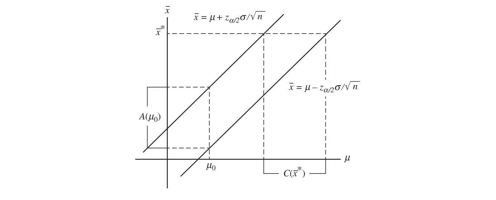
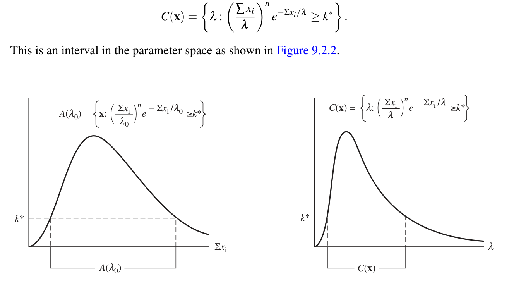
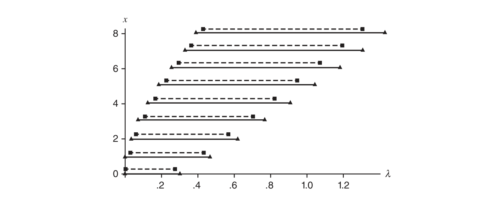
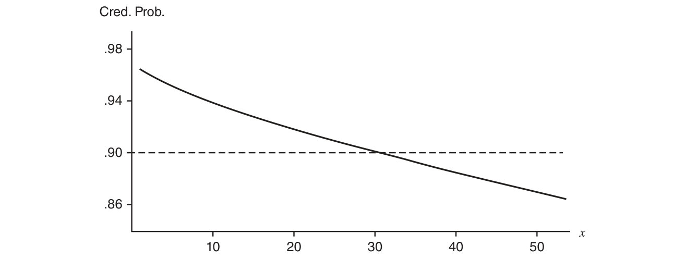
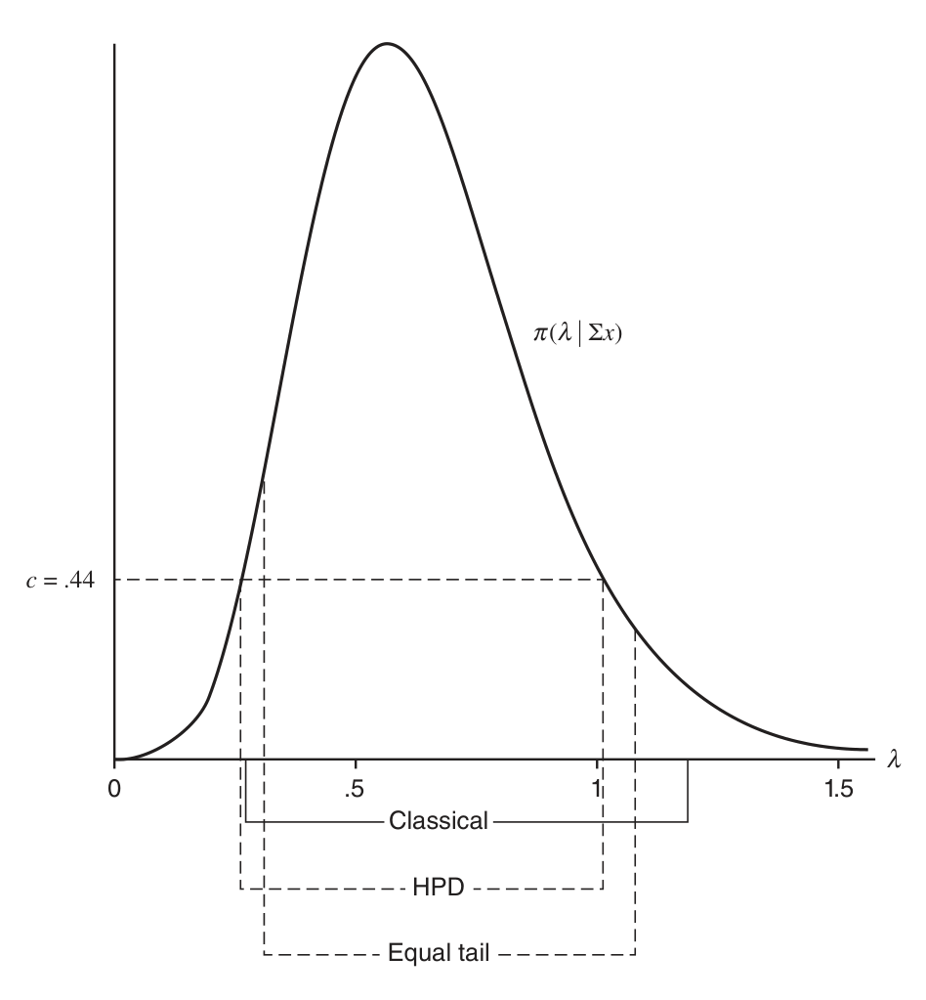

# 第 9 章　区间估计（Interval Estimation）

> *“I fear,” said Holmes, “that if the matter is beyond humanity it is certainly beyond me. Yet we must exhaust all natural explanations before we fall back upon such a theory as this.”*
>
> “我担心，”福尔摩斯说，“如果这件事超出了人类所能解释的界限，那它无疑也超出了我的能力。但在退而诉诸这样一种理论之前，我们必须先穷尽一切自然的解释。”
>
> ——歇洛克·福尔摩斯（《魔鬼之足》）

## 9.1 引言（Introduction）

第 7 章讨论了参数 $$\theta$$ 的点估计，那里的推断是对 $$\theta$$ 的取值给出一个单独的猜测值。本章讨论区间估计（interval estimation），以及更一般的集合估计（set estimation）。集合估计问题中的推断是陈述“$$\theta \in C$$”，其中 $$C \subset \Theta$$，且 $$C = C(\textbf{x})$$ 是由观测数据 $$\textbf{X} = \textbf{x}$$ 的值确定的集合。若 $$\theta$$ 是实值参数，我们通常希望集合估计 $$C$$ 是一个区间。区间估计量将是本章的主题。

与前两章一样，本章分为两部分：第一部分讨论如何寻找区间估计量，第二部分讨论如何评价区间估计量的优劣。我们先给出区间估计量的形式定义——它与点估计量的定义一样宽泛。

> **定义 9.1.1（区间估计）**
>
> 实值参数 $$\theta$$ 的***区间估计***（interval estimate）是样本的任意一对函数 $$L(x_1, \ldots, x_n)$$ 与 $$U(x_1, \ldots, x_n)$$，满足对一切 $$\textbf{x} \in \mathcal{X}$$ 有 $$L(\textbf{x}) \leq U(\textbf{x})$$。若观测到 $$\textbf{X} = \textbf{x}$$，则作出推断 $$L(\textbf{x}) \leq \theta \leq U(\textbf{x})$$。随机区间 $$[L(\textbf{X}), U(\textbf{X})]$$ 称为***区间估计量***（interval estimator）。

我们将沿用此前约定的记号：$$[L(\textbf{X}), U(\textbf{X})]$$ 表示基于随机样本 $$\textbf{X} = (X_1, \ldots, X_n)$$ 的区间估计量，$$[L(\textbf{x}), U(\textbf{x})]$$ 表示它的实现值（观测值）。虽然在多数情形我们取 $$L$$ 与 $$U$$ 为有限值，但有时也对单侧区间估计感兴趣。例如取 $$L(\textbf{x}) = -\infty$$，就得到单侧区间 $$(-\infty, U(\textbf{x})]$$，断言“$$\theta \leq U(\textbf{x})$$”而不涉及下界；类似地可取 $$U(\textbf{x}) = \infty$$，得到单侧区间 $$[L(\textbf{x}), \infty)$$。

定义中给出的是闭区间 $$[L(\textbf{x}), U(\textbf{x})]$$，但有时使用开区间 $$(L(\textbf{x}), U(\textbf{x}))$$、甚至前一段那样的半开半闭区间会更自然。对具体问题我们将选用最合适的区间形式，尽管一般偏好闭区间。

> **例 9.1.2（区间估计量）**
>
> 设 $$X_1, X_2, X_3, X_4$$ 是来自 $$n(\mu, 1)$$ 总体的样本，则 $$\mu$$ 的一个区间估计量是 $$[\bar{X} - 1,\ \bar{X} + 1]$$。这意味着我们将断言 $$\mu$$ 落在该区间之内。

此时自然会问：使用区间估计量究竟能得到什么？此前我们用 $$\bar{X}$$ 估计 $$\mu$$，而现在换成了看似“更不精确”的估计量 $$[\bar{X} - 1, \bar{X} + 1]$$。我们必定有所得！通过在估计（或关于 $$\mu$$ 的断言）上放弃一些精确性，我们获得了断言正确性上的某种置信（confidence）或保证（assurance）。

> **例 9.1.3（例 9.1.2 的续）**
>
> 用 $$\bar{X}$$ 估计 $$\mu$$ 时，我们恰好估计正确的概率 $$P(\bar{X} = \mu)$$ 为零。而使用区间估计量，我们正确的概率为正。区间 $$[\bar{X} - 1, \bar{X} + 1]$$ 覆盖 $$\mu$$ 的概率可以计算如下：
>
> $$
> \begin{aligned}
> P\bigl( \mu \in [\bar{X} - 1, \bar{X} + 1] \bigr)
>  &= P(\bar{X} - 1 \leq \mu \leq \bar{X} + 1)\\
>  &= P(-1 \leq \bar{X} - \mu \leq 1)\\
>  &= P\Bigl( -2 \leq \frac{\bar{X} - \mu}{\sqrt{1/4}} \leq 2 \Bigr)
>  \qquad （\bar{X} \sim n(\mu, 1/4)，\ \sqrt{1/4}\ \text{是其标准差}）\\
>  &= P(-2 \leq Z \leq 2) \qquad \Bigl( \frac{\bar{X} - \mu}{\sqrt{1/4}}\ \text{服从标准正态分布} \Bigr)\\
>  &= 0.9544.
> \end{aligned}
> $$
>
> 于是，我们的区间估计量有超过 95% 的机会覆盖未知参数。从点估计到区间估计，牺牲估计的一部分精确性，换来的是断言正确性的置信度的提高。

使用区间估计量而非点估计量的目的，在于对“捕获感兴趣的参数”获得某种保证。这一保证的确定程度由下面的定义来量化。

> **定义 9.1.4（覆盖概率）**
>
> 对参数 $$\theta$$ 的区间估计量 $$[L(\textbf{X}), U(\textbf{X})]$$，其***覆盖概率***（coverage probability）是指随机区间 $$[L(\textbf{X}), U(\textbf{X})]$$ 覆盖真参数 $$\theta$$ 的概率，记作 $$P_{\theta}\bigl( \theta \in [L(\textbf{X}), U(\textbf{X})] \bigr)$$ 或 $$P\bigl( \theta \in [L(\textbf{X}), U(\textbf{X})] \mid \theta \bigr)$$。

> **定义 9.1.5（置信系数）**
>
> 对参数 $$\theta$$ 的区间估计量 $$[L(\textbf{X}), U(\textbf{X})]$$，其***置信系数***（confidence coefficient）是覆盖概率的下确界：
>
> $$
> \inf_{\theta} P_{\theta}\bigl( \theta \in [L(\textbf{X}), U(\textbf{X})] \bigr).
> $$

关于这两个定义有几点需要注意。其一，务必记住随机的是区间而不是参数。因此，当我们写出 $$P_{\theta}\bigl( \theta \in [L(\textbf{X}), U(\textbf{X})] \bigr)$$ 这样的概率陈述时，它针对的是 $$\textbf{X}$$ 而非 $$\theta$$。换言之，$$P_{\theta}\bigl( \theta \in [L(\textbf{X}), U(\textbf{X})] \bigr)$$ 看似是关于随机 $$\theta$$ 的陈述，应把它理解为代数等价的 $$P_{\theta}\bigl( L(\textbf{X}) \leq \theta,\ U(\textbf{X}) \geq \theta \bigr)$$——一个关于随机 $$\textbf{X}$$ 的陈述。

附带置信度量（通常是置信系数）的区间估计量有时统称为置信区间（confidence interval）。我们将把这一术语与“区间估计量”交替使用。虽然我们主要关心置信区间，但偶尔也处理更一般的集合；在一般性的讨论中、当尚不确定集合的确切形式时，我们使用置信集合（confidence set）一词。置信系数等于某个值（例如 $$1 - \alpha$$）的置信集合简称为 $$1 - \alpha$$ 置信集合。

另一点与覆盖概率及置信系数有关。由于我们不知道 $$\theta$$ 的真值，我们能保证的覆盖概率只是其下确界，即置信系数。在某些情形这无关紧要，因为覆盖概率是 $$\theta$$ 的常值函数；但在另一些情形，覆盖概率可能是 $$\theta$$ 的变化相当剧烈的函数。

> **例 9.1.6（尺度均匀分布的区间估计量）**
>
> 设 $$X_1, \ldots, X_n$$ 是来自 uniform$(0, \theta)$$ 总体的随机样本，令 $$Y = \max\{X_1, \ldots, X_n\}$$。我们关心 $$\theta$$ 的区间估计量，考察两个候选者：$$[aY, bY]$$（$$1 \leq a < b$$）与 $$[Y + c, Y + d]$$（$$0 \leq c < d$$），其中 $$a, b, c, d$$ 是指定常数。（注意必有 $$\theta > y$$。）对第一个区间，
>
> $$
> \begin{aligned}
> P_{\theta}\bigl( \theta \in [aY, bY] \bigr)
>  &= P_{\theta}(aY \leq \theta \leq bY)\\
>  &= P_{\theta}\Bigl( \frac{1}{b} \leq \frac{Y}{\theta} \leq \frac{1}{a} \Bigr)\\
>  &= P_{\theta}\Bigl( \frac{1}{b} \leq T \leq \frac{1}{a} \Bigr) \qquad （T = Y/\theta）.
> \end{aligned}
> $$
>
> 我们在例 7.3.13 中已见 $$f_Y(y) = ny^{n-1}/\theta^n$$（$$0 \leq y \leq \theta$$），故 $$T$$ 的 pdf 为 $$f_T(t) = nt^{n-1}$$（$$0 \leq t \leq 1$$）。于是
>
> $$
> P_{\theta}\Bigl( \frac{1}{b} \leq T \leq \frac{1}{a} \Bigr) = \int_{1/b}^{1/a} nt^{n-1}\, dt = \Bigl( \frac{1}{a} \Bigr)^{\! n} - \Bigl( \frac{1}{b} \Bigr)^{\! n}.
> $$
>
> 第一个区间的覆盖概率与 $$\theta$$ 的值无关，故 $$\left( \tfrac{1}{a} \right)^n - \left( \tfrac{1}{b} \right)^n$$ 就是该区间的置信系数。
>
> 对第二个区间，当 $$\theta \geq d$$ 时类似计算给出
>
> $$
> \begin{aligned}
> P_{\theta}\bigl( \theta \in [Y + c, Y + d] \bigr)
>  &= P_{\theta}(Y + c \leq \theta \leq Y + d)\\
>  &= P_{\theta}\Bigl( 1 - \frac{d}{\theta} \leq T \leq 1 - \frac{c}{\theta} \Bigr) \qquad （T = Y/\theta）\\
>  &= \int_{1-d/\theta}^{1-c/\theta} nt^{n-1}\, dt = \Bigl( 1 - \frac{c}{\theta} \Bigr)^{\! n} - \Bigl( 1 - \frac{d}{\theta} \Bigr)^{\! n}.
> \end{aligned}
> $$
>
> 此时覆盖概率依赖于 $$\theta$$。而且容易算出，对任何常数 $$c$$ 与 $$d$$，
>
> $$
> \lim_{\theta \to \infty} \Bigl[ \Bigl( 1 - \frac{c}{\theta} \Bigr)^{\! n} - \Bigl( 1 - \frac{d}{\theta} \Bigr)^{\! n} \Bigr] = 0,
> $$
>
> 这表明该区间估计量的置信系数为零。

两个候选区间的命运迥异，原因何在？第一个区间的覆盖概率可以借助 $$Y/\theta$$ 表达，而 $$Y/\theta$$ 的分布不依赖参数——这样的量称为枢轴量（pivotal quantity），9.2.2 节将系统研究它。

## 9.2 寻找区间估计量的方法（Methods of Finding Interval Estimators）

我们将用五个小节介绍寻找区间估计量的方法。这看起来似乎意味着有五种不同的方法，其实不然：事实上，从操作层面看，接下来四个小节的方法本质上是相同的，都基于**反转检验统计量**的策略；最后一个小节讨论的贝叶斯区间则是一种不同的构造方法。

### 9.2.1 反转检验统计量（Inverting a Test Statistic）

假设检验与区间估计之间存在极强的对应关系。事实上，一般地可以说：每个置信集合都对应一个检验，反之亦然。请看下面的例子。

> **例 9.2.1（反转正态检验）**
>
> 设 $$X_1, \ldots, X_n$$ 是 iid $$n(\mu, \sigma^2)$$，考虑检验 $$H_0 : \mu = \mu_0$$ 对 $$H_1 : \mu \neq \mu_0$$。在给定水平 $$\alpha$$ 下，一个合理的检验（事实上是最强无偏检验）的拒绝区域为 $$\bigl\{ \textbf{x} : \vert \bar{x} - \mu_0\vert  > z_{\alpha/2}\, \sigma / \sqrt{n} \bigr\}$$。注意 $$H_0$$ 在满足
>
> $$
> \vert \bar{x} - \mu_0\vert  \leq z_{\alpha/2}\, \frac{\sigma}{\sqrt{n}}
> \qquad\text{即}\qquad
> \bar{x} - z_{\alpha/2}\, \frac{\sigma}{\sqrt{n}} \leq \mu_0 \leq \bar{x} + z_{\alpha/2}\, \frac{\sigma}{\sqrt{n}}
> $$
>
> 的样本点上被接受。由于该检验的尺寸为 $$\alpha$$，即 $$P(H_0\ \text{被拒绝} \mid \mu = \mu_0) = \alpha$$，换个说法就是 $$P(H_0\ \text{被接受} \mid \mu = \mu_0) = 1 - \alpha$$。把它与上面的接受区域刻画结合起来，可以写成
>
> $$
> P\Bigl( \bar{X} - z_{\alpha/2}\, \frac{\sigma}{\sqrt{n}} \leq \mu_0 \leq \bar{X} + z_{\alpha/2}\, \frac{\sigma}{\sqrt{n}} \;\Big\vert \; \mu = \mu_0 \Bigr) = 1 - \alpha.
> $$
>
> 但这一概率陈述对每个 $$\mu_0$$ 都成立，故陈述
>
> $$
> P_{\mu}\Bigl( \bar{X} - z_{\alpha/2}\, \frac{\sigma}{\sqrt{n}} \leq \mu \leq \bar{X} + z_{\alpha/2}\, \frac{\sigma}{\sqrt{n}} \Bigr) = 1 - \alpha
> $$
>
> 为真。通过反转水平 $$\alpha$$ 检验的接受区域得到的区间 $$\bigl[ \bar{x} - z_{\alpha/2}\, \sigma / \sqrt{n},\ \bar{x} + z_{\alpha/2}\, \sigma / \sqrt{n} \bigr]$$ 是一个 $$1 - \alpha$$ 置信区间。

我们已例示了置信集合与检验之间的对应。假设检验的接受区域（样本空间中接受 $$H_0 : \mu = \mu_0$$ 的集合）为

$$
A(\mu_0) = \Bigl\{ (x_1, \ldots, x_n) : \mu_0 - z_{\alpha/2}\, \frac{\sigma}{\sqrt{n}} \leq \bar{x} \leq \mu_0 + z_{\alpha/2}\, \frac{\sigma}{\sqrt{n}} \Bigr\},
$$

而置信区间（参数空间中 $$\mu$$ 的“貌似合理”取值组成的集合）为

$$
C(x_1, \ldots, x_n) = \Bigl\{ \mu : \bar{x} - z_{\alpha/2}\, \frac{\sigma}{\sqrt{n}} \leq \mu \leq \bar{x} + z_{\alpha/2}\, \frac{\sigma}{\sqrt{n}} \Bigr\}.
$$

这两个集合通过如下恒等式联系在一起：

$$
(x_1, \ldots, x_n) \in A(\mu_0) \iff \mu_0 \in C(x_1, \ldots, x_n).
$$

图 9.2.1　 置信区间与检验接受区域的关系：上线为 $$\bar{x} = \mu + z_{\alpha/2}\, \sigma / \sqrt{n}$$，下线为 $$\bar{x} = \mu - z_{\alpha/2}\, \sigma / \sqrt{n}$$（原书 Figure 9.2.1）

图 9.2.1 展示了双侧正态问题中检验与区间估计的对应关系。由图或许更容易看出：检验与区间问的是同一个问题，只是视角略有不同。两种程序都在寻找样本统计量与总体参数之间的一致性。假设检验**固定参数**，问哪些样本值（接受区域）与该固定值一致；置信集合**固定样本值**，问哪些参数值（置信区间）使这个样本值最貌似合理。

接受区域与置信集合之间的这种对应关系在一般情形成立。下面的定理给出这一对应的形式化版本。

> **定理 9.2.2（检验与置信集合的对应）**
>
> 对每个 $$\theta_0 \in \Theta$$，设 $$A(\theta_0)$$ 是 $$H_0 : \theta = \theta_0$$ 的一个水平 $$\alpha$$ 检验的接受区域。对每个 $$\textbf{x} \in \mathcal{X}$$，在参数空间中定义集合
>
> $$
> C(\textbf{x}) = \{ \theta_0 : \textbf{x} \in A(\theta_0) \}. \tag{9.2.1}
> $$
>
> 则随机集合 $$C(\textbf{X})$$ 是一个 $$1 - \alpha$$ 置信集合。反之，设 $$C(\textbf{X})$$ 是一个 $$1 - \alpha$$ 置信集合。对任意 $$\theta_0 \in \Theta$$，定义
>
> $$
> A(\theta_0) = \{ \textbf{x} : \theta_0 \in C(\textbf{x}) \}.
> $$
>
> 则 $$A(\theta_0)$$ 是 $$H_0 : \theta = \theta_0$$ 的一个水平 $$\alpha$$ 检验的接受区域。
>
> **证明**　第一部分：由于 $$A(\theta_0)$$ 是水平 $$\alpha$$ 检验的接受区域，
>
> $$
> P_{\theta_0}\bigl( \textbf{X} \notin A(\theta_0) \bigr) \leq \alpha
> \quad\text{从而}\quad
> P_{\theta_0}\bigl( \textbf{X} \in A(\theta_0) \bigr) \geq 1 - \alpha.
> $$
>
> 因 $$\theta_0$$ 任意，将其换写为 $$\theta$$。结合上面的不等式与 (9.2.1)，集合 $$C(\textbf{X})$$ 的覆盖概率为
>
> $$
> P_{\theta}\bigl( \theta \in C(\textbf{X}) \bigr) = P_{\theta}\bigl( \textbf{X} \in A(\theta) \bigr) \geq 1 - \alpha,
> $$
>
> 故 $$C(\textbf{X})$$ 是 $$1 - \alpha$$ 置信集合。
>
> 第二部分：对 $$H_0 : \theta = \theta_0$$ 的、以 $$A(\theta_0)$$ 为接受区域的检验，其第一类错误概率为
>
> $$
> P_{\theta_0}\bigl( \textbf{X} \notin A(\theta_0) \bigr) = P_{\theta_0}\bigl( \theta_0 \notin C(\textbf{X}) \bigr) \leq \alpha,
> $$
>
> 故这是一个水平 $$\alpha$$ 检验。 ∎

人们常说“反转一个检验得到置信集合”，但定理 9.2.2 表明：我们实际反转的是一个**检验族**——对每个 $$\theta_0 \in \Theta$$ 各有一个检验——从而得到一个置信集合。

检验可以反转为置信集合（反之亦然）在理论上有意思，而定理 9.2.2 真正有用的是第一部分：构造水平 $$\alpha$$ 的接受区域是件相对容易的事，而构造置信集合才是困难的任务。因此，通过反转接受区域来获得置信集合的方法相当有用——我们掌握的所有寻找检验的手段都可以立即用于构造置信集合。

定理 9.2.2 中我们只陈述了原假设 $$H_0 : \theta = \theta_0$$；对接受区域唯一的要求是

$$
P_{\theta_0}\bigl( \textbf{X} \in A(\theta_0) \bigr) \geq 1 - \alpha.
$$

实践中，用检验反转构造置信集合时，我们心目中通常还有备择假设，如 $$H_1 : \theta \neq \theta_0$$ 或 $$H_1 : \theta > \theta_0$$。备择假设决定了怎样的 $$A(\theta_0)$$ 是合理的，而 $$A(\theta_0)$$ 的形式又决定了 $$C(\textbf{x})$$ 的形状。不过请注意，我们谨慎地使用了“集合”而非“区间”一词：这是因为反转检验得到的置信集合不保证是区间。但在大多数情形，单侧检验给出单侧区间，双侧检验给出双侧区间，奇形怪状的接受区域给出奇形怪状的置信集合；后面的例子将展示这一点。

反转检验的性质也会（经适当修改后）传递给置信集合。例如，无偏检验反转后产生无偏置信集合。更重要的是，由于我们知道寻找好检验时可以只限于充分统计量，因此寻找好的置信集合时同样可以只限于充分统计量。

检验反转方法真正大显身手的场合，是我们的直觉失灵、对“怎样的集合才算合理”毫无头绪之时：此时我们只需退回到构造合理检验的通用方法。

> **例 9.2.3（反转 LRT）**
>
> 假设我们想为 exponential($$\lambda$$) 总体的均值 $$\lambda$$ 构造一个置信区间。可以通过反转 $$H_0 : \lambda = \lambda_0$$ 对 $$H_1 : \lambda \neq \lambda_0$$ 的水平 $$\alpha$$ 检验得到。
>
> 取随机样本 $$X_1, \ldots, X_n$$，LRT 统计量为
>
> $$
> \frac{\lambda_0^n e^{-\sum x_i / \lambda_0}}{\sup_{\lambda} \lambda^n e^{-\sum x_i / \lambda}}
> = \frac{\lambda_0^n e^{-\sum x_i / \lambda_0}}{\bigl( \sum x_i / n \bigr)^n e^{-n}}
> = \Bigl( \frac{\sum x_i}{n \lambda_0} \Bigr)^{\! n} e^{\,n}\, e^{-\sum x_i / \lambda_0}.
> $$
>
> 对固定的 $$\lambda_0$$，接受区域为
>
> $$
> A(\lambda_0) = \Bigl\{ \textbf{x} : \Bigl( \frac{\sum x_i}{\lambda_0} \Bigr)^{\! n} e^{-\sum x_i / \lambda_0} \geq k^{*} \Bigr\}, \tag{9.2.2}
> $$
>
> 其中常数 $$k^{*}$$ 选得使 $$P_{\lambda_0}\bigl( \textbf{X} \in A(\lambda_0) \bigr) = 1 - \alpha$$（常数 $$e^n / n^n$$ 已被吸收进 $$k^{*}$$）。这是样本空间中的一个集合，见图 9.2.2。反转该接受区域得到 $$1 - \alpha$$ 置信集合
>
> $$
> C(\textbf{x}) = \Bigl\{ \lambda : \Bigl( \frac{\sum x_i}{\lambda} \Bigr)^{\! n} e^{-\sum x_i / \lambda} \geq k^{*} \Bigr\}.
> $$
>
> 如图 9.2.2 所示，这是参数空间中的一个区间。
>
> 
>
> 图 9.2.2　 例 9.2.3 的接受区域与置信区间：接受区域为 $$A(\lambda_0) = \bigl\{ \textbf{x} : \bigl( \sum_i x_i / \lambda_0 \bigr)^n e^{-\sum_i x_i / \lambda_0} \geq k^{*} \bigr\}$$，置信区间为 $$C(\textbf{x}) = \bigl\{ \lambda : \bigl( \sum_i x_i / \lambda \bigr)^n e^{-\sum_i x_i / \lambda} \geq k^{*} \bigr\}$$（原书 Figure 9.2.2）
>
>
> 定义 $$C(\textbf{x})$$ 的表达式只通过 $$\sum x_i$$ 依赖 $$\textbf{x}$$，故置信区间可以写成
>
> $$
> C\bigl( \textstyle\sum x_i \bigr) = \bigl\{ \lambda : L\bigl( \textstyle\sum x_i \bigr) \leq \lambda \leq U\bigl( \textstyle\sum x_i \bigr) \bigr\} \tag{9.2.3}
> $$
>
> 的形式，其中 $$L$$ 与 $$U$$ 由如下约束确定：集合 (9.2.2) 的概率为 $$1 - \alpha$$，且
>
> $$
> \Bigl( \frac{\sum x_i}{L(\sum x_i)} \Bigr)^{\! n} e^{-\sum x_i / L(\sum x_i)}
> = \Bigl( \frac{\sum x_i}{U(\sum x_i)} \Bigr)^{\! n} e^{-\sum x_i / U(\sum x_i)}. \tag{9.2.4}
> $$
>
> 令
>
> $$
> \frac{\sum x_i}{L(\sum x_i)} = a, \qquad \frac{\sum x_i}{U(\sum x_i)} = b, \tag{9.2.5}
> $$
>
> 其中 $$a > b$$ 是常数，则 (9.2.4) 变为
>
> $$
> a^n e^{-a} = b^n e^{-b}, \tag{9.2.6}
> $$
>
> 它容易数值求解。为算出一些细节，取 $$n = 2$$，注意 $$\sum X_i \sim \mathrm{gamma}(2, \lambda)$$，从而 $$\sum X_i / \lambda \sim \mathrm{gamma}(2, 1)$$。于是由 (9.2.5)，置信区间为 $$\bigl\{ \lambda : \tfrac{1}{a} \sum x_i \leq \lambda \leq \tfrac{1}{b} \sum x_i \bigr\}$$，其中 $$a, b$$ 满足
>
> $$
> P_{\lambda}\Bigl( \frac{1}{a} \sum X_i \leq \lambda \leq \frac{1}{b} \sum X_i \Bigr)
> = P\Bigl( b \leq \frac{\sum X_i}{\lambda} \leq a \Bigr) = 1 - \alpha,
> $$
>
> 且由 (9.2.6) 有 $$a^2 e^{-a} = b^2 e^{-b}$$。于是
>
> $$
> \begin{aligned}
> P\Bigl( b \leq \frac{\sum X_i}{\lambda} \leq a \Bigr)
> = \int_b^a t e^{-t}\, dt
> = e^{-b}(b + 1) - e^{-a}(a + 1) \qquad （\text{分部积分}）.
> \end{aligned}
> $$
>
> 例如要得到 90% 置信区间，须同时满足概率条件与约束条件。取三位小数得 $$a = 5.480$$，$$b = 0.441$$，置信系数为 $$0.90006$$。于是
>
> $$
> P_{\lambda}\Bigl( \frac{1}{5.480} \sum X_i \leq \lambda \leq \frac{1}{0.441} \sum X_i \Bigr) = 0.90006.
> $$

反转 $$H_0 : \theta = \theta_0$$ 对 $$H_1 : \theta \neq \theta_0$$ 的 LRT（定义 8.2.1）所得的区域形如“若 $$L(\theta_0 \mid \textbf{x}) / L(\hat{\theta} \mid \textbf{x}) \leq k(\theta_0)$$ 则接受 $$H_0$$”，由此得到的置信区域为

$$
\bigl\{ \theta : L(\theta \mid \textbf{x}) \geq k'(\textbf{x}, \theta) \bigr\}, \tag{9.2.7}
$$

其中函数 $$k'$$ 给出 $$1 - \alpha$$ 置信。在某些情形（如正态分布与 gamma 分布），$$k'$$ 不依赖 $$\theta$$；此时似然区域有一个特别令人愉悦的解释：它由似然函数取值最高的那些 $$\theta$$ 组成。我们还将看到，这样的区间同时由频率派（定理 9.3.2）与贝叶斯（推论 9.3.10）两方面的最优性考量产生。

检验反转方法是完全一般的：可以反转任何检验而得到置信集合。例 9.2.3 中我们反转了 LRT，但其实可以用任何方法构造的检验。还要注意，反转双侧检验给出双侧区间。下面几个例子反转单侧检验以得到单侧区间。

> **例 9.2.4（正态单侧置信界）**
>
> 设 $$X_1, \ldots, X_n$$ 是来自 $$n(\mu, \sigma^2)$$ 总体的随机样本，要构造 $$\mu$$ 的 $$1 - \alpha$$ **上**置信界（upper confidence bound），即形如 $$C(\textbf{x}) = (-\infty, U(\textbf{x})]$$ 的置信区间。用定理 9.2.2 得到这种区间的方法是反转单侧检验 $$H_0 : \mu = \mu_0$$ 对 $$H_1 : \mu < \mu_0$$。（注意这里用 $$H_1$$ 的设定来确定置信区间的形式：$$H_1$$ 指定“大”的 $$\mu_0$$ 值，故置信集合将包含“小”的值——小于某个界的那些值，因此得到上置信界。）$$H_0$$ 对 $$H_1$$ 的尺寸 $$\alpha$$ LRT 在
>
> $$
> \frac{\bar{X} - \mu_0}{S / \sqrt{n}} < -t_{n-1, \alpha}
> $$
>
> 时拒绝 $$H_0$$（类似例 8.2.6）。于是该检验的接受区域为
>
> $$
> A(\mu_0) = \Bigl\{ \textbf{x} : \bar{x} \geq \mu_0 - t_{n-1, \alpha}\, \frac{s}{\sqrt{n}} \Bigr\},
> $$
>
> 而 $$\textbf{x} \in A(\mu_0) \iff \bar{x} + t_{n-1, \alpha}\, s / \sqrt{n} \geq \mu_0$$。据 (9.2.1) 定义
>
> $$
> C(\textbf{x}) = \{ \mu_0 : \textbf{x} \in A(\mu_0) \} = \Bigl\{ \mu_0 : \bar{x} + t_{n-1, \alpha}\, \frac{s}{\sqrt{n}} \geq \mu_0 \Bigr\}.
> $$
>
> 由定理 9.2.2，随机集合 $$C(\textbf{X}) = \bigl( -\infty,\ \bar{X} + t_{n-1, \alpha}\, S / \sqrt{n} \bigr]$$ 是 $$\mu$$ 的 $$1 - \alpha$$ 置信集合。可见它确实是上置信界的正确形式：反转单侧检验得到了单侧置信区间。

> **例 9.2.5（二项单侧置信界）**
>
> 作为单侧置信区间较难的例子，考虑对 Bernoulli 试验序列的成功概率 $$p$$ 给出 $$1 - \alpha$$ **下**置信界（lower confidence bound）。即观测 $$X_1, \ldots, X_n$$（$$X_i \sim \mathrm{Bernoulli}(p)$$），希望区间形如 $$\bigl( L(x_1, \ldots, x_n),\ 1 \bigr]$$，满足 $$P_p\bigl( p \in (L(X_1, \ldots, X_n), 1] \bigr) \geq 1 - \alpha$$。（如将要看到的，所得区间左端是开的。）
>
> 由于我们要的是给出下置信界的单侧区间，考虑反转如下检验的接受区域：
>
> $$
> H_0 :\ p = p_0 \qquad\text{对}\qquad H_1 :\ p > p_0.
> $$
>
> 为简化问题，注意检验可以基于 $$T = \sum_{i=1}^{n} X_i \sim \mathrm{binomial}(n, p)$$，因为 $$T$$ 是 $$p$$ 的充分统计量（见杂记一节）。由于二项分布具有单调似然比（习题 8.25），由 Karlin–Rubin 定理（定理 8.3.17），在 $$T > k(p_0)$$ 时拒绝 $$H_0$$ 的检验是其尺寸的 UMP 检验。对每个 $$p_0$$，选取常数 $$k(p_0)$$（可以是整数）使检验为水平 $$\alpha$$。由于 $$T$$ 的离散性，除某些特定的 $$p_0$$ 外无法使检验尺寸恰为 $$\alpha$$；我们选择 $$k(p_0)$$ 使检验尺寸尽可能接近 $$\alpha$$ 而不超过它。于是 $$k(p_0)$$ 定义为 $$0$$ 与 $$n$$ 之间同时满足如下不等式的整数：
>
> $$
> \sum_{y=0}^{k(p_0)} \binom{n}{y} p_0^{\,y} (1 - p_0)^{n-y} \geq 1 - \alpha
> \quad\text{且}\quad
> \sum_{y=0}^{k(p_0)-1} \binom{n}{y} p_0^{\,y} (1 - p_0)^{n-y} < 1 - \alpha. \tag{9.2.8}
> $$
>
> 由于二项分布的 MLR 性质，对每个 $$k = 0, \ldots, n$$，量
>
> $$
> f(p_0 \mid k) = \sum_{y=0}^{k} \binom{n}{y} p_0^{\,y} (1 - p_0)^{n-y}
> $$
>
> 是 $$p_0$$ 的递减函数（习题 8.26）。当然 $$f(0 \mid 0) = 1$$，故 $$k(0) = 0$$，且 $$f(p_0 \mid 0)$$ 在一段区间上保持大于 $$1 - \alpha$$；到某点处 $$f(p_0 \mid 0) = 1 - \alpha$$，此后 $$f(p_0 \mid 0) < 1 - \alpha$$，于是 $$k(p_0)$$ 跳升到一。此模式持续：$$k(p_0)$$ 是整数值的阶梯函数，在 $$p_0$$ 的一段范围内取常值，然后跳到下一个更大的整数。由于 $$k(p_0)$$ 是 $$p_0$$ 的非降函数，这就给出下置信界。（上置信界见习题 9.5。）求解 (9.2.8) 中的 $$k(p_0)$$ 同时给出检验的接受区域与置信集合。
>
> 对每个 $$p_0$$，接受区域为 $$A(p_0) = \{ t : t \leq k(p_0) \}$$，其中 $$k(p_0)$$ 满足 (9.2.8)。对每个 $$t$$ 值，置信集合为 $$C(t) = \{ p_0 : t \leq k(p_0) \}$$。然而这个集合目前的形式没有多少实用价值：它形式上正确、也是 $$1 - \alpha$$ 置信集合，但它通过 $$p_0$$ 隐式定义，而我们要它通过 $$p_0$$ 显式定义。
>
> 由于 $$k(p_0)$$ 非降，对给定观测 $$T = t$$，存在某个值（记作 $$k^{-1}(t)$$），使一切 $$p_0 \leq k^{-1}(t)$$ 有 $$k(p_0) < t$$；在 $$k^{-1}(t)$$ 处 $$k(p_0)$$ 跳升到等于 $$t$$，且对一切 $$p_0 > k^{-1}(t)$$ 有 $$k(p_0) \geq t$$。（注意在 $$p_0 = k^{-1}(t)$$ 处 $$f(p_0 \mid t - 1) = 1 - \alpha$$，故 $$k(p_0) = t - 1$$ 仍满足 (9.2.8)；只有 $$p_0 > k^{-1}(t)$$ 时才有 $$k(p_0) \geq t$$。）于是置信集合为
>
> $$
> C(t) = \{ p_0 : t \leq k(p_0) \} = \bigl\{ p_0 : p_0 > k^{-1}(t) \bigr\}, \tag{9.2.9}
> $$
>
> 从而我们构造了形如 $$C(T) = \bigl( k^{-1}(T),\ 1 \bigr]$$ 的 $$1 - \alpha$$ 下置信界。
>
> $$k^{-1}(t)$$ 可定义为
>
> $$
> k^{-1}(t) = \sup\Bigl\{ p : \sum_{y=0}^{t-1} \binom{n}{y} p^{\,y} (1 - p)^{n-y} \geq 1 - \alpha \Bigr\}. \tag{9.2.10}
> $$
>
> 注意 $$k^{-1}(t)$$ 并不是 $$k(p_0)$$ 真正的反函数，因为 $$k(p_0)$$ 不是一一对应的；但 (9.2.8) 与 (9.2.10) 给出了 $$k$$ 与 $$k^{-1}$$ 的良定义。
>
> 二项置信界问题最早由 Clopper and Pearson (1934) 处理，他们对双侧区间得到了与上面类似的结果（习题 9.21），并开启了至今仍活跃的研究方向；见杂记 9.5.2 节。

### 9.2.2 枢轴量（Pivotal Quantities）

例 9.1.6 中两个置信区间在许多方面不同，一个重要差别是：区间 $$[aY, bY]$$ 的覆盖概率不依赖参数 $$\theta$$ 的值，而 $$[Y + c, Y + d]$$ 的覆盖概率依赖。原因在于，$$[aY, bY]$$ 的覆盖概率可以借助量 $$Y/\theta$$ 表达，而 $$Y/\theta$$ 是一个分布不依赖参数的随机变量——这样的量称为枢轴量（pivotal quantity）或枢轴（pivot）。

用枢轴量构造置信集合（由此得到所谓枢轴推断，pivotal inference）主要归功于 G. A. Barnard（1949, 1980），但其思想可以追溯到 Fisher（1930），后者使用了“逆概率”（inverse probability）一词。与此密切相关的是 D. A. S. Fraser 的结构推断理论（Fraser 1968, 1979）。Berger and Wolpert (1984) 对这些方法的优缺点给出了有趣的讨论。

> **定义 9.2.6（枢轴量）**
>
> 若随机变量 $$Q(\textbf{X}, \theta) = Q(X_1, \ldots, X_n, \theta)$$ 的分布不依赖任何参数，则称它为***枢轴量***（pivotal quantity）或枢轴（pivot）。也就是说，若 $$\textbf{X} \sim F(\textbf{x} \mid \theta)$$，则对 $$\theta$$ 的一切取值，$$Q(\textbf{X}, \theta)$$ 都具有相同的分布。

函数 $$Q(\textbf{x}, \theta)$$ 通常同时显含参数与统计量，但对任意集合 $$A$$，$$P_{\theta}\bigl( Q(\textbf{X}, \theta) \in A \bigr)$$ 不依赖 $$\theta$$。由枢轴构造置信集合的技巧在于：找到一个枢轴与一个集合 $$A$$，使 $$\{ \theta : Q(\textbf{x}, \theta) \in A \}$$ 成为 $$\theta$$ 的集合估计。

> **例 9.2.7（位置–尺度枢轴）**
>
> 在位置族与尺度族中存在大量枢轴量。这里列举几个；更多见习题 9.8。设 $$X_1, \ldots, X_n$$ 是来自下表所指 pdf 的随机样本，$$\bar{X}$$ 与 $$S$$ 分别是样本均值与样本标准差。要证明这些量是枢轴，只需证明它们的 pdf 不依赖参数（细节见习题 9.9）。特别地，若 $$X_1, \ldots, X_n$$ 是来自 $$n(\mu, \sigma^2)$$ 总体的随机样本，则 $$t$$ 统计量 $$(\bar{X} - \mu)/(S / \sqrt{n})$$ 是枢轴，因为 $$t$$ 分布不依赖参数 $$\mu$$ 与 $$\sigma^2$$。
>
> *表 9.2.1　 位置–尺度枢轴（原书 Table 9.2.1）*
>
> | pdf 的形式 | pdf 的类型 | 枢轴量 |
> |:---:|:---:|:---:|
> | $$f(x - \mu)$$ | 位置 | $$\bar{X} - \mu$$ |
> | $$\dfrac{1}{\sigma} f\Bigl( \dfrac{x}{\sigma} \Bigr)$$ | 尺度 | $$\dfrac{\bar{X}}{\sigma}$$ |
> | $$\dfrac{1}{\sigma} f\Bigl( \dfrac{x - \mu}{\sigma} \Bigr)$$ | 位置–尺度 | $$\dfrac{\bar{X} - \mu}{S}$$ |

9.2.1 节用检验反转法构造的区间中，有些恰好基于枢轴（例 9.2.3 与例 9.2.4），有些则不是（例 9.2.5）。寻找枢轴没有放之四海而皆准的策略，但我们可以聪明一点而不全凭猜测。例如，对位置参数或尺度参数寻找枢轴是相对容易的任务：一般地，在位置问题中**差**是枢轴，而在尺度问题中**比**（或乘积）是枢轴。

> **例 9.2.8（gamma 枢轴）**
>
> 设 $$X_1, \ldots, X_n$$ 是 iid exponential($$\lambda$$)。则 $$T = \sum X_i$$ 是 $$\lambda$$ 的充分统计量且 $$T \sim \mathrm{gamma}(n, \lambda)$$。在 gamma pdf 中 $$t$$ 与 $$\lambda$$ 以 $$t/\lambda$$ 的形式同时出现；事实上 $$\mathrm{gamma}(n, \lambda)$$ 的 pdf $$(\Gamma(n) \lambda^n)^{-1} t^{n-1} e^{-t/\lambda}$$ 是一个尺度族。于是若取 $$Q(T, \lambda) = 2T / \lambda$$，则
>
> $$
> Q(T, \lambda) \sim \mathrm{gamma}\bigl( n,\ \lambda \cdot (2/\lambda) \bigr) = \mathrm{gamma}(n, 2),
> $$
>
> 它不依赖 $$\lambda$$。量 $$Q(T, \lambda) = 2T / \lambda$$ 是一个服从 $$\mathrm{gamma}(n, 2)$$ 分布（即 $$\chi^2_{2n}$$ 分布）的枢轴。

有时可以观察 pdf 的形式来判断枢轴是否存在。上例中 $$t/\lambda$$ 出现在 pdf 里，而它确实是枢轴；正态 pdf 中出现量 $$(x - \mu)/\sigma$$，它也是枢轴。一般地，设统计量 $$T$$ 的 pdf $$f(t \mid \theta)$$ 可以写成

$$
f(t \mid \theta) = g\bigl( Q(t, \theta) \bigr) \Bigl\vert  \frac{\partial Q(t, \theta)}{\partial t} \Bigr\vert , \tag{9.2.11}
$$

其中 $$g$$ 是某个函数，$$Q$$ 是某个单调函数（对每个 $$\theta$$ 关于 $$t$$ 单调）。则由定理 2.1.5 可以证明（习题 9.10）$$Q(T, \theta)$$ 是枢轴。

有了枢轴之后，怎样用它构造置信集合？这一步相当简单。若 $$Q(\textbf{X}, \theta)$$ 是枢轴，则对指定的 $$\alpha$$ 值可以找到不依赖 $$\theta$$ 的数 $$a$$ 与 $$b$$，使

$$
P_{\theta}\bigl( a \leq Q(\textbf{X}, \theta) \leq b \bigr) \geq 1 - \alpha.
$$

于是对每个 $$\theta_0 \in \Theta$$，

$$
A(\theta_0) = \{ \textbf{x} : a \leq Q(\textbf{x}, \theta_0) \leq b \} \tag{9.2.12}
$$

是 $$H_0 : \theta = \theta_0$$ 的水平 $$\alpha$$ 检验的接受区域。我们用检验反转法构造置信集合，只是用枢轴来指定接受区域的具体形式。由定理 9.2.2 反转这些检验得到

$$
C(\textbf{x}) = \{ \theta_0 : a \leq Q(\textbf{x}, \theta_0) \leq b \}, \tag{9.2.13}
$$

且 $$C(\textbf{X})$$ 是 $$\theta$$ 的 $$1 - \alpha$$ 置信集合。若 $$\theta$$ 是实值参数，且对每个 $$\textbf{x} \in \mathcal{X}$$，$$Q(\textbf{x}, \theta)$$ 是 $$\theta$$ 的单调函数，则 $$C(\textbf{x})$$ 必是区间。事实上，若 $$Q(\textbf{x}, \theta)$$ 关于 $$\theta$$ 递增，则 $$C(\textbf{x})$$ 形如 $$L(\textbf{x}, a) \leq \theta \leq U(\textbf{x}, b)$$；若 $$Q(\textbf{x}, \theta)$$ 关于 $$\theta$$ 递减（这是常见情形），则 $$C(\textbf{x})$$ 形如 $$L(\textbf{x}, b) \leq \theta \leq U(\textbf{x}, a)$$。

> **例 9.2.9（例 9.2.8 的续）**
>
> 例 9.2.3 中我们通过反转 $$H_0 : \lambda = \lambda_0$$ 对 $$H_1 : \lambda \neq \lambda_0$$ 的水平 $$\alpha$$ LRT 得到了 exponential($$\lambda$$) pdf 的均值 $$\lambda$$ 的置信区间。现在我们还看到：若有样本 $$X_1, \ldots, X_n$$，可令 $$T = \sum X_i$$ 并取 $$Q(T, \lambda) = 2T/\lambda \sim \chi^2_{2n}$$。
>
> 取常数 $$a, b$$ 使 $$P\bigl( a \leq \chi^2_{2n} \leq b \bigr) = 1 - \alpha$$，则
>
> $$
> P_{\lambda}\Bigl( a \leq \frac{2T}{\lambda} \leq b \Bigr)
> = P_{\lambda}\bigl( a \leq Q(T, \lambda) \leq b \bigr)
> = P\bigl( a \leq \chi^2_{2n} \leq b \bigr) = 1 - \alpha.
> $$
>
> 反转集合 $$A(\lambda) = \{ t : a \leq 2t/\lambda \leq b \}$$ 得到 $$C(t) = \bigl\{ \lambda : 2t/b \leq \lambda \leq 2t/a \bigr\}$$，这是一个 $$1 - \alpha$$ 置信区间。（注意下端点依赖 $$b$$、上端点依赖 $$a$$，正如前面所述：$$Q(t, \lambda) = 2t/\lambda$$ 关于 $$\lambda$$ 递减。）例如取 $$n = 10$$，查卡方表可知 95% 置信区间为 $$\bigl\{ \lambda : 2T/34.17 \leq \lambda \leq 2T/9.59 \bigr\}$$。

对位置问题，即使方差未知，枢轴区间的构造与计算也相当容易。事实上我们早已用过这些想法，只是没有正式命名。

> **例 9.2.10（正态枢轴区间）**
>
> 由定理 5.3.1，若 $$X_1, \ldots, X_n$$ 是 iid $$n(\mu, \sigma^2)$$，则 $$(\bar{X} - \mu)/(\sigma / \sqrt{n})$$ 是枢轴。若 $$\sigma^2$$ 已知，可用该枢轴计算 $$\mu$$ 的置信区间：对任意常数 $$a$$，
>
> $$
> P\Bigl( -a \leq \frac{\bar{X} - \mu}{\sigma / \sqrt{n}} \leq a \Bigr) = P(-a \leq Z \leq a) \qquad （Z\ \text{是标准正态的}）,
> $$
>
> 经过（如今已）熟悉的代数运算得到置信区间
>
> $$
> \Bigl\{ \mu : \bar{x} - a\, \frac{\sigma}{\sqrt{n}} \leq \mu \leq \bar{x} + a\, \frac{\sigma}{\sqrt{n}} \Bigr\}.
> $$
>
> 若 $$\sigma^2$$ 未知，可用位置–尺度枢轴 $$(\bar{X} - \mu)/(S/\sqrt{n})$$。由于 $$(\bar{X} - \mu)/(S/\sqrt{n})$$ 服从 Student $$t$$ 分布，
>
> $$
> P\Bigl( -a \leq \frac{\bar{X} - \mu}{S / \sqrt{n}} \leq a \Bigr) = P(-a \leq T_{n-1} \leq a).
> $$
>
> 于是对给定的 $$\alpha$$，取 $$a = t_{n-1, \alpha/2}$$，得 $$1 - \alpha$$ 置信区间
>
> $$
> \Bigl\{ \mu : \bar{x} - t_{n-1, \alpha/2}\, \frac{s}{\sqrt{n}} \leq \mu \leq \bar{x} + t_{n-1, \alpha/2}\, \frac{s}{\sqrt{n}} \Bigr\}, \tag{9.2.14}
> $$
>
> 这就是基于 Student $$t$$ 分布的经典 $$\mu$$ 的 $$1 - \alpha$$ 置信区间。
>
> 继续本例，假设还想给出 $$\sigma$$ 的区间估计。由于 $$(n-1)S^2/\sigma^2 \sim \chi^2_{n-1}$$，它也是枢轴。取 $$a, b$$ 使
>
> $$
> P\Bigl( a \leq \frac{(n-1)S^2}{\sigma^2} \leq b \Bigr) = P\bigl( a \leq \chi^2_{n-1} \leq b \bigr) = 1 - \alpha,
> $$
>
> 反转该集合便得 $$1 - \alpha$$ 置信区间
>
> $$
> \Bigl\{ \sigma^2 : \frac{(n-1)s^2}{b} \leq \sigma^2 \leq \frac{(n-1)s^2}{a} \Bigr\},
> $$
>
> 等价地，
>
> $$
> \Bigl\{ \sigma : \sqrt{\frac{(n-1)s^2}{b}} \leq \sigma \leq \sqrt{\frac{(n-1)s^2}{a}} \Bigr\}.
> $$
>
> 能产生所需区间的一种取法是 $$a = \chi^2_{n-1, 1-\alpha/2}$$ 与 $$b = \chi^2_{n-1, \alpha/2}$$，它把概率平分，各在分布两端放 $$\alpha/2$$。然而 $$\chi^2_{n-1}$$ 分布是偏斜的，对偏斜分布等概率分割是否最优并不显然。（即使对对称分布，等概率分割是否最优也不显然，只是直觉上后一种情形更可信。）事实上，对卡方分布，等概率分割并非最优，这将在 9.3 节看到（另见习题 9.52）。
>
> 关于本问题的最后一点说明：我们已分别构造了 $$\mu$$ 与 $$\sigma$$ 的置信区间。完全可能我们对 $$\mu$$ 与 $$\sigma$$ **同时**的置信集合感兴趣。Bonferroni 不等式是实现这一点的一个简单（且相对好）的方法（见习题 9.14）。

### 9.2.3 反转累积分布函数（Pivoting the CDF）

上一节我们看到枢轴 $$Q$$ 导出形如 (9.2.13) 的置信集合：

$$
C(\textbf{x}) = \{ \theta_0 : a \leq Q(\textbf{x}, \theta_0) \leq b \}.
$$

若对每个 $$\theta$$，$$Q(\textbf{x}, \theta)$$ 关于 $$\theta$$ 单调，则可以保证置信集合 $$C(\textbf{x})$$ 是区间。迄今所见的枢轴主要借助位置与尺度变换构造，都给出单调的 $$Q$$ 函数，从而给出置信区间。

本节使用另一种枢轴：它完全一般，且在少量假设下保证得到区间。

拿不准或遇到陌生情形时，我们的建议是：若可能，基于反转 LRT 构造置信集合。这样的集合虽不保证最优，但绝不会太差。然而在某些情形这种策略在分析上或计算上都太难，反转接受区域有时相当繁琐。若本节的方法可以应用，它实现起来相当直接，而且通常给出合理的集合。

为了说明检验反转法在缺乏对接受区域类型的附加条件时可能遇到的麻烦，请看下面的例子——它展示了构造二项成功概率置信集合的早期方法之一。

> **例 9.2.11（最短长度二项集合）**
>
> Sterne (1954) 提出了如下构造二项置信集合的方法，它产生的集合具有最短长度。给定 $$\alpha$$，对每个 $$p$$ 值，找由“最可能”的 $$x$$ 值组成的尺寸 $$\alpha$$ 接受区域：即对每个 $$p$$，把 $$x = 0, \ldots, n$$ 的值从最可能到最不可能排序，把值放入接受区域 $$A(p)$$ 直到其概率达到 $$1 - \alpha$$；然后用 (9.2.1) 反转这些接受区域得到 $$1 - \alpha$$ 置信集合。Sterne 宣称这样得到的集合具有长度最优性。
>
> 为看清这个看似合理的构造出人意料的问题，考虑一个小例子。设 $$X \sim \mathrm{binomial}(3, p)$$，置信系数取 $$1 - \alpha = 0.442$$。表 9.2.2 给出按 Sterne 构造得到的接受区域，以及反转这族检验导出的置信集合。
>
> 表 9.2.2　 Sterne 构造的接受区域与置信集合：$$X \sim \mathrm{binomial}(3, p)$$，$$1 - \alpha = 0.442$$（原书 Table 9.2.2）
>
> | $$p$$ 的范围 | 接受区域 $$A(p)$$ | 置信集合 $$C(x)$$ |
> |:---:|:---:|:---:|
> | $$[0.000, 0.238]$$ | $$\{0\}$$ | $$x = 0$$：$$[0.000, 0.305) \cup (0.362, 0.366)$$ |
> | $$(0.238, 0.305)$$ | $$\{0, 1\}$$ |  |
> | $$[0.305, 0.362]$$ | $$\{1\}$$ | $$x = 1$$：$$(0.238, 0.634]$$ |
> | $$(0.362, 0.366)$$ | $$\{0, 1\}$$ |  |
> | $$[0.366, 0.634]$$ | $$\{1, 2\}$$ | $$x = 2$$：$$[0.366, 0.762)$$ |
> | $$(0.634, 0.638)$$ | $$\{2, 3\}$$ |  |
> | $$[0.638, 0.695]$$ | $$\{2\}$$ | $$x = 3$$：$$(0.634, 0.638) \cup (0.695, 1.00]$$ |
> | $$(0.695, 0.762)$$ | $$\{2, 3\}$$ |  |
> | $$[0.762, 1.00]$$ | $$\{3\}$$ |  |
>
>
> 令人惊讶的是，置信集合并不是置信区间！这个看似合理的构造给出了一个不合理的程序。该责备的是 pmf：它的表现不符合我们的预期（见习题 9.18）。

我们把参数 $$\theta$$ 的置信区间构造建立在实值统计量 $$T$$ 及其 cdf $$F_T(t \mid \theta)$$ 之上。（实践中通常取 $$T$$ 为 $$\theta$$ 的充分统计量，但下面的理论并不要求这一点。）先设 $$T$$ 是连续随机变量；$$T$$ 离散的情形类似，只是多了若干技术细节，因此我们将离散情形放在单独的定理中叙述。

首先，回顾定理 2.1.10（概率积分变换）：它告诉我们随机变量 $$F_T(T \mid \theta)$$ 服从 uniform$(0,1)$$，是一个枢轴。于是若 $$\alpha_1 + \alpha_2 = \alpha$$，则假设 $$H_0 : \theta = \theta_0$$ 的水平 $$\alpha$$ 接受区域可取为（习题 9.11）

$$
\bigl\{ t : \alpha_1 \leq F_T(t \mid \theta_0) \leq 1 - \alpha_2 \bigr\},
$$

其相应的置信集合为

$$
\bigl\{ \theta : \alpha_1 \leq F_T(t \mid \theta) \leq 1 - \alpha_2 \bigr\}.
$$

现在，为保证置信集合是区间，需要 $$F_T(t \mid \theta)$$ 关于 $$\theta$$ 单调。这一点我们其实已经见过，就在随机递增（stochastically increasing）与随机递减（stochastically decreasing）的定义中（见第 8 章杂记一节及习题 8.26，或习题 3.41–3.43）。若对 $$T$$ 的样本空间 $$\mathcal{T}$$ 中每个 $$t$$，$$F(t \mid \theta)$$ 都是 $$\theta$$ 的递减（递增）函数，则称 cdf 族 $$F(t \mid \theta)$$ 关于 $$\theta$$ 随机递增（随机递减）。下面的讨论只需要 $$F$$ 单调（递增或递减）这一事实；随机递增或递减这些更“统计”的概念只充当解释工具。

> **定理 9.2.12（反转连续 cdf）**
>
> 设 $$T$$ 是具有连续 cdf $$F_T(t \mid \theta)$$ 的统计量。取定 $$\alpha_1 + \alpha_2 = \alpha$$，$$0 < \alpha < 1$$。设对 $$\mathcal{T}$$ 中每个 $$t$$，函数 $$\theta_L(t)$$ 与 $$\theta_U(t)$$ 可按如下方式定义：
>
> - i. 若对每个 $$t$$，$$F_T(t \mid \theta)$$ 关于 $$\theta$$ 递减，则用
>
>   $$
>   F_T\bigl( t \mid \theta_U(t) \bigr) = \alpha_1, \qquad F_T\bigl( t \mid \theta_L(t) \bigr) = 1 - \alpha_2
>   $$
>
>   定义 $$\theta_L(t)$$ 与 $$\theta_U(t)$$；
>
> - ii. 若对每个 $$t$$，$$F_T(t \mid \theta)$$ 关于 $$\theta$$ 递增，则用
>
>   $$
>   F_T\bigl( t \mid \theta_U(t) \bigr) = 1 - \alpha_2, \qquad F_T\bigl( t \mid \theta_L(t) \bigr) = \alpha_1
>   $$
>
>   定义 $$\theta_L(t)$$ 与 $$\theta_U(t)$$。
>
>
> 则随机区间 $$[\theta_L(T), \theta_U(T)]$$ 是 $$\theta$$ 的 $$1 - \alpha$$ 置信区间。
>
> **证明**　只证明情形 (i)；情形 (ii) 的证明类似，留作习题 9.19。
>
> 设已构造 $$1 - \alpha$$ 接受区域 $$\{ t : \alpha_1 \leq F_T(t \mid \theta_0) \leq 1 - \alpha_2 \}$$。由于对每个 $$t$$，$$F_T(t \mid \theta)$$ 关于 $$\theta$$ 递减，且 $$1 - \alpha_2 > \alpha_1$$，故 $$\theta_L(t) < \theta_U(t)$$，且 $$\theta_L(t)$$ 与 $$\theta_U(t)$$ 唯一。又
>
> $$
> F_T(t \mid \theta) < \alpha_1 \iff \theta > \theta_U(t), \qquad
> F_T(t \mid \theta) > 1 - \alpha_2 \iff \theta < \theta_L(t),
> $$
>
> 从而 $$\{ \theta : \alpha_1 \leq F_T(t \mid \theta) \leq 1 - \alpha_2 \} = \{ \theta : \theta_L(T) \leq \theta \leq \theta_U(T) \}$$。 ∎

我们注意到：在没有附加信息时，通常取 $$\alpha_1 = \alpha_2 = \alpha/2$$。虽然这未必总是最优（见定理 9.3.2），但在大多数情形是合理的策略。然而若需要单侧区间，只需取 $$\alpha_1$$ 或 $$\alpha_2$$ 等于零即可轻松实现。

随机递增情形的方程

$$
F_T\bigl( t \mid \theta_U(t) \bigr) = \alpha_1, \qquad F_T\bigl( t \mid \theta_L(t) \bigr) = 1 - \alpha_2 \tag{9.2.15}
$$

也可以用统计量 $$T$$ 的 pdf 表达：$$\theta_U(t)$$ 与 $$\theta_L(t)$$ 可定义为满足

$$
\int_{-\infty}^{t} f_T\bigl( u \mid \theta_U(t) \bigr)\, du = \alpha_1
\qquad\text{与}\qquad
\int_{t}^{\infty} f_T\bigl( u \mid \theta_L(t) \bigr)\, du = \alpha_2
$$

的函数。随机递减情形有类似的一组方程。

> **例 9.2.13（位置指数分布的区间）**
>
> 本方法可用于位置指数 pdf 的置信区间（习题 9.25 将这里的结果与似然法、枢轴法所得进行比较；另见习题 9.41）。
>
> 设 $$X_1, \ldots, X_n$$ iid，pdf 为 $$f(x \mid \mu) = e^{-(x-\mu)} I_{[\mu, \infty)}(x)$$，则 $$Y = \min\{X_1, \ldots, X_n\}$$ 是 $$\mu$$ 的充分统计量，pdf 为
>
> $$
> f_Y(y \mid \mu) = n e^{-n(y - \mu)} I_{[\mu, \infty)}(y).
> $$
>
> 固定 $$\alpha$$，定义 $$\mu_L(y)$$ 与 $$\mu_U(y)$$ 满足
>
> $$
> \int_{\mu_U(y)}^{y} n e^{-n(u - \mu_U(y))}\, du = \frac{\alpha}{2},
> \qquad
> \int_{y}^{\infty} n e^{-n(u - \mu_L(y))}\, du = \frac{\alpha}{2}.
> $$
>
> 积分可算出，得到方程
>
> $$
> 1 - e^{-n(y - \mu_U(y))} = \frac{\alpha}{2},
> \qquad
> e^{-n(y - \mu_L(y))} = \frac{\alpha}{2},
> $$
>
> 解为
>
> $$
> \mu_U(y) = y + \frac{1}{n} \log\Bigl( 1 - \frac{\alpha}{2} \Bigr),
> \qquad
> \mu_L(y) = y + \frac{1}{n} \log\Bigl( \frac{\alpha}{2} \Bigr).
> $$
>
> 故随机区间
>
> $$
> C(Y) = \Bigl\{ \mu : Y + \frac{1}{n} \log\Bigl( \frac{\alpha}{2} \Bigr) \leq \mu \leq Y + \frac{1}{n} \log\Bigl( 1 - \frac{\alpha}{2} \Bigr) \Bigr\}
> $$
>
> 是 $$\mu$$ 的 $$1 - \alpha$$ 置信区间。

关于本方法的使用注意两点。其一，方程 (9.2.15) 只需对实际观测到的统计量值求解：若观测到 $$T = t_0$$，则 $$\theta$$ 的（实现的）置信区间为 $$[\theta_L(t_0), \theta_U(t_0)]$$，故只需求解

$$
\int_{-\infty}^{t_0} f_T\bigl( u \mid \theta_U(t_0) \bigr)\, du = \alpha_1
\qquad\text{与}\qquad
\int_{t_0}^{\infty} f_T\bigl( u \mid \theta_L(t_0) \bigr)\, du = \alpha_2
$$

这两个方程。其二，即使这些方程无法解析求解，也只需数值求解，因为“我们得到的是 $$1 - \alpha$$ 置信区间”的证明并不依赖解析解。

现在考虑离散情形。

> **定理 9.2.14（反转离散 cdf）**
>
> 设 $$T$$ 是离散统计量，cdf 为 $$F_T(t \mid \theta) = P(T \leq t \mid \theta)$$。取定 $$\alpha_1 + \alpha_2 = \alpha$$，$$0 < \alpha < 1$$。设对 $$\mathcal{T}$$ 中每个 $$t$$，$$\theta_L(t)$$ 与 $$\theta_U(t)$$ 可按如下方式定义：
>
> - i. 若对每个 $$t$$，$$F_T(t \mid \theta)$$ 关于 $$\theta$$ 递减，则用
>
>   $$
>   P\bigl( T \leq t \mid \theta_U(t) \bigr) = \alpha_1, \qquad P\bigl( T \geq t \mid \theta_L(t) \bigr) = \alpha_2
>   $$
>
>   定义 $$\theta_L(t)$$ 与 $$\theta_U(t)$$；
>
> - ii. 若对每个 $$t$$，$$F_T(t \mid \theta)$$ 关于 $$\theta$$ 递增，则用
>
>   $$
>   P\bigl( T \geq t \mid \theta_U(t) \bigr) = \alpha_1, \qquad P\bigl( T \leq t \mid \theta_L(t) \bigr) = \alpha_2
>   $$
>
>   定义 $$\theta_L(t)$$ 与 $$\theta_U(t)$$。
>
>
> 则随机区间 $$[\theta_L(T), \theta_U(T)]$$ 是 $$\theta$$ 的 $$1 - \alpha$$ 置信区间。
>
> **证明**　只概述情形 (i) 的证明；细节及情形 (ii) 的证明留作习题 9.20。
>
> 首先回顾习题 2.10：$$F_T(T \mid \theta)$$ 随机地大于均匀随机变量，即对一切 $$x \in [0,1]$$ 有 $$P_{\theta}\bigl( F_T(T \mid \theta) \leq x \bigr) \leq x$$；而且量 $$\bar{F}_T(T \mid \theta) = P(T \geq T \mid \theta)$$ 具有同样的性质。这说明集合
>
> $$
> \bigl\{ \theta : F_T(T \mid \theta) \geq \alpha_1\ \text{且}\ \bar{F}_T(T \mid \theta) \geq \alpha_2 \bigr\}
> $$
>
> 是一个 $$1 - \alpha$$ 置信集合：记 $$A = \{ F_T(T \mid \theta) < \alpha_1 \}$$、$$B = \{ \bar{F}_T(T \mid \theta) < \alpha_2 \}$$，则 $$P_{\theta}(A) \leq \alpha_1$$、$$P_{\theta}(B) \leq \alpha_2$$，于是
>
> $$
> P_{\theta}\bigl( \theta \in C(T) \bigr) = 1 - P_{\theta}(A \cup B) \geq 1 - \alpha_1 - \alpha_2 = 1 - \alpha.
> $$
>
> 对每个 $$t$$，$$F_T(t \mid \theta)$$ 关于 $$\theta$$ 递减意味着 $$\bar{F}(t \mid \theta) = P(T \geq t \mid \theta)$$ 关于 $$\theta$$ 非降。于是（利用 $$\theta_U(t)$$ 与 $$\theta_L(t)$$ 的定义）
>
> $$
> \theta > \theta_U(t) \Rightarrow F_T(t \mid \theta) < \alpha_1,
> \qquad
> \theta < \theta_L(t) \Rightarrow \bar{F}_T(t \mid \theta) < \alpha_2,
> $$
>
> 从而 $$\bigl\{ \theta : F_T(T \mid \theta) \geq \alpha_1\ \text{且}\ \bar{F}_T(T \mid \theta) \geq \alpha_2 \bigr\} = \{ \theta : \theta_L(T) \leq \theta \leq \theta_U(T) \}$$。
>
> **原书注：**原书证明中两个集合显示为 $$\{ \theta : F_T(T \mid \theta) \leq \alpha_1$$ 且 $$\bar{F}_T(T \mid \theta) \leq \alpha_2 \}$$，且两条推导式右端写作 $$\alpha/2$$。按原书条件（$$F_T(t \mid \theta)$$ 递减、$$\bar{F}_T(t \mid \theta)$$ 递增、$$\theta_L(t) < \theta_U(t)$$）与习题 2.10 的性质 $$P_{\theta}\bigl( F_T(T \mid \theta) \leq x \bigr) \leq x$$，这两处不等号方向应取“$$\geq$$”（若取“$$\leq$$”，作为 $$\theta$$ 的集合两条件互相矛盾、恰为空集），而 $$\alpha/2$$ 对应常用的特例 $$\alpha_1 = \alpha_2 = \alpha/2$$（例 9.2.15 正是如此使用）。上文按更正后的逻辑叙述，结论与原书定理一致。 ∎

本节最后用一个例子说明定理 9.2.14 构造的使用。注意，反转 LRT 也可以构造另一个区间（习题 9.23）。

> **例 9.2.15（Poisson 区间估计量）**
>
> 设 $$X_1, \ldots, X_n$$ 是来自 Poisson 总体（参数 $$\lambda$$）的随机样本，令 $$Y = \sum X_i$$。$$Y$$ 是 $$\lambda$$ 的充分统计量且 $$Y \sim \mathrm{Poisson}(n\lambda)$$。用上述方法并取 $$\alpha_1 = \alpha_2 = \alpha/2$$，若观测到 $$Y = y_0$$，需求解方程中的 $$\lambda$$：
>
> $$
> \sum_{k=0}^{y_0} e^{-n\lambda} \frac{(n\lambda)^k}{k!} = \frac{\alpha}{2}
> \qquad\text{与}\qquad
> \sum_{k=y_0}^{\infty} e^{-n\lambda} \frac{(n\lambda)^k}{k!} = \frac{\alpha}{2}. \tag{9.2.16}
> $$
>
> 回忆例 3.3.1 中联系 Poisson 族与 gamma 族的恒等式。把它应用于 (9.2.16) 中的和式（记住 $$y_0$$ 是 $$Y$$ 的观测值），可写
>
> $$
> \frac{\alpha}{2} = \sum_{k=0}^{y_0} e^{-n\lambda} \frac{(n\lambda)^k}{k!}
> = P(Y \leq y_0 \mid \lambda) = P\bigl( \chi^2_{2(y_0 + 1)} > 2n\lambda \bigr),
> $$
>
> 其中 $$\chi^2_{2(y_0+1)}$$ 是自由度为 $$2(y_0 + 1)$$ 的卡方随机变量。于是上述方程的解为
>
> $$
> \lambda = \frac{1}{2n} \chi^2_{2(y_0+1),\, \alpha/2}.
> $$
>
> 类似地，把恒等式应用于 (9.2.16) 的另一个方程得
>
> $$
> \frac{\alpha}{2} = \sum_{k=y_0}^{\infty} e^{-n\lambda} \frac{(n\lambda)^k}{k!}
> = P(Y \geq y_0 \mid \lambda) = P\bigl( \chi^2_{2y_0} < 2n\lambda \bigr).
> $$
>
> 做一些代数运算，得 $$\lambda$$ 的 $$1 - \alpha$$ 置信区间
>
> $$
> \Bigl\{ \lambda : \frac{1}{2n} \chi^2_{2y_0,\, 1-\alpha/2} \leq \lambda \leq \frac{1}{2n} \chi^2_{2(y_0+1),\, \alpha/2} \Bigr\}. \tag{9.2.17}
> $$
>
> （当 $$y_0 = 0$$ 时约定 $$\chi^2_{0,\, 1-\alpha/2} = 0$$。）
>
> 这些区间最早由 Garwood (1936) 导出。覆盖概率的图形见图 9.2.5。注意图形相当“锯齿状”：跳跃发生在不同置信区间的端点处——在那里组成覆盖概率的和式增减了被加项（见习题 9.24）。
>
> 数值例子：取 $$n = 10$$，观测 $$y_0 = \sum x_i = 6$$，$$\lambda$$ 的 90% 置信区间为
>
> $$
> \frac{1}{20} \chi^2_{12,\, .95} \leq \lambda \leq \frac{1}{20} \chi^2_{14,\, .05},
> $$
>
> 查卡方表得
>
> $$
> 0.262 \leq \lambda \leq 1.184.
> $$
>
> 涉及负二项分布与二项分布的类似推导见习题。

### 9.2.4 贝叶斯区间（Bayesian Intervals）

迄今为止，在描述置信区间与参数的相互作用时，我们一直谨慎地说区间**覆盖**参数，而不说参数位于区间**之内**。这是有意为之：我们要强调随机的是区间而不是参数，因此尽量让动作动词作用于区间而不是参数。

在例 9.2.15 中我们看到，若 $$y_0 = \sum_{i=1}^{10} x_i = 6$$，则 $$\lambda$$ 的 90% 置信区间是 $$0.262 \leq \lambda \leq 1.184$$。人们很想（许多实验者也确实）说“$$\lambda$$ 位于区间 $$[0.262, 1.184]$$ 内的概率是 90%”。但在经典统计的框架内，这样的陈述是无效的，因为参数被视为固定。形式上，区间 $$[0.262, 1.184]$$ 只是随机区间

$$
\Bigl[ \tfrac{1}{2n} \chi^2_{2Y,\, .95},\ \tfrac{1}{2n} \chi^2_{2(Y+1),\, .05} \Bigr]
$$

的一个可能的实现值；由于参数 $$\lambda$$ 不动，“$$\lambda$$ 在实现区间 $$[0.262, 1.184]$$ 内”的概率只能是 0 或 1。当我们说实现区间 $$[0.262, 1.184]$$ 有 90% 的机会覆盖时，只是指：随机区间的样本点中有 90% 覆盖真参数。

与之对比，贝叶斯框架允许我们说“$$\lambda$$ 以某个（非 0 非 1 的）概率位于 $$[0.262, 1.184]$$ 内”。这是因为在贝叶斯模型下，$$\lambda$$ 是具有概率分布的随机变量；贝叶斯的一切覆盖断言都是相对于参数的后验分布作出的。

为了把贝叶斯集合与经典集合区分清楚——因为二者作出的概率判断截然不同——贝叶斯的集合估计被称为**可信集合**（credible sets）而非置信集合。

于是，若 $$\pi(\theta \mid \textbf{x})$$ 是给定 $$\textbf{X} = \textbf{x}$$ 时 $$\theta$$ 的后验分布，则对任意集合 $$A \subset \Theta$$，$$A$$ 的***可信概率***（credible probability）为

$$
P(\theta \in A \mid \textbf{x}) = \int_A \pi(\theta \mid \textbf{x})\, d\theta, \tag{9.2.18}
$$

而 $$A$$ 就是 $$\theta$$ 的一个可信集合。若 $$\pi(\theta \mid \textbf{x})$$ 是 pmf，则把上式中的积分换成求和。

注意，贝叶斯可信集合的解释与构造都比经典置信集合直接。但请记住：没有免费的东西——构造与解释上的便捷是以附加假设为代价的，贝叶斯模型需要的输入比经典模型多。

> **例 9.2.16（Poisson 可信集合）**
>
> 现在为例 9.2.15 的问题构造可信集合。设 $$X_1, \ldots, X_n$$ 是 iid Poisson($$\lambda$$)，并设 $$\lambda$$ 服从 gamma 先验 pdf，$$\lambda \sim \mathrm{gamma}(a, b)$$。$$\lambda$$ 的后验 pdf（习题 7.24）为
>
> $$
> \pi\bigl( \lambda \mid \textstyle\sum X = \sum x \bigr) = \mathrm{gamma}\bigl( a + \sum x,\ [n + (1/b)]^{-1} \bigr). \tag{9.2.19}
> $$
>
> 可信集合的构造方式可以有很多——任何满足 (9.2.18) 的集合 $$A$$ 都可以。一种简单方法是把 $$\alpha$$ 在上下端点间平分。由 (9.2.19) 可得（设 $$a$$ 为整数）
>
> $$
> \frac{2(nb + 1)}{b}\, \lambda \sim \chi^2_{2(a + \sum x)},
> $$
>
> 于是 $$1 - \alpha$$ 可信区间为
>
> $$
> \Bigl\{ \lambda : \frac{b}{2(nb + 1)}\, \chi^2_{2(\sum x + a),\, 1 - \alpha/2} \leq \lambda \leq \frac{b}{2(nb + 1)}\, \chi^2_{2(\sum x + a),\, \alpha/2} \Bigr\}. \tag{9.2.20}
> $$
>
> 取 $$a = b = 1$$，则给定 $$\sum X = \sum x$$ 时 $$\lambda$$ 的后验分布可表示为 $$2(n+1)\lambda \sim \chi^2_{2(\sum x + 1)}$$。与例 9.2.15 一样，取 $$n = 10$$、$$\sum x = 6$$。由 $$\chi^2_{14, .95} = 6.571$$ 与 $$\chi^2_{14, .05} = 23.685$$，$$\lambda$$ 的 90% 可信集合为 $$[0.299,\ 1.077]$$。
>
> 实现的 90% 可信集合不同于例 9.2.15 得到的 90% 置信集合 $$[0.262,\ 1.184]$$。为更清楚地看出差别，见图 9.2.3，它画出一系列 $$x$$ 值上的 90% 可信区间与 90% 置信区间。注意可信集合的区间略短，且上端点更靠近零。这反映了先验的作用：它把区间向零“拉”。
>
> 
>
> *图 9.2.3　 例 9.2.16 的 90% 可信区间（虚线）与 90% 置信区间（实线）（原书 Figure 9.2.3）*

切不可把可信概率（贝叶斯后验概率）与覆盖概率（经典概率）混为一谈。这两种概率是性质非常不同的实体，具有不同的含义与解释。可信概率来自后验分布，而后验分布的概率来自先验分布：可信概率反映的是实验者的主观信念——它以先验分布表达，并经数据更新为后验分布。贝叶斯式的“90% 覆盖”断言意味着实验者在把先验知识与数据结合之后，对覆盖有 90% 的把握。

覆盖概率则反映抽样程序的不确定性，其概率来自重复试验这一客观机制。经典式的“90% 覆盖”断言意味着：在很长一列相同的试验中，90% 的实现置信集合会覆盖真参数。

统计学家有时争论经典与贝叶斯哪种做统计的方式更好。我们不想争论，更不想偏袒某一方。事实上我们认为不存在唯一最好的做统计的方式：有些问题用经典统计解决最好，有些问题用贝叶斯统计解决最好。需要认识到的要点是：二者的解可能截然不同——贝叶斯解在经典评价下常常不合理，反之亦然。

> **例 9.2.17（Poisson 的可信概率与覆盖概率）**
>
> 例 9.2.16 的 90% 置信集合与可信集合各自维持着自身的概率保证，但它们在对方标准下的表现如何？先看置信集合 (9.2.17) 的可信概率，它由
>
> $$
> P\Bigl( \frac{1}{2n} \chi^2_{2\sum X,\, 1-\alpha/2} \leq \lambda \leq \frac{1}{2n} \chi^2_{2(\sum X + 1),\, \alpha/2} \Bigr) \tag{9.2.21}
> $$
>
> 给出，其中 $$\lambda$$ 服从分布 (9.2.19)。图 9.2.4 画出了集合 (9.2.20) 的可信概率（恒等于 $$1 - \alpha$$），以及置信集合 (9.2.21) 的可信概率。
>
> 
>
> *图 9.2.4　 例 9.2.16 的 90% 可信区间（虚线）与 90% 置信区间（实线）的可信概率（原书 Figure 9.2.4）*
>
>
> 后者的概率似乎在稳定下降。我们想知道：对每个固定的 $$n$$，当 $$\sum x_i$$ 变化时它是否始终大于 0。为此在 $$\sum x_i \to \infty$$ 时求该概率的极限。细节留作习题 9.30；结论是：当 $$\sum x_i \to \infty$$ 时概率 (9.2.21) 趋于 0，除非 $$b = 1/n$$。也就是说，置信区间无法维持非零的可信概率。
>
> 可信集合 (9.2.20) 作为置信集合来评价时表现也不佳。图 9.2.5 表明其覆盖概率随 $$\lambda \to \infty$$ 趋于零。为计算覆盖概率，把 $$\lambda$$ 写成
>
> $$
> \lambda = \frac{\lambda}{\chi^2_Y}\, \chi^2_Y,
> $$
>
> 其中 $$\chi^2_Y$$ 是自由度为 $$2Y$$ 的卡方随机变量，$$Y \sim \mathrm{Poisson}(n\lambda)$$。于是当 $$\lambda \to \infty$$ 时 $$\lambda / \chi^2_Y \to 1/(2n)$$，集合 (9.2.20) 的覆盖概率变为
>
> $$
> P\Bigl( \frac{nb}{nb + 1}\, \chi^2_{2(Y+a),\, 1-\alpha/2} \leq \chi^2_Y \leq \frac{nb}{nb + 1}\, \chi^2_{2(Y+a),\, \alpha/2} \Bigr). \tag{9.2.22}
> $$
>
> 该概率随 $$\lambda \to \infty$$ 趋于零的事实见习题 9.31。

例 9.2.17 展示的行为在一定程度上具有典型性。下面是一个能显式完成计算的例子。

> **例 9.2.18（正态可信集合的覆盖）**
>
> 设 $$X_1, \ldots, X_n$$ 是 iid $$n(\theta, \sigma^2)$$，$$\theta$$ 的先验 pdf 为 $$n(\mu, \tau^2)$$，其中 $$\mu, \sigma, \tau$$ 都已知。在例 7.2.16 中我们看到
>
> $$
> \pi(\theta \mid \bar{x}) \sim n\bigl( \delta^{B}(\bar{x}),\ \mathrm{Var}(\theta \mid \bar{x}) \bigr),
> $$
>
> 其中
>
> $$
> \delta^{B}(\bar{x}) = \frac{\sigma^2}{\sigma^2 + n\tau^2}\, \mu + \frac{n\tau^2}{\sigma^2 + n\tau^2}\, \bar{x}
> \qquad\text{与}\qquad
> \mathrm{Var}(\theta \mid \bar{x}) = \frac{\sigma^2 \tau^2}{\sigma^2 + n\tau^2}.
> $$
>
> 于是在后验分布下
>
> $$
> \frac{\theta - \delta^{B}(\bar{x})}{\sqrt{\mathrm{Var}(\theta \mid \bar{x})}} \sim n(0, 1),
> $$
>
> $$\theta$$ 的 $$1 - \alpha$$ 可信集合为
>
> $$
> \delta^{B}(\bar{x}) - z_{\alpha/2} \sqrt{\mathrm{Var}(\theta \mid \bar{x})} \leq \theta \leq \delta^{B}(\bar{x}) + z_{\alpha/2} \sqrt{\mathrm{Var}(\theta \mid \bar{x})}. \tag{9.2.23}
> $$
>
> 现在计算贝叶斯区域 (9.2.23) 的覆盖概率。在经典模型下 $$\bar{X}$$ 是随机变量，$$\theta$$ 固定，且 $$\bar{X} \sim n(\theta, \sigma^2/n)$$。为记号简便，令 $$\gamma = \sigma^2 / (n\tau^2)$$；利用 $$\delta^{B}(\bar{X})$$ 与 $$\mathrm{Var}(\theta \mid \bar{X})$$ 的定义并稍作代数运算，(9.2.23) 的覆盖概率为
>
> $$
> \begin{aligned}
> &\ P_{\theta}\Bigl( \bigl\vert  \theta - \delta^{B}(\bar{X}) \bigr\vert  \leq z_{\alpha/2} \sqrt{\mathrm{Var}(\theta \mid \bar{X})} \Bigr)\\
> =\ & P_{\theta}\Bigl( \Bigl\vert  \theta - \frac{\gamma}{1 + \gamma}\, \mu - \frac{1}{1 + \gamma}\, \bar{X} \Bigr\vert  \leq z_{\alpha/2} \sqrt{\frac{\sigma^2}{n(1 + \gamma)}} \Bigr)\\
> =\ & P_{\theta}\Bigl( -\sqrt{1 + \gamma}\, z_{\alpha/2} + \frac{\gamma(\theta - \mu)}{\sigma / \sqrt{n}} \leq Z \leq \sqrt{1 + \gamma}\, z_{\alpha/2} + \frac{\gamma(\theta - \mu)}{\sigma / \sqrt{n}} \Bigr),
> \end{aligned}
> $$
>
> 最后一步利用了 $$\sqrt{n}(\bar{X} - \theta)/\sigma = Z \sim n(0, 1)$$（把不等式两端乘以 $$(1 + \gamma)$$ 并除以 $$\sigma/\sqrt{n}$$ 即得）。
>
> 虽然我们从一个 $$1 - \alpha$$ 可信集合出发，但得到的并不是 $$1 - \alpha$$ 置信集合。考察如下参数配置即可看出：固定 $$\theta \neq \mu$$，令 $$\tau = \sigma/\sqrt{n}$$（从而 $$\gamma = 1$$），并让 $$\sigma/\sqrt{n}$$ 非常小（趋于 0）。容易看出此时上述概率趋于零：若 $$\theta > \mu$$，则下界趋于 $$+\infty$$；若 $$\theta < \mu$$，则上界趋于 $$-\infty$$。而当 $$\theta = \mu$$ 时，覆盖概率是有下界的（正的），不会趋于零。
>
> 另一方面，$$\theta$$ 的通常 $$1 - \alpha$$ 置信集合是 $$\{ \theta : \vert \theta - \bar{x}\vert  \leq z_{\alpha/2}\, \sigma / \sqrt{n} \}$$。该集合的可信概率（此时 $$\theta \sim \pi(\theta \mid \bar{x})$$）为
>
> $$
> \begin{aligned}
> &\ P_{\bar{x}}\Bigl( \vert \theta - \bar{x}\vert  \leq z_{\alpha/2}\, \frac{\sigma}{\sqrt{n}} \Bigr)\\
> =\ & P_{\bar{x}}\Bigl( [\theta - \delta^{B}(\bar{x})] + [\delta^{B}(\bar{x}) - \bar{x}] \leq z_{\alpha/2}\, \frac{\sigma}{\sqrt{n}} \Bigr)\\
> =\ & P_{\bar{x}}\Bigl( -(1 + \gamma)\, z_{\alpha/2} + \frac{\gamma(\bar{x} - \mu)}{\sqrt{1 + \gamma}\, \sigma / \sqrt{n}} \leq Z \leq (1 + \gamma)\, z_{\alpha/2} + \frac{\gamma(\bar{x} - \mu)}{\sqrt{1 + \gamma}\, \sigma / \sqrt{n}} \Bigr),
> \end{aligned}
> $$
>
> 最后一步利用了 $$(\theta - \delta^{B}(\bar{x}))/\sqrt{\mathrm{Var}(\theta \mid \bar{x})} = Z \sim n(0, 1)$$。同样容易证明该概率不会被任何正数下界托住，即置信集合一般也不是可信集合。细节见习题 9.32。

## 9.3 评价区间估计量的方法（Methods of Evaluating Interval Estimators）

我们已经见到许多导出置信集合的方法，事实上同一个问题可以导出不同的置信集合。在这种情形下，当然希望挑出最好的一个。因此，现在考察评价集合估计量的一些方法与准则。

在集合估计中，两个量相互竞争：大小（size）与覆盖概率。自然希望集合既小、覆盖概率又大，但这样的集合通常难以构造。（显然，增大集合就能提高覆盖概率——区间 $$(-\infty, \infty)$$ 的覆盖概率是一！）在就大小与覆盖概率优化集合之前，必须先决定如何度量这两个量。

置信集合的覆盖概率除特殊情形外是参数的函数，因此没有一个单独的值可考虑，而是有无穷多个值。不过，我们在多数情形用置信系数——覆盖概率的下确界——来概括覆盖概率的表现。这只是概括覆盖概率信息的一种方式而非唯一方式（例如也可以计算平均覆盖概率）。

谈到置信集合的大小，若集合是区间，通常指其长度（length）；若集合不是区间，或处理的是多维集合，长度通常变成体积（volume）。（也存在长度以外的自然大小度量，尤其在考虑等变性的场合；这一主题见 Schervish 1995 第 6 章与 Berger 1985 第 6 章。）

### 9.3.1 大小与覆盖概率（Size and Coverage Probability）

现在考虑一个看似简单的约束极小化问题：对给定的覆盖概率，求长度最短的置信区间。先看一个例子。

> **例 9.3.1（优化长度）**
>
> 设 $$X_1, \ldots, X_n$$ 是 iid $$n(\mu, \sigma^2)$$，$$\sigma$$ 已知。利用 9.2.2 节的方法以及
>
> $$
> Z = \frac{\bar{X} - \mu}{\sigma / \sqrt{n}}
> $$
>
> 是服从标准正态分布的枢轴这一事实，任何满足
>
> $$
> P(a \leq Z \leq b) = 1 - \alpha
> $$
>
> 的 $$a, b$$ 都给出 $$1 - \alpha$$ 置信区间
>
> $$
> \Bigl\{ \mu : \bar{x} - b\, \frac{\sigma}{\sqrt{n}} \leq \mu \leq \bar{x} - a\, \frac{\sigma}{\sqrt{n}} \Bigr\}.
> $$
>
> 怎样的 $$a, b$$ 最好？更形式化地：怎样的 $$a, b$$ 在保持 $$1 - \alpha$$ 覆盖的同时使置信区间的长度最小？注意区间长度等于 $$(b - a)\sigma/\sqrt{n}$$，而因子 $$\sigma/\sqrt{n}$$ 出现在每个区间的长度中，可以忽略，长度的比较可基于 $$b - a$$ 的值。于是要找一对数 $$a, b$$，满足 $$P(a \leq Z \leq b) = 1 - \alpha$$ 并使 $$b - a$$ 最小。
>
> 例 9.2.1 中我们取了 $$a = -z_{\alpha/2}$$、$$b = z_{\alpha/2}$$，但并未谈及最优性。取 $$1 - \alpha = 0.90$$，则以下各对数都给出 90% 区间：
>
> *表 9.3.3　 三个 90% 正态置信区间（原书 Table 9.3.3）*
>
> | $$a$$ | $$b$$ | 概率 | $$b - a$$ |
> |:---:|:---:|:---:|:---:|
> | $$-1.34$$ | $$2.33$$ | $$P(Z < a) = 0.09$$，$$P(Z > b) = 0.01$$ | $$3.67$$ |
> | $$-1.44$$ | $$1.96$$ | $$P(Z < a) = 0.075$$，$$P(Z > b) = 0.025$$ | $$3.40$$ |
> | $$-1.65$$ | $$1.65$$ | $$P(Z < a) = 0.05$$，$$P(Z > b) = 0.05$$ | $$3.30$$ |
>
>
> 表 9.3.3 的数值研究提示：$$a = -1.65$$、$$b = 1.65$$ 给出最好的区间——事实的确如此。本例中把概率 $$\alpha$$ 平分是最优策略。

在上例中最优的“平分 $$\alpha$$”策略并不总是最优。使等分 $$\alpha$$ 在上例中成为最优的原因是：pdf 在 $$-z_{\alpha/2}$$ 与 $$z_{\alpha/2}$$ 处的高度相同。下面证明一个展示这一事实的定理，它具有相当的一般性，只需假设 pdf 单峰。回顾单峰的定义：若存在 $$x^{*}$$ 使 $$f(x)$$ 在 $$x \leq x^{*}$$ 时非降、在 $$x \geq x^{*}$$ 时非增，则 pdf $$f(x)$$ 称为***单峰***的（unimodal）。（这是一个相当弱的要求。）

> **定理 9.3.2（最短区间）**
>
> 设 $$f(x)$$ 是单峰 pdf。若区间 $$[a, b]$$ 满足
>
> - i. $$\displaystyle\int_a^b f(x)\, dx = 1 - \alpha$$；
>
> - ii. $$f(a) = f(b) > 0$$；
>
> - iii. $$a \leq x^{*} \leq b$$，其中 $$x^{*}$$ 是 $$f(x)$$ 的一个众数，
>
>
> 则 $$[a, b]$$ 在所有满足 (i) 的区间中长度最短。
>
> **证明**　设 $$[a', b']$$ 是任何满足 $$b' - a' < b - a$$ 的区间。我们将证明这蕴含 $$\int_{a'}^{b'} f(x)\, dx < 1 - \alpha$$。只对 $$a' \leq a$$ 证明（$$a < a'$$ 时证明类似）；并需考虑 $$b' \leq a$$ 与 $$b' > a$$ 两种情形。
>
> 若 $$b' \leq a$$，则 $$a' \leq b' \leq a \leq x^{*}$$，且
>
> $$
> \begin{aligned}
> \int_{a'}^{b'} f(x)\, dx
> &\leq f(b')(b' - a') \qquad （x \leq b' \leq x^{*} \Rightarrow f(x) \leq f(b')）\\
> &\leq f(a)(b' - a') \qquad （b' \leq a \leq x^{*} \Rightarrow f(b') \leq f(a)）\\
> &< f(a)(b - a) \qquad （b' - a' < b - a\ \text{且}\ f(a) > 0）\\
> &\leq \int_a^b f(x)\, dx \qquad （(\text{ii})、(\text{iii})\ \text{与单峰性} \Rightarrow f(x) \geq f(a)\ \text{对}\ a \leq x \leq b）\\
> &= 1 - \alpha \qquad （(\text{i})）,
> \end{aligned}
> $$
>
> 第一种情形证毕。
>
> 若 $$b' > a$$，则必有 $$a' \leq a < b' < b$$（因为若 $$b' \geq b$$，则 $$b' - a' \geq b - a$$，与假设矛盾）。此时可以写
>
> $$
> \int_{a'}^{b'} f(x)\, dx = \int_a^b f(x)\, dx + \int_{a'}^{a} f(x)\, dx - \int_{b'}^{b} f(x)\, dx
> = (1 - \alpha) + \Bigl[ \int_{a'}^{a} f(x)\, dx - \int_{b'}^{b} f(x)\, dx \Bigr],
> $$
>
> 而只要证明方括号中的表达式为负，定理即得证。利用 $$f$$ 的单峰性、次序 $$a' \leq a < b' < b$$ 以及条件 (ii)，有
>
> $$
> \int_{a'}^{a} f(x)\, dx \leq f(a)(a - a')
> \qquad\text{与}\qquad
> \int_{b'}^{b} f(x)\, dx \geq f(b)(b - b').
> $$
>
> 于是
>
> $$
> \begin{aligned}
> \int_{a'}^{a} f(x)\, dx - \int_{b'}^{b} f(x)\, dx
> &\leq f(a)(a - a') - f(b)(b - b')\\
> &= f(a)\bigl[ (a - a') - (b - b') \bigr] \qquad （f(a) = f(b)）\\
> &= f(a)\bigl[ (b' - a') - (b - a) \bigr],
> \end{aligned}
> $$
>
> 当 $$(b' - a') < (b - a)$$ 且 $$f(a) > 0$$ 时它为负。 ∎

若愿意对 $$f$$ 加更多假设，例如 $$f$$ 连续，则定理 9.3.2 的证明可以简化；见习题 9.38。

回顾例 9.2.3 之后关于似然区域形式的讨论：我们现在看到那是一种由定理 9.3.2 保证的最优构造。类似的论证（见推论 9.3.10）表明该构造也给出最优的贝叶斯区域。另外，现在可以看出，在例 9.3.1 中最优的等分 $$\alpha$$ 对任何对称单峰 pdf 都是最优的（习题 9.39）。当最优性准则与最短长度略有不同时，定理 9.3.2 甚至也能适用。

> **例 9.3.3（优化期望长度）**
>
> 对基于枢轴 $$(\bar{X} - \mu)/(S/\sqrt{n})$$ 的正态区间，形如
>
> $$
> \bar{x} - b\, \frac{s}{\sqrt{n}} \leq \mu \leq \bar{x} - a\, \frac{s}{\sqrt{n}}
> $$
>
> 的最短长度 $$1 - \alpha$$ 置信区间取 $$a = -t_{n-1,\alpha/2}$$、$$b = t_{n-1,\alpha/2}$$。区间长度是 $$s$$ 的函数，一般形式为
>
> $$
> \mathrm{Length}(s) = (b - a)\, \frac{s}{\sqrt{n}}.
> $$
>
> 容易看出：若考虑的准则是**期望**长度，想找使
>
> $$
> \mathrm{E}_{\sigma}\bigl( \mathrm{Length}(S) \bigr) = (b - a)\, \frac{\mathrm{E}_{\sigma} S}{\sqrt{n}} = (b - a)\, c(n)\, \frac{\sigma}{\sqrt{n}}
> $$
>
> 最小的 $$1 - \alpha$$ 区间，则定理 9.3.2 仍然适用，且 $$a = -t_{n-1,\alpha/2}$$、$$b = t_{n-1,\alpha/2}$$ 再次给出最优区间。（量 $$c(n)$$ 是只依赖 $$n$$ 的常数，见习题 7.50。）

在某些情形，特别是在位置问题之外使用定理 9.3.2 时必须小心。尺度情形中定理可能不能直接应用，但可以使用其变体。

> **例 9.3.4（最短枢轴区间）**
>
> 设 $$X \sim \mathrm{gamma}(k, \beta)$$。量 $$Y = X/\beta$$ 是枢轴（$$Y \sim \mathrm{gamma}(k, 1)$$），故可以取常数 $$a, b$$ 满足
>
> $$
> P(a \leq Y \leq b) = 1 - \alpha \tag{9.3.1}
> $$
>
> 来得到置信区间。然而，机械套用定理 9.3.2 并不能给出最短置信区间：取 $$a, b$$ 满足 (9.3.1) 且 $$f_Y(a) = f_Y(b)$$ 并不是最优的。原因在于，由 (9.3.1) 得到的 $$\beta$$ 的区间形如
>
> $$
> \Bigl\{ \beta : \frac{x}{b} \leq \beta \leq \frac{x}{a} \Bigr\},
> $$
>
> 其长度为 $$\bigl( \tfrac{1}{a} - \tfrac{1}{b} \bigr) x$$，即长度正比于 $$\tfrac{1}{a} - \tfrac{1}{b}$$ 而不是 $$b - a$$。
>
> 虽然定理 9.3.2 在这里不能直接应用，但一个改造过的论证可以解决问题。定理 9.3.2 的条件 (i) 把 $$b$$ 定义为 $$a$$ 的函数，记作 $$b(a)$$。于是需解如下约束极小化问题：
>
> $$
> \text{关于}\ a\ \text{最小化}： \frac{1}{a} - \frac{1}{b(a)},
> \qquad
> \text{约束条件}： \int_a^{b(a)} f_Y(y)\, dy = 1 - \alpha.
> $$
>
> 把第一个方程关于 $$a$$ 求导并令导数为零，得到恒等式 $$db/da = b^2/a^2$$；把它代入第二个方程（其导数必须为零）的求导结果，得 $$f(b)\, b^2 = f(a)\, a^2$$（习题 9.42）。类似的方程也出现在正态分布方差的区间估计中（见例 9.2.10 与习题 9.52）。注意上述方程定义的不是总体上最短的区间，而是**最短枢轴区间**，即基于枢轴 $$X/\beta$$ 的最短区间。借助 Neyman–Pearson 引理的推广见习题 9.43。

### 9.3.2 与检验相关的最优性（Test-Related Optimality）

由于置信集合与假设检验之间存在一一对应（定理 9.2.2），检验的最优性与置信集合的最优性之间也存在某种对应。通常，置信集合的“检验相关”最优性质并不直接涉及集合的大小，而涉及集合覆盖**错误值**的概率。

覆盖错误值的概率（或称错误覆盖概率，probability of false coverage）间接度量了置信集合的大小：直觉上，较小的集合覆盖的值较少，因而覆盖错误值的可能性较小。而且我们稍后会看到一个把大小与错误覆盖概率联系起来的等式。

先考虑一般情形：$$\textbf{X} \sim f(\textbf{x} \mid \theta)$$，通过反转接受区域 $$A(\theta)$$ 构造 $$\theta$$ 的 $$1 - \alpha$$ 置信集合 $$C(\textbf{x})$$。$$C(\textbf{x})$$ 的（真）覆盖概率是 $$\theta$$ 的函数 $$P_{\theta}\bigl( \theta \in C(\textbf{X}) \bigr)$$。错误覆盖概率则是 $$\theta$$ 与 $$\theta'$$ 的函数，定义为

$$
\begin{cases}
P_{\theta}\bigl( \theta' \in C(\textbf{X}) \bigr), & \theta \neq \theta', \quad \text{若 } C(\textbf{X}) = [L(\textbf{X}), U(\textbf{X})],\\[4pt]
P_{\theta}\bigl( \theta' \in C(\textbf{X}) \bigr), & \theta' < \theta, \quad \text{若 } C(\textbf{X}) = [L(\textbf{X}), \infty),\\[4pt]
P_{\theta}\bigl( \theta' \in C(\textbf{X}) \bigr), & \theta' > \theta, \quad \text{若 } C(\textbf{X}) = (-\infty, U(\textbf{X})],
\end{cases} \tag{9.3.2}
$$

即当 $$\theta$$ 是真参数时覆盖 $$\theta'$$ 的概率。

对单侧与双侧区间采用不同的错误覆盖定义是有道理的。例如若有下置信界，我们断言 $$\theta$$ 大于某个值，于是错误覆盖只可能发生在覆盖了过小的 $$\theta$$ 值之时；类似的论证导出上置信界与双侧界所用的定义。

在一个 $$1 - \alpha$$ 置信集合类中使错误覆盖概率最小的 $$1 - \alpha$$ 置信集合称为***一致最精确***（uniformly most accurate, UMA）置信集合。例如，我们会在形如 $$[L(\textbf{x}), \infty)$$ 的集合中寻找 UMA 置信集合。UMA 置信集合通过反转 UMP 检验的接受区域构造，下面将证明这一点。遗憾的是，UMA 置信集合虽是理想的集合，却只在相当罕见的情形存在（正如 UMP 检验）。特别地，由于 UMP 检验一般是单侧的，UMA 区间也是单侧的。不过它们构成了优美的理论。下面的定理表明：$$H_0 : \theta = \theta_0$$ 对 $$H_1 : \theta > \theta_0$$ 的 UMP 检验产生 UMA 下置信界。

> **定理 9.3.5（UMA 置信集合）**
>
> 设 $$\textbf{X} \sim f(\textbf{x} \mid \theta)$$，$$\theta$$ 是实值参数。对每个 $$\theta_0 \in \Theta$$，设 $$A^{*}(\theta_0)$$ 是 $$H_0 : \theta = \theta_0$$ 对 $$H_1 : \theta > \theta_0$$ 的 UMP 水平 $$\alpha$$ 检验的接受区域。设 $$C^{*}(\textbf{x})$$ 是反转这些 UMP 接受区域得到的 $$1 - \alpha$$ 置信集合。则对任何其他 $$1 - \alpha$$ 置信集合 $$C$$，
>
> $$
> P_{\theta}\bigl( \theta' \in C^{*}(\textbf{X}) \bigr) \leq P_{\theta}\bigl( \theta' \in C(\textbf{X}) \bigr), \qquad \text{对一切 } \theta' < \theta.
> $$
>
> **证明**　设 $$\theta'$$ 是任何小于 $$\theta$$ 的值。设 $$A(\theta')$$ 是由反转 $$C$$ 得到的 $$H_0 : \theta = \theta'$$ 的水平 $$\alpha$$ 检验的接受区域。由于 $$A^{*}(\theta')$$ 是检验 $$H_0 : \theta = \theta'$$ 对 $$H_1 : \theta > \theta'$$ 的 UMP 接受区域，且 $$\theta > \theta'$$，故
>
> $$
> \begin{aligned}
> P_{\theta}\bigl( \theta' \in C^{*}(\textbf{X}) \bigr)
> &= P_{\theta}\bigl( \textbf{X} \in A^{*}(\theta') \bigr) \qquad （\text{反转置信集合}）\\
> &\leq P_{\theta}\bigl( \textbf{X} \in A(\theta') \bigr) \qquad （A^{*}\ \text{是 UMP，对任何}\ A\ \text{成立}）\\
> &= P_{\theta}\bigl( \theta' \in C(\textbf{X}) \bigr) \qquad （\text{反转}\ A\ \text{得到}\ C）.
> \end{aligned}
> $$
>
> 注意上面的不等号是“$$\leq$$”：因为我们处理的是接受区域的概率，它是 $$1$$ 减去功效，UMP 检验使这些接受区域概率最小。于是我们证得：对 $$\theta' < \theta$$，反转 UMP 检验得到的区间使错误覆盖概率最小。 ∎

回顾 9.2.1 节的讨论：定理中的 UMA 置信集合通过反转如下假设的检验族构造：

$$
H_0 :\ \theta = \theta_0 \qquad\text{对}\qquad H_1 :\ \theta > \theta_0,
$$

置信集合的形式由备择假设支配。上述备择假设指定 $$\theta_0$$ 小于某个值，从而导出下置信界——若集合是区间，则形如 $$[L(\textbf{X}), \infty)$$。

> **例 9.3.6（UMA 置信界）**
>
> 设 $$X_1, \ldots, X_n$$ 是 iid $$n(\mu, \sigma^2)$$，$$\sigma^2$$ 已知。区间
>
> $$
> C(\textbf{x}) = \Bigl\{ \mu : \mu \geq \bar{x} - z_{\alpha}\, \frac{\sigma}{\sqrt{n}} \Bigr\}
> $$
>
> 是 $$1 - \alpha$$ UMA 下置信界，因为它可以通过反转 $$H_0 : \mu = \mu_0$$ 对 $$H_1 : \mu > \mu_0$$ 的 UMP 检验得到。
>
> 更常见的双侧区间
>
> $$
> C(\textbf{x}) = \Bigl\{ \mu : \bar{x} - z_{\alpha/2}\, \frac{\sigma}{\sqrt{n}} \leq \mu \leq \bar{x} + z_{\alpha/2}\, \frac{\sigma}{\sqrt{n}} \Bigr\}
> $$
>
> 不是 UMA 的，因为它由反转 $$H_0 : \mu = \mu_0$$ 对 $$H_1 : \mu \neq \mu_0$$ 的双侧接受区域得到，而对这组假设不存在 UMP 检验。

在检验问题中考虑双侧检验时，我们发现无偏性这一性质既有说服力又有用处。置信区间问题中类似的想法同样适用。处理双侧置信区间时，把考虑范围限制在无偏置信集合上是合理的。回顾：无偏检验是指备择假设下的功效总不小于零假设下功效的检验。带着这一认识阅读下面的定义。

> **定义 9.3.7（无偏置信集合）**
>
> 若 $$1 - \alpha$$ 置信集合 $$C(\textbf{x})$$ 满足 $$P_{\theta}\bigl( \theta' \in C(\textbf{X}) \bigr) \leq 1 - \alpha$$ 对一切 $$\theta \neq \theta'$$ 成立，则称它是***无偏***的（unbiased）。

于是，无偏置信集合的错误覆盖概率从不超过真覆盖概率的最小值。无偏置信集合可以通过反转无偏检验得到：若 $$A(\theta_0)$$ 是 $$H_0 : \theta = \theta_0$$ 对 $$H_1 : \theta \neq \theta_0$$ 的无偏水平 $$\alpha$$ 检验的接受区域，$$C(\textbf{x})$$ 是反转这些接受区域形成的 $$1 - \alpha$$ 置信集合，则 $$C(\textbf{x})$$ 是无偏的 $$1 - \alpha$$ 置信集合（习题 9.46）。

> **例 9.3.8（例 9.3.6 的续）**
>
> 双侧正态区间
>
> $$
> C(\textbf{x}) = \Bigl\{ \mu : \bar{x} - z_{\alpha/2}\, \frac{\sigma}{\sqrt{n}} \leq \mu \leq \bar{x} + z_{\alpha/2}\, \frac{\sigma}{\sqrt{n}} \Bigr\}
> $$
>
> 是无偏区间：它可以由例 8.3.20 给出的 $$H_0 : \mu = \mu_0$$ 对 $$H_1 : \mu \neq \mu_0$$ 的无偏检验反转得到。类似地，基于 $$t$$ 分布的区间 (9.2.14) 也是无偏区间，因为它同样可以由反转无偏检验得到（习题 8.38）。

使错误覆盖概率最小的集合也称为 Neyman 最短（Neyman-shortest）集合。这个名字带有长度的意味，而下面的定理（归功于 Pratt 1961）在一定程度上证明了这种叫法的合理性。

> **定理 9.3.9（Pratt 定理）**
>
> 设 $$X$$ 是实值随机变量，$$X \sim f(x \mid \theta)$$，$$\theta$$ 是实值参数。设 $$C(x) = [L(x), U(x)]$$ 是 $$\theta$$ 的置信区间。若 $$L(x)$$ 与 $$U(x)$$ 都是 $$x$$ 的递增函数，则对任何值 $$\theta^{*}$$，
>
> $$
> \mathrm{E}_{\theta^{*}}\bigl( \mathrm{Length}[C(X)] \bigr) = \int_{\theta \neq \theta^{*}} P_{\theta^{*}}\bigl( \theta \in C(X) \bigr)\, d\theta. \tag{9.3.3}
> $$
>
> **证明**　由期望的定义可以写
>
> $$
> \begin{aligned}
> \mathrm{E}_{\theta^{*}}\bigl( \mathrm{Length}[C(X)] \bigr)
> &= \int_{\mathcal{X}} \mathrm{Length}[C(x)]\, f(x \mid \theta^{*})\, dx\\
> &= \int_{\mathcal{X}} [U(x) - L(x)]\, f(x \mid \theta^{*})\, dx \qquad （\text{长度的定义}）\\
> &= \int_{\mathcal{X}} \Bigl[ \int_{L(x)}^{U(x)} d\theta \Bigr] f(x \mid \theta^{*})\, dx \qquad （\text{用}\ \theta\ \text{作哑变量}）\\
> &= \int_{\Theta} \int_{U^{-1}(\theta)}^{L^{-1}(\theta)} f(x \mid \theta^{*})\, dx\, d\theta \qquad （\text{交换积分次序，见下文}）\\
> &= \int_{\Theta} P_{\theta^{*}}\bigl( U^{-1}(\theta) \leq X \leq L^{-1}(\theta) \bigr)\, d\theta \qquad （\text{定义}）\\
> &= \int_{\Theta} \bigl[ P_{\theta^{*}}\bigl( \theta \in C(X) \bigr) \bigr]\, d\theta \qquad （\text{反转接受区域}）\\
> &= \int_{\theta \neq \theta^{*}} \bigl[ P_{\theta^{*}}\bigl( \theta \in C(X) \bigr) \bigr]\, d\theta. \qquad （\text{单点不改变积分值}）
> \end{aligned}
> $$
>
> 这一串等式建立了恒等式，定理得证。积分次序的交换由 Fubini 定理正式保证（Lehmann and Casella 1998, 1.2 节）；但容易看出，只要所有被积函数有限，交换就是合理的。置信区间的反转是标准的，其中用到关系
>
> $$
> \theta \in \{ \theta : L(x) \leq \theta \leq U(x) \} \iff x \in \bigl\{ x : U^{-1}(\theta) \leq x \leq L^{-1}(\theta) \bigr\},
> $$
>
> 它成立是因为 $$L$$ 与 $$U$$ 递增的假设。注意定理可以修改后适用于端点递减的区间。 ∎

定理 9.3.9 表明置信区间的长度与其错误覆盖概率之间存在形式上的关系。在双侧情形，这意味着最小化错误覆盖概率顺带带来长度的最优性保证。但在单侧情形，类比并不完全成立：为最小化错误覆盖概率而构造的区间只关心参数空间的一部分，长度的最优性未必成立。Madansky (1962) 给出了一个例子：某个 $$1 - \alpha$$ UMA（单侧）区间可以被更短的 $$1 - \alpha$$ 区间击败（见习题 9.45）。此外，Maatta and Casella (1987) 证明：由反转 UMP 检验得到的区间按其他合理准则衡量可能是次优的。

### 9.3.3 贝叶斯最优性（Bayesian Optimality）

“在指定覆盖概率下获得最小置信集合”的目标也可以用贝叶斯准则达成。设有后验分布 $$\pi(\theta \mid \textbf{x})$$（给定 $$\textbf{X} = \textbf{x}$$ 时 $$\theta$$ 的后验分布），我们希望找到满足如下条件的集合 $$C(\textbf{x})$$：

$$
\text{i.}\ \int_{C(\textbf{x})} \pi(\theta \mid \textbf{x})\, dx = 1 - \alpha;
\qquad
\text{ii.}\ \mathrm{Size}\bigl( C(\textbf{x}) \bigr) \leq \mathrm{Size}\bigl( C'(\textbf{x}) \bigr),
$$

其中 $$C'(\textbf{x})$$ 是任何满足 $$\int_{C'(\textbf{x})} \pi(\theta \mid \textbf{x})\, dx \geq 1 - \alpha$$ 的集合。

若把大小的度量取为长度，则可以应用定理 9.3.2 得到如下结果。

> **推论 9.3.10（最短可信区间）**
>
> 若后验密度 $$\pi(\theta \mid \textbf{x})$$ 单峰，则对给定的 $$\alpha$$ 值，$$\theta$$ 的最短可信区间为
>
> $$
> \Bigl\{ \theta : \pi(\theta \mid \textbf{x}) \geq k \Bigr\},
> \qquad \text{其中}\
> \int_{\{ \theta : \pi(\theta \mid \textbf{x}) \geq k \}} \pi(\theta \mid \textbf{x})\, d\theta = 1 - \alpha.
> $$

推论 9.3.10 描述的可信集合称为***最高后验密度***（highest posterior density, HPD）区域，因为它由后验密度最高的那些参数值组成。注意 HPD 区域与似然区域在形式上的相似性。

> **例 9.3.11（Poisson HPD 区域）**
>
> 在例 9.2.16 中我们为 Poisson 参数导出了一个 $$1 - \alpha$$ 可信集合。现在构造 HPD 区域。由推论 9.3.10，该区域为 $$\{ \lambda : \pi(\lambda \mid \sum x) \geq k \}$$，其中 $$k$$ 选得使
>
> $$
> 1 - \alpha = \int_{\{ \lambda : \pi(\lambda \mid \sum x) \geq k \}} \pi(\lambda \mid \sum x)\, d\lambda.
> $$
>
> 回忆 $$\lambda$$ 的后验 pdf 是 $$\mathrm{gamma}\bigl( a + \sum x,\ [n + (1/b)]^{-1} \bigr)$$，于是需要求 $$\lambda_L$$ 与 $$\lambda_U$$ 使
>
> $$
> \pi(\lambda_L \mid \sum x) = \pi(\lambda_U \mid \sum x)
> \qquad\text{且}\qquad
> \int_{\lambda_L}^{\lambda_U} \pi(\lambda \mid \sum x)\, d\lambda = 1 - \alpha.
> $$
>
> 取 $$a = b = 1$$（如例 9.2.16），给定 $$\sum X = \sum x$$ 时 $$\lambda$$ 的后验分布可表示为 $$2(n + 1)\lambda \sim \chi^2_{2(\sum x + 1)}$$；取 $$n = 10$$、$$\sum x = 6$$，$$\lambda$$ 的 90% HPD 可信集合为 $$[0.253,\ 1.005]$$。
>
> 图 9.3.1 画出了 $$\lambda$$ 的三个 $$1 - \alpha$$ 区间：例 9.2.16 的 $$1 - \alpha$$ 等尾贝叶斯可信集合、这里导出的 HPD 区域、以及例 9.2.15 的经典 $$1 - \alpha$$ 置信集合。
>
> 
>
> *图 9.3.1　 例 9.2.16 的三个区间估计量（原书 Figure 9.3.1）*

HPD 区域的形状由后验分布的形状决定。一般地，HPD 区域关于贝叶斯点估计量不对称，而是像似然区域那样相当不对称。对 Poisson 分布这一点显然成立（如上例所示）。虽然并非总是如此，但通常可以预期：尺度参数问题的 HPD 区域不对称，而位置参数问题的 HPD 区域对称。

> **例 9.3.12（正态 HPD 区域）**
>
> 例 9.2.18 导出的等尾可信集合事实上就是 HPD 区域。由于 $$\theta$$ 的后验分布是均值为 $$\delta^{B}$$ 的正态分布，故（习题 9.40）对某个 $$k'$$ 有 $$\{ \theta : \pi(\theta \mid \bar{x}) \geq k \} = \{ \theta : \theta \in \delta^{B} \pm k' \}$$，即 HPD 区域关于均值 $$\delta^{B}(\bar{x})$$ 对称。

### 9.3.4 损失函数最优性（Loss Function Optimality）

前两节评价区间估计量最优性的方式是：先要求最小覆盖概率，再寻找最短区间。然而也可以把这些要求合并在一个损失函数里，用决策论寻找最优估计量。在区间估计问题中，行动空间 $$A$$ 由参数空间 $$\Theta$$ 的子集组成；更形式化地，我们可以谈“集合估计”，因为最优的规则未必是区间。不过实际的考虑使我们主要考虑形如区间的集合估计量，而且令人愉快的是，许多最优程序恰好就是区间。

若用 $$C$$（取“置信区间”之意）表示 $$A$$ 中的元素，行动 $$C$$ 的含义是作出区间估计“$$\theta \in C$$”。决策规则 $$\delta(\textbf{x})$$ 只是对每个 $$\textbf{x} \in \mathcal{X}$$ 指定：若观测到 $$\textbf{X} = \textbf{x}$$，将用哪个集合 $$C \in A$$ 作为 $$\theta$$ 的估计。于是沿用记号 $$C(\textbf{x})$$。

区间估计问题的损失函数通常包含两个量：一是度量集合估计是否正确包含真值 $$\theta$$，二是度量集合估计的大小。我们主要考虑区间形式的集合 $$C$$，故大小的自然度量是 $$\mathrm{Len}(C) = C$$ 的长度。为表达正确性度量，常用

$$
I_C(\theta) =
\begin{cases}
1, & \theta \in C,\\
0, & \theta \notin C.
\end{cases}
$$

即若估计正确则 $$I_C(\theta) = 1$$，否则为零。事实上 $$I_C(\theta)$$ 就是集合 $$C$$ 的示性函数；但请注意 $$C$$ 将是由数据 $$\textbf{X}$$ 的值确定的随机集合。

损失函数应当反映“好的估计其 $$\mathrm{Len}(C)$$ 小、$$I_C(\theta)$$ 大”这一事实。一种这样的损失函数是

$$
L(\theta, C) = b\, \mathrm{Length}(C) - I_C(\theta), \tag{9.3.4}
$$

其中 $$b$$ 是正常数，反映我们赋予两个准则的相对权重——这是必要的考虑，因为两个量性质非常不同。若更关心估计的正确性，$$b$$ 应取小；若更关心区间长度，$$b$$ 应取大。

与 (9.3.4) 相关联的风险函数特别简单：

$$
\begin{aligned}
R(\theta, C) &= b\, \mathrm{E}_{\theta}\bigl[ \mathrm{Length}(C(\textbf{X})) \bigr] - \mathrm{E}_{\theta} I_{C(\textbf{X})}(\theta)\\
&= b\, \mathrm{E}_{\theta}\bigl[ \mathrm{Length}(C(\textbf{X})) \bigr] - P_{\theta}\bigl( I_{C(\textbf{X})}(\theta) = 1 \bigr)\\
&= b\, \mathrm{E}_{\theta}\bigl[ \mathrm{Length}(C(\textbf{X})) \bigr] - P_{\theta}\bigl( \theta \in C(\textbf{X}) \bigr).
\end{aligned}
$$

风险有两个组成部分：区间的期望长度与区间估计量的覆盖概率。风险反映了我们同时希望期望长度小、覆盖概率高——正如前几节那样。但现在的不同在于：不再先要求最小覆盖概率再最小化长度，而是由风险函数规定两个量之间的权衡。也许更小的覆盖概率是可以接受的，如果它带来长度的大幅减小。

通过改变损失 (9.3.4) 中 $$b$$ 的大小，可以改变区间估计量的大小与覆盖概率的相对重要性——这是以前做不到的。作为这套框架灵活性的例子，考虑一些极限情形。若 $$b = 0$$，则大小无关紧要，只看覆盖概率，于是覆盖概率为 1 的区间估计量 $$C = (-\infty, \infty)$$ 是最好的决策规则。类似地，若 $$b = \infty$$，则覆盖概率无关紧要，点集合最优。于是整一族决策规则都可能成为候选。在下一个例子中，对指定的有限 $$b$$ 范围，选好规则相当于用风险函数决定置信系数；而当 $$b$$ 在该范围之外时，最优决策规则是点估计量。

> **例 9.3.13（正态区间估计量）**
>
> 设 $$X \sim n(\mu, \sigma^2)$$，$$\sigma^2$$ 已知。$$X$$ 通常代表样本均值，$$\sigma^2$$ 则形如 $$\tau^2/n$$，其中 $$\tau^2$$ 是已知的总体方差、$$n$$ 是样本量。对每个 $$c \geq 0$$，定义 $$\mu$$ 的区间估计量 $$C(x) = [x - c\sigma,\ x + c\sigma]$$。用损失 (9.3.4) 比较这些估计量。区间长度 $$\mathrm{Len}(C(x)) = 2c\sigma$$ 不依赖 $$x$$，故风险的第一项是 $$b(2c\sigma)$$。风险的第二项是
>
> $$
> \begin{aligned}
> P_{\mu}\bigl( \mu \in C(X) \bigr)
> &= P_{\mu}\bigl( X - c\sigma \leq \mu \leq X + c\sigma \bigr)\\
> &= P_{\mu}\Bigl( -c \leq \frac{X - \mu}{\sigma} \leq c \Bigr)\\
> &= 2P(Z \leq c) - 1,
> \end{aligned}
> $$
>
> 其中 $$Z \sim n(0, 1)$$。于是这类区间估计量的风险函数为
>
> $$
> R(\mu, C) = b(2c\sigma) - \bigl[ 2P(Z \leq c) - 1 \bigr]. \tag{9.3.5}
> $$
>
> 风险函数是常数（不依赖 $$\mu$$），此类中最好的区间估计量对应使 (9.3.5) 最小的 $$c$$ 值。
>
> 若 $$b\sigma > 1/\sqrt{2\pi}$$，可以证明 $$R(\mu, C)$$ 在 $$c = 0$$ 处最小：长度的部分完全压倒了覆盖概率的部分，最好的区间估计量是点估计量 $$C(x) = [x, x]$$。而若 $$b\sigma \leq 1/\sqrt{2\pi}$$，风险在
>
> $$
> c = -2 \log\bigl( b\sigma \sqrt{2\pi} \bigr)
> $$
>
> 处最小。若把 $$c$$ 表为某个 $$\alpha$$ 对应的 $$z_{\alpha/2}$$，则使风险最小的区间估计量正是通常的 $$1 - \alpha$$ 置信区间。（细节见习题 9.53。）

决策论在区间估计问题中的应用不如在点估计或假设检验问题中广泛。原因之一是难以选择 (9.3.4)（或例 9.3.13）中的 $$b$$。上例中我们看到，看似合理的选择可能导致非直观的结果，这表明损失 (9.3.4) 未必合适。有些愿意在其他问题中使用决策论分析的人，仍然偏好只使用具有固定置信系数 $$(1 - \alpha)$$ 的区间估计量，然后再用风险函数评判其他性质（如集合的大小）。

另一个困难在于对 $$A$$ 中允许集合形状的限制。理想情况下，损失与风险函数应当用来评判哪种形状最好。但人们总可以向区间估计量添加孤立点，在不付出大小惩罚的情况下改进覆盖概率。在上例中完全可以使用估计量

$$
C(\textbf{x}) = [x - c\sigma,\ x + c\sigma] \cup \{ \mu\ \text{的一切整数值} \}.
$$

这些集合的“长度”与原来相同，但现在对 $$\mu$$ 的一切整数值覆盖概率都是一。要避免这类反常，必须使用更复杂的大小度量。（Joshi 1969 通过定义估计量的等价类处理了这一问题。）

## 9.4 习题（Exercises）

**9.1** 若 $$L(\textbf{x})$$ 与 $$U(\textbf{x})$$ 满足 $$P_{\theta}\bigl( L(\textbf{X}) \leq \theta \bigr) = 1 - \alpha_1$$、$$P_{\theta}\bigl( U(\textbf{X}) \geq \theta \bigr) = 1 - \alpha_2$$，且对一切 $$\textbf{x}$$ 有 $$L(\textbf{x}) \leq U(\textbf{x})$$，证明 $$P_{\theta}\bigl( L(\textbf{X}) \leq \theta \leq U(\textbf{X}) \bigr) = 1 - \alpha_1 - \alpha_2$$。

**9.2** 设 $$X_1, \ldots, X_n$$ 是 iid $$n(\theta, 1)$$。$$\theta$$ 的 95% 置信区间是 $$\bar{x} \pm 1.96/\sqrt{n}$$。令 $$p$$ 表示另一个独立的新观测 $$X_{n+1}$$ 落入该区间的概率。$$p$$ 大于、小于还是等于 0.95？证明你的答案。

**9.3** 独立随机变量 $$X_1, \ldots, X_n$$ 具有公共分布

$$
P(X_i \leq x) =
\begin{cases}
0, & x \leq 0,\\
(x/\beta)^{\alpha}, & 0 < x < \beta,\\
1, & x \geq \beta.
\end{cases}
$$

(a) 习题 7.10 中求出了 $$\alpha$$ 与 $$\beta$$ 的 MLE。若 $$\alpha$$ 是已知常数 $$\alpha_0$$，求置信系数为 0.95 的 $$\beta$$ 的上置信界；

(b) 用习题 7.10 的数据构造 $$\beta$$ 的区间估计。设 $$\alpha$$ 已知且等于其 MLE。

**9.4** 设 $$X_1, \ldots, X_n$$ 是来自 $$n(0, \sigma_X^2)$$ 的随机样本，$$Y_1, \ldots, Y_m$$ 是来自 $$n(0, \sigma_Y^2)$$ 的随机样本，两者独立。定义 $$\lambda = \sigma_Y^2 / \sigma_X^2$$。

(a) 求 $$H_0 : \lambda = \lambda_0$$ 对 $$H_1 : \lambda \neq \lambda_0$$ 的水平 $$\alpha$$ LRT；

(b) 用 $$F$$ 随机变量表达 (a) 中 LRT 的拒绝区域；

(c) 求 $$\lambda$$ 的 $$1 - \alpha$$ 置信区间。

**9.5** 例 9.2.5 对 Bernoulli 试验序列的成功概率 $$p$$ 给出了下置信界。本题推导上置信界。即观测 $$X_1, \ldots, X_n$$（$$X_i \sim \mathrm{Bernoulli}(p)$$），要形如 $$[0, U(x_1, \ldots, x_n))$$ 的区间，满足 $$P_p\bigl( p \in [0, U(X_1, \ldots, X_n)) \bigr) \geq 1 - \alpha$$。

(a) 证明反转检验

$$
H_0 :\ p = p_0 \qquad\text{对}\qquad H_1 :\ p < p_0
$$

的接受区域将给出具有所需置信水平与形式的置信区间；

(b) 求与 (9.2.8) 类似、可用于构造该置信区间的方程。

**9.6** (a) 通过反转 $$H_0 : p = p_0$$ 对 $$H_1 : p \neq p_0$$ 的 LRT 导出二项 $$p$$ 的置信区间；

(b) 证明该区间是 $$p^y (1 - p)^{n-y}$$ 的最高密度区域，且不等于 (9.2.17)（原文指向 (10.4.4)，即原书第 10 章中的相应区间）所指的区间。

**9.7** (a) 设 $$X_1, \ldots, X_n$$ 是来自 $$n(\theta, a\theta)$$ 族的样本（$$\theta$$ 未知）。求通过反转 $$H_0 : a = a_0$$ 对 $$H_1 : a \neq a_0$$ 的 LRT 得到的 $$a$$ 的 $$1 - \alpha$$ 置信集合；

(b) 对相关的族 $$n(\theta, a\theta^2)$$ 可以提出类似的问题。设 $$X_1, \ldots, X_n$$ 是 iid $$n(\theta, a\theta^2)$$（$$\theta$$ 未知），求基于反转 $$H_0 : a = a_0$$ 对 $$H_1 : a \neq a_0$$ 的 LRT 的 $$1 - \alpha$$ 置信集合。

**9.8** 给定来自形如 $$\frac{1}{\sigma} f\bigl( \frac{x - \theta}{\sigma} \bigr)$$ 的 pdf 的样本 $$X_1, \ldots, X_n$$，列出至少五个不同的枢轴量。

**9.9** 证明例 9.2.7 中列出的三个量各自都是枢轴。

**9.10** (a) 设 $$T$$ 是实值统计量，设对每个 $$\theta \in \Theta$$，$$Q(t, \theta)$$ 是 $$t$$ 的单调函数。证明：若 $$T$$ 的 pdf $$f(t \mid \theta)$$ 可以对某个函数 $$g$$ 写成形式 (9.2.11)，则 $$Q(T, \theta)$$ 是枢轴；

(b) 证明取 $$g = 1$$、$$Q(t, \theta) = F_{\theta}(t)$$（$$T$$ 的 cdf）时 (9.2.11) 成立。（这就是概率积分变换。）

**9.11** 设 $$T$$ 是具有 cdf $$F_T(t \mid \theta)$$ 的连续随机变量，$$\alpha_1 + \alpha_2 = \alpha$$。证明 $$\{ t : \alpha_1 \leq F_T(t \mid \theta_0) \leq 1 - \alpha_2 \}$$ 是假设 $$H_0 : \theta = \theta_0$$ 的水平 $$\alpha$$ 接受区域，其相应的 $$1 - \alpha$$ 置信集合是 $$\{ \theta : \alpha_1 \leq F_T(t \mid \theta) \leq 1 - \alpha_2 \}$$。

**9.12** 对来自 $$n(\theta, \theta)$$ 总体（$$\theta > 0$$）的容量为 $$n$$ 的随机样本，找一个枢轴量，并用它建立 $$\theta$$ 的 $$1 - \alpha$$ 置信区间。

**9.13** 设 $$X$$ 是来自 beta($$\theta$$, 1) pdf 的单个观测。

(a) 令 $$Y = -(\log X)^{-1}$$。求集合 $$[y/2,\ y]$$ 的置信系数；

(b) 找一个枢轴量，并用它建立与 (a) 中区间具有相同置信系数的置信区间；

(c) 比较这两个置信区间。

**9.14** 设 $$X_1, \ldots, X_n$$ 是 iid $$n(\mu, \sigma^2)$$，两个参数都未知。可以用 Bonferroni 不等式以多种方式对 $$\mu$$ 与 $$\sigma$$ 同时作推断。

(a) 用 Bonferroni 不等式把两个置信集合

$$
\Bigl\{ \mu : \bar{x} - \frac{ks}{\sqrt{n}} \leq \mu \leq \bar{x} + \frac{ks}{\sqrt{n}} \Bigr\}
\qquad\text{与}\qquad
\Bigl\{ \sigma^2 : \frac{(n-1)s^2}{b} \leq \sigma^2 \leq \frac{(n-1)s^2}{a} \Bigr\}
$$

合并成 $$(\mu, \sigma)$$ 的一个置信集合。说明如何选取 $$a, b, k$$ 使联合集合成为 $$1 - \alpha$$ 置信集合；

(b) 用 Bonferroni 不等式把两个置信集合

$$
\Bigl\{ \mu : \bar{x} - \frac{k\sigma}{\sqrt{n}} \leq \mu \leq \bar{x} + \frac{k\sigma}{\sqrt{n}} \Bigr\}
\qquad\text{与}\qquad
\Bigl\{ \sigma^2 : \frac{(n-1)s^2}{b} \leq \sigma^2 \leq \frac{(n-1)s^2}{a} \Bigr\}
$$

合并成 $$(\mu, \sigma)$$ 的一个置信集合。说明如何选取 $$a, b, k$$ 使联合集合成为 $$1 - \alpha$$ 置信集合；

(c) 比较 (a) 与 (b) 中的置信集合。

**9.15** 求解定义 Fieller 正态均值之比置信集合的二次方程的根（见杂记 9.5.3 节）。对随机变量给出条件，使得

(a) 抛物线开口向上（置信集合是一个区间）；

(b) 抛物线开口向下（置信集合是一个区间的补集）；

(c) 抛物线没有实根。

在每种情形给出置信集合含义的解释。例如，若对实验者的数据抛物线没有实根，你会告诉他什么？

**9.16** 设 $$X_1, \ldots, X_n$$ 是 iid $$n(\theta, \sigma^2)$$，$$\sigma^2$$ 已知。对下列每组假设，写出水平 $$\alpha$$ 检验的接受区域以及反转该检验得到的 $$1 - \alpha$$ 置信区间：

(a) $$H_0 : \theta = \theta_0$$ 对 $$H_1 : \theta \neq \theta_0$$；

(b) $$H_0 : \theta \geq \theta_0$$ 对 $$H_1 : \theta < \theta_0$$；

(c) $$H_0 : \theta \leq \theta_0$$ 对 $$H_1 : \theta > \theta_0$$。

**9.17** 设 $$X_1, \ldots, X_n$$ iid，pdf 如下，求 $$\theta$$ 的 $$1 - \alpha$$ 置信区间：

(a) $$f(x \mid \theta) = 1$$，$$\theta - \frac{1}{2} < x < \theta + \frac{1}{2}$$；

(b) $$f(x \mid \theta) = 2x/\theta^2$$，$$0 < x < \theta$$，$$\theta > 0$$。

**9.18** 本题进一步考察二项置信集合、特别是 Sterne (1954) 构造的若干性质。与例 9.2.11 一样，仍考虑 binomial $$(3, p)$$ 分布。

(a) 以 $$p$$ 为自变量绘制四个概率函数 $$P_p(X = x)$$（$$x = 0, \ldots, 3$$）的图形。标出 $$P_p(X = 1)$$ 与 $$P_p(X = 2)$$ 的最大值点；

(b) 证明对小的 $$\varepsilon$$，在 $$p = \frac{1}{3} + \varepsilon$$ 处有 $$P_p(X = 0) > P_p(X = 2)$$；

(c) 通过证明下面的接受区域可以反转为 $$1 - \alpha = 0.442$$ 的置信**区间**，说明“最可能”构造是 Sterne 集合出问题的罪魁祸首：

| $$p$$ 的范围 | 接受区域 |
|:---:|:---:|
| $$[0.000, 0.238]$$ | $$\{0\}$$ |
| $$(0.238, 0.305)$$ | $$\{0, 1\}$$ |
| $$[0.305, 0.362]$$ | $$\{1\}$$ |
| $$(0.362, 0.634)$$ | $$\{1, 2\}$$ |
| $$[0.634, 0.695]$$ | $$\{2\}$$ |
| $$(0.695, 0.762)$$ | $$\{2, 3\}$$ |
| $$[0.762, 1.00]$$ | $$\{3\}$$ |

（这基本上是 Crow（1956）对 Sterne 构造的修改；见杂记 9.5.2 节。）

**9.19** 证明定理 9.2.12 的情形 (ii)。

**9.20** 定理 9.2.14 证明的若干细节需要补全，定理的第二种情形也需要证明。

(a) 证明若 $$F_T(T \mid \theta)$$ 随机地大于等于均匀随机变量，则 $$\bar{F}_T(T \mid \theta)$$ 也是。即若对每个 $$x \in [0, 1]$$ 有 $$P_{\theta}\bigl( F_T(T \mid \theta) \leq x \bigr) \leq x$$，则对每个 $$x \in [0, 1]$$ 有 $$P_{\theta}\bigl( \bar{F}_T(T \mid \theta) \leq x \bigr) \leq x$$；

(b) 证明对 $$\alpha_1 + \alpha_2 = \alpha$$，集合 $$\{ \theta : F_T(T \mid \theta) \geq \alpha_1$$ 且 $$\bar{F}_T(T \mid \theta) \geq \alpha_2 \}$$ 是 $$1 - \alpha$$ 置信集合；

(c) 若 cdf $$F_T(t \mid \theta)$$ 对每个 $$t$$ 关于 $$\theta$$ 递减，证明由 $$\bar{F}_T(t \mid \theta) = P(T \geq t \mid \theta)$$ 定义的函数 $$\bar{F}_T(t \mid \theta)$$ 对每个 $$t$$ 是 $$\theta$$ 的非降函数；

(d) 证明定理 9.2.14 的情形 (ii)。

**9.21** 例 9.2.15 表明 Poisson 参数的置信区间可以用卡方截断点表达。用类似技巧证明：若 $$X \sim \mathrm{binomial}(n, p)$$，则 $$p$$ 的 $$1 - \alpha$$ 置信区间为

$$
\frac{1}{1 + \dfrac{n - x + 1}{x} F_{2(n-x+1),\, 2x,\, \alpha/2}} \leq p \leq
\frac{\dfrac{x + 1}{n - x} F_{2(x+1),\, 2(n-x),\, \alpha/2}}{1 + \dfrac{x + 1}{n - x} F_{2(x+1),\, 2(n-x),\, \alpha/2}},
$$

其中 $$F_{\nu_1, \nu_2, \alpha}$$ 是自由度为 $$\nu_1$$ 与 $$\nu_2$$ 的 $$F$$ 分布的上 $$\alpha$$ 截断点，并作端点调整：当 $$x = 0$$ 时下端点取 0，当 $$x = n$$ 时上端点取 1。这就是 Clopper–Pearson (1934) 区间。

（提示：回忆习题 2.40 的恒等式，它可如下解释：若 $$X \sim \mathrm{binomial}(n, \theta)$$，则 $$P_{\theta}(X \geq x) = P(Y \leq \theta)$$，其中 $$Y \sim \mathrm{beta}(x, n - x + 1)$$。利用第 5 章 $$F$$ 分布与 beta 分布的性质。）

**9.22** 设 $$X \sim \mathrm{negative\ binomial}(r, p)$$。利用二项分布与负二项分布的关系证明：$$p$$ 的 $$1 - \alpha$$ 置信区间为

$$
\frac{1}{1 + \dfrac{x + 1}{r} F_{2(x+1),\, 2r,\, \alpha/2}} \leq p \leq
\frac{\dfrac{r}{x} F_{2r,\, 2x,\, \alpha/2}}{1 + \dfrac{r}{x} F_{2r,\, 2x,\, \alpha/2}},
$$

当 $$x = 0$$ 时作适当修改。

**9.23** (a) 设 $$X_1, \ldots, X_n$$ 是来自 Poisson 总体（参数 $$\lambda$$）的随机样本，令 $$Y = \sum X_i$$。例 9.2.15 用 9.2.3 节的方法求出了 $$\lambda$$ 的置信区间。请通过反转 LRT 构造 $$\lambda$$ 的另一个区间，并比较两个区间；

(b) 下面的数据是一片马铃薯田九行中每行的蚜虫数，可以假定服从 Poisson 分布：

$$
155,\quad 104,\quad 66,\quad 50,\quad 36,\quad 40,\quad 30,\quad 35,\quad 42.
$$

用这些数据构造每行蚜虫数均值的 90% LRT 置信区间；并用例 9.2.15 的方法构造一个区间。

**9.24** 设 $$X \sim \mathrm{Poisson}(\lambda)$$。证明例 9.2.15 的置信区间 $$[L(X), U(X)]$$ 的覆盖概率为

$$
P_{\lambda}\bigl( \lambda \in [L(X), U(X)] \bigr) = \sum_{x=0}^{\infty} I_{[L(x), U(x)]}(\lambda)\, \frac{e^{-\lambda} \lambda^x}{x!},
$$

且可以定义函数 $$x_l(\lambda)$$ 与 $$x_u(\lambda)$$ 使

$$
P_{\lambda}\bigl( \lambda \in [L(X), U(X)] \bigr) = \sum_{x = x_l(\lambda)}^{x_u(\lambda)} \frac{e^{-\lambda} \lambda^x}{x!}.
$$

由此解释图 9.2.5 中 Poisson 区间覆盖概率的图形为何在不同置信区间的端点处出现跳跃。

**9.25** 若 $$X_1, \ldots, X_n$$ iid，pdf 为 $$f(x \mid \mu) = e^{-(x-\mu)} I_{[\mu, \infty)}(x)$$，则 $$Y = \min\{X_1, \ldots, X_n\}$$ 是 $$\mu$$ 的充分统计量，pdf 为 $$f_Y(y \mid \mu) = n e^{-n(y-\mu)} I_{[\mu, \infty)}(y)$$。例 9.2.13 用 9.2.3 节的方法求出了 $$\mu$$ 的 $$1 - \alpha$$ 置信区间。把该区间与用似然法及枢轴法得到的 $$1 - \alpha$$ 区间进行比较。

**9.26** 设 $$X_1, \ldots, X_n$$ 是来自 beta($$\theta$$, 1) pdf 的 iid 观测，并设 $$\theta$$ 服从 gamma($$r$$, $$\lambda$$) 先验 pdf。求 $$\theta$$ 的 $$1 - \alpha$$ 贝叶斯可信集合。

**9.27** (a) 设 $$X_1, \ldots, X_n$$ 是来自 exponential($$\lambda$$) pdf 的 iid 观测，$$\lambda$$ 服从共轭 IG($$a$$, $$b$$) 先验——逆 gamma 分布，pdf 为

$$
\pi(\lambda \mid a, b) = \frac{1}{\Gamma(a)\, b^a}\, \Bigl( \frac{1}{\lambda} \Bigr)^{a+1} e^{-1/(b\lambda)}, \qquad 0 < \lambda < \infty.
$$

说明如何求 $$\lambda$$ 的 $$1 - \alpha$$ 贝叶斯 HPD 可信集合；

(b) 基于样本方差 $$s^2$$、对 $$\sigma^2$$ 使用共轭 IG($$a$$, $$b$$) 先验，求正态分布方差 $$\sigma^2$$ 的 $$1 - \alpha$$ 贝叶斯 HPD 可信集合；

(c) 从 (b) 的区间出发，求当 $$a \to 0$$、$$b \to \infty$$ 时得到的极限 $$1 - \alpha$$ 贝叶斯 HPD 可信集合。

**9.28** 设 $$X_1, \ldots, X_n$$ 是 iid $$n(\theta, \sigma^2)$$，$$\theta$$ 与 $$\sigma^2$$ 都未知，但只关心关于 $$\theta$$ 的推断。考虑先验 pdf

$$
\pi(\theta, \sigma^2 \mid \mu, \tau^2, a, b) = \frac{1}{\sqrt{2\pi}\, \tau\, \sigma}\, e^{-(\theta - \mu)^2 / (2\tau^2 \sigma^2)}\, \frac{1}{\Gamma(a) b^a} \Bigl( \frac{1}{\sigma^2} \Bigr)^{a+1} e^{-1/(b\sigma^2)},
$$

即 $$n(\mu, \tau^2\sigma^2)$$ 与 IG($$a$$, $$b$$) 的乘积。

(a) 证明该先验是本问题的共轭先验；

(b) 求 $$\theta$$ 的后验分布，并用它构造 $$\theta$$ 的 $$1 - \alpha$$ 可信集合；

(c) $$\theta$$ 的经典 $$1 - \alpha$$ 置信集合可以表示为

$$
\Bigl\{ \theta : \vert \theta - \bar{x}\vert ^2 \leq F_{1, n-1, \alpha/2}\, \frac{s^2}{n} \Bigr\}.
$$

是否存在 $$\tau^2, a, b$$ 的某个（极限）序列使 (b) 中的贝叶斯集合逼近该集合？

**9.29** 设 $$X_1, \ldots, X_n$$ 是 $$n$$ 次 Bernoulli($$p$$) 试验的序列。

(a) 用共轭 beta($$a$$, $$b$$) 先验计算 $$p$$ 的 $$1 - \alpha$$ 可信集合；

(b) 利用 beta 分布与 $$F$$ 分布的关系，把可信集合写成与习题 9.21 的区间可比较的形式，并比较这些区间。

**9.30** 补全例 9.2.17 中所需的可信概率计算。

(a) 设 $$a$$ 是整数，证明 $$T = \frac{2(nb+1)}{b}\, \lambda \sim \chi^2_{2(a+\sum x)}$$；

(b) 证明当 $$\nu \to \infty$$ 时

$$
\frac{\chi^2_{\nu} - \nu}{\sqrt{2\nu}} \to n(0, 1).
$$

（用矩母函数。该极限不易直接计算——先取对数再做 Taylor 展开；或者见例 12.6.8。）

(c) 对 (a) 中的随机变量 $$T$$ 标准化，把可信概率 (9.2.21) 用该变量写出。证明标准化后的下截断点在 $$\sum x_i \to \infty$$ 时趋于 $$\infty$$，从而可信概率趋于零。

**9.31** 补全例 9.2.17 中所需的覆盖概率计算。

(a) 设 $$\chi^2_Y$$ 是自由度为 $$2Y$$ 的卡方随机变量，$$Y \sim \mathrm{Poisson}(\lambda)$$。证明 $$\mathrm{E}(\chi^2_Y) = 2\lambda$$，$$\mathrm{Var}(\chi^2_Y) = 8\lambda$$，$$\chi^2_Y$$ 的矩母函数为 $$\exp\bigl( -\lambda + \frac{\lambda}{1 - 2t} \bigr)$$，且当 $$\lambda \to \infty$$ 时

$$
\frac{\chi^2_Y - 2\lambda}{\sqrt{8\lambda}} \to n(0, 1).
$$

（用矩母函数。）

(b) 先标准化 $$\chi^2_Y$$，再在 $$\lambda \to \infty$$ 时计算 (9.2.22)。证明标准化后的上极限在 $$\lambda \to \infty$$ 时趋于 $$-\infty$$，从而覆盖概率趋于零。

**9.32** 本题计算 (9.2.23) 中 HPD 区域的经典覆盖概率，即在概率模型 $$\bar{X} \sim n(\theta, \sigma^2/n)$$ 下贝叶斯 HPD 区域的覆盖概率。

(a) 用例 9.3.12 给出的定义证明

$$
P_{\theta}\Bigl( \bigl\vert  \theta - \delta^{B}(\bar{X}) \bigr\vert  \leq z_{\alpha/2} \sqrt{\mathrm{Var}(\theta \mid \bar{X})} \Bigr)
= P_{\theta}\Bigl( -\sqrt{1 + \gamma}\, z_{\alpha/2} + \frac{\gamma(\theta - \mu)}{\sigma / \sqrt{n}} \leq Z \leq \sqrt{1 + \gamma}\, z_{\alpha/2} + \frac{\gamma(\theta - \mu)}{\sigma / \sqrt{n}} \Bigr);
$$

(b) 证明上述集合虽是 $$1 - \alpha$$ 可信集合，却不是 $$1 - \alpha$$ 置信集合。（固定 $$\theta \neq \mu$$，令 $$\tau = \sigma/\sqrt{n}$$ 使 $$\gamma = 1$$。证明当 $$\sigma^2/n \to 0$$ 时上述概率趋于零。）

(c) 但若 $$\theta = \mu$$，证明覆盖概率被正数托住。求该覆盖概率的最小值与最大值；

(d) 现在看另一方面。$$\theta$$ 的通常 $$1 - \alpha$$ 置信集合是 $$\{ \theta : \vert \theta - \bar{x}\vert  \leq z_{\alpha/2}\, \sigma/\sqrt{n} \}$$。证明该集合的可信概率为

$$
P_{\bar{x}}\Bigl( \vert \theta - \bar{x}\vert  \leq z_{\alpha/2}\, \frac{\sigma}{\sqrt{n}} \Bigr)
= P_{\bar{x}}\Bigl( -(1 + \gamma)\, z_{\alpha/2} + \frac{\gamma(\bar{x} - \mu)}{\sqrt{1 + \gamma}\, \sigma / \sqrt{n}} \leq Z \leq (1 + \gamma)\, z_{\alpha/2} + \frac{\gamma(\bar{x} - \mu)}{\sqrt{1 + \gamma}\, \sigma / \sqrt{n}} \Bigr)
$$

且该概率不被正数托住。因此 $$1 - \alpha$$ 置信集合不是 $$1 - \alpha$$ 可信集合。

**9.33** 设 $$X \sim n(\mu, 1)$$，考虑置信区间

$$
C_a(x) = \bigl\{ \mu : \min\{0,\ (x - a)\} \leq \mu \leq \max\{0,\ (x + a)\} \bigr\}.
$$

(a) 对 $$a = 1.645$$，证明 $$C_a(x)$$ 的覆盖概率对一切 $$\mu$$ 恰为 0.95，唯一例外是 $$\mu = 0$$，此时覆盖概率为 1；

(b) 现在考虑所谓无信息先验 $$\pi(\mu) = 1$$。仍取 $$a = 1.645$$，证明 $$C_a(x)$$ 的后验可信概率在 $$-1.645 \leq x \leq 1.645$$ 时恰为 0.90，且当 $$\vert x\vert  \to \infty$$ 时增加到 0.95。

这类区间出现在生物等效性（bioequivalence）问题中，其目标是判断两种处理（同一药物的不同制剂、同一疗法的不同给药系统）是否产生相同效果。该问题的表述导致零假设与备择假设角色“对调”（习题 8.47），产生一些有趣的统计量。生物等效性的综述见 Berger and Hsu (1996)，置信集合的推广见 Brown, Casella, and Hwang (1995)。

**9.34** 设 $$X_1, \ldots, X_n$$ 是来自 $$n(\mu, \sigma^2)$$ 总体的随机样本。

(a) 若 $$\sigma^2$$ 已知，求 $$n$$ 的最小值，保证 $$\mu$$ 的 0.95 置信区间长度不超过 $$\sigma/4$$；

(b) 若 $$\sigma^2$$ 未知，求 $$n$$ 的最小值，保证“以概率 0.90，$$\mu$$ 的 0.95 置信区间长度不超过 $$\sigma/4$$”。

**9.35** 设 $$X_1, \ldots, X_n$$ 是来自 $$n(\mu, \sigma^2)$$ 总体的随机样本。比较在下列假设下计算的 $$\mu$$ 的 $$1 - \alpha$$ 置信区间的期望长度：

(a) $$\sigma^2$$ 已知；

(b) $$\sigma^2$$ 未知。

**9.36** 设 $$X_1, \ldots, X_n$$ 独立，pdf 为 $$f_{X_i}(x \mid \theta) = e^{i\theta - x} I_{[i\theta, \infty)}(x)$$。证明 $$T = \min_i (X_i / i)$$ 是 $$\theta$$ 的充分统计量。基于 $$T$$，求形如 $$[T + a,\ T + b]$$ 的长度最小的 $$1 - \alpha$$ 置信区间。

**9.37** 设 $$X_1, \ldots, X_n$$ 是 iid uniform$(0, \theta)$$，$$Y$$ 是最大次序统计量。证明 $$Y/\theta$$ 是枢轴量，并证明区间

$$
\Bigl\{ \theta : y \leq \theta \leq \frac{y}{\alpha^{1/n}} \Bigr\}
$$

是最短的 $$1 - \alpha$$ 枢轴区间。

**9.38** 若在定理 9.3.2 中假设 $$f$$ 连续，则可以简化证明。对固定的 $$c$$，考虑积分 $$\int_a^{a+c} f(x)\, dx$$。

(a) 证明 $$\frac{d}{da} \int_a^{a+c} f(x)\, dx = f(a + c) - f(a)$$；

(b) 证明 $$f$$ 的单峰性蕴含：$$\int_a^{a+c} f(x)\, dx$$ 在满足 $$f(a + c) - f(a) = 0$$ 的 $$a$$ 处达到最大；

(c) 设给定 $$\alpha$$，选取 $$c^{*}$$ 与 $$a^{*}$$ 满足 $$\int_{a^{*}}^{a^{*}+c^{*}} f(x)\, dx = 1 - \alpha$$ 且 $$f(a^{*} + c^{*}) - f(a^{*}) = 0$$。证明这就是最短的 $$1 - \alpha$$ 区间。

**9.39** 证明定理 9.3.2 的一个特例。设 $$X \sim f(x)$$，$$f$$ 是对称单峰 pdf。对固定的 $$1 - \alpha$$ 值，在所有满足 $$\int_a^b f(x)\, dx = 1 - \alpha$$ 的区间 $$[a, b]$$ 中，最短的是通过选取 $$a, b$$ 使 $$\int_{-\infty}^{a} f(x)\, dx = \alpha/2$$ 且 $$\int_b^{\infty} f(x)\, dx = \alpha/2$$ 而得到的。

**9.40** 在习题 9.39 的基础上证明：若 $$f$$ 对称，则最优区间形如 $$m \pm k$$，其中 $$m$$ 是 $$f$$ 的众数、$$k$$ 是常数。由此证明：(a) 对称的似然函数产生关于 MLE 对称的似然区域（若 $$k'$$ 不依赖参数，见 (9.2.7)）；(b) 对称的后验密度产生关于后验均值对称的 HPD 区域。

**9.41** (a) 证明与定理 9.3.2 相关的如下结论。设 $$X \sim f(x)$$，$$f$$ 是 $$[0, \infty)$$ 上严格递减的 pdf。对固定的 $$1 - \alpha$$ 值，在所有满足 $$\int_a^b f(x)\, dx = 1 - \alpha$$ 的区间 $$[a, b]$$ 中，最短的是取 $$a = 0$$、$$b$$ 使 $$\int_0^b f(x)\, dx = 1 - \alpha$$ 而得到的；

(b) 用 (a) 的结果求例 9.2.13 中最短的 $$1 - \alpha$$ 置信区间。

**9.42** 参照例 9.3.4，为求 gamma 尺度参数的最短枢轴区间，需解一个约束极小化问题。

(a) 证明解由满足 $$\int_a^b f_Y(y)\, dy = 1 - \alpha$$ 且 $$f(b)\, b^2 = f(a)\, a^2$$ 的 $$a, b$$ 给出；

(b) 取形状参数 $$k$$ 已知的 gamma($$k$$, $$\beta$$) 的一个观测，求形如 $$\{ \beta : x/b \leq \beta \leq x/a \}$$ 的最短 $$1 - \alpha$$（枢轴）置信区间。

**9.43** Juola (1993) 作出如下观察。设有枢轴 $$Q(\textbf{X}, \theta)$$，$$1 - \alpha$$ 置信区间需要找 $$a, b$$ 使 $$P(a < Q < b) = 1 - \alpha$$。区间的长度通常是 $$a, b$$ 的某个函数，如 $$b - a$$ 或 $$1/b^2 - 1/a^2$$。若 $$Q$$ 有密度 $$f$$ 且长度可以写成 $$\int_a^b g(t)\, dt$$，则最短枢轴区间是

$$
\min_{\{a, b\}} \int_a^b g(t)\, dt \quad\text{约束于}\quad \int_a^b f(t)\, dt = 1 - \alpha
$$

的解，或更一般地，

$$
\min_{C} \int_C g(t)\, dt \quad\text{约束于}\quad \int_C f(t)\, dt \geq 1 - \alpha.
$$

(a) 证明解为 $$C = \{ t : g(t) < \lambda f(t) \}$$，其中 $$\lambda$$ 选得使 $$\int_C f(t)\, dt = 1 - \alpha$$。（提示：可以模仿定理 8.3.12（Neyman–Pearson 引理）的证明。）

(b) 把 (a) 的结果应用于习题 9.37 与 9.42 以得到最短区间。

**9.44** (a) 设 $$X_1, \ldots, X_n$$ 是 iid Poisson($$\lambda$$)。通过反转 $$H_0 : \lambda = \lambda_0$$ 对 $$H_1 : \lambda > \lambda_0$$ 的 UMP 水平 $$\alpha$$ 检验，求 UMA $$1 - \alpha$$ 置信区间；

(b) 设 $$f(x \mid \theta)$$ 是 logistic($$\theta$$, 1) 位置 pdf。基于一个观测 $$x$$，求形如 $$\{ \theta : \theta \leq U(x) \}$$ 的 UMA 单侧 $$1 - \alpha$$ 置信区间。

**9.45** 设 $$X_1, \ldots, X_n$$ 是 iid exponential($$\lambda$$)。

(a) 求 $$H_0 : \lambda = \lambda_0$$ 对 $$H_1 : \lambda < \lambda_0$$ 的 UMP 尺寸 $$\alpha$$ 检验；

(b) 通过反转 (a) 中的检验求 UMA $$1 - \alpha$$ 置信区间。证明该区间可以表示为

$$
C^{*}(x_1, \ldots, x_n) = \Bigl\{ \lambda : 0 \leq \lambda \leq \frac{2 \sum x_i}{\chi^2_{2n, \alpha}} \Bigr\};
$$

(c) 求 $$C^{*}(x_1, \ldots, x_n)$$ 的期望长度；

(d) Madansky (1962) 展示了一个期望长度比 UMA 区间更短的 $$1 - \alpha$$ 区间。一般情形 Madansky 的区间难以计算，但在如下情形计算相对简单。取 $$1 - \alpha = 0.3$$、$$n = 120$$，Madansky 的区间为

$$
C_M(x_1, \ldots, x_n) = \Bigl\{ \lambda : 0 \leq \lambda \leq -\frac{x_{(1)}}{\log(0.99)} \Bigr\},
$$

这是一个 30% 置信区间。利用 $$\chi^2_{240, .7} = 251.046$$ 证明 30% UMA 区间满足

$$
\mathrm{E}\bigl[ \mathrm{Length}\bigl( C^{*}(x_1, \ldots, x_n) \bigr) \bigr] = 0.956\, \lambda
\;>\;
\mathrm{E}\bigl[ \mathrm{Length}\bigl( C_M(x_1, \ldots, x_n) \bigr) \bigr] = 0.829\, \lambda.
$$

**9.46** 证明：若 $$A(\theta_0)$$ 是 $$H_0 : \theta = \theta_0$$ 对 $$H_1 : \theta \neq \theta_0$$ 的无偏水平 $$\alpha$$ 检验的接受区域，$$C(\textbf{x})$$ 是反转这些接受区域形成的 $$1 - \alpha$$ 置信集合，则 $$C(\textbf{x})$$ 是无偏的 $$1 - \alpha$$ 置信集合。

**9.47** 设 $$X_1, \ldots, X_n$$ 是来自 $$n(\theta, \sigma^2)$$ 总体的随机样本，$$\sigma^2$$ 已知。证明通常的单侧 $$1 - \alpha$$ 上置信界 $$\{ \theta : \theta \leq \bar{x} + z_{\alpha}\, \sigma/\sqrt{n} \}$$ 是无偏的，相应的下置信界也是无偏的。

**9.48** 设 $$X_1, \ldots, X_n$$ 是来自 $$n(\theta, \sigma^2)$$ 总体的随机样本，$$\sigma^2$$ 未知。

(a) 证明区间 $$\theta \leq \bar{x} + t_{n-1, \alpha}\, s/\sqrt{n}$$ 可以通过反转一个 LRT 的接受区域导出；

(b) 证明 (9.2.14) 中相应的双侧区间也可以通过反转 LRT 的接受区域导出；

(c) 证明 (a) 与 (b) 中的区间都是无偏区间。

**9.49**（Cox 悖论）要检验

$$
H_0 :\ \theta = \theta_0 \qquad\text{对}\qquad H_1 :\ \theta > \theta_0,
$$

其中 $$\theta$$ 是两个正态分布之一均值，$$\theta_0$$ 是固定但任意的 $$\theta$$ 值。观测随机变量 $$X$$，其分布为

$$
X \sim
\begin{cases}
n(\theta, 100), & \text{概率 } p,\\
n(\theta, 1), & \text{概率 } 1 - p.
\end{cases}
$$

(a) 证明由“在 $$X > \theta_0 + z_{\alpha}\sigma$$ 时拒绝 $$H_0$$”给出的检验（$$\sigma = 1$$ 或 10，视抽到哪个总体而定）是水平 $$\alpha$$ 检验。反转该检验的接受区域导出 $$1 - \alpha$$ 置信集合；

(b) 证明一个（对 $$\alpha > p$$）更有功效的水平 $$\alpha$$ 检验为“在 $$X > \theta_0 + z_{(\alpha - p)/(1 - p)}$$ 且 $$\sigma = 1$$ 时拒绝 $$H_0$$，否则总是拒绝 $$H_0$$”。反转该检验的接受区域导出 $$1 - \alpha$$ 置信集合，并证明它以正概率是空集。（Cox 悖论指出：经典的最优程序有时忽略条件分布的信息，给出虽然最优、却在某种程度上不合理的程序；见 Cox 1958 或 Cornfield 1969。）

**9.50** 设 $$X \sim f(x \mid \theta)$$，设区间 $$\{ \theta : a(\textbf{X}) \leq \theta \leq b(\textbf{X}) \}$$ 是 $$\theta$$ 的 UMA 置信集合。

(a) 求 $$1/\theta$$ 的 UMA 置信集合。注意若 $$a(\textbf{x}) < 0 < b(\textbf{x})$$，该集合是 $$\{ 1/\theta : 1/b(\textbf{x}) \leq 1/\theta \} \cup \{ 1/\theta : 1/\theta \leq 1/a(\textbf{x}) \}$$。因此 UMA 置信集合可能既不是区间也不是有界的；

(b) 证明若 $$h$$ 是严格递增函数，则集合 $$\{ h(\theta) : h(a(\textbf{X})) \leq h(\theta) \leq h(b(\textbf{X})) \}$$ 是 $$h(\theta)$$ 的 UMA 置信集合。对 $$h$$ 的条件可以放宽吗？

**9.51** 若 $$X_1, \ldots, X_n$$ 是来自位置 pdf $$f(x - \theta)$$ 的 iid 样本，证明置信集合

$$
C(x_1, \ldots, x_n) = \Bigl\{ \theta : \bar{x} - k_1 \leq \theta \leq \bar{x} + k_2 \Bigr\}
$$

（$$k_1, k_2$$ 为常数）具有常值覆盖概率。（提示：$$\bar{X}$$ 的 pdf 形如 $$f_{\bar{X}}(\bar{x} - \theta)$$。）

**9.52** 设 $$X_1, \ldots, X_n$$ 是来自 $$n(\mu, \sigma^2)$$ 总体的随机样本，$$\mu$$ 与 $$\sigma^2$$ 都未知。下面每种求 $$\sigma^2$$ 置信区间的方法都给出形如

$$
\Bigl\{ \sigma^2 : \frac{(n-1)s^2}{b} \leq \sigma^2 \leq \frac{(n-1)s^2}{a} \Bigr\}
$$

的区间，但每种情形 $$a$$ 与 $$b$$ 满足不同的约束。本题的区间由 Tate and Klett (1959) 导出，他们还编制了一些截断点表。

记 $$f_p(t)$$ 为自由度 $$p$$ 的 $$\chi_p^2$$ 随机变量的 pdf。要有 $$1 - \alpha$$ 置信区间，$$a$$ 与 $$b$$ 必须满足

$$
\int_a^b f_{n-1}(t)\, dt = 1 - \alpha,
$$

但还需要附加约束才能唯一确定 $$a$$ 与 $$b$$。验证下列每个约束可以按所述方式导出。

(a) 似然比区间：反转 $$H_0 : \sigma = \sigma_0$$ 对 $$H_1 : \sigma \neq \sigma_0$$ 的 LRT 得到的 $$1 - \alpha$$ 置信区间形如上式，其中 $$a, b$$ 还满足 $$f_{n+2}(a) = f_{n+2}(b)$$；

(b) 最小长度区间：对上形的区间，通过最小化区间长度得到的 $$1 - \alpha$$ 置信区间约束 $$a, b$$ 满足 $$f_{n+3}(a) = f_{n+3}(b)$$；

(c) 最短无偏区间：对上形的区间，在所有无偏区间中最小化错误覆盖概率得到的 $$1 - \alpha$$ 置信区间约束 $$a, b$$ 满足 $$f_{n+1}(a) = f_{n+1}(b)$$。该区间也可以通过最小化两端点之比导出；

(d) 等尾区间：对上形的区间，要求区间上方与下方的概率相等得到的 $$1 - \alpha$$ 置信区间约束 $$a, b$$ 满足

$$
\int_0^a f_{n-1}(t)\, dt = \frac{\alpha}{2}, \qquad \int_b^{\infty} f_{n-1}(t)\, dt = \frac{\alpha}{2}.
$$

（该区间虽然非常常用，但显然按任何长度准则都不是最优的。）

(e) 对 $$\alpha = 0.1$$、$$n = 3$$，求上述各情形 $$a$$ 与 $$b$$ 的数值并比较这些区间的长度。

**9.53** 设 $$X \sim n(\mu, \sigma^2)$$，$$\sigma^2$$ 已知。对每个 $$c \geq 0$$，定义 $$\mu$$ 的区间估计量 $$C(x) = [x - c\sigma,\ x + c\sigma]$$，考虑损失 (9.3.4)。

(a) 证明风险函数 $$R(\mu, C)$$ 为

$$
R(\mu, C) = b(2c\sigma) - P(-c \leq Z \leq c);
$$

(b) 用微积分基本定理证明

$$
\frac{d}{dc} R(\mu, C) = 2b\sigma - \sqrt{\frac{2}{\pi}}\, e^{-c^2/2},
$$

因而该导数对 $$c \geq 0$$ 是 $$c$$ 的增函数；

(c) 证明若 $$b\sigma > 1/\sqrt{2\pi}$$，则导数对一切 $$c \geq 0$$ 为正，故 $$R(\mu, C)$$ 在 $$c = 0$$ 处最小，即最好的区间估计量是点估计量 $$C(x) = [x, x]$$；

(d) 证明若 $$b\sigma \leq 1/\sqrt{2\pi}$$，则使风险最小的 $$c$$ 为 $$c = -2 \log(b\sigma\sqrt{2\pi})$$。因此若选取 $$b$$ 使 $$c = z_{\alpha/2}$$ 对某个 $$\alpha$$ 成立，则使风险最小的区间估计量正是通常的 $$1 - \alpha$$ 置信区间。

**9.54** 设 $$X \sim n(\mu, \sigma^2)$$，但现在考虑 $$\sigma^2$$ 未知。对每个 $$c \geq 0$$，定义 $$\mu$$ 的区间估计量 $$C(x) = [x - cs,\ x + cs]$$，其中 $$s^2$$ 是与 $$X$$ 独立的 $$\sigma^2$$ 的估计量，$$\nu S^2 / \sigma^2 \sim \chi^2_{\nu}$$（例如通常的样本方差）。考虑损失 (9.3.4) 的修改

$$
L\bigl( (\mu, \sigma), C \bigr) = \frac{b}{\sigma}\, \mathrm{Length}(C) - I_C(\mu).
$$

(a) 证明风险函数 $$R\bigl( (\mu, \sigma), C \bigr)$$ 为

$$
R\bigl( (\mu, \sigma), C \bigr) = b(2cM) - \bigl[ 2P(T \leq c) - 1 \bigr],
$$

其中 $$T \sim t_{\nu}$$，$$M = \mathrm{E} S / \sigma$$；

(b) 若 $$b \leq 1/\sqrt{2\pi}$$，证明使风险最小的 $$c$$ 满足

$$
b = \frac{1}{\sqrt{2\pi}} \Bigl( \frac{\nu}{\nu + c^2} \Bigr)^{(\nu+1)/2};
$$

(c) 把本题与 $$\sigma^2$$ 已知的情形调和起来。证明当 $$\nu \to \infty$$ 时本题的解收敛到 $$\sigma^2$$ 已知问题的解。（当心损失函数中所作的重新标度。）

**9.55** 集合估计的决策论方法可以相当有用（习题 9.56），但也可能给出令人不安的结果，说明需要深思熟虑的实施。再考虑 $$X \sim n(\mu, \sigma^2)$$、$$\sigma^2$$ 未知的情形，设区间估计量为 $$C(\textbf{x}) = [x - cs,\ x + cs]$$，其中 $$s^2$$ 是与 $$X$$ 独立的 $$\sigma^2$$ 的估计量，$$\nu S^2/\sigma^2 \sim \chi^2_{\nu}$$。这当然是通常的 $$t$$ 区间——久经时间考验的伟大统计程序之一。考虑损失

$$
L\bigl( (\mu, \sigma), C \bigr) = b\, \mathrm{Length}(C) - I_C(\mu),
$$

与习题 9.54 所用类似但不作长度标度。构造另一个程序

$$
C' =
\begin{cases}
[x - cs,\ x + cs], & \text{若 } s < K,\\
\varnothing, & \text{若 } s \geq K,
\end{cases}
$$

其中 $$K$$ 是正常数。注意 $$C'$$ 恰好把事情做反了：当 $$s^2$$ 大、不确定性大时，我们希望区间宽，但 $$C'$$ 却是空集！证明可以找到 $$K$$ 的值使

$$
R\bigl( (\mu, \sigma), C' \bigr) \leq R\bigl( (\mu, \sigma), C \bigr), \quad \text{对每个 } (\mu, \sigma),
$$

且对某些 $$(\mu, \sigma)$$ 不等号严格。

**9.56** 设 $$X \sim f(x \mid \theta)$$，要用区间估计量 $$C$$ 按损失 (9.3.4) 估计 $$\theta$$。若 $$\theta$$ 有先验 pdf $$\pi(\theta)$$，证明贝叶斯规则为

$$
C_{\pi} = \{ \theta : \pi(\theta \mid x) \geq b \}.
$$

（提示：写 $$\mathrm{Len}(C) = \int_C 1\, d\theta$$ 并使用 Neyman–Pearson 引理。）

以下两题与杂记 9.5.4 节相关。

**9.57** 设 $$X_1, X_2, \ldots, X_n$$ 是 iid $$n(\mu, \sigma^2)$$，$$\sigma^2$$ 已知。已知 $$\mu$$ 的 $$1 - \alpha$$ 置信区间是 $$\bar{x} \pm z_{\alpha/2}\, \sigma / \sqrt{n}$$。

(a) 证明 $$X_{n+1}$$ 的 $$1 - \alpha$$ 预测区间是 $$\bar{x} \pm z_{\alpha/2}\, \sigma \sqrt{1 + \frac{1}{n}}$$；

(b) 证明覆盖总体 100$p$% 的 $$1 - \alpha$$ 容忍区间由 $$\bar{x} \pm z_{\alpha/2}\, \sigma \bigl( 1 + \frac{1}{\sqrt{n}} \bigr)$$ 给出；

(c) 若 $$\sigma^2$$ 未知，求 $$X_{n+1}$$ 的 $$1 - \alpha$$ 预测区间。

（若 $$\sigma^2$$ 未知，$$1 - \alpha$$ 容忍区间的计算相当繁琐。）

**9.58** 设 $$X_1, X_2, \ldots, X_n$$ 是来自具有中位数 $$m$$ 的总体的 iid 观测。基于次序统计量 $$X_{(1)} \leq X_{(2)} \leq \cdots \leq X_{(n)}$$ 可以构造分布无关（distribution-free）区间如下。

(a) 证明单侧区间 $$(-\infty, x_{(n)}]$$ 与 $$[x_{(1)}, \infty)$$ 各自是 $$m$$ 的置信系数为 $$1 - (1/2)^n$$ 的置信区间，而区间 $$[x_{(1)}, x_{(n)}]$$ 的置信系数为 $$1 - 2(1/2)^n$$；

(b) 证明 (a) 中的单侧区间是系数为 $$n/(n+1)$$ 的预测区间，双侧区间是系数为 $$(n-1)/(n+1)$$ 的预测区间；

(c) (a) 中的区间也可以用作总体比例 $$p$$ 的容忍区间。证明作为容忍区间考虑时，单侧区间的系数为 $$1 - p^n$$，双侧区间的系数为 $$1 - p^n - n(1 - p) p^{n-1}$$。Vardeman (1992) 把最后这个计算称为“次序统计量的一道好习题”。

## 9.5 杂记（Miscellanea）

### 9.5.1 置信程序（Confidence Procedures）

通过定义称为置信程序（confidence procedure）的实体（Joshi 1969），置信集合与检验可以在形式上联系起来。设 $$\textbf{X} \sim f(\textbf{x} \mid \theta)$$，$$\textbf{x} \in \mathcal{X}$$，$$\theta \in \Theta$$，则一个置信程序是笛卡尔乘积空间 $$\mathcal{X} \times \Theta$$ 中的集合，定义为

$$
\{ (\textbf{x}, \theta) : (\textbf{x}, \theta) \in C \},
$$

其中 $$C \in \mathcal{X} \times \Theta$$。

由置信程序可以定义两个切片（slice）或截面（section）：固定其中一个变量即可得到。固定 $$\textbf{x}$$，定义 $$\theta$$-截面（即置信集合）

$$
C(\textbf{x}) = \{ \theta : (\textbf{x}, \theta) \in C \};
$$

固定 $$\theta$$，定义 $$\textbf{x}$$-截面（即接受区域）

$$
A(\theta) = \{ \textbf{x} : (\textbf{x}, \theta) \in C \}.
$$

虽然这种处理必须在乘积空间 $$\mathcal{X} \times \Theta$$ 中工作——这也是本书不采用它的原因之一——但它提供了一种更直接地看待检验与集合之间关系的方式。图 9.2.1 在正态情形例示了这种对应。

### 9.5.2 离散分布中的置信区间（Confidence Intervals in Discrete Distributions）

为离散分布的参数构造最优（或至少是改进的）置信区间有着悠久的历史，正如例 9.2.11 所示——那里考察了 Sterne (1954) 对 Clopper–Pearson (1934) 区间的修改。当然 Sterne 构造存在困难，但其基本思想是健全的：Crow (1956) 以及 Blyth and Still (1983) 对 Sterne 的构造作了修改，后者给出了最短的精确区间类。Casella (1986) 给出了寻找一类最短二项置信区间的算法。

Poisson 区间研究的历史（常包括其他离散分布）类似：Garwood (1936) 的构造正是把 Clopper–Pearson 的论证用于 Poisson 情形；Crow and Gardner (1959) 改进了这些区间；Casella and Robert (1989) 找到了一类最短 Poisson 区间。

Blyth (1986) 给出了二项参数的非常精确的近似区间；Leemis and Trivedi (1996) 比较了正态近似与 Poisson 近似；Agresti and Coull (1998) 主张，要求离散区间保持覆盖概率高于名义水平可能过于苛刻。Blaker (2000) 为二项、Poisson 及其他离散分布构造了具有嵌套性质的改进区间：当 $$\alpha < \alpha'$$ 时，$$1 - \alpha$$ 区间包含相应的 $$1 - \alpha'$$ 区间。

### 9.5.3 Fieller 定理（Fieller's Theorem）

Fieller 定理（Fieller 1954）是求正态均值之比的精确置信集合的巧妙论证。

给定来自参数为 $$(\mu_X, \mu_Y, \sigma_X^2, \sigma_Y^2, \rho)$$ 的二元正态分布的随机样本 $$(X_1, Y_1), \ldots, (X_n, Y_n)$$，可以如下构造 $$\theta = \mu_Y / \mu_X$$ 的置信集合。对 $$i = 1, \ldots, n$$，定义 $$Z_{\theta i} = Y_i - \theta X_i$$ 与 $$\bar{Z}_{\theta} = \bar{Y} - \theta \bar{X}$$。可以证明 $$\bar{Z}_{\theta}$$ 服从正态分布，均值为 0，方差为

$$
V_{\theta} = \frac{1}{n} \bigl( \sigma_Y^2 - 2\theta \rho\, \sigma_Y \sigma_X + \theta^2 \sigma_X^2 \bigr).
$$

$$V_{\theta}$$ 可以用下式给出的 $$\hat{V}_{\theta}$$ 估计：

$$
\hat{V}_{\theta} = \frac{1}{n(n-1)} \sum_{i=1}^{n} (Z_{\theta i} - \bar{Z}_{\theta})^2 = \frac{1}{n - 1} \bigl( S_Y^2 - 2\theta\, S_{YX} + \theta^2 S_X^2 \bigr),
$$

其中

$$
S_Y^2 = \frac{1}{n} \sum_{i=1}^{n} (Y_i - \bar{Y})^2, \qquad
S_X^2 = \frac{1}{n} \sum_{i=1}^{n} (X_i - \bar{X})^2, \qquad
S_{YX} = \frac{1}{n} \sum_{i=1}^{n} (Y_i - \bar{Y})(X_i - \bar{X}).
$$

进一步可以证明 $$\mathrm{E} \hat{V}_{\theta} = V_{\theta}$$，$$\hat{V}_{\theta}$$ 与 $$\bar{Z}_{\theta}$$ 独立，且 $$(n-1)\hat{V}_{\theta} / V_{\theta} \sim \chi^2_{n-1}$$。于是 $$\bar{Z}_{\theta} / \sqrt{\hat{V}_{\theta}} \sim t_{n-1}$$，集合

$$
\Bigl\{ \theta : \theta^2 \leq t_{n-1, \alpha/2}^2\, \hat{v}_{\theta} \Bigr\}
$$

定义了均值之比 $$\theta$$ 的 $$1 - \alpha$$ 置信集合。该集合在 $$\theta$$ 中定义了一条抛物线，抛物线的根给出置信集合的端点。用原来的变量写出该集合，得到

$$
\Bigl\{ \theta :\ \bar{x}^2 - \frac{t_{n-1,\alpha/2}^2}{n-1} S_X^2\, \theta^2
- 2 \Bigl( \bar{x}\bar{y} - \frac{t_{n-1,\alpha/2}^2}{n-1} S_{yx} \Bigr) \theta
+ \bar{y}^2 - \frac{t_{n-1,\alpha/2}^2}{n-1} S_y^2 \leq 0 \Bigr\}.
$$

该集合的一个有趣特征是：取决于抛物线的根，它可以是一个区间、一个区间的补集、或整个实直线（见习题 9.15）。而且为维持 $$1 - \alpha$$ 置信水平，该区间必须以正概率为无穷。基于 bootstrap 的替代方法见 Hwang (1995)，另一种置信方法见 Tsao and Hwang (1998, 1999)。

### 9.5.4 还有哪些区间？（What About Other Intervals?）

Vardeman (1992) 以本小节的标题提出问题，主张主流统计应当花更多时间在双侧置信区间以外的区间上。他特别列举了：(a) 单侧区间，(b) 分布无关区间，(c) 预测区间，(d) 容忍区间。

单侧区间我们已经见过；分布无关区间是指其概率保证在对底层 cdf 几乎（或完全）没有假设时仍然成立的区间（见习题 9.58）。另外两种区间的定义，连同通常的置信区间，给出了一族层层加严的推断。

设 $$X_1, X_2, \ldots, X_n$$ 是来自具有 cdf $$F(x \mid \theta)$$ 的总体的 iid 样本，$$C(\textbf{x}) = [l(\textbf{x}), u(\textbf{x})]$$ 是一个区间。对指定的 $$1 - \alpha$$ 值，它是

- i. ***置信区间***（confidence interval），若 $$P_{\theta}\bigl[ l(\textbf{X}) \leq \theta \leq u(\textbf{X}) \bigr] \geq 1 - \alpha$$；

- ii. ***预测区间***（prediction interval），若 $$P_{\theta}\bigl[ l(\textbf{X}) \leq X_{n+1} \leq u(\textbf{X}) \bigr] \geq 1 - \alpha$$；

- iii. ***容忍区间***（tolerance interval），若对指定的 $$p$$ 值有 $$P_{\theta}\bigl[ F\bigl( u(\textbf{X}) \mid \theta \bigr) - F\bigl( l(\textbf{X}) \mid \theta \bigr) \geq p \bigr] \geq 1 - \alpha$$.

置信区间覆盖一个均值（参数），预测区间覆盖一个新的随机变量，容忍区间覆盖总体的一定比例。它们给出不同的推断，针对手头的问题应选用合适的区间。

---
