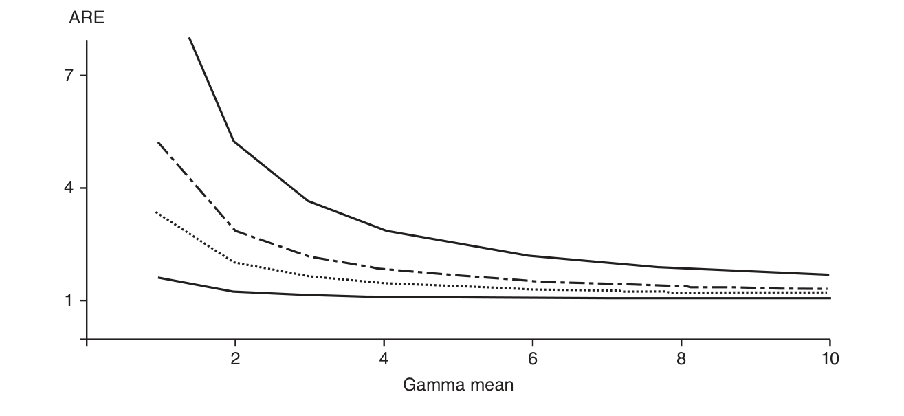
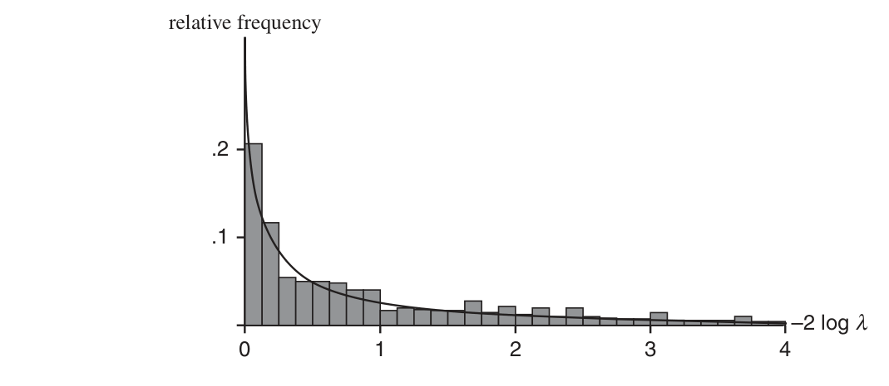
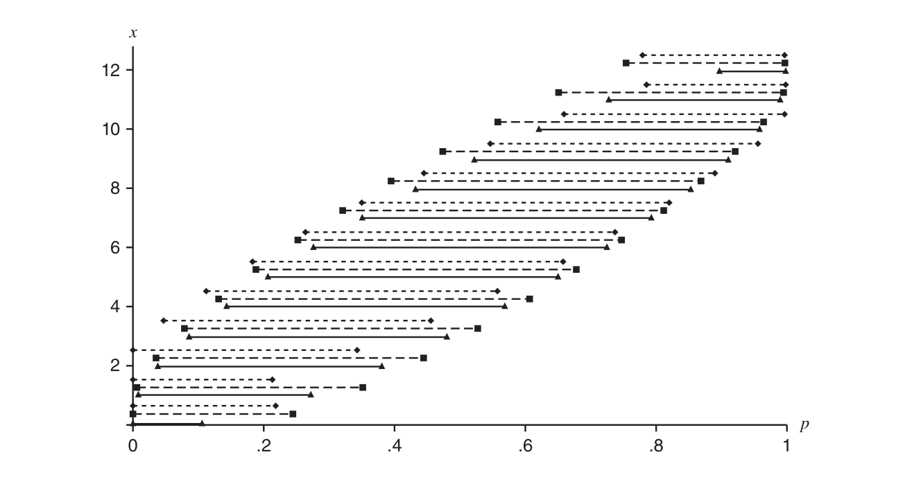
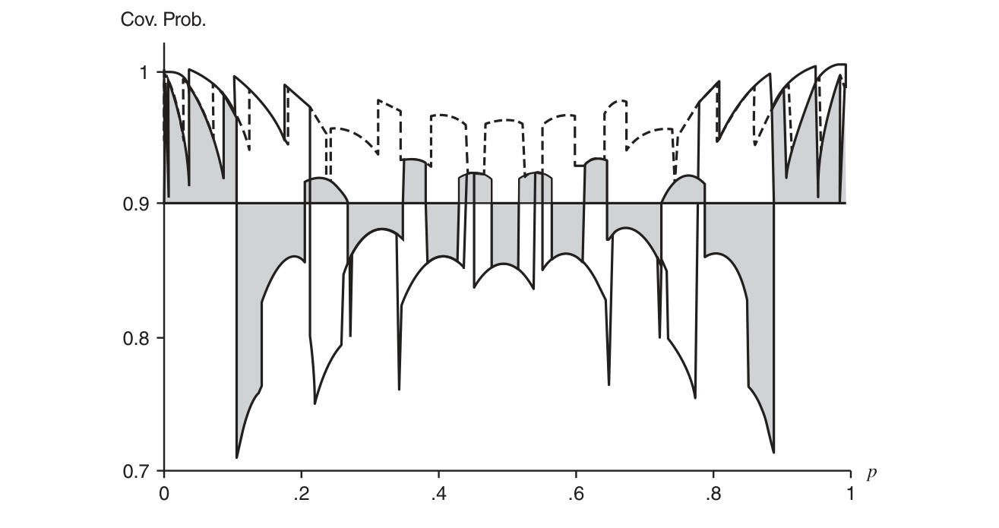

# 第 10 章　渐近评价（Asymptotic Evaluations）

> *“I know, my dear Watson, that you share my love of all that is bizarre and outside the conventions and humdrum routine of everyday life.”*
>
> 我知道，亲爱的华生，你和我一样，偏爱一切离奇的事物，偏爱一切超出常规、不同于日常生活千篇一律琐事的东西。
>
> ——歇洛克·福尔摩斯（《红发会》）

迄今为止我们考虑的准则都是有限样本准则。与此相对，我们可以考虑渐近性质——刻画统计程序当样本量趋于无穷时的行为的性质。本节将考察若干这样的性质，并分别讨论点估计、假设检验与区间估计。我们将特别强调极大似然程序的渐近性质。

渐近评价的威力在于：让样本量趋于无穷后，计算得以简化。有限样本情形下不可能完成的评价变成了例行公事。这种简化也使我们得以考察另一些技术（如 bootstrap 与 M-估计），它们通常只能在渐近意义下评价。

让样本量无界增长（有时被称为“渐近之邦”（asymptopia））不应被讥为纯粹想入非非的练习。恰恰相反，渐近分析揭示统计程序最基本的性质，并给我们一个非常有力且一般的评价工具。

## 10.1 点估计（Point Estimation）

### 10.1.1 相合性（Consistency）

相合性看起来是一条相当基本的性质：它要求估计量在样本量趋于无穷时收敛到“正确”的值。这条性质如此基本，以至于一个不相合的估计序列的价值值得怀疑（或至少值得仔细审查）。

相合性（以及一切渐近性质）关心的是估计量的**序列**而非单个估计量，尽管人们习惯说“相合估计量”。若我们按分布 $f(x \mid \theta)$ 观测 $X_1, X_2, \ldots$，只需对每个样本量 $n$ 执行同一估计程序，就能构造估计量序列 $W_n = W_n(X_1, \ldots, X_n)$。例如 $\bar{X}_1 = X_1$，$\bar{X}_2 = (X_1 + X_2)/2$，$\bar{X}_3 = (X_1 + X_2 + X_3)/3$，等等。现在可以定义相合序列。

> **定义 10.1.1（相合序列）**
>
> 若估计量序列 $W_n = W_n(X_1, \ldots, X_n)$ 满足：对每个 $\varepsilon > 0$ 与每个 $\theta \in \Theta$，
>
> $$
> \lim_{n \to \infty} P_{\theta}\bigl( |W_n - \theta| < \varepsilon \bigr) = 1, \tag{10.1.1}
> $$
>
> 则称它是参数 $\theta$ 的***相合估计量序列***（consistent sequence of estimators）。

非正式地说，(10.1.1) 表明：当样本量趋于无穷（样本信息越来越好）时，估计量将以高概率任意接近参数——这是一条非常理想的性质。换个说法：相合估计序列错过真参数的概率很小。(10.1.1) 的等价陈述是：对每个 $\varepsilon > 0$ 与每个 $\theta \in \Theta$，相合序列 $W_n$ 满足

$$
\lim_{n \to \infty} P_{\theta}\bigl( |W_n - \theta| \geq \varepsilon \bigr) = 0. \tag{10.1.2}
$$

定义 10.1.1 应与定义 5.5.1（依概率收敛的定义）对照。定义 10.1.1 说的是：相合估计序列依概率收敛到它所估计的参数 $\theta$。定义 5.5.1 处理的是具有一个概率结构的单列随机变量，而定义 10.1.1 处理的是由 $\theta$ 标记的一整族概率结构。对每个不同的 $\theta$ 值，与序列 $W_n$ 相关联的概率结构不同；定义说的是：对每个 $\theta$ 值，概率结构使得序列依概率收敛到真 $\theta$。这就是概率定义与统计定义的通常区别：前者处理一个概率结构，后者处理一整族。

> **例 10.1.2（$\bar{X}$ 的相合性）**
>
> 设 $X_1, X_2, \ldots$ 是 iid $n(\theta, 1)$，考虑序列
>
> $$
> \bar{X}_n = \frac{1}{n} \sum_{i=1}^{n} X_i.
> $$
>
> 回顾 $\bar{X}_n \sim n(\theta, 1/n)$，于是
>
> $$
> \begin{aligned}
> P_{\theta}\bigl( |\bar{X}_n - \theta| < \varepsilon \bigr)
> &= \int_{\theta - \varepsilon}^{\theta + \varepsilon} \Bigl( \frac{n}{2\pi} \Bigr)^{1/2} e^{-(n/2)(\bar{x}_n - \theta)^2}\, d\bar{x}_n \qquad （\text{定义}）\\
> &= \int_{-\varepsilon}^{\varepsilon} \Bigl( \frac{n}{2\pi} \Bigr)^{1/2} e^{-(n/2)y^2}\, dy \qquad （\text{代换}\ y = \bar{x}_n - \theta）\\
> &= \int_{-\varepsilon\sqrt{n}}^{\varepsilon\sqrt{n}} \frac{1}{\sqrt{2\pi}}\, e^{-(1/2)t^2}\, dt \qquad （\text{代换}\ t = y\sqrt{n}）\\
> &= P(-\varepsilon\sqrt{n} < Z < \varepsilon\sqrt{n}) \qquad （Z \sim n(0, 1)）\\
> &\to 1 \quad \text{当}\ n \to \infty,
> \end{aligned}
> $$
>
> 故 $\bar{X}_n$ 是 $\theta$ 的相合估计序列。

一般地，验证相合性并不需要如上详细的计算。回顾对估计量 $W_n$，Chebyshev 不等式给出

$$
P_{\theta}\bigl( |W_n - \theta| \geq \varepsilon \bigr) \leq \frac{\mathrm{E}_{\theta}\bigl[ (W_n - \theta)^2 \bigr]}{\varepsilon^2},
$$

因此若对每个 $\theta \in \Theta$ 有

$$
\lim_{n \to \infty} \mathrm{E}_{\theta}\bigl[ (W_n - \theta)^2 \bigr] = 0,
$$

则估计量序列相合。再由 (10.1.3)（即第 7 章式 (7.3.1)）

$$
\mathrm{E}_{\theta}\bigl[ (W_n - \theta)^2 \bigr] = \mathrm{Var}_{\theta} W_n + \bigl[ \mathrm{Bias}_{\theta} W_n \bigr]^2, \tag{10.1.3}
$$

把这些合在一起可得如下定理。

> **定理 10.1.3（均方误差准则是相合性的充分条件）**
>
> 设 $W_n$ 是参数 $\theta$ 的估计量序列，满足：对每个 $\theta \in \Theta$，
>
> - i. $\lim_{n \to \infty} \mathrm{Var}_{\theta} W_n = 0$；
>
> - ii. $\lim_{n \to \infty} \mathrm{Bias}_{\theta} W_n = 0$，
>
>
> 则 $W_n$ 是 $\theta$ 的相合估计序列。

> **例 10.1.4（例 10.1.2 的续）**
>
> 由于
>
> $$
> \mathrm{E}_{\theta} \bar{X}_n = \theta
> \qquad\text{与}\qquad
> \mathrm{Var}_{\theta} \bar{X}_n = \frac{1}{n},
> $$
>
> 定理 10.1.3 的条件满足，序列 $\bar{X}_n$ 相合。此外，由定理 5.2.6，若从任何均值为 $\theta$、方差有限的总体 iid 抽样，则 $\bar{X}_n$ 相合于 $\theta$。

本节开头我们评论过：不相合估计序列的价值值得怀疑。这一评论的部分依据是：相合序列实在太多，正如下面这个定理所示。其证明留作习题 10.2。

> **定理 10.1.5（相合序列的线性变换）**
>
> 设 $W_n$ 是参数 $\theta$ 的相合估计序列。设常数序列 $a_1, a_2, \ldots$ 与 $b_1, b_2, \ldots$ 满足
>
> - i. $\lim_{n \to \infty} a_n = 1$；
>
> - ii. $\lim_{n \to \infty} b_n = 0$。
>
>
> 则序列 $U_n = a_n W_n + b_n$ 是 $\theta$ 的相合估计序列。

本节最后给出关于极大似然估计量相合性的更一般结果的概要。该结果表明 MLE 是其参数的相合估计量，这也是我们第一次见到某种求估计量的方法**保证**一条最优性性质。

要使 MLE 相合，底层密度（似然函数）必须满足一定的“正则条件”；此处不展开，细节见杂记 10.6.2 节。

> **定理 10.1.6（MLE 的相合性）**
>
> 设 $X_1, \ldots, X_n$ 是 iid $f(x \mid \theta)$，$L(\theta \mid \textbf{x}) = \prod_{i=1}^{n} f(x_i \mid \theta)$ 是似然函数，$\hat{\theta}$ 表示 $\theta$ 的 MLE。设 $\tau(\theta)$ 是 $\theta$ 的连续函数。在杂记 10.6.2 节关于 $f(x \mid \theta)$（从而 $L(\theta \mid \textbf{x})$）的正则条件下，对每个 $\varepsilon > 0$ 与每个 $\theta \in \Theta$，
>
> $$
> \lim_{n \to \infty} P_{\theta}\bigl( |\tau(\hat{\theta}) - \tau(\theta)| \geq \varepsilon \bigr) = 0.
> $$
>
> 即 $\tau(\hat{\theta})$ 是 $\tau(\theta)$ 的相合估计量。
>
> **证明**　证明的思路是证明 $\frac{1}{n} \log L(\hat{\theta} \mid \textbf{x})$ 对每个 $\theta \in \Theta$ 几乎必然收敛到 $\mathrm{E}_{\theta}\bigl( \log f(X \mid \theta) \bigr)$。在 $f(x \mid \theta)$ 的某些条件下，这意味着 $\hat{\theta}$ 依概率收敛到 $\theta$，从而 $\tau(\hat{\theta})$ 依概率收敛到 $\tau(\theta)$。细节见 Stuart, Ord, and Arnold (1999, 第 18 章)。 ∎

### 10.1.2 有效性（Efficiency）

相合性关心的是估计量的渐近准确性——它是否收敛到所估计的参数。本节考察一个相关性质：有效性（efficiency），它关心估计量的渐近方差。

计算渐近方差时，人们也许会想按如下方式进行：给定基于容量 $n$ 样本的估计量 $T_n$，先计算有限样本方差 $\mathrm{Var} T_n$，再求 $\lim_{n \to \infty} k_n \mathrm{Var} T_n$，其中 $k_n$ 是某个正规化常数。（注意许多情形 $\mathrm{Var} T_n \to 0$（$n \to \infty$），因此需要因子 $k_n$ 把它撑到一个极限。）

> **定义 10.1.7（极限方差）**
>
> 对估计量 $T_n$，若 $\lim_{n \to \infty} k_n \mathrm{Var} T_n = \tau^2 < \infty$（$\{k_n\}$ 是常数序列），则称 $\tau^2$ 为***极限方差***（limiting variance）或方差的极限。

> **例 10.1.8（极限方差）**
>
> 设 $\bar{X}_n$ 是 $n$ 个 iid 正态观测的均值，$\mathrm{E} X = \mu$、$\mathrm{Var} X = \sigma^2$。取 $T_n = \bar{X}_n$，则 $\lim_n n \mathrm{Var} \bar{X}_n = \sigma^2$ 是 $T_n$ 的极限方差。

但若改为用 $1/\bar{X}_n$ 估计 $1/\mu$，就会出现麻烦。取 $T_n = 1/\bar{X}_n$，我们发现方差 $\mathrm{Var}(T_n) = \infty$，于是方差的极限是无穷。然而回顾例 5.5.23：我们说过 $1/\bar{X}_n$ 的“近似”均值与方差为

$$
\mathrm{E}\Bigl( \frac{1}{\bar{X}_n} \Bigr) \approx \frac{1}{\mu},
\qquad
\mathrm{Var}\Bigl( \frac{1}{\bar{X}_n} \Bigr) \approx \Bigl( \frac{1}{\mu} \Bigr)^{\! 4} \mathrm{Var} \bar{X}_n,
$$

于是按第二种计算，方差为 $\mathrm{Var}(T_n) \approx \sigma^2 / (n\mu^4) < \infty$。

本例指出了把方差极限用作大样本度量的缺陷。当然，$1/\bar{X}$ 的精确有限样本方差确为 $\infty$；但若 $\mu \neq 0$，$1/\bar{X}$ 取非常大值的区域其概率趋于 0。因此例 10.1.8 的第二种近似更现实（也更有用）。我们采用的就是计算大样本方差的这第二种途径。

> **定义 10.1.9（渐近方差）**
>
> 对估计量 $T_n$，设 $k_n(T_n - \mu) \to n(0, \sigma^2)$，则称 $\sigma^2$ 为 $T_n$ 的***渐近方差***（asymptotic variance）或极限分布的方差。

对样本均值与其他类型的平均量的方差计算，极限方差与渐近方差通常取相同值。但在更复杂的情形，极限方差会令我们失望。还有一点很有意思：渐近方差总是不超过极限方差（Lehmann and Casella, 6.1 节）。请看一个例子。

> **例 10.1.10（大样本混合方差）**
>
> 分层模型
>
> $$
> Y_n \mid W_n = w_n \sim n\bigl( 0,\ w_n + (1 - w_n)\sigma_n^2 \bigr),
> \qquad
> W_n \sim \mathrm{Bernoulli}(p_n)
> $$
>
> 可以表现出渐近方差与极限方差的巨大差异。（这有时也描述为混合模型：以概率 $p_n$ 观测 $Y_n \sim n(0,1)$、以概率 $1 - p_n$ 观测 $Y_n \sim n(0, \sigma_n^2)$。）
>
> 首先，由定理 4.4.7 有
>
> $$
> \mathrm{Var}(Y_n) = p_n + (1 - p_n)\sigma_n^2.
> $$
>
> 由此可得：$Y_n$ 的极限方差有限当且仅当 $\lim_n (1 - p_n)\sigma_n^2 < \infty$。
>
> 另一方面，$Y_n$ 的渐近分布可以用
>
> $$
> P(Y_n < a) = p_n P(Z < a) + (1 - p_n) P(Z < a / \sigma_n)
> $$
>
> 直接计算。现在设 $p_n \to 1$、$\sigma_n \to \infty$，且 $(1 - p_n)\sigma_n^2 \to \infty$。则 $P(Y_n < a) \to P(Z < a)$，即 $Y_n \to n(0,1)$，于是
>
> $$
> \text{极限方差} = \lim_n \bigl[ p_n + (1 - p_n)\sigma_n^2 \bigr] = \infty,
> \qquad
> \text{渐近方差} = 1.
> $$
>
> 更多细节见习题 10.6。

本着 Cramér–Rao 下界（定理 7.3.9）的精神，存在一个最优的渐近方差。

> **定义 10.1.11（渐近有效性）**
>
> 若估计量序列 $W_n$ 满足 $\sqrt{n}\bigl[ W_n - \tau(\theta) \bigr] \to n\bigl[ 0, v(\theta) \bigr]$（依分布），且
>
> $$
> v(\theta) = \frac{[\tau'(\theta)]^2}{\mathrm{E}_{\theta} \Bigl[ \frac{\partial}{\partial \theta} \log f(X \mid \theta) \Bigr]^2},
> $$
>
> 即 $W_n$ 的渐近方差达到 Cramér–Rao 下界，则称 $W_n$ 关于参数 $\tau(\theta)$ ***渐近有效***（asymptotically efficient）。

回顾定理 10.1.6：在一般条件下 MLE 相合。在稍强的正则条件下，关于渐近有效性也有同类型的定理成立；因此一般可以把 MLE 视为既相合又渐近有效。正则条件的细节仍在杂记 10.6.2 节。

> **定理 10.1.12（MLE 的渐近有效性）**
>
> 设 $X_1, \ldots, X_n$ 是 iid $f(x \mid \theta)$，$\hat{\theta}$ 表示 $\theta$ 的 MLE，$\tau(\theta)$ 是 $\theta$ 的连续函数。在杂记 10.6.2 节关于 $f(x \mid \theta)$（从而 $L(\theta \mid \textbf{x})$）的正则条件下，
>
> $$
> \sqrt{n}\bigl[ \tau(\hat{\theta}) - \tau(\theta) \bigr] \to n\bigl[ 0, v(\theta) \bigr],
> $$
>
> 其中 $v(\theta)$ 是 Cramér–Rao 下界。即 $\tau(\hat{\theta})$ 是 $\tau(\theta)$ 的相合且渐近有效的估计量。
>
> **证明**　本证明的有趣之处在于对 Taylor 级数的运用，以及利用“MLE 定义为似然函数导数的零点”这一事实。我们只概述 $\hat{\theta}$ 渐近有效的证明；到 $\tau(\hat{\theta})$ 的推广留作习题 10.7。
>
> 回顾 $l(\theta \mid \textbf{x}) = \sum \log f(x_i \mid \theta)$ 是对数似然函数，记其（关于 $\theta$ 的）导数为 $l'$, $l''$, …。把对数似然的一阶导数在真值 $\theta_0$ 处展开：
>
> $$
> l'(\theta \mid \textbf{x}) = l'(\theta_0 \mid \textbf{x}) + (\theta - \theta_0)\, l''(\theta_0 \mid \textbf{x}) + \cdots, \tag{10.1.4}
> $$
>
> 我们将忽略高阶项（在正则条件下这是合理的）。
>
> 把 MLE $\hat{\theta}$ 代入 $\theta$，注意 (10.1.4) 左端为零。整理并两边乘以 $\sqrt{n}$，得
>
> $$
> \sqrt{n}(\hat{\theta} - \theta_0)
> = \frac{\sqrt{n}\, \bigl[ -l'(\theta_0 \mid \textbf{x}) \bigr]}{l''(\theta_0 \mid \textbf{x})}
> = \frac{-\frac{1}{\sqrt{n}}\, l'(\theta_0 \mid \textbf{x})}{\frac{1}{n}\, l''(\theta_0 \mid \textbf{x})}. \tag{10.1.5}
> $$
>
> 令 $I(\theta_0) = \mathrm{E}\bigl[ l'(\theta_0 \mid X) \bigr]^2 = 1/v(\theta)$ 表示信息数。应用中心极限定理与大数定律可得（细节见习题 10.8）
>
> $$
> -\frac{1}{\sqrt{n}}\, l'(\theta_0 \mid \textbf{X}) \to n\bigl[ 0,\ I(\theta_0) \bigr]\ \text{（依分布）}
> \qquad\text{与}\qquad
> \frac{1}{n}\, l''(\theta_0 \mid \textbf{X}) \to I(\theta_0)\ \text{（依概率）}. \tag{10.1.6}
> $$
>
> 于是，令 $W \sim n\bigl[ 0, I(\theta_0) \bigr]$，则 $\sqrt{n}(\hat{\theta} - \theta_0)$ 依分布收敛到 $W / I(\theta_0) \sim n\bigl[ 0,\ 1/I(\theta_0) \bigr]$，定理得证。 ∎

> **例 10.1.13（渐近正态性与相合性）**
>
> 上面的定理表明：MLE 通常既有效又相合。我们要指出，这个说法有些冗余：有效性只在估计量渐近正态时才有定义，而我们将说明渐近正态性蕴含相合性。设
>
> $$
> \sqrt{n}\, \frac{W_n - \mu}{\sigma} \to Z\ \text{（依分布）},
> $$
>
> 其中 $Z \sim n(0,1)$。应用 Slutsky 定理（定理 5.5.17）得
>
> $$
> W_n - \mu = \Bigl( \frac{\sigma}{\sqrt{n}} \Bigr) \Bigl( \sqrt{n}\, \frac{W_n - \mu}{\sigma} \Bigr)
> \to \lim_{n \to \infty} \frac{\sigma}{\sqrt{n}}\, Z = 0,
> $$
>
> 故 $W_n - \mu$ 依分布收敛到 0。由定理 5.5.13，依分布收敛到一点等价于依概率收敛，所以 $W_n$ 是 $\mu$ 的相合估计量。

### 10.1.3 计算与比较（Calculations and Comparisons）

前几节建立的渐近公式可以为大样本使用提供近似方差。同样要关心正则条件（杂记 10.6.2 节），但它们相当一般，在常见情形几乎总能满足。不过有一个条件值得特别提出：违反它会导致复杂情况，例 7.3.13 已经见过。要使下面的近似有效，pdf 或 pmf（从而似然函数）的支撑必须**不依赖参数**。

假设 MLE 渐近有效，则定理 10.1.6 中的渐近方差就是定理 5.5.24 的 Delta Method 方差（去掉 $1/n$ 项）。于是可以把 Cramér–Rao 下界用作 MLE 真方差的近似。设 $X_1, \ldots, X_n$ 是 iid $f(x \mid \theta)$，$\hat{\theta}$ 是 $\theta$ 的 MLE，$I_n(\theta) = \mathrm{E}_{\theta} \bigl[ -\frac{\partial^2}{\partial \theta^2} \log L(\theta \mid \textbf{X}) \bigr]$ 是样本的信息数。用 Delta Method 与 MLE 的渐近有效性，$h(\hat{\theta})$ 的方差可以近似为

$$
\begin{aligned}
\mathrm{Var}\bigl( h(\hat{\theta}) \mid \theta \bigr)
&\approx \frac{[h'(\theta)]^2}{I_n(\theta)}\\
&\approx \frac{[h'(\theta)]^2}{\mathrm{E}_{\theta} \Bigl[ -\frac{\partial^2}{\partial \theta^2} \log L(\theta \mid \textbf{X}) \Bigr]^2}
\qquad （\text{利用引理 7.3.11 的恒等式}）\\
&\approx \frac{[h'(\theta)]^2 \big|_{\theta = \hat{\theta}}}{-\frac{\partial^2}{\partial \theta^2} \log L(\theta \mid \textbf{x}) \big|_{\theta = \hat{\theta}}}.
\qquad （\text{分母是}\ \hat{I}_n(\hat{\theta})，\text{观测信息数}）
\end{aligned} \tag{10.1.7}
$$

此外，已有人证明（Efron and Hinkley 1978）：使用**观测**信息数优于**期望**信息数（即出现在 Cramér–Rao 下界中的那个信息数）。

注意方差估计过程分两步，这一点被 (10.1.7) 稍微掩盖了：要估计 $\mathrm{Var}_{\theta} h(\hat{\theta})$，先近似 $\mathrm{Var}_{\theta} h(\hat{\theta})$，再估计所得的近似式——通常是把 $\hat{\theta}$ 代入 $\theta$。所得估计可以记作 $\widehat{\mathrm{Var}}_{\hat{\theta}}\, h(\hat{\theta})$ 或 $\widehat{\mathrm{Var}}_{\theta} h(\hat{\theta})$。

由定理 10.1.6，$-\frac{1}{n} \frac{\partial^2}{\partial \theta^2} \log L(\theta \mid \textbf{X}) \big|_{\theta = \hat{\theta}}$ 是 $I(\theta)$ 的相合估计量，故 $\widehat{\mathrm{Var}}_{\theta} h(\hat{\theta})$ 是 $\mathrm{Var}_{\theta} h(\hat{\theta})$ 的相合估计量。

> **例 10.1.14（近似的二项方差）**
>
> 例 7.2.7 中我们看到：若 $X_1, \ldots, X_n$ 是来自 Bernoulli($p$) 总体的随机样本，则 $\hat{p} = \sum X_i / n$ 是 $p$ 的 MLE。而且由直接计算知
>
> $$
> \mathrm{Var}_p \hat{p} = \frac{p(1 - p)}{n},
> $$
>
> $\mathrm{Var}_p \hat{p}$ 的一个合理估计是
>
> $$
> \widehat{\mathrm{Var}}_p \hat{p} = \frac{\hat{p}(1 - \hat{p})}{n}. \tag{10.1.8}
> $$
>
> 若把 (10.1.7) 的近似用于 $h(p) = p$，则得到 $\mathrm{Var}_p \hat{p}$ 的估计
>
> $$
> \widehat{\mathrm{Var}}_p \hat{p} \approx \frac{1}{-\frac{\partial^2}{\partial p^2} \log L(p \mid \textbf{x}) \big|_{p = \hat{p}}}.
> $$
>
> 回顾
>
> $$
> \log L(p \mid \textbf{x}) = n\hat{p} \log(p) + n(1 - \hat{p}) \log(1 - p),
> $$
>
> 于是
>
> $$
> \frac{\partial^2}{\partial p^2} \log L(p \mid \textbf{x}) = -\frac{n\hat{p}}{p^2} - \frac{n(1 - \hat{p})}{(1 - p)^2}.
> $$
>
> 在 $p = \hat{p}$ 处取值得
>
> $$
> \frac{\partial^2}{\partial p^2} \log L(p \mid \textbf{x}) \Big|_{p = \hat{p}} = -\frac{n\hat{p}}{\hat{p}^2} - \frac{n(1 - \hat{p})}{(1 - \hat{p})^2} = -\frac{n}{\hat{p}(1 - \hat{p})},
> $$
>
> 给出的方差近似与 (10.1.8) 相同。现在可以应用定理 10.1.6 断言 $\hat{p}$ 渐近有效，特别地，
>
> $$
> \sqrt{n}(\hat{p} - p) \to n\bigl[ 0,\ p(1 - p) \bigr]
> $$
>
> （依分布）。若再用定理 5.5.17（Slutsky 定理）还可得
>
> $$
> \sqrt{n}\, \frac{\hat{p} - p}{\sqrt{\hat{p}(1 - \hat{p})}} \to n[0, 1].
> $$
>
> 估计 $\hat{p}$ 的方差其实并不难，不必动用这一整套近似机器。但若转向稍复杂的函数，事情就会变得棘手。回顾习题 5.5.22 中我们用 Delta Method 近似了 $\hat{p}/(1 - \hat{p})$（几率 $p/(1-p)$ 的估计）的方差。现在我们看到这个估计量其实就是几率的 MLE，其方差可估计为
>
> $$
> \widehat{\mathrm{Var}}\Bigl( \frac{\hat{p}}{1 - \hat{p}} \Bigr)
> \approx \frac{\frac{\partial}{\partial p} \Bigl( \frac{p}{1-p} \Bigr)^{\! 2} \Big|_{p = \hat{p}}}{-\frac{\partial^2}{\partial p^2} \log L(p \mid \textbf{x}) \big|_{p = \hat{p}}}
> = \frac{\Bigl( \frac{(1-p) + p}{(1-p)^2} \Bigr)^{\! 2} \Big|_{p = \hat{p}}}{\frac{n}{p(1-p)} \Big|_{p = \hat{p}}}
> = \frac{\hat{p}}{n(1 - \hat{p})^3}.
> $$
>
> 此外我们还知道该估计量渐近有效。

MLE 方差近似在许多情形表现良好，但并非万无一失。特别地，当函数 $h(\hat{\theta})$ 不是单调时必须小心。此时导数 $h'$ 会变号，可能导致方差近似被低估。要认识到：由于该近似基于 Cramér–Rao 下界，它多半本来就是低估；而非单调函数会使问题更糟。

> **例 10.1.15（例 10.1.14 的续）**
>
> 假设现在要估计 Bernoulli 分布的方差 $p(1 - p)$。它的 MLE 是 $\hat{p}(1 - \hat{p})$，这个估计量的方差估计可由 (10.1.7) 的近似得到：
>
> $$
> \widehat{\mathrm{Var}}\bigl( \hat{p}(1 - \hat{p}) \bigr)
> \approx \frac{\frac{\partial}{\partial p} \bigl[ p(1 - p) \bigr]^2 \Big|_{p = \hat{p}}}{-\frac{\partial^2}{\partial p^2} \log L(p \mid \textbf{x}) \Big|_{p = \hat{p}}}
> = \frac{(1 - 2p)^2 \big|_{p = \hat{p}}}{\frac{n}{p(1-p)} \Big|_{p = \hat{p}}}
> = \frac{\hat{p}(1 - \hat{p})(1 - 2\hat{p})^2}{n},
> $$
>
> 它在 $\hat{p} = \frac{1}{2}$ 时可以为零——这显然低估了 $\hat{p}(1 - \hat{p})$ 的方差。函数 $p(1-p)$ 不单调正是问题的根源。
>
> 用定理 10.1.6 可以得出：只要 $p \neq 1/2$，我们的估计量渐近有效。若 $p = 1/2$，需要使用定理 5.5.26 给出的二阶近似（见习题 10.10）。

渐近有效性这一性质为我们提供了渐近方差所能希望达到的基准（但另见杂记 10.6.1 节）。我们还可以用渐近方差来比较估计量，这就是渐近相对效率的思想。

> **定义 10.1.16（渐近相对效率）**
>
> 若两个估计量 $W_n$ 与 $V_n$ 满足
>
> $$
> \sqrt{n}[W_n - \mu] \to n\bigl[ 0, \sigma_W^2 \bigr],
> \qquad
> \sqrt{n}[V_n - \mu] \to n\bigl[ 0, \sigma_V^2 \bigr]
> $$
>
> （依分布），则 $V_n$ 关于 $W_n$ 的***渐近相对效率***（asymptotic relative efficiency, ARE）为
>
> $$
> \mathrm{ARE}(V_n, W_n) = \frac{\sigma_W^2}{\sigma_V^2}.
> $$

> **例 10.1.17（Poisson 估计量的 ARE）**
>
> 设 $X_1, X_2, \ldots, X_n$ 是 iid Poisson($\lambda$)，我们关心估计零概率（zero probability）。例如，某给定时段内进入银行的顾客数有时建模为 Poisson 随机变量，零概率就是“一个时段内无人进入银行”的概率。若 $X \sim \mathrm{Poisson}(\lambda)$，则 $P(X = 0) = e^{-\lambda}$。一个自然（但有点朴素）的估计量来自定义 $Y_i = I(X_i = 0)$ 并使用
>
> $$
> \hat{\tau} = \frac{1}{n} \sum_{i=1}^{n} Y_i.
> $$
>
> $Y_i$ 服从 Bernoulli($e^{-\lambda}$)，于是
>
> $$
> \mathrm{E}(\hat{\tau}) = e^{-\lambda}
> \qquad\text{与}\qquad
> \mathrm{Var}(\hat{\tau}) = \frac{e^{-\lambda}(1 - e^{-\lambda})}{n}.
> $$
>
> 另一种做法：$e^{-\lambda}$ 的 MLE 是 $e^{-\hat{\lambda}}$，其中 $\hat{\lambda} = \sum_i X_i / n$ 是 $\lambda$ 的 MLE。用 Delta Method 近似，有
>
> $$
> \mathrm{E}\bigl( e^{-\hat{\lambda}} \bigr) \approx e^{-\lambda}
> \qquad\text{与}\qquad
> \mathrm{Var}\bigl( e^{-\hat{\lambda}} \bigr) \approx \frac{\lambda e^{-2\lambda}}{n}.
> $$
>
> 由于
>
> $$
> \sqrt{n}(\hat{\tau} - e^{-\lambda}) \to n\bigl[ 0,\ e^{-\lambda}(1 - e^{-\lambda}) \bigr],
> \qquad
> \sqrt{n}(e^{-\hat{\lambda}} - e^{-\lambda}) \to n\bigl[ 0,\ \lambda e^{-2\lambda} \bigr]
> $$
>
> （依分布），$\hat{\tau}$ 关于 MLE $e^{-\hat{\lambda}}$ 的 ARE 为
>
> $$
> \mathrm{ARE}(\hat{\tau}, e^{-\hat{\lambda}}) = \frac{\lambda e^{-2\lambda}}{e^{-\lambda}(1 - e^{-\lambda})}.
> $$
>
> 考察该函数可知：它严格递减，在 $\lambda = 0$ 处达到最大值 1（$\hat{\tau}$ 所能指望的最好情形），并随 $\lambda \to \infty$ 迅速衰减、渐近于 0；当 $\lambda = 4$ 时已小于 10%。（见习题 10.9。）

由于 MLE 通常渐近有效，其他估计量别指望在渐近方差上击败它。但其他估计量可能有别的可取性质（计算简便、对底层假设稳健）使其值得使用。在这种情形，MLE 的效率就成了标尺，用来衡量我们改用别的估计量所付出的代价。

我们再看最后一个例子，对比“计算简便”与“方差最优”。下一节将处理稳健性问题。

> **例 10.1.18（估计 gamma 均值）**
>
> 说出来也许难以置信：估计 gamma 分布的均值并非易事。回顾 gamma pdf
>
> $$
> f(x \mid \alpha, \beta) = \frac{1}{\Gamma(\alpha) \beta^{\alpha}}\, x^{\alpha - 1} e^{-x/\beta}.
> $$
>
> 该分布的均值是 $\alpha\beta$；要计算极大似然估计量就得处理 gamma 函数的导数（称为双 gamma 函数，digamma function），这绝不是什么愉快的事。相比之下，矩方法给出了一个容易计算的估计。
>
> 具体地，设 $X_1, X_2, \ldots, X_n$ 是来自上述 gamma 密度的随机样本，但重新参数化使均值 $\mu = \alpha\beta$ 显式出现：
>
> $$
> f(x \mid \mu, \beta) = \frac{1}{\Gamma(\mu/\beta)\, \beta^{\mu/\beta}}\, x^{\mu/\beta - 1} e^{-x/\beta},
> $$
>
> $\mu$ 的矩估计量是 $\bar{X}$，方差为 $\beta\mu / n$。
>
> 为计算 MLE，用对数似然 $l(\mu, \beta \mid \textbf{x}) = \sum_{i=1}^{n} \log f(x_i \mid \mu, \beta)$。为简化计算，设 $\beta$ 已知，解 $\frac{d}{d\mu} l(\mu, \beta \mid \textbf{x}) = 0$ 得 MLE $\hat{\mu}$。它没有显式解，只能数值求解。
>
> 由定理 10.1.6 知 $\hat{\mu}$ 渐近有效。关心的问题是：使用更易计算的矩估计量要损失多少？为比较，计算渐近相对效率
>
> $$
> \mathrm{ARE}(\bar{X}, \hat{\mu}) = \frac{\beta\mu}{\mathrm{E} \Bigl[ -\frac{d^2}{d\mu^2}\, l(\mu, \beta \mid \textbf{X}) \Bigr]}
> $$
>
> 并对若干 $\beta$ 值画在图 10.1.1 中。当然我们知道 ARE 必大于 1；但从图可见，对较大的 $\beta$ 值，做更复杂的计算、使用 MLE 是值得的。（推广见习题 10.11；计算的细节见例 12.6.7。）

图 10.1.1　 gamma 均值的矩估计量关于 MLE 的渐近相对效率：四条曲线对应尺度参数取值 $(1, 3, 5, 10)$，曲线越位置越高对应尺度参数越大（原书 Figure 10.1.1）

### 10.1.4 Bootstrap 标准误（Bootstrap Standard Errors）

bootstrap（最早见于例 1.2.20）提供了计算标准误的另一途径。（它还能提供更多东西——见杂记 10.6.3 节。）

bootstrap 基于一个简单而有力的想法（其数学可以相当复杂[^1]）。在统计学中，我们通过抽样来了解总体的特征。既然样本代表总体，样本的类似特征就应给我们提供关于总体特征的信息。bootstrap 帮助我们通过**重抽样本**（即从原样本中再抽样本）了解样本的特征，并用这些信息推断总体。bootstrap 由 Efron 在二十世纪七十年代末提出，最初的想法见于 Efron (1979ab) 与专著 Efron (1982)；更新的思考与发展见 Efron (1998)。

先看一个其实并不需要 bootstrap 的简单例子。

> **例 10.1.19（bootstrap 一个方差）**
>
> 例 1.2.20 中，我们对从
>
> $$
> 2,\quad 4,\quad 9,\quad 12
> $$
>
> 中有放回抽出的四个数的所有可能平均做了计算。这是最简单的 bootstrap 形式，有时称为**非参数 bootstrap**。图 1.2.2 以直方图显示了这些值。
>
> 我们所创造的，是样本均值可能值的一个重抽样集合。我们看到共有 $\binom{4 + 4 - 1}{4} = 35$ 个不同的可能值，但这些值并非等可能（因此不能当作随机样本处理）。$4^4 = 256$ 个（非去重的）重抽样都是等可能的，它们可以被当作随机样本。对第 $i$ 个重抽样，令 $\bar{x}_i^{*}$ 为其均值，则可以用
>
> $$
> \mathrm{Var}^{*}(\bar{X}) = \frac{1}{n - 1} \sum_{i=1}^{n} \bigl( \bar{x}_i^{*} - \bar{\bar{x}}^{*} \bigr)^2 \tag{10.1.9}
> $$
>
> 估计样本均值 $\bar{X}$ 的方差，其中 $\bar{\bar{x}}^{*} = \frac{1}{n} \sum_{i=1}^{n} \bar{x}_i^{*}$ 是重抽样均值。（习惯上用星号 $*$ 标记 bootstrap（重抽样）值。）
>
> 对本例，bootstrap 均值与方差为 $\bar{\bar{x}}^{*} = 6.75$、$\mathrm{Var}^{*}(\bar{X}) = 3.94$。事实表明，就均值与方差而言，bootstrap 估计与通常估计几乎相同（见习题 10.13）。

我们已经见到如何计算 bootstrap 标准误——不过是在一个其实不需要它的问题上。bootstrap 真正的优势在于：与 Delta Method 一样，方差公式 (10.1.9) 几乎适用于任何估计量。于是对任何估计量 $\hat{\theta}(\textbf{x}) = \hat{\theta}$，可以写

$$
\mathrm{Var}^{*}(\hat{\theta}) = \frac{1}{n - 1} \sum_{i=1}^{n} \bigl( \hat{\theta}_i^{*} - \bar{\hat{\theta}}^{*} \bigr)^2, \tag{10.1.10}
$$

其中 $\hat{\theta}_i^{*}$ 是由第 $i$ 个重抽样算出的估计量，$\bar{\hat{\theta}}^{*} = \frac{1}{n} \sum_{i=1}^{n} \hat{\theta}_i^{*}$ 是重抽样值的均值。

> **例 10.1.20（bootstrap 二项方差）**
>
> 例 10.1.15 中我们用 Delta Method 估计了 $\hat{p}(1 - \hat{p})$ 的方差。基于容量 $n$ 的样本，也可以改用下式估计该方差：
>
> $$
> \mathrm{Var}^{*}\bigl( \hat{p}(1 - \hat{p}) \bigr) = \frac{1}{n - 1} \sum_{i=1}^{n} \bigl( \hat{p}(1 - \hat{p})_i^{*} - \overline{\hat{p}(1 - \hat{p})}^{*} \bigr)^2.
> $$

但现在冒出一个问题。例 10.1.19 中 $n = 4$，bootstrap 和式只有 256 项；在更典型的样本量下，这个数大得无法计算（$n > 15$ 时枚举所有重抽样实际上不可能——至少对本书作者如此）。这时要记住我们是统计学家——我们对“重抽样的样本”再抽样！

于是，对样本 $\textbf{x} = (x_1, x_2, \ldots, x_n)$ 与估计 $\hat{\theta}(x_1, x_2, \ldots, x_n) = \hat{\theta}$，选取 $B$ 个重抽样（bootstrap 样本）并计算

$$
\mathrm{Var}_B^{*}(\hat{\theta}) = \frac{1}{B - 1} \sum_{i=1}^{B} \bigl( \hat{\theta}_i^{*} - \bar{\hat{\theta}}^{*} \bigr)^2. \tag{10.1.11}
$$

> **例 10.1.21（例 10.1.20 的完结）**
>
> 对容量 $n = 24$ 的样本，我们用 Delta Method 与 bootstrap（取 $B = 1000$）分别计算 $\hat{p}(1 - \hat{p})$ 的方差估计。对 $\hat{p} \neq 1/2$ 用例 10.1.15 的一阶 Delta Method 方差，对 $\hat{p} = 1/2$ 用定理 5.5.26 的二阶方差估计（见习题 10.16）。从表 10.1.1 可见：所有情形 bootstrap 方差估计都更接近真方差，而 Delta Method 方差是低估。（这并不奇怪：(10.1.7) 表明 Delta Method 方差估计基于一个下界。）
>
> 表 10.1.1　 $\hat{p}(1-\hat{p})$ 的 bootstrap（上排）与 Delta Method（下排）方差。$\hat{p} = 1/2$ 时使用二阶 Delta Method（见定理 5.5.26）。真方差在 $\hat{p} = p$ 的假定下数值计算（原书 Table 10.1.1）
>
> |  | $\hat{p} = 1/4$ | $\hat{p} = 1/2$ | $\hat{p} = 2/3$ |
> |:---|:---:|:---:|:---:|
> | bootstrap | $0.00508$ | $0.00555$ | $0.00561$ |
> | delta method | $0.00195$ | $0.00022$ | $0.00102$ |
> | 真值 | $0.00484$ | $0.00531$ | $0.00519$ |
>
>
> Delta Method 是“一阶”近似：它基于 Taylor 展开的第一项。当该项被消去（如 $\hat{p} = 1/2$）时，就必须用二阶 Delta Method。相比之下，bootstrap 常具有“二阶”精度——展开式中除第一项外还能取对更多项（见杂记 10.6.3 节）。因此这里 bootstrap 自动对 $\hat{p} = 1/2$ 的情形作了校正。（注意 $24^{24} \approx 1.33 \times 10^{13}$，是个天文数字，枚举 bootstrap 样本并不可行。）

迄今谈论的这种 bootstrap 称为**非参数** bootstrap，因为我们没有对总体 pdf 或 cdf 假设任何函数形式。与之相对，还可以有**参数** bootstrap。

设 $X_1, X_2, \ldots, X_n$ 是来自 pdf 为 $f(x \mid \theta)$（$\theta$ 可以是向量）的分布的样本。我们可以用 MLE $\hat{\theta}$ 估计 $\theta$，并从

$$
X_1^{*}, X_2^{*}, \ldots, X_n^{*} \sim f(x \mid \hat{\theta}).
$$

中抽样。取 $B$ 个这样的样本，就可以用 (10.1.11) 估计 $\hat{\theta}$ 的方差。注意这些样本不是数据的重抽样，而是从 $f(x \mid \hat{\theta})$ 抽出的真正的随机样本；$f(x \mid \hat{\theta})$ 有时称为代插分布（plug-in distribution）。

> **例 10.1.22（参数 bootstrap）**
>
> 设有样本
>
> $$
> -1.81,\quad 0.63,\quad 2.22,\quad 2.41,\quad 2.95,\quad 4.16,\quad 4.24,\quad 4.53,\quad 5.09
> $$
>
> 其 $\bar{x} = 2.71$、$s^2 = 4.82$。若假定底层分布为正态，则参数 bootstrap 将从
>
> $$
> X_1^{*}, X_2^{*}, \ldots, X_n^{*} \sim n(2.71, 4.82)
> $$
>
> 抽样。基于 $B = 1000$ 个样本，算得 $\mathrm{Var}_B^{*}(S^2) = 4.33$。按正态理论，$S^2$ 的方差是 $2(\sigma^2)^2/8$，可用 MLE 估计为 $2(4.82)^2/8 = 5.81$。数据本是从方差为 4 的正态分布模拟的，因此这里参数 bootstrap 给出了更好的估计。（例 5.6.6 中我们用现在所知的参数 bootstrap 估计过 $S^2$ 的分布。）

如今我们有了计算标准误的万能方法，怎么知道它是不是好方法？例 10.1.21 中它似乎优于 Delta Method，而后者有一些好性质。特别地，我们知道基于极大似然估计的 Delta Method 通常产生相合估计量。bootstrap 也如此吗？

虽然无法在最大一般性下回答这个问题，但我们可以说：在许多情形，bootstrap 确实给出合理的、相合的估计量。

说得更精确些，把计算 bootstrap 估计量的两个不同环节分开：

- a. 建立 (10.1.11) 当 $B \to \infty$ 时收敛到 (10.1.10)，即

  $$
  \mathrm{Var}_B^{*}(\hat{\theta}) \xrightarrow{B \to \infty} \mathrm{Var}^{*}(\hat{\theta});
  $$

- b. 建立使用整个 bootstrap 样本的估计量 (10.1.10) 的相合性，即

  $$
  \mathrm{Var}^{*}(\hat{\theta}) \xrightarrow{n \to \infty} \mathrm{Var}(\hat{\theta}).
  $$

(a) 可用大数定律建立（习题 10.15）。还要注意 (a) 全部发生在样本之内（Lehmann 1999, 6.5 节把 $\mathrm{Var}_B^{*}(\hat{\theta})$ 称为近似子（approximator）而非估计量）。

建立 (b) 则较为微妙，相合性正是在这里建立的。通常在 iid 抽样下可获相合性，但在更一般的情形未必（Lehmann 1999, 6.5 节给了一个例子）。相合性的更多细节（必然更高级）见 Shao and Tu (1995, 3.2.2 节) 或 Shao (1999, 5.5.3 节)。

## 10.2 稳健性（Robustness）

迄今为止，评价估计量的表现时都假定底层模型是正确的。在这一假定下我们导出了某种意义上最优的估计量。然而，若底层模型不正确，就无法保证估计量的最优性。

我们无法防备所有可能的情形；而且，若模型是经过审慎考虑得到的，本也不必如此。但我们可能担心对假定模型的中小程度偏离。这会把我们引向对稳健估计量（robust estimators）的考虑：这类估计量在假定模型处放弃最优性，以换取当假定模型并非真模型时仍然合理的表现。于是我们有了一个权衡，而“最优性还是稳健性更重要”这一准则的取舍恐怕只能逐例决定。

“稳健性”一词可以有多种解释，但 Huber (1981, 1.2 节) 的总结或许最好。他指出：

> “… 任何统计程序都应具备下列理想特征：
>
> （1）在假定模型处具有相当好（最优或接近最优）的效率；
>
> （2）应当稳健，即对模型假设的小偏离只轻微损害其表现…
>
> （3）对模型的稍大偏离不应造成灾难。”

我们先看几个简单例子以更好地理解这几条，然后再讨论更一般的稳健估计量与稳健性度量。

### 10.2.1 均值与中位数（The Mean and the Median）

样本均值是稳健估计量吗？这也许取决于我们如何把稳健性的度量形式化。

> **例 10.2.1（样本均值的稳健性）**
>
> 设 $X_1, X_2, \ldots, X_n$ 是 iid $n(\mu, \sigma^2)$。我们知道 $\bar{X}$ 的方差 $\mathrm{Var}(\bar{X}) = \sigma^2/n$，达到 Cramér–Rao 下界。因此在特征 (1) 上 $\bar{X}$ 合格：它在假定模型处取得最好的方差。
>
> 为考察 (2)——$\bar{X}$ 在模型小偏离下的表现——先要决定“小偏离”的含义。一种常见的解释是使用 $\delta$-污染模型（$\delta$-contamination model）：对小的 $\delta$，假定观测
>
> $$
> X_i \sim
> \begin{cases}
> n(\mu, \sigma^2), & \text{概率 } 1 - \delta,\\
> f(x), & \text{概率 } \delta,
> \end{cases}
> $$
>
> 其中 $f(x)$ 是某个其他分布。
>
> 设 $f(x)$ 是均值为 $\mu$、方差为 $\tau^2$ 的任意密度，则
>
> $$
> \mathrm{Var}(\bar{X}) = (1 - \delta)\, \frac{\sigma^2}{n} + \delta\, \frac{\tau^2}{n} + \frac{\delta(1 - \delta)(\theta - \mu)^2}{n}.
> $$
>
> 对 $\bar{X}$ 来说这看起来相当不错：若 $\theta \approx \mu$ 且 $\sigma \approx \tau$，$\bar{X}$ 将接近最优。然而只需把模型再扰动一点，情况就会变得很糟：若 $f(x)$ 是 Cauchy pdf，则立即可得 $\mathrm{Var}(\bar{X}) = \infty$。（细节见习题 10.18；另一种情形见习题 10.19。）

再看条目 (3)：若出现一个异常的观测会怎样？设想一组特定的样本值，然后考虑增大最大观测的效果。例如设 $X_{(n)} = x$，令 $x \to \infty$。这样的观测的效果可以称为“灾难性的”：虽然 $\bar{X}$ 的分布性质不受影响，但观测到的取值会变得“毫无意义”。这就例示了崩溃值（breakdown value）的概念，其思想归功于 Hampel (1974)。

> **定义 10.2.2（崩溃值）**
>
> 设 $X_{(1)} < \cdots < X_{(n)}$ 是容量 $n$ 的有序样本，$T_n$ 是基于该样本的统计量。若对每个 $\varepsilon > 0$，
>
> $$
> \lim_{X_{(\{(1-b)n\})} \to \infty} T_n < \infty
> \quad\text{且}\quad
> \lim_{X_{(\{(1-(b+\varepsilon))n\})} \to \infty} T_n = \infty,
> $$
>
> 则称 $T_n$ 具有崩溃值（breakdown value）$b$，$0 \leq b \leq 1$。（百分位记号见定义 5.4.2。）

容易看出 $\bar{X}$ 的崩溃值为 0：只要样本的任何比例被驱向无穷，$\bar{X}$ 的值也趋向无穷。与之形成鲜明对比的是，样本中位数在这种样本值改动下不变。这种对极端观测的不敏感性有时被视为样本中位数的一个优点——它的崩溃值为 50%。（关于崩溃值的更多内容见习题 10.20。）

既然中位数在稳健性上改进了均值，我们可能要问：换成更稳健的估计量会失去什么？（当然总会有所失去！）例如在例 10.2.1 的简单正态模型中，若模型为真，均值就是最好的无偏估计量。因此在正态模型处（及其附近）均值是更好的估计量。但关键问题是：在正态模型处究竟好多少？若能回答这一点，就能对用哪个估计量——以及更看重哪条准则（最优性还是稳健性）——作出有依据的选择。为在一般性下回答这个问题，我们求助于渐近相对效率准则。

为计算中位数关于均值的 ARE，必须先建立中位数的渐近正态性，并计算其渐近分布的方差。

> **例 10.2.3（中位数的渐近正态性）**
>
> 求中位数的极限分布时，我们采用与定理 5.4.3 与 5.4.4 证明中类似的论证——基于二项分布的论证。
>
> 设 $X_1, X_2, \ldots, X_n$ 是来自具有 pdf $f$ 与 cdf $F$（设可微）的总体的样本，$P(X_i \leq \mu) = 1/2$，即 $\mu$ 是总体中位数。令 $M_n$ 为样本中位数，考虑对某个 $a$ 计算
>
> $$
> \lim_{n \to \infty} P\Bigl( \sqrt{n}(M_n - \mu) \leq a \Bigr).
> $$
>
> 定义随机变量
>
> $$
> Y_i =
> \begin{cases}
> 1, & \text{若 } X_i \leq \mu + a/\sqrt{n},\\
> 0, & \text{其他},
> \end{cases}
> $$
>
> 则 $Y_i$ 是成功概率 $p_n = F\bigl( \mu + a/\sqrt{n} \bigr)$ 的 Bernoulli 随机变量。为避免复杂，设 $n$ 为奇数，从而事件 $\{ M_n \leq \mu + a/\sqrt{n} \}$ 等价于事件 $\{ \sum_i Y_i \geq (n+1)/2 \}$。
>
> 稍作代数运算得
>
> $$
> P\Bigl( \sqrt{n}(M_n - \mu) \leq a \Bigr)
> = P\Biggl( \frac{\sum_i Y_i - np_n}{\sqrt{np_n(1 - p_n)}} \geq \frac{(n+1)/2 - np_n}{\sqrt{np_n(1 - p_n)}} \Biggr).
> $$
>
> 现在 $p_n \to p = F(\mu) = 1/2$，于是可以期望：应用 CLT 表明 $\frac{\sum_i Y_i - np_n}{\sqrt{np_n(1-p_n)}}$ 依分布收敛到标准正态随机变量 $Z$。直接的极限计算还给出
>
> $$
> \frac{(n+1)/2 - np_n}{\sqrt{np_n(1 - p_n)}} \to -2aF'(\mu) = -2a f(\mu).
> $$
>
> 合在一起得
>
> $$
> P\Bigl( \sqrt{n}(M_n - \mu) \leq a \Bigr) \to P\bigl( Z \geq -2a f(\mu) \bigr),
> $$
>
> 故 $\sqrt{n}(M_n - \mu)$ 渐近正态，均值为 0、方差为 $1 / [2f(\mu)]^2$。（细节见习题 10.22；严格且更一般的展开见 Shao 1999, 5.3 节。）

> **例 10.2.4（中位数关于均值的 ARE）**
>
> 由于均值与中位数的渐近方差都有简单表达式，ARE 很快就能算出。这里看三个对称分布的 ARE：正如所料，分布的尾部越重，ARE 越大——即中位数在重尾分布中的表现越好。更多比较见习题 10.23。
>
> *表 10.2.2　 中位数/均值的渐近相对效率（原书 Table 10.2.2）*
>
> | 正态 | Logistic | 双指数 |
> |:---:|:---:|:---:|
> | $0.64$ | $0.82$ | $2$ |

### 10.2.2 M-估计量（M-Estimators）

我们使用的许多估计量都是最小化某个准则的结果。例如，若 $X_1, X_2, \ldots, X_n$ 是 iid $f(x \mid \theta)$，可能的估计量有：均值——$\sum (x_i - a)^2$ 的最小值点；中位数——$\sum |x_i - a|$ 的最小值点；或 MLE——$\prod_{i=1}^{n} f(x_i \mid \theta)$ 的最大值点（或负似然的最小值点）。作为获得稳健估计量的系统方法，可以尝试写出一个准则函数，使其最小值点具有理想的稳健性质。

在定义稳健准则的尝试中，Huber (1964) 考虑了均值与中位数之间的折中。均值准则是个平方，因而有敏感性，但在“尾部”平方给大观测过大的权重；相比之下，中位数的绝对值准则不会过度加权大或小的观测。折中是最小化准则函数

$$
\sum_{i=1}^{n} \rho(x_i - a) \tag{10.2.1}
$$

其中 $\rho$ 取

$$
\rho(x) =
\begin{cases}
\frac{1}{2} x^2, & |x| \leq k,\\
k|x| - \frac{1}{2} k^2, & |x| \geq k.
\end{cases} \tag{10.2.2}
$$

函数 $\rho(x)$ 在 $|x| \leq k$ 时表现得像 $x^2$，在 $|x| > k$ 时表现得像 $|x|$。而且由于 $\frac{1}{2}k^2 = k|k| - \frac{1}{2}k^2$，函数是连续的（习题 10.28）。常数 $k$（也可称为调节参数，tuning parameter）控制混合比例：$k$ 越小，估计量越“像中位数”。

> **例 10.2.5（Huber 估计量）**
>
> 把 (10.2.1) 与 (10.2.2) 的最小值点定义的估计量称为 **Huber 估计量**。为看它如何工作、$k$ 的选择为何重要，考虑由八个标准正态偏差与三个“离群值”组成的数据集：
>
> $$
> \textbf{x} = -1.28,\ -0.96,\ -0.46,\ -0.44,\ -0.26,\ -0.21,\ -0.063,\ 0.39,\ 3,\ 6,\ 9.
> $$
>
> 对这些数据，均值是 1.33，中位数是 $-0.21$。随 $k$ 变化，得到表 10.2.3 给出的一系列 Huber 估计。可见 $k$ 增大时 Huber 估计在中位数与均值之间变动；因此把 $k$ 的增大解释为对离群值稳健性的降低。
>
> *表 10.2.3　 Huber 估计量（原书 Table 10.2.3）*
>
> | $k$ | 0 | 1 | 2 | 3 | 4 | 5 | 6 | 8 | 10 |
> |:---|:---:|:---:|:---:|:---:|:---:|:---:|:---:|:---:|:---:|
> | 估计 | $-0.21$ | $0.03$ | $-0.04$ | $0.29$ | $0.41$ | $0.52$ | $0.87$ | $0.97$ | $1.33$ |

最小化 (10.2.2) 的估计量是 Huber 所研究估计量的特例。对一般函数 $\rho$，把最小化 $\sum_i \rho(x_i - \theta)$ 的估计量称为 **M-估计量**（M-estimator），这个名字提醒我们它们是极大似然型的估计量。注意若取 $\rho$ 为负对数似然 $-l(\theta \mid \textbf{x})$，M-估计量就是通常的 MLE；但对被最小化的函数有更多选择自由，便可导出具有不同性质的估计量。

由于函数的最小化通常通过求导数的零点完成（当可以求导时），定义 $\psi = \rho'$，可见 M-估计量是

$$
\sum_{i=1}^{n} \psi(x_i - \theta) = 0 \tag{10.2.3}
$$

的解。把估计量刻画为方程的根对获取其性质特别有用：用于似然估计量的论证可以推广过来。特别地，参看 10.1.2 节、尤其是定理 10.1.6 的证明。设 $\rho(x)$ 对称，其导数 $\psi(x)$ 单调递增（这保证 (10.2.3) 的根是唯一的最小值点）。于是，如同定理 10.1.6 的证明那样，对左端作 Taylor 展开：

$$
\sum_{i=1}^{n} \psi(x_i - \theta)
= \sum_{i=1}^{n} \psi(x_i - \theta_0) + (\theta - \theta_0) \sum_{i=1}^{n} \psi'(x_i - \theta_0) + \cdots,
$$

其中 $\theta_0$ 是真值，忽略高阶项。令 $\hat{\theta}_M$ 为 (10.2.3) 的解并代入 $\theta$，得

$$
0 = \sum_{i=1}^{n} \psi(x_i - \theta_0) + (\hat{\theta}_M - \theta_0) \sum_{i=1}^{n} \psi'(x_i - \theta_0) + \cdots,
$$

左端为零是因为 $\hat{\theta}_M$ 是解。现在再次仿照定理 10.1.6 的证明，移项、除以 $\sqrt{n}$、忽略余项，得

$$
\sqrt{n}(\hat{\theta}_M - \theta_0)
= \frac{-\frac{1}{\sqrt{n}} \sum_{i=1}^{n} \psi(x_i - \theta_0)}{\frac{1}{n} \sum_{i=1}^{n} \psi'(x_i - \theta_0)}.
$$

现在设 $\theta_0$ 满足 $\mathrm{E}_{\theta_0} \psi(X - \theta_0) = 0$（这常被取作 $\theta_0$ 的定义）。则

$$
-\frac{1}{\sqrt{n}} \sum_{i=1}^{n} \psi(X_i - \theta_0)
= \sqrt{n} \Bigl[ -\frac{1}{n} \sum_{i=1}^{n} \psi(X_i - \theta_0) \Bigr]
\to n\Bigl( 0,\ \mathrm{E}_{\theta_0}\bigl[ \psi(X - \theta_0) \bigr]^2 \Bigr) \tag{10.2.4}
$$

（依分布），且大数定律给出

$$
\frac{1}{n} \sum_{i=1}^{n} \psi'(x_i - \theta_0) \to \mathrm{E}_{\theta_0} \psi'(X - \theta_0) \tag{10.2.5}
$$

（依概率）。合在一起得到

$$
\sqrt{n}(\hat{\theta}_M - \theta_0) \to n\Biggl( 0,\ \frac{\mathrm{E}_{\theta_0}\, \psi(X - \theta_0)^2}{\bigl[ \mathrm{E}_{\theta_0} \psi'(X - \theta_0) \bigr]^2} \Biggr). \tag{10.2.6}
$$

> **例 10.2.6（Huber 估计量的极限分布）**
>
> 设 $X_1, X_2, \ldots, X_n$ 是 iid，pdf 为 $f(x - \theta)$，$f$ 关于零对称。则对 (10.2.2) 给出的 $\rho$ 有
>
> $$
> \psi(x) =
> \begin{cases}
> x, & |x| \leq k,\\
> k, & x > k,\\
> -k, & x < -k,
> \end{cases} \tag{10.2.7}
> $$
>
> 于是
>
> $$
> \begin{aligned}
> \mathrm{E}_{\theta}\, \psi(X - \theta)
> &= -\int_{\theta - k}^{\theta + k} (x - \theta) f(x - \theta)\, dx
> + 2k \int_{-\infty}^{\theta - k} f(x - \theta)\, dx - 2k \int_{\theta + k}^{\infty} f(x - \theta)\, dx\\
> &= -\int_{-k}^{k} y f(y)\, dy + 2k \int_{-\infty}^{-k} f(y)\, dy - 2k \int_{k}^{\infty} f(y)\, dy = 0,
> \end{aligned} \tag{10.2.8}
> $$
>
> 其中作了代换 $y = x - \theta$；由 $f$ 的对称性，各积分相加为零。因此 Huber 估计量具有正确的均值中心（见一般化情形习题 10.25）。
>
> 为计算方差需要 $\psi'$ 的期望。虽然 $\psi$ 不可微，但在不可微点（$x = \pm k$）之外 $\psi'$ 为零，因此只需处理 $|x| \leq k$ 上的期望：
>
> $$
> \begin{aligned}
> \mathrm{E}_{\theta}\, \psi'(X - \theta) &= \int_{\theta - k}^{\theta + k} f(x - \theta)\, dx = P_0\bigl( |X| \leq k \bigr),\\
> \mathrm{E}_{\theta}\bigl[ \psi(X - \theta) \bigr]^2
> &= \int_{\theta - k}^{\theta + k} (x - \theta)^2 f(x - \theta)\, dx + k^2 \int_{\theta + k}^{\infty} f(x - \theta)\, dx + k^2 \int_{-\infty}^{\theta - k} f(x - \theta)\, dx\\
> &= \int_{-k}^{k} x^2 f(x)\, dx + 2k^2 \int_{k}^{\infty} f(x)\, dx.
> \end{aligned}
> $$
>
> 于是可以得出：Huber 估计量渐近正态，均值为 $\theta$，渐近方差为
>
> $$
> \frac{\int_{-k}^{k} x^2 f(x)\, dx + k^2\, P_0\bigl( |X| > k \bigr)}{\bigl[ P_0\bigl( |X| \leq k \bigr) \bigr]^2}.
> $$

正如在例 10.2.4 中所做的，现在考察 Huber 估计量在多种分布下的 ARE。

> **例 10.2.7（Huber 估计量的 ARE）**
>
> Huber 估计量在某种意义上是均值与中位数的折中，因此我们对这两个估计量分别考察它的相对效率。对正态分布与 logistic 分布，Huber 估计量表现得与均值类似，且是对中位数的改进；对双指数分布，它是对均值的改进，但不及中位数。回顾：均值是正态分布的 MLE，中位数是双指数分布的 MLE（因此 ARE $< 1$ 是预期之中的）。Huber 估计量在这些分布下的表现与各 MLE 相似，但在其他情形似乎也保持合理的表现。
>
> 表 10.2.4　 Huber 估计量的渐近相对效率，$k = 1.5$（原书 Table 10.2.4）
>
> |  | 正态 | Logistic | 双指数 |
> |:---|:---:|:---:|:---:|
> | 相对均值 | $0.96$ | $1.08$ | $1.37$ |
> | 相对中位数 | $1.51$ | $1.31$ | $0.68$ |

我们看到 M-估计量是稳健性与效率之间的折中。现在更仔细地看看：为获得稳健性，在效率上究竟放弃了什么。

细看 (10.2.6) 的渐近方差。方差的分母含有项 $\mathrm{E}_{\theta}\, \psi'(X - \theta)$，它可以写为

$$
\mathrm{E}_{\theta}\, \psi'(X - \theta)
= \int \psi'(x - \theta) f(x - \theta)\, dx
= \frac{\partial}{\partial \theta} \int \psi(x - \theta) f(x - \theta)\, dx.
$$

现在用乘积求导法则得

$$
\frac{d}{d\theta} \int \psi(x - \theta) f(x - \theta)\, dx
= \frac{d}{d\theta} \int \psi(x - \theta) f(x - \theta)\, dx + \int \psi(x - \theta)\, \frac{d}{d\theta} f(x - \theta)\, dx.
$$

若左端为零——对合理的 $\psi$ 函数理应如此（模仿 $l'$ 的行为）——则有

$$
-\frac{d}{d\theta} \int \psi(x - \theta) f(x - \theta)\, dx
= \int \psi(x - \theta)\, \frac{d}{d\theta} f(x - \theta)\, dx
= \int \psi(x - \theta)\, \frac{d}{d\theta} \log f(x - \theta)\, f(x - \theta)\, dx,
$$

其中利用了 $\frac{d}{dy} g(y) / g(y) = \frac{d}{dy} \log g(y)$。最后的表达式可写为 $\mathrm{E}_{\theta}\bigl[ \psi(X - \theta)\, l'(\theta \mid X) \bigr]$，其中 $l(\theta \mid X)$ 是对数似然；于是得到恒等式

$$
-\mathrm{E}_{\theta}\, \frac{d}{d\theta} \psi(X - \theta) = \mathrm{E}_{\theta}\bigl[ \psi(X - \theta)\, l'(\theta \mid X) \bigr]
$$

（当取 $\psi = l'$ 时，它给出我们（希望）已经熟悉的等式 $-\mathrm{E}_{\theta}\bigl[ l''(\theta \mid X) \bigr] = \mathrm{E}_{\theta}\, l'(\theta \mid X)^2$，见引理 7.3.11）。

现在比较 M-估计量与 MLE 的渐近方差就是简单的事了。回顾 MLE $\hat{\theta}$ 的渐近方差由 $\mathrm{E}_{\theta}\, l'(\theta \mid X)^2$ 给出，于是

$$
\mathrm{ARE}(\hat{\theta}_M, \hat{\theta}) = \frac{\bigl[ \mathrm{E}_{\theta}\bigl( \psi(X - \theta_0)\, l'(\theta \mid X) \bigr) \bigr]^2}{\mathrm{E}_{\theta}\, \psi(X - \theta)^2\ \mathrm{E}_{\theta}\, l'(\theta \mid X)^2} \leq 1 \tag{10.2.9}
$$

由 Cauchy–Schwarz 不等式保证。因此 M-估计量的效率永远不超过 MLE，且只有当 $\psi$ 与 $l'$ 成比例时才达到与其相同的效率（见习题 10.29）。

本节我们并未试图给所有类型的稳健估计量分类，而是满足于一些例子。有许多详细论述稳健性的好书；有兴趣的读者可以参考 Staudte and Sheather (1990) 或 Hettmansperger and McKean (1998)。

## 10.3 假设检验（Hypothesis Testing）

与 10.1 节一样，本节描述在复杂问题中导出一些检验的几种方法。我们想的是这样的问题：不存在（或尚不知道）早先定义的那种最优检验（例如不存在 UMP 无偏检验）。在这种情形，导出任何合理的检验都可能有用。我们在两个小节中讨论似然比检验的大样本性质与其他近似大样本检验。

### 10.3.1 LRT 的渐近分布（Asymptotic Distribution of LRTs）

对复杂模型而言，最常用的检验构造方法之一就是似然比方法，因为它给出了检验统计量的显式定义

$$
\lambda(\textbf{x}) = \frac{\sup_{\Theta_0} L(\theta \mid \textbf{x})}{\sup_{\Theta} L(\theta \mid \textbf{x})}
$$

以及拒绝区域的显式形式 $\{ \textbf{x} : \lambda(\textbf{x}) \leq c \}$。数据 $\textbf{X} = \textbf{x}$ 被观测后，似然函数 $L(\theta \mid \textbf{x})$ 是变量 $\theta$ 的完全确定的函数。即使 $L(\theta \mid \textbf{x})$ 在 $\Theta_0$ 与 $\Theta$ 上的两个上确界无法解析求得，通常也可以数值计算。因此，即使没有定义 $\lambda(\textbf{x})$ 的便捷公式，也能对观测数据点求出检验统计量 $\lambda(\textbf{x})$。

要定义水平 $\alpha$ 检验，常数 $c$ 必须选得使

$$
\sup_{\theta \in \Theta_0} P_{\theta}\bigl( \lambda(\textbf{X}) \leq c \bigr) \leq \alpha. \tag{10.3.1}
$$

若无法导出 $\lambda(\textbf{x})$ 的简单公式，$\lambda(\textbf{X})$ 的抽样分布似乎就无从求起，从而不知道如何选 $c$ 以保证 (10.3.1)。然而，借助渐近分析可以得到近似答案。

与定理 10.1.12 类似，有如下结果。

> **定理 10.3.1（LRT 的渐近分布——简单 $H_0$）**
>
> 对检验 $H_0 : \theta = \theta_0$ 对 $H_1 : \theta \neq \theta_0$，设 $X_1, \ldots, X_n$ 是 iid $f(x \mid \theta)$，$\hat{\theta}$ 是 $\theta$ 的 MLE，$f(x \mid \theta)$ 满足杂记 10.6.2 节的正则条件。则在 $H_0$ 下，当 $n \to \infty$ 时
>
> $$
> -2 \log \lambda(\textbf{X}) \to \chi_1^2 \quad \text{（依分布）},
> $$
>
> 其中 $\chi_1^2$ 是自由度为 1 的 $\chi^2$ 随机变量。
>
> **证明**　先把 $\log L(\theta \mid \textbf{x}) = l(\theta \mid \textbf{x})$ 在 $\hat{\theta}$ 处作 Taylor 展开：
>
> $$
> l(\theta \mid \textbf{x}) = l(\hat{\theta} \mid \textbf{x}) + l'(\hat{\theta} \mid \textbf{x})(\theta - \hat{\theta}) + l''(\hat{\theta} \mid \textbf{x})\, \frac{(\theta - \hat{\theta})^2}{2!} + \cdots.
> $$
>
> 把 $l(\theta_0 \mid \textbf{x})$ 的该展开代入 $-2 \log \lambda(\textbf{x}) = -2 l(\theta_0 \mid \textbf{x}) + 2 l(\hat{\theta} \mid \textbf{x})$，得
>
> $$
> -2 \log \lambda(\textbf{x}) \approx \frac{(\theta_0 - \hat{\theta})^2}{-l''(\hat{\theta} \mid \textbf{x})},
> $$
>
> 其中利用了 $l'(\hat{\theta} \mid \textbf{x}) = 0$。由于分母是观测信息 $\hat{I}_n(\hat{\theta})$，且 $\frac{1}{n} \hat{I}_n(\hat{\theta}) \to I(\theta_0)$，由定理 10.1.12 与 Slutsky 定理（定理 5.5.17）即得 $-2 \log \lambda(\textbf{X}) \to \chi_1^2$。 ∎

> **例 10.3.2（Poisson LRT）**
>
> 基于观测 $X_1, \ldots, X_n$（iid Poisson($\lambda$)）检验 $H_0 : \lambda = \lambda_0$ 对 $H_1 : \lambda \neq \lambda_0$，有
>
> $$
> -2 \log \lambda(\textbf{X}) = -2 \log \Bigl( \frac{e^{-n\lambda_0} \lambda_0^{\sum x_i}}{e^{-n\hat{\lambda}} \hat{\lambda}^{\sum x_i}} \Bigr)
> = 2n \Bigl[ (\lambda_0 - \hat{\lambda}) - \hat{\lambda} \log(\lambda_0 / \hat{\lambda}) \Bigr],
> $$
>
> 其中 $\hat{\lambda} = \sum x_i / n$ 是 $\lambda$ 的 MLE。应用定理 10.3.1，若 $-2 \log \lambda(\textbf{x}) > \chi^2_{1, \alpha}$ 就在水平 $\alpha$ 拒绝 $H_0$。
>
> 为了解渐近近似有多准，这里给出检验统计量的一个小型模拟。取 $\lambda_0 = 5$、$n = 25$，图 10.3.1 显示了 10000 个 $-2 \log \lambda(\textbf{x})$ 值的直方图以及 $\chi_1^2$ 的 pdf。吻合看起来相当合理。此外，表 10.3.5 对比了模拟的（“精确”）与 $\chi_1^2$（近似）的截断点，两者惊人地接近。
>
> 
>
> 图 10.3.1　 10000 个 $-2 \log \lambda(\textbf{x})$ 值的直方图与 $\chi_1^2$ 的 pdf，$\lambda_0 = 5$、$n = 25$（原书 Figure 10.3.1）
>
>
> *表 10.3.5　 Poisson LRT 统计量的模拟（精确）分位数与近似分位数（原书 Table 10.3.5）*
>
> | 分位数 | $0.80$ | $0.90$ | $0.95$ | $0.99$ |
> |:---|:---:|:---:|:---:|:---:|
> | 模拟 | $1.630$ | $2.726$ | $3.744$ | $6.304$ |
> | $\chi^2$ | $1.642$ | $2.706$ | $3.841$ | $6.635$ |

定理 10.3.1 可以推广到原假设涉及参数向量的情形。下面的推广（我们不加证明地叙述）使我们能够（至少对大样本）保证 (10.3.1) 成立。关于该主题的完整讨论见 Stuart, Ord, and Arnold (1999, 第 22 章)。

> **定理 10.3.3（LRT 的渐近分布——一般情形）**
>
> 设 $X_1, \ldots, X_n$ 是来自 pdf 或 pmf $f(x \mid \theta)$ 的随机样本。在杂记 10.6.2 节的正则条件下，若 $\theta \in \Theta_0$，则当样本量 $n \to \infty$ 时统计量 $-2 \log \lambda(\textbf{X})$ 的分布收敛到一个卡方分布。极限分布的自由度等于“$\theta \in \Theta$ 所指定的自由参数个数”与“$\theta \in \Theta_0$ 所指定的自由参数个数”之差。

对 $\lambda(\textbf{X})$ 的小值拒绝 $H_0 : \theta \in \Theta_0$ 等价于对 $-2 \log \lambda(\textbf{X})$ 的大值拒绝。于是

$$
H_0\ \text{被拒绝当且仅当}\ -2 \log \lambda(\textbf{X}) \geq \chi^2_{\nu, \alpha},
$$

其中 $\nu$ 是定理 10.3.3 指定的自由度。若 $\theta \in \Theta_0$ 且样本量大，第一类错误概率将近似为 $\alpha$。这样，对大样本 (10.3.1) 将近似成立，一个渐近尺寸 $\alpha$ 的检验就定义好了。注意该定理实际上只蕴含

$$
\lim_{n \to \infty} P_{\theta}(\text{拒绝}\ H_0) = \alpha \qquad \text{对每个}\ \theta \in \Theta_0,
$$

而非 $\sup_{\theta \in \Theta_0} P_{\theta}(\text{拒绝}\ H_0)$ 收敛到 $\alpha$；这通常是渐近尺寸 $\alpha$ 检验的情形。

检验统计量自由度的计算通常是直截了当的。多数时候，$\Theta$ 可以表示为 $q$ 维欧氏空间中包含 $\Re^q$ 的开子集的子集，而 $\Theta_0$ 可以表示为 $p$ 维欧氏空间中包含 $\Re^p$ 的开子集的子集，$p < q$；则 $q - p = \nu$ 就是检验统计量的自由度。

> **例 10.3.4（多项 LRT）**
>
> 设 $\theta = (p_1, p_2, p_3, p_4, p_5)$，诸 $p_j$ 非负且和为 1。设 $X_1, \ldots, X_n$ 是 iid 离散随机变量，$P_{\theta}(X_i = j) = p_j$，$j = 1, \ldots, 5$。于是 $X_i$ 的 pmf 为 $f(j \mid \theta) = p_j$，似然函数为
>
> $$
> L(\theta \mid \textbf{x}) = \prod_{i=1}^{n} f(x_i \mid \theta) = p_1^{y_1} p_2^{y_2} p_3^{y_3} p_4^{y_4} p_5^{y_5},
> $$
>
> 其中 $y_j$ 是 $x_1, \ldots, x_n$ 中等于 $j$ 的个数。考虑检验
>
> $$
> H_0 :\ p_1 = p_2 = p_3\ \text{且}\ p_4 = p_5
> \qquad\text{对}\qquad
> H_1 :\ H_0\ \text{不成立}.
> $$
>
> 完整参数空间 $\Theta$ 实际上是四维集合：由于 $p_5 = 1 - p_1 - p_2 - p_3 - p_4$，只有四个自由参数。参数集合定义为
>
> $$
> \sum_{j=1}^{4} p_j \leq 1 \quad\text{与}\quad p_j \geq 0,\ j = 1, \ldots, 4,
> $$
>
> 它是 $\Re^4$ 的包含 $\Re^4$ 开子集的子集，故 $q = 4$。$H_0$ 指定的集合中只有一个自由参数：因为一旦 $p_1$（$0 \leq p_1 \leq \frac{1}{3}$）固定，$p_2 = p_3$ 必等于 $p_1$，$p_4 = p_5$ 必等于 $\frac{1 - 3p_1}{2}$。故 $p = 1$，自由度 $\nu = 4 - 1 = 3$。
>
> 为计算 $\lambda(\textbf{x})$，必须求出 $\theta$ 在 $\Theta_0$ 与 $\Theta$ 下的 MLE。令
>
> $$
> \frac{\partial}{\partial p_j} \log L(\theta \mid \textbf{x}) = 0, \qquad j = 1, \ldots, 4,
> $$
>
> 并利用 $p_5 = 1 - p_1 - p_2 - p_3 - p_4$ 与 $y_5 = n - y_1 - y_2 - y_3 - y_4$，可验证 $\Theta$ 下 $p_j$ 的 MLE 是 $\hat{p}_j = y_j / n$。在 $H_0$ 下似然函数化为
>
> $$
> L(\theta \mid \textbf{x}) = p_1^{y_1 + y_2 + y_3} \Bigl( \frac{1 - 3p_1}{2} \Bigr)^{y_4 + y_5}.
> $$
>
> 同样，令导数为零的标准方法表明 $H_0$ 下 $p_1$ 的 MLE 是 $\hat{p}_{10} = (y_1 + y_2 + y_3)/(3n)$；于是 $\hat{p}_{10} = \hat{p}_{20} = \hat{p}_{30}$，$\hat{p}_{40} = \hat{p}_{50} = (1 - 3\hat{p}_{10})/2$。把这些值与诸 $\hat{p}_j$ 代入 $L(\theta \mid \textbf{x})$ 并合并同指数的项，得
>
> $$
> \lambda(\textbf{x}) =
> \Bigl( \frac{y_1 + y_2 + y_3}{3y_1} \Bigr)^{y_1}
> \Bigl( \frac{y_1 + y_2 + y_3}{3y_2} \Bigr)^{y_2}
> \Bigl( \frac{y_1 + y_2 + y_3}{3y_3} \Bigr)^{y_3}
> \Bigl( \frac{y_4 + y_5}{2y_4} \Bigr)^{y_4}
> \Bigl( \frac{y_4 + y_5}{2y_5} \Bigr)^{y_5}.
> $$
>
> 于是检验统计量为
>
> $$
> -2 \log \lambda(\textbf{x}) = 2 \sum_{i=1}^{5} y_i \log\Bigl( \frac{y_i}{m_i} \Bigr), \tag{10.3.2}
> $$
>
> 其中 $m_1 = m_2 = m_3 = (y_1 + y_2 + y_3)/3$，$m_4 = m_5 = (y_4 + y_5)/2$。渐近尺寸 $\alpha$ 检验在 $-2 \log \lambda(\textbf{x}) \geq \chi^2_{3, \alpha}$ 时拒绝 $H_0$。本例属于一大类广泛使用似然比检验渐近理论的检验问题。

### 10.3.2 其他大样本检验（Other Large-Sample Tests）

另一种构造大样本检验统计量的常用方法基于具有渐近正态分布的估计量。设要检验关于实值参数 $\theta$ 的假设，$W_n = W(X_1, \ldots, X_n)$ 是用某种方法导出的、基于容量 $n$ 样本的 $\theta$ 的点估计量（例如 $W_n$ 可以是 $\theta$ 的 MLE）。基于正态近似的近似检验可以这样论证：设 $\sigma_n^2$ 表示 $W_n$ 的方差，若能用某种形式的中心极限定理证明当 $n \to \infty$ 时 $(W_n - \theta)/\sigma_n$ 依分布收敛到标准正态随机变量，则可以把 $(W_n - \theta)/\sigma_n$ 与 $n(0,1)$ 分布比较，从而得到近似检验的基础。

上一段论证中有许多细节需要验证，但这一思想确实适用于许多情形。例如，若 $W_n$ 是 MLE，可用定理 10.1.12 验证上述论证。注意 $W_n$ 的分布（也许还有 $\sigma_n$ 的值）依赖于 $\theta$ 的值；因此更形式化地说，收敛的含义是：对每个固定的 $\theta \in \Theta$，若使用 $W_n$ 相应的分布与 $\sigma_n$ 相应的值，则 $(W_n - \theta)/\sigma_n$ 收敛到标准正态。若对每个 $n$，$\sigma_n$ 是可计算的常数（可以依赖 $\theta$ 但不依赖其他未知参数），则可以导出基于 $(W_n - \theta)/\sigma_n$ 的检验。

有时 $\sigma_n$ 也依赖未知参数。此时寻找 $\sigma_n$ 的估计 $S_n$，使其满足 $\sigma_n / S_n$ 依概率收敛到 1。于是，用 Slutsky 定理（如例 5.5.18）可以推出 $(W_n - \theta)/S_n$ 也依分布收敛到标准正态分布；大样本检验可以基于这一事实。

设要检验双侧假设 $H_0 : \theta = \theta_0$ 对 $H_1 : \theta \neq \theta_0$。近似检验可基于统计量 $Z_n = (W_n - \theta_0)/S_n$，当且仅当 $Z_n < -z_{\alpha/2}$ 或 $Z_n > z_{\alpha/2}$ 时拒绝 $H_0$。若 $H_0$ 为真，则 $\theta = \theta_0$，$Z_n$ 依分布收敛到 $Z \sim n(0,1)$。于是第一类错误概率

$$
P_{\theta_0}\bigl( Z_n < -z_{\alpha/2}\ \text{或}\ Z_n > z_{\alpha/2} \bigr)
\to P(Z < -z_{\alpha/2}\ \text{或}\ Z > z_{\alpha/2}) = \alpha,
$$

这是渐近尺寸 $\alpha$ 的检验。

现在考虑备择参数值 $\theta \neq \theta_0$。可以写

$$
Z_n = \frac{W_n - \theta_0}{S_n} = \frac{W_n - \theta}{S_n} + \frac{\theta - \theta_0}{S_n}. \tag{10.3.3}
$$

无论 $\theta$ 取何值，项 $(W_n - \theta)/S_n \to n(0,1)$。通常还有 $\sigma_n \to 0$（当 $n \to \infty$；回忆 $\sigma_n = \mathrm{Var} W_n$，估计量一般随 $n \to \infty$ 变得更精确）。于是 $S_n$ 依概率收敛到零，而项 $(\theta - \theta_0)/S_n$ 依概率收敛到 $+\infty$ 或 $-\infty$（视 $(\theta - \theta_0)$ 的符号而定）。从而 $Z_n$ 依概率收敛到 $+\infty$ 或 $-\infty$，且

$$
P_{\theta}(\text{拒绝}\ H_0) = P_{\theta}\bigl( Z_n < -z_{\alpha/2}\ \text{或}\ Z_n > z_{\alpha/2} \bigr) \to 1, \qquad n \to \infty.
$$

这样便构造出渐近尺寸 $\alpha$、渐近功效为 1 的检验。

若要检验单侧假设 $H_0 : \theta \leq \theta_0$ 对 $H_1 : \theta > \theta_0$，可以构造类似的检验。仍用检验统计量 $Z_n = (W_n - \theta_0)/S_n$，当且仅当 $Z_n > z_{\alpha}$ 时拒绝 $H_0$。用与上面类似的推理可以得出：该检验的功效函数当 $\theta < \theta_0$、$\theta = \theta_0$、$\theta > \theta_0$ 时分别收敛到零、$\alpha$、一。因此该检验也有合理的渐近功效性质。

一般地，***Wald 检验***（Wald test）是基于形如

$$
Z_n = \frac{W_n - \theta_0}{S_n}
$$

的统计量的检验，其中 $\theta_0$ 是参数 $\theta$ 的假设值，$W_n$ 是 $\theta$ 的估计量，$S_n$ 是 $W_n$ 的标准误（即 $W_n$ 标准差的估计）。若 $W_n$ 是 $\theta$ 的 MLE，则如 10.1.3 节所讨论，$1/\sqrt{I(W_n)}$ 是 $W_n$ 的合理标准误；也常用 $1/\sqrt{\hat{I}(W_n)}$，其中

$$
\hat{I}(W_n) = - \frac{\partial^2}{\partial \theta^2} \log L(\theta \mid \textbf{X}) \Big|_{\theta = W_n}
$$

是观测信息数（见 (10.1.7)）。

> **例 10.3.5（大样本二项检验）**
>
> 设 $X_1, \ldots, X_n$ 是来自 Bernoulli($p$) 总体的随机样本。考虑检验 $H_0 : p \leq p_0$ 对 $H_1 : p > p_0$，其中 $0 < p_0 < 1$ 是指定值。基于容量 $n$ 的样本，$p$ 的 MLE 是 $\hat{p}_n = \sum_{i=1}^{n} X_i / n$。由于 $\hat{p}_n$ 就是样本均值，中心极限定理适用：对任何 $p \in (0,1)$，$(\hat{p}_n - p)/\sigma_n$ 收敛到标准正态随机变量，这里 $\sigma_n = \sqrt{p(1-p)/n}$，它依赖未知参数 $p$。$\sigma_n$ 的合理估计是 $S_n = \sqrt{\hat{p}_n(1 - \hat{p}_n)/n}$，且可以证明（习题 5.32）$\sigma_n / S_n$ 依概率收敛到 1。于是对任何 $p \in (0, 1)$，
>
> $$
> \frac{\hat{p}_n - p}{\sqrt{\hat{p}_n(1 - \hat{p}_n)/n}} \to n(0, 1).
> $$
>
> 用 $p_0$ 替换 $p$ 就定义了 Wald 检验统计量 $Z_n$，大样本 Wald 检验在 $Z_n > z_{\alpha}$ 时拒绝 $H_0$。作为 $\sigma_n$ 的另一种估计，容易验证 $1/I(\hat{p}_n) = \hat{p}_n(1 - \hat{p}_n)/n$；所以若用信息数导出 $\hat{p}_n$ 的标准误，得到的也是同一个统计量 $Z_n$。
>
> 若关心检验双侧假设 $H_0 : p = p_0$ 对 $H_1 : p \neq p_0$（$0 < p_0 < 1$ 指定），上述策略再次适用。但此时另有一个近似检验。由中心极限定理，对任何 $p \in (0, 1)$，
>
> $$
> \frac{\hat{p}_n - p}{\sqrt{p(1 - p)/n}} \to n(0, 1).
> $$
>
> 因此若原假设为真，统计量
>
> $$
> Z_n' = \frac{\hat{p}_n - p_0}{\sqrt{p_0(1 - p_0)/n}} \sim n(0, 1) \qquad （\text{近似}） \tag{10.3.4}
> $$
>
> 近似的水平 $\alpha$ 检验在 $|Z_n'| > z_{\alpha/2}$ 时拒绝 $H_0$。
>
> 在两个检验都适用的情形（例如检验 $H_0 : p = p_0$ 时），并不清楚哪个更可取。两个检验的（真实而非近似的）功效函数相互交叉，各自在参数空间的某部分更有功效。（Ghosh (1979) 对这一问题给出一些见解。与之相关的二项争议——两样本问题——由 Robbins (1977) 与 Eberhardt and Fligner (1977) 讨论；该问题的两个不同检验统计量见习题 10.31。）
>
> 当然，功效函数的任何比较都因这些是近似检验、不一定维持水平 $\alpha$ 而变得复杂。使用连续性校正（例 3.3.2）有助于此问题。在许多情形，使用连续性校正的近似程序结果是保守的，即维持其名义 $\alpha$ 水平（见例 10.4.6）。

式 (10.3.4) 是另一类有用的大样本检验——得分检验（score test）——的特例。得分统计量定义为

$$
S(\theta) = \frac{\partial}{\partial \theta} \log f(X \mid \theta) = \frac{\partial}{\partial \theta} \log L(\theta \mid X).
$$

由 (7.3.8) 知对一切 $\theta$ 有 $\mathrm{E}_{\theta} S(\theta) = 0$；特别地，若检验 $H_0 : \theta = \theta_0$ 且 $H_0$ 为真，则 $S(\theta_0)$ 均值为零。此外由 (7.3.10)，

$$
\mathrm{Var}_{\theta} S(\theta) = \mathrm{E}_{\theta} \Bigl[ \Bigl( \frac{\partial}{\partial \theta} \log L(\theta \mid X) \Bigr)^{\! 2} \Bigr] = -\mathrm{E}_{\theta} \Bigl[ \frac{\partial^2}{\partial \theta^2} \log L(\theta \mid X) \Bigr] = I(\theta),
$$

即信息数就是得分统计量的方差。得分检验的检验统计量为

$$
Z_S = S(\theta_0) / \sqrt{I(\theta_0)}.
$$

若 $H_0$ 为真，$Z_S$ 均值为零、方差为一。由定理 10.1.12，$H_0$ 为真时 $Z_S$ 收敛到标准正态随机变量。于是近似的水平 $\alpha$ 得分检验在 $|Z_S| > z_{\alpha/2}$ 时拒绝 $H_0$。若 $H_0$ 是复合假设，则用 $\hat{\theta}_0$（在 $H_0$ 为真假设下 $\theta$ 的估计）替换 $Z_S$ 中的 $\theta_0$。若 $\hat{\theta}_0$ 是约束 MLE，约束最大化可以用 Lagrange 乘子完成；因此得分检验有时称为 Lagrange 乘子检验。

> **例 10.3.6（二项得分检验）**
>
> 再考虑例 10.3.5 的 Bernoulli 模型，检验 $H_0 : p = p_0$ 对 $H_1 : p \neq p_0$。直接计算得
>
> $$
> S(p) = \frac{\hat{p}_n - p}{p(1 - p)/n}
> \qquad\text{与}\qquad
> I(p) = \frac{n}{p(1 - p)}.
> $$
>
> 于是得分统计量为
>
> $$
> Z_S = \frac{S(p_0)}{\sqrt{I(p_0)}} = \frac{\hat{p}_n - p_0}{\sqrt{p_0(1 - p_0)/n}},
> $$
>
> 与 (10.3.4) 相同。

最后要考虑的一类近似检验是稳健检验（见杂记 10.6.6 节）。由 10.2 节，若 $X_1, X_2, \ldots, X_n$ 是 iid 位置族的样本，$\hat{\theta}_M$ 是 M-估计量，则

$$
\sqrt{n}(\hat{\theta}_M - \theta_0) \to n\Bigl( 0,\ \mathrm{Var}_{\theta_0}(\hat{\theta}_M) \Bigr), \qquad
\mathrm{Var}_{\theta_0}(\hat{\theta}_M) = \frac{\mathrm{E}_{\theta_0}\, \psi(X - \theta_0)^2}{\bigl[ \mathrm{E}_{\theta_0} \psi'(X - \theta_0) \bigr]^2} \tag{10.3.5}
$$

是渐近方差。于是可以构造“广义”得分统计量

$$
Z_{GS} = \frac{\sqrt{n}\, (\hat{\theta}_M - \theta_0)}{\sqrt{\mathrm{Var}_{\theta_0}(\hat{\theta}_M)}},
$$

或广义 Wald 统计量

$$
Z_{GW} = \frac{\sqrt{n}\, (\hat{\theta}_M - \theta_0)}{\sqrt{\widehat{\mathrm{Var}}_{\theta_0}(\hat{\theta}_M)}},
$$

其中 $\widehat{\mathrm{Var}}_{\theta_0}(\hat{\theta}_M)$ 可以是任何相合估计量。例如可以用标准误的 bootstrap 估计，或简单地往 (10.2.6) 中代入估计量，用

$$
\widehat{\mathrm{Var}}_1(\hat{\theta}_M) = \frac{\frac{1}{n} \sum_{i=1}^{n} \bigl[ \psi(x_i - \hat{\theta}_M) \bigr]^2}{\Bigl[ \frac{1}{n} \sum_{i=1}^{n} \psi'(x_i - \hat{\theta}_M) \Bigr]^2}. \tag{10.3.6}
$$

方差估计的选择可以很重要；指导见 Boos 1992 或 Carroll et al. 1995, 附录 A.3。

> **例 10.3.7（基于 Huber 估计量的检验）**
>
> 设 $X_1, X_2, \ldots, X_n$ 是 iid，pdf 为 $f(x - \theta)$，$f$ 关于零对称。对使用 (10.2.2) 的 $\rho$ 函数与 (10.2.7) 的 $\psi$ 函数的 Huber M-估计量，渐近方差为
>
> $$
> \frac{\int_{-k}^{k} x^2 f(x)\, dx + k^2\, P_0\bigl( |X| > k \bigr)}{\bigl[ P_0\bigl( |X| \leq k \bigr) \bigr]^2}. \tag{10.3.7}
> $$
>
> 于是基于 M-估计量的渐近正态性，可以（例如）这样在水平 $\alpha$ 检验 $H_0 : \theta = \theta_0$ 对 $H_1 : \theta \neq \theta_0$：在 $|Z_{GS}| > z_{\alpha/2}$ 时拒绝 $H_0$。更实用一点，我们看使用估计标准误的近似检验：用统计量 $Z_{GW}$，但方差估计基于 (10.3.7)，即
>
> $$
> \widehat{\mathrm{Var}}_2(\hat{\theta}_M) =
> \frac{\frac{1}{n} \sum_{i=1}^{n} (x_i - \hat{\theta}_M)^2\, I\bigl( |x_i - \hat{\theta}_M| < k \bigr) + k^2\, \frac{1}{n} \sum_{i=1}^{n} I\bigl( |x_i - \hat{\theta}_M| > k \bigr)}{\Bigl[ 1 - \frac{1}{n} \sum_{i=1}^{n} I\bigl( |x_i - \hat{\theta}_M| < k \bigr) \Bigr]^2}. \tag{10.3.8}
> $$
>
> 另外还加入一个“朴素”检验 $Z_N$，它使用简单的方差估计
>
> $$
> \widehat{\mathrm{Var}}_3(\hat{\theta}_M) = \frac{1}{n} \sum_{i=1}^{n} (x_i - \hat{\theta}_M)^2. \tag{10.3.9}
> $$
>
> 这些检验表现如何？解析评价困难，但下面的小型模拟表明：$z_{\alpha/2}$ 截断点一般太小（没有考虑方差估计中的变异），实际尺寸通常大于名义尺寸。不过，在一系列分布上表现一致，其中双指数是最好的情形。（最后这一点并不完全令人惊讶：Huber 估计量对指数尾分布具有最优性性质；见 Huber 1981, 第 4 章。）
>
> 表 10.3.6　 基于 $Z_{GW}$ 与 $Z_N$ 的名义 $\alpha = 0.1$ 检验在指定参数值处的功效，样本量 $n = 15$（10000 次模拟）（原书 Table 10.3.6）
>
> |  | 正态 |  | $t_5$ |  | Logistic |  | 双指数 |  |
> |:---|:---:|:---:|:---:|:---:|:---:|:---:|:---:|:---:|
> |  | $Z_{GW}$ | $Z_N$ | $Z_{GW}$ | $Z_N$ | $Z_{GW}$ | $Z_N$ | $Z_{GW}$ | $Z_N$ |
> | $\theta_0$ | 0.16 | 0.16 | 0.14 | 0.13 | 0.15 | 0.15 | 0.11 | 0.09 |
> | $\theta_0 + 0.25\sigma$ | 0.27 | 0.29 | 0.29 | 0.27 | 0.27 | 0.27 | 0.31 | 0.26 |
> | $\theta_0 + 0.5\sigma$ | 0.58 | 0.60 | 0.65 | 0.63 | 0.59 | 0.60 | 0.70 | 0.64 |
> | $\theta_0 + 0.75\sigma$ | 0.85 | 0.87 | 0.89 | 0.89 | 0.85 | 0.87 | 0.92 | 0.90 |
> | $\theta_0 + 1\sigma$ | 0.96 | 0.97 | 0.98 | 0.97 | 0.96 | 0.97 | 0.98 | 0.98 |
> | $\theta_0 + 2\sigma$ | 1. | 1. | 1. | 1. | 1. | 1. | 1. | 1. |

## 10.4 区间估计（Interval Estimation）

正如前两节所做的，现在考察置信集合的一些近似与渐近版本。目的与以前一样：例示在更复杂情形下有用的、能“得到某个答案”的方法。这里得到的答案几乎肯定不是最好的，但也肯定不是最坏的；而且在许多情形，它们已是能做到的最好。

与以前一样，从基于 MLE 的近似开始。

### 10.4.1 近似极大似然区间（Approximate Maximum Likelihood Intervals）

由 10.1.2 节的讨论并利用定理 10.1.12，我们有了获得 MLE 渐近分布的一般方法，因而也有了构造置信区间的一般方法。

若 $X_1, \ldots, X_n$ 是 iid $f(x \mid \theta)$，$\hat{\theta}$ 是 $\theta$ 的 MLE，则由 (7.4.1)，$h(\hat{\theta})$ 的方差可以近似为

$$
\widehat{\mathrm{Var}}\bigl( h(\hat{\theta}) \mid \theta \bigr) \approx \frac{[h'(\theta)]^2 \big|_{\theta = \hat{\theta}}}{-\frac{\partial^2}{\partial \theta^2} \log L(\theta \mid \textbf{x}) \big|_{\theta = \hat{\theta}}}.
$$

现在，对固定但任意的 $\theta$，我们关心

$$
\frac{h(\hat{\theta}) - h(\theta)}{\sqrt{\widehat{\mathrm{Var}}(h(\hat{\theta}) \mid \theta)}}
$$

的渐近分布。由定理 10.1.12 与 Slutsky 定理（定理 5.5.17；见习题 10.33）可得

$$
\frac{h(\hat{\theta}) - h(\theta)}{\sqrt{\widehat{\mathrm{Var}}(h(\hat{\theta}) \mid \theta)}} \to n(0, 1),
$$

从而给出近似置信区间

$$
h(\hat{\theta}) - z_{\alpha/2} \sqrt{\widehat{\mathrm{Var}}(h(\hat{\theta}) \mid \theta)} \leq h(\theta) \leq h(\hat{\theta}) + z_{\alpha/2} \sqrt{\widehat{\mathrm{Var}}(h(\hat{\theta}) \mid \theta)}.
$$

> **例 10.4.1（例 10.1.14 的续）**
>
> 设 $X_1, \ldots, X_n$ 是来自 Bernoulli($p$) 总体的随机样本。我们看到可以用 MLE $\hat{p}/(1 - \hat{p})$ 估计几率比（odds ratio）$p/(1 - p)$，且该估计有近似方差
>
> $$
> \widehat{\mathrm{Var}}\Bigl( \frac{\hat{p}}{1 - \hat{p}} \Bigr) \approx \frac{\hat{p}}{n(1 - \hat{p})^3}.
> $$
>
> 于是可以构造近似置信区间
>
> $$
> \frac{\hat{p}}{1 - \hat{p}} - z_{\alpha/2} \sqrt{\widehat{\mathrm{Var}}\Bigl( \frac{\hat{p}}{1 - \hat{p}} \Bigr)} \leq \frac{p}{1 - p} \leq \frac{\hat{p}}{1 - \hat{p}} + z_{\alpha/2} \sqrt{\widehat{\mathrm{Var}}\Bigl( \frac{\hat{p}}{1 - \hat{p}} \Bigr)}.
> $$

似然近似的一种限制更多的形式（但适用时给出更好的区间）基于得分统计量（10.3.2 节）。随机量

$$
Q(\textbf{X} \mid \theta) = \frac{\frac{\partial}{\partial \theta} \log L(\theta \mid \textbf{X})}{\sqrt{-\mathrm{E}_{\theta} \Bigl[ \frac{\partial^2}{\partial \theta^2} \log L(\theta \mid \textbf{X}) \Bigr]}} \tag{10.4.1}
$$

当 $n \to \infty$ 时渐近服从 $n(0,1)$ 分布。于是集合

$$
\Bigl\{ \theta : \bigl| Q(\textbf{x} \mid \theta) \bigr| \leq z_{\alpha/2} \Bigr\} \tag{10.4.2}
$$

是近似 $1 - \alpha$ 置信集合。注意，应用 7.3.2 节的结果，有

$$
\mathrm{E}_{\theta}\bigl( Q(\textbf{X} \mid \theta) \bigr)
= \frac{\mathrm{E}_{\theta} \Bigl[ \frac{\partial}{\partial \theta} \log L(\theta \mid \textbf{X}) \Bigr]}{\sqrt{-\mathrm{E}_{\theta} \Bigl[ \frac{\partial^2}{\partial \theta^2} \log L(\theta \mid \textbf{X}) \Bigr]}} = 0
$$

与

$$
\mathrm{Var}_{\theta}\bigl( Q(\textbf{X} \mid \theta) \bigr)
= \frac{\mathrm{Var}_{\theta} \Bigl[ \frac{\partial}{\partial \theta} \log L(\theta \mid \textbf{X}) \Bigr]}{-\mathrm{E}_{\theta} \Bigl[ \frac{\partial^2}{\partial \theta^2} \log L(\theta \mid \textbf{X}) \Bigr]} = 1, \tag{10.4.3}
$$

即该近似恰好匹配 $n(0,1)$ 随机变量的前两阶矩。Wilks (1938) 证明这些区间具有渐近最优性：在某一类区间中它们渐近地最短。

当然，这些区间并非完全一般，未必总能适用于函数 $h(\theta)$：必须能把 (10.4.2) 表为 $h(\theta)$ 的函数。

> **例 10.4.2（二项得分区间）**
>
> 再用一个二项例子。设 $Y = \sum_{i=1}^{n} X_i$，诸 $X_i$ 是独立 Bernoulli($p$) 随机变量，则
>
> $$
> Q(Y \mid p) = \frac{\frac{\partial}{\partial p} \log L(p \mid Y)}{\sqrt{-\mathrm{E}_p \Bigl[ \frac{\partial^2}{\partial p^2} \log L(p \mid Y) \Bigr]}}
> = \frac{\frac{y}{p} - \frac{n - y}{1 - p}}{\sqrt{\frac{n}{p(1-p)}}}
> = \frac{\hat{p} - p}{\sqrt{p(1 - p)/n}},
> $$
>
> 其中 $\hat{p} = y/n$。用 (10.4.2) 得近似 $1 - \alpha$ 置信区间
>
> $$
> \Biggl\{ p : \Biggl| \frac{\hat{p} - p}{\sqrt{p(1 - p)/n}} \Biggr| \leq z_{\alpha/2} \Biggr\}. \tag{10.4.4}
> $$
>
> 这是反转得分统计量（例 10.3.6）得到的区间。计算该区间需要解关于 $p$ 的二次方程；细节见例 10.4.6。

10.3 节中我们还基于“$-2 \log \lambda(\textbf{X})$ 具有渐近卡方分布”导出了另一个似然检验。这提示：若 $X_1, \ldots, X_n$ 是 iid $f(x \mid \theta)$，$\hat{\theta}$ 是 $\theta$ 的 MLE，则集合

$$
\Bigl\{ \theta : -2 \log \frac{L(\theta \mid \textbf{x})}{L(\hat{\theta} \mid \textbf{x})} \leq \chi^2_{1, \alpha} \Bigr\} \tag{10.4.5}
$$

是近似 $1 - \alpha$ 置信区间。事实确实如此，这又给了我们一类近似似然区间。

当然，(10.4.5) 正是最初通过反转 LRT 统计量导出的最高似然区域 (9.2.7)。但现在我们有了一种自动赋予其近似置信水平的方法。

> **例 10.4.3（二项 LRT 区间）**
>
> 对 $Y = \sum_{i=1}^{n} X_i$（诸 $X_i$ 为独立 Bernoulli($p$) 随机变量），有近似 $1 - \alpha$ 置信集合
>
> $$
> \Bigl\{ p : -2 \log \frac{p^y (1 - p)^{n - y}}{\hat{p}^y (1 - \hat{p})^{n - y}} \leq \chi^2_{1, \alpha} \Bigr\}.
> $$
>
> 该置信集合与基于得分检验与 Wald 检验的区间将在例 10.4.7 中比较。

### 10.4.2 其他大样本区间（Other Large-Sample Intervals）

多数近似置信区间基于以下两者之一：寻找近似（或渐近）枢轴，或反转近似水平 $\alpha$ 的检验统计量。若有统计量 $W$ 与 $V$ 及参数 $\theta$ 使得当 $n \to \infty$ 时

$$
\frac{W - \theta}{V} \to n(0, 1),
$$

则可以构造 $\theta$ 的近似置信区间

$$
W - z_{\alpha/2} V \leq \theta \leq W + z_{\alpha/2} V,
$$

它本质上是 Wald 型区间。直接应用中心极限定理并结合 Slutsky 定理通常就能给出近似置信区间。（注意上一节的近似极大似然区间都体现了这一策略。）

> **例 10.4.4（近似区间）**
>
> 若 $X_1, \ldots, X_n$ 是 iid，均值为 $\mu$、方差为 $\sigma^2$，则由中心极限定理
>
> $$
> \frac{\bar{X} - \mu}{\sigma / \sqrt{n}} \to n(0, 1).
> $$
>
> 而且由 Slutsky 定理，若 $S^2 \to \sigma^2$（依概率），则
>
> $$
> \frac{\bar{X} - \mu}{S / \sqrt{n}} \to n(0, 1),
> $$
>
> 给出近似 $1 - \alpha$ 置信区间
>
> $$
> \bar{x} - z_{\alpha/2}\, \frac{s}{\sqrt{n}} \leq \mu \leq \bar{x} + z_{\alpha/2}\, \frac{s}{\sqrt{n}}. \tag{10.4.6}
> $$
>
> 为看近似的好坏，我们做一个模拟，对多种 pdf 计算近似区间的精确覆盖概率。注意由于该区间是枢轴的，覆盖概率不依赖参数值——它是常数，因而就是置信系数。从表 10.4.7 可见：即使样本量小到 $n = 15$，枢轴置信区间做得也还算合理，但显然未达到名义置信系数。这无疑归咎于使用 $z_{\alpha/2}$ 截断点的乐观性——它没有考虑 $S$ 的变异性。样本量增大时近似会改善。
>
> 表 10.4.7　 枢轴区间 (10.4.6) 的置信系数，$n = 15$，基于 10000 次模拟（原书 Table 10.4.7）
>
> | 名义水平 | 正态 | $t_5$ | Logistic | 双指数 |
> |:---|:---:|:---:|:---:|:---:|
> | $1 - \alpha = 0.90$ | $0.879$ | $0.864$ | $0.880$ | $0.876$ |
> | $1 - \alpha = 0.95$ | $0.931$ | $0.924$ | $0.931$ | $0.933$ |

在上例中，我们无需指定抽样分布的形式就得到了近似置信区间。若指定了分布形式，应能做得更好。

> **例 10.4.5（近似 Poisson 区间）**
>
> 若 $X_1, \ldots, X_n$ 是 iid Poisson($\lambda$)，则我们知道
>
> $$
> \frac{\bar{X} - \lambda}{S / \sqrt{n}} \to n(0, 1).
> $$
>
> 但即使不是从 Poisson 总体抽样，这一点也成立。利用 Poisson 假设，我们知道 $\mathrm{Var}(\bar{X}) = \lambda / n = \mathrm{E} \bar{X} / n$，且 $\bar{X}$ 是 $\lambda$ 的好估计量（第 7 章）。于是利用 Poisson 假设，还可以从
>
> $$
> \frac{\bar{X} - \lambda}{\sqrt{\bar{X} / n}} \to n(0, 1)
> $$
>
> 得到近似置信区间——这是反转 Wald 检验得到的区间。还可以用另一种方式利用 Poisson 假设：由于 $\mathrm{Var}(\bar{X}) = \lambda/n$，有
>
> $$
> \frac{\bar{X} - \lambda}{\sqrt{\lambda / n}} \to n(0, 1),
> $$
>
> 得到对应得分检验的区间——它也是 (10.4.2) 的似然区间，并且按 Wilks (1938) 是最优的（见习题 10.40）。

一般而言，一条合理的经验法则是：在近似中**尽可能少用估计量、尽可能多用参数**。道理很简单：参数是固定的，不会给近似引入额外变异，而每个统计量都会带来更多变异。

> **例 10.4.6（再谈二项得分区间）**
>
> 对来自 Bernoulli($p$) 总体的随机样本 $X_1, \ldots, X_n$，例 10.3.5 中看到：当 $n \to \infty$ 时
>
> $$
> \frac{\hat{p} - p}{\sqrt{\hat{p}(1 - \hat{p})/n}}
> \qquad\text{与}\qquad
> \frac{\hat{p} - p}{\sqrt{p(1 - p)/n}}
> $$
>
> 都依分布收敛到标准正态随机变量，其中 $\hat{p} = \sum x_i / n$。例 10.3.5 中看到两个近似都可以作为检验的基础，前者是 Wald 检验，后者是得分检验。我们也知道两个近似都可用来构造 $p$ 的置信区间。然而得分检验近似（用的统计量更少、参数值更多）给出例 10.4.2 的区间 (10.4.4)，它是渐近最优的。也就是说，
>
> $$
> \Biggl\{ p : \Biggl| \frac{\hat{p} - p}{\sqrt{p(1 - p)/n}} \Biggr| \leq z_{\alpha/2} \Biggr\}
> $$
>
> 是更好的近似区间。
>
> 这个区间长相如何并不立即可见，但可以显式解出这组值。两边平方并整理，要找满足
>
> $$
> \Bigl\{ p : (\hat{p} - p)^2 \leq z^2_{\alpha/2}\, \frac{p(1 - p)}{n} \Bigr\}
> $$
>
> 的 $p$ 值集合。该不等式是 $p$ 的二次式，进一步整理可化为更熟悉的形式：
>
> $$
> \Biggl\{ p : \Bigl( 1 + \frac{z^2_{\alpha/2}}{n} \Bigr) p^2 - \Bigl( 2\hat{p} + \frac{z^2_{\alpha/2}}{n} \Bigr) p + \hat{p}^2 \leq 0 \Biggr\}.
> $$
>
> 由于二次项系数为正，抛物线开口向上，故不等式在 $p$ 位于两根之间时成立。两根为
>
> $$
> \frac{2\hat{p} + z^2_{\alpha/2}/n \pm \sqrt{\bigl( 2\hat{p} + z^2_{\alpha/2}/n \bigr)^2 - 4\hat{p}^2 \bigl( 1 + z^2_{\alpha/2}/n \bigr)}}{2\bigl( 1 + z^2_{\alpha/2}/n \bigr)}, \tag{10.4.7}
> $$
>
> 两根定义了 $p$ 的置信区间的端点。虽然根的表达式有些难看，但该区间其实是 $p$ 的非常好的区间。不过，通过使用连续性校正（例 3.3.2）区间还能进一步改进。做法是解两个单独的二次式（见习题 10.45）：
>
> $$
> \Biggl| \frac{\hat{p} + \frac{1}{2n} - p}{\sqrt{p(1 - p)/n}} \Biggr| \leq z_{\alpha/2}
> \qquad （\text{较大的根} = \text{区间上端点}）,
> $$
>
> $$
> \Biggl| \frac{\hat{p} - \frac{1}{2n} - p}{\sqrt{p(1 - p)/n}} \Biggr| \leq z_{\alpha/2}
> \qquad （\text{较小的根} = \text{区间下端点}）.
> $$
>
> 在端点处有显然的修改：若 $\sum x_i = 0$，下端点取 0；若 $\sum x_i = n$，上端点取 1。好的近似见 Blyth (1986)。

现在已经见过二项比例的三个区间：基于 Wald 与得分统计量的区间，以及例 10.4.3 的 LRT 区间。通常 Wald 区间最不受青睐，但把三者比较一番会很有意思。

> **例 10.4.7（二项区间的比较）**
>
> 对 $Y = \sum_{i=1}^{n} X_i$（$X_1, \ldots, X_n$ iid 来自 Bernoulli($p$) 总体），Wald 区间是
>
> $$
> \hat{p} - z_{\alpha/2} \sqrt{\frac{\hat{p}(1 - \hat{p})}{n}} \leq p \leq \hat{p} + z_{\alpha/2} \sqrt{\frac{\hat{p}(1 - \hat{p})}{n}}, \tag{10.4.8}
> $$
>
> 得分区间（带连续性校正）在例 10.4.6 中描述，近似 LRT 区间在例 10.4.3 中给出。为比较，看一个例子。
>
> 
>
> *图 10.4.1　 二项比例的区间：LRT 程序（实线）、得分程序（长虚线）、修改的 Wald 程序（短虚线）（原书 Figure 10.4.1）*
>
>
> 取 $n = 12$，图 10.4.1 显示三个程序实现的区间。LRT 程序产生最短的区间，得分区间最长。此图中我们对 Wald 区间作了两处修改：其一，在 $y = 0$ 处未修改的区间是 $(0, 0)$，故把上端点改为 $1 - (\alpha/2)^{1/n}$，在 $y = n$ 处对下区间作类似修改；其二，有些情形 Wald 区间的端点越出 $[0, 1]$——这些被截断了。
>
> 得分区间较长的长度反映在其较高的覆盖概率上。事实上，得分区间是三者中唯一保持覆盖概率在 0.9 以上的，因而是唯一具有置信系数 0.9 的区间。LRT 区间与 Wald 区间显得太短，覆盖概率远低于 0.9，不可接受。当然，随着 $n$ 增大它们的表现会改善。其他替代方案见杂记 9.5.2 节。
>
> 所以看起来：带连续性校正的得分区间虽然更长，却是小 $n$ 时的首选区间（但另见习题 10.44 的另一种选择）。对小 $n$，LRT 与 Wald 程序产生的区间实在太短，Wald 区间还饱受端点问题的折磨。
>
> 
>
> *图 10.4.2　 二项比例名义 0.9 置信程序的覆盖概率：LRT 程序（细实线，灰色阴影）、得分程序（虚线）、修改的 Wald 程序（粗实线）（原书 Figure 10.4.2）*

如同 10.3.2 节所做的，我们简要看看基于稳健估计量的区间。

> **例 10.4.8（基于 Huber 估计量的区间）**
>
> 在与例 10.3.7 类似的展开中，可以构造基于 Huber M-估计量的渐近置信区间。设 $X_1, X_2, \ldots, X_n$ 是 iid，pdf 为 $f(x - \theta)$，$f$ 关于零对称，则 $\theta$ 的近似区间为
>
> $$
> \hat{\theta}_M \pm z_{\alpha/2} \sqrt{\frac{\mathrm{Var}(\hat{\theta}_M)}{n}},
> $$
>
> 其中 $\mathrm{Var}(\hat{\theta}_M)$ 由 (10.3.7) 给出。现在把 $\mathrm{Var}(\hat{\theta}_M)$ 换成估计 (10.3.8) 与 (10.3.9)，得到 Wald 型区间。为评价这些区间，我们制作了与表 10.4.7 类似的表。有意思的是：除双指数分布外，表 10.4.8 中的区间比表 10.4.7 中基于通常均值与方差的区间表现更差。我们没有好的解释，只能再次归咎于 $z_{\alpha/2}$ 截断点的过度乐观。
>
> 表 10.4.8　 基于 Huber M-估计量的名义 $1 - \alpha = 0.9$ 区间的置信系数，$n = 15$，基于 10000 次模拟（原书 Table 10.4.8）
>
> | 名义水平 | 正态 | $t_5$ | Logistic | 双指数 |
> |:---|:---:|:---:|:---:|:---:|
> | 方差估计 (10.3.8) | $0.844$ | $0.856$ | $0.855$ | $0.889$ |
> | 方差估计 (10.3.9) | $0.837$ | $0.867$ | $0.855$ | $0.910$ |

迄今提到的所有近似都基于令 $n \to \infty$。但也有其他可以使用近似区间的情形。例 9.2.17 中我们需要参数趋于无穷时的近似。在另一种情形，例 2.3.13 中我们看到：对某些参数配置，Poisson 分布可以近似二项分布。这提示：若认为这样的参数配置可能出现，则可以基于 Poisson 分布构造近似二项区间。本着这一精神，我们展示下面这个有点特别的例子。

> **例 10.4.9（负二项区间）**
>
> 设 $X_1, \ldots, X_n$ 是 iid negative binomial($r$, $p$)，设 $r$ 已知，关心 $p$ 的置信区间。利用 $Y = \sum X_i \sim \mathrm{negative\ binomial}(nr, p)$，可以按多种方式构造区间：用二项–$F$ 分布关系的一个变体可以构造精确置信区间（习题 9.22），或用正态近似（习题 10.41）。还有一种近似不依赖大 $n$，而是依赖小 $p$。
>
> 习题 2.38 建立了：当 $p \to 0$ 时
>
> $$
> 2pY \to \chi^2_{2nr} \quad \text{（依分布）}.
> $$
>
> 于是对小的 $p$，$2pY$ 是一个枢轴！利用这一事实可以构造对小 $p$ 有效的枢轴 $1 - \alpha$ 置信区间：
>
> $$
> \Bigl\{ p : \frac{\chi^2_{2nr,\, 1 - \alpha/2}}{2y} \leq p \leq \frac{\chi^2_{2nr,\, \alpha/2}}{2y} \Bigr\}.
> $$
>
> 细节见习题 10.47。

## 10.5 习题（Exercises）

**10.1** 从具有 pdf

$$
f(x \mid \theta) = \frac{1}{2}(1 + \theta x), \qquad -1 < x < 1, \quad -1 < \theta < 1
$$

的总体抽取随机样本 $X_1, \ldots, X_n$。求 $\theta$ 的一个相合估计量并证明它相合。

**10.2** 证明定理 10.1.5。

**10.3** 从 $n(\theta, \theta)$ 总体（$\theta > 0$）抽取随机样本 $X_1, \ldots, X_n$。

(a) 证明 $\theta$ 的 MLE $\hat{\theta}$ 是二次方程 $\theta^2 + \theta - W = 0$ 的根，其中 $W = \frac{1}{n} \sum_{i=1}^{n} X_i^2$，并确定哪个根等于 MLE；

(b) 用 10.1.3 节的技术求 $\hat{\theta}$ 的近似方差。

**10.4** 习题 7.19 模型的一个变体：设随机变量 $Y_1, \ldots, Y_n$ 满足

$$
Y_i = \beta X_i + \varepsilon_i, \qquad i = 1, \ldots, n,
$$

其中 $X_1, \ldots, X_n$ 是独立 $n(\mu, \tau^2)$ 随机变量，$\varepsilon_1, \ldots, \varepsilon_n$ 是 iid $n(0, \sigma^2)$，且 $X$ 与 $\varepsilon$ 独立。精确的方差计算相当困难，因此可以诉诸近似。用 $\mu, \tau^2, \sigma^2$ 表示，求下列各量的近似均值与方差：

(a) $\sum X_i Y_i / \sum X_i^2$；

(b) $\sum Y_i / \sum X_i$；

(c) $\sum (Y_i / X_i) / n$。

**10.5** 对例 10.1.8 的情形，证明对 $T_n = \sqrt{n}/\bar{X}_n$：

(a) $\mathrm{Var}(T_n) = \infty$；

(b) 若 $\mu \neq 0$ 且从样本空间中删去区间 $(-\delta, \delta)$，则 $\mathrm{Var}(T_n) < \infty$；

(c) 若 $\mu \neq 0$，区间 $(-\delta, \delta)$ 的概率含量趋于 0。

**10.6** 对例 10.1.10 的情形，证明：

(a) $\mathrm{E} Y_n = 0$ 且 $\mathrm{Var}(Y_n) = p_n + (1 - p_n)\sigma_n^2$；

(b) $P(Y_n < a) \to P(Z < a)$，从而 $Y_n \to n(0,1)$（回忆 $p_n \to 1$、$\sigma_n \to \infty$、$(1 - p_n)\sigma_n^2 \to \infty$）。

**10.7** 定理 10.1.12 的证明中证明了 MLE $\hat{\theta}$ 是 $\theta$ 的渐近有效估计量。证明：若 $\tau(\theta)$ 是 $\theta$ 的连续函数，则 $\tau(\hat{\theta})$ 是 $\tau(\theta)$ 的相合且渐近有效的估计量。

**10.8** 通过建立 (10.1.6) 中的两个收敛结果完成定理 10.1.6 的证明。

(a) 证明

$$
\frac{1}{\sqrt{n}}\, l'(\theta_0 \mid \textbf{X}) = \sqrt{n}\, \frac{1}{n} \sum_i W_i,
$$

其中 $W_i = \frac{\frac{d}{d\theta} f(X_i \mid \theta)}{f(X_i \mid \theta)} \Big|_{\theta = \theta_0}$ 均值为 0、方差为 $I(\theta_0)$。然后用 CLT 建立到 $n[0, I(\theta_0)]$ 的收敛；

(b) 证明

$$
-\frac{1}{n}\, l''(\theta_0 \mid \textbf{X}) = \frac{1}{n} \sum_i W_i^2 - \frac{1}{n} \sum_i \frac{\frac{d^2}{d\theta^2} f(X_i \mid \theta)}{f(X_i \mid \theta)} \Big|_{\theta = \theta_0},
$$

且第一项的均值为 $I(\theta_0)$、第二项的均值为 0。应用弱大数定律。

**10.9** 设 $X_1, \ldots, X_n$ 是 iid Poisson($\lambda$)。求下列量的最好无偏估计量：

(a) $e^{-\lambda}$，即 $X = 0$ 的概率；

(b) $\lambda e^{-\lambda}$，即 $X = 1$ 的概率；

(c) 对 (a) 与 (b) 的最好无偏估计量，计算关于 MLE 的渐近相对效率。你偏好哪些估计量？为什么？

(d) 一种可能致癌物质的初步检验可以通过测量暴露于该物质的微生物的突变率来进行。实验者把该物质放入 15 个培养皿并记录突变菌落的数目：

$$
10,\quad 7,\quad 8,\quad 13,\quad 8,\quad 9,\quad 5,\quad 7,\quad 6,\quad 8,\quad 3,\quad 6,\quad 6,\quad 3,\quad 5.
$$

估计 $e^{-\lambda}$（无突变菌落出现的概率）与 $\lambda e^{-\lambda}$（出现一个突变菌落的概率）。计算最好无偏估计量与 MLE 两者。

**10.10** 继续例 10.1.14 的计算，那里考察了 $p(1-p)$ 的估计量的性质。

(a) 证明若 $p \neq 1/2$，MLE $\hat{p}(1 - \hat{p})$ 渐近有效；

(b) 若 $p = 1/2$，用定理 5.5.26 求 $\hat{p}(1 - \hat{p})$ 的一个极限分布；

(c) 计算 $\mathrm{Var}[\hat{p}(1 - \hat{p})]$ 的精确表达式。近似失效的原因是否更清楚了？

**10.11** 本题考察例 10.1.18 计算的一些细节与推广。

(a) 复现图 10.1.1，计算已知 $\beta$ 时的 ARE。（可以按例 12.6.7 的计算进行，或自行编程。）

(b) 验证 $\mathrm{ARE}(\bar{X}, \hat{\mu})$ 的比较在 $\beta$ 已知或未知时相同；

(c) 对已知 $\mu$ 的 $\beta$ 的估计，证明 MOM 估计与 ML 估计相同。（用 $(\alpha, \beta)$ 参数化可能更容易。）

(d) 对未知 $\mu$ 的 $\beta$ 的估计，MOM 与 ML 估计不同。用渐近相对效率比较这些估计，并画出类似图 10.1.1 的图，不同曲线对应不同的 $\mu$ 值。

**10.12** 验证杂记 10.6.1 节的超有效估计量 $d_n$ 在 $\theta \neq 0$ 时渐近正态、方差 $v(\theta) = 1$，在 $\theta = 0$ 时 $v(\theta) = a^2$。（关于超有效估计量的更多内容见 Lehmann and Casella 1998, 6.2 节。）

**10.13** 参照例 10.1.19：

(a) 验证样本 $2, 4, 9, 12$ 的 bootstrap 均值与方差分别为 6.75 与 3.94；

(b) 验证 6.75 是原样本的均值；

(c) 验证：若除以 $n$ 而不是 $n - 1$，则均值的 bootstrap 方差与均值的方差的通常估计相同；

(d) 说明如何用 $\binom{4+4-1}{4} = 35$ 个不同的可能重抽样计算 bootstrap 均值与标准误；

(e) 对一般样本 $X_1, X_2, \ldots, X_n$ 建立与 (b)、(c) 对应的结论。

**10.14** 在下列每种情形考察参数与非参数 bootstrap。比较这些估计并讨论各方法的优缺点。

(a) 参照例 10.1.22，用非参数 bootstrap 估计 $S^2$ 的方差；

(b) 例 5.6.6 中我们实质上对来自 Poisson 样本的 $S^2$ 的分布做了参数 bootstrap。用非参数 bootstrap 给出该分布直方图的替代版本；

(c) 例 10.1.18 中我们考察了估计 gamma 均值的问题。设有来自 gamma($\alpha$, $\beta$) 分布的随机样本

$$
0.28,\quad 0.98,\quad 1.36,\quad 1.38,\quad 2.4,\quad 7.42.
$$

用极大似然与 bootstrap 估计该分布的均值与方差。

**10.15** (a) 证明 (10.1.11) 的 $\mathrm{Var}_B^{*}(\hat{\theta})$ 当 $B \to \infty$ 时收敛到 (10.1.10) 的 $\mathrm{Var}^{*}(\hat{\theta})$；

(b) 对固定的 $B$ 与 $i = 1, 2, \ldots$，计算 bootstrap 方差 $\mathrm{Var}_{Bi}^{*}(\hat{\theta})$。用大数定律证明当 $m \to \infty$ 时 $\frac{1}{m} \sum_{i=1}^{m} \mathrm{Var}_{Bi}^{*}(\hat{\theta}) \to \mathrm{Var}^{*}(\hat{\theta})$。

**10.16** 对例 10.1.21 的情形，若观测到 $\hat{p} = 1/2$，可以用定理 5.5.26 的方差估计。证明该方差估计等于 $2[\mathrm{Var}(\hat{p})]^2$。

(a) 若观测到 $\hat{p} = 11/24$，验证该方差估计为 $0.00007$；

(b) 用模拟计算 $n = 24$、$p = 11/24$ 时 $\hat{p}(1 - \hat{p})$ 的“精确方差”。验证它等于 $0.00529$；

(c) 你认为 Delta Method 在此为何如此糟糕？二阶 Delta Method 会好些吗？bootstrap 估计呢？

**10.17** Efron (1982) 分析了法学院录取的数据，目标是考察 LSAT（法学院入学考试）与第一年 GPA（平均绩点）之间的相关性。对 15 所法学院，我们有数据对（平均 LSAT，平均 GPA）：

| $(576, 3.39)$ | $(635, 3.30)$ | $(558, 2.81)$ | $(578, 3.03)$ | $(666, 3.44)$ |
|:---:|:---:|:---:|:---:|:---:|
| $(580, 3.07)$ | $(555, 3.00)$ | $(661, 3.43)$ | $(651, 3.36)$ | $(605, 3.13)$ |
| $(653, 3.12)$ | $(575, 2.74)$ | $(545, 2.76)$ | $(572, 2.88)$ | $(594, 2.96)$ |

(a) 计算 LSAT 与 GPA 之间的相关系数；

(b) 用非参数 bootstrap 估计相关系数的标准差。取 $B = 1000$ 个重抽样，并把它们画成直方图；

(c) 用参数 bootstrap 估计相关系数的标准差。假定 (LSAT, GPA) 服从二元正态分布并估计五个参数，然后从该二元正态分布生成 1000 个容量 15 的样本对；

(d) 若 $(X, Y)$ 是相关系数为 $\rho$ 的二元正态，$r$ 是样本相关系数，则 Delta Method 可用于证明

$$
\sqrt{n}(r - \rho) \to n\bigl( 0, (1 - \rho^2)^2 \bigr).
$$

利用这一事实估计 $r$ 的标准差。它与 bootstrap 估计相比如何？画出 $r$ 的近似 pdf；

(e) Fisher $z$-变换是相关系数的方差稳定化变换（见习题 11.4）。若 $(X, Y)$ 是相关系数为 $\rho$ 的二元正态，$r$ 是样本相关系数，则

$$
\frac{1}{2} \log\Bigl( \frac{1 + r}{1 - r} \Bigr) - \frac{1}{2} \log\Bigl( \frac{1 + \rho}{1 - \rho} \Bigr)
$$

近似正态。利用这一事实画出 $r$ 的近似 pdf。

（建立 (d) 中正态性结果涉及一些繁琐的矩阵计算；见 Lehmann and Casella 1998, 例 6.5。(e) 的 $z$-变换比 (d) 的 Delta Method 更快地收敛到正态。Diaconis and Holmes 1994 对本问题做了穷举 bootstrap，枚举了全部 77558760 个相关系数。）

**10.18** 对习题 10.2.1 的情形（即 $X_1, X_2, \ldots, X_n$ iid，$X_i$ 以概率 $1 - \delta$ 服从 $n(\theta, \sigma^2)$、以概率 $\delta$ 服从 $f(x)$，$f(x)$ 是均值为 $\mu$、方差为 $\tau^2$ 的任意密度），证明

$$
\mathrm{Var}(\bar{X}) = (1 - \delta)\, \frac{\sigma^2}{n} + \delta\, \frac{\tau^2}{n} + \frac{\delta(1 - \delta)(\theta - \mu)^2}{n}.
$$

并推出：用 Cauchy pdf 污染总会导致无穷方差。（提示：把该混合模型写成分层模型。令 $Y$ 以概率 $1 - \delta$ 取 0、以概率 $\delta$ 取 1，则 $\mathrm{Var}(X_i) = \mathrm{E}[\mathrm{Var}(X_i \mid Y)] + \mathrm{Var}(\mathrm{E}[X_i \mid Y])$。）

**10.19** 底层假设被违反的另一种方式是抽样中存在相关，这会严重影响样本均值的性质。设在习题 10.2.1 讨论的情形中引入相关：观测 $X_1, X_2, \ldots, X_n$，$X_i \sim n(\theta, \sigma^2)$，但诸 $X_i$ 不再独立。

(a) 对等相关情形（即对 $i \neq j$ 有 $\mathrm{Corr}(X_i, X_j) = \rho$），证明

$$
\mathrm{Var}(\bar{X}) = \frac{\sigma^2}{n} + \frac{n - 1}{n}\, \rho \sigma^2,
$$

故 $n \to \infty$ 时 $\mathrm{Var}(\bar{X}) \not\to 0$；

(b) 若诸 $X_i$ 按时间（或距离）观测，有时假定相关随时间（或距离）衰减，一个具体的模型是 $\mathrm{Corr}(X_i, X_j) = \rho^{|i - j|}$。证明此时

$$
\mathrm{Var}(\bar{X}) = \frac{\sigma^2}{n} + \frac{2\sigma^2}{n^2}\, \frac{\rho}{1 - \rho} \Bigl( n - \frac{1 - \rho^n}{1 - \rho} \Bigr),
$$

故 $n \to \infty$ 时 $\mathrm{Var}(\bar{X}) \to 0$。（相关性的另一影响见杂记 5.8.2 节。）

**原书注：**原书该式括号内印作“$n + \frac{1 - \rho^n}{1 - \rho}$”。按 $\mathrm{Var}(\bar{X}) = \frac{1}{n^2}\bigl[ n\sigma^2 + 2\sum_{i<j} \sigma^2 \rho^{j-i} \bigr]$ 与 $\sum_{i<j} \rho^{j-i} = \sum_{d=1}^{n-1} (n-d)\rho^d = \frac{\rho}{(1-\rho)^2}\bigl[ n(1-\rho) - (1-\rho^n) \bigr]$（可令 $n=2$ 验证：此时 $\sum_{i<j}\rho^{j-i} = \rho$），括号内应为减号；两种写法当 $n \to \infty$ 时都给出 $\mathrm{Var}(\bar{X}) \to 0$，与原书结论一致。

(c) (b) 中的相关结构出现在自回归 AR(1) 模型中：设 $X_{i+1} = \rho X_i + \delta_i$，$\delta_i$ iid $n(0,1)$。若 $|\rho| < 1$，并定义 $\sigma^2 = 1/(1 - \rho^2)$，证明 $\mathrm{Corr}(X_1, X_i) = \rho^{i-1}$。

**10.20** 参照关于崩溃值的定义 10.2.2，证明：

(a) 若 $T_n = \bar{X}_n$（样本均值），则 $b = 0$；

(b) 若 $T_n = M_n$（样本中位数），则 $b = 0.5$。

在敏感性方面“折中”于均值与中位数之间的估计量是 $\alpha$-截尾均值（$\alpha$-trimmed mean），$0 < \alpha < \frac{1}{2}$，定义如下：$\bar{X}_n^{\alpha}$ 的计算方法是删去最小的 $\alpha n$ 个观测与最大的 $\alpha n$ 个观测，取剩余观测的算术平均。

(c) 若 $T_n = \bar{X}_n^{\alpha}$（样本的 $\alpha$-截尾均值），$0 < \alpha < \frac{1}{2}$，证明 $0 < b < \frac{1}{2}$。

**10.21** 均值与中位数的崩溃表现延续到它们的尺度估计对应物。对样本 $X_1, X_2, \ldots, X_n$：

(a) 证明样本方差 $S^2 = \sum (X_i - \bar{X})^2 / (n - 1)$ 的崩溃值为 0；

(b) 一个稳健的替代是中位数绝对偏差（median absolute deviation, MAD）：$|X_1 - m|, |X_2 - m|, \ldots, |X_n - m|$ 的中位数，其中 $m$ 是样本中位数。证明该估计量的崩溃值为 50%。

**10.22** 本题考察例 10.2.3 的一些细节。

(a) 验证若 $n$ 为奇数，则

$$
P\Bigl( \sqrt{n}(M_n - \mu) \leq a \Bigr)
= P\Biggl( \frac{\sum_i Y_i - np_n}{\sqrt{np_n(1 - p_n)}} \geq \frac{(n+1)/2 - np_n}{\sqrt{np_n(1 - p_n)}} \Biggr);
$$

(b) 验证 $p_n \to p = F(\mu) = 1/2$，且

$$
\frac{(n+1)/2 - np_n}{\sqrt{np_n(1 - p_n)}} \to -2aF'(\mu) = -2a f(\mu).
$$

（提示：建立 $\frac{(n+1)/2 - np}{\sqrt{n\, p(1-p)}} \cdot \sqrt{n}\bigl( \frac{1}{2} - p_n \bigr)$ 型的极限是导数的极限形式。）

**原书注：**原书提示为“建立 $\frac{(n+1)/2 - np}{\sqrt{n}}\big/\sqrt{p(1-p)}$ 是导数的极限形式”，此处按原文照录：

$\frac{(n+1)/2 - np}{\sqrt{n}} / \sqrt{p(1-p)}$；具体地，注意 $\frac{(n+1)/2 - np_n}{\sqrt{np_n(1-p_n)}}$ 可写为 $\frac{\sqrt{n}(\frac{1}{2} - p_n)}{\sqrt{p_n(1-p_n)}}$ 加一个趋于 0 的项，而 $\sqrt{n}(\frac{1}{2} - p_n) = -\sqrt{n}\bigl[ F(\mu + \frac{a}{\sqrt{n}}) - F(\mu) \bigr] \to -a f(\mu)$，故整个分式趋于 $\frac{-a f(\mu)}{\sqrt{\frac{1}{2} \cdot \frac{1}{2}}} = -2a f(\mu)$。

(c) 解释如何从

$$
P\Bigl( \sqrt{n}(M_n - \mu) \leq a \Bigr) \to P\bigl( Z \geq -2a f(\mu) \bigr)
$$

得到结论“$\sqrt{n}(M_n - \mu)$ 渐近正态，均值为 0、方差为 $1/[2f(\mu)]^2$”。

（注意 CLT 只有在 $p_n$ 不依赖 $n$ 时才直接适用；由于它依赖 $n$，要严格地得出极限正态性还需更多工作。做完这些工作后，结果与预期一致。）

**10.23** 本题进一步探讨中位数关于均值的 ARE：$\mathrm{ARE}(M_n, \bar{X})$。

(a) 验证例 10.2.4 给出的三个 ARE；

(b) 证明 $\mathrm{ARE}(M_n, \bar{X})$ 不受尺度变换影响。即底层 pdf 是 $f(x)$ 还是 $\frac{1}{\sigma} f(x/\sigma)$ 无关紧要；

(c) 当底层分布是自由度 $\nu$ 的 Student $t$ 分布时计算 $\mathrm{ARE}(M_n, \bar{X})$，取 $\nu = 3, 5, 10, 25, 50, \infty$。关于 ARE 与分布尾部能得出什么结论？

(d) 当底层 pdf 是 Tukey 模型

$$
X \sim
\begin{cases}
n(0, 1), & \text{概率 } 1 - \delta,\\
n(0, \sigma^2), & \text{概率 } \delta
\end{cases}
$$

时计算 $\mathrm{ARE}(M_n, \bar{X})$。对一系列 $\delta$ 与 $\sigma$ 计算 ARE。关于均值与中位数的相对表现能得出什么结论？

**10.24** 设 $\theta_0$ 满足 $\mathrm{E}_{\theta_0} \psi(X - \theta_0) = 0$，证明 (10.2.4) 与 (10.2.5) 蕴含 (10.2.6)。

**10.25** 若 $f(x)$ 是关于 0 对称的 pdf，$\rho$ 是对称函数，证明 $\int \psi(x - \theta) f(x - \theta)\, dx = 0$，其中 $\psi = \rho'$。进而证明：若 $X_1, X_2, \ldots, X_n$ 是 iid $f(x - \theta)$，$\hat{\theta}_M$ 是 $\sum_i \rho(x_i - \theta)$ 的最小值点，则 $\hat{\theta}_M$ 渐近正态，均值等于 $\theta$ 的真值。

**10.26** 看看例 10.2.6 计算中的一些细节。

(a) 验证 $\mathrm{E}_{\theta}\, \psi'(X - \theta)$ 与 $\mathrm{E}_{\theta}\bigl[ \psi(X - \theta) \bigr]^2$ 的表达式，从而验证 $\hat{\theta}_M$ 方差的公式；

(b) 在计算 $\psi'$ 的期望时，我们注意到 $\psi$ 不可微，但可以在可微部分上计算。另一种做法是认识到 $\psi$ 的期望是可微的，于是在 (10.2.5) 中可以写

$$
\frac{1}{n} \sum_{i=1}^{n} \psi'(x_i - \theta_0) \to \frac{d}{d\theta_0}\, \mathrm{E}_{\theta} \psi(X - \theta_0) \Big|_{\theta_0 = \theta}.
$$

证明这与 (10.2.5) 中的极限相同。

**10.27** 对例 10.6.2 的情形：

(a) 验证 $\mathrm{IF}(\bar{X}, x) = x - \mu$；

(b) 对中位数，若 $P(X \leq m) = 1/2$ 则 $T(F) = m$，即 $m = F^{-1}(1/2)$。若 $X \sim F_{\delta}$，证明

$$
P(X \leq a) =
\begin{cases}
(1 - \delta) F(a) + \delta, & \text{若 } x \leq a,\\
(1 - \delta) F(a), & \text{其他},
\end{cases}
$$

从而

$$
T(F_{\delta}) =
\begin{cases}
F^{-1}\Bigl( \dfrac{1}{2(1 - \delta)} \Bigr), & \text{若 } x > F^{-1}\Bigl( \dfrac{1}{2(1 - \delta)} \Bigr),\\[8pt]
F^{-1}\Bigl( \dfrac{1/2 - \delta}{1 - \delta} \Bigr), & \text{其他};
\end{cases}
$$

(c) 证明

$$
\frac{1}{\delta} \Bigl[ F^{-1}\Bigl( \frac{1}{2(1 - \delta)} \Bigr) - F^{-1}\Bigl( \frac{1}{2} \Bigr) \Bigr] \to \frac{1}{2 f(m)},
$$

并完成计算 $\mathrm{IF}(M, x)$ 的论证。

（提示：记 $a_{\delta} = F^{-1}\bigl( \frac{1}{2(1-\delta)} \bigr)$，论证极限为 $a'_{\delta} \big|_{\delta = 0}$。后者可用隐函数微分以及事实 $(1 - \delta)^{-1} = 2F(a_{\delta})$ 计算。）

**10.28** 证明若 $\rho$ 由 (10.2.2) 定义，则 $\rho$ 与 $\rho'$ 都连续。

**10.29** 由 (10.2.9) 知 M-估计量的效率永远不可能超过极大似然估计量；但我们也知道它何时可以达到同等效率。

(a) 证明若取 $\psi(x - \theta) = c\, l'(\theta \mid \textbf{x})$（$l$ 是对数似然，$c$ 是常数），则 (10.2.9) 成为等式；

(b) 对下列每个分布，验证相应的 $\psi$ 函数给出渐近有效的 M-估计量：

（i）正态：$f(x) = e^{-x^2/2} / \sqrt{2\pi}$，$\psi(x) = x$；

（ii）Logistic：$f(x) = e^{-x} / (1 + e^{-x})^2$，$\psi(x) = \tanh(x)$（$\tanh$ 是双曲正切）；

（iii）Cauchy：$f(x) = [\pi(1 + x^2)]^{-1}$，$\psi(x) = 2x/(1 + x^2)$；

（iv）最少有利分布（Least Informative Distribution）：

$$
f(x) =
\begin{cases}
C e^{-x^2/2}, & |x| \leq c,\\
C e^{-c|x| + c^2/2}, & |x| > c,
\end{cases}
$$

其中 $\psi(x) = \max\{ -c,\ \min(c,\ x) \}$，$C$ 与 $c$ 是常数。

（更多细节见 Huber 1981, 3.5 节。）

**10.30** 对 M-估计量，$\psi$ 函数与崩溃值之间存在联系。细节相当繁琐（Huber 1981, 3.2 节），但可以概括如下：若 $\psi$ 是有界函数，则相应 M-估计量的崩溃值由

$$
b^{*} = \frac{\eta}{1 + \eta},
\qquad
\eta = \min\Biggl\{ -\frac{\psi(-\infty)}{\psi(\infty)},\ -\frac{\psi(\infty)}{\psi(-\infty)} \Biggr\}
$$

给出。

(a) 计算习题 10.29 的有效 M-估计量的崩溃值。哪些估计量既有效又稳健？

(b) 计算下列其他 M-估计量的崩溃值：

（i）(10.2.1) 给出的 Huber 估计量；

（ii）Tukey 双权（biweight）：$\psi(x) = x(c^2 - x^2)$（$|x| \leq c$）且否则为 0，$c$ 是常数；

（iii）Andrews 正弦波：$\psi(x) = c \sin(x/c)$（$|x| \leq c\pi$）且否则为 0。

(c) 当底层分布为（i）正态与（ii）双指数时，计算 (b) 中各估计量关于 MLE 的 ARE。

**10.31** 从多于一个总体收集的二项数据常以列联表呈现。对两个总体的情形，表格可能形如

|  | 总体 |  |  |
|:---|:---:|:---:|:---:|
|  | 1 | 2 | 合计 |
| 成功 | $S_1$ | $S_2$ | $S = S_1 + S_2$ |
| 失败 | $F_1$ | $F_2$ | $F = F_1 + F_2$ |
| 合计 | $n_1$ | $n_2$ | $n = n_1 + n_2$ |

其中总体 1 是 binomial($n_1$, $p_1$)，有 $S_1$ 次成功、$F_1$ 次失败；总体 2 是 binomial($n_2$, $p_2$)，有 $S_2$ 次成功、$F_2$ 次失败。通常关心的假设是

$$
H_0 :\ p_1 = p_2 \qquad\text{对}\qquad H_1 :\ p_1 \neq p_2.
$$

(a) 证明检验可以基于统计量

$$
T = \frac{(\hat{p}_1 - \hat{p}_2)^2}{\hat{p}(1 - \hat{p}) \Bigl( \dfrac{1}{n_1} + \dfrac{1}{n_2} \Bigr)},
$$

其中 $\hat{p}_1 = S_1/n_1$，$\hat{p}_2 = S_2/n_2$，$\hat{p} = (S_1 + S_2)/(n_1 + n_2)$。并证明当 $n_1, n_2 \to \infty$ 时 $T$ 的分布逼近 $\chi_1^2$。（这是所谓独立性的卡方检验的特例。）

(b) 度量偏离 $H_0$ 的另一种方法是计算期望频数表。该表通过在边缘合计上取条件、按 $H_0 : p_1 = p_2$ 填表得到：

|  | 期望频数 |  |  |
|:---|:---:|:---:|:---:|
|  | 1 | 2 | 合计 |
| 成功 | $\dfrac{n_1 S}{n_1 + n_2}$ | $\dfrac{n_2 S}{n_1 + n_2}$ | $S = S_1 + S_2$ |
| 失败 | $\dfrac{n_1 F}{n_1 + n_2}$ | $\dfrac{n_2 F}{n_1 + n_2}$ | $F = F_1 + F_2$ |
| 合计 | $n_1$ | $n_2$ | $n = n_1 + n_2$ |

用期望频数表，统计量 $T^{*}$ 通过遍历表格各单元并计算

$$
T^{*} = \sum \frac{(\text{观测} - \text{期望})^2}{\text{期望}}
= \frac{\bigl( S_1 - \frac{n_1 S}{n_1 + n_2} \bigr)^2}{\frac{n_1 S}{n_1 + n_2}} + \cdots + \frac{\bigl( F_2 - \frac{n_2 F}{n_1 + n_2} \bigr)^2}{\frac{n_2 F}{n_1 + n_2}}
$$

得到。用代数证明 $T^{*} = T$，从而 $T^{*}$ 渐近卡方；

(c) 可用于检验 $p_1$ 与 $p_2$ 相等的另一个统计量是

$$
T^{**} = \frac{\hat{p}_1 - \hat{p}_2}{\sqrt{\dfrac{\hat{p}_1(1 - \hat{p}_1)}{n_1} + \dfrac{\hat{p}_2(1 - \hat{p}_2)}{n_2}}}.
$$

证明在 $H_0$ 下 $T^{**}$ 渐近 $n(0,1)$，因而其平方渐近 $\chi_1^2$。进而证明 $(T^{**})^2 \neq T^{*}$；

(d) 在什么情况下一个统计量优于另一个？

(e) Joseph Lister 在十九世纪后期做了一项著名的医学实验。与手术相关的死亡率相当高，Lister 猜想使用消毒剂——石炭酸——会有帮助。在几年间，Lister 在使用与不使用石炭酸的条件下共做了 75 例截肢手术。数据为

|  | 是否使用石炭酸？ |  |  |
|:---|:---:|:---:|:---:|
|  |  | 是 | 否 |
| 病人存活？ | 是 | 34 | 19 |
|  | 否 | 6 | 16 |

用这些数据检验石炭酸的使用是否与病人死亡率相关。

**10.32** (a) 设 $(X_1, \ldots, X_n) \sim \mathrm{multinomial}(m, p_1, \ldots, p_n)$。考虑检验 $H_0 : p_1 = p_2$ 对 $H_1 : p_1 \neq p_2$。一种常用的检验称为 McNemar 检验，它在

$$
\frac{(X_1 - X_2)^2}{X_1 + X_2} > \chi^2_{1, \alpha}
$$

时拒绝 $H_0$。证明该检验统计量具有（如习题 10.31 中的）形式

$$
\sum_{1}^{n} \frac{(\text{观测} - \text{期望})^2}{\text{期望}},
$$

其中诸 $X_i$ 是观测的单元频数，期望单元频数是在 $p_1 = p_2$ 假设下 $mp_i$ 的 MLE；

(b) McNemar 检验常用于如下类型的问题。请受试者表明其同意或不同意某陈述；然后让其阅读关于该陈述的一些信息，再次询问其是否同意。各类别中回应的数目汇总成 $2 \times 2$ 表：

|  |  | 之前 |  |
|:---|:---:|:---:|:---:|
|  |  | 同意 | 不同意 |
| 之后 | 同意 | $X_3$ | $X_2$ |
|  | 不同意 | $X_1$ | $X_4$ |

假设 $H_0 : p_1 = p_2$ 陈述：从同意变为不同意的人的比例与从不同意变为同意的人的比例相同。可以检验的另一个假设是：“最初同意然后改变的人”的比例与“最初不同意然后改变的人”的比例相同。用条件概率表达该假设，并证明它不同于上述 $H_0$。（该假设可以用类似习题 10.31 的 $\chi^2$ 检验来检验。）

**10.33** 填补定理 10.3.1 证明中的空缺。用定理 10.1.12 与 Slutsky 定理（定理 5.5.17）证明

$$
\frac{\theta_0 - \hat{\theta}}{\sqrt{-l''(\hat{\theta} \mid \textbf{x})}} \to n(0, 1),
$$

从而 $-2 \log \lambda(\textbf{X}) \to \chi_1^2$。

**10.34** 对检验 $H_0 : p = p_0$ 对 $H_1 : p \neq p_0$，设观测到 $X_1, \ldots, X_n$ 是 iid Bernoulli($p$)。

(a) 导出 $-2 \log \lambda(\textbf{x})$ 的表达式，其中 $\lambda(\textbf{x})$ 是 LRT 统计量；

(b) 如例 10.3.2 那样，模拟 $-2 \log \lambda(\textbf{x})$ 的分布并与 $\chi^2$ 近似比较。

**10.35** 设 $X_1, \ldots, X_n$ 是来自 $n(\mu, \sigma^2)$ 总体的随机样本。

(a) 若 $\mu$ 未知、$\sigma^2$ 已知，证明 $Z = \sqrt{n}(\bar{X} - \mu_0)/\sigma$ 是检验 $H_0 : \mu = \mu_0$ 的 Wald 统计量；

(b) 若 $\sigma^2$ 未知、$\mu$ 已知，求检验 $H_0 : \sigma = \sigma_0$ 的 Wald 统计量。

**10.36** 设 $X_1, \ldots, X_n$ 是来自 gamma($\alpha$, $\beta$) 总体的随机样本。设 $\alpha$ 已知、$\beta$ 未知。考虑检验 $H_0 : \beta = \beta_0$。

(a) $\beta$ 的 MLE 是什么？

(b) 导出检验 $H_0$ 的 Wald 统计量，在统计量的分子与分母中都使用 MLE；

(c) 重复 (b)，但在标准误中使用样本标准差。

**10.37** 设 $X_1, \ldots, X_n$ 是来自 $n(\mu, \sigma^2)$ 总体的随机样本。

(a) 若 $\mu$ 未知、$\sigma^2$ 已知，证明 $Z = \sqrt{n}(\bar{X} - \mu_0)/\sigma$ 是检验 $H_0 : \mu = \mu_0$ 的得分统计量；

(b) 若 $\sigma^2$ 未知、$\mu$ 已知，求检验 $H_0 : \sigma = \sigma_0$ 的得分统计量。

**10.38** 设 $X_1, \ldots, X_n$ 是来自 gamma($\alpha$, $\beta$) 总体的随机样本。设 $\alpha$ 已知、$\beta$ 未知。考虑检验 $H_0 : \beta = \beta_0$。导出检验 $H_0$ 的得分统计量。

**10.39** 扩展例 10.3.7 所作的比较。

(a) 基于 Huber M-估计量的另一种检验是使用基于 (10.3.6) 的方差估计的检验。考察这种检验统计量的表现，并评价其作为 (10.3.8) 或 (10.3.9) 替代品的可取性（或不可取性）；

(b) 基于 Huber M-估计量的另一种检验是使用 bootstrap 计算所得方差的检验。考察这种检验统计量的表现；

(c) $\hat{\theta}_M$ 的稳健竞争者是中位数。考察基于中位数的位置参数检验的表现。

**10.40** 例 10.4.5 中我们看到：Poisson 假设结合中心极限定理可用于构造基于

$$
\frac{\bar{X} - \lambda}{\sqrt{\lambda / n}} \to n(0, 1)
$$

的近似区间。证明该近似按 Wilks (1938) 是最优的。即证明

$$
\frac{\bar{X} - \lambda}{\sqrt{\lambda / n}} = \frac{\frac{\partial}{\partial \lambda} \log L(\lambda \mid \textbf{X})}{\sqrt{-\mathrm{E}_{\lambda} \Bigl[ \frac{\partial^2}{\partial \lambda^2} \log L(\lambda \mid \textbf{X}) \Bigr]}}.
$$

**10.41** 设 $X_1, \ldots, X_n$ 是 iid negative binomial($r$, $p$)。要为负二项参数构造一些近似置信区间。

(a) 计算 Wilks 近似 (10.4.3)，并说明如何用它构造置信区间；

(b) 求负二项分布均值的近似 $1 - \alpha$ 置信区间，说明如何把连续性校正并入你的区间；

(c) 习题 9.23 的蚜虫数据也可以用负二项分布建模。用 (b) 的结果为蚜虫数据构造近似 90% 置信区间，并与习题 9.23 基于 Poisson 的区间比较。

**10.42** 证明 (10.4.5) 等价于最高似然区域 (9.2.7)：对任何固定的 $\alpha$ 水平，二者产生相同的置信集合。

**10.43** 例 10.4.7 中对 Wald 区间作了两处修改。

(a) 在 $y = 0$ 处上端点改为 $1 - (\alpha/2)^{1/n}$，在 $y = n$ 处下端点改为 $(\alpha/2)^{1/n}$。证明这些端点选择的合理性。（提示：9.2.3 节。）

(b) 第二处修改是把所有区间截断到 $[0, 1]$ 之内。证明这一修改与 (a) 的修改合起来是对原始 Wald 区间的改进。

**10.44** Agresti and Coull (1998) “强烈推荐”二项参数的得分区间，但担心形如 (10.4.7) 的公式对初等统计课程来说有点令人生畏。为产生一个公式较易的二项区间，他们建议对 Wald 区间作如下修改：加两次成功与两次失败，然后使用原始 Wald 公式 (10.4.8)。即用 $\hat{p} = (y + 2)/(n + 4)$ 替代 $\hat{p} = y/n$。用长度与覆盖概率两个标准，把该区间与二项得分区间比较。你同意它是得分区间的合理替代吗？

（Samuels and Lu 1992 基于样本量提出了对 Wald 区间的另一种修改。）

**10.45** 求例 10.4.6 给出的带连续性校正的近似二项置信区间的端点。证明该区间比对应的未校正区间更宽，且带连续性校正的区间具有一致更高的覆盖概率。（事实上，未校正区间的覆盖概率不能维持 $1 - \alpha$：对某些参数值它会跌破该水平；而校正后的区间对所有参数值都保持覆盖概率大于 $1 - \alpha$。）

**10.46** 扩展例 10.4.8 所作的比较。

(a) 制作与表 10.4.8 类似的表，考察基于中位数的位置参数区间的稳健性。（基于均值的区间在表 10.4.7 中完成。）

(b) 基于 Huber M-估计量的另一种区间是使用 bootstrap 计算所得方差的区间。考察这种区间的稳健性。

**10.47** 设 $X_1, \ldots, X_n$ 是 iid negative binomial($r$, $p$)。

(a) 补全例 10.4.9 的细节，即证明对小 $p$，区间

$$
\Bigl\{ p : \frac{\chi^2_{2nr,\, 1 - \alpha/2}}{2 \sum x} \leq p \leq \frac{\chi^2_{2nr,\, \alpha/2}}{2 \sum x} \Bigr\}
$$

是近似 $1 - \alpha$ 置信区间；

(b) 说明如何选择端点以获得最小长度的 $1 - \alpha$ 区间。

**10.48** 对 Fieller 置信集合的情形（见杂记 9.5.3 节），即给定来自参数为 $(\mu_X, \mu_Y, \sigma_X^2, \sigma_Y^2, \rho)$ 的二元正态分布的随机样本 $(X_1, Y_1), \ldots, (X_n, Y_n)$，求 $\theta = \mu_Y / \mu_X$ 的近似置信区间。使用例 5.5.27 的近似矩计算并应用中心极限定理。

## 10.6 杂记（Miscellanea）

### 10.6.1 超有效性（Superefficiency）

虽然定理 7.3.9 的 Cramér–Rao 下界是方差的真正下界，但定义 10.1.11 与定理 10.1.6 所指的**渐近**方差的下界却可能被违反。Hodges 给出了一个击败定义 10.1.11 下界的估计量例子（见 LeCam 1953）。

若 $X_1, \ldots, X_n$ 是 iid $n(\theta, 1)$，则 $\theta$ 的无偏估计量的 Cramér–Rao 下界是 $v(\theta) = 1/n$。估计量

$$
d_n =
\begin{cases}
\bar{X}, & |\bar{X}| \geq 1/n^{1/4},\\
a\bar{X}, & |\bar{X}| < 1/n^{1/4},
\end{cases}
$$

满足

$$
\sqrt{n}(d_n - \theta) \to n\bigl[ 0,\ v(\theta) \bigr] \quad \text{（依分布）},
$$

其中 $v(\theta) = 1$（$\theta \neq 0$）、$v(\theta) = a^2$（$\theta = 0$）。若 $a < 1$，则不等式 (7.2.5) 在 $\theta = 0$ 处被违反。

虽然像 $d_n$ 这样的估计量——称为**超有效**（superefficient）估计量——可以在一定一般性下构造出来，但它们更多是理论上的奇物而非现实的关切。这是因为方差低于下界的那些 $\theta$ 值构成一个概率为零的集合，即 Lebesgue 测度为零的集合。然而，超有效估计量的存在提醒我们：在考察估计量性质的假设时要始终小心（而且一般而言都要小心！）。

### 10.6.2 合适的正则条件（Suitable Regularity Conditions）

“在合适的正则条件下”这句话有点被滥用的味道：只要假设够多，我们大概想证什么就能证什么。不过“正则条件”通常非常技术化、相当枯燥，而且在大多数合理问题中通常都能满足。但它们是必要之恶，所以我们得面对它们。为完整起见，我们给出一组足以严格建立定理 10.1.6 与 10.1.12 的正则条件。这不是最一般的条件，但对许多应用足够一般（一个显著的例外是 MLE 位于参数空间边界的情形）。预先警告：以下内容不适合胆小者，跳过它也不会太妨碍理解。

这些条件主要涉及密度的可微性，以及微分与积分交换次序的能力（如定理 7.3.9 的条件）。更多细节与推广见 Stuart, Ord, and Arnold (1999, 第 18 章)、Ferguson (1996, 第 4 部分) 或 Lehmann and Casella (1998, 6.3 节)。

以下四条假设足以证明定理 10.1.6（MLE 的相合性）：

- （A1） 我们观测 $X_1, X_2, \ldots, X_n$，其中 $X_i \sim f(x \mid \theta)$ 是 iid 的。

- （A2） 观测的密度 $f(x \mid \theta)$ 互不相同，即若 $\theta \neq \theta'$ 则 $f(x \mid \theta) \neq f(x \mid \theta')$。

- （A3） 密度 $f(x \mid \theta)$ 具有公共支撑，且 $f(x \mid \theta)$ 关于 $\theta$ 可微。

- （A4） 参数空间 $\Omega$ 包含一个开集 $\omega$，真参数值 $\theta_0$ 是 $\omega$ 的内点。

接下来两条假设与 (A1)–(A4) 一起足以证明定理 10.1.12（MLE 的渐近正态性与有效性）：

- （A5） 对每个 $\textbf{x} \in \mathcal{X}$，密度 $f(x \mid \theta)$ 关于 $\theta$ 三次可微，三阶导数关于 $\theta$ 连续，且 $\int f(x \mid \theta)\, dx$ 可以在积分号下微分三次。

- （A6） 对任意 $\theta_0 \in \Omega$，存在正数 $c$ 与函数 $M(x)$（两者都可依赖 $\theta_0$），使得

  $$
  \Bigl| \frac{\partial^3}{\partial \theta^3} \log f(x \mid \theta) \Bigr| \leq M(x)
  \quad \text{对一切}\ \textbf{x} \in \mathcal{X},\ \theta_0 - c < \theta < \theta_0 + c,
  $$

  且 $\mathrm{E}_{\theta_0}\bigl[ M(X) \bigr] < \infty$。

### 10.6.3 再谈 bootstrap（More on the Bootstrap）

**理论。**bootstrap 背后的理论相当精致，基于 Edgeworth 展开。这是分布函数在正态分布附近（按 Taylor 级数精神）的展开。举例来说，若 $X_1, X_2, \ldots, X_n$ 是 iid，密度为 $f$，均值与方差分别为 $\mu$ 与 $\sigma^2$，则 $\sqrt{n}(\bar{X} - \mu)/\sigma$ 的 cdf 的一个 Edgeworth 展开为（Hall 1992, 式 2.17）

$$
P\Biggl( \frac{\sqrt{n}(\bar{X} - \mu)}{\sigma} \leq w \Biggr)
= \Phi(w) + \phi(w)\, \frac{1}{\sqrt{n}}\, \frac{\kappa}{6}\, (w^2 - 1) + O\Bigl( \frac{1}{n} \Bigr),
$$

其中 $\Phi$ 与 $\phi$ 分别是标准正态的分布函数与密度函数，$\kappa = \mathrm{E}(X_1 - \mu)^3$ 是偏度。展开式的第一项是“通常的”正态近似；加入更多项后展开变得更精确。

bootstrap 的惊人之处在于：在某些情形它会自动把展开式的第二项取对（从而达到“二阶”精度）。这并非在所有情形都发生，但确实发生的一种情形是 bootstrap 枢轴量。bootstrap 的 Edgeworth 理论由 Hall (1992) 全面论述；另见 Shao and Tu (1995)。

**实践。**我们只用 bootstrap 计算标准误，其实它有许多其他用途，最流行的也许是构造置信区间。bootstrap 还有很多为不同情形设计的变体；处理相依数据尤其微妙。bootstrap 的众多用途及更多内容的入门见 Efron and Tibshirani (1993)。

**局限。**尽管 bootstrap 可以说是近代统计方法学中最重要的单项进展，它并非没有局限与批评者。在 iid 抽样与枢轴量之外的情形，bootstrap 不那么自动化，但仍然可以极其有用。对这些问题的有趣讨论见 LePage and Billard (1992) 或 Young (1994)。

### 10.6.4 影响函数（Influence Functions）

影响函数（influence function）是一种确实考虑分布性质的“灾难事件”度量，它同样度量一个异常观测的影响。影响函数有一种导数式的解释，这也带来一些有趣的推论。

统计量的影响函数实际上是用其总体对应物计算的。例如，样本均值的影响函数用总体均值计算，因为它试图度量扰动总体的影响；类似地，样本中位数的影响函数用总体中位数计算。为一致地处理这一思想，把估计量看作作用在 cdf $F$ 或其样本对应物——经验 cdf（定义 1.5.1）$F_n$——上的函数是有意义的。这类真正以其他函数为自变量的函数称为**泛函**（functionals）。

注意对样本 $X_1, X_2, \ldots, X_n$，知道样本等价于知道经验 cdf $F_n$，因为 $F_n$ 在每个 $X_i$ 处有大小 $1/n$ 的跳跃。于是统计量 $T = T(X_1, X_2, \ldots, X_n)$ 可以等价地写成 $T(F_n)$；这样一来就可以把它的总体对应物记作 $T(F)$。

> **定义 10.6.1（影响函数）**
>
> 设 $X_1, X_2, \ldots, X_n$ 是来自具有 cdf $F$ 的总体的样本。统计量 $T = T(F_n)$ 在点 $x$ 处的***影响函数***（influence function）为
>
> $$
> \mathrm{IF}(T, x) = \lim_{\delta \to 0} \frac{1}{\delta}\, \bigl[ T(F_{\delta}) - T(F) \bigr],
> $$
>
> 其中 $X \sim F_{\delta}$ 表示
>
> $$
> X \sim
> \begin{cases}
> F, & \text{概率 } 1 - \delta,\\
> x, & \text{概率 } \delta,
> \end{cases}
> $$
>
> 即 $F_{\delta}$ 是 $F$ 与点 $x$ 的混合。

> **例 10.6.2（均值与中位数的影响函数）**
>
> 设总体具有连续 cdf $F$ 与 pdf $f$。记 $\mu$ 为总体均值、$\bar{X}$ 为样本均值，并设 $T(\cdot)$ 是计算总体均值的泛函。于是 $T(F_n) = \bar{X}$，$T(F) = \mu$，且
>
> $$
> T(F_{\delta}) = (1 - \delta)\mu + \delta x,
> $$
>
> 故 $\mathrm{IF}(\bar{X}, x) = x - \mu$；$x$ 越大，它对 $\bar{X}$ 的影响越大。
>
> 对中位数 $M$，我们有（习题 10.27）
>
> $$
> \mathrm{IF}(M, x) =
> \begin{cases}
> \dfrac{1}{2 f(m)}, & \text{若 } x > m,\\[6pt]
> -\dfrac{1}{2 f(m)}, & \text{其他}.
> \end{cases}
> $$
>
> 所以与均值对比，中位数具有有界的影响函数。

为什么有界影响函数重要？要回答这一点，看 M-估计量的影响函数——均值与中位数都是其特例。

设 $\hat{\theta}_M$ 是方程 $\sum_i \psi(x_i - \theta) = 0$ 的解所定义的 M-估计量，$X_1, X_2, \ldots, X_n$ 是来自 cdf $F$ 的 iid 样本。在 10.2.2 节我们看到 $\hat{\theta}_M$ 将是满足 $\mathrm{E}_{\theta_0} \psi(X - \theta_0) = 0$ 的值 $\theta_0$ 的相合估计量。$\hat{\theta}_M$ 的影响函数为

$$
\mathrm{IF}(\hat{\theta}_M, x) = \frac{\psi(x - \theta_0)}{-\int \psi'(t - \theta_0) f(t)\, dt} = \frac{\psi(x - \theta_0)}{-\mathrm{E}_0\bigl( \psi'(X - \theta_0) \bigr)}.
$$

现在回忆 (10.2.6)，可见影响函数的期望平方给出 $\hat{\theta}_M$ 的渐近方差，即

$$
\sqrt{n}(\hat{\theta}_M - \theta_0) \to n\Bigl( 0,\ \mathrm{E}_{\theta_0}\bigl[ \mathrm{IF}(\hat{\theta}_M, X) \bigr]^2 \Bigr)
$$

（依分布）。因此影响函数与渐近方差直接相关。

### 10.6.5 Bootstrap 区间（Bootstrap Intervals）

10.1.4 节中我们看到 bootstrap 是获得任何统计量标准误的简单通用技术。在计算这些标准误时，我们实际上构造了统计量的一个分布——bootstrap 分布。于是自然产生一个问题：有没有用 bootstrap 分布作置信陈述的简单通用方法？bootstrap 确实可以用来构造非常好的置信区间，但遗憾的是，它在计算标准误上享有的应用简便性并没有延续到置信区间上。

基于使用 bootstrap 分布分位数的方法，或基于 bootstrap $t$ 统计量（枢轴）的方法，看似具有普遍适用的潜力。然而 Efron and Tibshirani (1993, 13.4 节) 指出“这两种区间在一般情形都不能很好工作”。Hall (1992, 第 3 章) 偏好 $t$ 统计量方法，并指出一般而言 bootstrap 枢轴是更优的技术。

百分位与百分位-$t$ 区间只是 bootstrap 置信区间庞大发展中的一点皮毛，其中许多表现优秀。但我们无法用一个简单配方概括这些程序——不同的问题需要不同的技术。

### 10.6.6 稳健区间（Robust Intervals）

尽管 10.2 节对点估计量的稳健性讲了相当多的细节，除例 10.3.7 与 10.4.8 外，我们对稳健检验与置信区间没有给出太多细节。这并非对该主题重要性的评论，更多是篇幅问题。

考察点估计量的稳健性质时，主要的关注是对底层假设的偏离（无论大小）下的表现。同样的关注延续到检验与区间上，期望稳健的点估计量会带来稳健的检验与区间。特别地，我们希望稳健检验在偏离底层模型的一系列情形下保持功效、稳健区间保持覆盖。事实正是如此，这由如下事实（见 Staudte and Sheather 1990, 5.3.3 节）所指示：检验的功效函数可以与其所基于的点估计的影响函数联系起来。当然，这立即蕴含相关区间估计的覆盖性质也可以与影响函数联系起来。

通过估计方程与得分检验进入稳健检验的一个很好的入门由 Boos (1992) 给出。Staudte and Sheather (1990) 与 Hettmansperger and McKean (1998) 的书也是极好的资料来源，Huber (1981) 这本如今已成为经典的书亦然。

[^1]: 最易读的入门见 Lehmann 1999, 6.5 节。

---

[← 上一章](09_Interval_Estimation.md) ｜ [目录](README.md) ｜ [下一章 →](11_Analysis_of_Variance_and_Regression.md)
