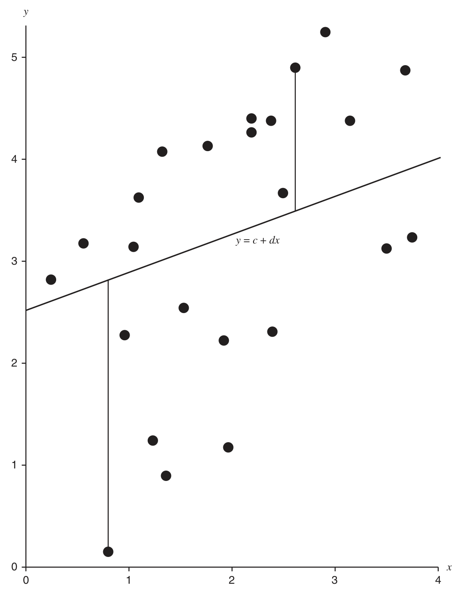
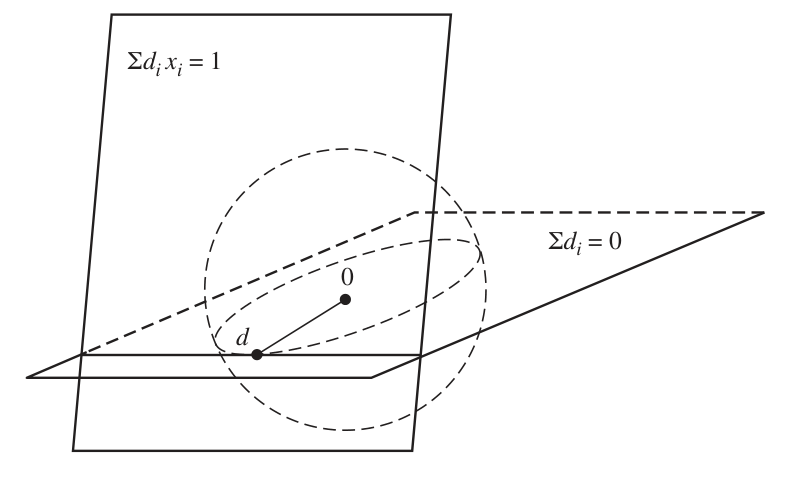
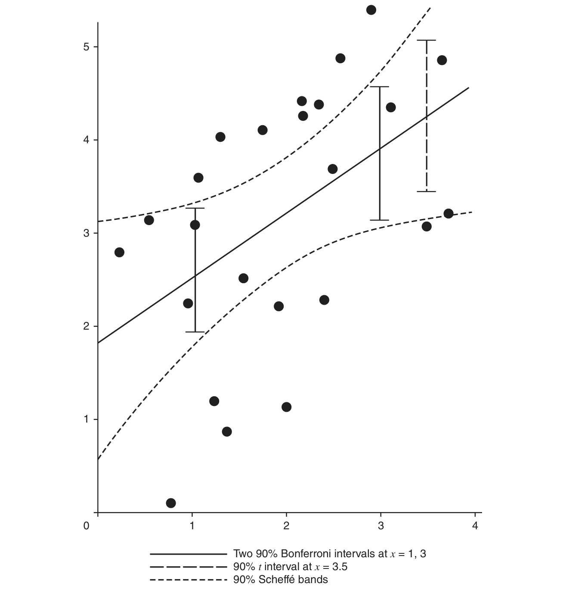

# 第 11 章　方差分析与回归（Analysis of Variance and Regression）

> *“I've wasted time enough,” said Lestrade rising. “I believe in hard work and not in sitting by the fire spinning fine theories.”*
>
> “我已经浪费了够多的时间。”雷斯垂德说着站起身来，“我相信埋头苦干，不相信坐在火炉边编织漂亮的理论。”
>
> ——雷斯垂德探长（《贵族单身汉案》）

## 11.1 引言（Introduction）

到目前为止，我们一直用依赖待估参数的 pdf 或 pmf 为随机变量建模。在许多情形（包括下面将看到的）中，随机变量不仅可以带未知参数建模，还可以带已知的（有时是可控制的）协变量（covariates）建模。这就是方差分析（analysis of variance, ANOVA）与回归分析（regression analysis）的方法论。它们基于“线性关系”这一底层假设，构成了实际使用的统计方法的一大部分核心内容。

方差分析是使用最广泛的统计技术之一。方差分析的一个基本思想——分割变异（partitioning variation）——是实验统计学的基本思想。方差分析名不副实：它关心的并不是分析方差，而是分析**均值**的变异。

我们将研究一种常见类型的方差分析——单因素方差分析（oneway ANOVA）。要全面了解方差分析设计的方方面面，可参考经典教材 Cochran and Cox (1957)，或较新但仍有些经典的 Dean and Voss (1999) 与 Kuehl (2000)。Neter et al. (1993) 提供了实验统计学总体策略的指南。

回归技术，特别是线性回归，大概要摘“最受欢迎的统计工具”的桂冠。回归有各种形式：线性的、非线性的、简单的、多元的、参数的、非参数的，等等。本章考察最简单的情形——带一个预测变量的线性回归（通常称为简单线性回归（simple linear regression），以区别于处理多个预测变量的多元线性回归（multiple linear regression））。

回归的一个主要目的是探索一个变量对其他变量的依赖。在简单线性回归中，随机变量 $Y$ 的均值被建模为另一个可观测变量 $x$ 的函数：$\mathrm{E} Y = \alpha + \beta x$。一般地，给出 $\mathrm{E} Y$ 作为 $x$ 的函数的那个函数称为总体回归函数（population regression function）。

回归模型的好的总体参考书有 Christensen (1996) 与 Draper and Smith (1998)；更理论的论述见 Stuart, Ord, and Arnold (1999, 第 27 章)。

## 11.2 单因素方差分析（Oneway Analysis of Variance）

方差分析最简单的形式是估计几个总体的均值的方法，这些总体常被假定为正态分布。然而方差分析的核心在于统计设计这一主题：如何用最少的观测从最多的总体获得最多的信息？不过方差分析的设计问题不是我们的主要关注；我们关心的是方差分析中的推断，即估计与检验。

经典方差分析以检验为主要目标——特别是检验所谓的“ANOVA 零假设”。但近年来，尤其是在计算能力大增的背景下，实验者认识到：检验一个假设（如我们将看到的，这个假设还有点可笑）并不能构成好的实验推断。因此，尽管我们会推导 ANOVA 零假设的检验，但它远非方差分析中最重要的部分。更重要的是估计——点估计与区间估计皆是。特别地，基于对照（contrast，稍后定义）的推断具有头等重要性。

在单因素方差分析（也称单因素分类，oneway classification）中，我们假设数据 $Y_{ij}$ 按模型

$$
Y_{ij} = \theta_i + \varepsilon_{ij}, \qquad i = 1, \ldots, k, \quad j = 1, \ldots, n_i \tag{11.2.1}
$$

被观测，其中诸 $\theta_i$ 是未知参数，诸 $\varepsilon_{ij}$ 是误差随机变量。

> **例 11.2.1（单因素 ANOVA）**
>
> 示意性地，单因素 ANOVA 的数据 $y_{ij}$ 形如：
>
> |  | 处理 |  |  |  |  |
> |:---|:---:|:---:|:---:|:---:|:---:|
> |  | 1 | 2 | 3 | … | $k$ |
> |  | $y_{11}$ | $y_{21}$ | $y_{31}$ | $\cdots$ | $y_{k1}$ |
> |  | $y_{12}$ | $y_{22}$ | $y_{32}$ | $\cdots$ | $y_{k2}$ |
> |  | $\vdots$ | $\vdots$ | $\vdots$ | $\cdots$ | $y_{k3}$ |
> |  | $y_{1n_1}$ | $y_{2n_2}$ | $y_{3n_3}$ |  | $\vdots$ |
> |  |  |  |  |  | $y_{kn_k}$ |
>
>
> 注意我们不假定各处理组中的观测个数相等。
>
> 举一个例子，考虑为评估三种毒物与一个对照对某种鳟鱼肝脏的相对影响而做的实验。数据是每条被解剖鱼的肝脏变质程度（以标准单位计）：
>
> | 毒物 1 | 毒物 2 | 毒物 3 | 对照 |
> |:---:|:---:|:---:|:---:|
> | 28 | 33 | 18 | 11 |
> | 23 | 36 | 21 | 14 |
> | 14 | 34 | 20 | 11 |
> | 27 | 29 | 22 | 16 |
> |  | 31 | 24 |  |
> |  | 34 |  |  |

不失一般性可设 $\mathrm{E}\varepsilon_{ij} = 0$：否则可以对 $\varepsilon_{ij}$ 重新标度并把剩余的均值吸收进 $\theta_i$。于是

$$
\mathrm{E} Y_{ij} = \theta_i, \qquad j = 1, \ldots, n_i,
$$

故诸 $\theta_i$ 就是诸 $Y_{ij}$ 的均值。$\theta_i$ 通常被称为处理均值（treatment means），因为下标 $i$ 常对应不同的处理，或某一处理的各个水平（如某种药物的剂量水平）。

模型 (11.2.1) 有一个替代模型，有时称为过参数化模型（overparameterized model），可写为

$$
Y_{ij} = \mu + \tau_i + \varepsilon_{ij}, \qquad i = 1, \ldots, k, \quad j = 1, \ldots, n_i, \tag{11.2.2}
$$

其中同样有 $\mathrm{E}\varepsilon_{ij} = 0$。由该模型可得 $\mathrm{E} Y_{ij} = \mu + \tau_i$。在这种表述下，我们把 $\mu$ 看作总平均（grand mean），即诸处理的公共均值水平；参数 $\tau_i$ 则表示处理 $i$ 的独特效应，即由处理引起的对均值水平的偏离。然而，我们无法把 $\tau_i$ 与 $\mu$ 分开估计，因为存在可识别性问题。

> **定义 11.2.2（可识别性）**
>
> 称分布族 $\{ f(x \mid \theta) : \theta \in \Theta \}$ 的参数 $\theta$ 是***可识别的***（identifiable），若 $\theta$ 的不同取值对应不同的 pdf 或 pmf。即若 $\theta \neq \theta'$，则 $f(x \mid \theta)$ 作为 $x$ 的函数不等于 $f(x \mid \theta')$。

可识别性是模型的性质，而不是某个估计量或估计程序的性质。但如果模型不可识别，做推断就会有困难。例如若 $f(x \mid \theta) = f(x \mid \theta')$，则来自两个分布的观测看起来完全一样，我们无从知道参数真值是 $\theta$ 还是 $\theta'$；特别地，$\theta$ 与 $\theta'$ 会给似然函数带来相同的值。

要认识到：可识别性问题通常可以通过重新定义模型来解决。此前我们没有遇到可识别性问题，原因之一是我们的模型不仅直观合理，而且可识别（例如用均值与方差为正态总体建模）。而这里我们有一个直观合理但不可识别的模型 (11.2.2)。第 12 章将看到二元正态分布的一种参数化：它很好地刻画了某个情形，却不可识别。

在 (11.2.2) 的参数化中有 $k + 1$ 个参数 $(\mu, \tau_1, \ldots, \tau_k)$，但只有 $k$ 个均值 $\mathrm{E} Y_{ij}$（$i = 1, \ldots, k$）。若不对参数加任何进一步限制，多于一个 $(\mu, \tau_1, \ldots, \tau_k)$ 的取值集合会导出相同的分布。该模型通常加上约束 $\sum_{i=1}^{k} \tau_i = 0$，这有效地把参数个数缩减到 $k$，使模型可识别。该约束还使诸 $\tau_i$ 获得了“对总平均水平的偏离”这一解释（见习题 11.5）。

对单因素 ANOVA，我们更愿意使用模型 (11.2.1)——单元均值模型（cell means model），它的解释更直接。不过在更复杂的 ANOVA 中，模型 (11.2.2) 有时有解释上的优势。

### 11.2.1 模型与分布假设（Model and Distribution Assumptions）

在模型 (11.2.1) 下，进行任何估计之前所需的最小假设是：对一切 $i, j$，$\mathrm{E}\varepsilon_{ij} = 0$ 且 $\mathrm{Var}\varepsilon_{ij} < \infty$。在这些假设下可以对诸 $\theta_i$ 作一些估计（如习题 7.41）。但要做任何置信区间估计或检验，需要分布假设。下面是经典的 ANOVA 假设。

> **单因素 ANOVA 假设**
>
> 随机变量 $Y_{ij}$ 按模型
>
> $$
> Y_{ij} = \theta_i + \varepsilon_{ij}, \qquad i = 1, \ldots, k, \quad j = 1, \ldots, n_i
> $$
>
> 被观测，其中
>
> - （i） 对一切 $i, j$：$\mathrm{E}\varepsilon_{ij} = 0$，$\mathrm{Var}\varepsilon_{ij} = \sigma_i^2 < \infty$；对一切 $i, i', j, j'$，除非 $i = i'$ 且 $j = j'$，有 $\mathrm{Cov}(\varepsilon_{ij}, \varepsilon_{i'j'}) = 0$。
>
> - （ii） $\varepsilon_{ij}$ 独立且服从正态分布（正态误差）。
>
> - （iii） 对一切 $i$，$\sigma_i^2 = \sigma^2$（方差相等，也称同方差性，homoscedasticity）。

没有假设 (ii)，我们只能做点估计，或可能在某类中寻找最小化方差的估计量，但无法做区间估计或检验。若假设某个非正态的分布，区间与检验的推导可能相当困难（但仍有可能）。当然，在样本量合理、总体不太偏斜时，我们有 CLT 可依。

方差相等假设也相当重要。有趣的是，其重要性与正态性假设相关联。一般地，若怀疑数据严重违反 ANOVA 假设，第一招通常是对数据作非线性变换，以设法更好地满足 ANOVA 假设——这比给未变换的数据另找模型一般更容易。Snedecor and Cochran (1989) 给出了许多常用变换；另见习题 11.1 与 11.2。（关于变换的其他研究涉及 Box–Cox 幂变换族，见习题 11.3。）

Box (1954) 的经典论文表明：ANOVA 对正态性假设的稳健性取决于方差相等的程度（越相等越好）。方差不相等时估计均值的问题称为 Behrens–Fisher 问题，有丰富的统计历史，可追溯到 Fisher (1935, 1939)。Behrens–Fisher 问题的完整论述见 Stuart, Ord, and Arnold (1999)。

在本章的其余部分，我们将像大多数实验情形所做的那样，假定三条经典假设成立。若数据需要变换与 CLT，我们假定已采取这些措施。

### 11.2.2 经典 ANOVA 假设（The Classic ANOVA Hypothesis）

经典 ANOVA 检验是对零假设

$$
H_0 :\quad \theta_1 = \theta_2 = \cdots = \theta_k
$$

的检验。在许多情形，这个假设是愚蠢、无趣且不真的。实验者通常不会相信不同处理的均值恰好相同；更合理的做法是做实验找出哪些处理更好（例如均值更大），而 ANOVA 真正的兴趣不在检验而在估计。（也存在一些专门情形，人们本身就关心 ANOVA 零假设。）大多数情形与下例类似。

> **例 11.2.3（ANOVA 假设）**
>
> ANOVA 是作为分析农业实验的方法而发展起来的。例如，在研究各种肥料对菠菜植株锌含量（$y_{ij}$）的影响时，考察五种处理。每种处理由肥料成分（镁、钾、锌）的混合物构成，数据呈现例 11.2.1 的布局。五种处理（单位为磅/英亩）为：
>
> | 处理 | 镁 | 钾 | 锌 |
> |:---:|:---:|:---:|:---:|
> | 1 | 0 | 0 | 0 |
> | 2 | 0 | 200 | 0 |
> | 3 | 50 | 200 | 0 |
> | 4 | 200 | 200 | 0 |
> | 5 | 0 | 200 | 15 |
>
>
> 经典 ANOVA 零假设其实毫无兴趣可言：实验者确信不同的肥料混合物有某些不同的效应；兴趣在于量化这些效应。

我们会花一些时间在 ANOVA 零假设上，但主要是把它作为达到目的的手段。回顾第 9 章建立的检验与区间估计之间的联系：利用这一联系，我们可以通过导出再反转适当的检验来导出置信区域（在这里这是更容易的路径）。

ANOVA 零假设的备择假设就是“均值不全相等”，即检验

$$
H_0 :\ \theta_1 = \theta_2 = \cdots = \theta_k
\qquad\text{对}\qquad
H_1 :\ \theta_i \neq \theta_j,\ \text{对某些}\ i, j. \tag{11.2.3}
$$

等价地，可以把 $H_1$ 指定为 $H_1 : \text{非}\ H_0$。要认识到：若拒绝 $H_0$，只能断定诸 $\theta_i$ 之间存在某种差异，却无法对差异在哪里作出任何推断。（注意若接受 $H_1$，我们并不是说诸 $\theta_i$ 全都不同，只是说至少有两个不同。）

ANOVA 假设的一个问题（许多多元假设也有此问题）是假设的解释不容易。比起只断言某些 $\theta_i$ 不同，更有用的是对诸 $\theta_i$ 的统计描述。这样的描述可以通过把 ANOVA 假设拆解成更小、更易描述的部分来获得。

我们已经遇到过把复杂假设拆解成更小更易理解的 pieces 的方法——第 8 章的并–交（union–intersection）与交–并（intersection–union）方法。对 ANOVA 而言，并–交方法最合适，因为 ANOVA 零假设是许多更易理解的单变量假设的交，这些假设用对照表达。而且在我们将考虑的情形中，基于并–交方法导出的检验与 LRT 相同（习题 11.13），因而享有似然检验的全部性质。

> **定义 11.2.4（线性组合与对照）**
>
> 设 $\textbf{t} = (t_1, \ldots, t_k)$ 是一组变量（参数或统计量），$\textbf{a} = (a_1, \ldots, a_k)$ 是已知常数。函数
>
> $$
> \sum_{i=1}^{k} a_i t_i \tag{11.2.4}
> $$
>
> 称为诸 $t_i$ 的***线性组合***（linear combination）。若进一步有 $\sum a_i = 0$，则称为***对照***（contrast）。

对照之所以重要，是因为它们可用于比较处理均值。例如，若有均值 $\theta_1, \ldots, \theta_k$ 与常数 $\textbf{a} = (1, -1, 0, \ldots, 0)$，则

$$
\sum_{i=1}^{k} a_i \theta_i = \theta_1 - \theta_2
$$

是一个比较 $\theta_1$ 与 $\theta_2$ 的对照。（关于对照的更多内容见习题 11.10。）

并–交方法的力量在于增进理解：ANOVA 零假设作为其交的那些单个零假设相当容易直观把握。

> **定理 11.2.5（ANOVA 零假设与对照）**
>
> 设 $\theta = (\theta_1, \ldots, \theta_k)$ 是任意参数。则
>
> $$
> \theta_1 = \theta_2 = \cdots = \theta_k
> \iff
> \sum_{i=1}^{k} a_i \theta_i = 0 \quad \text{对一切}\ \textbf{a} \in \mathcal{A},
> $$
>
> 其中 $\mathcal{A}$ 是满足 $\mathcal{A} = \{ \textbf{a} = (a_1, \ldots, a_k) : \sum a_i = 0 \}$ 的常数集合，即所有对照必须满足 $\sum a_i \theta_i = 0$。
>
> **证明**　若 $\theta_1 = \cdots = \theta_k = \theta$，则
>
> $$
> \sum_{i=1}^{k} a_i \theta_i = \sum_{i=1}^{k} a_i \theta = \theta \sum_{i=1}^{k} a_i = 0
> \qquad （\text{因为}\ \textbf{a}\ \text{满足}\ \sum a_i = 0）,
> $$
>
> 这证明了一个方向的蕴含（$\Rightarrow$）。为证另一方向，考虑 $\textbf{a}_i \in \mathcal{A}$ 的集合
>
> $$
> \textbf{a}_1 = (1, -1, 0, \ldots, 0),\quad
> \textbf{a}_2 = (0, 1, -1, 0, \ldots, 0),\quad
> \ldots,\quad
> \textbf{a}_{k-1} = (0, \ldots, 0, 1, -1).
> $$
>
> （集合 $(\textbf{a}_1, \textbf{a}_2, \ldots, \textbf{a}_{k-1})$ 张成 $\mathcal{A}$ 的元素：任何 $\textbf{a} \in \mathcal{A}$ 都可以写成 $(\textbf{a}_1, \textbf{a}_2, \ldots, \textbf{a}_{k-1})$ 的线性组合。）用这些 $\textbf{a}_i$ 构成对照，得到
>
> $$
> \textbf{a}_1 \Rightarrow \theta_1 = \theta_2, \quad
> \textbf{a}_2 \Rightarrow \theta_2 = \theta_3, \quad
> \ldots, \quad
> \textbf{a}_{k-1} \Rightarrow \theta_{k-1} = \theta_k,
> $$
>
> 合起来即蕴含 $\theta_1 = \cdots = \theta_k$，定理得证。 ∎

由定理 11.2.5 立即得出：ANOVA 零假设可以表达为关于对照的假设。即零假设为真当且仅当假设

$$
H_0 :\ \sum_{i=1}^{k} a_i \theta_i = 0 \quad \text{对一切满足}\ \sum_{i=1}^{k} a_i = 0\ \text{的}\ (a_1, \ldots, a_k)
$$

为真。而且若 $H_0$ 为假，我们现在知道必有至少一个非零对照。即 ANOVA 备择假设 $H_1$：诸 $\theta_i$ 不全相等，等价于

$$
H_1 :\ \sum_{i=1}^{k} a_i \theta_i \neq 0 \quad \text{对某个满足}\ \sum_{i=1}^{k} a_i = 0\ \text{的}\ (a_1, \ldots, a_k).
$$

于是我们有所收获：使用对照留给我们的假设更易理解、也许更易解释。而真正的收获在于：使用对照使我们能够以单变量的方式思考与操作。

### 11.2.3 关于均值线性组合的推断（Inferences Regarding Linear Combinations of Means）

线性组合、特别是对照，在方差分析中扮演极其重要的角色。通过理解与分析对照，我们可以对诸 $\theta_i$ 作出有意义的推断。上一节表明 ANOVA 零假设实质上是关于对照的陈述；事实上，ANOVA 中大多数有趣的推断都可以表达为对照或对照组。我们从单个线性组合的推断开始。

在单因素 ANOVA 假设下工作，我们有

$$
Y_{ij} \sim n(\theta_i, \sigma^2), \qquad i = 1, \ldots, k, \quad j = 1, \ldots, n_i.
$$

因此

$$
\bar{Y}_{i\cdot} = \frac{1}{n_i} \sum_{j=1}^{n_i} Y_{ij} \sim n\Bigl( \theta_i,\ \sigma^2 / n_i \Bigr), \qquad i = 1, \ldots, k.
$$

关于记号的说明：按通行约定，若一个下标被点（$\cdot$）替换，表示对该下标求和。于是 $Y_{i\cdot} = \sum_{j=1}^{n_i} Y_{ij}$，$Y_{\cdot j} = \sum_{i=1}^{k} Y_{ij}$；加一“横杠”表示取均值，如上面的 $\bar{Y}_{i\cdot}$。若两个下标都被求和、要计算总平均（称为 grand mean），为了记号简单我们打破这一规则，写 $\bar{\bar{Y}} = \frac{1}{N} \sum_{i=1}^{k} \sum_{j=1}^{n_i} Y_{ij}$，其中 $N = \sum_{i=1}^{k} n_i$。

对任意常数 $\textbf{a} = (a_1, \ldots, a_k)$，$\sum_{i=1}^{k} a_i \bar{Y}_{i\cdot}$ 也是正态的（习题 11.8），且

$$
\mathrm{E}\Bigl[ \sum_{i=1}^{k} a_i \bar{Y}_{i\cdot} \Bigr] = \sum_{i=1}^{k} a_i \theta_i,
\qquad
\mathrm{Var}\Bigl[ \sum_{i=1}^{k} a_i \bar{Y}_{i\cdot} \Bigr] = \sigma^2 \sum_{i=1}^{k} \frac{a_i^2}{n_i},
$$

进一步有

$$
\frac{\sum_{i=1}^{k} a_i \bar{Y}_{i\cdot} - \sum_{i=1}^{k} a_i \theta_i}{\sqrt{\sigma^2 \sum_{i=1}^{k} a_i^2 / n_i}} \sim n(0, 1).
$$

这固然很好，但我们通常处于想在不了解 $\sigma$ 的情况下对诸 $\theta_i$ 作推断的境地，因此要用估计替换 $\sigma$。在每个总体中记样本方差为 $S_i^2$，即

$$
S_i^2 = \frac{1}{n_i - 1} \sum_{j=1}^{n_i} (Y_{ij} - \bar{Y}_{i\cdot})^2, \qquad i = 1, \ldots, k,
$$

则 $S_i^2$ 是 $\sigma^2$ 的估计，且 $(n_i - 1)S_i^2/\sigma^2 \sim \chi^2_{n_i - 1}$。此外，在 ANOVA 假设下，由于每个 $S_i^2$ 都估计同一个 $\sigma^2$，我们可以把它们合并来改进估计量。于是使用 $\sigma^2$ 的合并估计量（pooled estimator）$S_p^2$：

$$
S_p^2 = \frac{1}{N - k} \sum_{i=1}^{k} (n_i - 1) S_i^2 = \frac{1}{N - k} \sum_{i=1}^{k} \sum_{j=1}^{n_i} (Y_{ij} - \bar{Y}_{i\cdot})^2. \tag{11.2.5}
$$

注意 $N - k = \sum (n_i - 1)$。由于诸 $S_i^2$ 独立，引理 5.3.2 表明 $(N - k)S_p^2 / \sigma^2 \sim \chi^2_{N-k}$。而且 $S_p^2$ 与每个 $\bar{Y}_{i\cdot}$ 独立（习题 11.6），于是

$$
\frac{\sum_{i=1}^{k} a_i \bar{Y}_{i\cdot} - \sum_{i=1}^{k} a_i \theta_i}{\sqrt{S_p^2 \sum_{i=1}^{k} a_i^2 / n_i}} \sim t_{N-k}, \tag{11.2.6}
$$

即自由度为 $N - k$ 的 Student $t$。

要在水平 $\alpha$ 检验

$$
H_0 :\ \sum_{i=1}^{k} a_i \theta_i = 0
\qquad\text{对}\qquad
H_1 :\ \sum_{i=1}^{k} a_i \theta_i \neq 0,
$$

在

$$
\Biggl| \frac{\sum_{i=1}^{k} a_i \bar{Y}_{i\cdot}}{\sqrt{S_p^2 \sum_{i=1}^{k} a_i^2 / n_i}} \Biggr| > t_{N-k, \alpha/2} \tag{11.2.7}
$$

时拒绝 $H_0$。（习题 11.9 给出涉及线性组合的其他检验。）此外，(11.2.6) 定义了一个枢轴量，反转它就得到 $\sum a_i \theta_i$ 的区间估计量：以概率 $1 - \alpha$，

$$
\sum_{i=1}^{k} a_i \bar{Y}_{i\cdot} - t_{N-k, \alpha/2} \sqrt{S_p^2 \sum_{i=1}^{k} \frac{a_i^2}{n_i}}
\;\leq\; \sum_{i=1}^{k} a_i \theta_i \;\leq\;
\sum_{i=1}^{k} a_i \bar{Y}_{i\cdot} + t_{N-k, \alpha/2} \sqrt{S_p^2 \sum_{i=1}^{k} \frac{a_i^2}{n_i}}. \tag{11.2.8}
$$

> **例 11.2.6（ANOVA 对照）**
>
> $\textbf{a}$ 的特殊取值给出特定的检验或置信区间。例如要比较处理 1 与 2，取 $\textbf{a} = (1, -1, 0, \ldots, 0)$。则利用 (11.2.6)，检验 $H_0 : \theta_1 = \theta_2$ 对 $H_1 : \theta_1 \neq \theta_2$ 时，在
>
> $$
> \Biggl| \frac{\bar{Y}_{1\cdot} - \bar{Y}_{2\cdot}}{\sqrt{S_p^2 \bigl( \frac{1}{n_1} + \frac{1}{n_2} \bigr)}} \Biggr| > t_{N-k, \alpha/2}
> $$
>
> 时拒绝 $H_0$。
>
> 注意该检验与两样本 $t$ 检验（习题 8.41）的差别：这里处理 3 到 $k$ 的信息连同处理 1 与 2 的信息一起用于估计 $\sigma^2$。
>
> 另一种做法：比较处理 1 与处理 2、3 的平均（例如处理 1 可能是对照，2 与 3 是实验处理，我们关心某种总体效应），可取 $\textbf{a} = (1, -\frac{1}{2}, -\frac{1}{2}, 0, \ldots, 0)$，在
>
> $$
> \Biggl| \frac{\bar{Y}_{1\cdot} - \frac{1}{2} \bar{Y}_{2\cdot} - \frac{1}{2} \bar{Y}_{3\cdot}}{\sqrt{S_p^2 \bigl( \frac{1}{n_1} + \frac{1}{4n_2} + \frac{1}{4n_3} \bigr)}} \Biggr| > t_{N-k, \alpha/2}
> $$
>
> 时拒绝 $H_0 : \theta_1 = \frac{1}{2}(\theta_2 + \theta_3)$。
>
> 用 (11.2.6) 或 (11.2.8)，我们便有了在 ANOVA 中检验或估计任何线性组合的方法。明智地选择线性组合，可以学到关于处理均值的许多东西。例如考察对照 $\theta_1 - \theta_2$、$\theta_2 - \theta_3$ 与 $\theta_1 - \theta_3$，就能了解诸 $\theta_i$ 的某种次序信息。（当然做多个检验或区间时要小心总体 $\alpha$ 水平，但可以用 Bonferroni 不等式，见例 11.2.9。）
>
> 从对照的组合作出正式结论时也要谨慎。考虑假设
>
> $$
> H_0 :\ \theta_1 = \frac{1}{2}(\theta_2 + \theta_3) \qquad\text{对}\qquad H_1 :\ \theta_1 < \frac{1}{2}(\theta_2 + \theta_3)
> $$
>
> 与
>
> $$
> H_0 :\ \theta_2 = \theta_3 \qquad\text{对}\qquad H_1 :\ \theta_2 < \theta_3.
> $$
>
> 若两个原假设都被拒绝，可以断定 $\theta_3$ 比both $\theta_1$ 与 $\theta_2$ 都大，但从这两个检验无法对 $\theta_2$ 与 $\theta_1$ 的次序作出正式结论。（见习题 11.10。）

### 11.2.4 ANOVA $F$ 检验（The ANOVA F Test）

上一节我们看到如何处理单一线性组合、特别是 ANOVA 中的对照；11.2 节又看到 ANOVA 零假设等价于关于对照的假设。本节利用这一等价性，连同第 8 章的并–交方法论，导出 ANOVA 假设的检验。

由定理 11.2.5，ANOVA 假设检验可以写成

$$
H_0 :\ \sum_{i=1}^{k} a_i \theta_i = 0\ \text{对一切}\ \textbf{a} \in \mathcal{A}
\qquad\text{对}\qquad
H_1 :\ \sum_{i=1}^{k} a_i \theta_i \neq 0\ \text{对某个}\ \textbf{a} \in \mathcal{A},
$$

其中 $\mathcal{A} = \{ \textbf{a} = (a_1, \ldots, a_k) : \sum_{i=1}^{k} a_i = 0 \}$。为更清楚地看出这是一个并–交检验，对每个 $\textbf{a}$ 定义集合

$$
\Theta_{\textbf{a}} = \Bigl\{ \theta = (\theta_1, \ldots, \theta_k) : \sum_{i=1}^{k} a_i \theta_i = 0 \Bigr\}.
$$

则

$$
\theta \in \{ \theta : \theta_1 = \theta_2 = \cdots = \theta_k \}
\iff
\theta \in \Theta_{\textbf{a}}\ \text{对一切}\ \textbf{a} \in \mathcal{A}
\iff
\theta \in \bigcap_{\textbf{a} \in \mathcal{A}} \Theta_{\textbf{a}},
$$

这表明 ANOVA 零假设可以写成一个交。

现在回顾 8.2.3 节的并–交方法论：若能对任何 $\textbf{a}$ 拒绝 $H_{0\textbf{a}} : \theta \in \Theta_{\textbf{a}}$ 对 $H_{1\textbf{a}} : \theta \notin \Theta_{\textbf{a}}$，就拒绝 $H_0 : \theta \in \bigcap_{\textbf{a} \in \mathcal{A}} \Theta_{\textbf{a}}$（从而拒绝 ANOVA 零假设）。我们用 (11.2.6) 的 $t$ 统计量检验 $H_{0\textbf{a}}$：

$$
T_{\textbf{a}} = \Biggl| \frac{\sum_{i=1}^{k} a_i \bar{Y}_{i\cdot} - \sum_{i=1}^{k} a_i \theta_i}{\sqrt{S_p^2 \sum_{i=1}^{k} a_i^2 / n_i}} \Biggr|. \tag{11.2.9}
$$

若 $T_{\textbf{a}} > k$（$k$ 为某常数）则拒绝 $H_{0\textbf{a}}$。按并–交方法论，若能对任何 $\textbf{a}$ 拒绝，就能对使 $T_{\textbf{a}}$ 最大的那个 $\textbf{a}$ 拒绝。于是 ANOVA 零假设的并–交检验为：若 $\sup_{\textbf{a}} T_{\textbf{a}} > k$ 则拒绝 $H_0$，其中 $k$ 选得使 $P_{H_0}(\sup_{\textbf{a}} T_{\textbf{a}} > k) = \alpha$。

计算 $\sup_{\textbf{a}} T_{\textbf{a}}$ 并不直截了当，但稍加小心并不困难。这是受约束最大值的计算，与之前遇到的问题类似（例如习题 7.41 计算受约束最小值）。我们将以与之前类似的方式进攻这个问题，使用 Cauchy–Schwarz 不等式。（另一种方法是 Lagrange 乘子法，但那时必须用二阶条件验证找到的确实是最大值。）

大部分技术性的最大化论证将在下面的引理中给出，然后该引理将被用来求 $T_{\textbf{a}}$ 的上确界。引理只是关于二次函数受约束最大值的陈述。胆小者可跳过其证明。

> **引理 11.2.7（受约束的最大值）**
>
> 设 $(v_1, \ldots, v_k)$ 是常数，$(c_1, \ldots, c_k)$ 是正常数。则对 $\mathcal{A} = \{ \textbf{a} = (a_1, \ldots, a_k) : \sum a_i = 0 \}$，
>
> $$
> \max_{\textbf{a} \in \mathcal{A}} \frac{\Bigl( \sum_{i=1}^{k} a_i v_i \Bigr)^2}{\sum_{i=1}^{k} a_i^2 / c_i} = \sum_{i=1}^{k} c_i (v_i - \bar{v}_c)^2, \tag{11.2.10}
> $$
>
> 其中 $\bar{v}_c = \sum c_i v_i / \sum c_i$。最大值在形如 $a_i = K c_i (v_i - \bar{v}_c)$（$K$ 是非零常数）的任何 $\textbf{a}$ 处达到。
>
> **证明**　定义 $\mathcal{B} = \{ \textbf{b} = (b_1, \ldots, b_k) : \sum b_i = 0\ \text{且}\ \sum b_i^2 / c_i = 1 \}$。对任何 $\textbf{a} \in \mathcal{A}$，定义 $\textbf{b} = (b_1, \ldots, b_k)$ 为
>
> $$
> b_i = \frac{a_i}{\sqrt{\sum_{i=1}^{k} a_i^2 / c_i}},
> $$
>
> 并注意 $\textbf{b} \in \mathcal{B}$。对任何 $\textbf{a} \in \mathcal{A}$，
>
> $$
> \frac{\Bigl( \sum_{i=1}^{k} a_i v_i \Bigr)^2}{\sum_{i=1}^{k} a_i^2 / c_i} = \Bigl( \sum_{i=1}^{k} b_i v_i \Bigr)^2.
> $$
>
> 我们将先对 $\textbf{b} \in \mathcal{B}$ 求 $(\sum b_i v_i)^2$ 的上界，然后证明引理给出的最大化 $\textbf{a}$ 达到该上界。
>
> 既然处理的是乘积之和，Cauchy–Schwarz 不等式（4.7 节）是自然的选择，但必须小心地把涉及 $c_i$ 的约束纳入。可以这样做：定义 $C = \sum c_i$ 并写
>
> $$
> \frac{1}{C^2} \Bigl( \sum_{i=1}^{k} b_i v_i \Bigr)^2
> = \Bigl[ \sum_{i=1}^{k} \Bigl( \frac{b_i}{c_i} \Bigr) \Bigl( \frac{c_i}{C} \Bigr) (v_i) \Bigr]^2.
> $$
>
> 这是由比值 $c_i / C$ 定义的概率测度下的协方差之平方。形式上，若定义随机变量 $B$ 与 $V$ 为
>
> $$
> P\Bigl( B = \frac{b_i}{c_i},\ V = v_i \Bigr) = \frac{c_i}{C}, \qquad i = 1, \ldots, k,
> $$
>
> 则 $\mathrm{E} B = \sum (b_i / c_i)(c_i / C) = \sum b_i / C = 0$。于是
>
> $$
> \begin{aligned}
> \Bigl[ \sum_{i=1}^{k} \Bigl( \frac{b_i}{c_i} \Bigr) \Bigl( \frac{c_i}{C} \Bigr) (v_i) \Bigr]^2
> &= \bigl( \mathrm{E} BV \bigr)^2\\
> &= \bigl( \mathrm{Cov}(B, V) \bigr)^2 \qquad （\mathrm{E} B = 0）\\
> &\leq (\mathrm{Var} B)(\mathrm{Var} V) \qquad （\text{Cauchy--Schwarz 不等式}）\\
> &= \Bigl[ \sum_{i=1}^{k} c_i \Bigl( \frac{b_i}{C} \Bigr)^{\! 2} \Bigr] \Bigl[ \sum_{i=1}^{k} \Bigl( \frac{c_i}{C} \Bigr) (v_i - \bar{v}_c)^2 \Bigr],
> \qquad \bar{v}_c = \frac{\sum c_i v_i}{\sum c_i}.
> \end{aligned}
> $$
>
> 利用 $\sum b_i^2 / c_i = 1$ 并消去公共项，得
>
> $$
> \Bigl( \sum_{i=1}^{k} b_i v_i \Bigr)^2 \leq \sum_{i=1}^{k} c_i (v_i - \bar{v}_c)^2, \qquad \text{对任何}\ \textbf{b} \in \mathcal{B}. \tag{11.2.11}
> $$
>
> 最后，若 $a_i = K c_i (v_i - \bar{v}_c)$（$K$ 是任何非零常数），则 $\textbf{a} \in \mathcal{A}$ 且
>
> $$
> b_i = \frac{K c_i (v_i - \bar{v}_c)}{\sqrt{\sum_{i=1}^{k} (K c_i (v_i - \bar{v}_c))^2 / c_i}} = \frac{c_i (v_i - \bar{v}_c)}{\sqrt{\sum_{i=1}^{k} c_i (v_i - \bar{v}_c)^2}}.
> $$
>
> 由于 $\sum c_i (v_i - \bar{v}_c) = 0$，
>
> $$
> \sum_{i=1}^{k} b_i v_i
> = \frac{\sum_{i=1}^{k} c_i (v_i - \bar{v}_c) v_i}{\sqrt{\sum_{i=1}^{k} c_i (v_i - \bar{v}_c)^2}}
> = \frac{\sum_{i=1}^{k} c_i (v_i - \bar{v}_c)^2}{\sqrt{\sum_{i=1}^{k} c_i (v_i - \bar{v}_c)^2}}
> = \sqrt{\sum_{i=1}^{k} c_i (v_i - \bar{v}_c)^2},
> $$
>
> 于是 (11.2.11) 中的不等式成为等式。因此上界被达到，函数在这样的 $\textbf{a}$ 处最大化。 ∎

回到 (11.2.9) 的 $T_{\textbf{a}}$：显然最大化 $T_{\textbf{a}}$ 等价于最大化 $T_{\textbf{a}}^2$。我们有

$$
T_{\textbf{a}}^2
= \frac{\Bigl( \sum_{i=1}^{k} a_i \bar{Y}_{i\cdot} - \sum_{i=1}^{k} a_i \theta_i \Bigr)^2}{S_p^2 \sum_{i=1}^{k} a_i^2 / n_i}
= \frac{\Bigl( \sum_{i=1}^{k} a_i \bar{U}_i \Bigr)^2}{S_p^2 \sum_{i=1}^{k} a_i^2 / n_i}.
\qquad (\bar{U}_i = \bar{Y}_{i\cdot} - \theta_i)
$$

注意到 $S_p^2$ 对最大化没有影响，可以把引理 11.2.7 应用于上式，得到下面的定理。

> **定理 11.2.8（$T_{\textbf{a}}$ 的上确界）**
>
> 对 (11.2.9) 定义的 $T_{\textbf{a}}$，
>
> $$
> \sup_{\textbf{a}: \sum a_i = 0} T_{\textbf{a}}^2 = \frac{\Bigl[ \sum_{i=1}^{k} n_i \Bigl( \bigl( \bar{Y}_{i\cdot} - \bar{\bar{Y}} \bigr) - (\theta_i - \bar{\theta}) \Bigr) \Bigr]^2}{S_p^2}, \tag{11.2.12}
> $$
>
> 其中 $\bar{\bar{Y}} = \sum n_i \bar{Y}_{i\cdot} / \sum n_i$，$\bar{\theta} = \sum n_i \theta_i / \sum n_i$。此外，在 ANOVA 假设下
>
> $$
> \sup_{\textbf{a}: \sum a_i = 0} T_{\textbf{a}}^2 \sim (k - 1) F_{k-1, N-k}, \tag{11.2.13}
> $$
>
> 即 $\sup_{\textbf{a}: \sum a_i = 0} T_{\textbf{a}}^2 / (k - 1)$ 服从自由度为 $k - 1$ 与 $N - k$ 的 $F$ 分布。（回顾 $N = \sum n_i$。）
>
> **证明**　为证 (11.2.12)，用引理 11.2.7，把 $v_i$ 认同于 $\bar{U}_i$、$c_i$ 认同于 $n_i$，结果立得。
>
> 为证 (11.2.13)，必须证明 (11.2.12) 的分子与分母是独立的卡方随机变量，各除以自己的自由度。由 ANOVA 假设可得两件事：分子与分母独立，且 $S_p^2 \sim \sigma^2 \chi^2_{N-k} / (N - k)$。还需做一些工作来证明
>
> $$
> \frac{1}{\sigma^2} \sum_{i=1}^{k} n_i \Bigl[ \bigl( \bar{Y}_{i\cdot} - \bar{\bar{Y}} \bigr) - (\theta_i - \bar{\theta}) \Bigr]^2 \sim \chi^2_{k-1}.
> $$
>
> 这是可以做到的，留作习题。（见习题 11.7。） ∎

若 $H_0 : \theta_1 = \theta_2 = \cdots = \theta_k$ 为真，则对一切 $i = 1, \ldots, k$ 有 $\theta_i = \theta$，$\theta_i - \bar{\theta}$ 各项从 (11.2.12) 中消失。于是对 ANOVA 假设

$$
H_0 :\ \theta_1 = \theta_2 = \cdots = \theta_k
\qquad\text{对}\qquad
H_1 :\ \theta_i \neq \theta_j,\ \text{对某些}\ i, j
$$

的水平 $\alpha$ 检验：在

$$
\frac{\Bigl( \sum_{i=1}^{k} n_i \bigl( \bar{Y}_{i\cdot} - \bar{\bar{Y}} \bigr) \Bigr)^2}{S_p^2} > (k - 1) F_{k-1, N-k, \alpha} \tag{11.2.14}
$$

时拒绝 $H_0$。该拒绝区域通常写成

$$
\text{若}\ F = \frac{\Bigl( \sum_{i=1}^{k} n_i \bigl( \bar{Y}_{i\cdot} - \bar{\bar{Y}} \bigr) \Bigr)^2 / (k - 1)}{S_p^2} > F_{k-1, N-k, \alpha}\ \text{则拒绝}\ H_0,
$$

检验统计量 $F$ 称为 ANOVA $F$ 统计量。

### 11.2.5 对照的同时估计（Simultaneous Estimation of Contrasts）

我们已经见过如何在 ANOVA 中估计与检验单个对照：$t$ 统计量与区间由 (11.2.6) 与 (11.2.8) 给出。然而在 ANOVA 中我们常常想作多于一个推断，而且我们知道：许多水平 $\alpha$ 检验的联合推断未必是水平 $\alpha$ 的。在 ANOVA 的语境中这个问题已被提及。

> **例 11.2.9（成对差异）**
>
> 许多时候人们关心均值的成对差异。若 ANOVA 有均值 $\theta_1, \ldots, \theta_k$，可能关心 $\theta_1 - \theta_2$、$\theta_2 - \theta_3$、$\theta_3 - \theta_4$ 等的区间估计。利用 Bonferroni 不等式可以建立同时推断陈述。定义
>
> $$
> C_{ij} = \Bigl\{ \theta_i - \theta_j : \theta_i - \theta_j \in \bar{Y}_{i\cdot} - \bar{Y}_{j\cdot} \pm t_{N-k, \alpha/2} \sqrt{S_p^2 \Bigl( \frac{1}{n_i} + \frac{1}{n_j} \Bigr)} \Bigr\}.
> $$
>
> 则对每个 $C_{ij}$ 有 $P(C_{ij}) = 1 - \alpha$，但例如 $P(C_{12}\ \text{且}\ C_{23}) < 1 - \alpha$。然而后面这种推断正是我们在 ANOVA 中想作的那种。
>
> 回顾式 (1.2.10) 给出的 Bonferroni 不等式：对任何集合 $A_1, \ldots, A_n$，
>
> $$
> P\Bigl( \bigcap_{i=1}^{n} A_i \Bigr) \geq \sum_{i=1}^{n} P(A_i) - (n - 1).
> $$
>
> 这里我们想界定 $P(\bigcap_{i,j} C_{ij})$，即所有成对区间都覆盖各自差异的概率。
>
> 若想对 $m$ 个置信集合的覆盖作同时 $1 - \alpha$ 陈述，则由 Bonferroni 不等式，可以把每个置信集合构造成水平 $\gamma$，其中 $\gamma$ 满足
>
> $$
> 1 - \alpha = \sum_{i=1}^{m} \gamma - (m - 1),
> $$
>
> 等价地，
>
> $$
> \gamma = 1 - \frac{\alpha}{m}.
> $$
>
> 还可以稍作推广：不必要求每个单个推断取相同水平。可以把每个置信集合构造成水平 $\gamma_i$，其中 $\gamma_i$ 满足 $1 - \alpha = \sum_{i=1}^{m} \gamma_i - (m - 1)$。
>
> 在有 $k$ 个处理的 ANOVA 中，若每个 $t$ 区间的置信为 $1 - \frac{2\alpha}{k(k-1)}$，则全部 $k(k-1)/2$ 个成对差异的同时推断可以以置信 $1 - \alpha$ 作出。

Scheffé (1959) 给出了同时推断的另一种非常优雅的方法。Scheffé 程序（有时称为 S 方法）允许对**所有**对照作同时置信区间（或检验）。（习题 11.14 表明 Scheffé 方法还可用于对任何线性组合（不只是对照）建立同时区间。）该程序让我们设定一个对一切对照区间同时有效的置信系数，而不只是某个指定组。若要考察大量对照，Scheffé 程序更受青睐；若对照个数少，Bonferroni 界几乎肯定更小。（其他类型的多重比较程序见杂记一节的讨论。）

Scheffé 程序对所有对照具有同时 $1 - \alpha$ 覆盖这一事实，可以由 ANOVA 检验的并–交性质轻松证明。

> **定理 11.2.10（Scheffé 程序）**
>
> 在 ANOVA 假设下，若 $M = \sqrt{(k - 1) F_{k-1, N-k, \alpha}}$，则概率为 $1 - \alpha$ 地有
>
> $$
> \sum_{i=1}^{k} a_i \bar{Y}_{i\cdot} - M \sqrt{S_p^2 \sum_{i=1}^{k} \frac{a_i^2}{n_i}} \;\leq\; \sum_{i=1}^{k} a_i \theta_i \;\leq\; \sum_{i=1}^{k} a_i \bar{Y}_{i\cdot} + M \sqrt{S_p^2 \sum_{i=1}^{k} \frac{a_i^2}{n_i}},
> $$
>
> 且上式对一切 $\textbf{a} \in \mathcal{A} = \{ \textbf{a} = (a_1, \ldots, a_k) : \sum a_i = 0 \}$ **同时**成立。
>
> **证明**　同时概率陈述要求 $M$ 满足
>
> $$
> P\Biggl( \Bigl| \sum_{i=1}^{k} a_i \bar{Y}_{i\cdot} - \sum_{i=1}^{k} a_i \theta_i \Bigr| \leq M \sqrt{S_p^2 \sum_{i=1}^{k} \frac{a_i^2}{n_i}}\ \text{对一切}\ \textbf{a} \in \mathcal{A} \Biggr) = 1 - \alpha,
> $$
>
> 等价地，
>
> $$
> P\bigl( T_{\textbf{a}}^2 \leq M^2,\ \text{对一切}\ \textbf{a} \in \mathcal{A} \bigr) = 1 - \alpha,
> $$
>
> 其中 $T_{\textbf{a}}$ 定义于 (11.2.9)。然而由于
>
> $$
> P\bigl( T_{\textbf{a}}^2 \leq M^2,\ \text{对一切}\ \textbf{a} \in \mathcal{A} \bigr)
> = P\Bigl( \sup_{\textbf{a}: \sum a_i = 0} T_{\textbf{a}}^2 \leq M^2 \Bigr),
> $$
>
> 定理 11.2.8 表明取 $M^2 = (k - 1) F_{k-1, N-k, \alpha}$ 即满足概率要求。 ∎

Scheffé 程序的一个真正优点是它允许正当的“数据窥探”（data snooping）。在经典统计中，检验由数据暗示的假设是大忌，因为这会使结果有偏、从而使推断失效。（我们通常不会只因注意到 $\bar{Y}_{1\cdot}$ 不同于 $\bar{Y}_{2\cdot}$ 就去检验 $H_0 : \theta_1 = \theta_2$；见习题 11.18。）但使用 Scheffé 程序，这种策略是正当的：区间或检验对所有对照都有效；它们是否由数据暗示毫无影响——Scheffé 程序早已把它们照顾到了。

当然，必须为 Scheffé 程序提供的全部推断能力付出代价，代价的形式是区间的长度。为保证同时置信水平，区间可能相当长。例如可以证明（习题 11.15）：比较 $t$ 与 $F$ 分布，对任何 $\nu, \alpha, k$，截断点满足

$$
t_{\nu, \alpha/2} \leq \sqrt{(k - 1) F_{k-1, \nu, \alpha}},
$$

因此 Scheffé 区间总是比单对照区间更宽，有时宽得多（这再次支持了“实验中没有任何东西可以替代周密的计划与准备”的信条）。区间长度现象也延续到检验上：由上述不等式还可得 Scheffé 检验不如 $t$ 检验有功效。

### 11.2.6 平方和的分割（Partitioning Sums of Squares）

ANOVA 提供了一种有用的思考方式，来理解不同处理如何影响被测变量——把变异分配给不同来源的思想。分配变异的基本思想可以概括为下面的恒等式。

> **定理 11.2.11（平方和的分割）**
>
> 对任何数 $y_{ij}$（$i = 1, \ldots, k$，$j = 1, \ldots, n_i$），
>
> $$
> \sum_{i=1}^{k} \sum_{j=1}^{n_i} (y_{ij} - \bar{\bar{y}})^2
> = \sum_{i=1}^{k} n_i (\bar{y}_{i\cdot} - \bar{\bar{y}})^2
> + \sum_{i=1}^{k} \sum_{j=1}^{n_i} (y_{ij} - \bar{y}_{i\cdot})^2, \tag{11.2.15}
> $$
>
> 其中 $\bar{y}_{i\cdot} = \frac{1}{n_i} \sum_j y_{ij}$，$\bar{\bar{y}} = \sum_i n_i \bar{y}_{i\cdot} / \sum_i n_i$。
>
> **证明**　证明相当简单，只依赖这样一个事实：处理均值时交叉项常常消失。写
>
> $$
> \sum_{i=1}^{k} \sum_{j=1}^{n_i} (y_{ij} - \bar{\bar{y}})^2
> = \sum_{i=1}^{k} \sum_{j=1}^{n_i} \bigl[ (y_{ij} - \bar{y}_{i\cdot}) + (\bar{y}_{i\cdot} - \bar{\bar{y}}) \bigr]^2,
> $$
>
> 展开右端并重新组合各项。（见习题 11.21。） ∎

(11.2.15) 中的和称为平方和（sums of squares），被视为度量数据中可归因于不同来源的变异。（它们有时被称为修正平方和（corrected sums of squares），“修正”指已减去一个均值。）特别地，单因素 ANOVA 模型

$$
Y_{ij} = \theta_i + \varepsilon_{ij}
$$

中的各项与 (11.2.15) 中的各项一一对应。(11.2.15) 表明如何把变异分配给处理（处理间变异）与随机误差（处理内变异）。(11.2.15) 的左端度量不考虑处理分类的变异，而右端两项分别度量只由处理引起的变异与只由随机误差引起的变异。这些变异来源满足上述恒等式这一事实表明：以平方和度量的数据变异，其可加性与 ANOVA 模型的可加性相同。

处理平方和更容易的一个原因是：在正态性下，修正平方和是卡方随机变量，而我们已知独立的卡方变量可以相加得到新的卡方变量。

在 ANOVA 假设下，特别地若 $Y_{ij} \sim n(\theta_i, \sigma^2)$，容易证明

$$
\frac{1}{\sigma^2} \sum_{i=1}^{k} \sum_{j=1}^{n_i} (Y_{ij} - \bar{Y}_{i\cdot})^2 \sim \chi^2_{N-k}, \tag{11.2.16}
$$

因为对每个 $i = 1, \ldots, k$，$\frac{1}{\sigma^2} \sum_{j=1}^{n_i} (Y_{ij} - \bar{Y}_{i\cdot})^2 \sim \chi^2_{n_i - 1}$ 且相互独立，而独立卡方随机变量满足 $\sum_{i=1}^{k} \chi^2_{n_i - 1} \sim \chi^2_{N-k}$。此外，若对每个 $i, j$ 有 $\theta_i = \theta_j$，则

$$
\frac{1}{\sigma^2} \sum_{i=1}^{k} n_i (\bar{Y}_{i\cdot} - \bar{\bar{Y}})^2 \sim \chi^2_{k-1}
\qquad\text{与}\qquad
\frac{1}{\sigma^2} \sum_{i=1}^{k} \sum_{j=1}^{n_i} (Y_{ij} - \bar{\bar{Y}})^2 \sim \chi^2_{N-1}. \tag{11.2.17}
$$

于是，在 $H_0 : \theta_1 = \cdots = \theta_k$ 下，(11.2.15) 的平方和分割就是卡方随机变量的分割：适当缩放后左端服从 $\chi^2_{N-1}$ 分布，右端是两个独立随机变量之和，分别服从 $\chi^2_{k-1}$ 与 $\chi^2_{N-k}$。注意：$\chi^2$ 分割只在 (11.2.15) 右端各项独立时成立；此处独立性来自 ANOVA 假设中的正态性。$\chi^2$ 的分割在稍更一般的情形成立，其刻画有时称为 Cochran 定理（见 Searle (1971) 及杂记一节）。

一般地，可以把一个平方和分割成互不相关的、各具一个自由度的对照平方和。若平方和有 $\nu$ 个自由度且服从 $\chi^2_\nu$，则可以把它分割成 $\nu$ 个独立项，每项都是 $\chi^2_1$。

量 $(\sum a_i \bar{Y}_{i\cdot})^2 / (\sum a_i^2 / n_i)$ 称为处理对照 $\sum a_i \bar{Y}_{i\cdot}$ 的对照平方和（contrast sum of squares）。在单因素 ANOVA 中，总能找到常数集 $\textbf{a}^{(l)} = (a_1^{(l)}, \ldots, a_k^{(l)})$，$l = 1, \ldots, k - 1$，满足

$$
\sum_{i=1}^{k} n_i (\bar{Y}_{i\cdot} - \bar{\bar{Y}})^2
= \frac{\bigl( \sum_{i=1}^{k} a_i^{(1)} \bar{Y}_{i\cdot} \bigr)^2}{\sum_{i=1}^{k} (a_i^{(1)})^2 / n_i}
+ \frac{\bigl( \sum_{i=1}^{k} a_i^{(2)} \bar{Y}_{i\cdot} \bigr)^2}{\sum_{i=1}^{k} (a_i^{(2)})^2 / n_i}
+ \cdots + \frac{\bigl( \sum_{i=1}^{k} a_i^{(k-1)} \bar{Y}_{i\cdot} \bigr)^2}{\sum_{i=1}^{k} (a_i^{(k-1)})^2 / n_i}
$$

与

$$
\sum_{i=1}^{k} n_i\, a_i^{(l)} a_i^{(l')} = 0 \qquad \text{对一切}\ l \neq l'. \tag{11.2.18}
$$

于是各对照平方和互不相关，从而在正态性下独立（引理 5.3.3）。适当正规化后，(11.2.18) 的左端服从 $\chi^2_{k-1}$ 分布，右端是 $k - 1$ 个 $\chi^2_1$。（这样的对照称为正交对照（orthogonal contrasts）。见习题 11.10 与 11.11。）

通常把 ANOVA $F$ 检验的结果以称为 ANOVA 表（ANOVA table）的标准形式汇总。该表还给出许多有用的中间统计量。表头不言自明。

> **例 11.2.12（例 11.2.1 的续）**
>
> 鱼的毒物数据的 ANOVA 表如下。$F$ 统计量 26.09 高度显著，表明有很强的证据说明毒物产生不同的效应。
>
> 单因素分类的 ANOVA 表
>
> | 变异来源 | 自由度 | 平方和 | 均方 | $F$ 统计量 |  |
> |:---|:---:|:---:|:---:|:---:|:---:|
> | 处理组间 | $k - 1$ | SSB $= \sum n_i (\bar{y}_{i\cdot} - \bar{\bar{y}})^2$ | MSB $=$ SSB$/ (k-1)$ | $F =$ MSB/MSW |  |
> | 处理组内 | $N - k$ | SSW $= \sum \sum (y_{ij} - \bar{y}_{i\cdot})^2$ | MSW $=$ SSW$/ (N-k)$ |  |  |
> | 合计 | $N - 1$ | SST $= \sum \sum (y_{ij} - \bar{\bar{y}})^2$ |  |  |  |
>
>
> | 变异来源 | 自由度 | 平方和 | 均方 | $F$ 统计量 |
> |:---|:---:|:---:|:---:|:---:|
> | 处理 | 3 | 995.90 | 331.97 | 26.09 |
> | 组内 | 15 | 190.83 | 12.72 |  |
> | 合计 | 18 | $1{,}186.73$ |  |  |

由方程 (11.2.15) 可知平方和一列“相加”：SSB $+$ SSW $=$ SST。类似地自由度一列也相加。但均方一列不相加，因为它们是均值而不是和。

ANOVA 表不含任何新统计量；它只是为计算与呈现提供一种有序的形式。$F$ 统计量与之前推导的完全一样，而且 MSW 正是 $\sigma^2$ 的通常的合并无偏估计量 $S_p^2$（(11.2.5)）（习题 11.22）。

## 11.3 简单线性回归（Simple Linear Regression）

在方差分析中我们考察了一个因素（变量）如何影响响应变量的均值。现在转向简单线性回归，试图更好地理解一个变量对另一个变量的函数依赖。特别地，简单线性回归中我们有意如下形式的关系：

$$
Y_i = \alpha + \beta x_i + \varepsilon_i, \tag{11.3.1}
$$

其中 $Y_i$ 是随机变量，$x_i$ 是另一个可观测变量。回归的截距 $\alpha$ 与斜率 $\beta$ 被假定为固定未知的参数，而 $\varepsilon_i$ 必然是随机变量。通常还设 $\mathrm{E}\varepsilon_i = 0$（否则可以把多余的部分重新归入 $\alpha$），于是由 (11.3.1) 有

$$
\mathrm{E} Y_i = \alpha + \beta x_i. \tag{11.3.2}
$$

一般地，给出 $\mathrm{E} Y$ 作为 $x$ 的函数的那个函数称为总体回归函数。(11.3.2) 定义了简单线性回归的总体回归函数。

回归的一个主要目的是利用 $x_i$ 的知识预测 $Y_i$，用的是类似 (11.3.2) 的关系。在日常用语中这常被解释为“$Y_i$ 依赖于 $x_i$”。习惯上称 $Y_i$ 为因变量（dependent variable）、$x_i$ 为自变量（independent variable）。但这一术语令人困惑，因为这里“independent”的用法与我们之前的用法不同（诸 $x_i$ 未必是随机变量，因此按我们通常的含义谈不上统计“独立”）。我们不用这个混乱的术语，而用另一套更具描述性的术语：称 $Y_i$ 为响应变量（response variable）、$x_i$ 为预测变量（predictor variable）。

实际上，为了明确我们关于 $Y_i$ 与 $x_i$ 关系的推断以知道 $x_i$ 为前提，可以把 (11.3.2) 写成

$$
\mathrm{E}(Y_i \mid x_i) = \alpha + \beta x_i. \tag{11.3.3}
$$

我们将倾向于使用 (11.3.3)，以强调任何推断的条件性。

回顾第 4 章我们在条件期望的语境中遇到过“回归”一词（见习题 4.13）。那里，$Y$ 对 $X$ 的回归被定义为 $\mathrm{E}(Y \mid x)$，即给定 $X = x$ 时 $Y$ 的条件期望。更一般地，统计学中“回归”一词用来表示变量之间的关系。当我们说回归是线性的，可以指给定 $X = x$ 时 $Y$ 的条件期望是 $x$ 的线性函数。注意在方程 (11.3.3) 中，$x_i$ 是固定已知的还是可观测随机变量 $X_i$ 的实现值并无区别；两种情形下方程 (11.3.3) 有相同的解释。但在 11.3.4 节情况将不同——那里我们要用 $X_i$ 与 $Y_i$ 的联合分布作推断。

术语线性回归（linear regression）指关于**参数**线性的设定。因此，设定 $\mathrm{E}(Y_i \mid x_i) = \alpha + \beta x_i^2$ 与 $\mathrm{E}(\log Y_i \mid x_i) = \alpha + \beta (1/x_i)$ 都指定了线性回归：前者指定 $Y_i$ 与 $x_i^2$ 之间的线性关系，后者指定 $\log Y_i$ 与 $1/x_i$ 之间的线性关系。相比之下，设定 $\mathrm{E}(Y_i \mid x_i) = \alpha + \beta^2 x_i$ 不指定线性回归。

“回归”一词有一段有趣的历史，可追溯到十九世纪 Francis Galton 爵士的工作。（更多细节见 Freedman et al. (1991)；深入的历史论述见 Stigler (1986)。）Galton 研究了父亲身高与儿子身高的关系。他发现——不足为奇——高个子父亲往往有高个子儿子，矮个子父亲往往有矮个子儿子。但他还发现：非常高的父亲其儿子往往矮一些，非常矮的父亲其儿子往往高一些。（想一想——这说得通。）Galton 把这一现象称为向均值回归（regression toward the mean）（使用 regression 的通常含义“退回”），由此就有了今天“回归”一词的用法。

> **例 11.3.1（预测葡萄产量）**
>
> 回归的一种更现代的用途是预测葡萄的 crop yield。七月里葡萄藤产出果穗，对这些果穗的计数可以用来预测收获时的最终产量。典型的数据如下，给出若干年份的果穗计数与产量（吨/英亩）：
>
> | 年份 | 产量（$Y$） | 果穗计数（$x$） |
> |:---:|:---:|:---:|
> | 1971 | 5.6 | 116.37 |
> | 1973 | 3.2 | 82.77 |
> | 1974 | 4.5 | 110.68 |
> | 1975 | 4.2 | 97.50 |
> | 1976 | 5.2 | 115.88 |
> | 1977 | 2.7 | 80.19 |
> | 1978 | 4.8 | 125.24 |
> | 1979 | 4.9 | 116.15 |
> | 1980 | 4.7 | 117.36 |
> | 1981 | 4.1 | 93.31 |
> | 1982 | 4.4 | 107.46 |
> | 1983 | 5.4 | 122.30 |
>
>
> 1972 年的数据缺失，因为那年的作物毁于飓风。这些数据的散点图会显示出强的线性关系。

当我们写出 (11.3.3) 这样的方程时，隐含地假设了 $Y$ 对 $X$ 的回归是线性的，即给定 $X = x$ 时 $Y$ 的条件期望是 $x$ 的线性函数。这一假设未必有依据，因为可能没有支持线性关系的底层理论。但由于线性关系使用起来非常方便，我们可能愿意假设 $Y$ 对 $X$ 的回归可以被线性函数充分近似。于是我们其实并不指望 (11.3.3) 成立，而是希望

$$
\mathrm{E}(Y_i \mid x_i) \approx \alpha + \beta x_i \tag{11.3.4}
$$

是合理的近似。若从（相当强的）假设“数对 $(X_i, Y_i)$ 服从二元正态分布”出发，则立即得到 $Y$ 对 $X$ 的回归是线性的：此时条件期望 $\mathrm{E}(Y \mid x)$ 关于参数线性（见定义 4.5.10 及其后的讨论）。

最后还要作一个区分。做回归分析（即考察预测变量与响应变量之间的关系）时，分析分两步。第一步是纯数据导向的，只试图概括观测到的数据。（这一步总是要做的，因为我们几乎总要计算样本均值与方差或其他汇总统计量；不过这部分分析现在会变得更复杂。）重要的是记住“数据拟合”这一步不是统计推断：由于我们只关心手头的数据，不必对参数作任何假设。

回归分析的第二步是统计性的，试图推断关于总体中关系的结论，即关于总体回归函数的结论。为此需要对总体作假设。特别地，若想对总体线性关系的斜率与截距作推断，需要假定存在与这些量对应的参数。

在简单线性回归问题中，我们观测由 $n$ 对观测组成的数据 $(x_1, y_1), \ldots, (x_n, y_n)$。本节将为这些数据考虑几种不同的模型，不同的模型对“$x$、$y$ 是否为随机变量 $X$、$Y$ 的观测值”蕴含不同的假设。

在每个模型中我们都有兴趣考察 $x$ 与 $y$ 之间的线性关系。$n$ 个数据点不会恰好落在一条直线上，但我们的兴趣在于用一条直线拟合观测数据点来概括样本信息。我们将发现许多不同的途径把我们引向同一条直线。

基于数据 $(x_1, y_1), \ldots, (x_n, y_n)$，定义如下各量。样本均值为

$$
\bar{x} = \frac{1}{n} \sum_{i=1}^{n} x_i
\qquad\text{与}\qquad
\bar{y} = \frac{1}{n} \sum_{i=1}^{n} y_i. \tag{11.3.5}
$$

平方和为

$$
S_{xx} = \sum_{i=1}^{n} (x_i - \bar{x})^2
\qquad\text{与}\qquad
S_{yy} = \sum_{i=1}^{n} (y_i - \bar{y})^2, \tag{11.3.6}
$$

交叉乘积之和为

$$
S_{xy} = \sum_{i=1}^{n} (x_i - \bar{x})(y_i - \bar{y}). \tag{11.3.7}
$$

(11.3.4) 中 $\alpha$ 与 $\beta$ 最常用的估计（后面将在各种模型下予以论证）分别记作 $a$ 与 $b$，为

$$
b = \frac{S_{xy}}{S_{xx}}
\qquad\text{与}\qquad
a = \bar{y} - b\bar{x}. \tag{11.3.8}
$$

### 11.3.1 最小二乘：一个数学解（Least Squares: A Mathematical Solution）

我们对 $\alpha$ 与 $\beta$ 估计的第一次推导不对观测 $(x_i, y_i)$ 作任何统计假设。只把 $(x_1, y_1), \ldots, (x_n, y_n)$ 当作画在散点图（如图 11.3.1）中的 $n$ 对数。（图 11.3.1 中的 24 个数据点列在表 11.3.1 中。）设想穿过这团点画一条“尽可能接近”所有点的直线。

对任何直线 $y = c + dx$，残差平方和（residual sum of squares, RSS）定义为

$$
\mathrm{RSS} = \sum_{i=1}^{n} \bigl( y_i - (c + d x_i) \bigr)^2.
$$

RSS 度量每个数据点到直线 $c + dx$ 的（垂直）距离，并把这些距离的平方求和。（图 11.3.1 中标出了两个这样的距离。）$\alpha$ 与 $\beta$ 的最小二乘估计（least squares estimates）定义为使直线 $a + bx$ 最小化 RSS 的值 $a$ 与 $b$，即 $a, b$ 满足

$$
\min_{c, d} \sum_{i=1}^{n} \bigl( y_i - (c + d x_i) \bigr)^2 = \sum_{i=1}^{n} \bigl( y_i - (a + b x_i) \bigr)^2.
$$

这个二元函数（变量 $c$ 与 $d$）可以按如下方式最小化。对 $d$ 的任何固定值，最小化 $c$ 的值可以这样求：写

$$
\sum_{i=1}^{n} \bigl( y_i - (c + d x_i) \bigr)^2 = \sum_{i=1}^{n} \bigl( (y_i - d x_i) - c \bigr)^2.
$$

由定理 5.2.4，最小化 $c$ 的值为

$$
c = \frac{1}{n} \sum_{i=1}^{n} (y_i - d x_i) = \bar{y} - d\bar{x}. \tag{11.3.9}
$$

于是对给定的 $d$，RSS 的最小值为

$$
\sum_{i=1}^{n} \bigl( (y_i - d x_i) - (\bar{y} - d\bar{x}) \bigr)^2
= \sum_{i=1}^{n} \bigl( (y_i - \bar{y}) - d(x_i - \bar{x}) \bigr)^2
= S_{yy} - 2 d S_{xy} + d^2 S_{xx}.
$$

使 RSS 达到整体最小值的 $d$ 由令这个 $d$ 的二次函数的导数为零得到，最小化值为

$$
d = \frac{S_{xy}}{S_{xx}}. \tag{11.3.10}
$$

由于 $d^2$ 的系数为正，这确实是最小值。于是由 (11.3.9) 与 (11.3.10)，(11.3.8) 中的 $a$ 与 $b$ 正是最小化残差平方和的 $c$ 与 $d$。

*图 11.3.1　 表 11.3.1 的数据：RSS 所度量的垂直距离（原书 Figure 11.3.1）*

*表 11.3.1　 图 11.3.1 所绘的数据（原书 Table 11.3.1）*

| $x$ | $y$ | $x$ | $y$ | $x$ | $y$ | $x$ | $y$ |
|:---:|:---:|:---:|:---:|:---:|:---:|:---:|:---:|
| 3.74 | 3.22 | 0.20 | 2.81 | 1.22 | 1.23 | 1.76 | 4.12 |
| 3.66 | 4.87 | 2.50 | 3.71 | 1.00 | 3.13 | 0.51 | 3.16 |
| 0.78 | 0.12 | 3.50 | 3.11 | 1.29 | 4.05 | 2.17 | 4.40 |
| 2.40 | 2.31 | 1.35 | 0.90 | 0.95 | 2.28 | 1.99 | 1.18 |
| 2.18 | 4.25 | 2.36 | 4.39 | 1.05 | 3.60 | 1.53 | 2.54 |
| 1.93 | 2.24 | 3.13 | 4.36 | 2.92 | 5.39 | 2.60 | 4.89 |
| $\bar{x} = 1.95$　 $\bar{y} = 3.18$　 $S_{xx} = 22.82$　 $S_{yy} = 43.62$　 $S_{xy} = 15.48$ |  |  |  |  |  |  |  |

RSS 只是度量直线 $c + dx$ 与数据点距离的许多合理方式之一。例如可以不用垂直距离而用水平距离。这等价于把 $y$ 变量画在水平轴、$x$ 变量画在竖直轴上，然后像上面那样使用垂直距离。利用上面的结果（交换 $x$ 与 $y$ 的角色）得到最小二乘直线 $\hat{x} = a' + b' y$，其中

$$
b' = \frac{S_{xy}}{S_{yy}}
\qquad\text{与}\qquad
a' = \bar{x} - b'\bar{y}.
$$

把直线重新表为 $y$ 关于 $x$ 的函数，得 $\hat{y} = -(a'/b') + (1/b') x$。

通常由水平距离得到的直线不同于由垂直距离得到的直线。使用表 11.3.1 的值：$y$ 对 $x$ 的回归（垂直距离）是 $\hat{y} = 1.86 + 0.68 x$；$x$ 对 $y$ 的回归（水平距离）是 $\hat{x} = -2.31 + 2.82 y$。在原书图 12.2.1 中画出了这两条直线（连同 12.2 节讨论的第三条直线）。若这两条直线相同，则斜率相同，$b/(1/b')$ 应等于 1；但事实上 $b/(1/b') \leq 1$，等号只在特殊情形成立。注意

$$
\frac{b}{1/b'} = b b' = \frac{(S_{xy})^2}{S_{xx} S_{yy}}.
$$

用 Hölder 不等式在 (4.7.9) 中取 $p = q = 2$、$a_i = x_i - \bar{x}$、$b_i = y_i - \bar{y}$ 的版本，可见 $(S_{xy})^2 \leq S_{xx} S_{yy}$，故该比值小于一。

若 $x$ 是预测变量、$y$ 是响应变量，我们认为要用 $x$ 预测 $y$，那么 RSS 中度量的垂直距离是合理的：它度量从 $y_i$ 到预测值 $\hat{y}_i = c + d x_i$ 的距离。但若不作 $x$ 与 $y$ 的这种区分，另一个合理的准则——水平距离——给出不同的直线，这一点令人不安。

最小二乘法只应被视为“给一组数据拟合一条直线”的方法，而不是统计推断的方法。我们没有构造置信区间或检验假设的依据，因为本节没有对数据使用任何统计模型。在本节的语境中考虑 $a$ 与 $b$ 时，把它们称为最小二乘解（least squares solutions）比“最小二乘估计”更好：它们是数学问题（最小化 RSS）的解，而不是从统计模型导出的估计。不过我们将看到，这些最小二乘解在某些统计模型中具有最优性质。

### 11.3.2 最优线性无偏估计量：一个统计解（Best Linear Unbiased Estimators: A Statistical Solution）

本节证明：在相当一般的统计模型下，(11.3.8) 的估计 $a$ 与 $b$ 在线性无偏估计类中是最优的。模型如下：设 $x_1, \ldots, x_n$ 是已知固定值（把它们想成实验者在实验室实验中选定并设定的值）；$y_1, \ldots, y_n$ 是互不相关随机变量 $Y_1, \ldots, Y_n$ 的观测值。$x$ 与 $y$ 之间假定的线性关系为

$$
\mathrm{E} Y_i = \alpha + \beta x_i, \qquad i = 1, \ldots, n, \tag{11.3.11}
$$

同时还设

$$
\mathrm{Var} Y_i = \sigma^2. \tag{11.3.12}
$$

$\sigma^2$ 没有下标，因为我们假定所有 $Y_i$ 有相同的（未知）方差。关于 $Y_i$ 前两阶矩的这些假设是本小节推导所需的全部假设。例如，我们不需要给 $Y_1, \ldots, Y_n$ 指定概率分布。

模型 (11.3.11) 与 (11.3.12) 也可以这样表述：设

$$
Y_i = \alpha + \beta x_i + \varepsilon_i, \qquad i = 1, \ldots, n, \tag{11.3.13}
$$

其中 $\varepsilon_1, \ldots, \varepsilon_n$ 是互不相关的随机变量，满足

$$
\mathrm{E}\varepsilon_i = 0
\qquad\text{与}\qquad
\mathrm{Var}\varepsilon_i = \sigma^2. \tag{11.3.14}
$$

$\varepsilon_1, \ldots, \varepsilon_n$ 称为随机误差（random errors）。由于 $Y_i$ 只依赖 $\varepsilon_i$ 且诸 $\varepsilon_i$ 互不相关，诸 $Y_i$ 互不相关；又由 (11.3.13) 与 (11.3.14) 容易验证 (11.3.11) 与 (11.3.12) 中的 $\mathrm{E} Y_i$ 与 $\mathrm{Var} Y_i$。

为导出参数 $\alpha$ 与 $\beta$ 的估计量，把注意力限制在线性估计量类。若估计量形如

$$
\sum_{i=1}^{n} d_i Y_i, \tag{11.3.15}
$$

其中 $d_1, \ldots, d_n$ 是已知固定常数，则称之为线性估计量。（习题 7.39 关心总体均值的线性估计量。）在线性估计量类中，我们进一步限制于无偏估计量，这就限制了可用的 $d_1, \ldots, d_n$ 的取值。

斜率 $\beta$ 的无偏估计量必须满足 $\mathrm{E} \sum_{i=1}^{n} d_i Y_i = \beta$，不论参数 $\alpha$ 与 $\beta$ 的真值如何。这意味着

$$
\begin{aligned}
\beta = \mathrm{E} \sum_{i=1}^{n} d_i Y_i
= \sum_{i=1}^{n} d_i \mathrm{E} Y_i
= \sum_{i=1}^{n} d_i (\alpha + \beta x_i)
= \alpha \Bigl( \sum_{i=1}^{n} d_i \Bigr) + \beta \Bigl( \sum_{i=1}^{n} d_i x_i \Bigr).
\end{aligned}
$$

这个等式对一切 $\alpha$ 与 $\beta$ 成立当且仅当

$$
\sum_{i=1}^{n} d_i = 0
\qquad\text{与}\qquad
\sum_{i=1}^{n} d_i x_i = 1. \tag{11.3.16}
$$

于是 $d_1, \ldots, d_n$ 必须满足 (11.3.16)，估计量才是 $\beta$ 的无偏估计量。

第 7 章中，若无偏估计量在所有无偏估计量中方差最小，我们称其为“最好”的。类似地，若估计量是方差最小的线性无偏估计量，则称其为最优线性无偏估计量（best linear unbiased estimator, BLUE）。现在证明：定义估计量 $b = S_{xY}/S_{xx}$ 的选择 $d_i = (x_i - \bar{x})/S_{xx}$ 是最好的选择，它给出方差最小的 $\beta$ 的线性无偏估计量。（$d_i$ 必须是已知固定常数，而 $x_i$ 是已知固定常数，所以这种 $d_i$ 的选择是合法的。）

关于记号的说明：记号 $S_{xY}$ 强调 $S_{xY}$ 是随机变量，是 $Y_1, \ldots, Y_n$ 的函数；$S_{xY}$ 同时也依赖非随机的量 $x_1, \ldots, x_n$。

由于 $Y_1, \ldots, Y_n$ 互不相关且方差同为 $\sigma^2$，任何线性估计量的方差为

$$
\mathrm{Var} \sum_{i=1}^{n} d_i Y_i = \sum_{i=1}^{n} d_i^2 \mathrm{Var} Y_i = \sum_{i=1}^{n} d_i^2 \sigma^2 = \sigma^2 \sum_{i=1}^{n} d_i^2.
$$

因此 $\beta$ 的 BLUE 由满足 (11.3.16) 且使 $\sum_{i=1}^{n} d_i^2$ 最小的常数 $d_1, \ldots, d_n$ 定义。（$\sigma^2$ 的存在对线性估计量上的最小化没有影响，因为它以倍数形式出现在每个线性估计量的方差中。）

常数 $d_1, \ldots, d_n$ 的最小化值现在可以用引理 11.2.7 求得。为把引理用于我们的最小化问题，作如下对应（左边是引理 11.2.7 的记号，右边是我们当前的记号）：令

$$
k = n, \qquad v_i = x_i, \qquad c_i = 1, \qquad a_i = d_i,
$$

这蕴含 $\bar{v}_c = \bar{x}$。若 $d_i$ 形如

$$
d_i = K c_i (v_i - \bar{v}_c) = K (x_i - \bar{x}), \qquad i = 1, \ldots, n, \tag{11.3.17}
$$

则由引理 11.2.7，$d_1, \ldots, d_n$ 在一切满足 $\sum d_i = 0$ 的 $d_1, \ldots, d_n$ 中最大化

$$
\frac{\bigl( \sum_{i=1}^{n} d_i x_i \bigr)^2}{\sum_{i=1}^{n} d_i^2}. \tag{11.3.18}
$$

此外，由于

$$
\{ (d_1, \ldots, d_n) : \sum d_i = 0,\ \sum d_i x_i = 1 \} \subset \{ (d_1, \ldots, d_n) : \sum d_i = 0 \},
$$

若形如 (11.3.17) 的 $d_i$ 还满足 (11.3.16)，它们当然也在一切满足 (11.3.16) 的 $d_1, \ldots, d_n$ 中最大化 (11.3.18)（取最大的集合更小，最大值不可能更大）。现在由 (11.3.17) 有

$$
\sum_{i=1}^{n} d_i x_i = \sum_{i=1}^{n} K (x_i - \bar{x}) x_i = K S_{xx}.
$$

(11.3.16) 的第二个约束在 $K = 1/S_{xx}$ 时满足。因此取

$$
d_i = \frac{(x_i - \bar{x})}{S_{xx}}, \qquad i = 1, \ldots, n, \tag{11.3.19}
$$

两条约束都满足，且这组 $d_i$ 达到最大值。最后注意：对一切满足 (11.3.16) 的 $d_1, \ldots, d_n$，

$$
\frac{\bigl( \sum_{i=1}^{n} d_i x_i \bigr)^2}{\sum_{i=1}^{n} d_i^2} = \frac{1}{\sum_{i=1}^{n} d_i^2}.
$$

于是对满足 (11.3.16) 的 $d_1, \ldots, d_n$，最大化 (11.3.18) 等价于最小化 $\sum d_i^2$。由此可以断定：(11.3.19) 定义的 $d_i$ 在一切满足 (11.3.16) 的 $d_i$ 中给出 $\sum d_i^2$ 的最小值，而这些 $d_i$ 定义的线性无偏估计量

$$
b = \sum_{i=1}^{n} \frac{(x_i - \bar{x})}{S_{xx}}\, y_i = \frac{S_{xy}}{S_{xx}}
$$

就是 $\beta$ 的 BLUE。

$\beta$ 的 BLUE 这一构造的几何描述见图 11.3.2（取 $n = 3$）。图中是以 $d_1, d_2, d_3$ 为坐标的三维空间；两个平面表示满足 (11.3.16) 两条线性约束的向量 $(d_1, d_2, d_3)$，两平面的交线上的向量 $(d_1, d_2, d_3)$ 同时满足两个等式。对交线上任何一点，$\sum_{i=1}^{n} d_i^2$ 是该点到原点 0 的距离的平方。定义 BLUE 的向量 $(d_1, d_2, d_3)$ 是线上离 0 最近的点：图中的球是与直线相交的最小的球，交点就是定义 $\beta$ 的 BLUE 的点 $(d_1, d_2, d_3)$。我们已经证明，这就是 $d_i = (x_i - \bar{x})/S_{xx}$ 的点。

*图 11.3.2　 BLUE 的几何描述（原书 Figure 11.3.2）*

$b$ 的方差为

$$
\mathrm{Var} b = \sigma^2 \sum_{i=1}^{n} d_i^2 = \frac{\sigma^2}{S_{xx}} = \frac{\sigma^2}{\sum_{i=1}^{n} (x_i - \bar{x})^2}. \tag{11.3.20}
$$

由于 $x_1, \ldots, x_n$ 是实验者选定的值，可以选得使 $S_{xx}$ 大、估计量的方差小。也就是说，实验者可以设计实验使估计量更精确。设 $x_1, \ldots, x_n$ 必须都选在区间 $[e, f]$ 内。则若 $n$ 为偶数，使 $S_{xx}$ 尽可能大的选择是取一半 $x_i$ 等于 $e$、另一半等于 $f$（习题 11.26）。若实验者确信 (11.3.11) 与 (11.3.12) 描述的模型正确，这将是最优设计，因为它给出斜率 $\beta$ 最精确的估计。但实践中很少用这种设计，因为实验者几乎从不确信模型。这种两点设计只给出 $x = e$ 与 $x = f$ 两处 $\mathrm{E}(Y \mid x)$ 的信息；若给出 $Y$ 均值关于 $x$ 函数的总体回归函数 $\mathrm{E}(Y \mid x)$ 是非线性的，用“最优”的两点设计获得的数据永远检测不出来。

我们已经证明 $b$ 是 $\beta$ 的 BLUE。类似的分析将表明 $a$ 是截距 $\alpha$ 的 BLUE。定义 $\alpha$ 的线性估计量的常数 $d_1, \ldots, d_n$ 必须满足

$$
\sum_{i=1}^{n} d_i = 1
\qquad\text{与}\qquad
\sum_{i=1}^{n} d_i x_i = 0. \tag{11.3.21}
$$

这一推导的细节留作习题 11.27。最小二乘估计量是 BLUE 这一事实在其他线性模型中也成立；这一般性结果称为 Gauss–Markov 定理（见 Christensen 1996；Lehmann and Casella 1998, 3.4 节；或 Harville 1981 的更一般论述）。

### 11.3.3 模型与分布假设（Models and Distribution Assumptions）

本节再为成对数据 $(x_1, y_1), \ldots, (x_n, y_n)$ 引入两个称为简单线性回归模型的模型。

在 11.3.1 节求最小二乘估计时，我们没有使用统计模型，只是解了一个数学最小化问题；因此无法对该方法得到的估计量导出任何统计性质，因为没有可用的概率模型，也没有真正可以构造假设检验或置信区间的参数。

在 11.3.2 节我们对数据作了一些统计假设，具体地是对数据的前两阶矩（均值、方差、协方差）作了假设。这些都是统计假设，与数据的概率模型相关，并且我们为估计量导出了统计性质。我们为参数 $\alpha$ 与 $\beta$ 的估计量 $a$ 与 $b$ 证明的无偏性与最小方差性质就是统计性质。

为了得到这些性质，我们不必指定数据的完整概率模型，只需前两阶矩的假设。在这些最小假设下我们得到了一般的最优性性质，但最优性只在受限的估计量类——线性无偏估计量——中成立。在这个模型下我们无法导出精确的检验与置信区间，因为模型对数据的概率分布 specifying 得不够。现在给出两个完全指定数据概率结构的统计模型。

#### 11.3.3.1 条件正态模型（Conditional Normal Model）

条件正态模型是最常用的简单线性回归模型，分析起来也最直接。观测数据是 $n$ 对 $(x_1, y_1), \ldots, (x_n, y_n)$。预测变量的值 $x_1, \ldots, x_n$ 被视为已知固定常数（如 11.3.2 节那样，把它们想成由实验者选定并设定）。响应变量的值 $y_1, \ldots, y_n$ 是随机变量 $Y_1, \ldots, Y_n$ 的观测值。假设 $Y_1, \ldots, Y_n$ 独立；此外诸 $Y_i$ 的分布是正态的，具体地

$$
Y_i \sim n(\alpha + \beta x_i,\ \sigma^2), \qquad i = 1, \ldots, n. \tag{11.3.22}
$$

于是总体回归函数是 $x$ 的线性函数，即 $\mathrm{E}(Y \mid x) = \alpha + \beta x$，且所有 $Y_i$ 方差同为 $\sigma^2$。条件正态模型可以类似 (11.3.13) 与 (11.3.14) 表达为

$$
Y_i = \alpha + \beta x_i + \varepsilon_i, \qquad i = 1, \ldots, n, \tag{11.3.23}
$$

其中 $\varepsilon_1, \ldots, \varepsilon_n$ 是 iid $n(0, \sigma^2)$ 随机变量。

条件正态模型是 11.3.2 节所考虑模型的特例：总体回归函数 $\mathrm{E}(Y \mid x) = \alpha + \beta x$ 与方差 $\mathrm{Var} Y = \sigma^2$ 与那个模型一致；$Y_1, \ldots, Y_n$（等价地 $\varepsilon_1, \ldots, \varepsilon_n$）的不相关性被加强为独立性；而且现在指定了 $Y_1, \ldots, Y_n$ 分布的精确形式，而不只是前两阶矩。

由独立性，$Y_1, \ldots, Y_n$ 的联合 pdf 是边缘 pdf 的乘积：

$$
\begin{aligned}
f(\textbf{y} \mid \alpha, \beta, \sigma^2)
&= f(y_1, \ldots, y_n \mid \alpha, \beta, \sigma^2)
= \prod_{i=1}^{n} f(y_i \mid \alpha, \beta, \sigma^2)\\
&= \prod_{i=1}^{n} \frac{1}{\sqrt{2\pi}\, \sigma} \exp\Bigl( -\bigl( y_i - (\alpha + \beta x_i) \bigr)^2 / (2\sigma^2) \Bigr)\\
&= \frac{1}{(2\pi)^{n/2} \sigma^n} \exp\Bigl( -\frac{1}{2\sigma^2} \sum_{i=1}^{n} (y_i - \alpha - \beta x_i)^2 \Bigr).
\end{aligned} \tag{11.3.24}
$$

正是这个联合概率分布将用于 11.3.4 节与 11.3.5 节发展统计程序。例如，(11.3.24) 中的表达式将用于求 $\alpha$、$\beta$、$\sigma^2$ 的 MLE。

#### 11.3.3.2 二元正态模型（Bivariate Normal Model）

在迄今讨论的所有模型中，预测变量的值 $x_1, \ldots, x_n$ 都是固定已知常数。但有时这些值实际上是随机变量 $X_1, \ldots, X_n$ 的观测值。在 11.3 节 Galton 的例子中，$x_1, \ldots, x_n$ 是父亲身高的观测值，但实验者当然没有在收集数据之前选定这些身高。因此有必要考虑预测变量与响应变量都是随机的模型。一个相当简单的模型是二元正态模型；更复杂的模型在 12.2 节讨论。

在二元正态模型中，数据 $(x_1, y_1), \ldots, (x_n, y_n)$ 是二元随机向量 $(X_1, Y_1), \ldots, (X_n, Y_n)$ 的观测值。这些随机向量独立，且假定 $(X_i, Y_i)$ 的联合分布是二元正态：

$$
(X_i, Y_i) \sim \text{bivariate normal}\bigl( \mu_X, \mu_Y, \sigma_X^2, \sigma_Y^2, \rho \bigr).
$$

二元正态分布的联合 pdf 及各种性质见定义 4.5.10 及其后的讨论。全部数据 $(X_1, Y_1), \ldots, (X_n, Y_n)$ 的联合 pdf 是这些二元 pdf 的乘积。

在简单线性回归分析中，我们仍然把 $x$ 当作预测变量、$y$ 当作响应变量，即我们最关心的是观测到 $x$ 的值后预测 $y$ 的值。这自然导致把推断建立在给定 $X = x$ 时 $Y$ 的条件分布上。对二元正态模型，给定 $X = x$ 时 $Y$ 的条件分布是正态的。此时总体回归函数是真正的条件期望，为

$$
\mathrm{E}(Y \mid x) = \mu_Y + \rho\, \frac{\sigma_Y}{\sigma_X} (x - \mu_X)
= \Bigl( \mu_Y - \rho\, \frac{\sigma_Y}{\sigma_X} \mu_X \Bigr) + \rho\, \frac{\sigma_Y}{\sigma_X}\, x. \tag{11.3.25}
$$

二元正态模型蕴含总体回归是 $x$ 的线性函数——这里无需像前面的模型那样另行假设：$\mathrm{E}(Y \mid x) = \alpha + \beta x$，其中 $\beta = \rho\, \sigma_Y / \sigma_X$，$\alpha = \mu_Y - \rho\, \sigma_Y \mu_X / \sigma_X$。而且与条件正态模型一样，响应变量 $Y$ 的条件方差不依赖 $x$：

$$
\mathrm{Var}(Y \mid x) = \sigma_Y^2 (1 - \rho^2). \tag{11.3.26}
$$

对二元正态模型，线性回归分析几乎总是基于 $(Y_1, \ldots, Y_n)$ 在 $X_1 = x_1, \ldots, X_n = x_n$ 给定下的条件分布进行，而不是 $(X_1, Y_1), \ldots, (X_n, Y_n)$ 的无条件分布。这样我们就处于与上述条件正态模型相同的境地：如果我们以这些值为条件，$x_1, \ldots, x_n$ 是随机变量的观测值这一点就无关紧要了；一般地，简单线性回归中我们使用二元正态性只是为了定义条件分布。（实际上，多数时候 $X$ 的边缘分布毫无影响；线性回归中重要的是条件分布。）基于点估计量、区间或检验的推断对两个模型是相同的。另类观点见 Brown (1990b)。

### 11.3.4 正态误差下的估计与检验（Estimation and Testing with Normal Errors）

本小节及后面的小节在条件正态模型（由 (11.3.22) 或 (11.3.23) 定义的回归模型）下发展推断程序。

首先求三个参数 $\alpha$、$\beta$、$\sigma^2$ 的极大似然估计。利用 (11.3.24) 的联合 pdf，对数似然函数为

$$
\log L(\alpha, \beta, \sigma^2 \mid \textbf{x}, \textbf{y})
= -\frac{n}{2} \log(2\pi) - \frac{n}{2} \log \sigma^2 - \frac{\sum_{i=1}^{n} (y_i - \alpha - \beta x_i)^2}{2\sigma^2}.
$$

对任何固定的 $\sigma^2$ 值，$\log L$ 作为 $\alpha$ 与 $\beta$ 的函数在最小化 $\sum_{i=1}^{n} (y_i - \alpha - \beta x_i)^2$ 的值 $\hat{\alpha}$ 与 $\hat{\beta}$ 处最大。但这个函数正是 11.3.1 节的 RSS！在那里我们求得最小化值为

$$
\hat{\beta} = b = \frac{S_{xy}}{S_{xx}}
\qquad\text{与}\qquad
\hat{\alpha} = a = \bar{y} - b\bar{x} = \bar{y} - \hat{\beta}\bar{x}.
$$

因此 $\alpha$ 与 $\beta$ 的最小二乘估计量也是 $\alpha$ 与 $\beta$ 的 MLE。对任何固定的 $\sigma^2$ 值，$\hat{\alpha}$ 与 $\hat{\beta}$ 都是最大化的值。现在把它们代入对数似然，为求 $\sigma^2$ 的 MLE 需要最大化

$$
-\frac{n}{2} \log(2\pi) - \frac{n}{2} \log \sigma^2 - \frac{\sum_{i=1}^{n} (y_i - \hat{\alpha} - \hat{\beta} x_i)^2}{2\sigma^2}.
$$

这个最大化与普通正态抽样中求 $\sigma^2$ 的 MLE 类似（例 7.2.11），细节留作习题 11.28。在条件正态模型下 $\sigma^2$ 的 MLE 为

$$
\hat{\sigma}^2 = \frac{1}{n} \sum_{i=1}^{n} (y_i - \hat{\alpha} - \hat{\beta} x_i)^2,
$$

即在最小二乘直线处取值的 RSS 除以样本量。此后提及 RSS 时都是指在最小二乘直线处取值的 RSS。

在 11.3.2 节我们证明了 $\hat{\alpha}$ 与 $\hat{\beta}$ 是 $\alpha$ 与 $\beta$ 的线性无偏估计量；但 $\hat{\sigma}^2$ 不是 $\sigma^2$ 的无偏估计量。为计算 $\mathrm{E}\hat{\sigma}^2$ 及后续许多计算，下面的引理很有用。

> **引理 11.3.2（协方差公式）**
>
> 设 $Y_1, \ldots, Y_n$ 互不相关，且对一切 $i = 1, \ldots, n$ 有 $\mathrm{Var} Y_i = \sigma^2$。设 $c_1, \ldots, c_n$ 与 $d_1, \ldots, d_n$ 是两组常数。则
>
> $$
> \mathrm{Cov}\Bigl( \sum_{i=1}^{n} c_i Y_i,\ \sum_{i=1}^{n} d_i Y_i \Bigr) = \sum_{i=1}^{n} c_i d_i\, \sigma^2.
> $$
>
> **证明**　这类结果此前遇到过，类似引理 5.3.3 与习题 11.11；但这里既不需要 $Y_1, \ldots, Y_n$ 的正态性也不需要独立性，只需不相关性即可直接展开双线性型验证。 ∎

接下来求 $\hat{\sigma}^2$ 的偏差。由 (11.3.23) 有 $\varepsilon_i = Y_i - \alpha - \beta x_i$。定义回归的残差（residuals）为

$$
\hat{\varepsilon}_i = Y_i - \hat{\alpha} - \hat{\beta} x_i, \tag{11.3.27}
$$

于是

$$
\hat{\sigma}^2 = \frac{1}{n} \sum_{i=1}^{n} \hat{\varepsilon}_i^2 = \frac{1}{n}\, \mathrm{RSS}.
$$

可以算出（习题 11.29）$\mathrm{E}\hat{\varepsilon}_i = 0$；一段较长的计算（也在习题 11.29 中）给出

$$
\mathrm{Var} \hat{\varepsilon}_i = \mathrm{E} \hat{\varepsilon}_i^2
= \Bigl[ \frac{n - 2}{n} + \frac{1}{S_{xx}} \Bigl( \frac{1}{n} \sum_{j=1}^{n} x_j^2 + x_i^2 - 2(x_i - \bar{x})^2 - 2 x_i \bar{x} \Bigr) \Bigr] \sigma^2. \tag{11.3.28}
$$

于是

$$
\begin{aligned}
\mathrm{E} \hat{\sigma}^2 &= \frac{1}{n} \sum_{i=1}^{n} \mathrm{E} \hat{\varepsilon}_i^2\\
&= \frac{1}{n} \sum_{i=1}^{n} \Bigl[ \frac{n-2}{n} + \frac{1}{S_{xx}} \Bigl( \frac{1}{n} \sum_{j=1}^{n} x_j^2 + x_i^2 - 2(x_i - \bar{x})^2 - 2 x_i \bar{x} \Bigr) \Bigr] \sigma^2\\
&= \Biggl[ \frac{n - 2}{n} + \frac{1}{n S_{xx}} \Biggl( \sum_{j=1}^{n} x_j^2 + \sum_{i=1}^{n} x_i^2 - 2 S_{xx} - 2 \frac{1}{n} \Bigl( \sum_{i=1}^{n} x_i \Bigr)^2 \Biggr) \Biggr] \sigma^2
\qquad （\sum_i x_i \bar{x} = \frac{1}{n} (\sum x_i)^2）\\
&= \Bigl( \frac{n - 2}{n} + 0 \Bigr) \sigma^2
\qquad （\sum x_i^2 - \frac{1}{n} (\sum x_i)^2 = S_{xx}）\\
&= \frac{n - 2}{n}\, \sigma^2.
\end{aligned}
$$

MLE $\hat{\sigma}^2$ 是 $\sigma^2$ 的有偏估计量。更常用的、无偏的 $\sigma^2$ 估计量是

$$
S^2 = \frac{n}{n - 2}\, \hat{\sigma}^2 = \frac{1}{n - 2} \sum_{i=1}^{n} (y_i - \hat{\alpha} - \hat{\beta} x_i)^2 = \frac{1}{n - 2} \sum_{i=1}^{n} \hat{\varepsilon}_i^2. \tag{11.3.29}
$$

要基于这些估计量发展估计与检验程序，需要知道它们的抽样分布。下面的定理汇总了这些分布。

> **定理 11.3.3（抽样分布）**
>
> 在条件正态回归模型 (11.3.22) 下，估计量 $\hat{\alpha}$、$\hat{\beta}$ 与 $S^2$ 的抽样分布为
>
> $$
> \hat{\alpha} \sim n\Bigl( \alpha,\ \frac{\sigma^2}{n S_{xx}} \sum_{i=1}^{n} x_i^2 \Bigr),
> \qquad
> \hat{\beta} \sim n\Bigl( \beta,\ \frac{\sigma^2}{S_{xx}} \Bigr),
> $$
>
> 且
>
> $$
> \mathrm{Cov}(\hat{\alpha}, \hat{\beta}) = \frac{-\sigma^2 \bar{x}}{S_{xx}}.
> $$
>
> 此外 $(\hat{\alpha}, \hat{\beta})$ 与 $S^2$ 独立，且
>
> $$
> \frac{(n - 2) S^2}{\sigma^2} \sim \chi^2_{n - 2}.
> $$
>
> **证明**　先证 $\hat{\alpha}$ 与 $\hat{\beta}$ 具有所述的正态分布。估计量 $\hat{\alpha}$ 与 $\hat{\beta}$ 都是独立正态随机变量 $Y_1, \ldots, Y_n$ 的线性函数，故由推论 4.6.10 它们都服从正态分布。具体地，在 11.3.2 节中证明了 $\hat{\beta} = \sum_{i=1}^{n} d_i Y_i$（$d_i$ 由 (11.3.19) 给出），并且证明了
>
> $$
> \mathrm{E}\hat{\beta} = \beta
> \qquad\text{与}\qquad
> \mathrm{Var} \hat{\beta} = \frac{\sigma^2}{S_{xx}}.
> $$
>
> 估计量 $\hat{\alpha} = \bar{Y} - \hat{\beta}\bar{x}$ 可以写成 $\hat{\alpha} = \sum_{i=1}^{n} c_i Y_i$，其中
>
> $$
> c_i = \frac{1}{n} - \frac{(x_i - \bar{x})\bar{x}}{S_{xx}},
> $$
>
> 于是容易验证
>
> $$
> \mathrm{E}\hat{\alpha} = \sum_{i=1}^{n} c_i \mathrm{E} Y_i
> = \sum_{i=1}^{n} \Bigl( \frac{1}{n} - \frac{(x_i - \bar{x})\bar{x}}{S_{xx}} \Bigr) (\alpha + \beta x_i) = \alpha,
> $$
>
> 与
>
> $$
> \mathrm{Var} \hat{\alpha} = \sigma^2 \sum_{i=1}^{n} c_i^2 = \sigma^2 \frac{1}{n S_{xx}} \sum_{i=1}^{n} x_i^2,
> $$
>
> 这表明 $\hat{\alpha}$ 与 $\hat{\beta}$ 具有所述的分布。$\mathrm{Cov}(\hat{\alpha}, \hat{\beta})$ 用引理 11.3.2 容易算出，细节留作习题 11.30。
>
> 接下来证明 $\hat{\alpha}$ 与 $\hat{\beta}$ 独立于 $S^2$；这一事实由引理 11.3.2 与引理 5.3.3 可得。由 (11.3.27) 中 $\hat{\varepsilon}_i$ 的定义可以写
>
> $$
> \hat{\varepsilon}_i = \sum_{j=1}^{n} \bigl[ \delta_{ij} - (c_j + d_j x_i) \bigr] Y_i, \tag{11.3.30}
> $$
>
> 其中
>
> $$
> \delta_{ij} =
> \begin{cases}
> 1, & \text{若 } i = j,\\
> 0, & \text{若 } i \neq j,
> \end{cases}
> \qquad
> c_j = \frac{1}{n} - \frac{(x_j - \bar{x})\bar{x}}{S_{xx}},
> \qquad
> d_j = \frac{x_j - \bar{x}}{S_{xx}}.
> $$
>
> 由于 $\hat{\alpha} = \sum c_i Y_i$、$\hat{\beta} = \sum d_i Y_i$，应用引理 11.3.2 并稍作代数运算可证
>
> $$
> \mathrm{Cov}(\hat{\varepsilon}_i, \hat{\alpha}) = \mathrm{Cov}(\hat{\varepsilon}_i, \hat{\beta}) = 0, \qquad i = 1, \ldots, n.
> $$
>
> 细节留作习题 11.31。于是由引理 5.3.3，在正态抽样下 $S^2 = \sum \hat{\varepsilon}_i^2 / (n - 2)$ 独立于 $\hat{\alpha}$ 与 $\hat{\beta}$。
>
> 为证 $(n - 2)S^2/\sigma^2 \sim \chi^2_{n-2}$，把 $(n-2)S^2$ 写成 $n - 2$ 个独立的、各服从 $\chi^2_1$ 的随机变量之和。即求常数 $a_{ij}$（$i = 1, \ldots, n$，$j = 1, \ldots, n-2$），满足
>
> $$
> \sum_{i=1}^{n} \hat{\varepsilon}_i^2 = \sum_{j=1}^{n-2} \Bigl( \sum_{i=1}^{n} a_{ij} Y_i \Bigr)^2 \tag{11.3.31}
> $$
>
> 其中
>
> $$
> \sum_{i=1}^{n} a_{ij} = 0 \ (j = 1, \ldots, n - 2),
> \qquad
> \sum_{i=1}^{n} a_{ij} a_{ij'} = 0 \ (j \neq j').
> $$
>
> 由于诸 $x_i$ 的一般性，细节有些繁琐，我们省略之。 ∎

线性回归的 RSS 包含着高于线性拟合的更高阶多项式拟合价值的信息。由于本模型假设总体回归是线性的，这个更高阶拟合中的变异只是随机变异。Robson (1959) 给出了求此类更高阶多项式拟合系数的一般递推公式，该公式可用于显式求出 (11.3.31) 的诸 $a_{ij}$。另一种做法是用 Cochran 定理（杂记 11.5.1 节）建立 $\sum \hat{\varepsilon}_i^2 / \sigma^2 \sim \chi^2_{n-2}$。

关于两个参数 $\alpha$ 与 $\beta$ 的推断通常基于下面两个 Student $t$ 分布。由定理 11.3.3 中的正态与 $\chi^2$ 分布及独立性立得它们的推导：

$$
\frac{\hat{\alpha} - \alpha}{S \sqrt{\bigl( \sum_{i=1}^{n} x_i^2 \bigr) / (n S_{xx})}} \sim t_{n-2} \tag{11.3.32}
$$

与

$$
\frac{\hat{\beta} - \beta}{S / \sqrt{S_{xx}}} \sim t_{n-2}. \tag{11.3.33}
$$

这两个 $t$ 统计量的联合分布称为二元 Student $t$ 分布，其推导方式与一元情形类似：利用 $\hat{\alpha}$ 与 $\hat{\beta}$ 的联合分布是二元正态、且两个一元 $t$ 统计量使用同一个方差估计 $S$。若要对 $\alpha$ 与 $\beta$ 作同时推断就要用这个联合分布；但我们将只处理每次对一个参数的推断。

通常对 $\beta$ 的兴趣大于 $\alpha$。参数 $\alpha$ 是 $x = 0$ 处 $Y$ 的期望值 $\mathrm{E}(Y \mid x = 0)$；视问题而定，它可能是也可能不是有趣的量——特别地，$x = 0$ 可能不是预测变量的合理取值。而 $\beta$ 是 $\mathrm{E}(Y \mid x)$ 作为 $x$ 的函数的变化率，即 $x$ 增加一个单位时 $\mathrm{E}(Y \mid x)$ 改变的量。因此该参数关系到 $x$ 值的整个范围，包含了 $Y$ 与 $x$ 之间存在的任何线性关系的信息（见习题 11.33）。此外，$\beta = 0$ 这个值特别令人感兴趣。

若 $\beta = 0$，则 $\mathrm{E}(Y \mid x) = \alpha + \beta x = \alpha$，$Y \sim n(\alpha, \sigma^2)$，与 $x$ 无关。在一个经过深思熟虑、导向回归分析的实验中我们不希望如此，但若果真如此我们会有兴趣知道。

检验 $\beta = 0$ 与“所有处理相等”的 ANOVA 检验相当类似：ANOVA 的零假设陈述处理与响应毫无关系，而线性回归的零假设 $\beta = 0$ 陈述处理（$x$）与响应无线性关系。

要检验

$$
H_0 :\ \beta = 0 \qquad\text{对}\qquad H_1 :\ \beta \neq 0, \tag{11.3.34}
$$

利用 (11.3.33)，在水平 $\alpha$ 下若

$$
\Biggl| \frac{\hat{\beta} - 0}{S / \sqrt{S_{xx}}} \Biggr| > t_{n-2, \alpha/2},
$$

或等价地若

$$
\frac{\hat{\beta}^2}{S^2 / S_{xx}} > F_{1, n-2, \alpha}, \tag{11.3.35}
$$

则拒绝 $H_0$。回忆 $\hat{\beta}$ 的公式及 RSS $= \sum \hat{\varepsilon}_i^2$，有

$$
\frac{\hat{\beta}^2}{S^2 / S_{xx}} = \frac{S_{xy}^2 / S_{xx}}{\mathrm{RSS}/(n-2)} = \frac{\text{回归平方和}}{\text{残差平方和}/\text{自由度}}.
$$

最后一个公式汇总在回归 ANOVA 表中，它类似 11.2 节遇到的 ANOVA 表。对简单线性回归，导出检验 (11.3.35) 的表见表 11.3.2。注意表中只涉及关于 $\beta$ 的假设；参数 $\alpha$ 与估计量 $\hat{\alpha}$ 在这里扮演的角色与 11.2 节的总平均相同：它们只用于定位数据的总体水平，并在平方和中被“修正”掉。

*表 11.3.2　 简单线性回归的 ANOVA 表（原书 Table 11.3.2）*

| 变异来源 | 自由度 | 平方和 | 均方 | $F$ 统计量 |
|:---|:---:|:---:|:---:|:---:|
| 回归（斜率） | 1 | Reg. SS $= S_{xy}^2 / S_{xx}$ | MS(Reg) $=$ Reg. SS | $F = \dfrac{\text{MS(Reg)}}{\text{MS(Resid)}}$ |
| 残差 | $n - 2$ | RSS $= \sum \hat{\varepsilon}_i^2$ | MS(Resid) $= \dfrac{\text{RSS}}{n - 2}$ |  |
| 合计 | $n - 1$ | SST $= \sum (y_i - \bar{y})^2$ |  |  |

> **例 11.3.4（例 11.3.1 的续）**
>
> 葡萄产量数据的回归 ANOVA 如下：
>
> 葡萄数据的 ANOVA 表
>
> | 变异来源 | 自由度 | 平方和 | 均方 | $F$ 统计量 |
> |:---|:---:|:---:|:---:|:---:|
> | 回归 | 1 | 6.66 | 6.66 | 50.23 |
> | 残差 | 10 | 1.33 | 0.133 |  |
> | 合计 | 11 | 7.99 |  |  |
>
>
> 这表明回归直线的斜率高度显著。

我们与方差分析再作最后一个平行对照。从表 11.3.2 看可能不明显，但 ANOVA 的平方和分割在回归中有对应物。我们有

$$
\underbrace{\sum_{i=1}^{n} (y_i - \bar{y})^2}_{\text{总平方和}}
= \underbrace{\sum_{i=1}^{n} (\hat{y}_i - \bar{y})^2}_{\text{回归平方和}}
+ \underbrace{\sum_{i=1}^{n} (y_i - \hat{y}_i)^2}_{\text{残差平方和}}, \tag{11.3.36}
$$

其中 $\hat{y}_i = \hat{\alpha} + \hat{\beta} x_i$。注意这些平方和与 ANOVA 中的相似：总平方和当然相同；RSS 度量拟合直线对观测值的偏离；回归平方和（类比 ANOVA 的处理平方和）度量预测值（“处理均值”）对总平均的偏离。而且与 ANOVA 一样，平方和恒等式成立是因为交叉项消失（习题 11.34）。(11.3.36) 中的总平方和与残差平方和显然与表 11.3.2 中相同，而回归平方和看起来不同；但两者相等（习题 11.34），即

$$
\sum_{i=1}^{n} (\hat{y}_i - \bar{y})^2 = \frac{S_{xy}^2}{S_{xx}}.
$$

表达式 $S_{xy}^2 / S_{xx}$ 更便于计算，并提供了与 $t$ 检验的联系；而 $\sum_{i=1}^{n} (\hat{y}_i - \bar{y})^2$ 是更易解释的表达式。

有一个统计量用来量化拟合直线对数据的描述好坏，称为判定系数（coefficient of determination）。它定义为回归平方和与总平方和之比，通常记作 $r^2$，可以写成多种形式：

$$
r^2 = \frac{\text{回归平方和}}{\text{总平方和}}
= \frac{\sum_{i=1}^{n} (\hat{y}_i - \bar{y})^2}{\sum_{i=1}^{n} (y_i - \bar{y})^2}
= \frac{S_{xy}^2}{S_{xx} S_{yy}}.
$$

判定系数度量 $y_1, \ldots, y_n$ 的总变异（由 $S_{yy}$ 度量）中被拟合直线解释（由回归平方和度量）的比例。由 (11.3.36)，$0 \leq r^2 \leq 1$。若 $y_1, \ldots, y_n$ 恰好都落在拟合直线上，则对一切 $i$ 有 $y_i = \hat{y}_i$，$r^2 = 1$；若 $y_1, \ldots, y_n$ 远离拟合直线，则残差平方和大、$r^2$ 接近 0。判定系数也可以（也许更直接地）导出为 $n$ 对 $(y_1, x_1), \ldots, (y_n, x_n)$ 的样本相关系数的平方，或 $n$ 对 $(y_1, \hat{y}_1), \ldots, (y_n, \hat{y}_n)$ 的样本相关系数的平方。

表达式 (11.3.33) 可用于构造 $\beta$ 的 $100(1 - \alpha)\%$ 置信区间：

$$
\hat{\beta} - t_{n-2, \alpha/2}\, \frac{S}{\sqrt{S_{xx}}} < \beta < \hat{\beta} + t_{n-2, \alpha/2}\, \frac{S}{\sqrt{S_{xx}}}. \tag{11.3.37}
$$

同样，$H_0 : \beta = \beta_0$ 对 $H_1 : \beta \neq \beta_0$ 的水平 $\alpha$ 检验在

$$
\Biggl| \frac{\hat{\beta} - \beta_0}{S / \sqrt{S_{xx}}} \Biggr| > t_{n-2, \alpha/2} \tag{11.3.38}
$$

时拒绝 $H_0$。如上所述，常检验 $H_0 : \beta = 0$ 对 $H_1 : \beta \neq 0$ 以判定预测变量与响应变量之间是否存在某种线性关系。但上面的检验更一般，因为可以指定任何 $\beta_0$ 值；被锁进“配方”的回归 ANOVA 只能检验 $H_0 : \beta = 0$。

### 11.3.5 在指定 $x = x_0$ 处的估计与预测（Estimation and Prediction at a Specified $x = x_0$）

与预测变量的指定值（比如 $x = x_0$）相关联的是一个 $Y$ 值的总体。事实上，按条件正态模型，来自该总体的随机观测为 $Y \sim n(\alpha + \beta x_0, \sigma^2)$。在观测回归数据 $(x_1, y_1), \ldots, (x_n, y_n)$ 并估计参数 $\alpha$、$\beta$、$\sigma^2$ 之后，实验者也许要设定 $x = x_0$ 并获得一个新观测，记作 $Y_0$。人们可能想估计这个观测将被抽自的总体的均值，甚至预测这个观测本身。现在讨论这些类型的推断。

设 $(x_1, Y_1), \ldots, (x_n, Y_n)$ 满足条件正态回归模型，基于这 $n$ 个观测得到估计 $\hat{\alpha}$、$\hat{\beta}$ 与 $S^2$。设 $x_0$ 是预测变量的指定值。先考虑估计与 $x_0$ 关联的 $Y$ 总体的均值，即 $\mathrm{E}(Y \mid x_0) = \alpha + \beta x_0$。点估计的显然选择是 $\hat{\alpha} + \hat{\beta} x_0$。它是无偏的，因为 $\mathrm{E}(\hat{\alpha} + \hat{\beta} x_0) = \mathrm{E}\hat{\alpha} + (\mathrm{E}\hat{\beta}) x_0 = \alpha + \beta x_0$。利用定理 11.3.3 给出的矩，还可以计算

$$
\begin{aligned}
\mathrm{Var}(\hat{\alpha} + \hat{\beta} x_0)
&= \mathrm{Var} \hat{\alpha} + (\mathrm{Var} \hat{\beta}) x_0^2 + 2 x_0 \mathrm{Cov}(\hat{\alpha}, \hat{\beta})\\
&= \frac{\sigma^2}{n S_{xx}} \sum_{i=1}^{n} x_i^2 + \frac{\sigma^2 x_0^2}{S_{xx}} - \frac{2\sigma^2 x_0 \bar{x}}{S_{xx}}\\
&= \frac{\sigma^2}{S_{xx}} \Bigl[ \frac{1}{n} \sum_{i=1}^{n} x_i^2 - \bar{x}^2 + \bar{x}^2 - 2 x_0 \bar{x} + x_0^2 \Bigr]
\qquad （\pm \bar{x}^2）\\
&= \frac{\sigma^2}{S_{xx}} \Biggl[ \Bigl( \frac{1}{n} \sum_{i=1}^{n} x_i^2 - \frac{1}{n^2} \Bigl( \sum_{i=1}^{n} x_i \Bigr)^{\! 2} \Bigr) + (x_0 - \bar{x})^2 \Biggr]
\qquad （\text{重新组合各项}）\\
&= \sigma^2 \Bigl( \frac{1}{n} + \frac{(x_0 - \bar{x})^2}{S_{xx}} \Bigr).
\qquad （\sum x_i^2 - \frac{1}{n} (\sum x_i)^2 = S_{xx}）
\end{aligned}
$$

最后，由于 $\hat{\alpha}$ 与 $\hat{\beta}$ 都是 $Y_1, \ldots, Y_n$ 的线性函数，$\hat{\alpha} + \hat{\beta} x_0$ 也是。于是 $\hat{\alpha} + \hat{\beta} x_0$ 服从正态分布，具体地

$$
\hat{\alpha} + \hat{\beta} x_0 \sim n\Bigl( \alpha + \beta x_0,\ \sigma^2 \Bigl[ \frac{1}{n} + \frac{(x_0 - \bar{x})^2}{S_{xx}} \Bigr] \Bigr). \tag{11.3.39}
$$

由定理 11.3.3，$(\hat{\alpha}, \hat{\beta})$ 与 $S^2$ 独立；于是 $S^2$ 也与 $\hat{\alpha} + \hat{\beta} x_0$ 独立（定理 4.6.12），且

$$
\frac{\hat{\alpha} + \hat{\beta} x_0 - (\alpha + \beta x_0)}{S \sqrt{\frac{1}{n} + \frac{(x_0 - \bar{x})^2}{S_{xx}}}} \sim t_{n-2}.
$$

反转该枢轴量得到 $\alpha + \beta x_0$ 的 $100(1 - \alpha)\%$ 置信区间：

$$
\hat{\alpha} + \hat{\beta} x_0 - t_{n-2, \alpha/2}\, S \sqrt{\frac{1}{n} + \frac{(x_0 - \bar{x})^2}{S_{xx}}}
\;\leq\; \alpha + \beta x_0 \;\leq\;
\hat{\alpha} + \hat{\beta} x_0 + t_{n-2, \alpha/2}\, S \sqrt{\frac{1}{n} + \frac{(x_0 - \bar{x})^2}{S_{xx}}}. \tag{11.3.40}
$$

$\alpha + \beta x_0$ 的置信区间的长度通过 $(x_0 - \bar{x})^2 / S_{xx}$ 的值依赖 $x_1, \ldots, x_n$。显然若 $x_0$ 接近 $\bar{x}$ 则区间更短，在 $x_0 = \bar{x}$ 处最短。因此在设计实验时，实验者应选择 $x_1, \ldots, x_n$ 使要估计均值的 $x_0$ 位于或接近 $\bar{x}$。我们能更精确地估计所观测数据的中心附近，这是合情合理的。

此前我们未讨论过的一类推断是预测尚未观测的随机变量 $Y$，这类推断在回归背景下令人关心。例如设 $x$ 是大学申请者的高中表现度量。大学招生办公室可能想用 $x$ 预测 $Y$——该学生大学一年后的绩点。显然 $Y$ 尚未观测，因为这个学生甚至还没被录取！大学有以前学生的数据 $(x_1, y_1), \ldots, (x_n, y_n)$，给出他们的高中表现与一年后的 GPA。这些数据可用于预测新学生的 GPA。

> **定义 11.3.5（预测区间）**
>
> 基于观测数据 $\textbf{X}$ 的未观测随机变量 $Y$ 的 $100(1 - \alpha)\%$ ***预测区间***（prediction interval）是随机区间 $[L(\textbf{X}), U(\textbf{X})]$，满足对参数 $\theta$ 的一切取值
>
> $$
> P_{\theta}\bigl( L(\textbf{X}) \leq Y \leq U(\textbf{X}) \bigr) \geq 1 - \alpha.
> $$

注意预测区间与置信区间定义的相似性。区别在于：预测区间是关于随机变量的区间，而不是关于参数的区间。直觉上，由于随机变量比参数（常量）更多变，我们预期预测区间比同水平的置信区间更宽。在线性回归的特殊情形，事实正是如此。

设在 $x = x_0$ 处要取的新观测 $Y_0$ 服从 $n(\alpha + \beta x_0, \sigma^2)$ 分布，且独立于先前的数据 $(x_1, Y_1), \ldots, (x_n, Y_n)$。估计量 $\hat{\alpha}$、$\hat{\beta}$、$S^2$ 由先前数据算出，因此 $Y_0$ 独立于 $\hat{\alpha}$、$\hat{\beta}$、$S^2$。利用 (11.3.39)，$Y_0 - (\hat{\alpha} + \hat{\beta} x_0)$ 服从正态分布，均值 $\mathrm{E}\bigl( Y_0 - (\hat{\alpha} + \hat{\beta} x_0) \bigr) = \alpha + \beta x_0 - (\alpha + \beta x_0) = 0$，方差

$$
\mathrm{Var}\bigl( Y_0 - (\hat{\alpha} + \hat{\beta} x_0) \bigr)
= \mathrm{Var} Y_0 + \mathrm{Var}(\hat{\alpha} + \hat{\beta} x_0)
= \sigma^2 + \sigma^2 \Bigl( \frac{1}{n} + \frac{(x_0 - \bar{x})^2}{S_{xx}} \Bigr).
$$

利用 $S^2$ 与 $Y_0 - (\hat{\alpha} + \hat{\beta} x_0)$ 的独立性，可见

$$
T = \frac{Y_0 - (\hat{\alpha} + \hat{\beta} x_0)}{S \sqrt{1 + \frac{1}{n} + \frac{(x_0 - \bar{x})^2}{S_{xx}}}} \sim t_{n-2},
$$

按通常方式整理即得 $100(1 - \alpha)\%$ 预测区间：

$$
\hat{\alpha} + \hat{\beta} x_0 - t_{n-2, \alpha/2}\, S \sqrt{1 + \frac{1}{n} + \frac{(x_0 - \bar{x})^2}{S_{xx}}}
\;<\; Y_0 \;<\;
\hat{\alpha} + \hat{\beta} x_0 + t_{n-2, \alpha/2}\, S \sqrt{1 + \frac{1}{n} + \frac{(x_0 - \bar{x})^2}{S_{xx}}}. \tag{11.3.41}
$$

由于该区间的端点只依赖观测数据，(11.3.41) 定义了新观测 $Y_0$ 的预测区间。

### 11.3.6 同时估计与置信带（Simultaneous Estimation and Confidence Bands）

上一节考察了在单个 $x_0$ 处的预测。但某些情形下可能关心在许多 $x_0$ 处的预测。例如前述的绩点预测问题中，招生办公室大概有兴趣预测许多申请者的绩点，这自然导致在许多 $x_0$ 处的预测。

遇到的问题是（如今已）熟悉的同时推断问题：如何控制联合推断的总体置信水平？上一节我们看到，与 $x_0$ 关联的 $Y$ 总体均值 $\mathrm{E}(Y \mid x_0) = \alpha + \beta x_0$ 的 $1 - \alpha$ 置信区间为

$$
\hat{\alpha} + \hat{\beta} x_0 \pm t_{n-2, \alpha/2}\, S \sqrt{\frac{1}{n} + \frac{(x_0 - \bar{x})^2}{S_{xx}}}.
$$

现在假设要对多个 $x_0$ 值处的 $Y$ 总体均值作推断。例如想要 $\mathrm{E}(Y \mid x_{0i})$（$i = 1, \ldots, m$）的区间。我们知道若如上建立 $m$ 个水平各为 $1 - \alpha$ 的区间，总体推断将不在 $1 - \alpha$ 水平。

一个简单且相当好的解法是像例 11.2.9 那样使用 Bonferroni 不等式。利用该不等式，可以陈述：概率至少为 $1 - \alpha$ 地有

$$
\hat{\alpha} + \hat{\beta} x_{0i} - t_{n-2, \alpha/(2m)}\, S \sqrt{\frac{1}{n} + \frac{(x_{0i} - \bar{x})^2}{S_{xx}}}
< \alpha + \beta x_{0i}
< \hat{\alpha} + \hat{\beta} x_{0i} + t_{n-2, \alpha/(2m)}\, S \sqrt{\frac{1}{n} + \frac{(x_{0i} - \bar{x})^2}{S_{xx}}}, \tag{11.3.42}
$$

且上式对 $i = 1, \ldots, m$ 同时成立。（见习题 11.39。）

我们还可以把回归中的同时推断再推进一步。要认识到：我们关于总体回归直线的假设蕴含方程 $\mathrm{E}(Y \mid x) = \alpha + \beta x$ 对一切 $x$ 成立；因此应当能在一切 $x$ 处作推断。于是想要类似 (11.3.42) 的陈述，但要它对一切 $x$ 成立。正如人们所料，Scheffé 像（为 ANOVA 所做的那样）为这个问题导出了一个解。下面的定理汇总了简单线性回归情形的结果。

> **定理 11.3.6（置信带）**
>
> 在条件正态回归模型 (11.3.22) 下，概率至少为 $1 - \alpha$ 地有
>
> $$
> \hat{\alpha} + \hat{\beta} x - M_{\alpha}\, S \sqrt{\frac{1}{n} + \frac{(x - \bar{x})^2}{S_{xx}}}
> < \alpha + \beta x
> < \hat{\alpha} + \hat{\beta} x + M_{\alpha}\, S \sqrt{\frac{1}{n} + \frac{(x - \bar{x})^2}{S_{xx}}}, \tag{11.3.43}
> $$
>
> 且上式对一切 $x$ **同时**成立，其中 $M_{\alpha} = \sqrt{2 F_{2, n-2, \alpha}}$。
>
> **证明**　重新整理各项可知：若能找到常数 $M_{\alpha}$ 满足
>
> $$
> P\Biggl( \frac{\bigl[ (\hat{\alpha} + \hat{\beta} x) - (\alpha + \beta x) \bigr]^2}{S^2 \bigl[ \frac{1}{n} + \frac{(x - \bar{x})^2}{S_{xx}} \bigr]} \leq M_{\alpha}^2,\ \text{对一切}\ x \Biggr) = 1 - \alpha,
> $$
>
> 等价地，
>
> $$
> P\Biggl( \max_x \frac{\bigl[ (\hat{\alpha} + \hat{\beta} x) - (\alpha + \beta x) \bigr]^2}{S^2 \bigl[ \frac{1}{n} + \frac{(x - \bar{x})^2}{S_{xx}} \bigr]} \leq M_{\alpha}^2 \Biggr) = 1 - \alpha,
> $$
>
> 则定理结论为真。
>
> 习题 11.32 给出的重参数化使 $\alpha$ 与 $\beta$ 的估计量独立，便于上述最大化。写
>
> $$
> \hat{\alpha} + \hat{\beta} x = \bar{Y} + \hat{\beta} (x - \bar{x}),
> \qquad
> \alpha + \beta x = \mu_{\bar{Y}} + \beta (x - \bar{x})
> \qquad （\mu_{\bar{Y}} = \mathrm{E}\bar{Y} = \alpha + \beta \bar{x}）,
> $$
>
> 并为记号方便定义 $t = x - \bar{x}$。于是
>
> $$
> \frac{\bigl[ (\hat{\alpha} + \hat{\beta} x) - (\alpha + \beta x) \bigr]^2}{S^2 \bigl[ \frac{1}{n} + \frac{(x - \bar{x})^2}{S_{xx}} \bigr]}
> = \frac{\bigl[ (\bar{Y} - \mu_{\bar{Y}}) + (\hat{\beta} - \beta) t \bigr]^2}{S^2 \bigl[ \frac{1}{n} + \frac{t^2}{S_{xx}} \bigr]},
> $$
>
> 要找 $M_{\alpha}$ 使
>
> $$
> P\Biggl( \max_t \frac{\bigl[ (\bar{Y} - \mu_{\bar{Y}}) + (\hat{\beta} - \beta) t \bigr]^2}{S^2 \bigl[ \frac{1}{n} + \frac{t^2}{S_{xx}} \bigr]} \leq M_{\alpha}^2 \Biggr) = 1 - \alpha.
> $$
>
> 注意 $S^2$ 在最大化中不起作用，只是常数。应用习题 11.40 的结果（微积分的直接应用）得
>
> $$
> \max_t \frac{\bigl[ (\bar{Y} - \mu_{\bar{Y}}) + (\hat{\beta} - \beta) t \bigr]^2}{S^2 \bigl[ \frac{1}{n} + \frac{t^2}{S_{xx}} \bigr]}
> = \frac{n(\bar{Y} - \mu_{\bar{Y}})^2 + S_{xx} (\hat{\beta} - \beta)^2}{S^2}
> = \frac{\dfrac{(\bar{Y} - \mu_{\bar{Y}})^2}{\sigma^2 / n} + \dfrac{(\hat{\beta} - \beta)^2}{\sigma^2 / S_{xx}}}{S^2 / \sigma^2}.
> \qquad （\text{乘以}\ \sigma^2 / \sigma^2） \tag{11.3.44}
> $$
>
> 由定理 11.3.3 与习题 11.32，最后的表达式是独立卡方随机变量的商，分母除以其自由度。分子是两个独立随机变量之和，各服从 $\chi^2_1$ 分布。于是分子服从 $\chi^2_2$ 分布，商的分布为
>
> $$
> \frac{\dfrac{(\bar{Y} - \mu_{\bar{Y}})^2}{\sigma^2 / n} + \dfrac{(\hat{\beta} - \beta)^2}{\sigma^2 / S_{xx}}}{S^2 / \sigma^2} \sim 2 F_{2, n-2},
> $$
>
> 从而
>
> $$
> P\Biggl( \max_t \frac{\bigl[ (\bar{Y} - \mu_{\bar{Y}}) + (\hat{\beta} - \beta) t \bigr]^2}{S^2 \bigl[ \frac{1}{n} + \frac{t^2}{S_{xx}} \bigr]} \leq M_{\alpha}^2 \Biggr) = 1 - \alpha,
> $$
>
> 取 $M_{\alpha} = \sqrt{2 F_{2, n-2}}$，定理得证。 ∎

由于 (11.3.43) 对一切 $x$ 成立，它实际上给出整条总体回归直线的置信带（confidence band）：正如置信区间覆盖单个值参数，置信带用一条带子覆盖整条直线。Scheffé 带的例子见图 11.3.3，图中还有两个 Bonferroni 区间与一个单独的 $t$ 区间。注意尽管图 11.3.3 中并非如此，Bonferroni 区间有可能比 Scheffé 带更宽，即使 Bonferroni 推断必然只涉及较少的区间。只要

$$
t_{n-2, \alpha/(2m)} > \sqrt{2 F_{2, n-2, \alpha}},
$$

（$m$ 如 (11.3.42) 所定义）就会如此。$m$ 足够大时不等式总成立，因此总会存在一个点，从该点起即使只关心有限个 $x$ 值，从 Bonferroni 换成 Scheffé 也是值得的。这种“似乎无中生有”的现象源于：Bonferroni 不等式是万能的界，而 Scheffé 带是手头问题的精确解。（Bonferroni 区间的实际覆盖概率高于 $1 - \alpha$。）Scheffé 带有许多变体：有的形状不同，有的只保证对某个特定 $x$ 区间覆盖。这些替代带子的讨论见杂记一节。

图 11.3.3　 表 11.3.1 数据的 Scheffé 带、$t$ 区间（$x = 3.5$ 处）与 Bonferroni 区间（$x = 1$ 与 $x = 3$ 处）（原书 Figure 11.3.3）

理论上，对定理 11.3.6 的证明作适当修改可以得到同时预测区间。（事实上，习题 11.40 中函数的最大化几乎立即给出结果。）但问题在于所得统计量的分布并不特别好看。

最后我们指出一个问题：使用像 Scheffé 带这样的程序在观测 $x$ 范围之外的 $x$ 值处作推断时须当心。这类程序基于“我们已知总体回归函数对一切 $x$ 都是线性的”这一假设。虽然在观测到的 $x$ 范围内假设回归函数线性也许是合理的，但外推到观测范围之外的 $x$ 通常是不明智的。（观测范围之外没有数据，我们无法检查回归是否变得非线性。）这一告诫也适用于 11.3.5 节的程序。

## 11.4 习题（Exercises）

**11.1** ANOVA 的方差稳定化变换以下列近似方式稳定方差。设 $Y$ 的均值为 $\theta$、方差为 $v(\theta)$。

(a) 用类似 10.1.3 节的论证证明 $g(y)$ 的方差的一阶 Taylor 级数近似为 $\mathrm{Var}\bigl( g(Y) \bigr) = \bigl[ \frac{d}{d\theta} g(\theta) \bigr]^2 v(\theta)$；

(b) 证明 $g^{*}(Y)$ 的近似方差与 $\theta$ 无关，其中 $g^{*}(y) = \int^y \bigl[ 1 / \sqrt{v(y)} \bigr] dy$。

**11.2** 验证下列变换在习题 11.1 的意义下近似地稳定方差：

(a) $Y \sim \mathrm{Poisson}$，$g^{*}(y) = \sqrt{y}$；

(b) $Y \sim \mathrm{binomial}(n, p)$，$g^{*}(y) = \sin^{-1}(\sqrt{y/n})$；

(c) $Y$ 的方差 $v(\theta) = K \theta^2$（$K$ 为某常数），$g^{*}(y) = \log(y)$。

（方差稳定化变换存在性条件至少可追溯到 Curtiss 1943，Bar-Lev and Enis (1988, 1990) 给出了改进。）

**11.3** Box–Cox 幂变换族（Box and Cox 1964）定义为

$$
g^{*}_{\lambda}(y) =
\begin{cases}
(y^{\lambda} - 1)/\lambda, & \text{若 } \lambda \neq 0,\\
\log y, & \text{若 } \lambda = 0,
\end{cases}
$$

其中 $\lambda$ 是自由参数。

(a) 证明对每个 $y$，$g^{*}_{\lambda}(y)$ 关于 $\lambda$ 连续。特别地证明 $\lim_{\lambda \to 0} (y^{\lambda} - 1)/\lambda = \log y$；

(b) 求 $g^{*}_{\lambda}(y)$ 所稳定化的 $Y$ 的近似方差函数 $v(\theta)$。（注意 $v(\theta)$ 很可能也依赖 $\lambda$。）

一般而言变换数据的分析、特别是 Box–Cox 幂变换，在统计文献中引起过一些争议；见 Bickel and Doksum (1981)、Box and Cox (1982)、Hinkley and Runger (1984)。

**11.4** 一个最著名（且有用）的方差稳定化变换是 Fisher $z$-变换，我们在习题 10.17 中已经遇到过。这里再看一些细节。设 $(X, Y)$ 是相关系数为 $\rho$ 的二元正态，$r$ 是样本相关系数。

(a) 从习题 10.17 的 (d) 出发，用 Delta Method 证明

$$
\frac{1}{2} \log\Bigl( \frac{1 + r}{1 - r} \Bigr) - \frac{1}{2} \log\Bigl( \frac{1 + \rho}{1 - \rho} \Bigr)
$$

近似正态，均值为 0、方差为 $1/n$；

(b) Fisher 实际使用了一个稍更精确的展开（Stuart and Ord 1987, 16.33 节），并建立了 (a) 中的量近似正态，且

$$
\text{均值} = \frac{\rho}{2(n - 1)},
\qquad
\text{方差} = \frac{1}{n - 1} + \frac{4 - \rho^2}{2(n - 1)^2}.
$$

证明对小的 $\rho$ 与适中的 $n$，可以把这个均值与方差近似为 0 与 $1/(n - 3)$——这就是 Fisher $z$-变换最流行的形式。

**11.5** 设随机变量 $Y_{ij}$ 按 (11.2.2) 的过参数化单因素 ANOVA 模型被观测。通过展示两组不同的参数导致 $Y_{ij}$ 完全相同的分布，证明：若不对参数加任何限制，该模型不可识别。

**11.6** 在单因素 ANOVA 假设下：

(a) 证明统计量组 $(\bar{Y}_{1\cdot}, \bar{Y}_{2\cdot}, \ldots, \bar{Y}_{k\cdot}, S_p^2)$ 是 $(\theta_1, \theta_2, \ldots, \theta_k, \sigma^2)$ 的充分统计量；

(b) 证明 $S_p^2 = \frac{1}{N - k} \sum_{i=1}^{k} (n_i - 1) S_i^2$ 与每个 $\bar{Y}_{i\cdot}$（$i = 1, \ldots, k$）独立（见引理 5.3.3）；

(c) 若 $\sigma^2$ 已知，解释 ANOVA 数据如何等价于杂记 11.5.6 节中它们的规范版本。

**11.7** 补全定理 11.2.8 的证明，证明

$$
\frac{1}{\sigma^2} \sum_{i=1}^{k} n_i \Bigl[ \bigl( \bar{Y}_{i\cdot} - \bar{\bar{Y}} \bigr) - (\theta_i - \bar{\theta}) \Bigr]^2 \sim \chi^2_{k-1}.
$$

（提示：定义 $\bar{U}_i = \bar{Y}_{i\cdot} - \theta_i$（$i = 1, \ldots, k$）。证明诸 $\bar{U}_i$ 是独立的 $n(0, \sigma^2 / n_i)$。然后模仿引理 5.3.2 的归纳论证证明 $\sum n_i (\bar{U}_i - \bar{\bar{U}})^2 / \sigma^2 \sim \chi^2_{k-1}$，其中 $\bar{\bar{U}} = \sum n_i \bar{U}_i / \sum n_i$。）

**11.8** 证明在单因素 ANOVA 假设下，对任意常数集 $\textbf{a} = (a_1, \ldots, a_k)$，量 $\sum a_i \bar{Y}_{i\cdot}$ 服从正态分布，均值为 $\sum a_i \theta_i$、方差为 $\sigma^2 \sum a_i^2 / n_i$。（见推论 4.6.10。）

**11.9** 用与导出 (11.2.7) 的 $t$ 检验类似的论证，说明如何对下列假设构造 $t$ 检验：

(a) $H_0 : \sum a_i \theta_i = \delta$ 对 $H_1 : \sum a_i \theta_i \neq \delta$；

(b) $H_0 : \sum a_i \theta_i \leq \delta$ 对 $H_1 : \sum a_i \theta_i > \delta$，其中 $\delta$ 是指定常数。

**11.10** 设有带五个处理的单因素 ANOVA。记处理均值为 $\theta_1, \ldots, \theta_5$，其中 $\theta_1$ 是对照，$\theta_2, \ldots, \theta_5$ 是备选的新处理，并假设每个处理取相同个数的观测。考虑由下式定义的四个对照 $\sum a_i \theta_i$：

$$
\begin{aligned}
\textbf{a}_1 &= \Bigl( 1,\ -\tfrac{1}{4},\ -\tfrac{1}{4},\ -\tfrac{1}{4},\ -\tfrac{1}{4} \Bigr),\\
\textbf{a}_2 &= \Bigl( 0,\ 1,\ -\tfrac{1}{3},\ -\tfrac{1}{3},\ -\tfrac{1}{3} \Bigr),\\
\textbf{a}_3 &= \Bigl( 0,\ 0,\ 1,\ -\tfrac{1}{2},\ -\tfrac{1}{2} \Bigr),\\
\textbf{a}_4 &= (0,\ 0,\ 0,\ 1,\ -1).
\end{aligned}
$$

(a) 论证用这些对照做的四个 $t$ 检验的结果可以引出关于 $\theta_1, \ldots, \theta_5$ 次序的结论。可能作出哪些结论？

(b) 证明由 (a) 中四个 $\textbf{a}_i$ 形成的任何两个对照 $\sum a_i \bar{Y}_{i\cdot}$ 互不相关。（回忆这些称为正交对照。）

(c) 对例 11.2.3 的肥料实验，计划了如下对照：

$$
\begin{aligned}
\textbf{a}_1 &= (-1,\ 1,\ 0,\ 0,\ 0),\\
\textbf{a}_2 &= \Bigl( 0,\ -1,\ \tfrac{1}{2},\ \tfrac{1}{2},\ 0 \Bigr),\\
\textbf{a}_3 &= (0,\ 0,\ 1,\ -1,\ 0),\\
\textbf{a}_4 &= (0,\ -1,\ 0,\ 0,\ 1).
\end{aligned}
$$

证明这些对照不正交。在肥料实验的语境中解释这些对照，并论证它们是明智的一组对照。

**11.11** 对任意常数集 $\textbf{a} = (a_1, \ldots, a_k)$ 与 $\textbf{b} = (b_1, \ldots, b_k)$，证明在单因素 ANOVA 假设下

$$
\mathrm{Cov}\Bigl( \sum a_i \bar{Y}_{i\cdot},\ \sum b_i \bar{Y}_{i\cdot} \Bigr) = \sigma^2 \sum \frac{a_i b_i}{n_i}.
$$

因此，在单因素 ANOVA 中，对照互不相关（正交）当且仅当 $\sum a_i b_i / n_i = 0$。

**11.12** 设单因素 ANOVA 中每个处理的观测个数相等，即 $n_i = n$（$i = 1, \ldots, k$）。此时 $F$ 检验可被视为平均的 $t$ 检验。

(a) 证明 $H_0 : \theta_i = \theta_{i'}$ 对 $H_1 : \theta_i \neq \theta_{i'}$ 的 $t$ 检验可以基于统计量

$$
t_{ii'}^2 = \frac{(\bar{Y}_{i\cdot} - \bar{Y}_{i'\cdot})^2}{S_p^2 (2/n)};
$$

(b) 证明

$$
\frac{1}{k(k - 1)} \sum_{i, i'} t_{ii'}^2 = F,
$$

其中 $F$ 是通常的 ANOVA $F$ 统计量。（提示：见习题 5.8a。）（由 George McCabe 传递，他从 John Tukey 处学到。）

**11.13** 在单因素 ANOVA 假设下，证明 $H_0 : \theta_1 = \theta_2 = \cdots = \theta_k$ 的似然比检验由 (11.2.14) 的 $F$ 检验给出。

**11.14** Scheffé 同时区间程序实际上对所有线性组合都有效，不只是对照。证明：在单因素 ANOVA 假设下，若 $M = \sqrt{k F_{k, N-k, \alpha}}$（注意分子自由度的变化），则概率为 $1 - \alpha$ 地有

$$
\sum_{i=1}^{k} a_i \bar{Y}_{i\cdot} - M \sqrt{S_p^2 \sum_{i=1}^{k} \frac{a_i^2}{n_i}} \leq \sum_{i=1}^{k} a_i \theta_i \leq \sum_{i=1}^{k} a_i \bar{Y}_{i\cdot} + M \sqrt{S_p^2 \sum_{i=1}^{k} \frac{a_i^2}{n_i}},
$$

对一切 $\textbf{a} = (a_1, \ldots, a_k)$ 同时成立。（大概最容易的路径是：先按引理 11.2.7 的精神建立：若 $v_1, \ldots, v_k$ 是常数、$c_1, \ldots, c_k$ 是正常数，则

$$
\max_{\textbf{a}} \frac{\bigl( \sum_{i=1}^{k} a_i v_i \bigr)^2}{\sum_{i=1}^{k} a_i^2 / c_i} = \sum_{i=1}^{k} c_i v_i^2.
$$

然后把定理 11.2.10 的证明改造过来以建立结果。）

**11.15** (a) 证明对 $t$ 与 $F$ 分布，对任何 $\nu, \alpha, k$，

$$
t_{\nu, \alpha/2} \leq \sqrt{(k - 1) F_{k-1, \nu, \alpha}}.
$$

（回忆 $t$ 与 $F$ 的关系。该不等式是“分布 $k F_{k, \nu}$ 关于 $k$（固定 $\nu$）随机递增”这一事实的推论，但实际上是更弱的陈述；见习题 5.19。）

(b) 解释上述不等式如何表明同时 Scheffé 区间总是比单对照区间更宽；

(c) 证明由上述不等式也可得 Scheffé 检验不如 $t$ 检验有功效。

**11.16** 定理 11.2.5 中我们看到 ANOVA 零假设等价于所有对照为零。也可以把 ANOVA 零假设写成关于另一组假设的交。

(a) 证明假设

$$
H_0 :\ \theta_1 = \theta_2 = \cdots = \theta_k \qquad\text{对}\qquad H_1 :\ \theta_i \neq \theta_j\ \text{对某些}\ i, j
$$

与假设

$$
H_0 :\ \theta_i - \theta_j = 0\ \text{对一切}\ i, j \qquad\text{对}\qquad H_1 :\ \theta_i - \theta_j \neq 0\ \text{对某些}\ i, j
$$

等价；

(b) 把 ANOVA 检验的 $H_0$ 与 $H_1$ 表达为集合

$$
\Theta_{ij} = \{ \theta = (\theta_1, \ldots, \theta_k) : \theta_i - \theta_j = 0 \}
$$

的并与交。描述如何用这些表达式构造另一种（不同的）ANOVA 零假设的并–交检验。（见杂记 11.5.2 节。）

**11.17** 一种多重比较程序称为受保护 LSD（Protected Least Significant Difference），执行方式如下。若 ANOVA $F$ 检验在水平 $\alpha$ 拒绝 $H_0$，则对每对均值 $\theta_i$ 与 $\theta_{i'}$，若

$$
\frac{|\bar{Y}_{i\cdot} - \bar{Y}_{i'\cdot}|}{\sqrt{S_p^2 \bigl( \frac{1}{n_i} + \frac{1}{n_{i'}} \bigr)}} > t_{\alpha/2, N - k}
$$

则宣布两均值不同。注意每个 $t$ 检验所用的 $\alpha$ 水平与 ANOVA $F$ 检验相同。这里使用的是实验级（experimentwise）$\alpha$ 水平，其中

$$
\text{实验级}\ \alpha = P\Biggl( \begin{array}{c} \text{至少有一个错误的差异断言} \\[2pt] \text{所有均值相等} \end{array} \Biggr).
$$

(a) 证明无论实验中有多少个均值，受保护 LSD 的同时推断都以水平 $\alpha$ 作出；

(b) 普通（或未受保护的）LSD 不管 ANOVA $F$ 检验的结果如何、直接做各个水平 $\alpha$ 的 $t$ 检验。证明普通 LSD 的实验级错误率可以大于 $\alpha$。（未受保护 LSD 确实维持比较级（comparisonwise）错误率 $\alpha$。）

(c) 对例 11.2.1 的鱼毒物数据执行 LSD 程序。结论是什么？

**11.18** 为看清“数据窥探”（即检验由数据暗示的假设）一般不是好做法：

(a) 证明对任何随机变量 $Y$ 与常数 $a, b$（$a > b$ 且 $P(Y > b) < 1$），有 $P(Y > a \mid Y > b) > P(Y > a)$；

(b) 把 (a) 的不等式应用于数据暗示的假设检验的尺寸：令 $Y$ 为检验统计量、$a$ 为截断点。

**11.19** 设 $X_i \sim \mathrm{gamma}(\lambda_i, 1)$（$i = 1, \ldots, n$）相互独立。定义 $Y_i = X_{i+1} / \sum_{j=1}^{i} X_j$（$i = 1, \ldots, n - 1$）与 $Y_n = \sum_{i=1}^{n} X_i$。

(a) 求 $Y_i$（$i = 1, \ldots, n$）的联合分布与边缘分布；

(b) 把你的结果与 ANOVA 中常用的分布联系起来。

**11.20** 证明若单因素 ANOVA 零假设为真，则

(a) $\sum_i n_i (\bar{Y}_{i\cdot} - \bar{\bar{Y}})^2 / (k - 1)$ 给出 $\sigma^2$ 的无偏估计；

(b) 说明如何用例 5.3.5 的方法导出 ANOVA $F$ 检验。

**11.21** (a) 通过计算下面数据的完整 ANOVA 表来例示 ANOVA 中平方和的分割。为确定膳食质量，给断奶雄性大鼠喂不同蛋白质水平的膳食。十五只大鼠各被随机分配到三种膳食之一，记录其体重增量（克）：

|  | 膳食蛋白质水平 |  |  |
|:---|:---:|:---:|:---:|
|  | 低 | 中 | 高 |
|  | 3.89 | 8.54 | 20.39 |
|  | 3.87 | 9.32 | 24.22 |
|  | 3.26 | 8.76 | 30.91 |
|  | 2.70 | 9.30 | 22.78 |
|  | 3.82 | 10.45 | 26.33 |

(b) 通过完成定理 11.2.11 的证明，从分析上验证 ANOVA 平方和的分割；

(c) 用 (a) 的数据例示习题 11.12b 给出的 $t$ 统计量与 $F$ 统计量之间的关系。

**11.22** 计算单因素 ANOVA 表中 MSB 与 MSW 的期望值。（这样的期望正式名称为期望均方（expected mean squares），可用于在复杂 ANOVA 中识别 $F$ 检验。存在计算期望均方的算法，详见 Kirk (1982)。）

**11.23** 对杂记 11.5.3 节的模型：

(a) 证明 $Y_{ij}$ 的均值与方差为 $\mathrm{E} Y_{ij} = \mu + \tau_i$，$\mathrm{Var} Y_{ij} = \sigma_B^2 + \sigma^2$；

(b) 若 $\sum a_i = 0$，证明 $\sum a_i \bar{Y}_{i\cdot}$ 的无条件方差为 $\mathrm{Var}\bigl( \sum a_i \bar{Y}_{i\cdot} \bigr) = \frac{1}{r} (\sigma^2 + \sigma_B^2)(1 - \rho) \sum a_i^2$，其中 $\rho$ 是组内相关系数（intraclass correlation）。

**11.24** 杂记 11.5.6 节 Stein 估计量的形式可以由 Efron and Morris (1972) 给出的经验贝叶斯论证部分地证成，这种论证在数据分析中相当有用。Stein (1956) 也许知道这样的论证，尽管他没有提及。设 $X_i \sim n(\theta_i, 1)$（$i = 1, \ldots, p$），$\theta_i$ 为 iid $n(0, \tau^2)$。

(a) 证明 $X_i$ 的边缘分布是 iid $n(0, \tau^2 + 1)$，从而 $\sum_{i=1}^{p} X_i^2 / (\tau^2 + 1) \sim \chi^2_p$；

(b) 利用边缘分布证明：若 $p \geq 3$，则 $\mathrm{E}\Bigl( 1 - \frac{p - 2}{\sum_{j=1}^{p} X_j^2} \Bigr) = \frac{\tau^2}{\tau^2 + 1}$。于是杂记 11.5.6 节的 Stein 估计量是贝叶斯估计量 $\delta_i^{\pi}(\textbf{X}) = \frac{\tau^2}{\tau^2 + 1} X_i$ 的经验贝叶斯版本；

(c) 证明若 $p < 3$ 该论证失效：证明若 $Y \sim \chi^2_p$ 且 $p < 3$，则 $\mathrm{E}(1/Y) = \infty$。

**11.25** 在 11.3.1 节我们通过两阶段最小化求出了 $\alpha$ 与 $\beta$ 的最小二乘估计量。这个最小化也可以用偏导数完成。

(a) 计算 $\frac{\partial \mathrm{RSS}}{\partial c}$ 与 $\frac{\partial \mathrm{RSS}}{\partial d}$ 并令其为零。证明所得的两个方程可以写成

$$
n c + \Bigl( \sum_{i=1}^{n} x_i \Bigr) d = \sum_{i=1}^{n} y_i
\qquad\text{与}\qquad
\Bigl( \sum_{i=1}^{n} x_i \Bigr) c + \Bigl( \sum_{i=1}^{n} x_i^2 \Bigr) d = \sum_{i=1}^{n} x_i y_i.
$$

（这些方程称为该最小化问题的正规方程（normal equations）。）

(b) 证明 $c = a$、$d = b$ 是正规方程的解；

(c) 检查二阶偏导条件，验证点 $c = a$、$d = b$ 确实是 RSS 的最小值点。

**11.26** 设 $n$ 为偶数。预测变量的值 $x_1, \ldots, x_n$ 都必须选在区间 $[e, f]$ 内。证明使 $S_{xx}$ 最大的选择是取一半 $x_i$ 等于 $e$、另一半等于 $f$。（这是 11.3.2 节提到的、使 $\mathrm{Var} b$ 最小的选择。）

**11.27** 观测 $(x_i, Y_i)$（$i = 1, \ldots, n$）满足模型 $Y_i = \alpha + \beta x_i + \varepsilon_i$，其中 $\mathrm{E}\varepsilon_i = 0$、$\mathrm{Var}\varepsilon_i = \sigma^2$，且当 $i \neq j$ 时 $\mathrm{Cov}(\varepsilon_i, \varepsilon_j) = 0$。求 $\alpha$ 的最优线性无偏估计量。

**11.28** 证明在简单线性回归的条件正态模型中，$\sigma^2$ 的 MLE 由

$$
\hat{\sigma}^2 = \frac{1}{n} \sum_{i=1}^{n} (y_i - \hat{\alpha} - \hat{\beta} x_i)^2
$$

给出。

**11.29** 考虑 11.3.4 节由 $\hat{\varepsilon}_i = Y_i - \hat{\alpha} - \hat{\beta} x_i$ 定义的残差 $\hat{\varepsilon}_1, \ldots, \hat{\varepsilon}_n$。

(a) 证明 $\mathrm{E}\hat{\varepsilon}_i = 0$；

(b) 验证

$$
\mathrm{Var} \hat{\varepsilon}_i = \mathrm{Var} Y_i + \mathrm{Var} \hat{\alpha} + x_i^2 \mathrm{Var} \hat{\beta} - 2\mathrm{Cov}(Y_i, \hat{\alpha}) - 2 x_i \mathrm{Cov}(Y_i, \hat{\beta}) + 2 x_i \mathrm{Cov}(\hat{\alpha}, \hat{\beta});
$$

(c) 用引理 11.3.2 证明

$$
\mathrm{Cov}(Y_i, \hat{\alpha}) = \sigma^2 \Bigl( \frac{1}{n} + \frac{(x_i - \bar{x})\bar{x}}{S_{xx}} \Bigr)
\qquad\text{与}\qquad
\mathrm{Cov}(Y_i, \hat{\beta}) = \sigma^2 \frac{x_i - \bar{x}}{S_{xx}},
$$

并用它们验证 (11.3.28)。

**11.30** 补全定理 11.3.3 证明中省略的关于 $\hat{\alpha}$ 分布的细节。

(a) 证明估计量 $\hat{\alpha} = \bar{y} - \hat{\beta}\bar{x}$ 可以写成 $\hat{\alpha} = \sum_{i=1}^{n} c_i Y_i$，其中

$$
c_i = \frac{1}{n} - \frac{(x_i - \bar{x})\bar{x}}{S_{xx}};
$$

(b) 验证

$$
\mathrm{E}\hat{\alpha} = \alpha
\qquad\text{与}\qquad
\mathrm{Var} \hat{\alpha} = \sigma^2 \frac{1}{n S_{xx}} \sum_{i=1}^{n} x_i^2;
$$

(c) 验证

$$
\mathrm{Cov}(\hat{\alpha}, \hat{\beta}) = -\frac{\sigma^2 \bar{x}}{S_{xx}}.
$$

**11.31** 验证定理 11.3.3 中的论断：$\hat{\varepsilon}_i$ 与 $\hat{\alpha}$、$\hat{\beta}$ 不相关。（证明 $\hat{\varepsilon}_i = \sum e_j Y_j$，其中诸 $e_j$ 由 (11.3.30) 给出；然后利用 $\hat{\alpha} = \sum c_j Y_j$ 与 $\hat{\beta} = \sum d_j Y_j$ 的事实，验证 $\sum e_j c_j = \sum e_j d_j = 0$，并应用引理 11.3.2。）

**11.32** 观测 $(x_i, Y_i)$（$i = 1, \ldots, n$）按模型

$$
Y_i = \alpha + \beta x_i + \varepsilon_i
$$

获得，其中 $x_1, \ldots, x_n$ 是固定常数，$\varepsilon_1, \ldots, \varepsilon_n$ 是 iid $n(0, \sigma^2)$。然后把模型重参数化为

$$
Y_i = \alpha' + \beta' (x_i - \bar{x}) + \varepsilon_i.
$$

令 $\hat{\alpha}$ 与 $\hat{\beta}$ 分别表示 $\alpha$ 与 $\beta$ 的 MLE，$\hat{\alpha}'$ 与 $\hat{\beta}'$ 分别表示 $\alpha'$ 与 $\beta'$ 的 MLE。

(a) 证明 $\hat{\beta}' = \hat{\beta}$；

(b) 证明 $\hat{\alpha}' \neq \hat{\alpha}$；事实上证明 $\hat{\alpha}' = \bar{Y}$。求 $\hat{\alpha}'$ 的分布；

(c) 证明 $\hat{\alpha}'$ 与 $\hat{\beta}'$ 不相关，从而在正态性下独立。

**11.33** 从参数为 $(\mu_X, \mu_Y, \sigma_X^2, \sigma_Y^2, \rho)$ 的二元正态总体获得观测 $(X_i, Y_i)$（$i = 1, \ldots, n$），并打算拟合模型 $Y_i = \alpha + \beta x_i + \varepsilon_i$。

(a) 论证假设 $H_0 : \beta = 0$ 为真当且仅当假设 $H_0 : \rho = 0$ 为真。（见 (11.3.25)。）

(b) 用代数证明

$$
\frac{\hat{\beta}}{S / \sqrt{S_{xx}}} = \sqrt{n - 2}\, \frac{r}{\sqrt{1 - r^2}},
$$

其中 $r$ 是样本相关系数，即 $\rho$ 的 MLE；

(c) 说明在只有 $r^2$ 与 $n$ 的条件下，如何用自由度为 $n - 2$ 的 Student $t$ 检验 $H_0 : \rho = 0$（见 (11.3.33)）。（Fisher 用方差稳定化变换导出了 $\rho$ 的近似置信区间；见习题 11.4。）

**11.34** (a) 通过为下面的数据计算回归 ANOVA 表来例示简单线性回归的平方和分割。父母常常关心预测孩子将来的身高。下面取自某项研究的数据的一部分，或可由 Galton 的分析引发：

| 两岁时身高（英寸）$x$ | 39 | 30 | 32 | 34 | 35 | 36 | 36 | 30 |
|:---|:---:|:---:|:---:|:---:|:---:|:---:|:---:|:---:|
| 成年时身高（英寸）$y$ | 71 | 63 | 63 | 67 | 68 | 68 | 70 | 64 |

(b) 通过验证 (11.3.36)，从分析上建立简单线性回归平方和的分割；

(c) 证明回归平方和的两个表达式事实上相等，即证明

$$
\sum_{i=1}^{n} (\hat{y}_i - \bar{y})^2 = \frac{S_{xy}^2}{S_{xx}};
$$

(d) 证明判定系数

$$
r^2 = \frac{\sum_{i=1}^{n} (\hat{y}_i - \bar{y})^2}{\sum_{i=1}^{n} (y_i - \bar{y})^2}
$$

既可以导出为 $n$ 对 $(y_1, x_1), \ldots, (y_n, x_n)$ 的样本相关系数的平方，也可以导出为 $n$ 对 $(y_1, \hat{y}_1), \ldots, (y_n, \hat{y}_n)$ 的样本相关系数的平方。

**11.35** 观测 $Y_1, \ldots, Y_n$ 满足关系 $Y_i = \theta x_i^2 + \varepsilon_i$，其中 $x_1, \ldots, x_n$ 是固定常数，$\varepsilon_1, \ldots, \varepsilon_n$ 是 iid $n(0, \sigma^2)$。

(a) 求 $\theta$ 的最小二乘估计量；

(b) 求 $\theta$ 的 MLE；

(c) 求 $\theta$ 的最好无偏估计量。

**11.36** 按模型 $Y_i = \alpha + \beta x_i + \varepsilon_i$ 获得观测 $Y_1, \ldots, Y_n$，其中 $x_1, \ldots, x_n$ 是固定常数，$\varepsilon_1, \ldots, \varepsilon_n$ 是 iid $n(0, \sigma^2)$。令 $\hat{\alpha}$ 与 $\hat{\beta}$ 表示 $\alpha$ 与 $\beta$ 的 MLE。

(a) 设 $x_1, \ldots, x_n$ 是 iid 随机变量 $X_1, \ldots, X_n$（分布 $n(\mu_X, \sigma_X^2)$）的观测值。证明当我们对 $X$ 与 $Y$ 的联合分布取期望时，仍然得到 $\mathrm{E}\hat{\alpha} = \alpha$ 与 $\mathrm{E}\hat{\beta} = \beta$；

(b) (a) 的现象不会延续到协方差。计算 $\hat{\alpha}$ 与 $\hat{\beta}$ 的无条件协方差（利用 $X$ 与 $Y$ 的联合分布）。

**11.37** 我们观测相互独立的随机变量 $Y_1, \ldots, Y_n$，各有方差 $\sigma^2$ 的正态分布；且 $\mathrm{E} Y_i = \beta x_i$，其中 $\beta$ 是未知参数，$x_1, \ldots, x_n$ 是不全为零的固定常数。

(a) 求 $\beta$ 的 MLE，计算其均值与方差；

(b) 计算 $\beta$ 的无偏估计量方差的 Cramér–Rao 下界；

(c) 求 $\beta$ 的最好无偏估计量；

(d) 若可以把 $x_1, \ldots, x_n$ 放在一个给定的非退化闭区间 $[A, B]$ 内的任意位置，你会把它们放在哪里？证明你的答案；

(e) 对给定的正值 $r$，$\beta$ 关于 $r$ 的最大概率估计量（maximum probability estimator）是使积分

$$
\int_{D - r}^{D + r} f(y_1, \ldots, y_n \mid \beta)\, d\beta
$$

最大的 $D$ 值，其中 $f(y_1, \ldots, y_n \mid \beta)$ 是 $Y_1, \ldots, Y_n$ 的联合 pdf。求这个估计量。

**11.38** 一位生态学家收集数据 $(x_i, Y_i)$（$i = 1, \ldots, n$），其中 $x_i$ 是区域面积，$Y_i$ 是该区域的藓类植物数目。用 $Y_i \sim \mathrm{Poisson}(\theta x_i)$（诸 $Y_i$ 独立）为数据建模。

(a) 证明 $\theta$ 的最小二乘估计量是 $\sum x_i Y_i / \sum x_i^2$。证明该估计量的方差为 $\theta \sum x_i^3 / (\sum x_i^2)^2$，并计算其偏差；

(b) 证明 $\theta$ 的 MLE 是 $\sum Y_i / \sum x_i$，其方差为 $\theta / \sum x_i$。计算其偏差；

(c) 求 $\theta$ 的最好无偏估计量，并证明其方差达到 Cramér–Rao 下界。

**11.39** 验证 (11.3.42) 中的同时置信区间具有所声称的覆盖概率。

**11.40** (a) 证明若 $a, b, c, d$ 是常数，$c > 0$、$d > 0$，则

$$
\max_t \frac{(a + b t)^2}{c + d t^2} = \frac{a^2}{c} + \frac{b^2}{d};
$$

(b) 用 (a) 验证定理 11.3.6 证明中的方程 (11.3.44)（即那个最大化等式），从而填补该定理的空缺；

(c) 用 (a) 借助 (11.3.41) 的预测区间找一个 Scheffé 型的同时带。即像定理 11.3.6 那样重写预测区间后，证明

$$
\max_t \frac{\bigl[ (\bar{Y} - \mu_{\bar{Y}}) + (\hat{\beta} - \beta) t \bigr]^2}{S^2 \bigl[ 1 + \frac{1}{n} + \frac{t^2}{S_{xx}} \bigr]} = \frac{n + 1}{n}\, \frac{n(\bar{Y} - \mu_{\bar{Y}})^2 + S_{xx} (\hat{\beta} - \beta)^2}{S^2};
$$

(d) 最大值的分布不易写出，但可以对它作近似。像例 7.2.3 那样用矩匹配近似该统计量。

**11.41** 在例 12.4.2 的讨论中，注意 Potoroo 数据有一个观测缺值。设在第 24 只动物上观测到 O$_2 = 16.3$。

(a) 写出观测数据与期望完全数据的对数似然函数；

(b) 描述求 MLE 的 EM 算法的 E 步与 M 步；

(c) 用全部 24 个观测求 MLE；

(d) 实际上第 24 只动物的 O$_2$ 读数没有观测到，而是观测到 CO$_2$ 为 4.2（O$_2$ 缺失）。在这种情形建立 EM 算法并求 MLE。（这是一个难得多的题，因为现在要对 $x$ 取期望；这意味着你必须用二元正态分布来表述回归问题。）

## 11.5 杂记（Miscellanea）

### 11.5.1 Cochran 定理（Cochran's Theorem）

正态随机变量的平方和经适当缩放与中心化后服从卡方分布。这类结果最早归功于 Cochran (1934)。Cochran 定理给出了把 iid 正态随机变量平方求和后服从卡方分布所需的缩放的充分必要条件。这些条件并不困难，但最好用矩阵性质来表述，此处不予展开。Cochran 定理的一个直接推论是：在单因素 ANOVA 中，$\chi^2$ 随机变量按 11.2.6 节所讨论的方式分割。另一个推论是：在随机化完全区组 ANOVA（杂记 11.5.3 节）中，各均方都有卡方分布。

Cochran 定理已被推广到这样的程度：使（未必 iid 的）正态平方和服从卡方分布的充分必要条件已经知晓。细节见 Stuart and Ord (1987, 第 15 章)。

### 11.5.2 多重比较（Multiple Comparisons）

本章我们见到了两种同时推断的方法：Scheffé 程序与 Bonferroni 不等式的使用。还有大量其他同时推断程序，多数关心成对比较的推断，即均值之间的差异。这些程序可用于单因素 ANOVA 中处理均值的估计。

Tukey 提出的一种方法（见 Miller 1981），有时称为 Q 方法，应用 Scheffé 型的最大化论证，但只在成对差异上、而非所有对照上最大化。Q 分布是

$$
Q = \max_{i,\, j} \frac{\Bigl| \bigl( \bar{Y}_{i\cdot} - \bar{Y}_{j\cdot} \bigr) - (\theta_i - \theta_j) \Bigr|}{\sqrt{S_p^2 \Bigl( \dfrac{1}{n} + \dfrac{1}{n} \Bigr)}},
$$

其中对一切 $i$ 有 $n_i = n$。（Hayter 1984 证明：若 $n_i \neq n_j$、且把上式中的 $n$ 替换为调和平均 $n_h$，其中 $1/n_h = \frac{1}{2}\bigl( (1/n_i) + (1/n_j) \bigr)$，所得程序是保守的。）Q 方法是对 Scheffé S 方法的改进：若只关心成对差异，Q 方法更有功效（区间更短）。这一点很容易看出，因为按定义，Q 的最大化产生的最大值小于 S 方法的最大值。

其他处理成对差异的多重比较程序比 S 方法更有功效。这些程序有：LSD（最小显著差异）程序、受保护 LSD、Duncan 程序、Student–Newman–Keuls 程序；后两者是多重极差程序：作比较所用的截断点随比较而变化。

完全理解多重比较程序的一个困难在于：第一类错误的定义并非不可侵犯。其中一些程序为多重比较改动了第一类错误的定义，因此“$\alpha$ 水平”的确切含义并不总是清楚的。被考虑的错误率类型有实验级错误率（experimentwise error rate）、比较级错误率（comparisonwise error rate）与族级错误率（familywise error rate）。Miller (1981) 与 Hsu (1996) 是该主题的好参考；Carmer and Walker (1982) 给出幽默而富有启发的论述。

### 11.5.3 随机化完全区组设计（Randomized Complete Block Designs）

11.2 节关心的是数据的单因素分类，即实验中只有一个分类（处理）。一般地，ANOVA 允许多种类型的分类，其中最常用的 ANOVA 之一是随机化完全区组（Randomized Complete Block, RCB）ANOVA。

区组（block，或区组因素）是为了 expressly 消除变异而引入实验中的一种分类。与处理不同，通常不关心区组之间的差异。区组的做法源于农业：实验者利用相似的生长条件来控制实验方差。为对此建模，实验中实际的区组被视为来自大的区组总体的随机样本（这使它们成为随机因素）。

> **RCB ANOVA 假设**
>
> 随机变量 $Y_{ij}$ 按模型
>
> $$
> Y_{ij} \mid b_j = \mu + \tau_i + b_j + \varepsilon_{ij}, \qquad i = 1, \ldots, k, \quad j = 1, \ldots, r
> $$
>
> 被观测，其中：
>
> - （i） 随机变量 $\varepsilon_{ij} \sim$ iid $n(0, \sigma^2)$（$i = 1, \ldots, k$，$j = 1, \ldots, r$）（方差相等的正态误差）。
>
> - （ii） 随机变量 $B_1, \ldots, B_r$（其实现（但未观测）值为区组 $b_1, \ldots, b_r$）是 iid $n(0, \sigma_B^2)$，且对一切 $i, j$ 独立于 $\varepsilon_{ij}$。
>
>
> $Y_{ij}$ 的均值与方差为
>
> $$
> \mathrm{E} Y_{ij} = \mu + \tau_i, \qquad \mathrm{Var} Y_{ij} = \sigma_B^2 + \sigma^2.
> $$
>
> 此外，虽然诸 $Y_{ij}$ 条件地不相关，但无条件地在区组内存在相关。同一区组 $j$ 内（$i \neq i'$）$Y_{ij}$ 与 $Y_{i'j}$ 的相关为
>
> $$
> \frac{\mathrm{Cov}(Y_{ij}, Y_{i'j})}{\sqrt{(\mathrm{Var} Y_{ij})(\mathrm{Var} Y_{i'j})}} = \frac{\sigma_B^2}{\sigma_B^2 + \sigma^2},
> $$
>
> 这个量称为组内相关（intraclass correlation）。因此该模型不仅蕴含区组内存在相关，而且蕴含正相关。这是可加模型以及 $\varepsilon$ 与 $B$ 独立假设的推论（习题 11.23）。即使诸 $Y_{ij}$ 不独立，组内相关结构仍使方差分析中均方之比具有 $F$ 分布（杂记 11.5.1 节）。

### 11.5.4 其他类型的方差分析（Other Types of Analyses of Variance）

我们考虑过的两类 ANOVA——单因素 ANOVA 与 RCB ANOVA——是最简单的类型。例如，完全区组设计的推广是不完全区组设计（incomplete block design）。有时物理限制使得无法把所有处理放入每个区组，从而需要不完全区组设计。决定如何在这种设计中安排处理既困难又关键。当然，设计越复杂，分析也越复杂。

研究统计设计这门学科——它关心用最少的观测获得最多的信息——会在许多情形导向更复杂也更高效的 ANOVA。基于部分因子设计（fractional factorials）、拉丁方（Latin squares）、平衡不完全区组（balanced incomplete blocks）等设计的 ANOVA 可以是关于某现象收集大量信息的高效方法。该学科的好的总体参考书有 Cochran and Cox (1957)、Dean and Voss (1999) 与 Kuehl (2000)。

### 11.5.5 置信带的形状（Shapes of Confidence Bands）

置信带有许多形状，不只是 Scheffé 带定义的双曲形状。例如 Gafarian (1964) 展示了如何在有限区间上构造直线带。Gafarian 型带允许形如

$$
P\bigl( \hat{\alpha} + \hat{\beta} x - d_{\alpha} \leq \alpha + \beta x \leq \hat{\alpha} + \hat{\beta} x + d_{\alpha},\ \text{对一切}\ x \in [a, b] \bigr) = 1 - \alpha
$$

的陈述。Gafarian 给出了 $d_{\alpha}$ 的表。有限宽度的带必然只适用于有限的 $x$ 范围；任何水平 $1 - \alpha$ 的带在 $|x| \to \infty$ 时必须有无限长度。

Casella and Strawderman (1980) 等人展示了如何在有限区间上构造 Scheffé 型带，从而在保持与无限 Scheffé 带相同置信的同时缩减宽度。Naiman (1983) 在有限区间上比较了直线带与 Scheffé 带的表现；按他的准则（平均宽度），Scheffé 带更优。不过某些情形下实验者可能更适应直线带的解释。

直线形与双曲形以外的形状也是可能的。Piegorsch (1985) 研究并刻画了“可容许”的形状——其概率陈述无法再被改进的形状。他得到了可容许带必须满足的“增长条件”。Naiman (1983, 1984, 1987) 与 Naiman and Wynn (1992, 1997) 把这一理论发展到非常高的水平，建立了有用的不等式与几何恒等式以进一步改进推断。

### 11.5.6 Stein 悖论（Stein's Paradox）

方差分析的一部分关心一组正态均值的同时估计。从 Stein (1956) 开始，这一特定问题的发展对点估计的理论与应用都产生了深远影响。

方差分析的一个规范版本是观测 $\textbf{X} = (X_1, \ldots, X_p)$——独立的正态随机变量，$X_i \sim n(\theta_i, 1)$（$i = 1, \ldots, p$）——目标为估计 $\theta = (\theta_1, \ldots, \theta_p)$。我们对 $\theta_i$ 的通常估计是 $X_i$，但 Stein (1956) 建立了惊人的结果：若 $p \geq 3$，则由

$$
\delta_i^{S}(\textbf{X}) = \Bigl( 1 - \frac{p - 2}{\sum_{i=1}^{p} X_i^2} \Bigr) X_i
$$

给出的 $\theta_i$ 的估计量在如下意义下是更好的 $\theta_i$ 估计量：

$$
\mathrm{E}_{\theta} \sum_{i=1}^{p} (X_i - \theta_i)^2 \geq \sum_{i=1}^{p} \mathrm{E}_{\theta} \bigl[ \delta_i^{S}(\textbf{X}) - \theta_i \bigr]^2.
$$

即 Stein 估计量的分量均方误差之和总是更小，且通常严格更小。

注意这些估计量是按分量均方误差之和比较的，而且每个 $\delta_i^{S}$ 可以是整个向量 $(X_1, \ldots, X_p)$ 的函数。因此估计每个均值时可以使用全部数据。由于诸 $X_i$ 独立，我们可能以为把 $\delta_i^{S}$ 限制为仅是 $X_i$ 的函数就足够了；但通过求均方误差之和，我们把各分量联系在了一起。

在单因素 ANOVA 中我们观测

$$
\bar{Y}_{i\cdot} \sim n\Bigl( \theta_i,\ \frac{\sigma^2}{n_i} \Bigr), \qquad i = 1, \ldots, k,\ \text{独立},
$$

其中诸 $\bar{Y}_{i\cdot}$ 是单元均值。Stein 估计量取形式

$$
\delta_i^{S}\bigl( \bar{Y}_{1\cdot}, \ldots, \bar{Y}_{k\cdot} \bigr) = \Bigl( 1 - \frac{(k - 2)\sigma^2}{\sum_j n_j \bar{Y}_{j\cdot}^2} \Bigr)^{\! +} \bar{Y}_{i\cdot}, \qquad i = 1, \ldots, k,
$$

其中 $(x)^{+} = \max\{x, 0\}$。这种 Stein 型估计量还可以通过选择一个有意义的收缩目标（上面的估计量向零收缩）进一步改进。Lindley (1962) 提出的一个估计量向观测的总平均收缩：

$$
\delta_i^{L}\bigl( \bar{Y}_{1\cdot}, \ldots, \bar{Y}_{k\cdot} \bigr) = \bar{\bar{Y}} + \Bigl( 1 - \frac{(k - 3)\sigma^2}{\sum_j n_j (\bar{Y}_{j\cdot} - \bar{\bar{Y}})^2} \Bigr)^{\! +} \bigl( \bar{Y}_{i\cdot} - \bar{\bar{Y}} \bigr), \qquad i = 1, \ldots, k.
$$

其他收缩目标的选择也许更合适。相关讨论——包括改进置信陈述（如 Scheffé S 方法）的方法——见 Casella and Hwang (1987)；Morris (1983) 也讨论了这类估计量的应用。

使用 Stein 型估计量已有许多理论发展，不仅在点估计中，也在置信集合估计中——已证明以 Stein 估计量重新定心可以增加覆盖概率并缩小集合。Stein 估计量与经验贝叶斯估计量（杂记 7.5.6 节）之间还有紧密联系，这一联系最早由 Efron and Morris 在二十世纪七十年代的一系列论文（1972, 1973, 1975）中揭示，其中 $\theta$ 的各分量通过公共先验分布被联系在一起。Stein 估计量的理论导引及一些应用见 Lehmann and Casella (1998, 第 5 章)。

---
