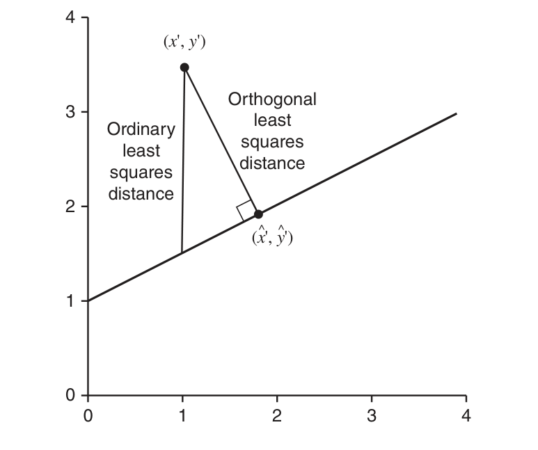
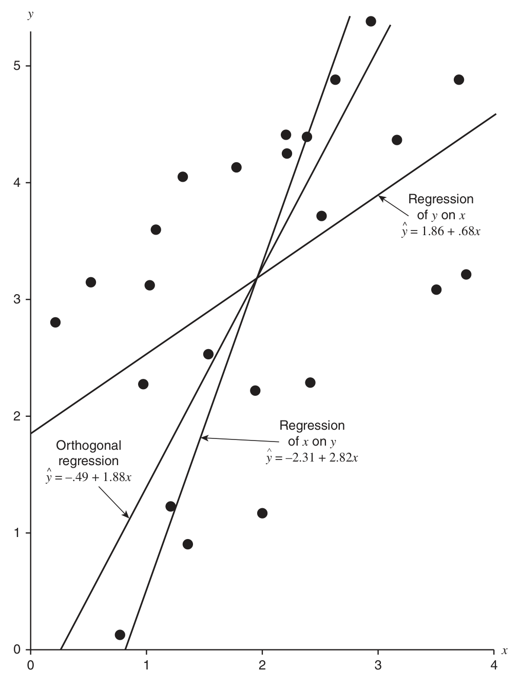
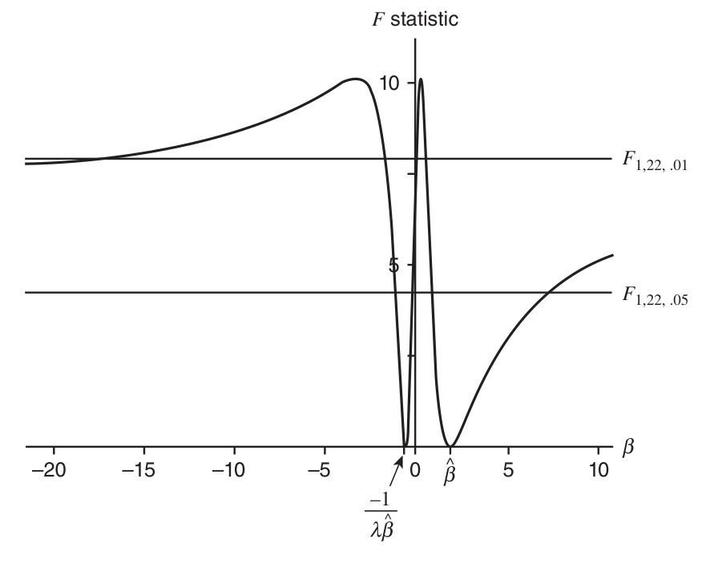
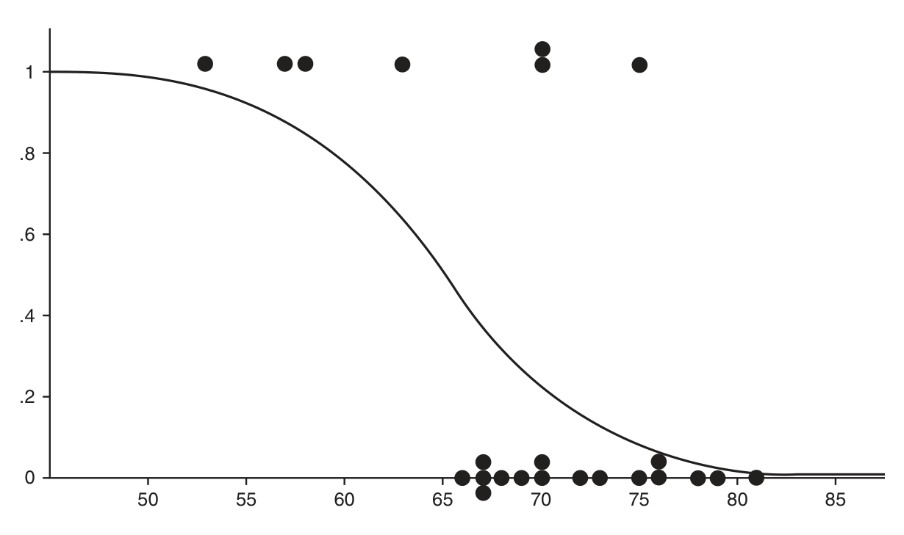
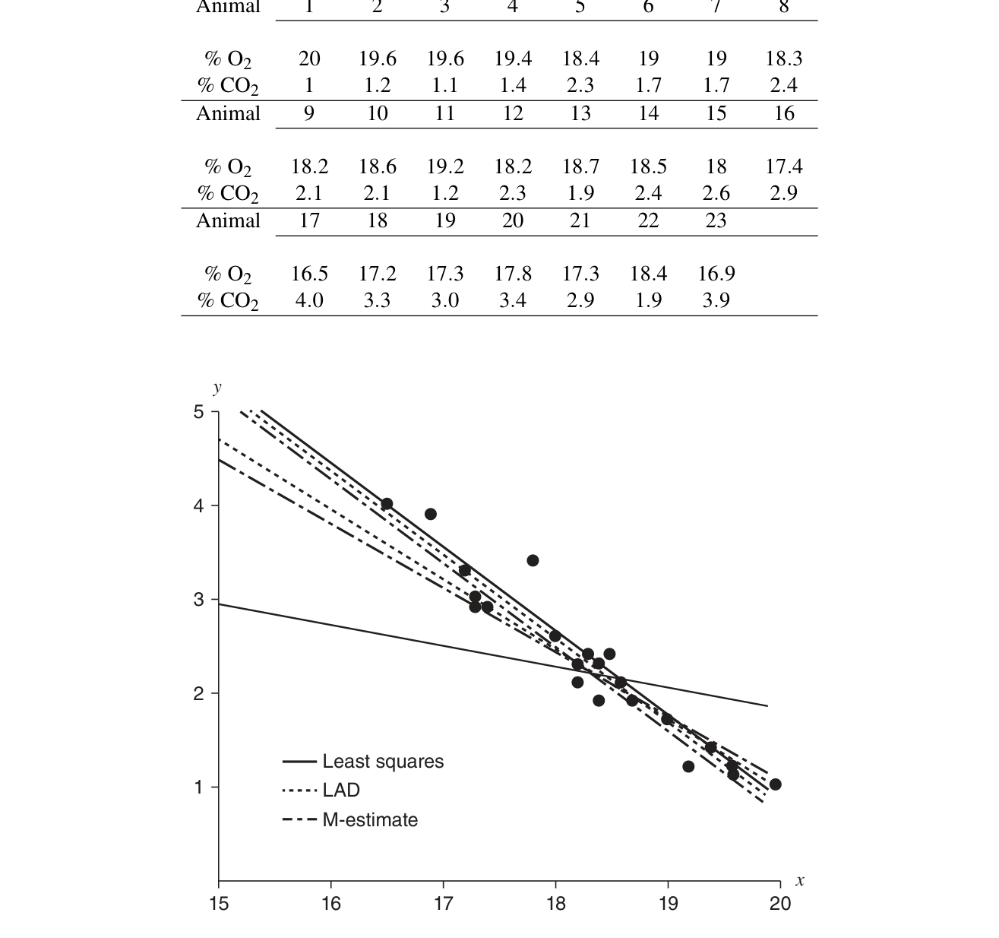

# 第 12 章　回归模型（Regression Models）

> *“So startling would his results appear to the uninitiated that until they learned the processes by which he had arrived at them they might well consider him as a necromancer.”*
>
> 对不谙此道的人来说，他的结论会显得如此惊人，以至于在他们了解他得出结论的过程之前，多半会把他当作一个巫师。
>
> ——华生医生论歇洛克·福尔摩斯（《血字的研究》）

## 12.1 引言（Introduction）

第 11 章关心的是可以称为“经典线性模型”的内容。ANOVA 与简单线性回归都基于带正态误差的底层线性模型。本章考察这一模型的若干已被证明在实际问题中有用的推广。

12.2 节把线性模型推广到预测变量带误差的模型，称为带变量误差的回归（regression with errors in variables, EIV）。在该模型中预测变量 $X$ 现在变得像响应变量 $Y$ 一样是随机变量。该模型中的估计会遇到许多未曾预料的困难，可能与简单线性回归模型大相径庭。

12.3 节进一步推广线性模型，考察 logistic 回归。这里响应变量是离散的，是一个 Bernoulli 变量。Bernoulli 均值是有界函数，而有界函数上的线性模型会出问题（尤其在边界处）。因此我们把均值变换成一个无界参数（用 logit 变换），并把变换后的参数建模为预测变量的线性函数。当把线性模型放在响应均值的函数上时，就成了广义线性模型（generalized linear model）。

最后，在 12.4 节我们在线性回归的背景下考察稳健性。与本章其他小节改变模型不同，现在我们改变拟合准则。其展开与 10.2.2 节（考察稳健点估计）平行：即把最小二乘准则换成基于 $\rho$ 函数的准则，得到的估计对底层观测不那么敏感（但保留一定效率）。

## 12.2 带变量误差的回归（Regression with Errors in Variables）

带变量误差的回归（EIV），也称测量误差模型（measurement error model），与 11.3 节的简单线性回归有根本的不同，最好把它当作完全不同的主题来对待。出于传统的理由，它被作为通常回归模型的推广来介绍。但这个模型出现的问题非常不同。

本节的模型是简单线性回归的推广，我们将处理形如

$$
Y_i = \alpha + \beta x_i + \varepsilon_i \tag{12.2.1}
$$

的模型，但现在不再假设诸 $x$ 是已知的。相反，我们只能测量一个均值为 $x_i$ 的随机变量。（按我们的记号约定，应说测量随机变量 $X_i$，其均值不是 $x_i$ 而是 $\xi_i$。）

本节的意图是例示 EIV 模型的不同处理途径，展示一些标准解法以及（有时）出人意料的困难。要更透彻地了解该问题，可参考综述 Gleser (1991)、专著 Fuller (1987) 与 Carroll, Ruppert, and Stefanski (1995)，以及 Brown and Fuller (1991) 主编的文集。Kendall and Stuart (1979, 第 29 章) 也相当详细地处理了这一主题。

在一般 EIV 模型中，我们假设观测数对 $(x_i, y_i)$，抽自均值满足线性关系

$$
\mathrm{E} Y_i = \alpha + \beta\, (\mathrm{E} X_i) \tag{12.2.2}
$$

的随机变量 $(X_i, Y_i)$。若定义

$$
\mathrm{E} Y_i = \eta_i
\qquad\text{与}\qquad
\mathrm{E} X_i = \xi_i,
$$

则关系 (12.2.2) 变为

$$
\eta_i = \alpha + \beta \xi_i, \tag{12.2.3}
$$

即随机变量均值之间的线性关系。

变量 $\xi_i$ 与 $\eta_i$ 有时称为潜变量（latent variables），指无法直接测量的量。潜变量不仅可能无法直接测量，甚至可能完全无法测量。例如，一个人的 IQ 是无法测量的；我们可以测量 IQ 测验的得分，但永远无法测量变量 IQ 本身。然而，IQ 与其他变量之间的关系却常被假设。

模型 (12.2.2) 实际上对 $X$ 与 $Y$ 不作区分。但若我们关心的是回归，就应当有理由选择 $Y$ 为响应、$X$ 为预测。带着“用 $Y$ 对 $X$ 回归”这一设定，带变量误差模型（或测量误差模型）定义如下：按

$$
\begin{aligned}
Y_i &= \alpha + \beta \xi_i + \varepsilon_i, \qquad &&\varepsilon_i \sim n(0, \sigma_\varepsilon^2),\\
X_i &= \xi_i + \delta_i, \qquad &&\delta_i \sim n(0, \sigma_\delta^2),
\end{aligned} \tag{12.2.4}
$$

观测数对 $(X_i, Y_i)$，$i = 1, \ldots, n$。

注意正态性假设虽然常见，但并非必需；可以使用其他分布。事实上，该模型遇到的某些问题正是由正态性假设引起的（例如见 Solari (1969)）。

> **例 12.2.1（估计大气压强）**
>
> 当 $x$ 变量与 $y$ 变量一起被观测（而非受控制）时，EIV 回归模型相当自然地出现。例如，十九世纪苏格兰物理学家 J. D. Forbes 试图利用水的沸点测量来估计海拔高度。为此他同时测量沸点与大气压强（由后者可以得到海拔）。由于十九世纪的气压计相当脆弱，用温度估计压强（更准确地说是 $\log(\text{压强})$）会很有用。在九个地点观测的数据如下；对该情形 EIV 模型是合理的。
>
> | 沸点（$^{\circ}$F） | $\log(\text{压强})$（log(Hg)） |
> |:---:|:---:|
> | 194.5 | 1.3179 |
> | 197.9 | 1.3502 |
> | 199.4 | 1.3646 |
> | 200.9 | 1.3782 |
> | 201.4 | 1.3806 |
> | 203.6 | 1.4004 |
> | 209.5 | 1.4547 |
> | 210.7 | 1.4630 |
> | 212.2 | 1.4780 |

模型 (12.2.4) 的若干特例已经见过。若 $\delta_i = 0$，模型就成为简单线性回归（因为没有测量误差，可以直接观测诸 $\xi_i$）。若 $\alpha = 0$，则有

$$
Y_i \sim n(\eta_i, \sigma_\varepsilon^2), \quad i = 1, \ldots, n,
\qquad
X_i \sim n(\xi_i, \sigma_\delta^2), \quad i = 1, \ldots, n,
$$

其中可能 $\sigma_\delta^2 \neq \sigma_\varepsilon^2$——这是 Behrens–Fisher 问题的一个版本。

### 12.2.1 函数关系与结构关系（Functional and Structural Relationships）

EIV 模型中可以指定两种不同类型的关系：一种指定函数线性关系（functional linear relationship），另一种描述结构线性关系（structural linear relationship）。不同的关系设定可以导致具有不同性质的估计量。正如 Moran (1971) 所说：“这不是什么令人满意的术语，但我们将沿用下去，因为这个区别至关重要…” 对这些术语的一些解释见杂记一节。这里只呈现这两个模型。

> **线性函数关系模型**
>
> 这就是 (12.2.4) 呈现的模型：有随机变量 $X_i$ 与 $Y_i$，$\mathrm{E} X_i = \xi_i$、$\mathrm{E} Y_i = \eta_i$，并假设函数关系
>
> $$
> \eta_i = \alpha + \beta \xi_i.
> $$
>
> 按
>
> $$
> \begin{aligned}
> Y_i &= \alpha + \beta \xi_i + \varepsilon_i, \qquad &&\varepsilon_i \sim n(0, \sigma_\varepsilon^2),\\
> X_i &= \xi_i + \delta_i, \qquad &&\delta_i \sim n(0, \sigma_\delta^2),
> \end{aligned} \tag{12.2.5}
> $$
>
> 观测数对 $(X_i, Y_i)$，$i = 1, \ldots, n$，其中诸 $\xi_i$ 是固定未知参数，诸 $\varepsilon_i$ 与 $\delta_i$ 独立。主要关心的参数是 $\alpha$ 与 $\beta$，对这些参数的推断利用 $((X_1, Y_1), \ldots, (X_n, Y_n))$ 在给定 $\xi_1, \ldots, \xi_n$ 条件下的联合分布。

> **线性结构关系模型**
>
> 该模型可以看作函数关系模型的推广，通过如下分层实现。与函数关系模型一样，有随机变量 $X_i$ 与 $Y_i$，$\mathrm{E} X_i = \xi_i$、$\mathrm{E} Y_i = \eta_i$，并假设函数关系 $\eta_i = \alpha + \beta \xi_i$。但现在进一步假设参数 $\xi_1, \ldots, \xi_n$ 本身是来自一个公共总体的随机样本。于是，在给定 $\xi_1, \ldots, \xi_n$ 的条件下，按
>
> $$
> \begin{aligned}
> Y_i &= \alpha + \beta \xi_i + \varepsilon_i, \qquad &&\varepsilon_i \sim n(0, \sigma_\varepsilon^2),\\
> X_i &= \xi_i + \delta_i, \qquad &&\delta_i \sim n(0, \sigma_\delta^2),
> \end{aligned} \tag{12.2.6}
> $$
>
> 观测数对 $(X_i, Y_i)$，$i = 1, \ldots, n$，并且
>
> $$
> \xi_i \sim \text{iid}\ n(\xi,\ \sigma_\xi^2).
> $$
>
> 与前面一样，诸 $\varepsilon_i$ 与 $\delta_i$ 独立，且它们也与诸 $\xi_i$ 独立。与函数关系模型一样，主要关心的参数是 $\alpha$ 与 $\beta$。但这里对这些参数的推断利用 $((X_1, Y_1), \ldots, (X_n, Y_n))$ **不**以 $\xi_1, \ldots, \xi_n$ 为条件的联合分布（即诸 $\xi_i$ 已按 (12.2.6) 的分布被积分掉）。

两个模型相当相似：一个模型中估计量的统计性质（例如相合性）常常延续到另一个模型。更精确地说，在函数模型中相合的估计量在结构模型中也相合（Nussbaum (1976) 或 Gleser (1983)）。这是有道理的：函数模型是结构模型的“条件版本”；在函数模型中相合的估计量必须对诸 $\xi_i$ 的一切取值都相合，因此在对面诸 $\xi_i$ 求平均的结构模型中必然也相合。反向的蕴含不成立。不过，从结构关系模型到函数关系模型有一个有用的蕴含：若一个参数在结构模型中不可识别，则它在函数模型中也不可识别（见定义 11.2.2）。

正如我们将看到的，两个模型有相似的问题，而且在某些情形有相似的似然解。在结构模型中做统计理论大概更容易，而函数模型对许多情形似乎是更合理的模型。于是底层的相似性就派上了用场。

如前所述，模型的一个主要差别在于关于 $\alpha$ 与 $\beta$——描述回归关系的参数——的推断。这一差别极其重要，怎么强调都不过分。在函数关系模型中，推断是在给定 $\xi_1, \ldots, \xi_n$ 的条件下、利用 $X$ 与 $Y$ 在给定 $\xi_1, \ldots, \xi_n$ 下的联合分布作出的。而在结构关系模型中，推断不以 $\xi_1, \ldots, \xi_n$ 为条件，利用把 $\xi_1, \ldots, \xi_n$ 积分掉后 $X$ 与 $Y$ 的边缘分布作出。

### 12.2.2 一个最小二乘解（A Least Squares Solution）

如同 11.3.1 节，我们暂时忘掉统计，试图找穿过观测点 $(x_i, y_i)$（$i = 1, \ldots, n$）的“最好”直线。此前在假设 $x$ 无误差地被测量时，考虑最小化垂直距离是有道理的：这种距离度量隐含假设 $x$ 值是正确的，从而导出普通最小二乘。但这里没有理由只考虑垂直距离，因为 $x$ 现在也带有误差。事实上，从统计的角度看，普通最小二乘在 EIV 模型中有一些问题（见杂记一节）。

把“$x$ 的测量也带误差”纳入考虑的一种方式是做正交最小二乘（orthogonal least squares），即寻找最小化正交（垂直于直线）距离而非垂直距离的直线（见图 12.2.1）。这种距离度量不像普通最小二乘那样偏向 $x$ 变量，而是公平地对待两个变量。它也称为全最小二乘（total least squares）方法。参照图 12.2.1，对特定数据点 $(x', y')$，当我们正交地度量距离时，直线 $y = a + bx$ 上最近的点为（习题 12.1）

$$
\hat{x}' = \frac{b y' + x' - ab}{1 + b^2},
\qquad
\hat{y}' = a + \frac{b}{1 + b^2} (b y' + x' - ab). \tag{12.2.7}
$$

*图 12.2.1　 正交最小二乘最小化的距离（原书 Figure 12.2.1）*

现在设有数据 $(x_i, y_i)$，$i = 1, \ldots, n$。观测点 $(x_i, y_i)$ 与直线 $y = a + bx$ 上最近点的平方距离为 $(x_i - \hat{x}_i)^2 + (y_i - \hat{y}_i)^2$，其中 $\hat{x}_i$ 与 $\hat{y}_i$ 由 (12.2.7) 定义。全最小二乘问题是在所有 $a$ 与 $b$ 上最小化

$$
\sum_{i=1}^{n} \Bigl[ (x_i - \hat{x}_i)^2 + (y_i - \hat{y}_i)^2 \Bigr].
$$

容易建立

$$
\begin{aligned}
\sum_{i=1}^{n} \Bigl[ (x_i - \hat{x}_i)^2 + (y_i - \hat{y}_i)^2 \Bigr]
&= \sum_{i=1}^{n} \Biggl[ \frac{b^2}{(1 + b^2)^2} \bigl[ y_i - (a + b x_i) \bigr]^2 + \frac{1}{(1 + b^2)^2} \bigl[ y_i - (a + b x_i) \bigr]^2 \Biggr]\\
&= \frac{1}{1 + b^2} \sum_{i=1}^{n} \bigl( y_i - (a + b x_i) \bigr)^2,
\end{aligned} \tag{12.2.8}
$$

对固定的 $b$，和式前面的因子是常数。因此和式中 $a$ 的最小化选择是 $a = \bar{y} - b\bar{x}$，与第 11 章式 (11.3.9) 相同。代回 (12.2.8)，全最小二乘解就是在所有 $b$ 上最小化

$$
\frac{1}{1 + b^2} \sum_{i=1}^{n} \bigl( (y_i - \bar{y}) - b(x_i - \bar{x}) \bigr)^2 \tag{12.2.9}
$$

的那一个。

如同第 11 章式 (11.3.6)，定义平方和与交叉乘积和：

$$
S_{xx} = \sum_{i=1}^{n} (x_i - \bar{x})^2,
\qquad
S_{yy} = \sum_{i=1}^{n} (y_i - \bar{y})^2,
\qquad
S_{xy} = \sum_{i=1}^{n} (x_i - \bar{x})(y_i - \bar{y}). \tag{12.2.10}
$$

展开平方并求和可见 (12.2.9) 变为

$$
\frac{1}{1 + b^2} \Bigl[ S_{yy} - 2 b S_{xy} + b^2 S_{xx} \Bigr].
$$

标准的微积分方法给出最小值（习题 12.2），求得正交最小二乘直线 $y = a + bx$，其中

$$
a = \bar{y} - b\bar{x}, \qquad
b = \frac{-(S_{xx} - S_{yy}) + \sqrt{(S_{xx} - S_{yy})^2 + 4 S_{xy}^2}}{2 S_{xy}}. \tag{12.2.11}
$$

正如所料，这条直线不同于最小二乘直线。事实上我们将看到，这条直线总位于“$y$ 对 $x$ 的普通回归”与“$x$ 对 $y$ 的普通回归”之间。图 12.2.2 例示了这一点：用表 11.3.1 的数据算出的正交最小二乘直线是 $\hat{y} = -0.49 + 1.88 x$。

*图 12.2.2　 表 11.3.1 数据的三条回归直线（原书 Figure 12.2.2）*

在简单线性回归中我们看到：正态性下 $\alpha$ 与 $\beta$ 的普通最小二乘解与 MLE 相同。而在这里，正交最小二乘解只在特殊情形——当我们对参数作某些假设时——才是 MLE。

似然估计将要遇到的困难再次例示了数学解与统计解的差别。我们相当轻松地得到了直线拟合问题的数学最小二乘解；似然解则不会如此顺利。

### 12.2.3 极大似然估计（Maximum Likelihood Estimation）

我们先考虑函数线性关系模型的极大似然解；结构关系模型的情形类似，某些方面还更容易。利用正态性假设，函数关系模型可以表示为

$$
Y_i \sim n(\alpha + \beta \xi_i,\ \sigma_\varepsilon^2)
\quad\text{与}\quad
X_i \sim n(\xi_i,\ \sigma_\delta^2), \qquad i = 1, \ldots, n,
$$

其中诸 $X_i$ 与 $Y_i$ 独立。给定观测 $(\textbf{x}, \textbf{y}) = ((x_1, y_1), \ldots, (x_n, y_n))$，似然函数为

$$
L\bigl( \alpha, \beta, \xi_1, \ldots, \xi_n, \sigma_\delta^2, \sigma_\varepsilon^2 \mid (\textbf{x}, \textbf{y}) \bigr)
= \frac{1}{(2\pi)^n (\sigma_\delta^2 \sigma_\varepsilon^2)^{n/2}}
\exp\Biggl( -\sum_{i=1}^{n} \frac{(x_i - \xi_i)^2}{2 \sigma_\delta^2} \Biggr)
\exp\Biggl( -\sum_{i=1}^{n} \frac{(y_i - (\alpha + \beta \xi_i))^2}{2 \sigma_\varepsilon^2} \Biggr). \tag{12.2.12}
$$

这个似然函数的问题在于它没有有限的最大值。为看清这一点，取参数配置 $\xi_i = x_i$，然后令 $\sigma_\delta^2 \to 0$：函数值趋于无穷，表明不存在极大似然解。事实上 Solari (1969) 证明：若把定义 $L$ 一阶导数的方程置零并求解，结果是鞍点而不是最大值。注意只要我们对参数有完全的控制，总能把似然函数推向无穷：特别地，总可以在保持指数项有界的同时把某个方差取为零。

我们将作一个常见假设——它不仅合理，而且缓解了许多问题——$\sigma_\delta^2 = \lambda \sigma_\varepsilon^2$，其中 $\lambda > 0$ 固定且已知。（关于方差的其他假设的讨论见 Kendall and Stuart 1979, 第 29 章。）这一假设是限制最少的一种：它只要求知道方差的比，而非各自的值。而且所得模型表现相对良好。

在该假设下，似然函数可以写成

$$
L\bigl( \alpha, \beta, \xi_1, \ldots, \xi_n, \sigma_\delta^2 \mid (\textbf{x}, \textbf{y}) \bigr)
= \frac{\lambda^{n/2}}{(2\pi)^n (\sigma_\delta^2)^{n}}
\exp\Biggl( -\sum_{i=1}^{n} \frac{(x_i - \xi_i)^2 + \lambda \bigl( y_i - (\alpha + \beta \xi_i) \bigr)^2}{2 \sigma_\delta^2} \Biggr), \tag{12.2.13}
$$

现在可以对它最大化了。我们将分阶段进行最大化，确保每一步得到最大值后再进入下一步。通过审视函数 (12.2.13)，可以确定一个合理的最大化次序。

首先，对 $\alpha$、$\beta$、$\sigma_\delta^2$ 的每一组值，关于 $\xi_1, \ldots, \xi_n$ 最大化 $L$ 等价于最小化 $\sum_{i=1}^{n} \bigl[ (x_i - \xi_i)^2 + \lambda (y_i - (\alpha + \beta \xi_i))^2 \bigr]$（细节见习题 12.3）。对每个 $i$，这是 $\xi_i$ 的二次函数，最小值在

$$
\xi_i^{*} = \frac{x_i + \lambda \beta (y_i - \alpha)}{1 + \lambda \beta^2}
$$

处取得。代回得

$$
\sum_{i=1}^{n} \Bigl[ (x_i - \xi_i^{*})^2 + \lambda \bigl( y_i - (\alpha + \beta \xi_i^{*}) \bigr)^2 \Bigr]
= \frac{\lambda}{1 + \lambda \beta^2} \sum_{i=1}^{n} \bigl( y_i - (\alpha + \beta x_i) \bigr)^2.
$$

似然函数现在成为

$$
\max_{\xi_1, \ldots, \xi_n} L\bigl( \alpha, \beta, \xi_1, \ldots, \xi_n, \sigma_\delta^2 \mid (\textbf{x}, \textbf{y}) \bigr)
= \frac{\lambda^{n/2}}{(2\pi)^n (\sigma_\delta^2)^{n}}
\exp\Biggl( -\frac{1}{2\sigma_\delta^2}\, \frac{\lambda}{1 + \lambda \beta^2} \sum_{i=1}^{n} \bigl( y_i - (\alpha + \beta x_i) \bigr)^2 \Biggr). \tag{12.2.14}
$$

现在可以关于 $\alpha$ 与 $\beta$ 最大化，但稍做一点工作就会发现：我们其实已经在正交最小二乘解中做过了！是的，EIV 模型中正交最小二乘与极大似然之间确有某种对应，我们即将利用它。定义

$$
\alpha^{*} = \sqrt{\lambda}\, \alpha, \qquad
\beta^{*} = \sqrt{\lambda}\, \beta, \qquad
y_i^{*} = \sqrt{\lambda}\, y_i, \qquad i = 1, \ldots, n. \tag{12.2.15}
$$

(12.2.14) 的指数变为

$$
\frac{\lambda}{1 + \lambda \beta^2} \sum_{i=1}^{n} \bigl( y_i - (\alpha + \beta x_i) \bigr)^2
= \frac{1}{1 + \beta^{*2}} \sum_{i=1}^{n} \bigl( y_i^{*} - (\alpha^{*} + \beta^{*} x_i) \bigr)^2,
$$

与正交最小二乘问题中的表达式完全相同。由 (12.2.11) 我们知道 $\alpha^{*}$ 与 $\beta^{*}$ 的最小化值，再用 (12.2.15) 得到斜率与截距的 MLE：

$$
\hat{\alpha} = \bar{y} - \hat{\beta}\bar{x}
\qquad\text{与}\qquad
\hat{\beta} = \frac{-(S_{xx} - \lambda S_{yy}) + \sqrt{(S_{xx} - \lambda S_{yy})^2 + 4 \lambda S_{xy}^2}}{2 \lambda S_{xy}}. \tag{12.2.16}
$$

从公式清楚可见：当 $\lambda = 1$ 时 MLE 与正交最小二乘解一致。这是有道理的：正交最小二乘解把 $x$ 与 $y$ 当作有相同量级的误差，这翻译成方差比 1。把这一论证再推进一步，当假设诸 $x$ 固定时，可以把该解与普通最小二乘或极大似然联系起来：若诸 $x$ 固定，其方差为零，从而 $\lambda = 0$；一般 $\lambda$ 的极大似然解在此情形确实退化为普通最小二乘。这一关系及其他内容在习题 12.4 中探讨。

把 (12.2.16) 与 (12.2.14) 放在一起，似然函数几乎被完全最大化：

$$
\max_{\alpha, \beta, \xi_1, \ldots, \xi_n} L\bigl( \alpha, \beta, \xi_1, \ldots, \xi_n, \sigma_\delta^2 \mid (\textbf{x}, \textbf{y}) \bigr)
= \frac{\lambda^{n/2}}{(2\pi)^n (\sigma_\delta^2)^{n}}
\exp\Biggl( -\frac{1}{2\sigma_\delta^2}\, \frac{\lambda}{1 + \lambda \hat{\beta}^2} \sum_{i=1}^{n} \bigl( y_i - (\hat{\alpha} + \hat{\beta} x_i) \bigr)^2 \Biggr). \tag{12.2.17}
$$

现在关于 $\sigma_\delta^2$ 最大化 $L$ 与普通正态抽样中求 $\sigma^2$ 的 MLE（例 7.2.11）非常相似，主要差别是 $\sigma_\delta^2$ 的幂次是 $n$ 而非 $n/2$。细节留作习题 12.5。所得 $\sigma_\delta^2$ 的 MLE 为

$$
\hat{\sigma}_\delta^2 = \frac{1}{2n}\, \frac{\lambda}{1 + \lambda \hat{\beta}^2} \sum_{i=1}^{n} \bigl( y_i - (\hat{\alpha} + \hat{\beta} x_i) \bigr)^2. \tag{12.2.18}
$$

由 MLE 的性质，$\sigma_\varepsilon^2$ 的 MLE 为 $\hat{\sigma}_\varepsilon^2 = \hat{\sigma}_\delta^2 / \lambda$，且 $\hat{\xi}_i = \hat{\alpha} + \hat{\beta} x_i$。

**原书注：**原书写作“$\hat{\xi}_i = \hat{\alpha} + \hat{\beta} x_i$”。按模型，$\hat{\alpha} + \hat{\beta} x_i$ 是 $\eta_i$（均值）的拟合值，用于预测的正是它；而 $\xi_i$ 的 MLE 应为把 $\hat{\alpha}, \hat{\beta}$ 代入的 $\xi_i^{*} = \frac{x_i + \lambda \hat{\beta} (y_i - \hat{\alpha})}{1 + \lambda \hat{\beta}^2}$。两种量各有用途（拟合值用于预测，$\hat{\xi}_i$ 用于检查拟合的充分性，见 Fuller 1987），读者阅读时请注意原文符号所指。

尽管 $\hat{\xi}_i$ 通常不是兴趣所在，但若想做预测它们有时有用；$\hat{\xi}_i$ 对检查拟合的充分性也有用（见 Fuller (1987)）。

有趣的是：虽然 $\hat{\alpha}$ 与 $\hat{\beta}$ 是相合估计量，$\hat{\sigma}_\delta^2$ 却不是。更精确地，当 $n \to \infty$ 时

$$
\hat{\alpha} \to \alpha \ \text{（依概率）},
\qquad
\hat{\beta} \to \beta \ \text{（依概率）},
$$

但

$$
\hat{\sigma}_\delta^2 \to \frac{1}{2} \sigma_\delta^2 \ \text{（依概率）}.
$$

关于 EIV 函数关系模型相合性的一般结果已由 Gleser (1981) 得到。

现在转向线性结构关系模型。回顾这里假设按

$$
Y_i \sim n(\alpha + \beta \xi_i,\ \sigma_\varepsilon^2), \qquad
X_i \sim n(\xi_i,\ \sigma_\delta^2), \qquad
\xi_i \sim n(\xi,\ \sigma_\xi^2)
$$

观测数对 $(X_i, Y_i)$，$i = 1, \ldots, n$，诸 $\xi_i$ 独立，且给定诸 $\xi_i$ 后诸 $X_i$ 与 $Y_i$ 独立。如前所述，关于 $\alpha$ 与 $\beta$ 的推断将基于 $X_i$ 与 $Y_i$ 的边缘分布，即把 $\xi_i$ 积分掉得到的分布。把 $\xi_i$ 积分掉，得 $(X_i, Y_i)$ 的边缘分布（习题 12.6）：

$$
(X_i, Y_i) \sim \text{bivariate normal}\bigl( \xi,\ \alpha + \beta \xi,\ \sigma_\delta^2 + \sigma_\xi^2,\ \sigma_\varepsilon^2 + \beta^2 \sigma_\xi^2,\ \beta \sigma_\xi^2 \bigr). \tag{12.2.19}
$$

注意其相关结构与 RCB ANOVA（杂记 11.5.3 节）的相似性。在那里，条件于区组时观测不相关，但无条件时存在相关（组内相关）。这里，以诸 $\xi_i$ 为条件的函数关系模型有不相关的观测，而不以诸 $\xi_i$ 为条件作推断的结构关系模型有相关的观测。诸 $\xi_i$ 扮演的角色类似区组，这里出现的相关类似组内相关。（事实上当 $\beta = 1$ 且 $\sigma_\delta^2 = \sigma_\varepsilon^2$ 时它与组内相关完全相同。）

为在该情形进行似然估计，给定观测 $(\textbf{x}, \textbf{y}) = ((x_1, y_1), \ldots, (x_n, y_n))$，似然函数是二元正态的，如习题 7.18 所遇。在那里我们看到：二元正态的似然估计量可以通过令样本量等于总体量求得。因此为求 $\alpha$、$\beta$、$\xi$、$\sigma_\varepsilon^2$、$\sigma_\delta^2$、$\sigma_\xi^2$ 的 MLE，解

$$
\begin{aligned}
\bar{y} &= \hat{\alpha} + \hat{\beta} \hat{\xi},\\
\bar{x} &= \hat{\xi},\\
\tfrac{1}{n} S_{yy} &= \hat{\sigma}_\varepsilon^2 + \hat{\beta}^2 \hat{\sigma}_\xi^2,\\
\tfrac{1}{n} S_{xx} &= \hat{\sigma}_\delta^2 + \hat{\sigma}_\xi^2,\\
\tfrac{1}{n} S_{xy} &= \hat{\beta} \hat{\sigma}_\xi^2.
\end{aligned} \tag{12.2.20}
$$

注意我们有五个方程，但有六个未知数，因此方程组不确定：它没有唯一解，不存在使似然最大化的唯一参数向量 $(\alpha, \beta, \xi, \sigma_\varepsilon^2, \sigma_\delta^2, \sigma_\xi^2)$。

继续之前要认识到：这里 $X_i$ 与 $Y_i$ 的方差不同于函数关系模型中的方差。那里我们以 $\xi_1, \ldots, \xi_n$ 为条件工作，这里我们关于诸 $\xi_i$ 边际地工作。例如函数关系模型中写 $\mathrm{Var} X_i = \sigma_\delta^2$（理解为以 $\xi_1, \ldots, \xi_n$ 为条件的方差），而结构模型中写 $\mathrm{Var} X_i = \sigma_\delta^2 + \sigma_\xi^2$（理解为不以 $\xi_1, \ldots, \xi_n$ 为条件的方差）。这不应成为混淆的来源。

方程组 (12.2.20) 的解蕴含对 $\hat{\beta}$ 的一个限制——在函数关系情形（习题 12.4）中我们已经遇到过。由上面涉及方差与协方差的方程，容易推出

$$
\hat{\sigma}_\delta^2 \geq 0 \quad \text{仅当}\quad S_{xx} \geq \frac{1}{\hat{\beta}} S_{xy},
\qquad
\hat{\sigma}_\varepsilon^2 \geq 0 \quad \text{仅当}\quad S_{yy} \geq \hat{\beta} S_{xy},
$$

两者合起来蕴含

$$
\frac{|S_{xy}|}{S_{xx}} \leq |\hat{\beta}| \leq \frac{S_{yy}}{|S_{xy}|}.
$$

（$\hat{\beta}$ 的界在习题 12.9 中建立。）

现在处理结构关系情形的可识别性问题——既然 (12.2.19) 中参数多于指定分布所需，这个问题可以预期。要使线性结构关系模型可识别，必须作一个把参数个数缩减到五个的假设。幸运的是，为函数关系所作的方差假设在这里恰好解决了可识别性问题。于是设 $\sigma_\delta^2 = \lambda \sigma_\varepsilon^2$，$\lambda$ 已知。这把未知参数个数缩减到五个，使模型可识别。（见习题 12.8。）更强的假设（如设 $\sigma_\delta^2$ 已知）可能导致方差的 MLE 取值为零。Kendall and Stuart (1979, 第 29 章) 对此有完整讨论。

一旦假设 $\sigma_\delta^2 = \lambda \sigma_\varepsilon^2$，该模型中 $\hat{\alpha}$ 与 $\hat{\beta}$ 的极大似然估计与函数关系模型相同，由 (12.2.16) 给出。但方差估计不同，为

$$
\hat{\sigma}_\delta^2 = \frac{1}{n} \Bigl( S_{xx} - \frac{S_{xy}}{\hat{\beta}} \Bigr), \qquad
\hat{\sigma}_\varepsilon^2 = \frac{\hat{\sigma}_\delta^2}{\lambda} = \frac{1}{n} \bigl( S_{yy} - \hat{\beta} S_{xy} \bigr), \qquad
\hat{\sigma}_\xi^2 = \frac{1}{n}\, \frac{S_{xy}}{\hat{\beta}}. \tag{12.2.21}
$$

（习题 12.10 证明这一点，并探讨这里与函数模型中方差估计的关系。）注意，与函数关系模型中发生的情况相反，这些估计量在线性结构关系模型中（当 $\sigma_\delta^2 = \lambda \sigma_\varepsilon^2$ 时）都是相合的。

### 12.2.4 置信集合（Confidence Sets）

正如所料，在 EIV 模型中构造置信集合是一项困难的任务。对该主题的完整处理需要我们尚未发展的工具。这里我们只集中讨论斜率 $\beta$ 的置信集合。

第一招可以用 10.4.1 节的近似似然方法构造近似置信区间。实践中这大概是最常做的，也并非全无道理。然而这些近似区间无法维持名义的 $1 - \alpha$ 置信水平。事实上 Gleser and Hwang (1987) 的结果给出一个相当令人不安的结论：长度总为有限的任何斜率区间估计量，其置信系数等于零！

为明确起见，本节其余部分假设我们在 EIV 模型的结构关系情形。所给出的置信集合结果在结构与函数两种情形都有效，公式保持不变。我们继续假设 $\sigma_\delta^2 = \lambda \sigma_\varepsilon^2$，$\lambda$ 已知。

Gleser and Hwang (1987) 识别出参数

$$
\tau^2 = \frac{\sigma_\xi^2}{\sigma_\delta^2}
$$

为决定数据中可用于确定斜率 $\beta$ 的潜在信息量的量。他们证明：当 $\tau^2 \to 0$ 时，任何有限长度 $\beta$ 置信区间的覆盖概率必须趋于零。这为何合理？注意 $\tau^2 = 0$ 意味着诸 $\xi_i$ 无变异，此时不可能拟合出唯一的直线。

利用估计量

$$
\hat{\sigma}_\beta^2 = \frac{(1 + \lambda \hat{\beta}^2)^2 \bigl( S_{xx} S_{yy} - S_{xy}^2 \bigr)}{\bigl( S_{xx} - \lambda S_{yy} \bigr)^2 + 4 \lambda S_{xy}^2}
$$

是 $\hat{\beta}$ 真实方差 $\sigma_\beta^2$ 的相合估计量这一事实，可以构造 $\beta$ 的近似置信区间。于是，用 CLT 结合 Slutsky 定理（5.5 节）可以证明区间

$$
\hat{\beta} - \frac{z_{\alpha/2}\, \hat{\sigma}_\beta}{\sqrt{n}} \;\leq\; \beta \;\leq\; \hat{\beta} + \frac{z_{\alpha/2}\, \hat{\sigma}_\beta}{\sqrt{n}}
$$

是 $\beta$ 的近似 $1 - \alpha$ 置信区间。但由于它长度有限，无法对所有参数值维持 $1 - \alpha$ 覆盖。

Gleser (1987) 考虑了该区间的一个修改，并报告其覆盖概率的下确界作为 $\tau^2$ 的函数。Gleser 的修改 $C_G(\hat{\beta})$ 为

$$
\hat{\beta} - \frac{t_{n-2, \alpha/2}\, \hat{\sigma}_\beta}{\sqrt{n - 2}} \;\leq\; \beta \;\leq\; \hat{\beta} + \frac{t_{n-2, \alpha/2}\, \hat{\sigma}_\beta}{\sqrt{n - 2}}. \tag{12.2.22}
$$

再用 CLT 结合 Slutsky 定理可以证明这是 $\beta$ 的近似 $1 - \alpha$ 置信区间。由于该区间同样长度有限，它也无法对所有参数值维持 $1 - \alpha$ 覆盖。Gleser 做了一些有限样本数值计算，给出覆盖概率下确界作为 $\tau^2$ 函数的界。对合理的 $n$ 值（$\geq 10$），若 $\tau^2 \geq 0.25$，名义 90% 区间的覆盖概率至少为 80%。$\tau^2$ 或 $n$ 增大时，这一表现会改善。

与 (12.2.22) 的 $C_G(\hat{\beta})$（长度有限但无覆盖保证）相对照，现在看一个精确置信集合——如其所必，它有无限长度。该集合称为 Creasy–Williams 置信集合，归功于 Creasy (1956) 与 Williams (1959)，基于如下事实（见习题 12.11）：若 $\sigma_\delta^2 = \lambda \sigma_\varepsilon^2$，则

$$
\mathrm{Cov}\bigl( \beta \lambda Y_i + X_i,\ Y_i - \beta X_i \bigr) = 0.
$$

定义 $r_{\lambda}(\beta)$ 为 $\beta \lambda Y_i + X_i$ 与 $Y_i - \beta X_i$ 之间的样本相关系数，即

$$
r_{\lambda}(\beta)
= \frac{\sum_{i=1}^{n} \bigl[ (\beta \lambda y_i + x_i) - (\beta \lambda \bar{y} + \bar{x}) \bigr] \bigl[ (y_i - \beta x_i) - (\bar{y} - \beta \bar{x}) \bigr]}{\sqrt{\sum_{i=1}^{n} \bigl[ (\beta \lambda y_i + x_i) - (\beta \lambda \bar{y} + \bar{x}) \bigr]^2}\, \sqrt{\sum_{i=1}^{n} \bigl[ (y_i - \beta x_i) - (\bar{y} - \beta \bar{x}) \bigr]^2}}
= \frac{\beta \lambda S_{yy} + (1 - \beta^2 \lambda) S_{xy} - \beta S_{xx}}{\sqrt{\bigl( \beta^2 \lambda^2 S_{yy} + 2 \beta \lambda S_{xy} + S_{xx} \bigr) \bigl( S_{yy} - 2 \beta S_{xy} + \beta^2 S_{xx} \bigr)}}. \tag{12.2.23}
$$

由于 $\beta \lambda Y_i + X_i$ 与 $Y_i - \beta X_i$ 是相关为零的二元正态，故（习题 11.33）对 $\beta$ 的任何值有

$$
\frac{\sqrt{n - 2}\, r_{\lambda}(\beta)}{\sqrt{1 - r_{\lambda}^2(\beta)}} \sim t_{n-2}.
$$

于是我们识别出一个枢轴量，结论是集合

$$
\Biggl\{ \beta : \frac{(n - 2) r_{\lambda}^2(\beta)}{1 - r_{\lambda}^2(\beta)} \leq F_{1, n-2, \alpha} \Biggr\} \tag{12.2.24}
$$

是 $\beta$ 的 $1 - \alpha$ 置信集合（见习题 12.11）。

虽然该置信集合是 $1 - \alpha$ 的，但它有与 Fieller 区间类似的缺陷。描述集合 (12.2.24) 的函数有两个最小值点，在那些点函数值为零。该置信集合可以由两个有限不相交区间构成、由一个有限区间与两个无限不相交区间构成、或为整个实直线。例如，表 11.3.1 的数据在 $\lambda = 1$ 时的 $F$ 统计量函数的图像见图 12.2.3。置信集合是函数值小于等于 $F_{1,22,\alpha}$ 的所有 $\beta$。取 $\alpha = 0.05$、$F_{1,22,.05} = 4.30$，置信集合为 $[-1.13, -0.14] \cup [0.89, 7.38]$。取 $\alpha = 0.01$、$F_{1,22,.01} = 7.95$，置信集合为 $(-\infty, -18.18] \cup [-1.68, 0.06] \cup [0.60, \infty)$。

图 12.2.3　 定义 Creasy–Williams 置信集合的 $F$ 统计量，$\lambda = 1$（原书 Figure 12.2.3）

此外，对每个 $\beta$ 值，$-r_{\lambda}(\beta) = r_{\lambda}(-1/(\lambda \beta))$（见习题 12.12），因此若 $\beta$ 在置信集合中，$-1/(\lambda \beta)$ 也在。使用该置信集合我们无法区分 $\beta$ 与 $-1/(\lambda \beta)$，而且该置信集合总同时包含正值与负值——从这个置信集合我们永远无法确定斜率的符号！

(12.2.24) 给出的置信集合并非 Creasy (1956) 讨论的那个，而是其修改。她实际感兴趣的是估计 $\phi$——$\beta$ 与 $x$ 轴的夹角，即 $\beta = \tan(\phi)$——那里的置信集合问题较少。在 EIV 模型中估计 $\phi$ 也许更自然（例如见 Anderson (1976)），但我们似乎更倾向于估计 $\alpha$ 与 $\beta$。

可以在普通线性回归情形做的大多数其他标准统计分析在 EIV 模型中都有对应物。例如可以检验关于 $\beta$ 的假设或估计 $\mathrm{E} Y_i$ 的值。更多内容见 Fuller (1987) 或 Kendall and Stuart (1979, 第 29 章)。

## 12.3 Logistic 回归（Logistic Regression）

11.3.3 节的条件正态模型是广义线性模型（generalized linear model, GLM）的一个例子。GLM 描述响应变量 $Y$ 的均值与自变量 $x$ 之间的关系，但这种关系可以比第 11 章式 (11.3.2) 的 $\mathrm{E} Y_i = \alpha + \beta x_i$ 更复杂。许多不同的模型都可以表示为 GLM。本节集中讨论一个特定的 GLM——logistic 回归模型。

### 12.3.1 模型（The Model）

GLM 由三个部分组成：随机成分（random component）、系统成分（systematic component）与连接函数（link function）。

- （1） 响应变量 $Y_1, \ldots, Y_n$ 是随机成分。假设它们是独立的随机变量，各服从一个指定指数族中的分布。诸 $Y_i$ 不同分布，但都来自同一家族：binomial、Poisson、normal 等。

- （2） 系统成分是模型本身：它是预测变量 $x_i$ 的、关于参数线性的函数，与 $Y_i$ 的均值相关联。因此系统成分例如可以是 $\alpha + \beta x_i$ 或 $\alpha + \beta / x_i$。这里只考虑 $\alpha + \beta x_i$。

- （3） 最后，连接函数 $g(\mu)$ 通过断言 $g(\mu_i) = \alpha + \beta x_i$（其中 $\mu_i = \mathrm{E} Y_i$）把两个成分联系起来。

11.3.3 节的条件正态回归模型是 GLM 的一例。该模型中诸响应 $Y_i$ 都服从正态分布；当然正态族是指数族，即随机成分。回归函数的形式 $\alpha + \beta x_i$ 即系统成分。最后假设 $\mu_i = \mathrm{E} Y_i = \alpha + \beta x_i$，这意味着连接函数是 $g(\mu) = \mu$；这个简单的连接函数称为恒等连接（identity link）。

另一个非常有用的 GLM 是 logistic 回归模型。该模型中响应 $Y_1, \ldots, Y_n$ 独立且 $Y_i \sim \mathrm{Bernoulli}(\pi_i)$（Bernoulli 族是指数族）。回顾 $\mathrm{E} Y_i = \pi_i = P(Y_i = 1)$。该模型假设 $\pi_i$ 通过

$$
\log\Bigl( \frac{\pi_i}{1 - \pi_i} \Bigr) = \alpha + \beta x_i \tag{12.3.1}
$$

与 $x_i$ 相关联。左端是 $Y_i$ 成功几率的对数。模型假设这个对数几率（或 logit）是预测变量 $x$ 的线性函数。Bernoulli pmf 可以写成指数族形式

$$
\pi^y (1 - \pi)^{1 - y} = (1 - \pi) \exp\Biggl( y \log\Bigl( \frac{\pi}{1 - \pi} \Bigr) \Biggr).
$$

项 $\log(\pi/(1 - \pi))$ 是该指数族的自然参数，而 (12.3.1) 中使用的连接函数 $g(\pi) = \log(\pi/(1 - \pi))$。当这样使用自然参数时，称为典型连接（canonical link）。

方程 (12.3.1) 可以重写为

$$
\pi_i = \frac{e^{\alpha + \beta x_i}}{1 + e^{\alpha + \beta x_i}},
$$

或更一般地，

$$
\pi(x) = \frac{e^{\alpha + \beta x}}{1 + e^{\alpha + \beta x}}. \tag{12.3.2}
$$

我们看到 $0 < \pi(x) < 1$——由于 $\pi(x)$ 是概率，这似乎是合适的。但如果对某些 $x$ 有可能 $\pi(x) = 0$ 或 1，这个模型就不合适。细察 $\pi(x)$，其导数可以写为

$$
\frac{d\, \pi(x)}{dx} = \beta\, \pi(x) \bigl( 1 - \pi(x) \bigr). \tag{12.3.3}
$$

由于项 $\pi(x)(1 - \pi(x))$ 恒正，$\pi(x)$ 的导数为正、零或负，视 $\beta$ 为正、零或负而定。若 $\beta > 0$，$\pi(x)$ 是 $x$ 的严格增函数；若 $\beta < 0$，严格减；若 $\beta = 0$，则对一切 $x$ 有 $\pi(x) = e^{\alpha}/(1 + e^{\alpha})$。与简单线性回归一样，若 $\beta = 0$，$\pi$ 与 $x$ 之间没有关系。此外，logistic 回归模型中 $\pi(-\alpha/\beta) = 1/2$；logistic 回归函数表现出这种对称性：对任何 $c$，$\pi\bigl( (-\alpha/\beta) + c \bigr) = 1 - \pi\bigl( (-\alpha/\beta) - c \bigr)$。

参数 $\alpha$ 与 $\beta$ 的含义与简单线性回归中类似。在 (12.3.1) 中令 $x = 0$ 可得：$\alpha$ 是 $x = 0$ 处成功的对数几率。在 $x$ 与 $x + 1$ 处取 (12.3.1) 的值，对任何 $x$ 有

$$
\log\Bigl( \frac{\pi(x + 1)}{1 - \pi(x + 1)} \Bigr) - \log\Bigl( \frac{\pi(x)}{1 - \pi(x)} \Bigr)
= \alpha + \beta(x + 1) - \alpha - \beta(x) = \beta.
$$

因此 $\beta$ 是 $x$ 增加一个单位时成功对数几率的改变量。在简单线性回归中 $\beta$ 是 $x$ 增加一个单位时 $Y$ 均值的改变量。对该等式两边取指数得

$$
e^{\beta} = \frac{\pi(x + 1)/(1 - \pi(x + 1))}{\pi(x)/(1 - \pi(x))}. \tag{12.3.4}
$$

右端是比较 $x + 1$ 处与 $x$ 处成功几率的几率比（odds ratio）。（回忆例 5.5.19 与 5.5.22 中我们考察过几率的估计。）在 logistic 回归模型中，该比值作为 $x$ 的函数是常数。最后，

$$
\frac{\pi(x + 1)}{1 - \pi(x + 1)} = e^{\beta}\, \frac{\pi(x)}{1 - \pi(x)}; \tag{12.3.5}
$$

即 $e^{\beta}$ 是 $x$ 增加一个单位时成功几率的乘性改变量。

方程 (12.3.2) 提示了把 Bernoulli 成功概率 $\pi(x)$ 建模为预测变量 $x$ 函数的其他方式。回顾 $F(w) = e^w/(1 + e^w)$ 是 logistic$(0, 1)$ 分布的 cdf。在 (12.3.2) 中我们假设了 $\pi(x) = F(\alpha + \beta x)$。可以通过使用其他连续 cdf 定义 $\pi(x)$ 的其他模型。若 $F(w)$ 是标准正态 cdf，该模型称为 probit 回归（见习题 12.17）；若使用 Gumbel cdf，连接函数称为 log-log 连接。

### 12.3.2 估计（Estimation）

在线性回归（使用 $Y_i = \alpha + \beta x_i + \varepsilon_i$ 这样的模型）中，最小二乘是计算 $\alpha$ 与 $\beta$ 估计的一种选择。这里不再如此。在 $Y_i \sim \mathrm{Bernoulli}(\pi_i)$ 的模型 (12.3.1) 中，$Y_i$ 与 $\alpha + \beta x_i$ 之间不再有直接联系（这正是需要连接函数的原因），因此最小二乘不再是选项。

最常用的估计方法是极大似然。在一般模型中 $Y_i \sim \mathrm{Bernoulli}(\pi_i)$，$\pi(x) = F(\alpha + \beta x)$。令 $F_i = F(\alpha + \beta x_i)$，则似然函数为

$$
L(\alpha, \beta \mid \textbf{y}) = \prod_{i=1}^{n} \pi(x_i)^{y_i} \bigl( 1 - \pi(x_i) \bigr)^{1 - y_i} = \prod_{i=1}^{n} F_i^{y_i} (1 - F_i)^{1 - y_i},
$$

对数似然为

$$
\log L(\alpha, \beta \mid \textbf{y}) = \sum_{i=1}^{n} \Biggl[ \log(1 - F_i) + y_i \log\Bigl( \frac{F_i}{1 - F_i} \Bigr) \Biggr].
$$

通过关于 $\alpha$ 与 $\beta$ 微分对数似然得到似然方程。设 $\frac{d F(w)}{dw} = f(w)$ 为 $F(w)$ 对应的 pdf，并记 $f_i = f(\alpha + \beta x_i)$。则

$$
\frac{\partial\, \log(1 - F_i)}{\partial \alpha} = -\frac{f_i}{1 - F_i} = -\frac{F_i f_i}{F_i (1 - F_i)},
$$

且

$$
\frac{\partial}{\partial \alpha} \log\Bigl( \frac{F_i}{1 - F_i} \Bigr) = \frac{f_i}{F_i (1 - F_i)}. \tag{12.3.6}
$$

于是

$$
\frac{\partial}{\partial \alpha} \log L(\alpha, \beta \mid \textbf{y}) = \sum_{i=1}^{n} (y_i - F_i)\, \frac{f_i}{F_i (1 - F_i)}, \tag{12.3.7}
$$

类似计算给出

$$
\frac{\partial}{\partial \beta} \log L(\alpha, \beta \mid \textbf{y}) = \sum_{i=1}^{n} (y_i - F_i)\, \frac{f_i}{F_i (1 - F_i)}\, x_i. \tag{12.3.8}
$$

对 logistic 回归（$F(w) = e^w/(1 + e^w)$），$f_i / [F_i (1 - F_i)] = 1$，(12.3.7) 与 (12.3.8) 稍简单。

令 (12.3.7) 与 (12.3.8) 为零并解出 $\alpha$ 与 $\beta$ 即得 MLE。这些方程关于 $\alpha$ 与 $\beta$ 是非线性的，必须数值求解（稍后讨论）。对 logistic 与 probit 回归，对数似然严格凹。因此若似然方程有解，解唯一且是 MLE。但对某些极端数据，似然方程无解：似然的最大值出现在参数趋于 $\pm \infty$ 的某个极限处；例子见习题 12.16。原因在于 logistic 模型假设 $0 < \pi(x) < 1$，而对某些数据集，logistic 似然的最大值出现在 $\pi(x) = 0$ 或 1 的极限处。若 logistic 模型为真，得到这类数据的概率收敛到零。

> **例 12.3.1（Challenger 数据）**
>
> 如今已臭名昭著的一个数据集是航天飞机 O 形圈失效数据，它已被与温度联系起来。表 12.3.1 给出起飞时的温度以及 O 形圈是否失效。
>
> 表 12.3.1　 飞行时温度（$^{\circ}$F）与 O 形圈失效（1 $=$ 失效，0 $=$ 成功）（原书 Table 12.3.1）
>
> | 航班号 | 14 | 9 | 23 | 10 | 1 | 5 | 13 | 15 | 4 | 3 | 8 | 17 |
> |:---|:---:|:---:|:---:|:---:|:---:|:---:|:---:|:---:|:---:|:---:|:---:|:---:|
> | 失效 | 1 | 1 | 1 | 1 | 0 | 0 | 0 | 0 | 0 | 0 | 0 | 0 |
> | 温度 | 53 | 57 | 58 | 63 | 66 | 67 | 67 | 68 | 69 | 70 | 70 | 70 |
> | 航班号 | 2 | 11 | 6 | 7 | 16 | 21 | 19 | 22 | 12 | 20 | 18 |  |
> | 失效 | 1 | 1 | 0 | 0 | 0 | 1 | 0 | 0 | 0 | 0 | 0 |  |
> | 温度 | 70 | 70 | 72 | 73 | 75 | 75 | 76 | 76 | 78 | 79 | 81 |  |
>
>
> 用 $F(\alpha + \beta x_i) = e^{\alpha + \beta x_i}/(1 + e^{\alpha + \beta x_i})$ 求解似然方程得 MLE $\hat{\alpha} = 15.81$ 与 $\hat{\beta} = -0.243$。图 12.3.1 显示了拟合曲线与数据。
>
> 挑战者号航天飞机在起飞时爆炸，机上七名宇航员遇难。爆炸是 O 形圈失效所致，据信由发射时异常寒冷的天气（$31^{\circ}$F）造成。$31^{\circ}$ 处 O 形圈失效概率的 MLE 是 $0.9997$。（完整的故事见 Dalal et al. 1989。）
>
> 
>
> *图 12.3.1　 表 12.3.1 的数据与拟合的 logistic 曲线（原书 Figure 12.3.1）*

迄今我们假设在 $x_i$ 的每个取值处只观测一次 Bernoulli 试验的结果。虽然常常如此，但有许多情形在 $x$ 的每个取值处有多次 Bernoulli 观测。现在在更一般的情形重访似然解。

设数据集中预测变量 $x$ 有 $J$ 个不同取值 $x_1, \ldots, x_J$。令 $n_j$ 表示在 $x_j$ 处 Bernoulli 观测的个数，$Y_j^{*}$ 表示这 $n_j$ 个观测中成功的个数。于是 $Y_j^{*} \sim \mathrm{binomial}(n_j, \pi(x_j))$。则似然为

$$
L(\alpha, \beta \mid \textbf{y}^{*}) = \prod_{j=1}^{J} \pi(x_j)^{y_j^{*}} \bigl( 1 - \pi(x_j) \bigr)^{n_j - y_j^{*}} = \prod_{j=1}^{J} F_j^{y_j^{*}} (1 - F_j)^{n_j - y_j^{*}},
$$

似然方程为

$$
0 = \sum_{j=1}^{J} \bigl( y_j^{*} - n_j F_j \bigr)\, \frac{f_j}{F_j (1 - F_j)},
\qquad
0 = \sum_{j=1}^{J} \bigl( y_j^{*} - n_j F_j \bigr)\, \frac{f_j}{F_j (1 - F_j)}\, x_j.
$$

我们已用极大似然估计了 logistic 回归的参数，接下来可以用 MLE 渐近理论得到近似方差。不过要以更一般的方式进行。10.1.3 节中我们见过如何用信息数近似 MLE 的方差；这里用同样的策略，但由于有两个参数，有一个由 $2 \times 2$ 矩阵给出的信息矩阵：

$$
I(\theta_1, \theta_2) =
\begin{pmatrix}
-\frac{\partial^2}{\partial \theta_1^2} \log L(\theta_1, \theta_2 \mid \textbf{y}) & -\frac{\partial^2}{\partial \theta_1 \partial \theta_2} \log L(\theta_1, \theta_2 \mid \textbf{y})\\[6pt]
-\frac{\partial^2}{\partial \theta_1 \partial \theta_2} \log L(\theta_1, \theta_2 \mid \textbf{y}) & -\frac{\partial^2}{\partial \theta_2^2} \log L(\theta_1, \theta_2 \mid \textbf{y})
\end{pmatrix}. \tag{12.3.9}
$$

对 logistic 回归，信息矩阵为

$$
I(\alpha, \beta) =
\begin{pmatrix}
\sum_{j=1}^{J} n_j F_j (1 - F_j) & \sum_{j=1}^{J} x_j n_j F_j (1 - F_j)\\[4pt]
\sum_{j=1}^{J} x_j n_j F_j (1 - F_j) & \sum_{j=1}^{J} x_j^2 n_j F_j (1 - F_j)
\end{pmatrix}, \tag{12.3.10}
$$

MLE $\hat{\alpha}$ 与 $\hat{\beta}$ 的方差通常用该矩阵近似。注意 $I(\alpha, \beta)$ 的元素不依赖 $Y_1^{*}, \ldots, Y_J^{*}$；因此本情形中观测信息与信息相同。

在 10.1.3 节我们用近似（第 10 章式 (10.1.7)），即 $\mathrm{Var}(h(\hat{\theta}) \mid \theta) \approx [h'(\hat{\theta})]^2 / I(\hat{\theta})$，其中 $I(\cdot)$ 是信息数。这里不能对信息矩阵做完全一样的事，而是需要取矩阵的逆，用逆矩阵的元素来近似方差。回顾 $2 \times 2$ 矩阵的逆为

$$
\begin{pmatrix} a & b \\ c & d \end{pmatrix}^{\! -1} = \frac{1}{ad - bc} \begin{pmatrix} d & -b \\ -c & a \end{pmatrix}.
$$

为得到近似方差，用 MLE 估计矩阵 (12.3.10) 中的参数，方差估计 $[\mathrm{se}(\hat{\alpha})]^2$ 与 $[\mathrm{se}(\hat{\beta})]^2$ 取 $I(\hat{\alpha}, \hat{\beta})$ 的逆的对角元素。

> **例 12.3.2（Challenger 数据续）**
>
> 由 Challenger 数据的估计得到的估计信息矩阵为
>
> $$
> I(\hat{\alpha}, \hat{\beta}) =
> \begin{pmatrix}
> \sum_{j=1}^{J} \hat{F}_j (1 - \hat{F}_j) & \sum_{j=1}^{J} x_j \hat{F}_j (1 - \hat{F}_j)\\[4pt]
> \sum_{j=1}^{J} x_j \hat{F}_j (1 - \hat{F}_j) & \sum_{j=1}^{J} x_j^2 \hat{F}_j (1 - \hat{F}_j)
> \end{pmatrix}
> =
> \begin{pmatrix}
> 3.15 & 214.75\\
> 214.75 & 14728.5
> \end{pmatrix},
> $$
>
> 其中 $\hat{F}_j = e^{\hat{\alpha} + \hat{\beta} x_j}/(1 + e^{\hat{\alpha} + \hat{\beta} x_j})$，其逆为
>
> $$
> I(\hat{\alpha}, \hat{\beta})^{-1} =
> \begin{pmatrix}
> 59.19 & -0.86\\
> -0.86 & 0.013
> \end{pmatrix}.
> $$
>
> 似然渐近告诉我们：例如对大样本，$\hat{\beta} \pm z_{\alpha/2}\, \mathrm{se}(\hat{\beta})$ 是 $\beta$ 的近似 $100(1 - \alpha)\%$ 置信区间。对 Challenger 数据有 95% 置信区间
>
> $$
> \beta \in -0.243 \pm 1.96 \times \sqrt{0.013}
> \;\Rightarrow\; -0.466 \leq \beta \leq -0.02,
> $$
>
> 支持 $\beta < 0$ 的结论。

该模型中最常检验的假设大概是 $H_0 : \beta = 0$，因为与简单线性回归一样，该假设陈述预测变量与响应变量之间没有关系。Wald 检验统计量 $Z = \hat{\beta} / \mathrm{se}(\hat{\beta})$ 在 $H_0$ 为真且样本量大时近似服从标准正态分布，因此若 $|Z| \geq z_{\alpha/2}$ 可以拒绝 $H_0$。或者，可以用对数 LRT 统计量检验 $H_0$：

$$
-2 \log \lambda(\textbf{y}^{*}) = 2 \bigl[ \log L(\hat{\alpha}, \hat{\beta} \mid \textbf{y}^{*}) - \log L(\hat{\alpha}_0, 0 \mid \textbf{y}^{*}) \bigr],
$$

其中 $\hat{\alpha}_0$ 是假设 $\beta = 0$ 下 $\alpha$ 的 MLE。用标准的二项论证（习题 12.20）可以证明 $\hat{\alpha}_0 = \sum_{i=1}^{n} y_i / n = \sum_{j=1}^{J} y_j^{*} / \sum_{j=1}^{J} n_j$。因此在 $H_0$ 下 $-2 \log \lambda$ 有近似 $\chi^2_1$ 分布，若 $-2 \log \lambda \geq \chi^2_{1, \alpha}$ 可以在水平 $\alpha$ 拒绝 $H_0$。

我们只介绍了最简单的 logistic 回归与广义线性模型。更多内容见标准教科书，如 Agresti (1990)。

## 12.4 稳健回归（Robust Regression）

如同 10.2 节，现在考察当底层模型不正确时我们程序的表现，并考察最小二乘估计的一些稳健替代，从类似均值/中位数比较的比较开始。

回顾观测 $x_1, x_2, \ldots, x_n$ 时，可以把均值与中位数定义为下列量的最小值点：

$$
\text{均值}： \min_{m} \Bigl\{ \sum_{i=1}^{n} (x_i - m)^2 \Bigr\},
\qquad
\text{中位数}： \min_{m} \Bigl\{ \sum_{i=1}^{n} |x_i - m| \Bigr\}.
$$

对简单线性回归，观测 $(y_1, x_1), (y_2, x_2), \ldots, (y_n, x_n)$，我们知道最小二乘回归估计满足

$$
\text{最小二乘}： \min_{a, b} \Bigl\{ \sum_{i=1}^{n} \bigl[ y_i - (a + b x_i) \bigr]^2 \Bigr\},
$$

类似地定义最小绝对偏差（least absolute deviation, LAD）回归估计为

$$
\text{最小绝对偏差}： \min_{a, b} \Bigl\{ \sum_{i=1}^{n} \bigl| y_i - (a + b x_i) \bigr| \Bigr\}.
$$

（LAD 估计未必唯一。见习题 12.25。）

于是我们看到最小二乘估计量是样本均值的回归对应物。这应当让我们担心它们的稳健表现（按 10.2 节条目 (1)–(3) 的清单）。

> **例 12.4.1（最小二乘估计的稳健性）**
>
> 若观测 $(y_1, x_1), (y_2, x_2), \ldots, (y_n, x_n)$，其中
>
> $$
> Y_i = \alpha + \beta x_i + \varepsilon_i,
> $$
>
> 诸 $\varepsilon_i$ 不相关、$\mathrm{E}\varepsilon_i = 0$、$\mathrm{Var}\varepsilon_i = \sigma^2$，则最小二乘估计量 $b$（方差 $\sigma^2 / \sum (x_i - \bar{x})^2$）是 $\beta$ 的 BLUE，满足 10.2 节的 (1)。
>
> 为考察 $b$ 在小扰动下的表现，设
>
> $$
> \mathrm{Var}(\varepsilon_i) =
> \begin{cases}
> \sigma^2, & \text{概率 } 1 - \delta,\\
> \tau^2, & \text{概率 } \delta.
> \end{cases}
> $$
>
> 写 $b = \sum d_i Y_i$，其中 $d_i = (x_i - \bar{x}) / \sum (x_i - \bar{x})^2$，则
>
> $$
> \mathrm{Var}(b) = \sum_{i=1}^{n} d_i^2 \mathrm{Var}(\varepsilon_i) = \frac{(1 - \delta)\sigma^2 + \delta \tau^2}{\sum_{i=1}^{n} (x_i - \bar{x})^2}.
> $$
>
> 这表明与样本均值一样，$b$ 对小扰动表现相当好。（当然，比如用 Cauchy pdf 污染，仍可把事情搞糟。）最小二乘截距 $a$ 的行为类似（习题 12.22）；另见习题 12.23，看偏差污染如何影响结果。

接下来看“灾难性”观测的影响，把最小二乘与其中位数类似的替代——最小绝对偏差回归——作比较。

> **例 12.4.2（灾难性观测）**
>
> McPherson (1990) 描述了一个实验：测量 24 只长鼻袋鼠（potoroo，一种有袋类）育儿袋中的二氧化碳（CO$_2$）与氧气（O$_2$）水平。兴趣是 CO$_2$ 对 O$_2$ 的回归，实验者预期斜率为 $-1$。23 只动物的数据（一只缺值）见表 12.4.2。对原始数据，最小二乘直线与 LAD 直线相当接近：
>
> $$
> \begin{aligned}
> \text{最小二乘} &:\quad y = 18.67 - 0.89 x\\
> \text{最小绝对偏差} &:\quad y = 18.59 - 0.89 x.
> \end{aligned}
> $$
>
> 然而一个异常观测可以让最小二乘翻车。录入数据时，动物 15 的 O$_2$ 值 18 被误录为 10（我们真的这样做了）。对这个新的（错误的）数据集有
>
> $$
> \begin{aligned}
> \text{最小二乘} &:\quad y = 6.41 - 0.23 x\\
> \text{最小绝对偏差} &:\quad y = 15.95 - 0.75 x,
> \end{aligned}
> $$
>
> 表明异常观测对 LAD 的影响小得多。回归直线的展示见图 12.4.1。
>
> 这些计算例示了 LAD 相对最小二乘的抵抗力。既然有均值/中位数类比，可以推测这种行为反映在崩溃值上：最小二乘为 0%，LAD 为 50%。
>
> 表 12.4.2　 23 只 Potoroo 育儿袋中 CO$_2$ 与 O$_2$ 的值（McPherson 1990）（原书 Table 12.4.2）
>
> | 动物 | 1 | 2 | 3 | 4 | 5 | 6 | 7 | 8 |
> |:---|:---:|:---:|:---:|:---:|:---:|:---:|:---:|:---:|
> | % O$_2$ | 20 | 19.6 | 19.6 | 19.4 | 18.4 | 19 | 19 | 18.3 |
> | % CO$_2$ | 1 | 1.2 | 1.1 | 1.4 | 2.3 | 1.7 | 1.7 | 2.4 |
> | 动物 | 9 | 10 | 11 | 12 | 13 | 14 | 15 | 16 |
> | % O$_2$ | 18.2 | 18.6 | 19.2 | 18.2 | 18.7 | 18.5 | 18 | 17.4 |
> | % CO$_2$ | 2.1 | 2.1 | 1.2 | 2.3 | 1.9 | 2.4 | 2.6 | 2.9 |
> | 动物 | 17 | 18 | 19 | 20 | 21 | 22 | 23 |  |
> | % O$_2$ | 16.5 | 17.2 | 17.3 | 17.8 | 17.3 | 18.4 | 16.9 |  |
> | % CO$_2$ | 4.0 | 3.3 | 3.0 | 3.4 | 2.9 | 1.9 | 3.9 |  |
>
>
> 
>
> 图 12.4.1　 表 12.4.2 数据的最小二乘、LAD 与 M-估计拟合（原始数据与把 $(18, 2.6)$ 误录为 $(10, 2.6)$ 的数据）。LAD 与 M-估计直线相当相似，而最小二乘直线对改动的数据作出反应（原书 Figure 12.4.1）

然而均值/中位数的类比还在继续。虽然 LAD 估计量对灾难性观测稳健，但相对最小二乘估计量它在效率上损失惨重（另见习题 12.25）。

> **例 12.4.3（LAD 估计量的渐近正态性）**
>
> 我们改造导出第 10 章式 (10.2.6) 的论证来推导 LAD 估计量的渐近分布。为简化，只考虑模型
>
> $$
> Y_i = \beta x_i + \varepsilon_i,
> $$
>
> 即取 $\alpha = 0$（这避免处理二元极限分布）。
>
> 用 M-估计量的术语，LAD 估计量通过最小化
>
> $$
> \sum_{i=1}^{n} \rho(y_i - \beta x_i) = \sum_{i=1}^{n} |y_i - \beta x_i|
> = \sum_{i=1}^{n} (y_i - \beta x_i) I(y_i > \beta x_i) - (y_i - \beta x_i) I(y_i < \beta x_i) \tag{12.4.1}
> $$
>
> 得到。然后计算 $\psi = \rho'$ 并解 $\sum_i \psi(y_i - \beta x_i) = 0$ 求 $\beta$，其中
>
> $$
> \psi(y_i - \beta x_i) = x_i I(y_i > \beta x_i) - x_i I(y_i < \beta x_i).
> $$
>
> 设 $\hat{\beta}_L$ 为解，把 $\psi$ 在 $\beta$ 处作 Taylor 展开：
>
> $$
> \sum_{i=1}^{n} \psi(y_i - \hat{\beta}_L x_i)
> = \sum_{i=1}^{n} \psi(y_i - \beta x_i)
> + (\hat{\beta}_L - \beta)\, \frac{d}{d\hat{\beta}_L} \sum_{i=1}^{n} \psi(y_i - \hat{\beta}_L x_i) \Big|_{\hat{\beta}_L = \beta} + \cdots.
> $$
>
> 虽然方程左端不等于零，但假设它当 $n \to \infty$ 时趋于零（见习题 12.27）。整理得
>
> $$
> \sqrt{n}(\hat{\beta}_L - \beta)
> = \frac{-\frac{1}{\sqrt{n}} \sum_{i=1}^{n} \psi(y_i - \beta x_i)}{\frac{1}{n}\, \frac{d}{d\hat{\beta}_L} \sum_{i=1}^{n} \psi(y_i - \hat{\beta}_L x_i) \big|_{\hat{\beta}_L = \beta}}. \tag{12.4.2}
> $$
>
> 先看分子。由于 $\mathrm{E}_{\beta} \psi(Y_i - \hat{\beta}_L x_i) = 0$ 且 $\mathrm{Var} \psi(Y_i - \hat{\beta}_L x_i) = x_i^2$，可得
>
> $$
> -\frac{1}{\sqrt{n}} \sum_{i=1}^{n} \psi(Y_i - \hat{\beta}_L x_i)
> = \sqrt{n} \Bigl[ -\frac{1}{n} \sum_{i=1}^{n} \psi(Y_i - \hat{\beta}_L x_i) \Bigr]
> \to n\Bigl( 0,\ \sigma_x^2 \Bigr), \tag{12.4.3}
> $$
>
> 其中 $\sigma_x^2 = \lim_{n \to \infty} \frac{1}{n} \sum_{i=1}^{n} x_i^2$。再看分母：$\psi$ 有不可微的点，必须小心。因此先应用大数定律再求导，用近似
>
> $$
> \begin{aligned}
> \frac{1}{n} \frac{d}{d\beta_0} \sum_{i=1}^{n} \psi(y_i - \beta_0 x_i)
> &\approx \frac{1}{n} \sum_{i=1}^{n} \frac{d}{d\beta_0} \mathrm{E}_{\beta}\bigl[ \psi(Y_i - \beta_0 x_i) \bigr]\\
> &= \frac{1}{n} \sum_{i=1}^{n} \frac{d}{d\beta_0} \Bigl[ x_i P_{\beta}(Y_i > \beta_0 x_i) - x_i P_{\beta}(Y_i < \beta_0 x_i) \Bigr]\\
> &= \frac{1}{n} \sum_{i=1}^{n} x_i^2 f(\beta_0 x_i - \beta x_i) + x_i^2 f(\beta_0 x_i - \beta x_i).
> \end{aligned} \tag{12.4.4}
> $$
>
> 若在 $\beta_0 = \beta$ 处取导数，则有
>
> $$
> \frac{1}{n} \frac{d}{d\beta_0} \sum_{i=1}^{n} \psi(y_i - \beta_0 x_i) \Big|_{\beta_0 = \beta} \approx 2 f(0)\, \frac{1}{n} \sum_{i=1}^{n} x_i^2,
> $$
>
> 把它与 (12.4.2) 与 (12.4.3) 合在一起得
>
> $$
> \sqrt{n}(\hat{\beta}_L - \beta) \to n\Biggl( 0,\ \frac{1}{4 f(0)^2\, \sigma_x^2} \Biggr). \tag{12.4.5}
> $$
>
> 最后，对 $\alpha = 0$ 的情形，最小二乘估计量为 $\hat{\beta} = \sum_{i=1}^{n} x_i y_i / \sum_{i=1}^{n} x_i^2$，且满足
>
> $$
> \sqrt{n}(\hat{\beta} - \beta) \to n\Bigl( 0,\ \frac{1}{\sigma_x^2} \Bigr),
> $$
>
> 于是 $\hat{\beta}_L$ 关于 $\hat{\beta}$ 的渐近相对效率为
>
> $$
> \mathrm{ARE}(\hat{\beta}_L, \hat{\beta}) = \frac{1/\sigma_x^2}{1/(4 f(0)^2\, \sigma_x^2)} = 4 f(0)^2,
> $$
>
> 其取值与表 10.2.2 中比较中位数与均值时相同。因此对正态误差，LAD 估计量关于最小二乘的 ARE 只有 64%——LAD 估计量相对最小二乘放弃了相当多的效率。

于是我们处于 10.2.1 节遇到过的相同境地：若误差真的是正态的，LAD 替代最小二乘似乎在效率上损失太多。折中方案再一次是 M-估计量。可以通过最小化与第 10 章式 (10.2.2) 类似的函数构造一个，即最小化 $\sum_i \rho_i(\alpha, \beta)$，其中

$$
\rho_i(\alpha, \beta) =
\begin{cases}
\frac{1}{2} (y_i - \alpha - \beta x_i)^2, & \text{若 } |y_i - \alpha - \beta x_i| \leq k,\\
k |y_i - \alpha - \beta x_i| - \frac{1}{2} k^2, & \text{若 } |y_i - \alpha - \beta x_i| \geq k,
\end{cases} \tag{12.4.6}
$$

$k$ 是调节参数。

> **例 12.4.4（回归 M-估计量）**
>
> 用 $k = 1.5 \sigma$ 的函数 (12.4.6)，对表 12.4.2 的数据拟合 $\alpha$ 与 $\beta$ 的 M-估计量。结果为
>
> $$
> \begin{aligned}
> \text{原始数据的 M-估计} &:\quad y = 18.5 - 0.89 x\\
> \text{误录数据的 M-估计} &:\quad y = 14.67 - 0.68 x,
> \end{aligned}
> $$
>
> 其中 $\sigma$ 用最小二乘拟合残差的标准差 0.23 估计。
>
> 可见 M-估计比最小二乘直线更稳健一些，在出现离群点时表现更像 LAD 拟合。

如同 10.2 节，我们预期 M-估计量的 ARE 优于 LAD。事实确实如此，不过计算变得非常复杂（比 LAD 还复杂），此处不给出细节。Huber (1981, 第 7 章) 详细处理了 M-估计渐近理论；另见 Portnoy (1987)。我们满足于通过小型模拟研究评价 M-估计量，复现一张类似表 10.2.4 的表。

> **例 12.4.5（回归 ARE 的模拟）**
>
> 对模型 $Y_i = \alpha + \beta x_i + \varepsilon_i$（$i = 1, 2, \ldots, 5$），取 $x_i$ 为 $(-2, -1, 0, 1, 2)$、$\alpha = 0$、$\beta = 1$。我们从正态、logistic 与双指数分布生成 $\varepsilon_i$，并计算最小二乘、LAD 与 M-估计量的方差。结果见表 12.4.3。
>
> **原书注：**原书正文写“从正态、双指数与 Laplace 分布生成 $\varepsilon_i$”，但表 12.4.3 的三列依次为正态、logistic、双指数（双指数分布即 Laplace 分布），正文疑为“logistic”之误，按表列示。
>
> 表 12.4.3　 回归 M-估计量的渐近相对效率，$k = 1.5$（基于 10000 次模拟）（原书 Table 12.4.3）
>
> |  | 正态 | Logistic | 双指数 |
> |:---|:---:|:---:|:---:|
> | 相对最小二乘 | 0.98 | 1.03 | 1.07 |
> | 相对 LAD | 1.39 | 1.27 | 1.14 |
>
>
> M-估计量的方差在三种分布下都与最小二乘的相似，并且相对 LAD 是一致的改进。M-估计量对 LAD 的优势比 Huber 估计量对中位数的优势（见表 10.2.4）更显著。

## 12.5 习题（Exercises）

**12.1** 验证 (12.2.7) 中的表达式。（提示：用勾股定理。）

**12.2** 证明

$$
f(b) = \frac{1}{1 + b^2} \Bigl[ S_{yy} - 2b S_{xy} + b^2 S_{xx} \Bigr]
$$

的极值由

$$
b = \frac{-(S_{xx} - S_{yy}) \pm \sqrt{(S_{xx} - S_{yy})^2 + 4 S_{xy}^2}}{2 S_{xy}}
$$

给出。证明“$+$”解给出 $f(b)$ 的最小值。

**12.3** 在最大化似然 (12.2.13) 时，我们首先对 $\alpha$、$\beta$、$\sigma_\delta^2$ 的每组值，关于 $\xi_1, \ldots, \xi_n$ 最小化函数

$$
f(\xi_1, \ldots, \xi_n) = \sum_{i=1}^{n} \Bigl[ (x_i - \xi_i)^2 + \lambda \bigl( y_i - (\alpha + \beta \xi_i) \bigr)^2 \Bigr].
$$

(a) 证明该函数在

$$
\xi_i^{*} = \frac{x_i + \lambda \beta (y_i - \alpha)}{1 + \lambda \beta^2}
$$

处最小化；

(b) 证明函数

$$
D_{\lambda}\bigl( (x, y),\ (\xi, \alpha + \beta \xi) \bigr) = (x - \xi)^2 + \lambda \bigl( y - (\alpha + \beta \xi) \bigr)^2
$$

定义了点 $(x, y)$ 与 $(\xi, \alpha + \beta \xi)$ 之间的一个度量。度量（metric）是一种距离测度，即度量两点 $A$ 与 $B$ 之间距离的函数 $D$。度量满足以下四条性质：

（i）$D(A, A) = 0$；

（ii）若 $A \neq B$ 则 $D(A, B) > 0$；

（iii）$D(A, B) = D(B, A)$（对称）；

（iv）$D(A, B) \leq D(A, C) + D(C, B)$（三角不等式）。

**12.4** 考虑 EIV 模型中斜率的 MLE

$$
\hat{\beta}(\lambda) = \frac{-(S_{xx} - \lambda S_{yy}) + \sqrt{(S_{xx} - \lambda S_{yy})^2 + 4 \lambda S_{xy}^2}}{2 \lambda S_{xy}},
$$

其中假设 $\lambda = \sigma_\delta^2 / \sigma_\varepsilon^2$ 已知。

(a) 证明 $\lim_{\lambda \to 0} \hat{\beta}(\lambda) = S_{xy}/S_{xx}$，即 $y$ 对 $x$ 的普通回归的斜率；

(b) 证明 $\lim_{\lambda \to \infty} \hat{\beta}(\lambda) = S_{yy}/S_{xy}$，即 $x$ 对 $y$ 的普通回归斜率的倒数；

(c) 证明 $\hat{\beta}(\lambda)$ 事实上关于 $\lambda$ 单调，且当 $S_{xy} > 0$ 时递增、$S_{xy} < 0$ 时递减；

(d) 证明正交最小二乘直线（$\lambda = 1$）总位于 $y$ 对 $x$ 与 $x$ 对 $y$ 的普通回归所给出的直线之间；

(e) 下表的数据是为考察若干动物物种的脑重与体重之间的关系而收集的。假设 EIV 模型，计算斜率的 MLE。再计算 $y$ 对 $x$ 与 $x$ 对 $y$ 的回归的最小二乘斜率，并说明这些量如何界定 MLE。

动物体重与脑重数据

| 物种 | 体重（kg）$x$ | 脑重（g）$y$ |
|:---|:---:|:---:|
| 北极狐 | 3.385 | 44.50 |
| 夜猴 | 0.480 | 15.50 |
| 山河狸 | 1.350 | 8.10 |
| 豚鼠 | 1.040 | 5.50 |
| 毛丝鼠 | 0.425 | 6.40 |
| 地松鼠 | 0.101 | 4.00 |
| 树蹄兔 | 2.000 | 12.30 |
| 棕蝠 | 0.023 | 0.30 |

**12.5** 在 EIV 函数关系模型中，设 $\lambda = \sigma_\delta^2/\sigma_\varepsilon^2$ 已知，证明 $\sigma_\delta^2$ 的 MLE 由 (12.2.18) 给出。

**12.6** 证明在线性结构关系模型 (12.2.6) 中，若把 $\xi_i$ 积分掉，$(X_i, Y_i)$ 的边缘分布由 (12.2.19) 给出。

**12.7** 考虑一个线性结构关系模型，其中假设 $\xi_i$ 有非正常分布：$\xi_i \sim \mathrm{uniform}(-\infty, \infty)$。

(a) 证明对每个 $i$，

$$
\int_{-\infty}^{\infty} \frac{1}{(2\pi)\, \sigma_\delta \sigma_\varepsilon}
\exp\Biggl( -\frac{(x_i - \xi_i)^2}{2\sigma_\delta^2} \Biggr)
\exp\Biggl( -\frac{(y_i - (\alpha + \beta \xi_i))^2}{2\sigma_\varepsilon^2} \Biggr)\, d\xi_i
= \frac{1}{\sqrt{2\pi\, \bigl( \beta^2 \sigma_\delta^2 + \sigma_\varepsilon^2 \bigr)}}
\exp\Biggl( -\frac{1}{2}\, \frac{(y_i - (\alpha + \beta x_i))^2}{\beta^2 \sigma_\delta^2 + \sigma_\varepsilon^2} \Biggr).
$$

（对指数中的式子配方使积分变得容易。）

(b) (a) 中积分的结果看起来像一个 pdf；若把它当作给定 $X$ 时 $Y$ 的 pdf，则我们似乎得到了 $X$ 与 $Y$ 之间的线性关系。因此有人说这个“极限情形”的结构关系导向简单线性回归与普通最小二乘。解释为什么对上述函数的这种解释是错误的。

**12.8** 按以下方式验证结构关系模型中的不可识别性问题。

(a) 给出两组不同的参数，它们给 $(X_i, Y_i)$ 带来相同的边缘分布；

(b) 证明至少存在两个不同的参数向量给出 (12.2.20) 中方程组的相同解。

**12.9** 在结构关系模型中，方程组 (12.2.20) 的解蕴含对 $\hat{\beta}$ 的限制，与函数关系情形（习题 12.4）所见相同。

(a) 证明在 (12.2.20) 中，$\sigma_\delta^2$ 的 MLE 非负仅当 $S_{xx} \geq (1/\hat{\beta}) S_{xy}$；$\sigma_\varepsilon^2$ 的 MLE 非负仅当 $S_{yy} \geq \hat{\beta} S_{xy}$；

(b) 证明 (a) 中的限制连同 (12.2.20) 的其余方程蕴含

$$
\frac{|S_{xy}|}{S_{xx}} \leq |\hat{\beta}| \leq \frac{S_{yy}}{|S_{xy}|}.
$$

**12.10** (a) 在假设 $\sigma_\delta^2 = \lambda \sigma_\varepsilon^2$ 下解方程组 (12.2.20)，导出结构关系模型中 $(\alpha, \beta, \sigma_\varepsilon^2, \sigma_\delta^2, \sigma_\xi^2)$ 的 MLE；

(b) 对习题 12.4 的数据，假设结构关系模型成立且 $\sigma_\delta^2 = \lambda \sigma_\varepsilon^2$，计算 $(\alpha, \beta, \sigma_\varepsilon^2, \sigma_\delta^2, \sigma_\xi^2)$ 的 MLE；

(c) 验证函数关系模型与结构关系模型中方差估计之间的关系。特别地证明

$$
\widehat{\mathrm{Var}}_X(\text{结构}) = 2\, \widehat{\mathrm{Var}}_X(\text{函数}),
$$

即验证

$$
\Bigl( S_{xx} - \frac{S_{xy}}{\hat{\beta}} \Bigr)
= \frac{\lambda}{1 + \lambda \hat{\beta}^2} \sum_{i=1}^{n} \bigl( y_i - (\hat{\alpha} + \hat{\beta} x_i) \bigr)^2;
$$

(d) 验证 (12.2.21) 给出的 MLE 方差估计中隐含的如下等式：证明

$$
S_{xx} - \frac{S_{xy}}{\hat{\beta}} = \lambda \bigl( S_{yy} - \hat{\beta} S_{xy} \bigr).
$$

**12.11** (a) 证明对随机变量 $X, Y$ 与常数 $a, b, c, d$，

$$
\mathrm{Cov}(aY + bX,\ cY + dX) = ac\, \mathrm{Var} Y + (bc + ad) \mathrm{Cov}(X, Y) + bd\, \mathrm{Var} X;
$$

(b) 用 (a) 的结果验证：在 $\sigma_\delta^2 = \lambda \sigma_\varepsilon^2$ 的结构关系模型中

$$
\mathrm{Cov}(\beta \lambda Y_i + X_i,\ Y_i - \beta X_i) = 0,
$$

即 Creasy–Williams 置信集合赖以建立的恒等式；

(c) 用 (b) 的结果证明：对 $\beta$ 的任何值，

$$
\frac{\sqrt{n - 2}\, r_{\lambda}(\beta)}{\sqrt{1 - r_{\lambda}^2(\beta)}} \sim t_{n-2},
$$

其中 $r_{\lambda}(\beta)$ 由 (12.2.23) 给出。并证明 (12.2.24) 定义的置信集合具有常值覆盖概率 $1 - \alpha$。

**12.12** 验证关于 $\hat{\beta}$（假设 $\sigma_\delta^2 = \lambda \sigma_\varepsilon^2$ 时 $\beta$ 的 MLE）、(12.2.23) 的 $r_{\lambda}(\beta)$ 与 (12.2.24) 的 Creasy–Williams 置信集合 $C_{\lambda}(\hat{\beta})$ 的如下事实：

(a) $\hat{\beta}$ 与 $-1/(\lambda \hat{\beta})$ 是定义似然函数 (12.2.14) 一阶导数零点的二次方程的两个根；

(b) 对每个 $\beta$ 有 $r_{\lambda}(\beta) = -r_{\lambda}(-1/(\lambda \beta))$；

(c) 若 $\beta \in C_{\lambda}(\hat{\beta})$，则 $-1/(\lambda \beta) \in C_{\lambda}(\hat{\beta})$。

**12.13** Creasy–Williams 置信集合 (12.2.24) 与区间 $C_G(\hat{\beta})$ (12.2.22) 之间有一个有趣的联系。

(a) 证明

$$
C_G(\hat{\beta}) = \Biggl\{ \beta : \frac{(\beta - \hat{\beta})^2}{\hat{\sigma}_\beta^2 / (n - 2)} \leq F_{1, n-2, \alpha} \Biggr\},
$$

其中 $\hat{\beta}$ 是 $\beta$ 的 MLE，$\hat{\sigma}_\beta^2$ 是前文定义的 $\sigma_\beta^2$ 的相合估计量；

(b) 证明 Creasy–Williams 集合可以写成

$$
\Biggl\{ \beta : \frac{(\beta - \hat{\beta})^2}{\hat{\sigma}_\beta^2 / (n - 2)}\, \frac{(1 + \lambda \beta \hat{\beta})^2}{(1 + \lambda \beta^2)^2} \leq F_{1, n-2, \alpha} \Biggr\}.
$$

因此 $C_G(\hat{\beta})$ 可以通过把方括号中的项替换为 1（其概率极限）导出。（推导这一表示时，“$\hat{\beta}$ 与 $-1/(\lambda \hat{\beta})$ 是 $r_{\lambda}(\beta)$ 分子的根”这一事实大有帮助。特别地，容易建立

$$
\frac{r_{\lambda}^2(\beta)}{1 - r_{\lambda}^2(\beta)} = \frac{\lambda^2 S_{xy}^2 (\beta - \hat{\beta})^2 \bigl( \beta + (1/\lambda)\hat{\beta} \bigr)^2}{(1 + \lambda \beta^2)^2 \bigl( S_{xx} S_{yy} - S_{xy}^2 \bigr)}.
$$

）

**12.14** 对三种情形绘制 (12.3.2) 的 logistic 回归函数 $\pi(x)$ 的图形：$\alpha = \beta = 1$、$\alpha = \beta = 2$、$\alpha = \beta = 3$。

**12.15** 对 (12.3.2) 的 logistic 回归函数验证下列关系：

(a) $\pi(-\alpha/\beta) = 1/2$；

(b) 对任何 $c$，$\pi\bigl( (-\alpha/\beta) + c \bigr) = 1 - \pi\bigl( (-\alpha/\beta) - c \bigr)$；

(c) 验证关于 $d\pi(x)/dx$ 的 (12.3.3)；

(d) 验证关于几率比的 (12.3.4)；

(e) 验证关于几率乘性改变的 (12.3.5)；

(f) 验证关于 Bernoulli GLM 似然方程的 (12.3.6) 与 (12.3.8)；

(g) 验证在 logistic 回归中 (12.3.7) 与 (12.3.8) 里 $f_i / [F_i(1 - F_i)] = 1$。

**12.16** 考虑如下 logistic 回归数据。只观测到两个取值 $x = 0$ 与 1。$x = 0$ 处十次试验有十次成功；$x = 1$ 处十次试验有五次成功。通过验证以下各条，证明这些数据的 logistic 回归 MLE $\hat{\alpha}$ 与 $\hat{\beta}$ 不存在：

(a) 不受 (12.3.2) 限制的 $\pi(0)$ 与 $\pi(1)$ 的 MLE 为 $\hat{\pi}(0) = 1$ 与 $\hat{\pi}(1) = 0.5$；

(b) (a) 中估计给出的似然函数整体最大值不可能在任何有限的 logistic 回归参数 $\alpha$ 与 $\beta$ 值处达到，但可以在 $\beta \to -\infty$ 且 $\alpha = -\beta$ 的极限处达到。

**12.17** 在 probit 回归中，连接函数是标准正态 cdf $\Phi(x) = P(Z \leq x)$，$Z \sim n(0, 1)$。于是该模型中我们观测 $(Y_1, x_1), (Y_2, x_2), \ldots, (Y_n, x_n)$，其中 $Y_i \sim \mathrm{Bernoulli}(\pi_i)$，$\pi_i = \Phi(\alpha + \beta x_i)$。

(a) 写出似然函数并说明如何求解 $\alpha$ 与 $\beta$ 的 MLE；

(b) 把 probit 模型拟合到表 12.3.1 的数据。评论它与 logistic 拟合的差异。

**12.18** Brown and Rothery (1993, 第 4 章) 讨论了线性 logistic 模型向二次模型的推广：

$$
\log\Bigl( \frac{\pi_i}{1 - \pi_i} \Bigr) = \alpha + \beta x_i + \gamma x_i^2.
$$

(a) 写出似然函数并说明如何求解 $\alpha$、$\beta$、$\gamma$ 的 MLE；

(b) 用对数 LRT 说明如何检验假设 $H_0 : \gamma = 0$，即模型其实是线性 logistic 的；

(c) 把二次 logistic 模型拟合到表 12.5.4 中不同年龄雀鹰存活的数据；

(d) 判断哪个模型（线性还是二次）更适合雀鹰数据，即检验 $H_0 : \gamma = 0$。

*表 12.5.4　 雀鹰按年龄分层的存活（原书 Table 12.5.4）*

| 年龄 | 1 | 2 | 3 | 4 | 5 | 6 | 7 | 8 | 9 |
|:---|:---:|:---:|:---:|:---:|:---:|:---:|:---:|:---:|:---:|
| 鸟数 | 77 | 149 | 182 | 118 | 78 | 46 | 27 | 10 | 4 |
| 存活数 | 35 | 89 | 130 | 79 | 52 | 28 | 14 | 3 | 1 |

**12.19** 对 logistic 回归模型：

(a) 证明 $(\sum_{j=1}^{J} Y_j^{*},\ \sum_{j=1}^{J} Y_j^{*} x_j)$ 是 $(\alpha, \beta)$ 的充分统计量；

(b) 验证 (12.3.10) 中 logistic 回归信息矩阵的公式。

**12.20** 考虑 logistic 回归模型并假设 $\beta = 0$。

(a) 若 $0 < \sum_{i=1}^{n} y_i < n$，证明 $\pi(x)$（此时不依赖 $x$）的 MLE 是 $\hat{\pi} = \sum_{i=1}^{n} y_i / n$；

(b) 若 $0 < \sum_{i=1}^{n} y_i < n$，证明 $\alpha$ 的 MLE 是 $\hat{\alpha}_0 = \log\Bigl( \bigl( \sum_{i=1}^{n} y_i \bigr) / \bigl( n - \sum_{i=1}^{n} y_i \bigr) \Bigr)$；

(c) 证明若 $\sum_{i=1}^{n} y_i = 0$ 或 $n$，则 $\hat{\alpha}_0$ 不存在，但检验 $H_0 : \beta = 0$ 的 LRT 统计量仍有良好定义。

**12.21** 设 $Y \sim \mathrm{binomial}(n, \pi)$，$\hat{\pi} = Y/n$ 是 $\pi$ 的 MLE。令 $W = \log\bigl( \hat{\pi}/(1 - \hat{\pi}) \bigr)$ 表示样本 logit，即 $\log(\pi/(1 - \pi))$ 的 MLE。用 delta 方法证明 $1/(n \hat{\pi}(1 - \hat{\pi}))$ 是 $\mathrm{Var} W$ 的合理估计。

**12.22** 例 12.4.1 中我们考察了小扰动对最小二乘斜率估计的影响。做类似的计算，评估最小二乘截距估计（对小扰动）的稳健性。

**12.23** 例 12.4.1 中，与习题 10.2.1 相反，我们为 $\varepsilon_i$ 引入污染分布时没有引入偏差。证明若引入了，其实也无关紧要。即若设

$$
(\mathrm{E}\varepsilon_i, \mathrm{Var}\varepsilon_i) =
\begin{cases}
(0, \sigma^2), & \text{概率 } 1 - \delta,\\
(\mu, \tau^2), & \text{概率 } \delta,
\end{cases}
$$

则：

(a) 最小二乘估计量 $b$ 仍是 $\beta$ 的无偏估计量；

(b) 最小二乘估计量 $a$ 的期望为 $\alpha + \delta \mu$，因此模型不妨设为 $Y_i = \alpha + \delta \mu + \beta x_i + \varepsilon_i$。

**12.24** 对模型 $Y_i = \beta x_i + \varepsilon_i$，证明 LAD 估计量由 $t_{(k^{*}+1)}$ 给出，其中 $t_i = y_i / x_i$，$t_{(1)} \leq t_{(2)} \leq \cdots \leq t_{(n)}$，且若 $x_{(i)}$ 是与 $t_{(i)}$ 配对的 $x$ 值，则 $k^{*}$ 满足 $\sum_{i=1}^{k^{*}} |x_{(i)}| \leq \sum_{i=k^{*}+1}^{n} |x_{(i)}|$ 与 $\sum_{i=1}^{k^{*}+1} |x_{(i)}| > \sum_{i=k^{*}+2}^{n} |x_{(i)}|$。

**12.25** LAD 回归直线的一个问题是它不总是唯一确定的。

(a) 证明对有三个观测 $(x_1, y_1)$、$(x_1, y_2)$、$(x_3, y_3)$ 的数据集（注意前两个 $x$ 相同），任何穿过 $(x_3, y_3)$ 且位于 $(x_1, y_1)$ 与 $(x_1, y_2)$ 之间的直线都是最小绝对偏差直线；

(b) 对三个人测量心率（$x$，次/分）与耗氧量（$y$，ml/kg）。$(x, y)$ 数对为 $(127, 14.4)$、$(127, 11.9)$、$(136, 17.9)$。计算最小二乘直线的斜率与截距以及最小绝对偏差直线的范围。

关于 LAD 直线的价值似乎存在一些分歧。它当然比最小二乘更稳健，但计算可能很困难（不过 Portnoy and Koenker 1997 给出了高效算法）。Ellis (1998) 似乎质疑其稳健性，而 Portnoy and Misera (1998) 在讨论中质疑 Ellis。

习题 12.26–12.28 考察例 12.4.3 的一些细节。

**12.26** (a) 在例 12.4.3 全程我们假设 $\frac{1}{n} \sum_{i=1}^{n} x_i^2 \to \sigma_x^2 < \infty$。证明该条件被以下情形满足：（i）$x_i = 1$（普通中位数的情形）；（ii）$|x_i| \leq 1$（$x_i$ 有界的情形）；

(b) 证明在 (a) 中关于 $x_i$ 的条件下，$\frac{1}{n} \sum_{i=1}^{n} \psi(y_i - \hat{\beta}_L x_i) \to 0$（依概率）。

**12.27** (a) 验证 $-\frac{1}{\sqrt{n}} \sum_{i=1}^{n} \psi(Y_i - \hat{\beta}_L x_i) \to n(0, \sigma_x^2)$；

(b) 验证 $\frac{1}{n} \sum_{i=1}^{n} \frac{d}{d\beta_0} \mathrm{E}_{\beta}\bigl[ \psi(Y_i - \beta_0 x_i) \bigr] \big|_{\beta_0 = \beta} = 2 f(0)\, \frac{1}{n} \sum_{i=1}^{n} x_i^2$，并结合 (a) 得出 $\sqrt{n}(\hat{\beta}_L - \beta) \to n\bigl( 0,\ \frac{1}{4 f(0)^2 \sigma_x^2} \bigr)$。

**12.28** 证明最小二乘估计量为 $\hat{\beta} = \sum_{i=1}^{n} x_i y_i / \sum_{i=1}^{n} x_i^2$，且 $\sqrt{n}(\hat{\beta} - \beta) \to n\bigl( 0,\ 1/\sigma_x^2 \bigr)$。

**12.29** 用例 12.4.3 中的 Taylor 级数论证，推导 iid 抽样下中位数的渐近分布。

**12.30** 对表 12.4.2 的数据，用参数 bootstrap 评估 LAD 与 M-估计拟合的标准误。具体地：

(a) 拟合直线 $y = \alpha + \beta x$ 得到估计 $\tilde{\alpha}$ 与 $\tilde{\beta}$；

(b) 计算残差均方误差 $\hat{\sigma}^2 = \frac{1}{n - 2} \sum_{i=1}^{n} [y_i - (\tilde{\alpha} + \tilde{\beta} x_i)]^2$；

(c) 从 $n(0, \hat{\sigma}^2)$ 生成新残差并重新估计 $\alpha$ 与 $\beta$；

(d) 把 (c) 做 $B$ 次，计算 $\tilde{\alpha}$ 与 $\tilde{\beta}$ 的标准差；

(e) 对误差改用双指数分布与 Laplace 分布重复 (a)–(d)。把你的答案与正态情形比较。

**12.31** 对表 12.4.2 的数据，也可以用非参数 bootstrap 评估 LAD 与 M-估计拟合的标准误。这时你要：

(a) 拟合直线 $y = \alpha + \beta x$ 得到估计 $\tilde{\alpha}$ 与 $\tilde{\beta}$；

(b) 通过对拟合残差重抽样生成新残差，并重新估计 $\alpha$ 与 $\beta$；

(c) 把 (b) 做 $B$ 次，计算 $\tilde{\alpha}$ 与 $\tilde{\beta}$ 的标准差。

## 12.6 杂记（Miscellanea）

### 12.6.1 “函数”与“结构”的含义（The Meaning of Functional and Structural）

“函数”（functional）与“结构”（structural）这两个名字本身就是 EIV 模型中混淆的首要来源。Kendall and Stuart (1979, 第 29 章) 详细讨论了这些概念，区分了数学（非随机）变量之间的关系与随机变量之间的关系。看清这种关系的一种方式是把模型写成分层结构，其中结构关系模型是通过对函数模型的参数施加分布而得到的：

$$
\begin{array}{ccc}
\text{函数关系模型} &
\begin{cases}
\mathrm{E}(Y_i \mid \xi_i) = \alpha + \beta \xi_i + \varepsilon_i, & \varepsilon_i \sim n(0, \sigma_\varepsilon^2)\\
\mathrm{E}(X_i \mid \xi_i) = \xi_i + \delta_i, & \delta_i \sim n(0, \sigma_\delta^2)
\end{cases}
& \Bigg\}\ \text{结构关系模型}\\[8pt]
 & \xi_i \sim n(\xi,\ \sigma_\xi^2) &
\end{array}
$$

这两个词的差别可以通过如下区分来理解（这一区分并非被普遍接受）。例如在微积分中，我们常见方程 $y = f(x)$，一个描述**函数关系**的方程，即假设存在于变量之间的关系。于是按“函数关系是假设存在于两个变量之间的关系”这一想法，方程 $\eta_i = \alpha + \beta \xi_i$（其中 $\eta_i = \mathrm{E}(Y_i \mid \xi_i)$）在函数关系模型或结构关系模型中都是一个函数（被假设的）关系。

另一方面，结构关系是由问题被假设的结构所产生的关系。于是在结构关系模型中，关系 $\eta = \mathrm{E} Y_i = \alpha + \beta \xi = \alpha + \beta \mathrm{E} X_i$ 可以从模型的结构推得；因此它是结构关系。

为把这些想法弄得更清楚，考虑简单线性回归中我们假设 $x$ 无误差的情形。方程 $\mathrm{E}(Y_i \mid x_i) = \alpha + \beta x_i$ 是函数关系：一个被假设存在于 $\mathrm{E}(Y_i \mid x_i)$ 与 $x_i$ 之间的关系。但我们也可以在数对 $(X_i, Y_i)$ 服从二元正态分布、并以诸 $x_i$ 为条件进行操作的假设下做简单线性回归。此时关系 $\mathrm{E}(Y_i \mid x_i) = \alpha + \beta x_i$ 从被假设模型的结构得出，因此是结构关系。

注意按这些含义，术语上的区分成了品味问题。在任何模型中我们都可以从函数关系推出结构关系，反之亦然。重要的区分是：讨厌参数 $\xi_i$ 是否在做推断**之前**被积分掉。

### 12.6.2 EIV 模型中普通最小二乘的相合性（Consistency of Ordinary Least Squares in EIV Models）

一般而言，用普通最小二乘估计量估计 EIV 回归中的斜率不是好主意，因为该估计量不相合。设我们假设线性结构关系 (12.2.6)。有

$$
\begin{aligned}
\hat{\beta} &= \frac{\sum_{i=1}^{n} (X_i - \bar{X})(Y_i - \bar{Y})}{\sum_{i=1}^{n} (X_i - \bar{X})^2}
= \frac{\frac{1}{n} \sum_{i=1}^{n} (X_i - \bar{X})(Y_i - \bar{Y})}{\frac{1}{n} \sum_{i=1}^{n} (X_i - \bar{X})^2}\\
&\to \frac{\mathrm{Cov}(X, Y)}{\mathrm{Var} X} \qquad （n \to \infty，\text{用弱大数定律}）\\
&= \frac{\beta \sigma_\xi^2}{\sigma_\delta^2 + \sigma_\xi^2} \qquad （\text{由} (12.2.19)）,
\end{aligned}
$$

这表明 $\hat{\beta}$ 不可能相合。在函数关系情形可以得到同类结果。

$\hat{\beta}$ 在 EIV 模型中的行为见 Cochran (1968)。Carroll, Gallo, and Gleser (1985) 与 Gleser, Carroll, and Gallo (1987) 研究了普通最小二乘估计量的哪些函数是相合的条件。

### 12.6.3 EIV 模型中的工具变量（Instrumental Variables in EIV Models）

工具变量（instrumental variables）的概念至少可以追溯到 Wald (1940)，他借助工具变量构造了斜率的相合估计量。为看清什么是工具变量，把 EIV 模型写成

$$
Y_i = \alpha + \beta \xi_i + \varepsilon_i,
\qquad
X_i = \xi_i + \delta_i,
$$

并做代数得

$$
Y_i = \alpha + \beta X_i + \bigl[ \varepsilon_i - \beta \delta_i \bigr].
$$

工具变量 $Z_i$ 是一个能很好地预测 $X_i$ 但与 $\nu_i = \varepsilon_i - \beta \delta_i$ 不相关的随机变量。若能找到这样的变量，就可以用它改进预测；特别地，可以用它构造 $\beta$ 的相合估计量。

Wald (1940) 证明：在相当一般的条件下，估计量

$$
\hat{\beta}_W = \frac{\bar{Y}^{(1)} - \bar{Y}^{(2)}}{\bar{X}^{(1)} - \bar{X}^{(2)}}
$$

在可识别模型中是 $\beta$ 的相合估计量，其中下标指数据的两个分组。一个只取两个值以定义分组的变量 $Z_i$ 就是一个工具变量。Wald 估计量的讨论见 Moran (1971)。

尽管工具变量可以有很大帮助，与它们的使用相关也可能有问题。例如 Feldstein (1974) 给出了使用工具变量反而有害的例子。Moran (1971) 讨论了验证简单估计量（如 $\hat{\beta}_W$）相合性所需条件的困难。Fuller (1987) 对工具变量作了深入讨论。Berkson (1950) 提出的模型利用了与工具变量类似的相关结构。

### 12.6.4 Logistic 似然方程（Logistic Likelihood Equations）

logistic 回归模型中，似然方程关于参数非线性，必须数值求解。求解这些方程最常用的方法是 Newton–Raphson 方法。该方法从 MLE 值的一个初始猜测 $(\hat{\alpha}^{(1)}, \hat{\beta}^{(1)})$ 开始；然后用二次函数——对数似然在点 $(\hat{\alpha}^{(1)}, \hat{\beta}^{(1)})$ 处的二阶 Taylor 展开——近似对数似然，取这个二次函数的最大值作为 MLE 的下一个猜测 $(\hat{\alpha}^{(2)}, \hat{\beta}^{(2)})$；再做另一个二次近似，这次以 $(\hat{\alpha}^{(2)}, \hat{\beta}^{(2)})$ 为中心，其最大值是下一次猜测。Taylor 级数近似涉及对数似然的一、二阶导数，它们在当前猜测 $(\hat{\alpha}^{(t)}, \hat{\beta}^{(t)})$ 处取值；这些正是 (12.3.10) 信息矩阵中出现的二阶导数。因此这种解似然方程的方法的一个副产品是 $\hat{\alpha}$ 与 $\hat{\beta}$ 的方差与协方差的估计。对 logistic 回归模型，猜测 $(\hat{\alpha}^{(t)}, \hat{\beta}^{(t)})$ 向 MLE $(\hat{\alpha}, \hat{\beta})$ 的收敛通常很快，往往只需几步迭代就能得到满意的近似。

Newton–Raphson 方法也称为迭代重加权最小二乘（iteratively reweighted least squares）。在每个阶段，$(\hat{\alpha}, \hat{\beta})$ 的下一猜测可以表示为一个最小二乘问题的解；但这是一个在平方和函数中给不同项赋予不同权重的最小二乘问题。这里的权重是 $n_j F_j^{(t)}(1 - F_j^{(t)})$，其中 $F_j^{(t)} = F(\hat{\alpha}^{(t)} + \hat{\beta}^{(t)} x_j)$，$F$ 是 logistic cdf。这是第 $j$ 个样本 logit 方差近似的倒数（习题 12.21）。由于每次使用 MLE 的当前猜测，权重在每个阶段重新计算——这就是“迭代重加权”这个名字的由来。因此 Newton–Raphson 方法近似地相当于：把样本 logits 当作数据、用加权最小二乘估计参数。

### 12.6.5 再谈稳健回归（More on Robust Regression）

最小二乘的稳健替代多年来一直是研究对象，已有大量文献处理各种问题。12.4 节我们只对稳健回归作了简短介绍，但一些优点与困难应当已经显明。详细论述稳健回归的好书很多，包括 Hettmansperger and McKean (1998)、Staudte and Sheather (1990) 与 Huber (1981)。下列其他主题也受到大量关注。

**截尾与变换。**Carroll、Ruppert 及其合作者的工作处理了稳健回归的许多侧面。Ruppert and Carroll (1979) 仔细处理了截尾的渐近理论（截尾均值在习题 10.20 中讨论）；Carroll and Ruppert (1985) 考察了误差不同分布时最小二乘的替代。后来的工作考察了回归中变换的优点（Carroll and Ruppert 1985, 1988）。

**其他稳健替代。**我们只考察了 LAD 估计量与一个 M-估计量。当然还有许多稳健估计量的其他选择。一个流行的替代是 Rousseeuw (1984) 的最小中位数平方（Least Median of Squares, LMS）估计量（另见 Rousseeuw and Leroy 1987）；还有 R-估计量——基于秩的回归估计量（见综述 Draper 1988）。最近有关于数据深度（data depth）的工作（Liu 1990；Liu and Singh 1992），其在回归中的应用是寻找“最深的”直线（Rousseeuw and Hubert 1999）。

**计算。**从实践角度看，稳健估计的计算可能相当有挑战性，因为我们常面对困难的最小化问题。综述 Portnoy and Koenker (1997) 关心 LAD 估计的计算；Hawkins (1993, 1994, 1995) 给出了计算 LMS 及相关估计的多种算法。

---

[← 上一章](11_Analysis_of_Variance_and_Regression.md) ｜ [目录](README.md) ｜ [下一章 →](13_Back_Matter.md)
