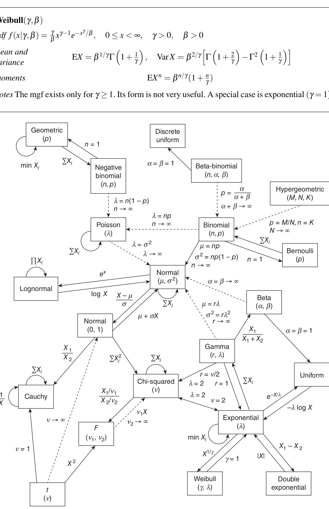

# 第 13 章　后置内容：计算机代数与常用分布表（Back Matter）

原书的后置内容由两部分组成：其一是附录“计算机代数”（Computer Algebra），以若干标注为例 12.6.1–12.6.8 的条目展示计算机代数系统在各章问题中的用法；其二是“常用分布表”（Table of Common Distributions），汇总了全书用到的离散与连续分布的性质，并给出常见分布之间关系的示意图。本章按原顺序译述这两部分内容。

## 13.1 计算机代数（Computer Algebra）

计算机代数系统允许对表达式作符号操作。当我们面对冗长而机械的计算（例如对一个比值求二阶导数）时，它们特别有用。本附录例示在各类问题中使用这类系统的方法。虽然使用计算机代数系统对理解与使用统计绝非必要，但它不仅能减轻繁琐，还能带来新的洞见与更适用的答案。

要认识到：计算机代数系统有很多种，它们可以帮助完成大量计算（求和、积分、模拟等）。本附录的目的不是教如何使用这些系统，也不是展示它们一切可能的用途，而是例示其中一些可能性。

我们用 Mathematica 软件包例示计算。其他软件包（如 Maple）也可用于这些计算。

### 第 1 章

> **例 12.6.1（无序抽样）**
>
> 我们例示用 Mathematica 代码枚举从 $\{2, 4, 9, 12\}$ 有放回抽样的无序结果，如例 1.2.20 所述。枚举结果并计算多项式权重后，对结果与权重排序。注意要生成图 1.2.2 的直方图还需稍多做一些工作：例如有两个不同的结果平均值都是 8，因此要生成类似图 1.2.2 的图，需要把 $\{8, \tfrac{3}{128}\}$ 与 $\{8, \tfrac{3}{64}\}$ 合并成 $\{8, \tfrac{9}{128}\}$。
>
> 当集合中的数多于七个时，这类枚举会非常耗时：$13^7 = 27132$ 个无序结果。
>
> ```mathematica
> In[1]:= Needs["DiscreteMath`Combinatorica`"]
> In[2]:= x = {2,4,9,12};
>         n = Length[x];
>         ncomp = NumberOfCompositions[n,n]
> Out[4]= 35
> In[5]:= w = Compositions[n, n];
>         wt = n!/(Apply[Times, Factorial /@ w, 1]*n^n);
>         avg = w . x/n;
>         Sort[Transpose[{avg, wt}]]
> Out[8]= {{2, 1/256}, {5/2, 1/64}, {3, 3/128}, {7/2, 1/64},
>          {15/4, 1/64}, {4, 1/256}, {17/4, 3/64}, {9/2, 1/64},
>          {19/4, 3/64}, {5, 3/64}, {21/4, 1/64}, {11/2, 3/128},
>          {11/2, 3/64}, {6, 1/64}, {6, 3/64}, {25/4, 3/64},
>          {13/2, 3/128}, {27/4, 3/32}, {7, 3/128}, {29/4, 1/64},
>          {29/4, 3/64}, {15/2, 3/64}, {31/4, 1/64}, {8, 3/128},
>          {8, 3/64}, {17/2, 3/64}, {35/4, 3/64}, {9, 1/256},
>          {37/4, 3/64}, {19/2, 1/64}, {39/4, 1/64}, {10, 1/64},
>          {21/2, 3/128}, {45/4, 1/64}, {12, 1/256}}
> ```
>
> （1）“DiscreteMath”包包含对计数排列与组合有用的函数；不同样本的个数是 $\mathrm{NumberOfCompositions}[n, m] = \binom{n + m - 1}{n}$。
>
> （2）令 $x$ 为数集；
>
> （3）枚举样本（$w$）、计算每个样本的平均值（avg）、并计算每个取值的权重（wt）。权重是与该配置对应的多项式系数。

### 第 2 章

> **例 12.6.2（一元变换）**
>
> 习题 2.1a 是标准的一元变量替换。这类计算对计算机代数程序通常是容易的。
>
> （1）输入 $f(x)$ 并解出变换后的变量：
>
> ```mathematica
> In[1]:= f[x_] := 42*(x^5)*(1 - x)
>         sol = Solve[y == x^3, x]
> Out[2]= {{x -> y^(1/3)}, {x -> -(-1)^(1/3) y^(1/3)},
>          {x -> -(-1)^(2/3) y^(2/3)}}
> ```
>
> （2）计算 Jacobi 行列式：
>
> ```mathematica
> In[3]:= D[x/.sol[[1]], y]
> Out[3]= 2/(3 y^(1/3))
> ```
>
> （3）计算变换后变量的密度：
>
> ```mathematica
> In[4]:= f[x/.sol[[1]]]* D[x/.sol[[1]], y]
> Out[4]= 14 (1 - y^(1/3)) y
> ```

### 第 4 章

> **例 12.6.3（二元变换）**
>
> 我们例示一些二元变换；用类似的代码也可以做多元变换。第一个计算例示例 4.3.4，得到正态变量和的分布；然后做例 4.3.3，对 Beta 密度的乘积作二元变换再边缘化。
>
> （1）正态变量之和。Out[4] 是联合分布，Out[5] 是边缘分布。
>
> ```mathematica
> In[1]:= f[x_,y_] := (1/(2*Pi))*E^(-x^2/2)*E^(-y^2/2)
>         So := Solve[{u==x+y, v==x-y}, {x,y}]
>         g := f[x/.So, y/.So]*
>              Abs[Det[Outer[D, First[{x,y}/.So], {u,v}]]]
>         Simplify[g]
> Out[4]= E^(-(u^2 + v^2)/4)/(4 Pi)
> In[5]:= Integrate[g, {v, 0, Infinity}]
> Out[5]= E^(-(u^2/4))/(4 Sqrt[Pi])
> ```
>
> （2）Beta 变量之积。（“ContinuousDistributions”包包含许多标准分布的 pdf 与 cdf。）Out[10] 是 Beta 变量乘积的联合密度，Out[11] 是 $u$ 的密度。If 语句读作 If(test, true, false)：若测试为真取中间值。多数情形测试为真，边缘密度就是给出的 Beta 密度。
>
> ```mathematica
> In[6]:= Needs["Statistics`ContinuousDistributions`"]
>         Clear[f, g, u, v, x, y, a, b, c]
>         f[x_, y_] := PDF[BetaDistribution[a, b], x]*
>                      PDF[BetaDistribution[a + b, c], y]
>         So := Solve[{u == x*y, v == x}, {x, y}]
>         g[u_, v_] = f[x/.So, y/.So]*
>                     Abs[Det[Outer[D, First[{x, y}/.So], {u, v}]]]
>         Integrate[g[u, v], {v, 0, 1}]
> Out[10]= ((1 - u v)^(-1 + c) (1 - v)^(-1 + b) (u v)^(-1 + a + b)
>           v^(-1 + a))/(Abs[v] Beta[a, b] Beta[a + b, c])
> Out[11]= If[Re[b] > 0 && Re[b + c] < 1 && Im[u] == 0 && u > 0 && u < 1,
>          ((1 - u)^(-1 + b + c) (1/u)^(-1 + b + c) (-u)^c
>           u^(-1 + a + b) Gamma[b] Gamma[1 - b - c])/Gamma[1 - c],
>          Integrate[(1 - u v)^(-1 + c) (1 - v)^(-1 + b) (u v)^(-1 + a + b)
>           v^(-1 + a)/(Abs[v] Beta[a, b] Beta[a + b, c]), {v, 0, 1}]]
> ```

> **例 12.6.4（正态概率）**
>
> 习题 4.14a 要求的计算可以轻松完成。我们先做直接计算：Mathematica 轻松地数值完成积分，但找不到闭式。注意答案以 erf 函数表出，erf 定义为
>
> $$
> \mathrm{erf}(z) = \frac{2}{\sqrt{\pi}} \int_0^z e^{-t^2}\, dt.
> $$
>
> 若把概率用卡方随机变量重新表述，则可以找到闭式。
>
> 建立被积函数与积分限：
>
> ```mathematica
> In[1]:= Needs["Statistics`ContinuousDistributions`"]
>         Clear[f, g, x, y]
>         f[x_, y_] = PDF[NormalDistribution[0, 1], x]*
>                     PDF[NormalDistribution[0, 1], y]
>         g[x_] = Sqrt[1 - x^2]
> Out[3]= E^(-(x^2 + y^2)/2)/(2 Pi)
> ```
>
> 现在计算二重积分，得到 Erf 函数。命令 N[%] 数值求值前一行：
>
> ```mathematica
> In[5]:= Integrate[f[x, y], {x, -1, 1}, {y, -g[x], g[x]}]
>         N[%]
> Out[5]= Integrate[(E^(-(x^2/2)) Erf[Sqrt[1 - x^2]/Sqrt[2]])/Sqrt[2 Pi],
>                   {x, -1, 1}]
> Out[6]= 0.393469
> ```
>
> 我们当然知道 $X^2 + Y^2$ 是自由度为 2 的卡方随机变量；用这一事实可得到闭式答案：
>
> ```mathematica
> In[7]:= Clear[f, t]
>         f[t_] = PDF[ChiSquareDistribution[2], t];
>         Integrate[f[t], {t, 0, 1}]
>         N[%]
> Out[10]= (1/2) (2 - Sqrt[2/E])
> Out[11]= 0.393469
> ```

### 第 5 章

> **例 12.6.5（和的密度）**
>
> 例 5.2.10 所做的计算（例示定理 5.2.9）相当繁琐。我们在三种情形例示这类计算：正态、Cauchy 与 Student $t$。
>
> 有两点值得注意。
>
> （1）要正确解释答案，可能需要一些复分析知识。正态情形的答案是附加条件的，条件是（可能取复值的）变量 $z$ 的实部；Cauchy 例子中重要的是 $I^2 = -1$，于是
>
> $$
> \frac{2}{\pi(-2I + z)(2I + z)} = \frac{2}{\pi(4 + z^2)}.
> $$
>
> （2）给 Student $t$ 变量求和时，经验观察是：若自由度之和为偶数，则存在闭式；否则积分必须数值完成。（这是我们摆弄计算机代数系统时发现的经验观察。）
>
> 还要注意：较新版本的计算机代数程序可能在这里避免复数；但它们会在别的计算中出现，所以最好准备好与它们打交道。
>
> （1）两个正态之和的密度：
>
> ```mathematica
> In[1]:= Clear[f, x, y, z]
>         f[x_] = E^(-x^2/2)/(2 Pi);
>         Integrate[f[y]*f[z - y], {y, -Infinity, Infinity}]
> Out[3]= If[Re[z] < 0, E^(-(z^2/4))/(2 Pi),
>          Integrate[E^(-(y^2/2))/Sqrt[2 Pi] E^(-((-y + z)^2/2))/Sqrt[2 Pi],
>                    {y, -Infinity, Infinity}]]
> ```
>
> （2）两个 Cauchy 之和的密度：
>
> ```mathematica
> In[4]:= Clear[f, x, y, z]
>         f[x_] = 1/(Pi*(1 + x^2));
>         Integrate[f[y]*f[z - y], {y, -Infinity, Infinity}]
> Out[6]= 2/(Pi (-2 I + z) (2 I + z))
> ```
>
> （3）自由度为 5 的两个 $t$ 之和的密度：
>
> ```mathematica
> In[7]:= Needs["Statistics`ContinuousDistributions`"]
>         Clear[f, x, y, z]
>         f[x_] = PDF[StudentTDistribution[5], x];
>         Integrate[f[y]*f[z - y], {y, -Infinity, Infinity}]
> Out[10]= 400 Sqrt[5] (8400 + 120 z^2 + z^4)/(3 Pi (20 + z^2)^5)
> ```

> **例 12.6.6（均匀和的四阶矩）**
>
> 习题 5.51 要求 12 个均匀随机变量之和的四阶矩。由于密度的分段性质，推导密度有些痛苦（但也可以用计算机代数完成）。不过用 mgf 可以简化。
>
> （1）先算 $X_1$（均匀随机变量）的 mgf，再算 $\sum_{i=1}^{12} X_i$（诸 $X_i$ 独立）的 mgf：
>
> ```mathematica
> In[1]:= M[t_] = Integrate[Exp[t*x], {x, 0, 1}]
> In[2]:= Msum[t_] = M[t]^12
> Out[1]= (-1 + E^t)/t
> Out[2]= (-1 + E^t)^12 / t^12
> ```
>
> （2）计算 $\sum_{i=1}^{12} X_i - 6$ 的 mgf 的四阶导数。它太大，不便打印：
>
> ```mathematica
> In[3]:= g[t_] = D[Exp[-6*t]*Msum[t], {t, 4}];
> ```
>
> （3）$g[0]$ 就是四阶矩；但直接代入 0 会导致除零，因此必须用极限计算：
>
> ```mathematica
> In[4]:= g[0]
>         Power::infy: Infinite expression 1/0^16 encountered.
> In[5]:= Limit[g[t], t -> 0]
> Out[5]= 29/10
> ```

### 第 7 章

> **例 12.6.7（gamma 均值的 ARE）**
>
> 例 10.1.18 所做的计算（产生图 10.1.1）是在 Mathematica 中完成的。下面的代码将产生一幅 ARE 图。
>
> （1）符号化地取对数似然的二阶导数：
>
> ```mathematica
> In[1]:= Needs["Statistics`ContinuousDistributions`"]
>         Clear[m, b, x]
>         f[x_, m_, b_] = PDF[GammaDistribution[m/b, b], x];
>         loglike2[m_, b_, x_] = D[Log[f[x, m, b]], {m, 2}];
> ```
>
> （2）通过对该二阶导数关于密度积分来计算渐近方差：
>
> ```mathematica
> In[5]:= var[m_, b_] := 1/(-Integrate[loglike2[m, b, x]*f[x, m, b],
>                                     {x, 0, Infinity}])
> ```
>
> （3）下面的代码建立绘图：
>
> ```mathematica
> In[6]:= mu = {1, 2, 3, 4, 6, 8, 10};
>         beta = 5;
>         mlevar = Table[var[mu[[i]], beta], {i, 1, 7}];
>         momvar = Table[mu[[i]]*beta, {i, 1, 7}];
>         ARE = momvar/mlevar
> Out[10]= {5.25348, 2.91014, 2.18173, 1.83958, 1.52085, 1.37349, 1.28987}
> In[11]:= ListPlot[Transpose[{mu, ARE}], PlotJoined -> True,
>           PlotRange -> {{0, mu[[7]]}, {0, 8}},
>           AxesLabel -> {"Gamma mean", "ARE"}]
> ```

### 第 9 章

> **例 12.6.8（卡方 mgf 的极限）**
>
> 习题 9.30 (b) 中极限分布的计算是精细的，但在 Mathematica 中相当直接。
>
> （1）先算自由度为 $n$ 的卡方随机变量的 mgf。（当然这一步其实并非必要。）
>
> ```mathematica
> In[1]:= Needs["Statistics`ContinuousDistributions`"]
>         f[x_] = PDF[ChiSquareDistribution[n], x];
>         Integrate[Exp[t*x]*f[x], {x, 0, Infinity}]
> Out[3]= (2^(n/2) If[Re[n] > 0 && Re[t] < 1/2,
>          (1/2 - t)^(-(n/2)) Gamma[n/2],
>          Integrate[E^(-(x/2) + t x) x^(-1 + n/2), {x, 0, Infinity}]])
>         / Gamma[n/2]
> ```
>
> （2）由于检验条件满足，$\chi^2_n$ 的 mgf 是中间项。现在取 $\chi^2_n$ 标准化量 $\frac{\chi_n^2 - n}{\sqrt{2n}}$ 的 mgf 的极限：
>
> ```mathematica
> In[4]:= M[t_] = (1 - 2*t)^(-n/2);
>         Limit[Exp[-n*t/Sqrt[2*n]]*M[t/Sqrt[2*n]], n -> Infinity]
> Out[5]= E^(t^2/2)
> ```

## 13.2 常用分布表（Table of Common Distributions）

本节汇总原书的常用分布表。表中列出每个分布的 pmf/pdf、均值与方差、矩母函数（若有）以及有用的注记。记号与全书一致。

### 离散分布

> **定义 Bernoulli($p$)**
>
> **pmf：**$P(X = x \mid p) = p^x (1 - p)^{1 - x}$，$x = 0, 1$；$0 \leq p \leq 1$。
>
> **均值与方差：**$\mathrm{E} X = p$，$\mathrm{Var} X = p(1 - p)$。
>
> **mgf：**$M_X(t) = (1 - p) + p e^t$。

> **定义 Binomial($n, p$)**
>
> **pmf：**$P(X = x \mid n, p) = \binom{n}{x} p^x (1 - p)^{n - x}$，$x = 0, 1, 2, \ldots, n$；$0 \leq p \leq 1$。
>
> **均值与方差：**$\mathrm{E} X = np$，$\mathrm{Var} X = np(1 - p)$。
>
> **mgf：**$M_X(t) = \bigl[ p e^t + (1 - p) \bigr]^n$。
>
> **注记：**与二项定理（定理 3.2.2）相关。多项分布（定义 4.6.2）是二项分布的多元版本。

> **定义 离散均匀（Discrete Uniform）**
>
> **pmf：**$P(X = x \mid N) = \dfrac{1}{N}$，$x = 1, 2, \ldots, N$；$N = 1, 2, \ldots$。
>
> **均值与方差：**$\mathrm{E} X = \dfrac{N + 1}{2}$，$\mathrm{Var} X = \dfrac{(N + 1)(N - 1)}{12}$。
>
> **mgf：**$M_X(t) = \dfrac{1}{N} \sum_{i=1}^{N} e^{it}$。

> **定义 Geometric($p$)**
>
> **pmf：**$P(X = x \mid p) = p (1 - p)^{x - 1}$，$x = 1, 2, \ldots$；$0 \leq p \leq 1$。
>
> **均值与方差：**$\mathrm{E} X = \dfrac{1}{p}$，$\mathrm{Var} X = \dfrac{1 - p}{p^2}$。
>
> **mgf：**$M_X(t) = \dfrac{p e^t}{1 - (1 - p) e^t}$，$t < -\log(1 - p)$。
>
> **注记：**$Y = X - 1$ 服从 negative binomial$(1, p)$。该分布是无记忆的：$P(X > s \mid X > t) = P(X > s - t)$。

> **定义 Hypergeometric（超几何）**
>
> **pmf：**$P(X = x \mid N, M, K) = \dfrac{\binom{M}{x} \binom{N - M}{K - x}}{\binom{N}{K}}$；$x = 0, 1, 2, \ldots, K$；$M - (N - K) \leq x \leq M$；$N, M, K \geq 0$。
>
> **均值与方差：**$\mathrm{E} X = \dfrac{KM}{N}$，$\mathrm{Var} X = \dfrac{KM}{N}\, \dfrac{(N - M)(N - K)}{N(N - 1)}$。
>
> **注记：**若 $K \ll M$ 且 $K \ll N$，则取值范围 $x = 0, 1, 2, \ldots, K$ 是合适的。

> **定义 Negative binomial($r, p$)**
>
> **pmf：**$P(X = x \mid r, p) = \dbinom{r + x - 1}{x} p^r (1 - p)^x$；$x = 0, 1, \ldots$；$0 \leq p \leq 1$。
>
> **均值与方差：**$\mathrm{E} X = \dfrac{r(1 - p)}{p}$，$\mathrm{Var} X = \dfrac{r(1 - p)}{p^2}$。
>
> **mgf：**$M_X(t) = \Bigl( \dfrac{p}{1 - (1 - p) e^t} \Bigr)^{\! r}$，$t < -\log(1 - p)$。
>
> **注记：**pmf 的另一形式为 $P(Y = y \mid r, p) = \dbinom{y - 1}{r - 1} p^r (1 - p)^{y - r}$，$y = r, r + 1, \ldots$；随机变量 $Y = X + r$。负二项分布可以导出为 Poisson 的 gamma 混合（见习题 4.32）。

> **定义 Poisson($\lambda$)**
>
> **pmf：**$P(X = x \mid \lambda) = e^{-\lambda} \dfrac{\lambda^x}{x!}$，$x = 0, 1, \ldots$；$0 \leq \lambda < \infty$。
>
> **均值与方差：**$\mathrm{E} X = \lambda$，$\mathrm{Var} X = \lambda$。
>
> **mgf：**$M_X(t) = e^{\lambda (e^t - 1)}$。

### 连续分布

> **定义 Beta($\alpha, \beta$)**
>
> **pdf：**$f(x \mid \alpha, \beta) = \dfrac{1}{\mathrm{Beta}(\alpha, \beta)}\, x^{\alpha - 1} (1 - x)^{\beta - 1}$，$0 \leq x \leq 1$；$\alpha > 0$，$\beta > 0$。
>
> **均值与方差：**$\mathrm{E} X = \dfrac{\alpha}{\alpha + \beta}$，$\mathrm{Var} X = \dfrac{\alpha \beta}{(\alpha + \beta)^2 (\alpha + \beta + 1)}$。
>
> **mgf：**$M_X(t) = 1 + \displaystyle\sum_{k=1}^{\infty} \Bigl[ \prod_{r=0}^{k - 1} \dfrac{\alpha + r}{\alpha + \beta + r} \Bigr] \dfrac{t^k}{k!}$。
>
> **注记：**beta pdf 中的常数可以用 gamma 函数定义：$\mathrm{Beta}(\alpha, \beta) = \dfrac{\Gamma(\alpha) \Gamma(\beta)}{\Gamma(\alpha + \beta)}$。方程 (3.3.18) 给出矩的一般表达式。

> **定义 Cauchy($\theta, \sigma$)**
>
> **pdf：**$f(x \mid \theta, \sigma) = \dfrac{1}{\pi \sigma}\, \dfrac{1}{1 + \bigl( \frac{x - \theta}{\sigma} \bigr)^2}$，$-\infty < x < \infty$；$-\infty < \theta < \infty$，$\sigma > 0$。
>
> **均值与方差：**不存在。
>
> **mgf：**不存在。
>
> **注记：**Student $t$ 的特例（自由度 $= 1$）。此外，若 $X$ 与 $Y$ 独立 $n(0, 1)$，则 $X / Y$ 服从 Cauchy 分布。

> **定义 Chi squared（卡方）**
>
> **pdf：**$f(x \mid p) = \dfrac{1}{\Gamma(p/2) 2^{p/2}}\, x^{(p/2) - 1} e^{-x/2}$，$0 \leq x < \infty$；$p = 1, 2, \ldots$。
>
> **均值与方差：**$\mathrm{E} X = p$，$\mathrm{Var} X = 2p$。
>
> **mgf：**$M_X(t) = \Bigl( \dfrac{1}{1 - 2t} \Bigr)^{\! p/2}$，$t < \dfrac{1}{2}$。
>
> **注记：**gamma 分布的特例。

> **定义 Double exponential（双指数）$(\mu, \sigma)$**
>
> **pdf：**$f(x \mid \mu, \sigma) = \dfrac{1}{2\sigma} e^{-|x - \mu|/\sigma}$，$-\infty < x < \infty$；$-\infty < \mu < \infty$，$\sigma > 0$。
>
> **均值与方差：**$\mathrm{E} X = \mu$，$\mathrm{Var} X = 2\sigma^2$。
>
> **mgf：**$M_X(t) = \dfrac{e^{\mu t}}{1 - (\sigma t)^2}$，$|t| < \dfrac{1}{\sigma}$。
>
> **注记：**也称 Laplace 分布。

> **定义 Exponential($\beta$)**
>
> **pdf：**$f(x \mid \beta) = \dfrac{1}{\beta} e^{-x/\beta}$，$0 \leq x < \infty$；$\beta > 0$。
>
> **均值与方差：**$\mathrm{E} X = \beta$，$\mathrm{Var} X = \beta^2$。
>
> **mgf：**$M_X(t) = \dfrac{1}{1 - \beta t}$，$t < \dfrac{1}{\beta}$。
>
> **注记：**gamma 分布的特例，具有无记忆性。有许多特例：$Y = X^{1/\gamma}$ 是 Weibull，$Y = 2X/\beta$ 是 Rayleigh，$Y = \alpha - \gamma \log(X/\beta)$ 是 Gumbel。

> **定义 $F$（$F_{\nu_1, \nu_2}$，$\nu_1, \nu_2 = 1, \ldots$）**
>
> **pdf：**
>
> $$
> f(x \mid \nu_1, \nu_2) = \frac{\Gamma\bigl( \frac{\nu_1 + \nu_2}{2} \bigr) \bigl( \frac{\nu_1}{\nu_2} \bigr)^{\nu_1/2}}{\Gamma\bigl( \frac{\nu_1}{2} \bigr) \Gamma\bigl( \frac{\nu_2}{2} \bigr)}\, \frac{x^{(\nu_1 - 2)/2}}{\Bigl( 1 + \frac{\nu_1}{\nu_2} x \Bigr)^{(\nu_1 + \nu_2)/2}},
> \qquad 0 \leq x < \infty.
> $$
>
> **均值与方差：**$\mathrm{E} X = \dfrac{\nu_2}{\nu_2 - 2}$（$\nu_2 > 2$）；$\mathrm{Var} X = \dfrac{2 \nu_2^2 (\nu_1 + \nu_2 - 2)}{\nu_1 (\nu_2 - 2)^2 (\nu_2 - 4)}$（$\nu_2 > 4$）。
>
> **矩：**$\mathrm{E} X^n = \Bigl( \dfrac{\nu_2}{\nu_1} \Bigr)^{\! n} \dfrac{\Gamma\bigl( \frac{\nu_1}{2} + n \bigr) \Gamma\bigl( \frac{\nu_2}{2} - n \bigr)}{\Gamma\bigl( \frac{\nu_1}{2} \bigr) \Gamma\bigl( \frac{\nu_2}{2} \bigr)}$，$n < \dfrac{\nu_2}{2}$（mgf 不存在）。
>
> **注记：**与卡方相关（$F_{\nu_1, \nu_2} = \frac{\chi^2_{\nu_1}/\nu_1}{\chi^2_{\nu_2}/\nu_2}$，其中两个卡方独立），也与 $t$ 相关（$F_{1, \nu} = t_{\nu}^2$）。

> **定义 Gamma($\alpha, \beta$)**
>
> **pdf：**$f(x \mid \alpha, \beta) = \dfrac{1}{\Gamma(\alpha) \beta^{\alpha}}\, x^{\alpha - 1} e^{-x/\beta}$，$0 \leq x < \infty$；$\alpha, \beta > 0$。
>
> **均值与方差：**$\mathrm{E} X = \alpha \beta$，$\mathrm{Var} X = \alpha \beta^2$。
>
> **mgf：**$M_X(t) = \Bigl( \dfrac{1}{1 - \beta t} \Bigr)^{\! \alpha}$，$t < \dfrac{1}{\beta}$。
>
> **注记：**特例有 exponential（$\alpha = 1$）与卡方（$\alpha = p/2$，$\beta = 2$）。若 $\alpha = \frac{3}{2}$，$Y = X/\beta$ 服从 Maxwell 分布；$Y = 1/X$ 服从逆 gamma 分布。也可以与 Poisson 联系（例 3.3.1）。

> **定义 Logistic($\mu, \beta$)**
>
> **pdf：**$f(x \mid \mu, \beta) = \dfrac{1}{\beta}\, \dfrac{e^{-(x - \mu)/\beta}}{\bigl[ 1 + e^{-(x - \mu)/\beta} \bigr]^2}$，$-\infty < x < \infty$；$-\infty < \mu < \infty$，$\beta > 0$。
>
> **均值与方差：**$\mathrm{E} X = \mu$，$\mathrm{Var} X = \dfrac{\pi^2 \beta^2}{3}$。
>
> **mgf：**$M_X(t) = e^{\mu t} \Gamma(1 - \beta t) \Gamma(1 + \beta t)$，$|t| < \dfrac{1}{\beta}$。
>
> **注记：**cdf 由 $F(x \mid \mu, \beta) = \dfrac{1}{1 + e^{-(x - \mu)/\beta}}$ 给出。

> **定义 Lognormal（对数正态）$(\mu, \sigma^2)$**
>
> **pdf：**$f(x \mid \mu, \sigma^2) = \dfrac{1}{\sqrt{2\pi}\, \sigma}\, \dfrac{e^{-\left[ (\log x - \mu)^2 / (2 \sigma^2) \right]}}{x}$，$0 \leq x < \infty$；$-\infty < \mu < \infty$，$\sigma > 0$。
>
> **均值与方差：**$\mathrm{E} X = e^{\mu + (\sigma^2/2)}$，$\mathrm{Var} X = e^{2(\mu + \sigma^2)} - e^{2\mu + \sigma^2}$。
>
> **矩：**$\mathrm{E} X^n = e^{n\mu + n^2 \sigma^2/2}$（mgf 不存在）。
>
> **注记：**例 2.3.10 给出了另一个具有相同矩的分布。

> **定义 Normal（正态）$(\mu, \sigma^2)$**
>
> **pdf：**$f(x \mid \mu, \sigma^2) = \dfrac{1}{\sqrt{2\pi}\, \sigma}\, e^{-(x - \mu)^2/(2\sigma^2)}$，$-\infty < x < \infty$；$-\infty < \mu < \infty$，$\sigma > 0$。
>
> **均值与方差：**$\mathrm{E} X = \mu$，$\mathrm{Var} X = \sigma^2$。
>
> **mgf：**$M_X(t) = e^{\mu t + \sigma^2 t^2/2}$。
>
> **注记：**有时称为 Gaussian 分布。

> **定义 Pareto($\alpha, \beta$)**
>
> **pdf：**$f(x \mid \alpha, \beta) = \dfrac{\beta\, \alpha^{\beta}}{x^{\beta + 1}}$，$\alpha < x < \infty$；$\alpha > 0$，$\beta > 0$。
>
> **均值与方差：**$\mathrm{E} X = \dfrac{\beta \alpha}{\beta - 1}$（$\beta > 1$）；$\mathrm{Var} X = \dfrac{\beta \alpha^2}{(\beta - 1)^2 (\beta - 2)}$（$\beta > 2$）。
>
> **mgf：**不存在。

> **定义 $t$（$t_\nu$，$\nu = 1, \ldots$）**
>
> **pdf：**$f(x \mid \nu) = \dfrac{\Gamma\bigl( \frac{\nu + 1}{2} \bigr)}{\Gamma\bigl( \frac{\nu}{2} \bigr)\, \sqrt{\nu \pi}}\, \Bigl( 1 + \dfrac{x^2}{\nu} \Bigr)^{-(\nu + 1)/2}$，$-\infty < x < \infty$。
>
> **均值与方差：**$\mathrm{E} X = 0$（$\nu > 1$）；$\mathrm{Var} X = \dfrac{\nu}{\nu - 2}$（$\nu > 2$）。
>
> **矩：**$\mathrm{E} X^n = \dfrac{\nu^{n/2}\, \Gamma\bigl( \frac{n + 1}{2} \bigr) \Gamma\bigl( \frac{\nu - n}{2} \bigr)}{\sqrt{\pi}\, \Gamma\bigl( \frac{\nu}{2} \bigr)}$（$n < \nu$ 且 $n$ 为偶数）；$\mathrm{E} X^n = 0$（$n < \nu$ 且 $n$ 为奇数）。（mgf 不存在。）
>
> **注记：**与 $F$ 相关（$F_{1, \nu} = t_{\nu}^2$）。

> **定义 Uniform（均匀）$(a, b)$**
>
> **pdf：**$f(x \mid a, b) = \dfrac{1}{b - a}$，$a \leq x \leq b$。
>
> **均值与方差：**$\mathrm{E} X = \dfrac{a + b}{2}$，$\mathrm{Var} X = \dfrac{(b - a)^2}{12}$。
>
> **mgf：**$M_X(t) = \dfrac{e^{bt} - e^{at}}{(b - a) t}$。
>
> **注记：**若 $a = 0$、$b = 1$，这是 beta 分布的特例（$\alpha = \beta = 1$）。

> **定义 Weibull($\gamma, \beta$)**
>
> **pdf：**$f(x \mid \gamma, \beta) = \dfrac{\gamma}{\beta}\, x^{\gamma - 1} e^{-x^{\gamma}/\beta}$，$0 \leq x < \infty$；$\gamma > 0$，$\beta > 0$。
>
> **均值与方差：**$\mathrm{E} X = \beta^{1/\gamma}\, \Gamma\Bigl( 1 + \dfrac{1}{\gamma} \Bigr)$；$\mathrm{Var} X = \beta^{2/\gamma} \Bigl[ \Gamma\Bigl( 1 + \dfrac{2}{\gamma} \Bigr) - \Gamma^2\Bigl( 1 + \dfrac{1}{\gamma} \Bigr) \Bigr]$。
>
> **矩：**$\mathrm{E} X^n = \beta^{n/\gamma}\, \Gamma\Bigl( 1 + \dfrac{n}{\gamma} \Bigr)$。
>
> **注记：**mgf 仅当 $\gamma \geq 1$ 时存在，其形式不太有用。特例：exponential（$\gamma = 1$）。

### 常见分布之间的关系

原书末页给出了常见分布之间关系的示意图（图 13.1）。实线表示变换与特例，虚线表示极限关系。



*图 13.1　 常见分布之间的关系。实线表示变换与特例，虚线表示极限。改编自 Leemis (1986)（原书附录示意图）*

图中主要关系包括（沿用原书参数记号，其中 $\lambda$、$l$ 表示尺度/率参数，$m$、$s$ 表示位置/尺度参数）：

- 离散分支：Bernoulli($p$)（$n = 1$）是 Binomial($n, p$) 的特例；Binomial 在 $n \to \infty$、$l = np$ 时极限为 Poisson($l$)；Geometric($p$) 是 Negative binomial($n, p$) 在 $n = 1$ 的特例，而 Negative binomial 的 $l = n(1 - p)$、$n \to \infty$ 时也极限为 Poisson；Binomial 当 $p = \frac{a}{a + b}$、$a + b \to \infty$ 时与 Beta-binomial($n, a, b$) 相关，$p = M/N$、$N \to \infty$ 时通向 Hypergeometric($M, N, K$)；Binomial 对 $\sum X_i$ 求和给出与 Poisson 的联系（$l \to \infty$、$s^2 = np(1 - p)$ 等）。

- 连续分支：Gamma($r, l$) 在 $r = n/2$、$l = 2$ 时给出 Chi-squared($n$)；$r = 1$ 时给出 Exponential($l$)；$\sum X_i^2$ 给出卡方；$e^{-X/l}$ 由 Exponential 给出；Exponential 经 $\min X_i$、$X_1/g$（$g = 1$）等变换给出 Weibull($g, l$) 与其他分布；$F(n_1, n_2)$ 由 $X_1/n_1$ 与 $X_2/n_2$ 之比给出（$n_2 \to \infty$ 时极限到卡方方向），$n = 1$ 时与 Cauchy 相连（$1/X$ 型变换）；$t(n)$ 与正态及 Cauchy 通过 $n \to \infty$、$n = 1$ 相连；Gamma 经 $\sum X_i$（$r \to \infty$，$m = rl$，$s^2 = rl^2$）极限为 Normal($m, s^2$)；Beta($a, b$) 经 $a = b \to \infty$ 极限为正态，$\frac{X_1}{X_1 + X_2}$（$a = b = 1$）等变换联系均匀分布；Normal 经 $m + sX$、$\log X$、$X - m$、$e^X$ 等变换与 Lognormal、均匀等相连；Double exponential 经 $|X|$、$X_1 - X_2$ 等变换与正态相关。

---

[← 上一章](12_Regression_Models.md) ｜ [目录](README.md)
